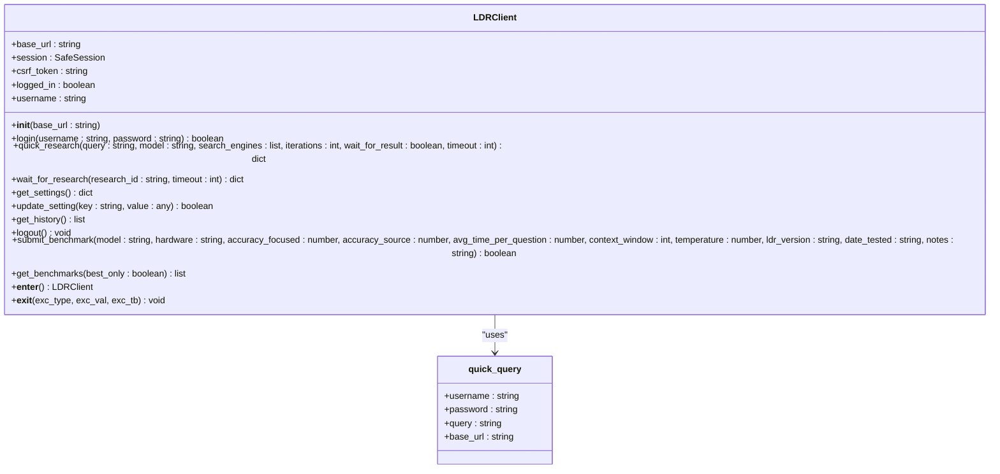
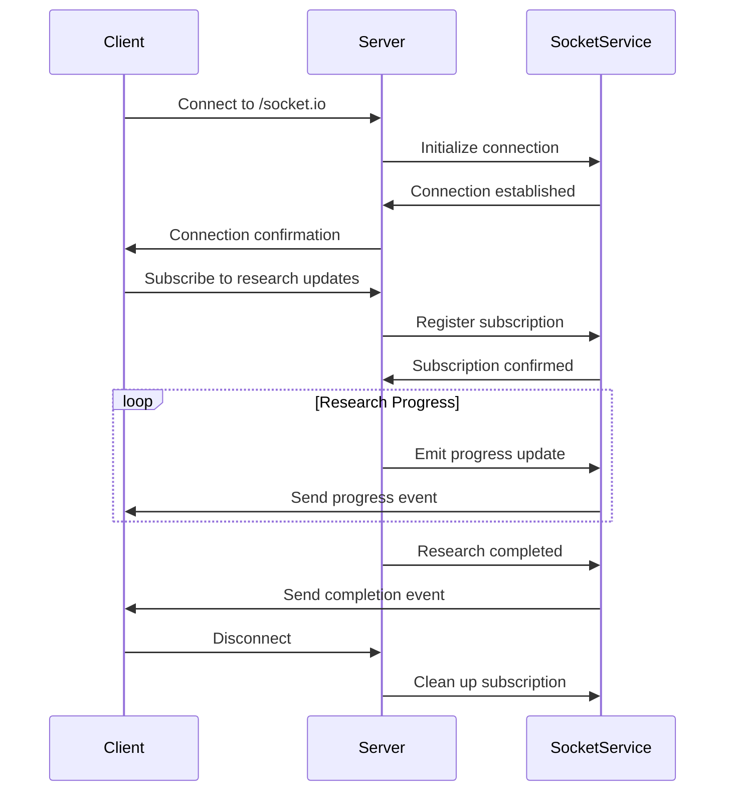
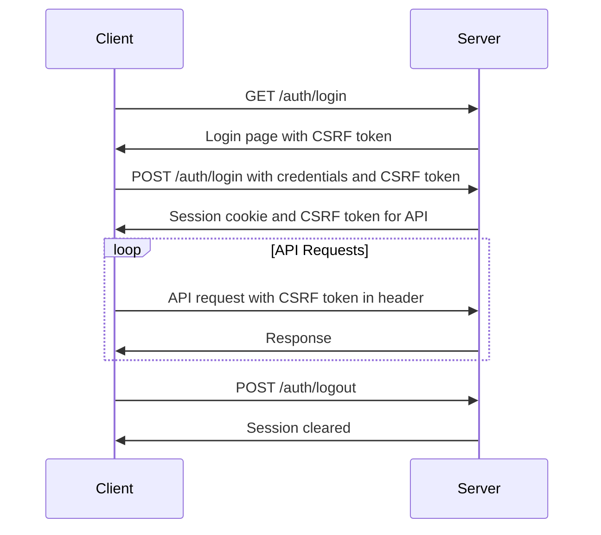

# API Reference

<cite>
**Referenced Files in This Document**   
- [__init__.py](file://src/local_deep_research/api/__init__.py)
- [client.py](file://src/local_deep_research/api/client.py)
- [research_functions.py](file://src/local_deep_research/api/research_functions.py)
- [benchmark_functions.py](file://src/local_deep_research/api/benchmark_functions.py)
- [api.py](file://src/local_deep_research/web/api.py)
- [socket_service.py](file://src/local_deep_research/web/services/socket_service.py)
- [benchmark_service.py](file://src/local_deep_research/benchmarks/web_api/benchmark_service.py)
</cite>

## Table of Contents
1. [Introduction](#introduction)
2. [REST API Endpoints](#rest-api-endpoints)
3. [Programmatic API](#programmatic-api)
4. [WebSocket Events](#websocket-events)
5. [Authentication and Security](#authentication-and-security)
6. [Error Handling](#error-handling)
7. [Rate Limiting](#rate-limiting)
8. [Examples](#examples)
9. [Client Implementation Guidelines](#client-implementation-guidelines)
10. [Performance Optimization](#performance-optimization)

## Introduction
The Local Deep Research (LDR) system provides a comprehensive API for programmatic access to its research capabilities. This API allows users to initiate research queries, monitor progress in real-time, retrieve results, and manage settings through both REST endpoints and a Python client library. The system supports various research modes including quick summaries, detailed reports, and document analysis in local collections.

The API is designed to be developer-friendly with clear endpoints, consistent response formats, and comprehensive error handling. It supports both authenticated and unauthenticated access with appropriate security measures in place. Real-time progress updates are provided through WebSocket connections, enabling applications to provide live feedback to users during research processes.

**Section sources**
- [__init__.py](file://src/local_deep_research/api/__init__.py#L1-L48)
- [api.py](file://src/local_deep_research/web/api.py#L1-L457)

## REST API Endpoints

### API Overview
The REST API is accessible under the `/api/v1/` prefix and provides endpoints for various research operations. The API follows standard HTTP conventions with appropriate status codes and JSON responses.

```mermaid
graph TD
A[API Client] --> B[HTTP Request]
B --> C{API Endpoint}
C --> D[/api/v1/quick_summary]
C --> E[/api/v1/generate_report]
C --> F[/api/v1/analyze_documents]
C --> G[/api/v1/health]
D --> H[Quick Research Summary]
E --> I[Comprehensive Report]
F --> J[Document Analysis]
G --> K[Health Check]
H --> L[JSON Response]
I --> L
J --> L
K --> L
L --> M[API Client]
```

**Diagram sources**
- [api.py](file://src/local_deep_research/web/api.py#L1-L457)

### Endpoint Details

#### Health Check
**URL**: `GET /api/v1/health`  
**Authentication**: Not required  
**Description**: Returns the health status of the API service.

**Response**:
```json
{
  "status": "ok",
  "message": "API is running",
  "timestamp": 1700000000.0
}
```

#### Quick Summary
**URL**: `POST /api/v1/quick_summary`  
**Authentication**: Required  
**Description**: Generates a quick research summary for a given query.

**Request Body**:
```json
{
  "query": "string",
  "search_tool": "string",
  "iterations": "integer",
  "temperature": "number"
}
```

**Parameters**:
- **query** (required): The research query to analyze
- **search_tool** (optional): Search engine to use (e.g., "searxng", "wikipedia")
- **iterations** (optional): Number of search iterations (default: 1)
- **temperature** (optional): LLM temperature for generation (default: 0.7)

**Response**:
```json
{
  "summary": "string",
  "findings": [],
  "iterations": "integer",
  "questions": {},
  "formatted_findings": "string",
  "sources": []
}
```

**Status Codes**:
- 200: Success
- 400: Missing required parameters
- 401: Authentication required
- 500: Internal server error

#### Generate Report
**URL**: `POST /api/v1/generate_report`  
**Authentication**: Required  
**Description**: Generates a comprehensive research report for a given query.

**Request Body**:
```json
{
  "query": "string",
  "output_file": "string",
  "searches_per_section": "integer",
  "model_name": "string",
  "temperature": "number"
}
```

**Parameters**:
- **query** (required): The research query to analyze
- **output_file** (optional): Path to save the report markdown file
- **searches_per_section** (optional): Number of searches per report section (default: 1)
- **model_name** (optional): LLM model to use
- **temperature** (optional): LLM temperature for generation (default: 0.7)

**Response**:
```json
{
  "content": "string",
  "metadata": {},
  "file_path": "string"
}
```

#### Analyze Documents
**URL**: `POST /api/v1/analyze_documents`  
**Authentication**: Required  
**Description**: Searches and analyzes documents in a specified local collection.

**Request Body**:
```json
{
  "query": "string",
  "collection_name": "string",
  "max_results": "integer",
  "temperature": "number",
  "force_reindex": "boolean"
}
```

**Parameters**:
- **query** (required): The search query
- **collection_name** (required): Name of the local document collection
- **max_results** (optional): Maximum number of results to return (default: 10)
- **temperature** (optional): LLM temperature for summary generation (default: 0.7)
- **force_reindex** (optional): Whether to force reindexing the collection

**Response**:
```json
{
  "summary": "string",
  "documents": [],
  "collection": "string",
  "document_count": "integer"
}
```

**Section sources**
- [api.py](file://src/local_deep_research/web/api.py#L98-L457)

## Programmatic API

### Client Library
The LDR system provides a Python client library for programmatic access to its API. The client handles authentication, session management, and request formatting automatically.



**Diagram sources**
- [client.py](file://src/local_deep_research/api/client.py#L65-L489)

### Core Functions
The programmatic API provides several functions for different research scenarios:

#### quick_summary
Generates a quick research summary for a given query.

**Parameters**:
- **query** (str): The research query to analyze
- **research_id** (Optional[Union[int, str]]): Research ID for tracking metrics
- **retrievers** (Optional[Dict[str, Any]]): Custom search engines to use
- **llms** (Optional[Dict[str, Any]]): Custom language models to use
- **provider** (Optional[str]): LLM provider to use
- **api_key** (Optional[str]): API key for the provider
- **temperature** (Optional[float]): LLM temperature (0.0-1.0)
- **max_search_results** (Optional[int]): Maximum number of search results
- **settings** (Optional[Dict[str, Any]]): Base settings to use
- **settings_override** (Optional[Dict[str, Any]]): Settings to override

**Returns**: Dictionary containing research results with summary, findings, iterations, and questions.

#### generate_report
Generates a comprehensive, structured research report.

**Parameters**:
- **query** (str): The research query to analyze
- **output_file** (Optional[str]): Path to save report markdown file
- **progress_callback** (Optional[Callable]): Callback for progress updates
- **searches_per_section** (int): Number of searches per report section
- **retrievers** (Optional[Dict[str, Any]]): Custom search engines
- **llms** (Optional[Dict[str, Any]]): Custom language models
- **provider** (Optional[str]): LLM provider
- **api_key** (Optional[str]): API key for the provider
- **temperature** (Optional[float]): LLM temperature
- **max_search_results** (Optional[int]): Maximum search results
- **settings** (Optional[Dict[str, Any]]): Base settings
- **settings_override** (Optional[Dict[str, Any]]): Settings to override

**Returns**: Dictionary with report content, metadata, and file path if saved.

#### detailed_research
Performs detailed research with comprehensive analysis.

**Parameters**:
- **query** (str): The research query to analyze
- **research_id** (Optional[Union[int, str]]): Research ID for tracking
- **retrievers** (Optional[Dict[str, Any]]): Custom search engines
- **llms** (Optional[Dict[str, Any]]): Custom language models
- **kwargs**: Additional configuration for the search system

**Returns**: Dictionary with detailed research results including query, research_id, summary, findings, iterations, questions, formatted_findings, sources, and metadata.

#### analyze_documents
Searches and analyzes documents in a local collection.

**Parameters**:
- **query** (str): The search query
- **collection_name** (str): Name of the local document collection
- **max_results** (int): Maximum results to return (default: 10)
- **temperature** (float): LLM temperature for summary generation (default: 0.7)
- **force_reindex** (bool): Whether to force reindexing (default: False)
- **output_file** (Optional[str]): Path to save analysis results

**Returns**: Dictionary with summary, documents, collection name, document count, and file path if saved.

**Section sources**
- [__init__.py](file://src/local_deep_research/api/__init__.py#L6-L47)
- [research_functions.py](file://src/local_deep_research/api/research_functions.py#L1-L658)

## WebSocket Events

### Real-time Progress Updates
The LDR system provides real-time progress updates through WebSocket connections. This allows clients to monitor the status of ongoing research operations and display progress to users.



**Diagram sources**
- [socket_service.py](file://src/local_deep_research/web/services/socket_service.py#L1-L263)
- [benchmark_service.py](file://src/local_deep_research/benchmarks/web_api/benchmark_service.py#L1-L200)

### Event Types
The WebSocket service emits several types of events for different research stages:

#### research_progress_{research_id}
Emitted periodically during research to provide progress updates.

**Payload**:
```json
{
  "progress": "number",
  "message": "string",
  "status": "string",
  "log_entry": {}
}
```

#### research_completed_{research_id}
Emitted when research is successfully completed.

**Payload**:
```json
{
  "research_id": "string",
  "status": "completed",
  "result": {}
}
```

#### research_failed_{research_id}
Emitted when research fails due to an error.

**Payload**:
```json
{
  "research_id": "string",
  "status": "failed",
  "error": "string"
}
```

#### research_submitted_{research_id}
Emitted when research is submitted to the queue.

**Payload**:
```json
{
  "research_id": "string",
  "status": "queued",
  "timestamp": "number"
}
```

### Connection Handling
Clients can connect to the WebSocket service at `ws://localhost:5000/socket.io` and subscribe to research updates by sending a `subscribe_to_research` event with the research ID.

```python
import socketio

sio = socketio.Client()

@sio.event
def connect():
    print('Connected to server')
    # Subscribe to research updates
    sio.emit('subscribe_to_research', {'research_id': '12345'})

@sio.on('research_progress_12345')
def on_progress(data):
    print(f'Progress: {data["progress"]}% - {data["message"]}')

@sio.on('research_completed_12345')
def on_complete(data):
    print('Research completed!')
    sio.disconnect()

sio.connect('http://localhost:5000')
sio.wait()
```

**Section sources**
- [socket_service.py](file://src/local_deep_research/web/services/socket_service.py#L1-L263)
- [benchmark_service.py](file://src/local_deep_research/benchmarks/web_api/benchmark_service.py#L122-L200)

## Authentication and Security

### Authentication Mechanism
The LDR API uses session-based authentication with CSRF protection. Users must first authenticate through the login endpoint before accessing protected API endpoints.



**Diagram sources**
- [client.py](file://src/local_deep_research/api/client.py#L90-L158)
- [app_factory.py](file://src/local_deep_research/web/app_factory.py#L232-L234)

### Security Considerations
The API implements several security measures to protect against common vulnerabilities:

#### CSRF Protection
All state-changing requests require a CSRF token to prevent cross-site request forgery attacks. The token is obtained during the login process and must be included in the `X-CSRF-Token` header for subsequent requests.

#### Rate Limiting
The API implements rate limiting to prevent abuse and resource exhaustion. By default, users are limited to 60 requests per minute. This can be configured in the user settings.

#### Input Validation
All API inputs are validated to prevent injection attacks and ensure data integrity. The system uses parameterized queries and input sanitization to protect against SQL injection and XSS attacks.

#### Secure Cookies
Session cookies are configured with the HttpOnly and SameSite=Lax attributes to prevent JavaScript access and CSRF attacks. The Secure flag is dynamically applied based on the connection context.

#### Database Encryption
User data is stored in encrypted databases using SQLCipher, providing an additional layer of security for sensitive information.

**Section sources**
- [client.py](file://src/local_deep_research/api/client.py#L58-L158)
- [security_headers.py](file://src/local_deep_research/security/security_headers.py#L1-L100)
- [rate_limiter.py](file://src/local_deep_research/security/rate_limiter.py#L1-L152)

## Error Handling

### Error Response Format
The API returns consistent error responses in JSON format:

```json
{
  "error": "string",
  "message": "string"
}
```

### Common Error Codes
The API uses standard HTTP status codes with descriptive error messages:

| Status Code | Error Type | Description |
|-------------|------------|-------------|
| 400 | Bad Request | Invalid request parameters |
| 401 | Unauthorized | Authentication required |
| 403 | Forbidden | Access denied |
| 404 | Not Found | Resource not found |
| 429 | Too Many Requests | Rate limit exceeded |
| 500 | Internal Server Error | Unexpected server error |
| 504 | Gateway Timeout | Request timed out |

### Error Recovery Strategies
When encountering errors, clients should implement the following strategies:

1. **Authentication Errors (401)**: Re-authenticate and retry the request
2. **Rate Limiting (429)**: Implement exponential backoff and retry after the specified delay
3. **Timeouts (504)**: Retry with a simplified query or fewer iterations
4. **Server Errors (500)**: Retry the request after a short delay

```python
import time
from requests.exceptions import RequestException

def make_api_request_with_retry(client, query, max_retries=3):
    for attempt in range(max_retries):
        try:
            return client.quick_research(query)
        except RuntimeError as e:
            if "Rate limit" in str(e) and attempt < max_retries - 1:
                wait_time = 2 ** attempt  # Exponential backoff
                time.sleep(wait_time)
                continue
            raise
    raise RuntimeError(f"Failed after {max_retries} attempts")
```

**Section sources**
- [client.py](file://src/local_deep_research/api/client.py#L224-L235)
- [api.py](file://src/local_deep_research/web/api.py#L319-L338)

## Rate Limiting

### Rate Limit Configuration
The API implements rate limiting to prevent abuse and ensure fair usage. The rate limits can be configured in the user settings.

**Default Limits**:
- 60 requests per minute per user
- Configurable via the `app.api_rate_limit` setting

### Rate Limit Headers
The API includes rate limit information in the response headers:

| Header | Description |
|--------|-------------|
| X-RateLimit-Limit | The maximum number of requests allowed |
| X-RateLimit-Remaining | The number of requests remaining |
| X-RateLimit-Reset | The time when the rate limit will reset |

### Handling Rate Limit Exceeded
When the rate limit is exceeded, the API returns a 429 status code with a descriptive error message:

```json
{
  "error": "Rate limit exceeded",
  "message": "Maximum 60 requests per minute allowed."
}
```

Clients should implement retry logic with exponential backoff when encountering rate limit errors:

```python
import time
import random

def handle_rate_limit(response, max_delay=60):
    if response.status_code == 429:
        # Extract retry information from headers or response
        base_delay = 1
        attempt = getattr(response, 'attempt', 1)
        
        # Exponential backoff with jitter
        delay = min(base_delay * (2 ** (attempt - 1)), max_delay)
        delay = delay * (0.5 + random.random() * 0.5)  # Add jitter
        
        time.sleep(delay)
        return True
    return False
```

**Section sources**
- [api.py](file://src/local_deep_research/web/api.py#L20-L95)
- [rate_limiter.py](file://src/local_deep_research/security/rate_limiter.py#L1-L152)

## Examples

### Initiating Research
```python
from local_deep_research.api.client import LDRClient

# Initialize client
client = LDRClient(base_url="http://localhost:5000")

# Login
client.login("username", "password")

# Start research and wait for results
result = client.quick_research(
    query="Latest developments in fusion energy",
    model="gemma:7b",
    search_engines=["searxng"],
    iterations=2
)

print(result["summary"])
```

### Monitoring Progress with WebSocket
```python
import socketio
from local_deep_research.api.client import LDRClient

# Start research without waiting
client = LDRClient()
client.login("username", "password")
response = client.quick_research(
    query="Climate change impacts",
    wait_for_result=False
)

research_id = response["research_id"]

# Connect to WebSocket for real-time updates
sio = socketio.Client()

@sio.on(f'research_progress_{research_id}')
def on_progress(data):
    print(f"Progress: {data['progress']}% - {data['message']}")

@sio.on(f'research_completed_{research_id}')
def on_complete(data):
    print("Research completed!")
    sio.disconnect()

sio.connect('http://localhost:5000')
sio.wait()
```

### Retrieving Results
```python
# Get research history
history = client.get_history()
for item in history[:5]:
    print(f"{item['timestamp']}: {item['query']}")

# Get specific research results
results = client.wait_for_research(research_id, timeout=300)
print(results["summary"])
```

### Error Handling
```python
try:
    result = client.quick_research("What is quantum computing?")
    print(result["summary"])
except RuntimeError as e:
    print(f"Research failed: {e}")
    # Check if it's a rate limiting issue
    if "Rate limit" in str(e):
        print("Please wait before making another request")
    elif "timeout" in str(e).lower():
        print("Consider simplifying your query")
```

### Updating Settings
```python
# Get current settings
settings = client.get_settings()
print(f"Current model: {settings['llm']['model']}")

# Update settings
client.update_setting("llm.model", "llama2:7b")
print("Model updated successfully")
```

**Section sources**
- [client.py](file://src/local_deep_research/api/client.py#L27-L55)
- [examples/api_usage/programmatic/simple_programmatic_example.py](file://examples/api_usage/programmatic/simple_programmatic_example.py)
- [examples/api_usage/http/simple_working_example.py](file://examples/api_usage/http/simple_working_example.py)

## Client Implementation Guidelines

### Best Practices
When implementing clients for the LDR API, follow these best practices:

1. **Use Context Managers**: Always use the LDRClient as a context manager to ensure proper cleanup:
```python
with LDRClient() as client:
    client.login("username", "password")
    result = client.quick_research("What is DNA?")
```

2. **Handle Authentication Gracefully**: Implement automatic re-authentication when sessions expire.

3. **Implement Retry Logic**: Use exponential backoff for rate limiting and transient errors.

4. **Monitor Progress**: Use WebSocket connections to provide real-time feedback to users.

5. **Cache Results**: Implement local caching for frequently accessed research results.

### Connection Management
Proper connection management is crucial for optimal performance:

```python
class ResearchManager:
    def __init__(self, base_url="http://localhost:5000"):
        self.base_url = base_url
        self.client = None
        self.connected = False
    
    def ensure_connection(self, username, password):
        if not self.connected:
            self.client = LDRClient(self.base_url)
            if not self.client.login(username, password):
                raise ConnectionError("Failed to authenticate")
            self.connected = True
    
    def research(self, query, **kwargs):
        self.ensure_connection(kwargs.pop('username'), kwargs.pop('password'))
        return self.client.quick_research(query, **kwargs)
    
    def close(self):
        if self.client:
            self.client.logout()
        self.connected = False
```

### Error Recovery
Implement comprehensive error recovery strategies:

```python
class RobustResearchClient:
    def __init__(self, max_retries=3, base_delay=1):
        self.max_retries = max_retries
        self.base_delay = base_delay
        self.client = LDRClient()
    
    def research_with_retry(self, username, password, query, **kwargs):
        # Ensure login
        if not self.client.logged_in:
            if not self.client.login(username, password):
                raise RuntimeError("Authentication failed")
        
        for attempt in range(self.max_retries):
            try:
                return self.client.quick_research(query, **kwargs)
            except RuntimeError as e:
                if attempt == self.max_retries - 1:
                    raise  # Re-raise on final attempt
                
                # Handle specific error types
                if "Rate limit" in str(e):
                    delay = self.base_delay * (2 ** attempt)
                    time.sleep(delay)
                elif "timeout" in str(e).lower():
                    # Reduce iterations for next attempt
                    if kwargs.get('iterations', 1) > 1:
                        kwargs['iterations'] -= 1
                    time.sleep(1)
                else:
                    time.sleep(self.base_delay)
        
        raise RuntimeError("All retry attempts failed")
```

**Section sources**
- [client.py](file://src/local_deep_research/api/client.py#L65-L489)
- [examples/api_usage/programmatic/advanced_features_example.py](file://examples/api_usage/programmatic/advanced_features_example.py)

## Performance Optimization

### Efficient API Usage
To optimize API performance, follow these guidelines:

1. **Batch Requests**: Group related research queries when possible.
2. **Use Appropriate Iterations**: Adjust the number of iterations based on query complexity.
3. **Leverage Caching**: Implement client-side caching for repeated queries.
4. **Optimize Search Parameters**: Use specific search engines and strategies for different query types.

### Connection Pooling
For applications making frequent API calls, implement connection pooling:

```python
from concurrent.futures import ThreadPoolExecutor
import threading

class PooledResearchClient:
    def __init__(self, pool_size=5, base_url="http://localhost:5000"):
        self.pool_size = pool_size
        self.base_url = base_url
        self.executor = ThreadPoolExecutor(max_workers=pool_size)
        self.clients = []
        self.lock = threading.Lock()
        
        # Pre-create clients
        for _ in range(pool_size):
            client = LDRClient(base_url)
            self.clients.append(client)
    
    def get_client(self):
        with self.lock:
            # Return the first available client
            for client in self.clients:
                if not hasattr(client, '_in_use') or not client._in_use:
                    client._in_use = True
                    return client
            # If all are in use, create a new one (temporary)
            client = LDRClient(self.base_url)
            client._in_use = True
            self.clients.append(client)
            return client
    
    def return_client(self, client):
        with self.lock:
            if client in self.clients:
                client._in_use = False
    
    def research(self, username, password, query, **kwargs):
        client = self.get_client()
        try:
            if not client.logged_in:
                client.login(username, password)
            return client.quick_research(query, **kwargs)
        finally:
            self.return_client(client)
    
    def shutdown(self):
        self.executor.shutdown()
        for client in self.clients:
            if client.logged_in:
                client.logout()
```

### Asynchronous Operations
For applications requiring high throughput, use asynchronous operations:

```python
import asyncio
import aiohttp

class AsyncResearchClient:
    def __init__(self, base_url="http://localhost:5000"):
        self.base_url = base_url
        self.session = None
        self.csrf_token = None
    
    async def __aenter__(self):
        self.session = aiohttp.ClientSession()
        return self
    
    async def __aexit__(self, exc_type, exc_val, exc_tb):
        if self.session:
            await self.session.close()
    
    async def login(self, username, password):
        # Get login page to extract CSRF token
        async with self.session.get(f"{self.base_url}/auth/login") as response:
            content = await response.text()
            import re
            csrf_match = re.search(
                r'<input[^>]*name="csrf_token"[^>]*value="([^"]*)"',
                content
            )
            if not csrf_match:
                raise RuntimeError("Could not find CSRF token")
            
            login_csrf = csrf_match.group(1)
        
        # Login with form data
        async with self.session.post(
            f"{self.base_url}/auth/login",
            data={
                "username": username,
                "password": password,
                "csrf_token": login_csrf,
            }
        ) as response:
            if response.status not in [200, 302]:
                raise RuntimeError(f"Login failed: {response.status}")
        
        # Get API CSRF token
        async with self.session.get(f"{self.base_url}/auth/csrf-token") as response:
            if response.status == 200:
                data = await response.json()
                self.csrf_token = data["csrf_token"]
    
    async def quick_research(self, query, **kwargs):
        headers = {}
        if self.csrf_token:
            headers["X-CSRF-Token"] = self.csrf_token
        
        async with self.session.post(
            f"{self.base_url}/research/api/start",
            json={"query": query, **kwargs},
            headers=headers
        ) as response:
            if response.status != 200:
                raise RuntimeError(f"Request failed: {response.status}")
            return await response.json()
```

**Section sources**
- [client.py](file://src/local_deep_research/api/client.py#L58-L489)
- [examples/api_usage/programmatic/hybrid_search_example.py](file://examples/api_usage/programmatic/hybrid_search_example.py)