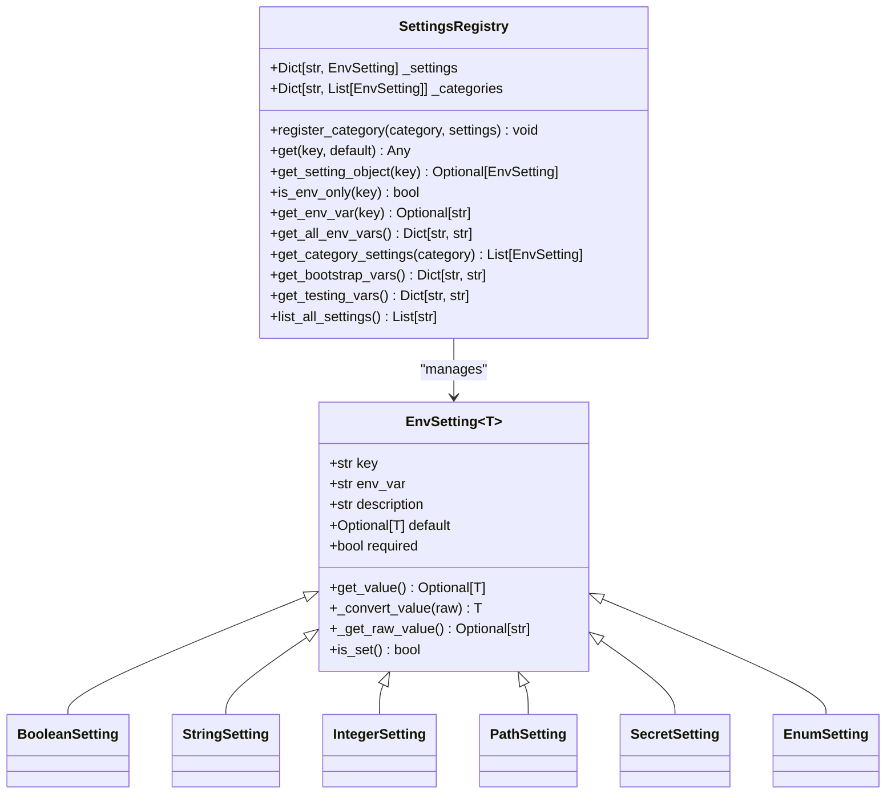

# Authentication

<cite>
**Referenced Files in This Document**   
- [session_manager.py](file://src/local_deep_research/web/auth/session_manager.py)
- [routes.py](file://src/local_deep_research/web/auth/routes.py)
- [decorators.py](file://src/local_deep_research/web/auth/decorators.py)
- [encrypted_db.py](file://src/local_deep_research/database/encrypted_db.py)
- [auth_db.py](file://src/local_deep_research/database/auth_db.py)
- [settings.py](file://src/local_deep_research/database/models/settings.py)
- [env_registry.py](file://src/local_deep_research/settings/env_registry.py)
- [env_settings.py](file://src/local_deep_research/settings/env_settings.py)
- [rate_limiter.py](file://src/local_deep_research/security/rate_limiter.py)
- [security_headers.py](file://src/local_deep_research/security/security_headers.py)
</cite>

## Table of Contents
1. [Introduction](#introduction)
2. [Authentication Mechanisms](#authentication-mechanisms)
3. [Session-Based Authentication](#session-based-authentication)
4. [API Key Management](#api-key-management)
5. [Environment Variable Configuration](#environment-variable-configuration)
6. [Security Considerations](#security-considerations)
7. [Request Authentication Examples](#request-authentication-examples)
8. [Common Issues and Troubleshooting](#common-issues-and-troubleshooting)
9. [Production Security Guidance](#production-security-guidance)
10. [Conclusion](#conclusion)

## Introduction

The local-deep-research system implements a comprehensive authentication framework that combines session-based authentication with API key management and environment variable configuration. This document details the authentication mechanisms used to secure API access, covering the implementation of session management, API key handling, and security best practices.

The system uses SQLCipher-encrypted databases for user data protection, with authentication flows that support both web interface access and programmatic API usage. The architecture includes CSRF protection, rate limiting, and secure session management to prevent common web vulnerabilities.

This documentation provides a complete reference for configuring, using, and troubleshooting authentication in the local-deep-research system, with guidance for both development and production environments.

## Authentication Mechanisms

The local-deep-research system implements multiple authentication mechanisms to secure access to its APIs and web interface. The primary authentication method is session-based authentication using encrypted database connections, supplemented by API key authentication for programmatic access.

The system's authentication architecture is built around Flask's session management, with additional security layers including CSRF protection, rate limiting, and database encryption. User credentials are validated against SQLCipher-encrypted databases, with each user having their own encrypted database instance protected by their password.

Authentication is enforced through decorators that protect routes and endpoints, redirecting unauthenticated users to the login page or returning appropriate error responses for API requests. The system distinguishes between web interface requests and API requests, providing different error handling and redirection behavior based on the request context.

**Section sources**
- [decorators.py](file://src/local_deep_research/web/auth/decorators.py#L13-L49)
- [routes.py](file://src/local_deep_research/web/auth/routes.py#L66-L248)
- [encrypted_db.py](file://src/local_deep_research/database/encrypted_db.py#L324-L432)

## Session-Based Authentication

### Session Management Architecture

The local-deep-research system implements a custom session management system that handles user sessions and database connection lifecycle. The SessionManager class manages session creation, validation, and cleanup, with configurable timeout settings for regular and "remember me" sessions.


**Diagram sources**
- [session_manager.py](file://src/local_deep_research/web/auth/session_manager.py#L15-L118)

### Session Lifecycle

The session lifecycle in the local-deep-research system follows a secure pattern designed to prevent session fixation and hijacking attacks. When a user successfully authenticates, a new session is created with a cryptographically secure session ID generated using `secrets.token_urlsafe(32)`.

Sessions have two timeout configurations:
- Regular sessions: 2 hours of inactivity
- "Remember me" sessions: 30 days of inactivity

The system validates sessions on each request, updating the last access time and checking against the appropriate timeout based on the session type. Expired sessions are automatically destroyed and require re-authentication.

During login, the system implements session regeneration to prevent session fixation attacks. After successful authentication, the session ID is regenerated, ensuring that any pre-existing session (potentially set by an attacker) is replaced with a new, authenticated session.

**Section sources**
- [session_manager.py](file://src/local_deep_research/web/auth/session_manager.py#L25-L78)
- [routes.py](file://src/local_deep_research/web/auth/routes.py#L137-L140)
- [decorators.py](file://src/local_deep_research/web/auth/decorators.py#L39-L64)

### Login and Logout Flows

The login process in the local-deep-research system involves several security-critical steps to ensure secure authentication and database access. When a user submits their credentials, the system attempts to open their encrypted database using the provided password as the encryption key.


**Diagram sources**
- [routes.py](file://src/local_deep_research/web/auth/routes.py#L66-L248)
- [encrypted_db.py](file://src/local_deep_research/database/encrypted_db.py#L324-L432)

The logout process is designed to completely invalidate the user's session and close all database connections. When a user logs out, the system:

1. Closes the user's database connection
2. Destroys the session in the SessionManager
3. Clears the session password from storage
4. Clears all session data
5. Redirects to the login page

This comprehensive cleanup ensures that no residual authentication state remains after logout, preventing unauthorized access to user data.

**Section sources**
- [routes.py](file://src/local_deep_research/web/auth/routes.py#L403-L431)
- [session_manager.py](file://src/local_deep_research/web/auth/session_manager.py#L66-L78)

## API Key Management

### API Key Storage and Retrieval

API keys in the local-deep-research system are stored securely in the user's encrypted database, providing an additional layer of protection beyond environment variable storage. The system uses a dedicated `api_keys` table in the database to store provider-specific API keys with unique constraints to prevent duplication.


**Diagram sources**
- [settings.py](file://src/local_deep_research/database/models/settings.py#L44-L53)

API keys can be configured through multiple methods:
1. Web UI settings interface
2. Environment variables
3. Direct database insertion

The system supports both prefixed and non-prefixed environment variable names for API keys, allowing flexibility in deployment configurations. When both forms are present, the system uses the prefixed version (e.g., `LDR_OPENAI_API_KEY`) as the primary source.

**Section sources**
- [settings.py](file://src/local_deep_research/database/models/settings.py#L44-L53)
- [env_settings.py](file://src/local_deep_research/settings/env_settings.py#L195-L215)
- [env_registry.py](file://src/local_deep_research/settings/env_registry.py#L10-L112)

### API Key Configuration Methods

The local-deep-research system provides multiple methods for configuring API keys, each with different security implications and use cases.

#### Web UI Configuration
The recommended method for API key configuration is through the web interface, which provides validation and secure storage. Users can navigate to Settings → LLM Provider to configure API keys for various providers, including OpenAI, Anthropic, and custom endpoints.

#### Environment Variable Configuration
API keys can be set using environment variables, which is particularly useful for containerized deployments and CI/CD pipelines. The system requires both prefixed and non-prefixed versions of API key environment variables:

```bash
# Set both versions for each API key
ANTHROPIC_API_KEY=your-api-key-here
LDR_ANTHROPIC_API_KEY=your-api-key-here

OPENAI_API_KEY=your-openai-key-here
LDR_OPENAI_API_KEY=your-openai-key-here
```

#### Custom Endpoint Configuration
For providers like OpenRouter that offer OpenAI-compatible APIs, the system supports custom endpoint configuration through environment variables:

```bash
export LDR_LLM_PROVIDER=openai_endpoint
export LDR_LLM_OPENAI_ENDPOINT_URL=https://openrouter.ai/api/v1
export LDR_LLM_OPENAI_ENDPOINT_API_KEY="<your-api-key>"
export LDR_LLM_MODEL=anthropic/claude-3.5-sonnet
```

**Section sources**
- [env_configuration.md](file://docs/env_configuration.md#L72-L113)
- [env_settings.py](file://src/local_deep_research/settings/env_settings.py#L195-L215)
- [settings.py](file://src/local_deep_research/database/models/settings.py#L24-L42)

## Environment Variable Configuration

### Bootstrap Environment Variables

The local-deep-research system uses environment variables for critical configuration settings that must be available before database initialization. These bootstrap variables are managed by the SettingsRegistry and include configuration for paths, encryption, and system initialization.

The system follows a naming convention where environment variables are prefixed with `LDR_` followed by the setting key in uppercase with dots replaced by underscores (e.g., `testing.test_mode` becomes `LDR_TESTING_TEST_MODE`).

Bootstrap variables are categorized into several groups:
- **Bootstrap settings**: Required for system initialization
- **Database configuration**: Needed before database connection
- **Testing flags**: Used for test and CI configuration
- **Security settings**: Control security features like rate limiting



**Diagram sources**
- [env_registry.py](file://src/local_deep_research/settings/env_registry.py#L25-L112)
- [env_settings.py](file://src/local_deep_research/settings/env_settings.py#L33-L348)

### Environment Variable Types

The system defines several specialized environment variable types to ensure proper validation and handling:

- **BooleanSetting**: Converts string values to boolean (true, 1, yes, on, enabled)
- **StringSetting**: Basic string values with optional requirements
- **IntegerSetting**: Integer values with optional min/max validation
- **PathSetting**: File system paths with existence and creation options
- **SecretSetting**: Sensitive values that are masked in logs and output
- **EnumSetting**: Values restricted to a predefined set of allowed values

Secret settings are particularly important for API keys and other sensitive credentials, as they are masked in logs and string representations to prevent accidental exposure.

**Section sources**
- [env_settings.py](file://src/local_deep_research/settings/env_settings.py#L81-L256)
- [env_registry.py](file://src/local_deep_research/settings/env_registry.py#L10-L112)

## Security Considerations

### Rate Limiting Implementation

The local-deep-research system implements rate limiting to prevent abuse and resource exhaustion. The rate limiting system is built on Flask-Limiter and provides decorators for controlling request frequency on specific endpoints.

The system uses a dual identification strategy for rate limiting:
- Authenticated users are identified by username (`user:{username}`)
- Unauthenticated requests are identified by IP address (`ip:{address}`)

This approach ensures that legitimate users are not unfairly limited while still protecting against distributed attacks.

```mermaid
flowchart TD
A[Incoming Request] --> B{User Authenticated?}
B --> |Yes| C[Rate Limit Key: user:{username}]
B --> |No| D[Rate Limit Key: ip:{address}]
C --> E[Check Rate Limit]
D --> E
E --> F{Within Limit?}
F --> |Yes| G[Process Request]
F --> |No| H[Return 429 Too Many Requests]
G --> I[Update Rate Limit Counter]
```

**Diagram sources**
- [rate_limiter.py](file://src/local_deep_research/security/rate_limiter.py#L16-L152)

The system provides specific rate limiting decorators for different use cases:
- `login_limit`: 5 attempts per 15 minutes per IP for login attempts
- `registration_limit`: 3 attempts per hour per IP for registration
- `upload_rate_limit`: 10 uploads per minute, 100 per hour per user

In production, the system can be configured to fail closed if the rate limiter is not properly initialized, ensuring that rate limiting is always active when required.

**Section sources**
- [rate_limiter.py](file://src/local_deep_research/security/rate_limiter.py#L16-L152)
- [routes.py](file://src/local_deep_research/web/auth/routes.py#L27-L28)

### CSRF Protection

The system implements CSRF (Cross-Site Request Forgery) protection to prevent unauthorized state-changing requests. CSRF tokens are required for all state-changing operations, including authentication, settings updates, and research creation.

The CSRF protection system provides an endpoint to programmatically obtain CSRF tokens:
```
GET /auth/csrf-token
```

This endpoint returns a JSON response containing the current CSRF token, making it easy for API clients to obtain the token without parsing HTML.

CSRF protection is integrated with the authentication system, requiring both valid session cookies and CSRF tokens for state-changing operations. This defense-in-depth approach ensures that even if an attacker obtains a user's session cookie, they cannot perform actions without also obtaining the CSRF token.

**Section sources**
- [routes.py](file://src/local_deep_research/web/auth/routes.py#L32-L45)
- [security_headers.py](file://src/local_deep_research/security/security_headers.py#L57-L85)

### Database Encryption

All user data in the local-deep-research system is stored in SQLCipher-encrypted databases, with each user having their own encrypted database instance. The user's password serves as the encryption key, providing end-to-end protection for sensitive data including API keys and research results.

The DatabaseManager class handles the creation and management of encrypted databases, with fallback behavior for environments where SQLCipher is not available. In such cases, the system can operate with unencrypted databases, but this is strongly discouraged for production use.

Database integrity can be checked through the `/auth/integrity-check` endpoint, which performs both SQLite's `PRAGMA quick_check` and SQLCipher's `PRAGMA cipher_integrity_check` to verify database consistency and encryption integrity.

**Section sources**
- [encrypted_db.py](file://src/local_deep_research/database/encrypted_db.py#L27-L621)
- [routes.py](file://src/local_deep_research/web/auth/routes.py#L505-L523)

## Request Authentication Examples

### REST API Authentication

To authenticate requests to the REST API, clients must include both session cookies and CSRF tokens for state-changing operations. For programmatic access, the following steps are required:

1. Obtain a CSRF token:
```bash
curl -X GET http://localhost:5000/auth/csrf-token
# Returns: {"csrf_token": "token_value"}
```

2. Include the CSRF token in subsequent requests:
```bash
curl -X POST http://localhost:5000/api/research \
  -H "X-CSRFToken: token_value" \
  -H "Content-Type: application/json" \
  -d '{"query": "research topic"}' \
  -b "session_cookie=session_value"
```

For read-only endpoints that don't require CSRF protection, authentication can be performed with session cookies alone.

**Section sources**
- [routes.py](file://src/local_deep_research/web/auth/routes.py#L32-L45)
- [decorators.py](file://src/local_deep_research/web/auth/decorators.py#L13-L49)

### WebSocket API Authentication

WebSocket connections in the local-deep-research system use the same authentication mechanism as the REST API, with session cookies and CSRF tokens. The Socket.IO implementation is configured to use polling as the primary transport method to avoid WebSocket-specific issues.

Clients should establish WebSocket connections with the appropriate authentication credentials:

```javascript
const socket = io('http://localhost:5000', {
  path: '/socket.io',
  transports: ['polling'],
  extraHeaders: {
    'Cookie': 'session_cookie=session_value'
  }
});
```

The system emits authentication-related events through the WebSocket connection, including progress updates and completion notifications for research tasks.

**Section sources**
- [socket.js](file://src/local_deep_research/web/static/js/services/socket.js#L41-L83)
- [progress.js](file://src/local_deep_research/web/static/js/components/progress.js#L224-L252)

## Common Issues and Troubleshooting

### Authentication Failure Troubleshooting

When experiencing authentication issues, consider the following common causes and solutions:

1. **Invalid credentials**: Verify that the username and password are correct. The system distinguishes between authentication failure (invalid credentials) and database access failure (correct credentials but database issues).

2. **Session expiration**: Sessions expire after 2 hours of inactivity (or 30 days for "remember me" sessions). Clear browser cookies and log in again to create a new session.

3. **CSRF token issues**: For API requests, ensure that the CSRF token is obtained and included in requests. Use the `/auth/csrf-token` endpoint to retrieve the current token.

4. **Rate limiting**: Excessive failed login attempts may trigger rate limiting. Wait 15 minutes before attempting to log in again, or use a different IP address.

5. **Database corruption**: If the encrypted database becomes corrupted, use the integrity check endpoint (`/auth/integrity-check`) to verify database health.

**Section sources**
- [routes.py](file://src/local_deep_research/web/auth/routes.py#L66-L248)
- [decorators.py](file://src/local_deep_research/web/auth/decorators.py#L13-L49)

### API Key Configuration Issues

Common issues with API key configuration include:

1. **Missing environment variables**: Ensure that both prefixed and non-prefixed versions of API key environment variables are set.

2. **Incorrect provider configuration**: When using custom endpoints, verify that the LLM provider is set to `openai_endpoint` and the endpoint URL is correctly configured.

3. **Permission issues**: API keys stored in environment variables must be accessible to the process running the application. Check file permissions and environment variable inheritance.

4. **Caching issues**: After changing API keys, restart the application to ensure that the new keys are loaded, as some configurations may be cached.

**Section sources**
- [env_configuration.md](file://docs/env_configuration.md#L72-L113)
- [env_settings.py](file://src/local_deep_research/settings/env_settings.py#L195-L215)

## Production Security Guidance

### Secure Deployment Configuration

For production deployments of the local-deep-research system, follow these security best practices:

1. **Enable SQLCipher encryption**: Ensure that SQLCipher is properly installed and configured to encrypt all user databases. Avoid running with unencrypted databases in production.

2. **Configure rate limiting**: Set `RATE_LIMIT_FAIL_CLOSED=true` to ensure that rate limiting is always active, even if the rate limiter fails to initialize.

3. **Use secure environment variables**: Store API keys and other sensitive credentials in environment variables rather than configuration files, and ensure that environment variables are not exposed in logs or error messages.

4. **Configure CORS properly**: Set explicit allowed origins in the `SECURITY_CORS_ALLOWED_ORIGINS` environment variable rather than using wildcards.

5. **Enable security headers**: Ensure that security headers like Content Security Policy (CSP) are properly configured to prevent XSS and other client-side attacks.

**Section sources**
- [encrypted_db.py](file://src/local_deep_research/database/encrypted_db.py#L68-L141)
- [rate_limiter.py](file://src/local_deep_research/security/rate_limiter.py#L28-L30)
- [security_headers.py](file://src/local_deep_research/security/security_headers.py#L60-L71)

### Monitoring and Logging

Implement comprehensive monitoring and logging to detect and respond to security incidents:

1. **Monitor authentication logs**: Regularly review logs for failed login attempts, which may indicate brute force attacks.

2. **Track rate limiting events**: Monitor rate limiting headers and logs to identify potential abuse patterns.

3. **Verify database integrity**: Periodically check database integrity using the built-in integrity check endpoint.

4. **Audit API key usage**: Monitor API key usage patterns to detect unauthorized access or excessive usage.

5. **Review security headers**: Ensure that security headers are being properly applied to all responses.

The system's logging framework uses Loguru for structured logging, with different log levels for various types of events. Security-critical events are logged at the warning or error level to ensure they are easily identifiable.

**Section sources**
- [encrypted_db.py](file://src/local_deep_research/database/encrypted_db.py#L10-L11)
- [rate_limiter.py](file://src/local_deep_research/security/rate_limiter.py#L19-L22)
- [decorators.py](file://src/local_deep_research/web/auth/decorators.py#L8-L9)

## Conclusion

The local-deep-research system implements a robust authentication framework that combines session-based authentication, API key management, and environment variable configuration to secure access to its APIs and web interface. The system's security architecture is designed to protect user data through SQLCipher encryption, prevent common web vulnerabilities through CSRF protection and rate limiting, and provide flexible configuration options for different deployment scenarios.

Key security features include:
- Per-user encrypted databases with password-based encryption keys
- Comprehensive session management with timeout and regeneration
- Multiple API key configuration methods with secure storage
- Environment variable-based configuration for critical settings
- Rate limiting to prevent abuse and resource exhaustion
- CSRF protection for state-changing operations

For production deployments, it is essential to follow security best practices including enabling database encryption, configuring rate limiting to fail closed, and properly securing environment variables. Regular monitoring and logging should be implemented to detect and respond to potential security incidents.

The authentication system provides a solid foundation for secure access to the local-deep-research capabilities, balancing security with usability for both end users and developers integrating with the system's APIs.