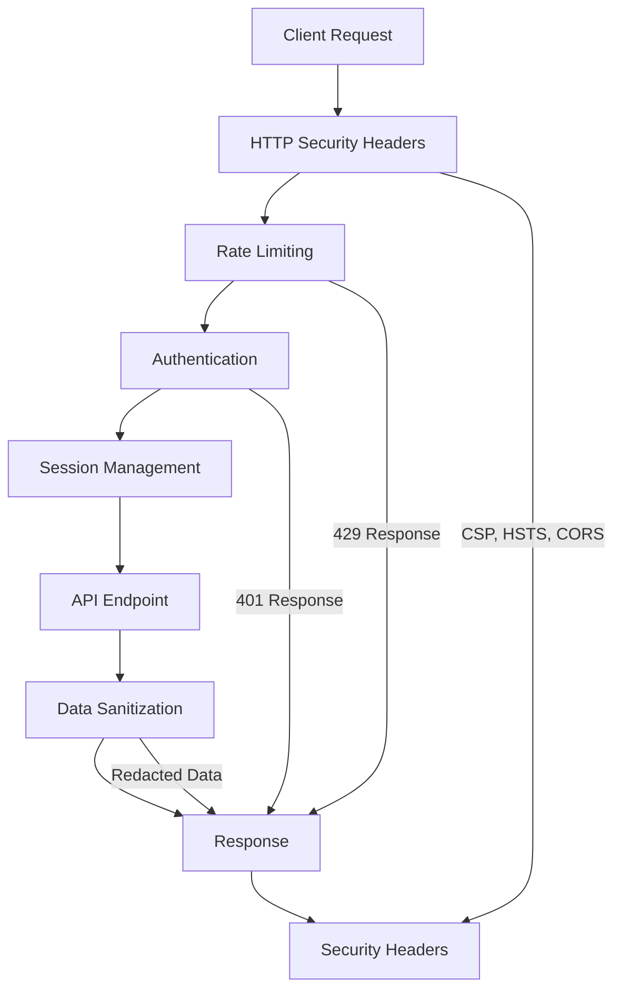
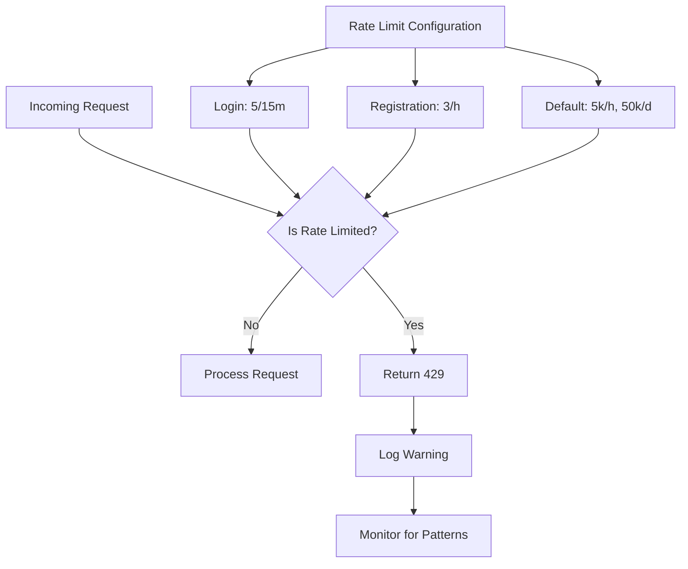
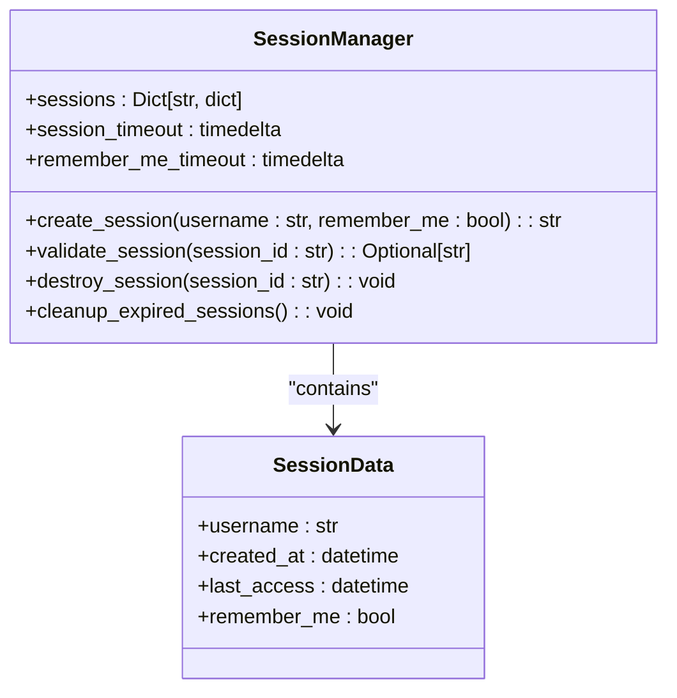
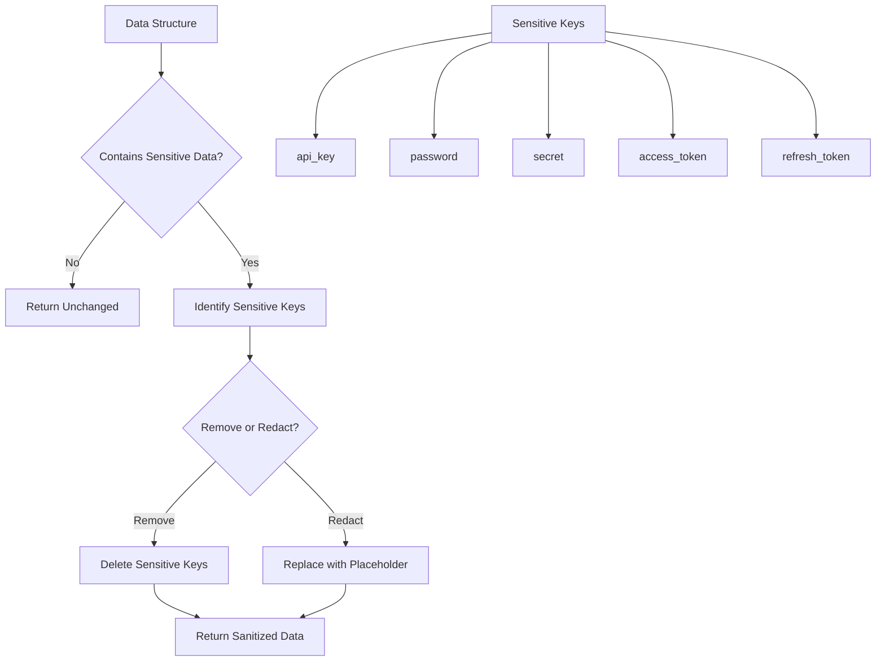
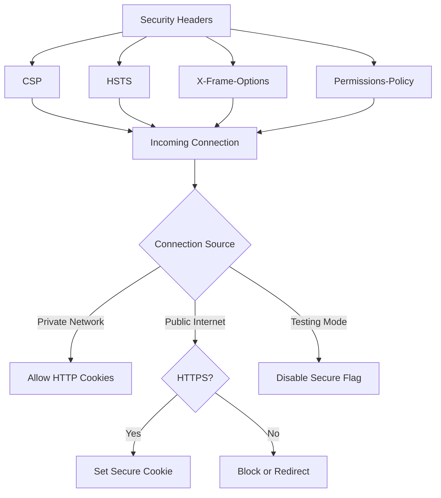

# Security Best Practices

<cite>
**Referenced Files in This Document**   
- [app_factory.py](file://src/local_deep_research/web/app_factory.py)
- [rate_limiter.py](file://src/local_deep_research/web/utils/rate_limiter.py)
- [security_headers.py](file://src/local_deep_research/security/security_headers.py)
- [routes.py](file://src/local_deep_research/web/auth/routes.py)
- [session_manager.py](file://src/local_deep_research/web/auth/session_manager.py)
- [data_sanitizer.py](file://src/local_deep_research/security/data_sanitizer.py)
- [safe_requests.py](file://src/local_deep_research/security/safe_requests.py)
- [settings_security.json](file://src/local_deep_research/defaults/settings_security.json)
</cite>

## Table of Contents
1. [Introduction](#introduction)
2. [Security Architecture Overview](#security-architecture-overview)
3. [Rate Limiting Implementation](#rate-limiting-implementation)
4. [Secure Session Management](#secure-session-management)
5. [API Key Protection and Data Sanitization](#api-key-protection-and-data-sanitization)
6. [Transmission Security and HTTPS Enforcement](#transmission-security-and-https-enforcement)
7. [Cross-Cutting Security Concerns](#cross-cutting-security-concerns)
8. [Monitoring and Suspicious Activity Detection](#monitoring-and-suspicious-activity-detection)
9. [Production Configuration Recommendations](#production-configuration-recommendations)
10. [Conclusion](#conclusion)

## Introduction

The local-deep-research system implements a comprehensive security architecture designed to protect API endpoints and user data. This document details the security best practices, design patterns, and implementation details for API authentication, covering rate limiting, secure session handling, API key protection, and other critical security controls. The system follows defense-in-depth principles with multiple layers of security controls to protect against common web vulnerabilities and attacks.

The security model is designed to balance usability for local and private network deployments with strong protection for public internet access. This approach allows developers and researchers to use the system effectively in local environments while ensuring robust security when exposed to the internet.

**Section sources**
- [app_factory.py](file://src/local_deep_research/web/app_factory.py#L151-L184)
- [security_headers.py](file://src/local_deep_research/security/security_headers.py#L1-L304)

## Security Architecture Overview

The system implements a multi-layered security architecture with several key components working together to protect API endpoints and user data. The security model combines rate limiting, secure session management, HTTP security headers, and input validation to create a robust defense against common attacks.

The architecture follows a defense-in-depth approach with security controls at multiple levels:
- Network level: HTTP security headers and connection validation
- Application level: Authentication, authorization, and session management
- Data level: Encryption, sanitization, and access controls
- Operational level: Monitoring, logging, and audit trails



**Diagram sources**
- [app_factory.py](file://src/local_deep_research/web/app_factory.py#L238-L248)
- [security_headers.py](file://src/local_deep_research/security/security_headers.py#L134-L190)
- [routes.py](file://src/local_deep_research/web/auth/routes.py#L67-L68)

## Rate Limiting Implementation

The system implements comprehensive rate limiting to protect against brute force attacks and resource exhaustion. Rate limiting is configured at multiple levels with different thresholds for different endpoints.

The rate limiting system uses Flask-Limiter with IP-based tracking to prevent abuse. Different endpoints have independent rate limits to allow fine-grained control over access patterns. The login endpoint is protected with a strict limit of 5 attempts per 15 minutes per IP address to prevent password guessing attacks, while registration is limited to 3 attempts per hour to prevent spam.



The rate limiting configuration is stored in `settings_security.json` and can be modified through the UI, though changes require a server restart to take effect. For production deployments with multiple workers, Redis storage is recommended instead of the default in-memory storage.

The system also implements a fail-closed mode for rate limiting in production environments, which can be enabled by setting the `RATE_LIMIT_FAIL_CLOSED` environment variable to "true". This ensures that if the rate limiter fails to initialize, the application will fail rather than operate without rate limiting protection.

**Section sources**
- [rate_limiter.py](file://src/local_deep_research/web/utils/rate_limiter.py#L1-L76)
- [settings_security.json](file://src/local_deep_research/defaults/settings_security.json#L1-L39)
- [app_factory.py](file://src/local_deep_research/web/app_factory.py#L241-L266)

## Secure Session Management

The system implements robust session management to prevent session fixation, hijacking, and other attacks. Sessions are managed through a custom SessionManager class that handles creation, validation, and cleanup of user sessions.

Each session is assigned a cryptographically secure random session ID generated using `secrets.token_urlsafe(32)`. Sessions have configurable timeouts: 2 hours for regular sessions and 30 days for "remember me" sessions. The system automatically cleans up expired sessions to prevent resource exhaustion.



**Diagram sources**
- [session_manager.py](file://src/local_deep_research/web/auth/session_manager.py#L15-L118)
- [routes.py](file://src/local_deep_research/web/auth/routes.py#L28-L29)

The system also implements protection against session fixation attacks by generating a new session ID on login. When a user successfully authenticates, the system creates a new session with a fresh session ID rather than reusing any existing session.

For additional security, the system stores temporary authentication tokens that allow database access without keeping passwords in session storage. These tokens are stored in memory and are cleared when the session ends. The system also implements stale session cleanup to handle cases where a user is authenticated but the database connection has been lost.

## API Key Protection and Data Sanitization

The system implements comprehensive data sanitization to prevent accidental leakage of sensitive information such as API keys, passwords, and tokens. The DataSanitizer class provides methods to recursively remove or redact sensitive data from data structures before they are logged, stored, or returned in API responses.

The sanitizer targets a default set of sensitive key names including "api_key", "password", "secret", "access_token", and others. These keys are matched case-insensitively to ensure comprehensive protection. The system provides both removal and redaction options:

- **Sanitize**: Completely removes sensitive keys from data structures
- **Redact**: Replaces sensitive values with a placeholder like "[REDACTED]"



**Diagram sources**
- [data_sanitizer.py](file://src/local_deep_research/security/data_sanitizer.py#L10-L158)
- [safe_requests.py](file://src/local_deep_research/security/safe_requests.py#L7-L228)

The system also implements SSRF (Server-Side Request Forgery) protection through the safe_requests module, which validates URLs before making HTTP requests. This prevents attackers from using the system to access internal services or perform port scanning.

## Transmission Security and HTTPS Enforcement

The system implements comprehensive transmission security to protect data in transit. This includes HTTP security headers, dynamic cookie security, and HTTPS enforcement based on the network context.

The SecurityHeaders middleware applies multiple security headers to all responses:
- **Content-Security-Policy (CSP)**: Prevents XSS attacks by restricting content sources
- **Strict-Transport-Security (HSTS)**: Enforces HTTPS connections
- **X-Frame-Options**: Prevents clickjacking attacks
- **X-Content-Type-Options**: Prevents MIME type sniffing
- **Permissions-Policy**: Disables potentially dangerous browser features

The system uses a dynamic cookie security model that adapts to the network environment:
- On private networks (localhost, LAN IPs): Cookies work over HTTP without the Secure flag
- On public internet: Cookies require HTTPS and include the Secure flag
- In testing mode: Secure flag is disabled for development convenience

This approach balances security with usability, allowing convenient HTTP access on private networks while enforcing HTTPS for public internet exposure.



**Diagram sources**
- [security_headers.py](file://src/local_deep_research/security/security_headers.py#L13-L304)
- [app_factory.py](file://src/local_deep_research/web/app_factory.py#L151-L171)

## Cross-Cutting Security Concerns

The system addresses several cross-cutting security concerns to provide comprehensive protection against common attacks.

### Brute Force Protection
The system implements rate limiting on authentication endpoints to prevent brute force attacks. The login endpoint is limited to 5 attempts per 15 minutes per IP address, making password guessing attacks impractical. Failed login attempts are logged for monitoring and analysis.

### Session Fixation Prevention
The system prevents session fixation attacks by generating a new session ID on successful authentication. When a user logs in, the system creates a fresh session rather than reusing any existing session, preventing attackers from hijacking pre-existing sessions.

### Credential Leakage Prevention
The system implements multiple controls to prevent credential leakage:
- Passwords are never stored in session data
- Temporary authentication tokens are used for database access
- Sensitive data is sanitized before logging or API responses
- API keys and tokens are redacted in logs and error messages

### CSRF Protection
The system implements CSRF (Cross-Site Request Forgery) protection for all state-changing operations. CSRF tokens are required for POST, PUT, and DELETE requests to prevent unauthorized actions initiated from other sites.

### Input Validation
All user input is validated to prevent injection attacks. The system uses parameterized queries to prevent SQL injection and validates URLs to prevent SSRF attacks. File uploads are validated to prevent malicious file execution.

**Section sources**
- [routes.py](file://src/local_deep_research/web/auth/routes.py#L73-L98)
- [security_headers.py](file://src/local_deep_research/security/security_headers.py#L134-L190)
- [safe_requests.py](file://src/local_deep_research/security/safe_requests.py#L52-L60)

## Monitoring and Suspicious Activity Detection

The system implements comprehensive logging and monitoring to detect suspicious activity and potential security incidents.

Rate limit violations are logged with detailed information including the endpoint, client IP, and user agent. This allows administrators to identify potential brute force attacks or abuse patterns. The logging includes warnings for rate limit exceedances, providing an audit trail of suspicious activity.

Authentication events are logged to track user activity:
- Successful logins
- Failed login attempts
- Password changes
- Account creation

These logs include timestamps and IP addresses to help identify suspicious patterns. The system also logs security-related events such as session creation and destruction.

The system's security headers include Content-Security-Policy violation reporting, which can be configured to send reports of potential XSS attempts. This provides early warning of possible attack attempts.

For production deployments, it is recommended to integrate with external monitoring and alerting systems to receive notifications of security events. The logs can be forwarded to SIEM (Security Information and Event Management) systems for centralized analysis and correlation.

**Section sources**
- [app_factory.py](file://src/local_deep_research/web/app_factory.py#L258-L262)
- [routes.py](file://src/local_deep_research/web/auth/routes.py#L92-L93)
- [security_headers.py](file://src/local_deep_research/security/security_headers.py#L80-L83)

## Production Configuration Recommendations

For production deployments, the following security configurations are recommended:

### Rate Limiting
Enable fail-closed mode for rate limiting by setting:
```
RATE_LIMIT_FAIL_CLOSED=true
```
This ensures the application fails if the rate limiter cannot be initialized, preventing operation without this critical security control.

For multi-worker deployments, configure Redis storage:
```
RATELIMIT_STORAGE_URL=redis://localhost:6379
```

### HTTPS Configuration
Always use HTTPS in production. Configure a reverse proxy (nginx, Apache, or cloud provider) to handle SSL termination and forward requests to the application.

Ensure HSTS is properly configured with a long max-age and includeSubDomains directive.

### Security Headers
Review and customize the security header configuration based on specific requirements:
- Adjust CSP directives based on required external resources
- Configure CORS origins explicitly rather than using wildcards
- Consider stricter COEP (Cross-Origin-Embedder-Policy) settings

### Session Management
For high-security environments, consider reducing session timeouts:
- Regular session timeout: 30 minutes instead of 2 hours
- Remove "remember me" functionality or reduce its duration

### Monitoring and Logging
Configure external logging and monitoring:
- Forward logs to a centralized logging system
- Set up alerts for repeated failed login attempts
- Monitor for rate limit violations
- Regularly review security logs

### Regular Security Updates
Keep the system updated with the latest security patches. Regularly review dependencies for known vulnerabilities using tools like CodeQL or other SAST solutions.

**Section sources**
- [settings_security.json](file://src/local_deep_research/defaults/settings_security.json#L1-L39)
- [security_headers.py](file://src/local_deep_research/security/security_headers.py#L60-L71)
- [rate_limiter.py](file://src/local_deep_research/web/utils/rate_limiter.py#L57-L63)

## Conclusion

The local-deep-research system implements a comprehensive security architecture that protects API endpoints through multiple layers of controls. The combination of rate limiting, secure session management, data sanitization, and transmission security provides robust protection against common web vulnerabilities and attacks.

The security model is designed to be both effective and practical, balancing strong protection with usability for different deployment scenarios. The system's defense-in-depth approach ensures that even if one control is bypassed, others remain in place to protect the system.

For optimal security, administrators should follow the production configuration recommendations, particularly enabling fail-closed mode for critical security controls and implementing proper HTTPS configuration. Regular monitoring and log review are essential for detecting and responding to potential security incidents.

The system's modular security architecture allows for ongoing improvements and adaptation to evolving threats while maintaining a strong foundation of security best practices.