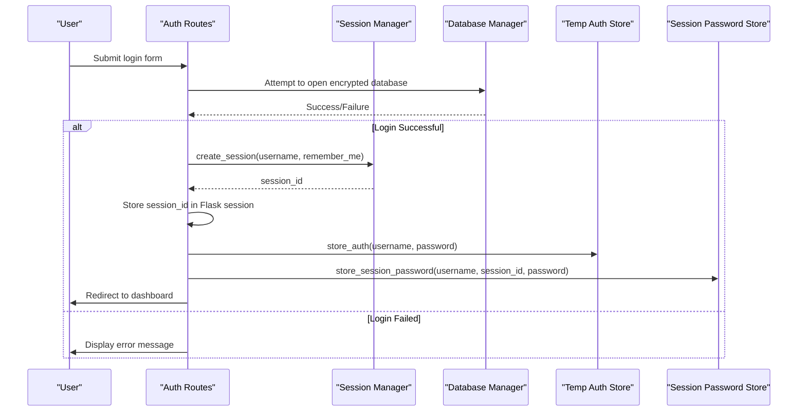
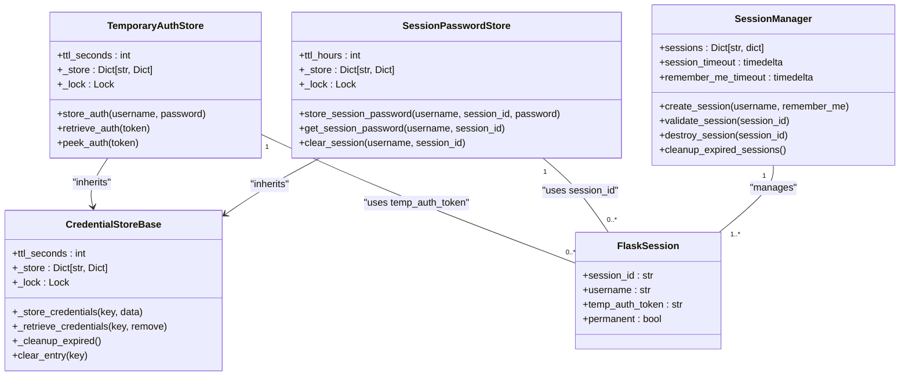
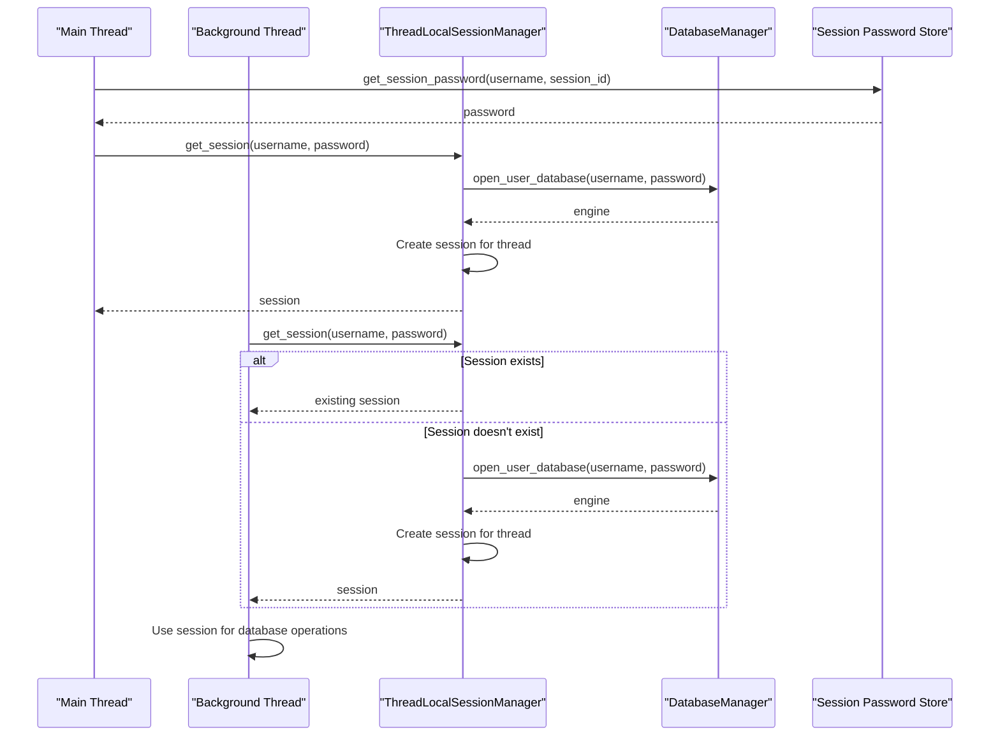
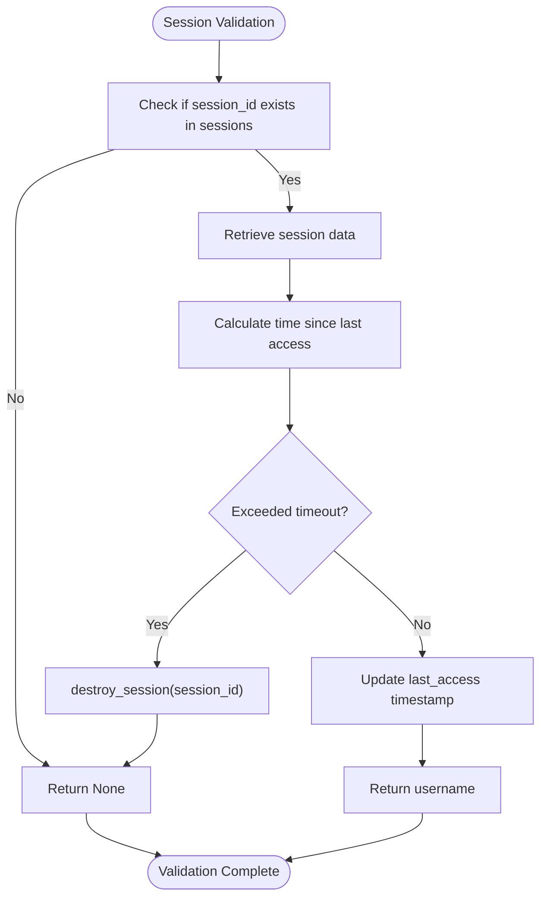
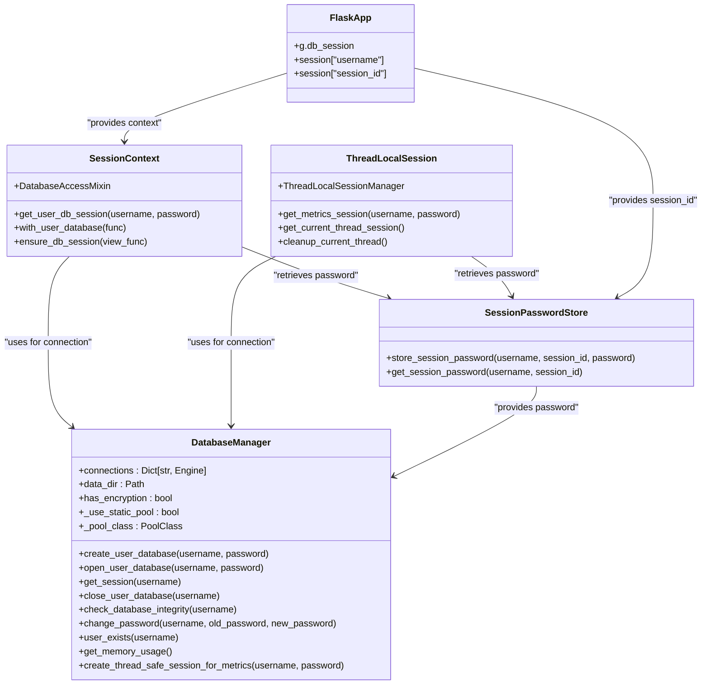
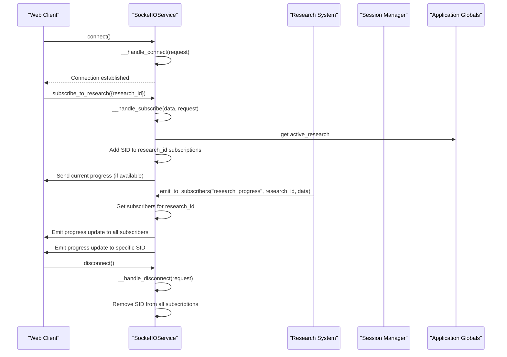
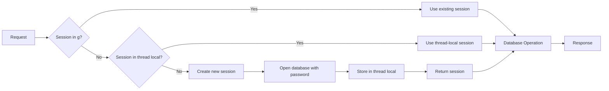

# Session Management

<cite>
**Referenced Files in This Document**   
- [session_context.py](file://src/local_deep_research/database/session_context.py)
- [thread_local_session.py](file://src/local_deep_research/database/thread_local_session.py)
- [session_passwords.py](file://src/local_deep_research/database/session_passwords.py)
- [temp_auth.py](file://src/local_deep_research/database/temp_auth.py)
- [routes.py](file://src/local_deep_research/web/auth/routes.py)
- [session_manager.py](file://src/local_deep_research/web/auth/session_manager.py)
- [socket_service.py](file://src/local_deep_research/web/services/socket_service.py)
- [encrypted_db.py](file://src/local_deep_research/database/encrypted_db.py)
- [credential_store_base.py](file://src/local_deep_research/database/credential_store_base.py)
</cite>

## Table of Contents
1. [Introduction](#introduction)
2. [Session Creation and Authentication Flow](#session-creation-and-authentication-flow)
3. [Session Persistence and Storage Mechanisms](#session-persistence-and-storage-mechanisms)
4. [Thread-Safe Session Handling](#thread-safe-session-handling)
5. [Session Cleanup and Expiration](#session-cleanup-and-expiration)
6. [Database Middleware Integration](#database-middleware-integration)
7. [Flask-SocketIO Real-Time Communication Integration](#flask-socketio-real-time-communication-integration)
8. [Common Issues and Best Practices](#common-issues-and-best-practices)
9. [Performance Considerations](#performance-considerations)
10. [Conclusion](#conclusion)

## Introduction

The local-deep-research application implements a comprehensive session management system that handles user authentication, database access, and real-time communication. The system is designed to securely manage encrypted user databases while providing efficient access patterns for both web requests and background processing threads. This documentation details the implementation of session management, focusing on the integration between authentication, database persistence, and real-time features.

The session system addresses several key requirements: secure password handling for encrypted databases, thread-safe access to user data, persistence of session context across application components, and integration with real-time communication via Flask-SocketIO. The architecture employs multiple specialized components that work together to provide a robust session management solution.

**Section sources**
- [session_context.py](file://src/local_deep_research/database/session_context.py#L1-L237)
- [session_manager.py](file://src/local_deep_research/web/auth/session_manager.py#L1-L118)

## Session Creation and Authentication Flow

The session creation process in local-deep-research begins with user authentication through the login or registration endpoints. When a user successfully authenticates, the system creates a new session that establishes the user's context for subsequent interactions with the application.

During login, the `login()` function in the authentication routes creates a session by calling the `SessionManager.create_session()` method, which generates a cryptographically secure session ID using `secrets.token_urlsafe(32)`. This session ID is stored in the Flask session under the key "session_id" along with the username. The session manager maintains an in-memory dictionary of active sessions, tracking metadata such as creation time, last access time, and whether the "remember me" option was selected.

**Diagram sources**
- [routes.py](file://src/local_deep_research/web/auth/routes.py#L66-L248)
- [session_manager.py](file://src/local_deep_research/web/auth/session_manager.py#L25-L37)

The authentication flow also involves two specialized password storage mechanisms: the temporary authentication store and the session password store. The temporary authentication store (`temp_auth_store`) holds passwords briefly in memory after login or registration, allowing immediate database access during the post-authentication redirect. This store has a short TTL (30 seconds) and is primarily used to facilitate the transition from authentication to the main application.

**Section sources**
- [routes.py](file://src/local_deep_research/web/auth/routes.py#L137-L153)
- [temp_auth.py](file://src/local_deep_research/database/temp_auth.py#L1-L88)

## Session Persistence and Storage Mechanisms

The session persistence system in local-deep-research employs multiple storage mechanisms to maintain session context across different components and lifecycle stages. The primary session state is stored in Flask's session object, which typically uses signed cookies to persist data across requests. This includes the session ID and username, which are essential for identifying the authenticated user.

Complementing this primary storage, the application implements two specialized in-memory stores for handling password information required for database access. The `SessionPasswordStore` class provides long-term storage of user passwords for the duration of the user's active session, with a default TTL of 24 hours. This store uses a composite key of username and session ID to associate passwords with specific sessions, enabling background threads to access encrypted databases for metrics writing.

**Diagram sources**
- [session_passwords.py](file://src/local_deep_research/database/session_passwords.py#L23-L95)
- [temp_auth.py](file://src/local_deep_research/database/temp_auth.py#L16-L87)
- [credential_store_base.py](file://src/local_deep_research/database/credential_store_base.py#L17-L118)
- [session_manager.py](file://src/local_deep_research/web/auth/session_manager.py#L15-L118)

The `TemporaryAuthStore` serves a different purpose, providing short-term password storage (30 seconds TTL) specifically for handling the post-registration or post-login flow. This store uses randomly generated tokens as keys, which are stored in the Flask session, allowing the application to retrieve the password during the redirect process without exposing it in URL parameters.

Both storage mechanisms inherit from the `CredentialStoreBase` class, which provides common functionality for time-to-live (TTL) based expiration and thread-safe operations using locks. The base class handles the core operations of storing credentials with expiration timestamps, retrieving them while checking validity, and cleaning up expired entries.

**Section sources**
- [session_passwords.py](file://src/local_deep_research/database/session_passwords.py#L1-L96)
- [temp_auth.py](file://src/local_deep_research/database/temp_auth.py#L1-L88)
- [credential_store_base.py](file://src/local_deep_research/database/credential_store_base.py#L1-L118)

## Thread-Safe Session Handling

The local-deep-research application implements sophisticated thread-safe session handling to support concurrent access to user data across multiple threads. This is particularly important for background operations such as research tasks, metrics collection, and real-time updates, which often run in separate threads from the main request-response cycle.

The core of the thread-safe session system is the `ThreadLocalSessionManager` class, which creates and manages database sessions on a per-thread basis. Each thread gets its own dedicated database session that persists for the thread's lifetime, eliminating the need to repeatedly establish database connections and decrypt encrypted databases. This approach significantly improves performance by avoiding the expensive SQLCipher decryption process on every database access.

**Diagram sources**
- [thread_local_session.py](file://src/local_deep_research/database/thread_local_session.py#L14-L181)
- [session_context.py](file://src/local_deep_research/database/session_context.py#L28-L135)

The thread local session manager uses Python's `threading.local()` to store session data specific to each thread, ensuring complete isolation between threads. When a thread requests a session, the manager first checks if a valid session already exists for that thread. If not, it creates a new database connection using the provided username and password, stores it in the thread-local storage, and returns it for use.

For metrics operations specifically, the system provides the `get_metrics_session()` function, which is optimized for high-frequency writes from background threads. This function uses the thread local session manager but is specifically designed for metrics-related database operations, ensuring that these operations don't interfere with user data access patterns.

The session context system also provides decorators and context managers to simplify thread-safe database access. The `@with_user_database` decorator automatically injects a database session as the first argument to decorated functions, handling all the complexity of session management. Similarly, the `get_user_db_session()` context manager provides a clean interface for managing database sessions within context blocks.

**Section sources**
- [thread_local_session.py](file://src/local_deep_research/database/thread_local_session.py#L1-L181)
- [session_context.py](file://src/local_deep_research/database/session_context.py#L28-L237)

## Session Cleanup and Expiration

The session management system in local-deep-research implements comprehensive cleanup and expiration mechanisms to ensure security and efficient resource utilization. Sessions are automatically expired based on configurable timeout periods, and explicit cleanup procedures are triggered during logout and application shutdown.

The `SessionManager` class handles session expiration with two distinct timeout policies: a 2-hour timeout for regular sessions and a 30-day timeout for sessions created with the "remember me" option. When validating a session, the system checks the time elapsed since the last access and destroys the session if it exceeds the appropriate timeout period. The `validate_session()` method updates the last access time on each successful validation, effectively extending the session lifetime with activity.

**Diagram sources**
- [session_manager.py](file://src/local_deep_research/web/auth/session_manager.py#L39-L65)

The cleanup process is also triggered explicitly during logout through the `logout()` route. When a user logs out, the system performs several cleanup operations in sequence: it closes the user's database connection through the database manager, destroys the session in the session manager, clears the session password from the session password store, and finally clears the Flask session. This multi-step cleanup ensures that all traces of the session are removed from both memory and the user's browser.

Periodic cleanup of expired sessions is handled by the `cleanup_expired_sessions()` method, which scans all active sessions and removes those that have exceeded their timeout period. This method is called by `get_active_sessions_count()` to ensure that session counts are accurate, providing a passive cleanup mechanism that maintains system hygiene without requiring a dedicated cleanup thread.

The temporary authentication store and session password store also implement automatic cleanup through their TTL-based expiration system. The `CredentialStoreBase` class includes a `_cleanup_expired()` method that removes entries whose expiration time has passed, which is called whenever new credentials are stored. This ensures that expired entries are regularly removed without requiring separate cleanup processes.

**Section sources**
- [session_manager.py](file://src/local_deep_research/web/auth/session_manager.py#L66-L98)
- [routes.py](file://src/local_deep_research/web/auth/routes.py#L403-L431)
- [credential_store_base.py](file://src/local_deep_research/database/credential_store_base.py#L87-L97)

## Database Middleware Integration

The session management system is deeply integrated with the database middleware in local-deep-research, creating a cohesive architecture for secure and efficient database access. The `DatabaseManager` class serves as the central component that manages connections to user databases, working in concert with the session system to provide seamless access to encrypted data.

When a user authenticates, the database manager is responsible for opening the user's encrypted database using SQLCipher. The `open_user_database()` method takes the username and password as parameters, using the password as the encryption key to decrypt the database. Once opened, the database connection is stored in the manager's `connections` dictionary, indexed by username, allowing for reuse across multiple requests without repeated decryption.

**Diagram sources**
- [encrypted_db.py](file://src/local_deep_research/database/encrypted_db.py#L27-L620)
- [session_context.py](file://src/local_deep_research/database/session_context.py#L28-L237)
- [thread_local_session.py](file://src/local_deep_research/database/thread_local_session.py#L14-L181)

The integration between session management and database access is facilitated by several helper functions and decorators. The `get_user_db_session()` context manager in `session_context.py` orchestrates the retrieval of database sessions by first attempting to use an existing session from Flask's `g` object, then falling back to retrieving the password from various sources including the Flask session, thread context, and the session password store.

For Flask routes, the `ensure_db_session` decorator automatically sets up the database session in the request context, making it available as `g.db_session`. This decorator checks if the user's database connection is still active and handles re-authentication if the connection has been closed, providing a transparent experience for route handlers.

The system also handles the special case of unencrypted databases when SQLCipher is not available. In this mode, indicated by the `LDR_ALLOW_UNENCRYPTED=true` environment variable, the database manager operates without password protection, using a placeholder password. This fallback mode is primarily intended for development and testing environments.

**Section sources**
- [encrypted_db.py](file://src/local_deep_research/database/encrypted_db.py#L1-L621)
- [session_context.py](file://src/local_deep_research/database/session_context.py#L28-L237)

## Flask-SocketIO Real-Time Communication Integration

The local-deep-research application integrates Flask-SocketIO to provide real-time communication capabilities, with session context maintained across WebSocket connections. The `SocketIOService` class implements a singleton pattern to manage SocketIO connections and ensure consistent behavior across the application.

When a client establishes a WebSocket connection, the `on_connect` event handler logs the connection and associates it with the client's session. The service maintains a mapping of research IDs to sets of client session IDs (SIDs), allowing it to broadcast updates to all clients subscribed to a particular research task. This subscription model enables real-time progress updates and log streaming during research operations.

**Diagram sources**
- [socket_service.py](file://src/local_deep_research/web/services/socket_service.py#L1-L263)

The integration with the session system occurs primarily through the subscription mechanism. When a client subscribes to research updates, the service uses the request object to identify the client's session and associates it with the requested research task. The `emit_to_subscribers()` method then uses this mapping to deliver real-time updates to all interested clients.

The service also handles connection lifecycle events, cleaning up subscriptions when clients disconnect to prevent memory leaks. The `__handle_disconnect` method removes the client's SID from all subscription sets, ensuring that disconnected clients no longer receive updates.

For error handling, the service implements both specific and default error handlers that log exceptions without propagating them, preventing server crashes due to client-side issues. The error handlers are designed to be resilient, allowing the application to continue functioning even when individual client connections encounter problems.

The SocketIO configuration is optimized for the application's needs, with a ping timeout of 20 seconds and ping interval of 5 seconds to maintain connection health while minimizing network overhead. The service uses threading async mode to handle multiple concurrent connections efficiently within the Flask application context.

**Section sources**
- [socket_service.py](file://src/local_deep_research/web/services/socket_service.py#L1-L263)

## Common Issues and Best Practices

The session management system in local-deep-research addresses several common issues related to web application security and reliability. Understanding these issues and their solutions provides valuable insights for developers working with similar systems.

One common issue is session fixation, where an attacker could potentially hijack a user's session. The system mitigates this risk by generating a new session ID on every successful login using `secrets.token_urlsafe(32)`, which produces cryptographically secure random tokens. Additionally, the session manager validates each session on every request, checking both existence and expiration.

Session timeout and concurrent access problems are addressed through the dual timeout policy and thread-local session management. The 2-hour timeout for regular sessions and 30-day timeout for remembered sessions balance security with user convenience. The thread-local approach prevents concurrent access issues by ensuring each thread has its own isolated database session, eliminating race conditions that could occur with shared sessions.

Session data corruption is prevented through several mechanisms. The use of SQLCipher for database encryption protects data at rest, while the integrity check feature allows users to verify database integrity. The system also implements careful error handling around database operations, with try-except blocks that prevent exceptions from propagating and potentially leaving sessions in inconsistent states.

Best practices implemented in the system include:

1. **Secure password handling**: Passwords are never stored on disk and are kept in memory only for the minimum necessary duration. The temporary auth store has a short 30-second TTL, while the session password store automatically expires entries after 24 hours.

2. **Defense in depth**: The system employs multiple layers of security, including Flask's built-in CSRF protection, input validation on all forms, and URL validation for redirects to prevent open redirect vulnerabilities.

3. **Graceful degradation**: When SQLCipher is not available, the system can operate with unencrypted databases, though this mode is clearly flagged as insecure and requires explicit opt-in through an environment variable.

4. **Comprehensive logging**: The system logs key authentication events (login, logout, failed attempts) at appropriate levels, providing visibility into security-relevant activities without creating log noise.

5. **Resource cleanup**: The system ensures proper cleanup of database connections and session data, with explicit cleanup methods called during logout and application shutdown.

6. **Thread safety**: All shared data structures are protected with locks, and thread-local storage is used where appropriate to prevent race conditions.

7. **Input validation**: All user inputs are validated on the server side, with clear error messages that don't reveal sensitive information.

**Section sources**
- [routes.py](file://src/local_deep_research/web/auth/routes.py#L193-L247)
- [session_manager.py](file://src/local_deep_research/web/auth/session_manager.py#L50-L65)
- [encrypted_db.py](file://src/local_deep_research/database/encrypted_db.py#L113-L140)

## Performance Considerations

The session management system in local-deep-research incorporates several performance optimizations to handle high-concurrency scenarios efficiently. These optimizations address both the computational overhead of session management and the scalability challenges of concurrent database access.

The most significant performance optimization is the thread-local session caching implemented in `ThreadLocalSessionManager`. By maintaining a persistent database session for each thread, the system avoids the expensive SQLCipher decryption process on every database access. This is particularly important for background tasks that may perform frequent database operations, as it reduces the overhead from hundreds of milliseconds per access to just a few microseconds.

**Diagram sources**
- [session_context.py](file://src/local_deep_research/database/session_context.py#L61-L120)

The database manager also implements connection pooling using SQLAlchemy's `QueuePool`, with a pool size of 10 connections and a maximum overflow of 30. This allows the system to handle bursts of concurrent requests without creating excessive database connections, balancing resource usage with performance needs.

For high-frequency operations like metrics collection, the system provides specialized session creation methods that are optimized for write-heavy workloads. The `create_thread_safe_session_for_metrics()` method configures database connections with performance pragmas that optimize for write operations, improving throughput for metrics logging.

Memory usage is carefully managed through the use of weak references and explicit cleanup methods. The session manager and credential stores use locks to protect shared data structures, but minimize the duration of lock holding to reduce contention in high-concurrency scenarios.

The system also implements lazy loading of database sessions, creating them only when needed rather than pre-creating them for all users. This reduces memory footprint and initialization time, particularly important for applications with many users but relatively low concurrent activity.

Cache efficiency is improved through the use of SQLAlchemy's query cache with a size of 1000 entries, which stores compiled SQL statements to avoid recompilation overhead. This is particularly beneficial for complex queries that are executed frequently.

**Section sources**
- [thread_local_session.py](file://src/local_deep_research/database/thread_local_session.py#L1-L181)
- [encrypted_db.py](file://src/local_deep_research/database/encrypted_db.py#L38-L55)
- [session_context.py](file://src/local_deep_research/database/session_context.py#L28-L237)

## Conclusion

The session management system in local-deep-research demonstrates a sophisticated approach to handling user authentication, database access, and real-time communication in a secure and efficient manner. By integrating multiple specialized components—the session manager, thread-local session handler, credential stores, and SocketIO service—the system provides a robust foundation for the application's functionality.

Key strengths of the implementation include its attention to security through encrypted databases and secure session handling, its performance optimizations for high-concurrency scenarios, and its comprehensive error handling and cleanup procedures. The system effectively balances security requirements with usability considerations, providing both short-lived and long-lived session options through the "remember me" functionality.

The architecture demonstrates several best practices in web application development, including defense in depth, graceful degradation, and separation of concerns. The use of thread-local storage for database sessions addresses the challenges of concurrent access while maintaining performance, and the integration with real-time communication enables responsive user interfaces.

For developers looking to understand or extend the system, the clear separation of concerns and comprehensive documentation within the code make it accessible despite its complexity. The system serves as a model for secure, high-performance session management in Python web applications, particularly those with demanding concurrency requirements and sensitive data handling needs.