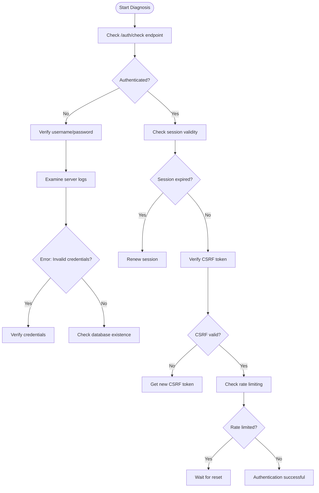
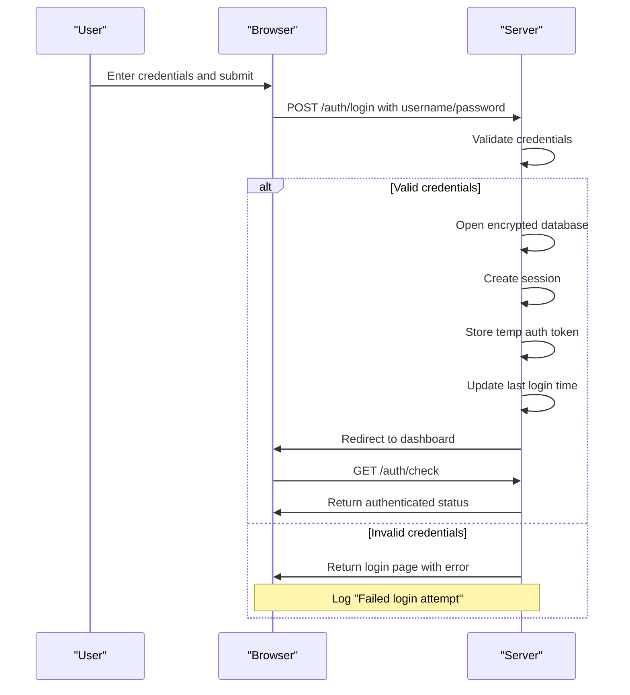
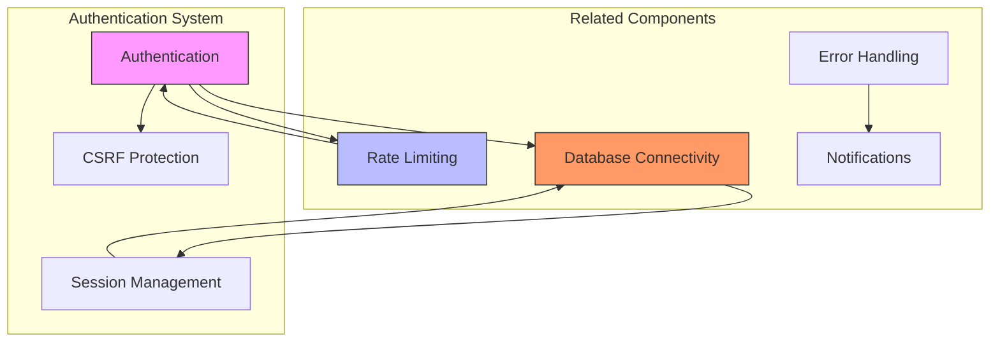

# Troubleshooting

<cite>
**Referenced Files in This Document**   
- [routes.py](file://src/local_deep_research/web/auth/routes.py)
- [decorators.py](file://src/local_deep_research/web/auth/decorators.py)
- [session_manager.py](file://src/local_deep_research/web/auth/session_manager.py)
- [encrypted_db.py](file://src/local_deep_research/database/encrypted_db.py)
- [error_reporter.py](file://src/local_deep_research/error_handling/error_reporter.py)
- [rate_limiter.py](file://src/local_deep_research/web/utils/rate_limiter.py)
- [session_passwords.py](file://src/local_deep_research/database/session_passwords.py)
- [temp_auth.py](file://src/local_deep_research/database/temp_auth.py)
</cite>

## Table of Contents
1. [Introduction](#introduction)
2. [Common Authentication Issues](#common-authentication-issues)
3. [Diagnostic Procedures](#diagnostic-procedures)
4. [API Key Validation Failures](#api-key-validation-failures)
5. [Session Expiration Problems](#session-expiration-problems)
6. [Login Errors](#login-errors)
7. [Relationship with Other System Components](#relationship-with-other-system-components)
8. [Web Interface and API Access Issues](#web-interface-and-api-access-issues)
9. [Step-by-Step Troubleshooting Guides](#step-by-step-troubleshooting-guides)
10. [Conclusion](#conclusion)

## Introduction
This document provides comprehensive guidance for troubleshooting authentication issues in the local-deep-research system. The authentication system uses SQLCipher encrypted databases with browser password manager support, implementing session-based authentication with CSRF protection. Common issues include API key validation failures, session expiration problems, and login errors, which can be diagnosed through systematic procedures involving log analysis, error message interpretation, and configuration verification. This guide addresses solutions for both web interface and API access issues, explaining the relationship between authentication problems and other system components like rate limiting and database connectivity.

## Common Authentication Issues
The local-deep-research system encounters several common authentication issues that affect user access and system functionality. These include API key validation failures, session expiration problems, and login errors. API key validation failures occur when configured API keys are incorrect, expired, or improperly formatted, preventing access to external services like OpenAI or Anthropic. Session expiration problems arise when user sessions timeout due to inactivity or configuration issues, requiring re-authentication. Login errors typically result from incorrect credentials, database connection issues, or rate limiting. The system implements rate limiting on authentication endpoints to prevent brute force attacks, with default limits of 5 attempts per 15 minutes for login and 3 attempts per hour for registration. These issues are often interconnected, as authentication problems can trigger rate limiting, and session management issues can affect database connectivity.

**Section sources**
- [routes.py](file://src/local_deep_research/web/auth/routes.py#L66-L100)
- [rate_limiter.py](file://src/local_deep_research/web/utils/rate_limiter.py#L22-L24)
- [error_reporter.py](file://src/local_deep_research/error_handling/error_reporter.py#L45-L56)

## Diagnostic Procedures
Diagnosing authentication issues in the local-deep-research system involves analyzing specific error messages, log entries, and system behavior. The first step is to check the authentication status using the `/auth/check` endpoint, which returns JSON indicating whether the user is authenticated and their username. For API access issues, verify the presence of valid CSRF tokens by accessing the `/auth/csrf-token` endpoint. When investigating login failures, examine the server logs for messages like "Failed login attempt" which indicate invalid credentials or non-existent databases. For session-related issues, check for log entries containing "No database connection for authenticated user" which suggest session management problems. The system provides an integrity check endpoint at `/auth/integrity-check` that verifies database integrity for the current user. Additionally, monitoring rate limiting headers in HTTP responses helps identify if requests are being blocked due to excessive attempts. The error reporter categorizes authentication issues into specific types like MODEL_ERROR for API key problems or RATE_LIMIT_ERROR for quota issues, providing targeted suggestions for resolution.



**Diagram sources **
- [routes.py](file://src/local_deep_research/web/auth/routes.py#L434-L443)
- [routes.py](file://src/local_deep_research/web/auth/routes.py#L32-L45)
- [error_reporter.py](file://src/local_deep_research/error_handling/error_reporter.py#L100-L120)

## API Key Validation Failures
API key validation failures occur when the system cannot authenticate with external LLM services due to incorrect or missing API keys. These issues are categorized as MODEL_ERROR in the error reporting system and trigger AUTH_ISSUE notifications. Common causes include improperly configured API keys in settings, expired keys, or network connectivity issues preventing validation. The system checks for specific error patterns like "API key invalid", "Authentication error", or "401 API key" to identify these issues. When an API key validation failure occurs, the error reporter suggests actions such as verifying the model name, checking if the model is available, validating API keys, or switching to a different model provider. For OpenAI integration, ensure the API key is correctly entered in the settings interface and has sufficient quota. The system automatically detects these errors during research operations and provides user-friendly error messages with suggested resolutions. To prevent these issues, regularly verify API key validity and ensure proper configuration in the security settings section of the application.

**Section sources**
- [error_reporter.py](file://src/local_deep_research/error_handling/error_reporter.py#L45-L56)
- [error_reporter.py](file://src/local_deep_research/error_handling/error_reporter.py#L290-L308)
- [routes.py](file://src/local_deep_research/web/auth/routes.py#L445-L503)

## Session Expiration Problems
Session expiration problems in the local-deep-research system occur when user sessions timeout due to inactivity or configuration issues. The system implements a session manager with two timeout levels: 2 hours for regular sessions and 30 days for "remember me" sessions. When a session expires, users may experience authentication issues despite appearing logged in, with log entries showing "No database connection for authenticated user". This happens because the session ID remains valid but the associated database connection has been terminated. The session manager validates sessions on each request, checking the last access time against the appropriate timeout period. For regular sessions, inactivity for more than 2 hours results in expiration, while "remember me" sessions last up to 30 days. When a session expires, the system automatically destroys it and requires re-authentication. Users can mitigate this by enabling the "remember me" option during login, which extends the session duration significantly. The system also provides mechanisms to refresh sessions through continued activity, preventing premature expiration during active use.

```mermaid
classDiagram
class SessionManager {
+sessions : Dict[str, dict]
+session_timeout : timedelta
+remember_me_timeout : timedelta
+create_session(username : str, remember_me : bool) str
+validate_session(session_id : str) Optional[str]
+destroy_session(session_id : str) void
+cleanup_expired_sessions() void
+get_active_sessions_count() int
+get_user_sessions(username : str) list
}
class SessionData {
+username : str
+created_at : datetime
+last_access : datetime
+remember_me : bool
}
SessionManager --> SessionData : "manages"
note right of SessionManager
Handles session creation, validation, and cleanup
Regular sessions : 2 hour timeout
Remember me sessions : 30 day timeout
end note
```

**Diagram sources **
- [session_manager.py](file://src/local_deep_research/web/auth/session_manager.py#L15-L118)
- [decorators.py](file://src/local_deep_research/web/auth/decorators.py#L13-L48)

## Login Errors
Login errors in the local-deep-research system typically result from incorrect credentials, database connection issues, or rate limiting. When a user attempts to log in, the system tries to open their encrypted database using the provided password. If the credentials are invalid or the database doesn't exist, the system logs "Failed login attempt" and returns an authentication error. The login process is rate-limited to 5 attempts per 15 minutes per IP address to prevent brute force attacks. After successful authentication, the system creates a session, stores temporary authentication tokens, and initializes the user's database connection. Common login issues include incorrect passwords, non-existent usernames, and database corruption. The system also checks for SQLCipher availability during login, warning if databases are unencrypted. For users experiencing persistent login issues, verifying the correct username and password combination, ensuring the database file exists, and checking server logs for specific error messages can help resolve the problem. The registration process creates new encrypted databases and automatically logs in users upon completion.



**Diagram sources **
- [routes.py](file://src/local_deep_research/web/auth/routes.py#L66-L249)
- [encrypted_db.py](file://src/local_deep_research/database/encrypted_db.py#L324-L432)

## Relationship with Other System Components
Authentication issues in the local-deep-research system are closely related to other system components, particularly rate limiting and database connectivity. The rate limiting system protects authentication endpoints from brute force attacks, with separate limits for login (5 attempts per 15 minutes) and registration (3 attempts per hour). When users exceed these limits, they receive 429 "Too Many Requests" responses, which the error reporter categorizes as RATE_LIMIT_ERROR and suggests enabling LLM rate limiting in settings. Database connectivity is essential for authentication, as each user has an encrypted database that must be accessible after login. Issues with SQLCipher encryption or database file permissions can prevent successful authentication even with correct credentials. The session management system relies on database connectivity to maintain user sessions, with temporary password storage enabling background processes to access encrypted databases for metrics collection. Authentication problems can cascade to other components, as failed authentication prevents access to research functionality, metrics tracking, and notification systems. The system's error reporter integrates with the notification system to alert users of authentication issues and rate limit warnings.



**Diagram sources **
- [rate_limiter.py](file://src/local_deep_research/web/utils/rate_limiter.py#L1-L77)
- [session_passwords.py](file://src/local_deep_research/database/session_passwords.py#L1-L96)
- [temp_auth.py](file://src/local_deep_research/database/temp_auth.py#L1-L45)

## Web Interface and API Access Issues
Web interface and API access issues in the local-deep-research system stem from different authentication requirements and error handling mechanisms. For web interface access, users must navigate through the login page and maintain valid sessions with CSRF protection. The system uses Flask sessions stored in cookies, with session validation occurring on each request. Web interface issues often manifest as redirect loops, login page reloads, or missing content due to expired sessions or invalid CSRF tokens. For API access, the system requires JSON responses with proper authentication headers and CSRF tokens obtained from the `/auth/csrf-token` endpoint. API requests without valid authentication return 401 status codes with JSON error messages. The authentication decorators differentiate between web and API routes, redirecting unauthenticated web requests while returning JSON errors for API endpoints. Common API access issues include missing CSRF tokens, expired sessions in long-running processes, and incorrect authentication headers. The system provides programmatic access through the client API, allowing automated authentication and session management for external integrations.

**Section sources**
- [decorators.py](file://src/local_deep_research/web/auth/decorators.py#L25-L30)
- [routes.py](file://src/local_deep_research/web/auth/routes.py#L32-L45)
- [routes.py](file://src/local_deep_research/web/auth/routes.py#L434-L443)

## Step-by-Step Troubleshooting Guides
This section provides step-by-step troubleshooting guides for resolving common authentication issues in the local-deep-research system.

### Resolving Expired Sessions
When experiencing expired session issues:
1. Check if you're still authenticated by accessing `/auth/check`
2. If unauthenticated, log in again with your credentials
3. Enable the "remember me" option during login to extend session duration to 30 days
4. Verify that your browser allows session cookies
5. Check server logs for "Session expired" messages
6. Ensure system time is synchronized, as time discrepancies can cause premature expiration
7. Restart the application if sessions continue to expire prematurely

**Section sources**
- [session_manager.py](file://src/local_deep_research/web/auth/session_manager.py#L39-L65)
- [decorators.py](file://src/local_deep_research/web/auth/decorators.py#L32-L46)

### Fixing Incorrect Key Configuration
To resolve API key configuration issues:
1. Navigate to Settings → API Keys in the web interface
2. Verify the API key is correctly entered for the specific service (OpenAI, Anthropic, etc.)
3. Check for leading or trailing spaces in the key field
4. Test the connection using the validation feature if available
5. Verify the key has sufficient quota and permissions
6. Check server logs for "API key invalid" or "Authentication error" messages
7. Rotate the API key if it appears compromised or expired
8. Restart the application after making configuration changes

**Section sources**
- [error_reporter.py](file://src/local_deep_research/error_handling/error_reporter.py#L49-L56)
- [routes.py](file://src/local_deep_research/web/auth/routes.py#L445-L503)

### Addressing Middleware Conflicts
When encountering middleware conflicts:
1. Check for errors related to CSRF tokens in server logs
2. Verify the CSRF token is included in POST requests
3. Obtain a fresh CSRF token from `/auth/csrf-token`
4. Ensure the session cookie is being sent with requests
5. Check for proxy or firewall interference with cookies
6. Verify the rate_limiting configuration is not blocking legitimate requests
7. Test with a fresh browser session or incognito mode
8. Disable any browser extensions that might interfere with cookies or headers

**Section sources**
- [routes.py](file://src/local_deep_research/web/auth/routes.py#L32-L45)
- [rate_limiter.py](file://src/local_deep_research/web/utils/rate_limiter.py#L49-L63)

## Conclusion
Authentication troubleshooting in the local-deep-research system requires understanding the interplay between session management, API key validation, and rate limiting. By following the diagnostic procedures and step-by-step guides outlined in this document, users can effectively resolve common issues like expired sessions, incorrect key configuration, and middleware conflicts. The system's comprehensive error reporting and logging provide valuable insights for diagnosing problems, while the integration with notification systems helps proactively alert users to potential issues. Maintaining proper configuration, monitoring system logs, and understanding the relationship between authentication and other system components are key to ensuring smooth operation. For persistent issues, consulting the detailed logs and error messages will typically reveal the root cause and appropriate resolution path.