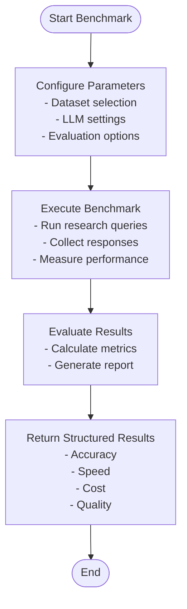
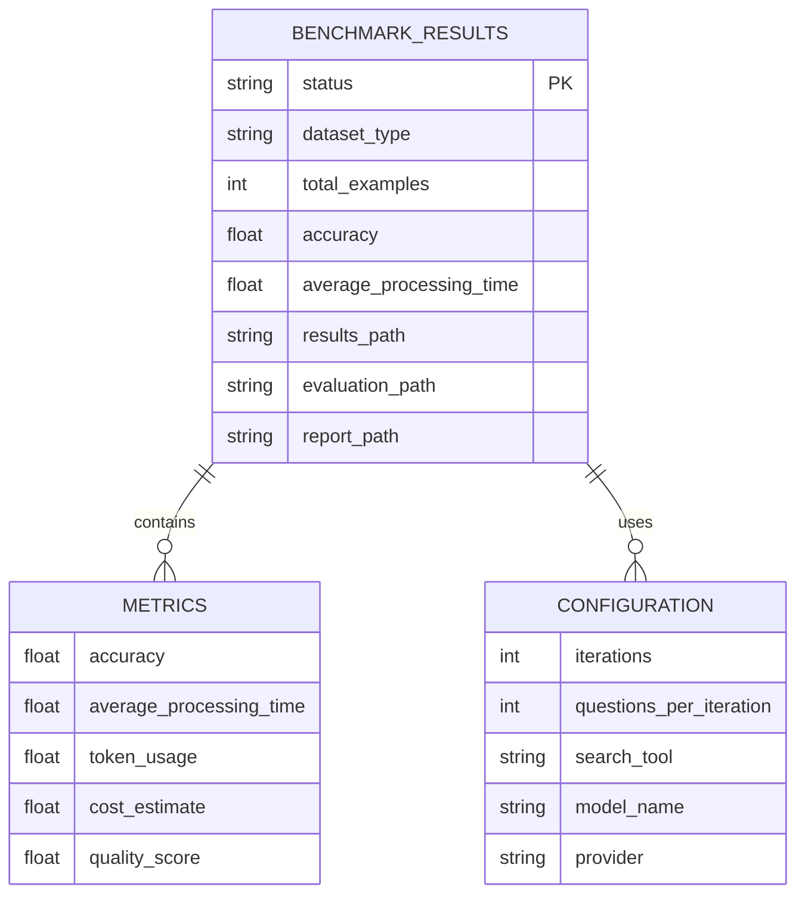
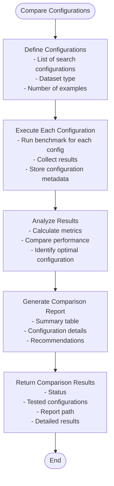

# Benchmarking Functions

<cite>
**Referenced Files in This Document**   
- [benchmark_functions.py](file://src/local_deep_research/api/benchmark_functions.py)
- [runners.py](file://src/local_deep_research/benchmarks/runners.py)
- [metrics.py](file://src/local_deep_research/benchmarks/metrics.py)
- [datasets.py](file://src/local_deep_research/benchmarks/datasets.py)
- [run_simpleqa.py](file://examples/benchmarks/run_simpleqa.py)
- [run_browsecomp.py](file://examples/benchmarks/run_browsecomp.py)
- [BENCHMARKING.md](file://docs/BENCHMARKING.md)
</cite>

## Table of Contents
1. [Introduction](#introduction)
2. [Core Benchmarking Functions](#core-benchmarking-functions)
3. [Benchmark Results Structure](#benchmark-results-structure)
4. [Comparative Benchmarking](#comparative-benchmarking)
5. [Customization and Configuration](#customization-and-configuration)
6. [Dataset Management](#dataset-management)
7. [CI/CD Integration](#cicd-integration)
8. [Resource Usage and Parallel Execution](#resource-usage-and-parallel-execution)
9. [Best Practices](#best-practices)

## Introduction

The benchmarking system in Local Deep Research provides a comprehensive framework for evaluating performance across various dimensions including speed, accuracy, cost, and quality. This documentation details the programmatic API functions that enable users to run performance benchmarks, analyze results, and optimize configurations for different research scenarios.

The benchmarking capabilities are designed to support both simple evaluation workflows and complex comparative analysis, allowing researchers to validate and improve their configurations systematically. The system supports multiple benchmark types, each targeting different aspects of research performance.

**Section sources**
- [BENCHMARKING.md](file://docs/BENCHMARKING.md#L1-L92)

## Core Benchmarking Functions

The programmatic API provides several key functions for running performance benchmarks, accessible through the `local_deep_research.api.benchmark_functions` module. These functions abstract the complexity of benchmark execution while providing extensive configuration options.

The primary benchmarking functions include:

- `evaluate_simpleqa()`: Runs the SimpleQA benchmark for factual question answering
- `evaluate_browsecomp()`: Executes the BrowseComp benchmark for web browsing comprehension
- `evaluate_xbench_deepsearch()`: Performs the xbench-DeepSearch evaluation for deep research capabilities
- `get_available_benchmarks()`: Returns information about available benchmarks
- `compare_configurations()`: Compares multiple configurations on the same benchmark

Each benchmark function accepts parameters for dataset selection, LLM configuration, and evaluation metrics. The functions handle the complete benchmark workflow from execution to result generation, returning structured results that can be further analyzed.



**Diagram sources**
- [benchmark_functions.py](file://src/local_deep_research/api/benchmark_functions.py#L21-L362)

**Section sources**
- [benchmark_functions.py](file://src/local_deep_research/api/benchmark_functions.py#L21-L362)
- [runners.py](file://src/local_deep_research/benchmarks/runners.py#L41-L494)

## Benchmark Results Structure

Benchmark results are returned as structured dictionaries containing comprehensive performance metrics across multiple dimensions. The results structure includes both raw data and calculated metrics, enabling detailed analysis and comparison.

The results dictionary contains the following key components:

### Performance Metrics
| Metric | Description | Type |
|--------|-------------|------|
| accuracy | Percentage of correct answers | float |
| average_processing_time | Average time per query in seconds | float |
| total_examples | Total number of examples processed | int |
| status | Execution status (complete, error, etc.) | string |
| results_path | Path to raw results file | string |
| evaluation_path | Path to evaluation results | string |
| report_path | Path to generated report | string |

### Speed Metrics
Speed metrics track the time required for each research query, including:
- Processing time per example
- Total benchmark execution time
- Search iteration duration
- Response generation latency

### Accuracy Metrics
Accuracy is evaluated through automated grading systems that compare generated answers against ground truth:
- Exact answer matching
- Semantic similarity scoring
- Confidence level assessment
- Error classification

### Cost and Quality Metrics
The system tracks resource usage and quality indicators:
- Token consumption (input/output)
- API call counts
- Source reliability scoring
- Information completeness
- Answer coherence

The results are saved in multiple formats including JSONL for raw data and Markdown for human-readable reports, facilitating both programmatic analysis and visual inspection.



**Diagram sources**
- [metrics.py](file://src/local_deep_research/benchmarks/metrics.py#L1-L12)
- [runners.py](file://src/local_deep_research/benchmarks/runners.py#L416-L447)

**Section sources**
- [metrics.py](file://src/local_deep_research/benchmarks/metrics.py#L1-L12)
- [runners.py](file://src/local_deep_research/benchmarks/runners.py#L375-L404)

## Comparative Benchmarking

The `compare_configurations()` function enables systematic comparison of different LLM providers, research strategies, and configuration parameters. This capability is essential for optimizing performance across various research scenarios.

The function accepts a list of configurations to compare, each specifying different parameters such as:
- Search iterations and questions per iteration
- Search tools and engines
- LLM models and providers
- Custom evaluation models

When no configurations are provided, the function uses default configurations that represent common optimization strategies:
- Base configuration with minimal iterations
- Configuration with increased search iterations
- Configuration with more questions per iteration

The comparative benchmarking process:
1. Executes each configuration sequentially
2. Collects results for all configurations
3. Generates a comprehensive comparison report
4. Creates a summary table with key metrics
5. Documents configuration details for reproducibility

The comparison report includes a markdown file with a summary table showing accuracy, average time, and example counts for each configuration, enabling easy identification of optimal settings.



**Diagram sources**
- [benchmark_functions.py](file://src/local_deep_research/api/benchmark_functions.py#L320-L362)

**Section sources**
- [benchmark_functions.py](file://src/local_deep_research/api/benchmark_functions.py#L320-L362)
- [runners.py](file://src/local_deep_research/benchmarks/runners.py#L364-L396)

## Customization and Configuration

The benchmarking API provides extensive customization options for tailoring evaluations to specific research needs. Users can configure various aspects of the benchmarking process through function parameters and configuration dictionaries.

### LLM Configuration
Users can specify custom models and providers for both search and evaluation:
- `search_model`: Model to use for the search system
- `search_provider`: Provider to use for the search system
- `evaluation_model`: Model for automated evaluation
- `evaluation_provider`: Provider for evaluation
- `endpoint_url`: Custom endpoint URL for API services

### Search Configuration
The search process can be customized through parameters that control:
- `search_iterations`: Number of search iterations per query
- `questions_per_iteration`: Number of questions per iteration
- `search_tool`: Search engine to use (e.g., 'searxng', 'wikipedia')
- `search_strategy`: Research strategy (e.g., 'source_based', 'standard')

### Evaluation Options
The evaluation process supports multiple modes:
- Automated evaluation using specified models
- Human evaluation for subjective assessment
- Hybrid approaches combining both methods

Configuration parameters are inherited from environment settings when not explicitly specified, ensuring consistency with the user's current setup while allowing targeted overrides for benchmarking purposes.

**Section sources**
- [benchmark_functions.py](file://src/local_deep_research/api/benchmark_functions.py#L21-L362)
- [runners.py](file://src/local_deep_research/benchmarks/runners.py#L42-L52)

## Dataset Management

The benchmarking system supports multiple datasets for evaluating different research capabilities. The available datasets include:

### SimpleQA
- Focus: Factual question answering
- Characteristics: Clear answers, general knowledge
- Use case: Baseline performance testing
- Recommended examples: 100

### BrowseComp
- Focus: Web browsing comprehension
- Characteristics: Complex browsing tasks
- Use case: Advanced research evaluation
- Recommended examples: 100

### xbench-DeepSearch
- Focus: Deep research and investigation
- Characteristics: Multi-step queries, comprehensive analysis
- Use case: Complex research scenario testing
- Recommended examples: 100

The `get_available_benchmarks()` function returns metadata about available benchmarks, including their IDs, names, descriptions, and recommended example counts. This information helps users select appropriate datasets for their evaluation needs.

Dataset loading is handled through a registry system that supports both legacy and modern dataset classes, ensuring backward compatibility while enabling future extensibility.

**Section sources**
- [benchmark_functions.py](file://src/local_deep_research/api/benchmark_functions.py#L290-L317)
- [datasets.py](file://src/local_deep_research/benchmarks/datasets.py#L1-L23)

## CI/CD Integration

The programmatic API is designed to facilitate integration with CI/CD pipelines, enabling automated performance testing as part of the development workflow. The structured results format and command-line executables make it straightforward to incorporate benchmarking into continuous integration systems.

Key integration points include:
- Return codes indicating success or failure
- Machine-readable result formats (JSONL)
- Configurable output directories
- Deterministic execution with seed support

Example integration in a CI/CD pipeline:
```bash
# Run benchmark in CI environment
python examples/benchmarks/run_simpleqa.py \
  --examples 20 \
  --iterations 3 \
  --questions 3 \
  --output-dir ./ci-benchmark-results \
  --eval-model gpt-4 \
  --eval-provider openai

# Check if accuracy meets threshold
python -c "
import json
with open('./ci-benchmark-results/results.json') as f:
    results = json.load(f)
assert results['accuracy'] > 0.8, 'Accuracy below threshold'
"
```

The benchmark results can be used as quality gates in deployment pipelines, ensuring that performance does not regress below acceptable levels.

**Section sources**
- [run_simpleqa.py](file://examples/benchmarks/run_simpleqa.py#L1-L117)
- [run_browsecomp.py](file://examples/benchmarks/run_browsecomp.py#L1-L289)

## Resource Usage and Parallel Execution

The benchmarking system includes considerations for resource usage and supports parallel execution to improve efficiency. While the current implementation primarily runs benchmarks sequentially, the architecture supports parallel execution patterns.

### Resource Management
- Output directory creation with proper permissions
- File handling with error recovery
- Memory management during large-scale evaluations
- Progress tracking and checkpointing

### Parallel Execution Considerations
Although the primary benchmark functions run sequentially, the system can be extended for parallel execution by:
- Running multiple benchmark instances with different configurations
- Using separate output directories to avoid conflicts
- Implementing coordination mechanisms for resource sharing

The `run_resumable_parallel_benchmark.py` example script demonstrates patterns for parallel execution, allowing users to distribute benchmark workloads across multiple processes or machines.

Resource usage is monitored through the metrics system, which tracks processing time and can be extended to monitor other resource consumption metrics like memory usage and network bandwidth.

**Section sources**
- [runners.py](file://src/local_deep_research/benchmarks/runners.py#L71-L73)
- [run_resumable_parallel_benchmark.py](file://examples/benchmarks/scripts/run_focused_benchmark_fixed.py)

## Best Practices

### Benchmarking Workflow
1. Start with small example counts (20-50) to verify configuration
2. Use the full dataset (100 examples) for reliable metrics
3. Test multiple configurations to identify optimal settings
4. Validate results with your specific research topics

### Configuration Testing
- Compare different search engines (Tavily, SearXNG, Brave)
- Test various research strategies (Focused Iteration, Source-Based)
- Evaluate different LLM models and providers
- Adjust iteration counts and questions per iteration

### Performance Optimization
- Use focused iteration strategy for fact-based questions
- Increase iterations for complex research tasks
- Select search engines based on domain relevance
- Monitor API usage and rate limits

### Responsible Usage
- Start with small tests to verify configuration
- Use moderate example counts for shared resources
- Monitor API usage in the Metrics page
- Respect rate limits and shared infrastructure

Remember that benchmark results are indicators for configuration testing and may not perfectly predict performance on specific research topics. Always validate configurations with your actual research questions.

**Section sources**
- [BENCHMARKING.md](file://docs/BENCHMARKING.md#L1-L92)
- [benchmark_functions.py](file://src/local_deep_research/api/benchmark_functions.py#L21-L362)