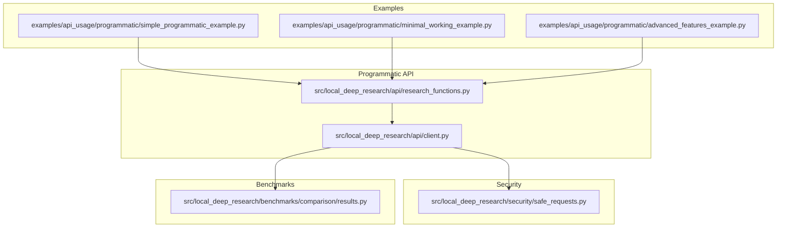
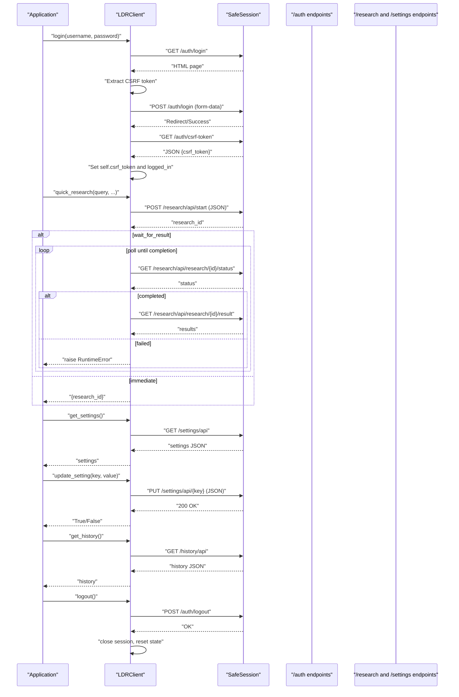
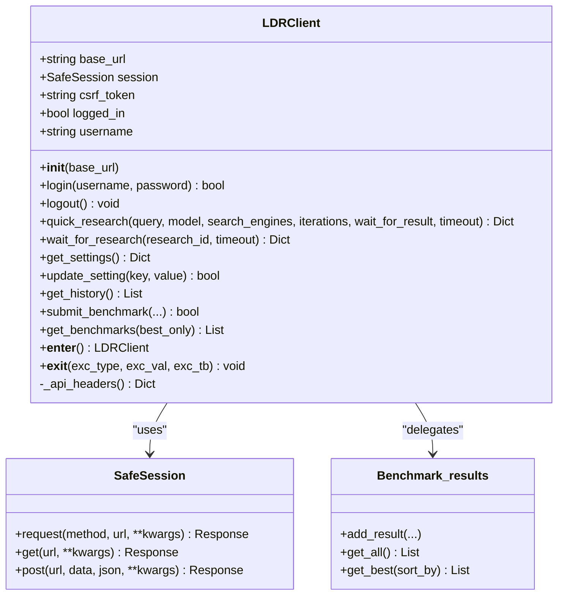
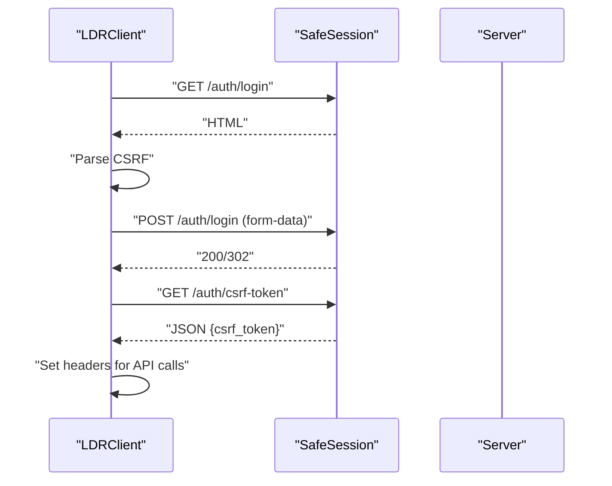
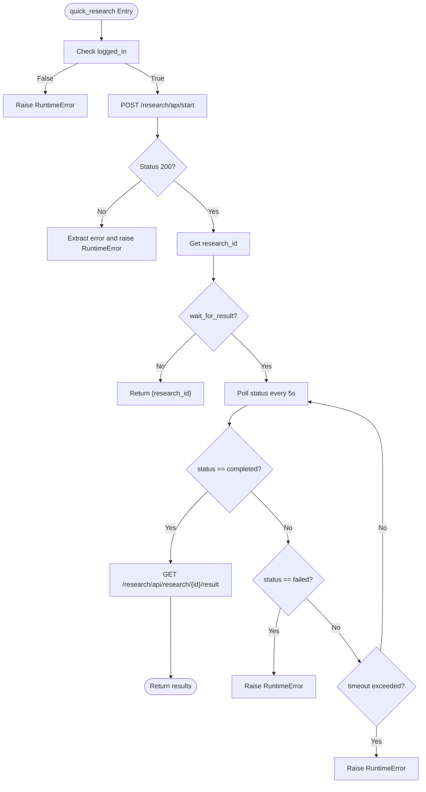
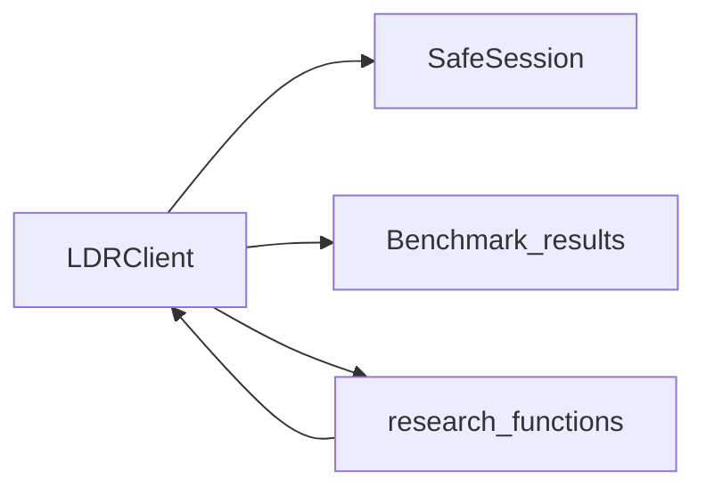

# Client Interface

<cite>
**Referenced Files in This Document**
- [client.py](file://src/local_deep_research/api/client.py)
- [safe_requests.py](file://src/local_deep_research/security/safe_requests.py)
- [results.py](file://src/local_deep_research/benchmarks/comparison/results.py)
- [research_functions.py](file://src/local_deep_research/api/research_functions.py)
- [simple_programmatic_example.py](file://examples/api_usage/programmatic/simple_programmatic_example.py)
- [minimal_working_example.py](file://examples/api_usage/programmatic/minimal_working_example.py)
- [advanced_features_example.py](file://examples/api_usage/programmatic/advanced_features_example.py)
</cite>

## Table of Contents
1. [Introduction](#introduction)
2. [Project Structure](#project-structure)
3. [Core Components](#core-components)
4. [Architecture Overview](#architecture-overview)
5. [Detailed Component Analysis](#detailed-component-analysis)
6. [Dependency Analysis](#dependency-analysis)
7. [Performance Considerations](#performance-considerations)
8. [Troubleshooting Guide](#troubleshooting-guide)
9. [Conclusion](#conclusion)
10. [Appendices](#appendices)

## Introduction
This document provides comprehensive documentation for the Client interface used in the programmatic API. It focuses on the LDRClient class, covering constructor parameters, authentication, session lifecycle, research execution, benchmarking, settings retrieval, error handling, and practical usage patterns. It also explains thread-safety and connection pooling behavior, and outlines recommended retry strategies when interacting with the client.

## Project Structure
The Client interface resides in the programmatic API layer and integrates with security utilities and benchmarking modules. The primary implementation is in the client module, with supporting modules for secure HTTP requests and benchmark persistence.

**Diagram sources**
- [client.py](file://src/local_deep_research/api/client.py#L1-L489)
- [safe_requests.py](file://src/local_deep_research/security/safe_requests.py#L1-L228)
- [results.py](file://src/local_deep_research/benchmarks/comparison/results.py#L1-L79)
- [research_functions.py](file://src/local_deep_research/api/research_functions.py#L1-L658)
- [simple_programmatic_example.py](file://examples/api_usage/programmatic/simple_programmatic_example.py#L1-L87)
- [minimal_working_example.py](file://examples/api_usage/programmatic/minimal_working_example.py#L1-L89)
- [advanced_features_example.py](file://examples/api_usage/programmatic/advanced_features_example.py#L1-L613)

**Section sources**
- [client.py](file://src/local_deep_research/api/client.py#L1-L120)
- [safe_requests.py](file://src/local_deep_research/security/safe_requests.py#L1-L120)
- [research_functions.py](file://src/local_deep_research/api/research_functions.py#L1-L120)

## Core Components
- LDRClient: HTTP client for Local Deep Research API with automatic CSRF handling, login/logout, research orchestration, settings management, and benchmarking helpers.
- SafeSession: Secure HTTP session wrapper with SSRF protections and timeouts.
- Benchmark_results: In-memory persistence for community benchmark submissions and retrieval.

Key responsibilities:
- Authentication and session management
- CSRF token acquisition and propagation
- Research orchestration (start, poll, and retrieve results)
- Settings retrieval and updates
- History retrieval
- Benchmark submission and retrieval
- Context manager support for auto-cleanup

**Section sources**
- [client.py](file://src/local_deep_research/api/client.py#L65-L160)
- [safe_requests.py](file://src/local_deep_research/security/safe_requests.py#L178-L228)
- [results.py](file://src/local_deep_research/benchmarks/comparison/results.py#L1-L79)

## Architecture Overview
The LDRClient composes a SafeSession for HTTP operations and interacts with the backend via CSRF-protected endpoints. It encapsulates:
- Login flow with CSRF extraction from HTML and API token retrieval
- Research lifecycle with polling
- Settings and history endpoints
- Benchmarking via a local results store

**Diagram sources**
- [client.py](file://src/local_deep_research/api/client.py#L90-L378)
- [safe_requests.py](file://src/local_deep_research/security/safe_requests.py#L178-L228)

## Detailed Component Analysis

### LDRClient Class
The LDRClient class encapsulates all client-side logic for interacting with the Local Deep Research API.

- Constructor
  - Parameters: base_url (default: http://localhost:5000)
  - Behavior: Initializes a SafeSession with allow_localhost enabled, sets CSRF token to None, logged_in to False, and username to None.
  - Notes: Uses SafeSession for all HTTP operations to enforce SSRF protections and timeouts.

- Authentication
  - login(username, password) -> bool
    - Steps:
      1) GET /auth/login to extract CSRF token from HTML form.
      2) POST /auth/login with form-encoded data including CSRF token.
      3) GET /auth/csrf-token to retrieve JSON CSRF token for API calls.
    - Returns: True on success, False on failure.
    - Exceptions: Raises RuntimeError if not logged in before calling research or settings methods.

- Session Management
  - logout(): Logs out, clears session, closes underlying session, resets CSRF token and logged_in flag.
  - Context manager: __enter__ returns self; __exit__ calls logout() for auto-cleanup.

- Research Execution
  - quick_research(query, model=None, search_engines=None, iterations=2, wait_for_result=True, timeout=300) -> Dict
    - Parameters:
      - query: Research question
      - model: LLM model identifier
      - search_engines: List of search engines (default ["searxng"])
      - iterations: Number of research cycles
      - wait_for_result: If True, polls for completion; if False, returns research_id
      - timeout: Maximum seconds to wait
    - Returns:
      - If waiting: Dict with summary, sources, findings, and metadata
      - If not waiting: Dict with research_id
    - Exceptions:
      - RuntimeError if not logged in
      - RuntimeError on start failure with extracted error message
      - RuntimeError on timeout or failed status
  - wait_for_research(research_id, timeout=300) -> Dict
    - Polls status every 5 seconds until completion or timeout.
    - Returns results on success; raises RuntimeError on failure or timeout.

- Settings Management
  - get_settings() -> Dict
    - Returns current user settings.
    - Raises RuntimeError if not logged in.
  - update_setting(key, value) -> bool
    - Updates a single setting key.
    - Returns True on success.

- History Retrieval
  - get_history() -> List[Dict]
    - Returns list of research history items.
    - Handles different response formats (dict or list).
    - Raises RuntimeError if not logged in.

- Benchmarking
  - submit_benchmark(...): Delegates to Benchmark_results.add_result(...) and persists to a JSON file.
  - get_benchmarks(best_only=False): Delegates to Benchmark_results.get_all()/get_best().

- Convenience
  - quick_query(username, password, query, base_url="http://localhost:5000") -> str
    - One-liner to perform a quick research and return summary text.

**Diagram sources**
- [client.py](file://src/local_deep_research/api/client.py#L65-L489)
- [safe_requests.py](file://src/local_deep_research/security/safe_requests.py#L178-L228)
- [results.py](file://src/local_deep_research/benchmarks/comparison/results.py#L1-L79)

**Section sources**
- [client.py](file://src/local_deep_research/api/client.py#L65-L489)

### Authentication Flow
- Login extracts CSRF from HTML form, posts credentials with CSRF, then retrieves API CSRF token for subsequent requests.
- Headers for API calls include X-CSRF-Token when available.

**Diagram sources**
- [client.py](file://src/local_deep_research/api/client.py#L90-L160)

**Section sources**
- [client.py](file://src/local_deep_research/api/client.py#L90-L160)

### Research Execution Flow
- quick_research starts a research job and either returns immediately with research_id or waits for completion.
- wait_for_research polls status and retrieves results upon completion.

**Diagram sources**
- [client.py](file://src/local_deep_research/api/client.py#L170-L301)

**Section sources**
- [client.py](file://src/local_deep_research/api/client.py#L170-L301)

### Settings and History
- get_settings: GET /settings/api returns current settings.
- update_setting: PUT /settings/api/{key} updates a single setting.
- get_history: GET /history/api returns research history with flexible response formats.

**Section sources**
- [client.py](file://src/local_deep_research/api/client.py#L302-L367)

### Benchmarking
- submit_benchmark delegates to Benchmark_results.add_result and persists to a JSON file.
- get_benchmarks delegates to Benchmark_results.get_all/get_best.

**Section sources**
- [client.py](file://src/local_deep_research/api/client.py#L379-L448)
- [results.py](file://src/local_deep_research/benchmarks/comparison/results.py#L1-L79)

### Practical Examples
- Simple programmatic usage demonstrates quick_summary, detailed_research, and report generation.
- Minimal working example shows programmatic mode without database dependencies.
- Advanced features example demonstrates report generation, exports, analysis, and batch processing.

**Section sources**
- [simple_programmatic_example.py](file://examples/api_usage/programmatic/simple_programmatic_example.py#L1-L87)
- [minimal_working_example.py](file://examples/api_usage/programmatic/minimal_working_example.py#L1-L89)
- [advanced_features_example.py](file://examples/api_usage/programmatic/advanced_features_example.py#L1-L613)

## Dependency Analysis
- LDRClient depends on SafeSession for HTTP operations, enforcing SSRF protections and timeouts.
- LDRClient delegates benchmarking to Benchmark_results for persistence.
- LDRClient’s research methods rely on backend endpoints for start, status, and result retrieval.
- Convenience functions in research_functions.py provide programmatic access to search and report generation.

**Diagram sources**
- [client.py](file://src/local_deep_research/api/client.py#L65-L160)
- [safe_requests.py](file://src/local_deep_research/security/safe_requests.py#L178-L228)
- [results.py](file://src/local_deep_research/benchmarks/comparison/results.py#L1-L79)
- [research_functions.py](file://src/local_deep_research/api/research_functions.py#L1-L120)

**Section sources**
- [client.py](file://src/local_deep_research/api/client.py#L65-L160)
- [safe_requests.py](file://src/local_deep_research/security/safe_requests.py#L178-L228)
- [results.py](file://src/local_deep_research/benchmarks/comparison/results.py#L1-L79)
- [research_functions.py](file://src/local_deep_research/api/research_functions.py#L1-L120)

## Performance Considerations
- Connection pooling: SafeSession inherits from requests.Session, which maintains persistent connections across requests within the same session instance. This reduces TCP/TLS overhead for multiple calls.
- Timeouts: SafeSession enforces a default timeout for all requests, preventing hangs. LDRClient’s polling uses fixed intervals and a configurable timeout.
- Response size limits: SafeSession checks Content-Length to guard against oversized responses.
- Polling interval: wait_for_research polls every 5 seconds; adjust timeout according to workload.

[No sources needed since this section provides general guidance]

## Troubleshooting Guide
Common issues and resolutions:
- Not logged in: Methods like quick_research, get_settings, update_setting, and get_history raise RuntimeError if not logged in. Ensure login() succeeds before calling these methods.
- Login failures: Inspect status codes and CSRF extraction. If CSRF token cannot be found, verify server availability and HTML structure.
- Research start failures: The client extracts error messages from responses; catch RuntimeError and inspect the message for details.
- Research timeouts: Increase timeout parameter or reduce workload. The client raises RuntimeError when timeout is exceeded.
- Network errors: SafeSession raises requests exceptions on timeouts or request failures; wrap calls with try/except and handle accordingly.
- Benchmark persistence: Ensure file output permissions and settings allow file writes when submitting or retrieving benchmark results.

Recommended retry strategies:
- Transient network errors: Retry with exponential backoff and jitter for HTTP operations.
- Rate limiting: Implement backoff based on Retry-After headers when available.
- Idempotent operations: Prefer idempotent retries for research start and settings updates.
- Non-idempotent operations: Avoid retrying research start; instead, poll for status and retry only on transient failures.

**Section sources**
- [client.py](file://src/local_deep_research/api/client.py#L170-L301)
- [safe_requests.py](file://src/local_deep_research/security/safe_requests.py#L1-L120)

## Conclusion
The LDRClient provides a robust, secure, and convenient interface for programmatic access to Local Deep Research. It manages authentication, CSRF tokens, session lifecycle, research orchestration, settings, history, and benchmarking. By leveraging SafeSession for secure HTTP operations and offering context manager support, it simplifies integration while maintaining strong security and reliability.

[No sources needed since this section summarizes without analyzing specific files]

## Appendices

### API Method Reference

- LDRClient.__init__(base_url="http://localhost:5000")
  - Parameters: base_url (string)
  - Returns: None
  - Side effects: Initializes session and state

- LDRClient.login(username, password) -> bool
  - Parameters: username (string), password (string)
  - Returns: bool
  - Exceptions: RuntimeError if not logged in before research/settings

- LDRClient.logout() -> None
  - Parameters: None
  - Returns: None
  - Side effects: Clears session and state

- LDRClient.quick_research(query, model=None, search_engines=None, iterations=2, wait_for_result=True, timeout=300) -> Dict
  - Parameters: query (string), model (optional string), search_engines (optional list), iterations (int), wait_for_result (bool), timeout (int)
  - Returns: Dict with research results or research_id
  - Exceptions: RuntimeError on auth, start failure, timeout, or failed status

- LDRClient.wait_for_research(research_id, timeout=300) -> Dict
  - Parameters: research_id (string), timeout (int)
  - Returns: Dict with results
  - Exceptions: RuntimeError on failure or timeout

- LDRClient.get_settings() -> Dict
  - Parameters: None
  - Returns: Dict with settings
  - Exceptions: RuntimeError if not logged in

- LDRClient.update_setting(key, value) -> bool
  - Parameters: key (string), value (any)
  - Returns: bool
  - Exceptions: RuntimeError if not logged in

- LDRClient.get_history() -> List[Dict]
  - Parameters: None
  - Returns: List of history items
  - Exceptions: RuntimeError if not logged in

- LDRClient.submit_benchmark(model, hardware, accuracy_focused, accuracy_source, avg_time_per_question, context_window, temperature, ldr_version, date_tested, notes="")
  - Parameters: model (string), hardware (string), accuracy_focused (float), accuracy_source (float), avg_time_per_question (float), context_window (int), temperature (float), ldr_version (string), date_tested (string), notes (string)
  - Returns: bool

- LDRClient.get_benchmarks(best_only=False) -> List
  - Parameters: best_only (bool)
  - Returns: List of benchmark results

- LDRClient.__enter__() -> LDRClient
- LDRClient.__exit__(exc_type, exc_val, exc_tb) -> None

- quick_query(username, password, query, base_url="http://localhost:5000") -> str
  - Parameters: username (string), password (string), query (string), base_url (string)
  - Returns: str (summary)

**Section sources**
- [client.py](file://src/local_deep_research/api/client.py#L65-L489)

### Thread Safety and Connection Pooling
- Thread safety: LDRClient holds per-instance state (session, CSRF token, logged_in, username). Each client instance is intended for single-threaded use. If sharing across threads, synchronize access to the same instance or create separate instances per thread.
- Connection pooling: SafeSession uses requests.Session, which maintains persistent connections. Reuse the same LDRClient instance for multiple calls to benefit from pooling. Close or logout to release resources.

**Section sources**
- [safe_requests.py](file://src/local_deep_research/security/safe_requests.py#L178-L228)
- [client.py](file://src/local_deep_research/api/client.py#L65-L120)

### Practical Usage Patterns
- Initialization and login:
  - Create LDRClient with base_url, call login(), then perform research or settings operations.
- Context manager usage:
  - Use with statement to ensure logout and session closure.
- Cleanup:
  - Explicitly call logout() or rely on context manager exit.
- Examples:
  - See simple_programmatic_example.py, minimal_working_example.py, and advanced_features_example.py for end-to-end usage.

**Section sources**
- [client.py](file://src/local_deep_research/api/client.py#L449-L489)
- [simple_programmatic_example.py](file://examples/api_usage/programmatic/simple_programmatic_example.py#L1-L87)
- [minimal_working_example.py](file://examples/api_usage/programmatic/minimal_working_example.py#L1-L89)
- [advanced_features_example.py](file://examples/api_usage/programmatic/advanced_features_example.py#L1-L613)