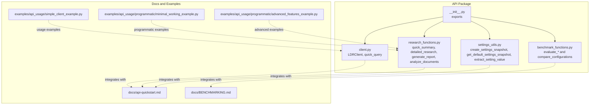
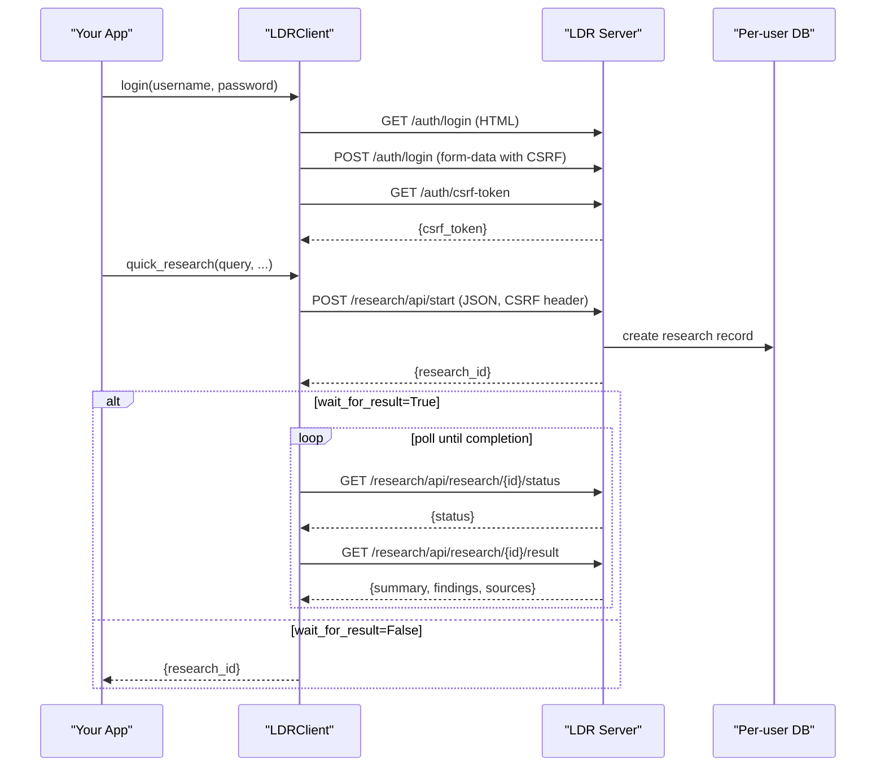
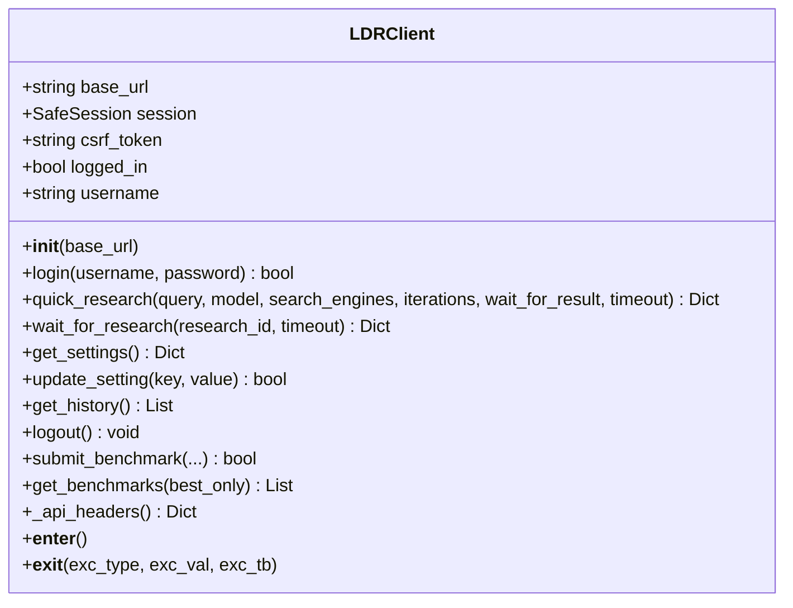
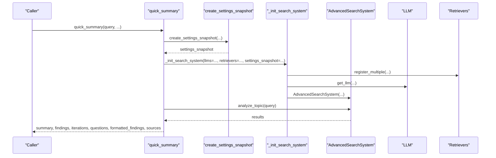
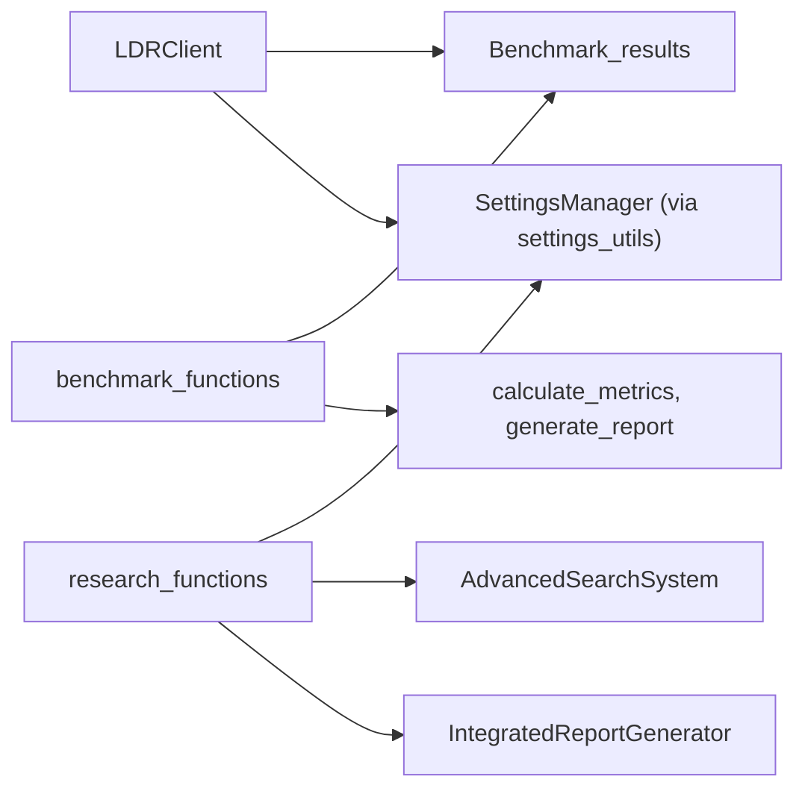

# Programmatic API

<cite>
**Referenced Files in This Document**
- [client.py](file://src/local_deep_research/api/client.py)
- [research_functions.py](file://src/local_deep_research/api/research_functions.py)
- [settings_utils.py](file://src/local_deep_research/api/settings_utils.py)
- [benchmark_functions.py](file://src/local_deep_research/api/benchmark_functions.py)
- [__init__.py](file://src/local_deep_research/api/__init__.py)
- [api-quickstart.md](file://docs/api-quickstart.md)
- [simple_client_example.py](file://examples/api_usage/simple_client_example.py)
- [minimal_working_example.py](file://examples/api_usage/programmatic/minimal_working_example.py)
- [advanced_features_example.py](file://examples/api_usage/programmatic/advanced_features_example.py)
- [BENCHMARKING.md](file://docs/BENCHMARKING.md)
</cite>

## Table of Contents
1. [Introduction](#introduction)
2. [Project Structure](#project-structure)
3. [Core Components](#core-components)
4. [Architecture Overview](#architecture-overview)
5. [Detailed Component Analysis](#detailed-component-analysis)
6. [Dependency Analysis](#dependency-analysis)
7. [Performance Considerations](#performance-considerations)
8. [Troubleshooting Guide](#troubleshooting-guide)
9. [Conclusion](#conclusion)
10. [Appendices](#appendices)

## Introduction
This document describes the programmatic API exposed by the client module and related research, settings, and benchmarking utilities. It focuses on:
- The Client class interface for HTTP access to the Local Deep Research (LDR) server
- Programmatic research functions for quick summaries, detailed research, and report generation
- Settings utilities for building and managing settings snapshots
- Benchmarking capabilities for evaluating configurations
- Configuration options, connection management, and authentication
- Practical usage examples, asynchronous workflows, and integration guidance
- Performance considerations and production best practices

## Project Structure
The programmatic API surface is primarily defined in the api package:
- Client class and convenience functions for HTTP access
- Research functions for programmatic summarization, reporting, and document analysis
- Settings utilities for programmatic configuration
- Benchmarking functions for evaluating search configurations

**Diagram sources**
- [__init__.py](file://src/local_deep_research/api/__init__.py#L1-L48)
- [client.py](file://src/local_deep_research/api/client.py#L1-L489)
- [research_functions.py](file://src/local_deep_research/api/research_functions.py#L1-L658)
- [settings_utils.py](file://src/local_deep_research/api/settings_utils.py#L1-L333)
- [benchmark_functions.py](file://src/local_deep_research/api/benchmark_functions.py#L1-L362)
- [api-quickstart.md](file://docs/api-quickstart.md#L1-L232)
- [simple_client_example.py](file://examples/api_usage/simple_client_example.py#L1-L132)
- [minimal_working_example.py](file://examples/api_usage/programmatic/minimal_working_example.py#L1-L89)
- [advanced_features_example.py](file://examples/api_usage/programmatic/advanced_features_example.py#L1-L613)
- [BENCHMARKING.md](file://docs/BENCHMARKING.md#L1-L92)

**Section sources**
- [__init__.py](file://src/local_deep_research/api/__init__.py#L1-L48)

## Core Components
- LDRClient: HTTP client that manages authentication, CSRF tokens, and research lifecycle
- Research functions: quick_summary, detailed_research, generate_report, analyze_documents
- Settings utilities: create_settings_snapshot, get_default_settings_snapshot, extract_setting_value
- Benchmark functions: evaluate_simpleqa, evaluate_browsecomp, evaluate_xbench_deepsearch, compare_configurations, get_available_benchmarks

**Section sources**
- [client.py](file://src/local_deep_research/api/client.py#L65-L489)
- [research_functions.py](file://src/local_deep_research/api/research_functions.py#L1-L658)
- [settings_utils.py](file://src/local_deep_research/api/settings_utils.py#L1-L333)
- [benchmark_functions.py](file://src/local_deep_research/api/benchmark_functions.py#L1-L362)

## Architecture Overview
The programmatic API exposes two primary pathways:
- HTTP client (LDRClient) for server-side orchestration and persistence
- Programmatic functions for in-process research without database dependencies

**Diagram sources**
- [client.py](file://src/local_deep_research/api/client.py#L90-L301)
- [api-quickstart.md](file://docs/api-quickstart.md#L123-L149)

## Detailed Component Analysis

### LDRClient Class
Responsibilities:
- Manage session and CSRF token lifecycle
- Authenticate and maintain login state
- Start research, poll status, and retrieve results
- Retrieve settings, update settings, and fetch history
- Submit and retrieve community benchmark results
- Context manager support for automatic logout

Key methods and behaviors:
- Initialization: accepts base_url, constructs a SafeSession with allow_localhost
- login(username, password): extracts CSRF from login page, posts form, retrieves API CSRF token, sets logged_in flag
- quick_research(query, model, search_engines, iterations, wait_for_result, timeout): POST to start research, return immediately with research_id if wait_for_result is False, otherwise poll and return results
- wait_for_research(research_id, timeout): poll status endpoint, fetch result on completion, raise on failure or timeout
- get_settings(): GET settings endpoint
- update_setting(key, value): PUT settings endpoint with CSRF header
- get_history(): GET history endpoint with robust response handling
- logout(): POST logout, close session, clear state
- submit_benchmark(...): delegates to Benchmark_results
- get_benchmarks(best_only): delegates to Benchmark_results
- Context manager: __enter__/__exit__ for auto-logout

Exceptions and error handling:
- Raises RuntimeError for not logged in, HTTP failures, missing research_id, research failure, and timeouts
- Logs detailed errors and attempts to extract error messages from JSON or text

Asynchronous operations:
- wait_for_research implements polling; callers can start multiple research jobs and collect results later
- quick_research supports wait_for_result=False to initiate and then poll manually

Connection management:
- Uses SafeSession for secure HTTP handling
- Maintains CSRF token and session cookies across requests
- Supports base_url customization

Usage examples:
- One-liner quick_query for simple scenarios
- Context manager for automatic cleanup
- Batch research with manual polling

**Section sources**
- [client.py](file://src/local_deep_research/api/client.py#L65-L489)
- [simple_client_example.py](file://examples/api_usage/simple_client_example.py#L1-L132)

#### Class Diagram

**Diagram sources**
- [client.py](file://src/local_deep_research/api/client.py#L65-L489)

### Research Functions
Programmatic research functions enable in-process research without server dependencies:
- quick_summary(query, research_id, retrievers, llms, provider, api_key, temperature, max_search_results, settings, settings_override, search_original_query, **kwargs)
  - Builds a settings snapshot if not provided
  - Registers custom retrievers and LLMs
  - Initializes AdvancedSearchSystem with provided parameters
  - Runs analyze_topic and returns structured results including summary, findings, iterations, questions, formatted_findings, and sources
- generate_report(query, output_file, progress_callback, searches_per_section, retrievers, llms, provider, api_key, temperature, max_search_results, settings, settings_override, **kwargs)
  - Similar initialization as quick_summary
  - Generates a structured report via IntegratedReportGenerator
  - Optionally writes report to file using verified writer
  - Returns content, metadata, and file_path if saved
- detailed_research(query, research_id, retrievers, llms, **kwargs)
  - Returns comprehensive results with metadata and timestamps
- analyze_documents(query, collection_name, max_results, temperature, force_reindex, output_file)
  - Searches a local collection and summarizes results with an LLM
  - Optionally writes analysis to file

Settings snapshot usage:
- create_settings_snapshot builds a settings snapshot from overrides and kwargs shortcuts
- get_default_settings_snapshot provides defaults without database access
- extract_setting_value retrieves a value from a settings snapshot

Integration with other libraries:
- Works with LangChain retrievers and LLMs by registering them before invoking research functions
- Supports programmatic_mode to avoid database dependencies

**Section sources**
- [research_functions.py](file://src/local_deep_research/api/research_functions.py#L1-L658)
- [settings_utils.py](file://src/local_deep_research/api/settings_utils.py#L1-L333)
- [minimal_working_example.py](file://examples/api_usage/programmatic/minimal_working_example.py#L1-L89)
- [advanced_features_example.py](file://examples/api_usage/programmatic/advanced_features_example.py#L1-L613)

#### Sequence Diagram: quick_summary

**Diagram sources**
- [research_functions.py](file://src/local_deep_research/api/research_functions.py#L149-L306)

### Settings Utilities
Purpose:
- Provide in-memory settings management without database access
- Create settings snapshots for programmatic API usage
- Extract typed values from settings snapshots

Key functions:
- InMemorySettingsManager: loads defaults, merges environment overrides, supports get/set/import/delete
- get_default_settings_snapshot: returns default settings snapshot
- create_settings_snapshot: applies overrides and kwargs shortcuts (provider, api_key, temperature, max_search_results)
- extract_setting_value: safely retrieves a value from a snapshot

Environment overrides:
- Respects LDR_<SETTING_KEY> environment variables and converts types according to ui_element

**Section sources**
- [settings_utils.py](file://src/local_deep_research/api/settings_utils.py#L1-L333)

### Benchmarking Functions
Capabilities:
- evaluate_simpleqa, evaluate_browsecomp, evaluate_xbench_deepsearch: run benchmarks with configurable search iterations, questions per iteration, search tool, and evaluation settings
- compare_configurations: run multiple configurations on the same dataset and produce a comparison report
- get_available_benchmarks: returns benchmark descriptors

Outputs:
- Results dictionaries for each evaluation
- Comparison report saved to file with summary table and configuration details

**Section sources**
- [benchmark_functions.py](file://src/local_deep_research/api/benchmark_functions.py#L1-L362)
- [BENCHMARKING.md](file://docs/BENCHMARKING.md#L1-L92)

## Dependency Analysis
High-level dependencies among API components:
- LDRClient depends on SafeSession and Benchmark_results for benchmark submissions
- Research functions depend on settings utilities, search system, and report generator
- Settings utilities depend on SettingsManager and environment variables
- Benchmark functions depend on benchmark runners and metrics

**Diagram sources**
- [client.py](file://src/local_deep_research/api/client.py#L1-L489)
- [research_functions.py](file://src/local_deep_research/api/research_functions.py#L1-L658)
- [settings_utils.py](file://src/local_deep_research/api/settings_utils.py#L1-L333)
- [benchmark_functions.py](file://src/local_deep_research/api/benchmark_functions.py#L1-L362)

**Section sources**
- [client.py](file://src/local_deep_research/api/client.py#L1-L489)
- [research_functions.py](file://src/local_deep_research/api/research_functions.py#L1-L658)
- [settings_utils.py](file://src/local_deep_research/api/settings_utils.py#L1-L333)
- [benchmark_functions.py](file://src/local_deep_research/api/benchmark_functions.py#L1-L362)

## Performance Considerations
- Asynchronous research: Use wait_for_result=False with quick_research and poll with wait_for_research to overlap multiple research tasks
- Timeout tuning: Adjust timeout in wait_for_research for long-running tasks
- Iterations and questions: Increase iterations and questions_per_iteration for deeper research, but expect longer processing times
- Settings snapshot reuse: Build a settings snapshot once and reuse it across multiple calls to reduce overhead
- Batch processing: Start multiple research jobs concurrently and collect results in parallel
- Output file writing: When saving reports or analyses, ensure file output is permitted and consider disk I/O bottlenecks
- Rate limiting: Respect server-side rate limits; implement retries with backoff when encountering throttling

[No sources needed since this section provides general guidance]

## Troubleshooting Guide
Common issues and resolutions:
- Authentication failures: Ensure login succeeds and CSRF token is obtained; verify base_url and server availability
- Not logged in: Methods that require authentication will raise RuntimeError; call login first
- Missing research_id: Indicates server-side failure; check query parameters and server logs
- Research failed: wait_for_research raises RuntimeError with error details; inspect status payload
- Timeouts: Increase timeout in wait_for_research; consider reducing iterations or questions per iteration
- Settings errors: Use get_settings and update_setting to validate and adjust configuration
- Benchmark errors: Verify API keys and dataset availability; start with small example counts

**Section sources**
- [client.py](file://src/local_deep_research/api/client.py#L90-L301)
- [api-quickstart.md](file://docs/api-quickstart.md#L216-L226)

## Conclusion
The programmatic API offers two complementary approaches:
- LDRClient for server-backed research with robust authentication and persistence
- Programmatic research functions for in-process analysis without server dependencies

Together with settings utilities and benchmarking tools, developers can build efficient, configurable research pipelines, integrate with other Python libraries, and continuously optimize performance.

[No sources needed since this section summarizes without analyzing specific files]

## Appendices

### API Reference: LDRClient
- Constructor: LDRClient(base_url="http://localhost:5000")
- Methods:
  - login(username, password) -> bool
  - quick_research(query, model=None, search_engines=None, iterations=2, wait_for_result=True, timeout=300) -> Dict
  - wait_for_research(research_id, timeout=300) -> Dict
  - get_settings() -> Dict
  - update_setting(key, value) -> bool
  - get_history() -> List
  - logout() -> None
  - submit_benchmark(...) -> bool
  - get_benchmarks(best_only=False) -> List
- Exceptions: RuntimeError for authentication, HTTP failures, missing IDs, failures, and timeouts
- Context manager: __enter__/__exit__ for automatic logout

**Section sources**
- [client.py](file://src/local_deep_research/api/client.py#L65-L489)

### API Reference: Research Functions
- quick_summary(query, research_id=None, retrievers=None, llms=None, provider=None, api_key=None, temperature=None, max_search_results=None, settings=None, settings_override=None, search_original_query=True, **kwargs) -> Dict
- generate_report(query, output_file=None, progress_callback=None, searches_per_section=2, retrievers=None, llms=None, provider=None, api_key=None, temperature=None, max_search_results=None, settings=None, settings_override=None, **kwargs) -> Dict
- detailed_research(query, research_id=None, retrievers=None, llms=None, **kwargs) -> Dict
- analyze_documents(query, collection_name, max_results=10, temperature=0.7, force_reindex=False, output_file=None) -> Dict

**Section sources**
- [research_functions.py](file://src/local_deep_research/api/research_functions.py#L149-L658)

### API Reference: Settings Utilities
- create_settings_snapshot(overrides=None, base_settings=None, **kwargs) -> Dict
- get_default_settings_snapshot() -> Dict
- extract_setting_value(settings_snapshot, key, default=None) -> Any

**Section sources**
- [settings_utils.py](file://src/local_deep_research/api/settings_utils.py#L192-L333)

### API Reference: Benchmarking Functions
- evaluate_simpleqa(num_examples=100, search_iterations=3, questions_per_iteration=3, search_tool="searxng", human_evaluation=False, evaluation_model=None, evaluation_provider=None, output_dir="benchmark_results") -> Dict
- evaluate_browsecomp(num_examples=100, search_iterations=3, questions_per_iteration=3, search_tool="searxng", human_evaluation=False, evaluation_model=None, evaluation_provider=None, output_dir="benchmark_results") -> Dict
- evaluate_xbench_deepsearch(num_examples=100, search_iterations=4, questions_per_iteration=3, search_tool="searxng", human_evaluation=False, evaluation_model=None, evaluation_provider=None, output_dir="benchmark_results") -> Dict
- compare_configurations(dataset_type="simpleqa", num_examples=20, configurations=None, output_dir="benchmark_comparisons") -> Dict
- get_available_benchmarks() -> List

**Section sources**
- [benchmark_functions.py](file://src/local_deep_research/api/benchmark_functions.py#L21-L362)
- [BENCHMARKING.md](file://docs/BENCHMARKING.md#L1-L92)

### Usage Examples and Workflows
- Initializing the client and running research:
  - See examples in simple_client_example.py
- Programmatic research without server:
  - See minimal_working_example.py and advanced_features_example.py
- HTTP API authentication and endpoints:
  - See api-quickstart.md

**Section sources**
- [simple_client_example.py](file://examples/api_usage/simple_client_example.py#L1-L132)
- [minimal_working_example.py](file://examples/api_usage/programmatic/minimal_working_example.py#L1-L89)
- [advanced_features_example.py](file://examples/api_usage/programmatic/advanced_features_example.py#L1-L613)
- [api-quickstart.md](file://docs/api-quickstart.md#L1-L232)