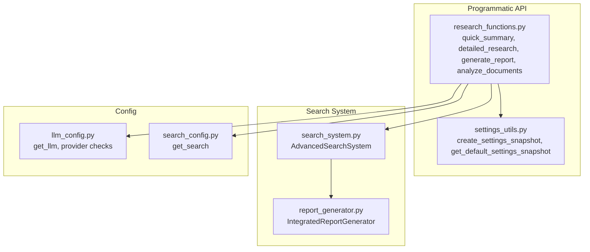
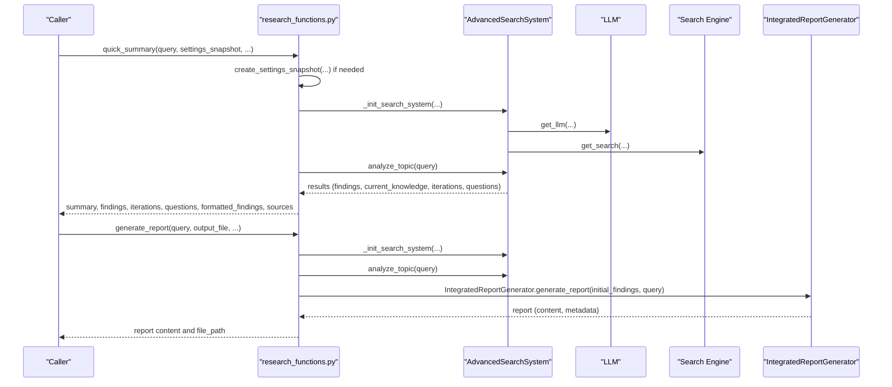
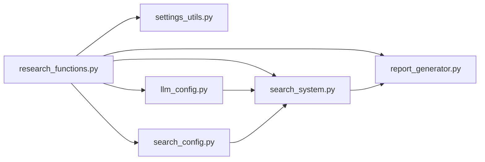

# Research Functions

<cite>
**Referenced Files in This Document**
- [research_functions.py](file://src/local_deep_research/api/research_functions.py)
- [client.py](file://src/local_deep_research/api/client.py)
- [settings_utils.py](file://src/local_deep_research/api/settings_utils.py)
- [search_system.py](file://src/local_deep_research/search_system.py)
- [report_generator.py](file://src/local_deep_research/report_generator.py)
- [llm_config.py](file://src/local_deep_research/config/llm_config.py)
- [search_config.py](file://src/local_deep_research/config/search_config.py)
- [simple_programmatic_example.py](file://examples/api_usage/programmatic/simple_programmatic_example.py)
- [advanced_features_example.py](file://examples/api_usage/programmatic/advanced_features_example.py)
- [minimal_working_example.py](file://examples/api_usage/programmatic/minimal_working_example.py)
- [error_reporter.py](file://src/local_deep_research/error_handling/error_reporter.py)
</cite>

## Table of Contents
1. [Introduction](#introduction)
2. [Project Structure](#project-structure)
3. [Core Components](#core-components)
4. [Architecture Overview](#architecture-overview)
5. [Detailed Component Analysis](#detailed-component-analysis)
6. [Dependency Analysis](#dependency-analysis)
7. [Performance Considerations](#performance-considerations)
8. [Troubleshooting Guide](#troubleshooting-guide)
9. [Conclusion](#conclusion)
10. [Appendices](#appendices)

## Introduction
This document explains the programmatic research API exposed by the project. It focuses on the functions that initiate research queries, configure LLMs and search strategies, and return structured results. It covers:
- Available research modes: Quick Summary, Detailed Research, Report Generation
- Parameters for research mode, LLM configuration, search strategies, and timeouts
- Return structures for results, citations, and metadata
- Usage examples across different modes
- Streaming and progress monitoring
- Result parsing and error handling

## Project Structure
The programmatic API resides under the API module and integrates with the search system, LLM configuration, and settings utilities. The examples demonstrate practical usage patterns.

**Diagram sources**
- [research_functions.py](file://src/local_deep_research/api/research_functions.py#L1-L658)
- [settings_utils.py](file://src/local_deep_research/api/settings_utils.py#L1-L333)
- [search_system.py](file://src/local_deep_research/search_system.py#L1-L200)
- [report_generator.py](file://src/local_deep_research/report_generator.py#L1-L200)
- [llm_config.py](file://src/local_deep_research/config/llm_config.py#L1-L200)
- [search_config.py](file://src/local_deep_research/config/search_config.py#L1-L153)

**Section sources**
- [research_functions.py](file://src/local_deep_research/api/research_functions.py#L1-L658)
- [settings_utils.py](file://src/local_deep_research/api/settings_utils.py#L1-L333)
- [search_system.py](file://src/local_deep_research/search_system.py#L1-L200)
- [report_generator.py](file://src/local_deep_research/report_generator.py#L1-L200)
- [llm_config.py](file://src/local_deep_research/config/llm_config.py#L1-L200)
- [search_config.py](file://src/local_deep_research/config/search_config.py#L1-L153)

## Core Components
- quick_summary(query, ...): Returns a concise summary plus findings, iterations, questions, formatted findings, and sources.
- detailed_research(query, ...): Returns a comprehensive research result with metadata including timestamp, search tool, iterations requested, and strategy.
- generate_report(query, output_file, ...): Generates a structured markdown report and optionally saves it to a file.
- analyze_documents(collection_name, query, ...): Searches and analyzes documents in a local collection and returns a summary and matched documents.
- create_settings_snapshot(...): Builds a settings snapshot for programmatic use without database access.
- AdvancedSearchSystem(...): Orchestrates research strategies, questions, citations, and progress callbacks.
- IntegratedReportGenerator(...): Produces structured reports from initial findings.

**Section sources**
- [research_functions.py](file://src/local_deep_research/api/research_functions.py#L149-L658)
- [settings_utils.py](file://src/local_deep_research/api/settings_utils.py#L192-L333)
- [search_system.py](file://src/local_deep_research/search_system.py#L1-L200)
- [report_generator.py](file://src/local_deep_research/report_generator.py#L1-L200)

## Architecture Overview
The programmatic API initializes an AdvancedSearchSystem with LLM and search engine instances, then executes research according to the chosen mode. Report generation uses IntegratedReportGenerator to produce structured markdown content.

**Diagram sources**
- [research_functions.py](file://src/local_deep_research/api/research_functions.py#L149-L442)
- [search_system.py](file://src/local_deep_research/search_system.py#L1-L200)
- [report_generator.py](file://src/local_deep_research/report_generator.py#L1-L200)
- [llm_config.py](file://src/local_deep_research/config/llm_config.py#L1-L200)
- [search_config.py](file://src/local_deep_research/config/search_config.py#L1-L153)

## Detailed Component Analysis

### Research Modes and Parameters

- Quick Summary
  - Purpose: Fast, concise research summary with findings and sources.
  - Key parameters:
    - query: Research question
    - provider, api_key, temperature: LLM configuration
    - max_search_results: Limits search results
    - settings, settings_override: Base settings and overrides
    - search_original_query: Include original query in first iteration
    - retrievers, llms: Optional custom search engines and LLMs
    - settings_snapshot: Prebuilt settings snapshot
    - Additional kwargs passed to internal system
  - Returns:
    - summary: Generated summary text
    - findings: List of detailed findings
    - iterations: Number of iterations performed
    - questions: Questions generated during research
    - formatted_findings: Formatted findings string
    - sources: All links discovered by the system

- Detailed Research
  - Purpose: Comprehensive research result with metadata.
  - Key parameters:
    - query: Research question
    - research_id: Optional identifier for tracking
    - retrievers, llms: Optional custom components
    - Additional kwargs passed to internal system
  - Returns:
    - query, research_id
    - summary: Current knowledge
    - findings: List of findings
    - iterations: Number of iterations
    - questions: Questions by iteration
    - formatted_findings: Formatted findings string
    - sources: Discovered links
    - metadata: Timestamp, search_tool, iterations_requested, strategy

- Report Generation
  - Purpose: Structured markdown report with sections and citations.
  - Key parameters:
    - query: Research question
    - output_file: Optional path to save report
    - progress_callback: Optional callback for progress updates
    - searches_per_section: Number of searches per report section
    - retrievers, llms: Optional custom components
    - provider, api_key, temperature, max_search_results: LLM configuration
    - settings, settings_override: Base settings and overrides
    - Additional kwargs passed to internal system
  - Returns:
    - content: Full markdown report
    - metadata: Report metadata (including timestamp and query)
    - file_path: Path to saved file (if output_file provided)

- Analyze Documents
  - Purpose: Search and analyze documents in a local collection.
  - Key parameters:
    - query: Search query
    - collection_name: Name of the local collection
    - max_results: Maximum number of results
    - temperature: LLM temperature for summary generation
    - force_reindex: Force reindexing the collection
    - output_file: Optional path to save analysis
  - Returns:
    - summary: Summary of findings
    - documents: Matching documents with content and metadata
    - collection, document_count: Contextual metadata

**Section sources**
- [research_functions.py](file://src/local_deep_research/api/research_functions.py#L149-L658)

### LLM and Search Configuration
- LLM configuration:
  - get_llm(...) resolves provider, model, and endpoint from settings snapshot or explicit parameters.
  - Supported providers include openai, anthropic, google, openrouter, vllm, openai_endpoint, lmstudio, llamacpp, ollama, and none.
  - Temperature controls randomness in generation.
- Search configuration:
  - get_search(...) selects the search engine (e.g., searxng, wikipedia, arxiv) and applies settings like max results, region, time period, safe search, snippets only, language, and filtered results.
  - Programmatic mode disables database operations and metrics tracking.

**Section sources**
- [llm_config.py](file://src/local_deep_research/config/llm_config.py#L1-L200)
- [search_config.py](file://src/local_deep_research/config/search_config.py#L1-L153)

### Search Strategies and Iterations
- AdvancedSearchSystem supports multiple strategies (e.g., standard, iterative, source-based, parallel, rapid, recursive, adaptive, smart, browsecomp, evidence, constrained families, modular, browsecomp-entity, iterative-refinement).
- Parameters:
  - strategy_name: Strategy selection
  - max_iterations: Maximum number of research cycles
  - questions_per_iteration: Number of questions per cycle
  - include_text_content: Whether to include full text in results
  - use_cross_engine_filter: Cross-engine filtering
  - use_atomic_facts: Atomic fact decomposition for source-based strategy
  - programmatic_mode: Disable database and metrics
  - search_original_query: Include original query in first iteration

**Section sources**
- [search_system.py](file://src/local_deep_research/search_system.py#L1-L200)

### Report Generation Workflow
- IntegratedReportGenerator determines a report structure from initial findings, performs targeted research per section, and formats a markdown report.
- Searches per section can be controlled to balance depth and performance.

**Section sources**
- [report_generator.py](file://src/local_deep_research/report_generator.py#L1-L200)

### Settings Snapshot Management
- create_settings_snapshot(...) builds a settings snapshot from defaults and overrides, with common shortcuts for provider, api_key, temperature, and max_search_results.
- get_default_settings_snapshot() loads defaults and environment overrides without database access.

**Section sources**
- [settings_utils.py](file://src/local_deep_research/api/settings_utils.py#L192-L333)

### Usage Examples

- Quick Summary
  - Demonstrates provider selection, temperature tuning, and custom search tool.
  - See [simple_programmatic_example.py](file://examples/api_usage/programmatic/simple_programmatic_example.py#L1-L87).

- Detailed Research
  - Shows research_id usage, iterations, and strategy selection.
  - See [simple_programmatic_example.py](file://examples/api_usage/programmatic/simple_programmatic_example.py#L1-L87).

- Report Generation
  - Demonstrates saving reports to file and controlling searches per section.
  - See [simple_programmatic_example.py](file://examples/api_usage/programmatic/simple_programmatic_example.py#L1-L87) and [advanced_features_example.py](file://examples/api_usage/programmatic/advanced_features_example.py#L1-L613).

- Minimal Working Example
  - Demonstrates programmatic access without database dependencies by passing programmatic_mode=True.
  - See [minimal_working_example.py](file://examples/api_usage/programmatic/minimal_working_example.py#L1-L89).

**Section sources**
- [simple_programmatic_example.py](file://examples/api_usage/programmatic/simple_programmatic_example.py#L1-L87)
- [advanced_features_example.py](file://examples/api_usage/programmatic/advanced_features_example.py#L1-L613)
- [minimal_working_example.py](file://examples/api_usage/programmatic/minimal_working_example.py#L1-L89)

### Streaming Responses, Progress Monitoring, and Result Parsing
- Progress monitoring:
  - The programmatic API exposes a progress callback hook via AdvancedSearchSystem.set_progress_callback(...).
  - The HTTP client provides polling for research status and completion, including wait_for_research(...) with timeout.
- Result parsing:
  - Quick Summary returns summary, findings, iterations, questions, formatted_findings, and sources.
  - Detailed Research adds metadata with timestamp, search tool, iterations requested, and strategy.
  - Report Generation returns content and metadata; optionally saves to file and returns file_path.
  - Analyze Documents returns summary, documents, collection, and document_count.

**Section sources**
- [research_functions.py](file://src/local_deep_research/api/research_functions.py#L149-L658)
- [client.py](file://src/local_deep_research/api/client.py#L170-L301)
- [search_system.py](file://src/local_deep_research/search_system.py#L1-L200)

### Error Conditions and Exception Handling
Common error categories include connection errors, model errors, search errors, synthesis errors, file errors, and rate limit errors. The system attempts to categorize errors and provide user-friendly titles and suggested actions.

- Typical scenarios:
  - Model/service unavailable or misconfigured
  - Network or rate limit issues
  - Search engine failures or invalid configuration
  - File write permissions or disk issues
  - Partial results with enhanced error reporting when available

**Section sources**
- [error_reporter.py](file://src/local_deep_research/error_handling/error_reporter.py#L1-L200)

## Dependency Analysis

**Diagram sources**
- [research_functions.py](file://src/local_deep_research/api/research_functions.py#L1-L658)
- [search_system.py](file://src/local_deep_research/search_system.py#L1-L200)
- [report_generator.py](file://src/local_deep_research/report_generator.py#L1-L200)
- [settings_utils.py](file://src/local_deep_research/api/settings_utils.py#L1-L333)
- [llm_config.py](file://src/local_deep_research/config/llm_config.py#L1-L200)
- [search_config.py](file://src/local_deep_research/config/search_config.py#L1-L153)

**Section sources**
- [research_functions.py](file://src/local_deep_research/api/research_functions.py#L1-L658)
- [search_system.py](file://src/local_deep_research/search_system.py#L1-L200)
- [report_generator.py](file://src/local_deep_research/report_generator.py#L1-L200)
- [settings_utils.py](file://src/local_deep_research/api/settings_utils.py#L1-L333)
- [llm_config.py](file://src/local_deep_research/config/llm_config.py#L1-L200)
- [search_config.py](file://src/local_deep_research/config/search_config.py#L1-L153)

## Performance Considerations
- Adjust iterations and questions_per_iteration to balance depth and speed.
- Use smaller max_search_results for quicker summaries.
- Choose efficient strategies (e.g., rapid, source-based) for time-sensitive tasks.
- For report generation, control searches_per_section to manage processing time.
- Consider programmatic_mode to avoid database overhead when running standalone scripts.

## Troubleshooting Guide
- Connection Issues:
  - Verify LLM service availability and endpoint configuration.
  - Check network connectivity and proxy settings.
- Model Errors:
  - Confirm provider and model names are correct.
  - Validate API keys for external providers.
- Search Errors:
  - Ensure search engine configuration is valid.
  - Reduce max results or switch to a different engine.
- Rate Limit Exceeded:
  - Enable LLM rate limiting and adjust usage patterns.
- File Output Failures:
  - Check write permissions and available disk space.
- Partial Results:
  - Use enhanced error reporting to diagnose partial completion.

**Section sources**
- [error_reporter.py](file://src/local_deep_research/error_handling/error_reporter.py#L1-L200)

## Conclusion
The programmatic research API provides flexible, configurable research modes with robust settings management, progress monitoring, and structured result formats. By combining settings snapshots, LLM configuration, and search strategies, developers can tailor research workflows for diverse use cases while handling errors gracefully.

## Appendices

### Return Structures Reference
- Quick Summary:
  - Keys: summary, findings, iterations, questions, formatted_findings, sources
- Detailed Research:
  - Keys: query, research_id, summary, findings, iterations, questions, formatted_findings, sources, metadata
  - metadata: timestamp, search_tool, iterations_requested, strategy
- Report Generation:
  - Keys: content, metadata, file_path (optional)
- Analyze Documents:
  - Keys: summary, documents, collection, document_count

**Section sources**
- [research_functions.py](file://src/local_deep_research/api/research_functions.py#L149-L658)