# Settings Utilities

<cite>
**Referenced Files in This Document**   
- [settings_utils.py](file://src/local_deep_research/api/settings_utils.py)
- [manager.py](file://src/local_deep_research/settings/manager.py)
- [base.py](file://src/local_deep_research/settings/base.py)
- [env_settings.py](file://src/local_deep_research/settings/env_settings.py)
- [env_registry.py](file://src/local_deep_research/settings/env_registry.py)
- [default_settings.json](file://src/local_deep_research/defaults/default_settings.json)
- [settings.py](file://src/local_deep_research/web/models/settings.py)
</cite>

## Table of Contents
1. [Introduction](#introduction)
2. [Settings Schema Structure](#settings-schema-structure)
3. [Programmatic API Functions](#programmatic-api-functions)
4. [LLM Configuration Management](#llm-configuration-management)
5. [Search Engine Settings](#search-engine-settings)
6. [Global Application Parameters](#global-application-parameters)
7. [Environment-Specific Settings](#environment-specific-settings)
8. [Security Considerations](#security-considerations)
9. [Validation and Error Handling](#validation-and-error-handling)
10. [Synchronization Between Clients](#synchronization-between-clients)
11. [Examples and Usage Patterns](#examples-and-usage-patterns)

## Introduction

The settings utilities in the programmatic API provide a comprehensive system for managing application configuration programmatically. This documentation covers the functions for retrieving, updating, and validating system settings, with a focus on LLM configurations, search engine settings, and global application parameters.

The settings system is designed to be flexible and accessible both through the web interface and programmatically, with consistent behavior across both interfaces. The API provides functions to create settings snapshots, apply batch updates, and handle validation errors, making it suitable for integration into automated workflows and external applications.

**Section sources**
- [settings_utils.py](file://src/local_deep_research/api/settings_utils.py#L1-L333)
- [manager.py](file://src/local_deep_research/settings/manager.py#L1-L969)

## Settings Schema Structure

The settings system uses a hierarchical schema structure with key-value pairs organized by functional domains. Each setting has a well-defined structure with metadata that describes its purpose, type, and constraints.

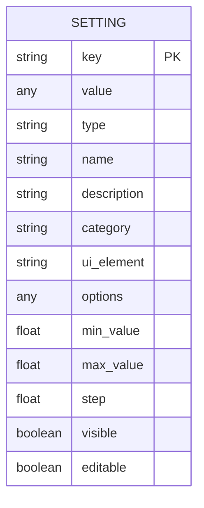

**Diagram sources**
- [settings.py](file://src/local_deep_research/web/models/settings.py#L7-L96)
- [default_settings.json](file://src/local_deep_research/defaults/default_settings.json#L1-L5819)

The schema includes the following key components:

- **Key**: The unique identifier for the setting, using dot notation for hierarchical organization (e.g., "llm.provider", "search.max_results")
- **Value**: The current value of the setting, with type determined by the ui_element
- **Type**: The functional category of the setting (APP, LLM, SEARCH, REPORT, DATABASE)
- **Category**: A sub-category for UI organization and logical grouping
- **UI Element**: The type of user interface element used to display/edit the setting (text, select, checkbox, number, range, password, json)
- **Options**: For select elements, a list of valid values and their display labels
- **Constraints**: Minimum and maximum values for numeric inputs, step size for sliders
- **Visibility and Editability**: Flags controlling whether the setting is visible in the UI and can be modified

The system supports various data types through the ui_element field:
- **text**: String values
- **number**: Numeric values (integers or floats)
- **range**: Slider inputs with min/max constraints
- **checkbox**: Boolean values
- **select**: Single selection from predefined options
- **multiselect**: Multiple selections from predefined options
- **password**: Sensitive string values (masked in UI)
- **json**: Complex structured data in JSON format

**Section sources**
- [settings.py](file://src/local_deep_research/web/models/settings.py#L7-L96)
- [default_settings.json](file://src/local_deep_research/defaults/default_settings.json#L1-L5819)

## Programmatic API Functions

The programmatic API provides several functions for working with settings programmatically, with a focus on creating settings snapshots for use in research operations.

```mermaid
classDiagram
class ISettingsManager {
<<interface>>
+get_setting(key, default, check_env) Any
+set_setting(key, value, commit) bool
+get_all_settings() Dict[str, Any]
+create_or_update_setting(setting, commit) Optional[Any]
+delete_setting(key, commit) bool
+load_from_defaults_file(commit, **kwargs) None
+import_settings(settings_data, commit, overwrite, delete_extra) None
}
class SettingsManager {
+db_session Session
+get_setting(key, default, check_env) Any
+set_setting(key, value, commit) bool
+get_all_settings(bypass_cache) Dict[str, Any]
+get_settings_snapshot() Dict[str, Any]
+create_or_update_setting(setting, commit) Optional[Setting]
+delete_setting(key, commit) bool
+load_from_defaults_file(commit, **kwargs) None
+import_settings(settings_data, commit, overwrite, delete_extra) None
+db_version_matches_package() bool
+update_db_version() None
}
class InMemorySettingsManager {
+_settings Dict[str, Any]
+get_setting(key, default, check_env) Any
+set_setting(key, value, commit) bool
+get_all_settings() Dict[str, Any]
+load_from_defaults_file(commit, **kwargs) None
+create_or_update_setting(setting, commit) Optional[Any]
+delete_setting(key, commit) bool
+import_settings(settings_data, commit, overwrite, delete_extra) None
}
class SettingsManager <|-- InMemorySettingsManager
class ISettingsManager <|-- SettingsManager
```

**Diagram sources**
- [base.py](file://src/local_deep_research/settings/base.py#L12-L118)
- [manager.py](file://src/local_deep_research/settings/manager.py#L197-L800)
- [settings_utils.py](file://src/local_deep_research/api/settings_utils.py#L18-L169)

The core functions available in the programmatic API are:

### get_default_settings_snapshot()
Retrieves a complete settings snapshot with default values. This function uses the same mechanism as the web interface but without requiring database access. Environment variables are checked for overrides.

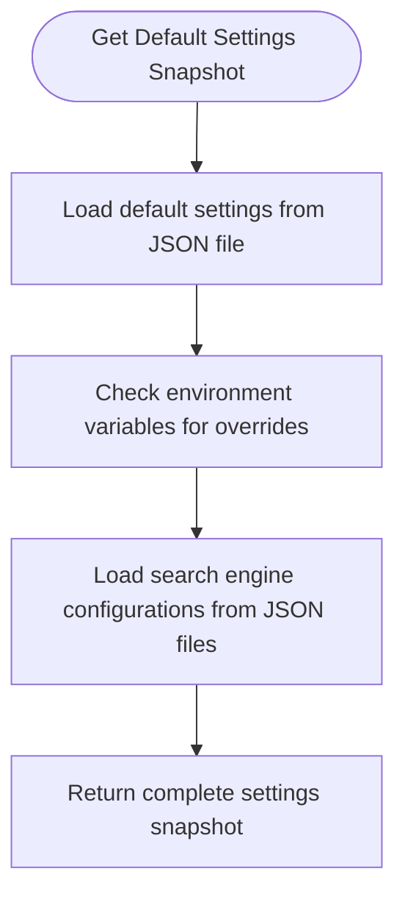

**Diagram sources**
- [settings_utils.py](file://src/local_deep_research/api/settings_utils.py#L192-L204)

### create_settings_snapshot()
Creates a customized settings snapshot for the programmatic API by applying overrides to the default settings.

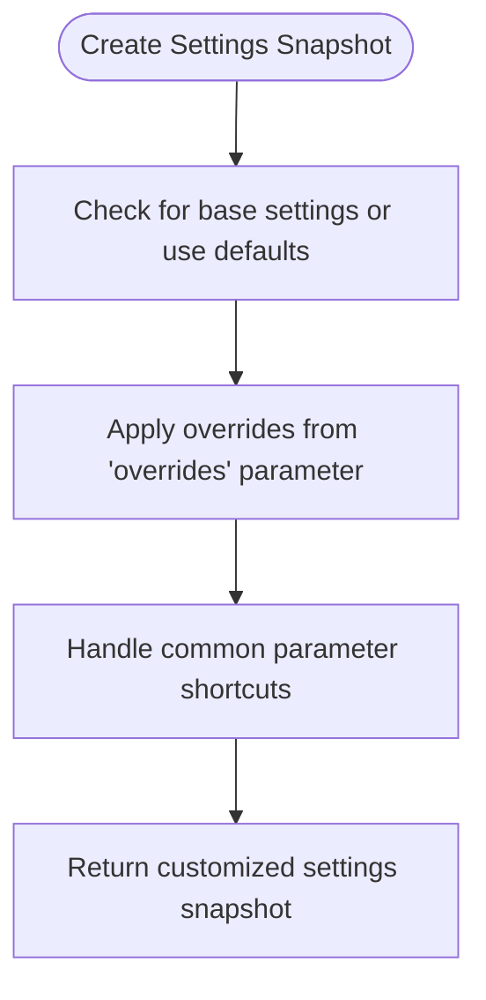

**Diagram sources**
- [settings_utils.py](file://src/local_deep_research/api/settings_utils.py#L207-L308)

### extract_setting_value()
Extracts a specific setting value from a settings snapshot.

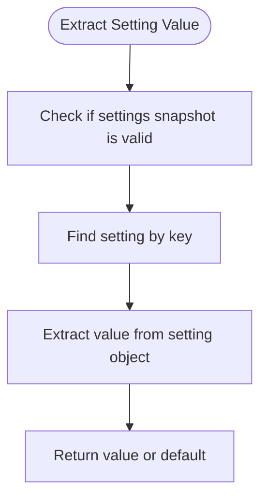

**Diagram sources**
- [settings_utils.py](file://src/local_deep_research/api/settings_utils.py#L311-L333)

**Section sources**
- [settings_utils.py](file://src/local_deep_research/api/settings_utils.py#L192-L333)

## LLM Configuration Management

The settings system provides comprehensive management for LLM (Large Language Model) configurations, allowing programmatic access to model parameters, provider settings, and API credentials.

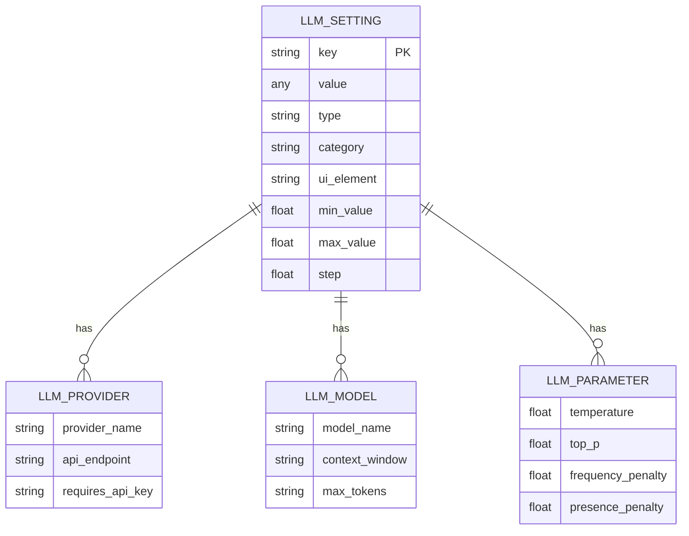

**Diagram sources**
- [default_settings.json](file://src/local_deep_research/defaults/default_settings.json#L254-L581)
- [settings.py](file://src/local_deep_research/web/models/settings.py#L38-L49)

Key LLM configuration settings include:

- **llm.provider**: The service provider for the language model (OpenAI, Anthropic, Ollama, etc.)
- **llm.model**: The specific language model to use for research and analysis
- **llm.temperature**: Controls randomness in model outputs (0.0 - 1.0)
- **llm.max_tokens**: Maximum number of tokens in model responses
- **llm.context_window_size**: Maximum context window size in tokens for cloud LLMs
- **llm.local_context_window_size**: Context window size in tokens for local LLMs
- **llm.[provider].api_key**: API key for the specified provider

The system supports multiple LLM providers with provider-specific configuration:
- **OpenAI**: API key and endpoint configuration
- **Anthropic**: API key and endpoint configuration
- **Ollama**: Local endpoint URL and model configuration
- **LM Studio**: Local endpoint URL
- **Google Gemini**: API key and endpoint configuration
- **Custom OpenAI-compatible**: Custom endpoint and API key

**Section sources**
- [default_settings.json](file://src/local_deep_research/defaults/default_settings.json#L254-L581)
- [settings.py](file://src/local_deep_research/web/models/settings.py#L38-L49)

## Search Engine Settings

The settings system provides extensive configuration options for search engines, allowing programmatic control over search behavior, parameters, and engine-specific settings.

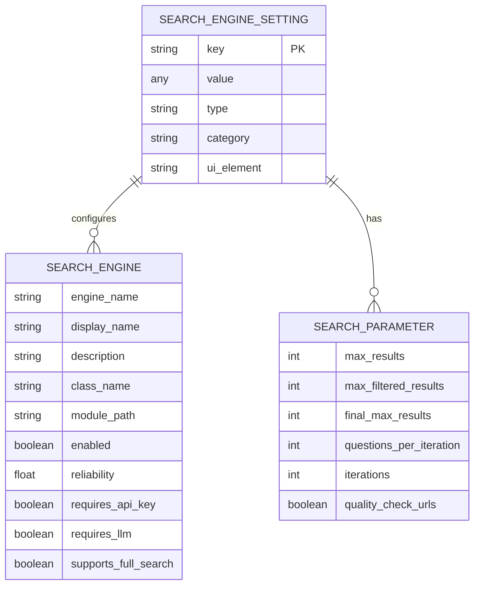

**Diagram sources**
- [default_settings.json](file://src/local_deep_research/defaults/default_settings.json#L705-L788)
- [elasticsearch.json](file://src/local_deep_research/defaults/settings/search_engines/elasticsearch.json#L1-L283)
- [paperless.json](file://src/local_deep_research/defaults/settings/search_engines/paperless.json#L1-L253)

Key search engine settings include:

- **search.max_results**: Maximum number of search results to retrieve
- **search.max_filtered_results**: Maximum number of search results to display after relevance filtering
- **search.final_max_results**: Maximum number of search results to include in the final report
- **search.questions_per_iteration**: Number of questions to generate per research cycle
- **search.iterations**: Number of research cycles to execute

Each search engine has its own configuration namespace (e.g., "search.engine.web.elasticsearch.*", "search.engine.web.paperless.*") with engine-specific parameters:

For Elasticsearch:
- **hosts**: Elasticsearch server URLs
- **index_name**: Name of the Elasticsearch index to search
- **username/password/api_key**: Authentication credentials
- **cloud_id**: Elastic Cloud ID for cloud-hosted instances
- **search_fields**: Fields to search in the index
- **highlight_fields**: Fields to highlight in search results

For Paperless:
- **api_url**: URL of the Paperless-ngx instance
- **api_key**: API key for authentication
- **max_results**: Maximum number of documents to return
- **timeout**: Request timeout in seconds
- **verify_ssl**: Whether to verify SSL certificates
- **include_content**: Whether to include full document content

**Section sources**
- [default_settings.json](file://src/local_deep_research/defaults/default_settings.json#L705-L788)
- [elasticsearch.json](file://src/local_deep_research/defaults/settings/search_engines/elasticsearch.json#L1-L283)
- [paperless.json](file://src/local_deep_research/defaults/settings/search_engines/paperless.json#L1-L253)

## Global Application Parameters

The settings system includes a comprehensive set of global application parameters that control the overall behavior of the system.

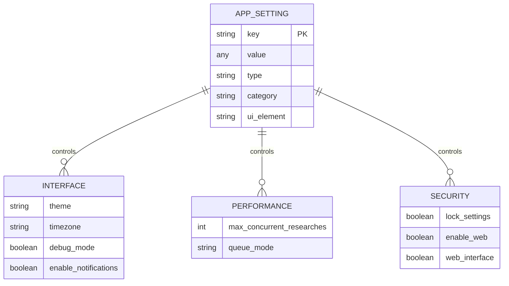

**Diagram sources**
- [default_settings.json](file://src/local_deep_research/defaults/default_settings.json#L2-L239)

Key application parameters include:

### Interface Settings
- **app.theme**: User interface theme (dark, light, system)
- **app.timezone**: Timezone for date calculations
- **app.debug**: Debug mode for more informative errors
- **app.enable_notifications**: Enable browser notifications for research events
- **app.external_url**: Public URL where the application is accessible

### Performance Settings
- **app.max_concurrent_researches**: Maximum number of concurrent research processes allowed per user
- **app.queue_mode**: Queue processing mode (direct for immediate execution, queue for background processing)

### Security and Access Settings
- **app.lock_settings**: If true, disables editing for all settings
- **app.enable_web**: Enable the web server
- **app.web_interface**: Enable the web interface
- **app.allow_registrations**: Allow new user registrations through the web interface

### Server Configuration
- **app.host**: Host address to bind the web server
- **app.port**: Port for the web server

These global parameters provide control over the fundamental behavior of the application, allowing administrators to configure the system for different deployment scenarios and user requirements.

**Section sources**
- [default_settings.json](file://src/local_deep_research/defaults/default_settings.json#L2-L239)

## Environment-Specific Settings

The settings system distinguishes between environment-only settings and database-stored settings, providing a robust mechanism for environment-specific configuration.

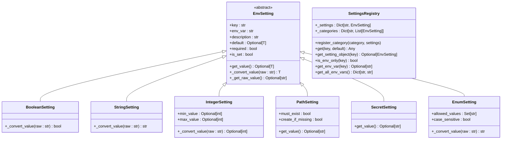

**Diagram sources**
- [env_settings.py](file://src/local_deep_research/settings/env_settings.py#L33-L257)
- [env_registry.py](file://src/local_deep_research/settings/env_registry.py#L14-L26)

Environment-only settings are required before database initialization and include:

- **Bootstrap settings**: Paths, encryption keys needed to initialize the database
- **Database configuration**: Settings required before connecting to the database
- **Testing flags**: Configuration needed before any database operations occur
- **CI/CD variables**: Build-time behavior controls

These settings are accessed through environment variables with the prefix "LDR_" followed by the setting key in uppercase with dots replaced by underscores (e.g., "LDR_APP_PORT" for "app.port").

The system uses a registry pattern with different setting types:
- **BooleanSetting**: For true/false values
- **StringSetting**: For text values
- **IntegerSetting**: For numeric values with optional min/max constraints
- **PathSetting**: For file system paths with validation options
- **SecretSetting**: For sensitive values that should be masked in logs
- **EnumSetting**: For values restricted to a predefined set of options

The SettingsRegistry manages all environment-only settings and provides convenience functions for accessing them programmatically.

**Section sources**
- [env_settings.py](file://src/local_deep_research/settings/env_settings.py#L1-L348)
- [env_registry.py](file://src/local_deep_research/settings/env_registry.py#L1-L112)

## Security Considerations

The settings system incorporates several security measures to protect sensitive configuration data when accessed through the API.

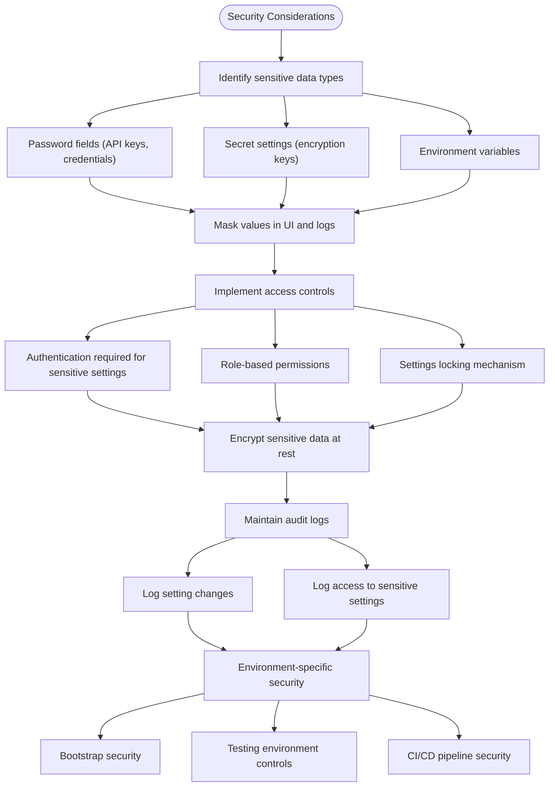

**Diagram sources**
- [manager.py](file://src/local_deep_research/settings/manager.py#L406-L408)
- [env_settings.py](file://src/local_deep_research/settings/env_settings.py#L195-L215)
- [base.py](file://src/local_deep_research/settings/base.py#L33-L45)

Key security considerations include:

### Sensitive Data Protection
- **Password fields**: API keys and credentials are stored with ui_element "password" and masked in the UI
- **Secret settings**: Sensitive values like encryption keys are implemented as SecretSetting objects that hide their values in string representation
- **Environment variables**: Sensitive configuration is often stored in environment variables rather than the database

### Access Controls
- **Authentication**: Access to settings through the API requires authentication
- **Permissions**: Role-based access controls limit who can modify settings
- **Settings locking**: The "app.lock_settings" setting can disable editing for all settings when enabled

### Data Protection
- **Encryption at rest**: Sensitive data is encrypted when stored in the database
- **Secure transmission**: Settings are transmitted over HTTPS
- **Input validation**: All setting values are validated before storage

### Audit and Monitoring
- **Change logging**: Setting modifications are logged with timestamps
- **Access logging**: Access to sensitive settings is recorded
- **Version tracking**: Database version is tracked and updated with package version

### Environment-Specific Security
- **Bootstrap security**: Critical settings needed before database initialization are managed through environment variables
- **Testing controls**: Test mode settings prevent accidental changes to production systems
- **CI/CD security**: Pipeline variables control build-time behavior without exposing secrets

The system follows the principle of least privilege, ensuring that only authorized users can access and modify sensitive configuration data.

**Section sources**
- [manager.py](file://src/local_deep_research/settings/manager.py#L406-L408)
- [env_settings.py](file://src/local_deep_research/settings/env_settings.py#L195-L215)
- [base.py](file://src/local_deep_research/settings/base.py#L33-L45)

## Validation and Error Handling

The settings system includes comprehensive validation and error handling to ensure data integrity and provide meaningful feedback when issues occur.

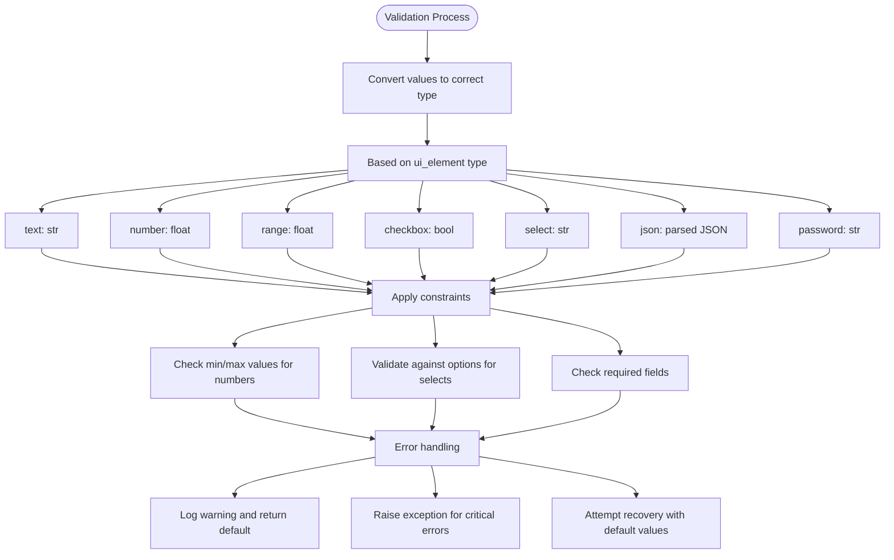

**Diagram sources**
- [settings_utils.py](file://src/local_deep_research/api/settings_utils.py#L45-L75)
- [manager.py](file://src/local_deep_research/settings/manager.py#L112-L176)

The validation process includes:

### Type Conversion
Values are converted to the appropriate type based on the ui_element:
- **text**: Converted to string
- **number/range**: Converted to float (or int if whole number)
- **checkbox**: Converted to boolean using HTML checkbox semantics
- **select**: Converted to string
- **json**: Parsed as JSON
- **password**: Treated as string

### Constraint Validation
- **Numeric constraints**: Values are checked against min_value and max_value
- **Step validation**: Values are validated against step increments for sliders
- **Option validation**: Select values are checked against the allowed options
- **Required fields**: Required settings are validated for presence

### Error Handling Strategies
- **Warning and default**: When type conversion fails, a warning is logged and the default value is returned
- **Exception raising**: Critical errors (e.g., database connection issues) raise exceptions
- **Graceful degradation**: The system attempts to continue with default values when possible
- **Comprehensive logging**: All validation issues are logged with detailed context

The system handles environment variable overrides with special consideration:
- Environment variables are checked before database values
- Values from environment variables are converted to the appropriate type
- If environment variable conversion fails, the database value is used
- If both fail, the default value is returned

Validation errors are handled gracefully to prevent application crashes while still providing meaningful feedback to developers and administrators.

**Section sources**
- [settings_utils.py](file://src/local_deep_research/api/settings_utils.py#L45-L75)
- [manager.py](file://src/local_deep_research/settings/manager.py#L112-L176)

## Synchronization Between Clients

The settings system provides mechanisms for synchronization between multiple clients, ensuring consistency across different instances and users.

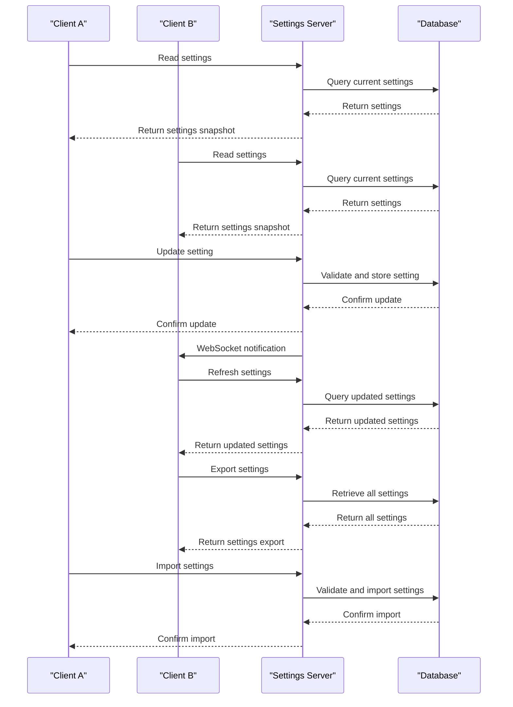

**Diagram sources**
- [manager.py](file://src/local_deep_research/settings/manager.py#L457-L458)
- [manager.py](file://src/local_deep_research/settings/manager.py#L651-L652)
- [manager.py](file://src/local_deep_research/settings/manager.py#L785-L786)

Synchronization mechanisms include:

### Real-time Updates
- **WebSocket notifications**: When settings are changed, WebSocket events are emitted to notify connected clients
- **Automatic refresh**: Clients can listen for these events and automatically refresh their settings
- **Change tracking**: The system tracks which settings were modified to minimize data transfer

### Batch Operations
- **Import/export**: Settings can be exported as JSON and imported into other instances
- **Bulk updates**: Multiple settings can be updated in a single operation
- **Version compatibility**: Exported settings include version information for compatibility checking

### Conflict Resolution
- **Last-write-wins**: By default, the most recent update takes precedence
- **Optimistic locking**: The system could implement version numbers to detect concurrent modifications
- **Merge strategies**: For batch updates, configurable merge strategies (overwrite, merge, skip) are available

### Consistency Guarantees
- **Database transactions**: Setting updates are performed within database transactions
- **Atomic operations**: Individual setting changes are atomic
- **Consistent snapshots**: The get_all_settings() method provides a consistent view of all settings

The system supports both real-time synchronization for connected clients and offline synchronization through import/export functionality, making it suitable for distributed deployments and backup/restore scenarios.

**Section sources**
- [manager.py](file://src/local_deep_research/settings/manager.py#L457-L458)
- [manager.py](file://src/local_deep_research/settings/manager.py#L651-L652)
- [manager.py](file://src/local_deep_research/settings/manager.py#L785-L786)

## Examples and Usage Patterns

This section provides practical examples of using the settings utilities in the programmatic API.

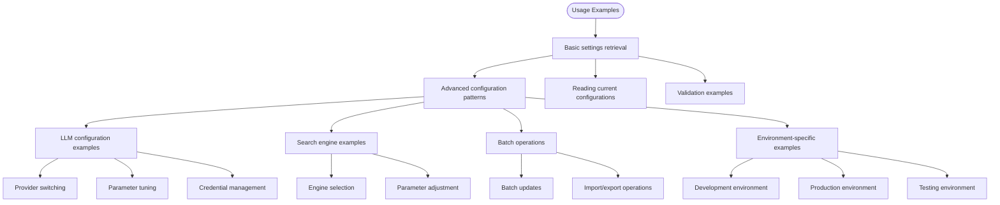

**Diagram sources**
- [settings_utils.py](file://src/local_deep_research/api/settings_utils.py#L230-L245)
- [settings_utils.py](file://src/local_deep_research/api/settings_utils.py#L274-L306)

### Reading Current Configurations

To retrieve the current settings configuration:

```python
from local_deep_research.api.settings_utils import get_default_settings_snapshot

# Get all default settings
settings = get_default_settings_snapshot()

# Extract a specific setting value
llm_provider = settings['llm.provider']['value']
max_results = settings['search.max_results']['value']

# Or use the helper function
from local_deep_research.api.settings_utils import extract_setting_value
llm_provider = extract_setting_value(settings, 'llm.provider')
max_results = extract_setting_value(settings, 'search.max_results')
```

### Applying Batch Updates

To apply multiple setting changes at once:

```python
from local_deep_research.api.settings_utils import create_settings_snapshot

# Create a settings snapshot with overrides
custom_settings = create_settings_snapshot({
    'llm.provider': 'openai',
    'llm.model': 'gpt-4o',
    'search.max_results': 30,
    'search.iterations': 3
})

# Or use the kwargs shortcuts
custom_settings = create_settings_snapshot(
    provider='openai',
    temperature=0.5,
    max_search_results=30
)
```

### LLM Configuration Examples

Configuring different LLM providers:

```python
# Configure OpenAI
openai_settings = create_settings_snapshot(
    provider='openai',
    api_key='your-openai-api-key',
    model='gpt-4o',
    temperature=0.7
)

# Configure Ollama
ollama_settings = create_settings_snapshot(
    provider='ollama',
    model='llama3',
    temperature=0.8
)

# Configure Anthropic
anthropic_settings = create_settings_snapshot(
    provider='anthropic',
    api_key='your-anthropic-api-key',
    model='claude-3-5-sonnet-latest',
    temperature=0.5
)
```

### Search Engine Configuration

Configuring search engine parameters:

```python
# Configure search parameters
search_settings = create_settings_snapshot({
    'search.max_results': 50,
    'search.max_filtered_results': 25,
    'search.final_max_results': 100,
    'search.questions_per_iteration': 5,
    'search.iterations': 2
})

# Enable specific search engines
engine_settings = create_settings_snapshot({
    'search.engine.web.elasticsearch.enabled': True,
    'search.engine.web.paperless.enabled': True
})
```

### Environment-Specific Configuration

Handling different environments:

```python
# Development settings
dev_settings = create_settings_snapshot({
    'app.debug': True,
    'app.max_concurrent_researches': 1,
    'llm.temperature': 1.0
})

# Production settings
prod_settings = create_settings_snapshot({
    'app.debug': False,
    'app.max_concurrent_researches': 3,
    'llm.temperature': 0.7
})

# Testing settings (using environment variables)
import os
os.environ['LDR_APP_DEBUG'] = 'true'
os.environ['LDR_LLM_TEMPERATURE'] = '1.0'
test_settings = get_default_settings_snapshot()
```

### Error Handling

Handling validation errors:

```python
from local_deep_research.api.settings_utils import create_settings_snapshot

# This will handle invalid values gracefully
settings = create_settings_snapshot({
    'search.max_results': 'invalid',  # Will use default or be converted
    'llm.temperature': 2.0,  # Will be clamped to max value of 1.0
    'nonexistent.setting': 'value'  # Will be added as a custom setting
})

# Check for unknown ui_element types
# The system will log a warning but continue with the value as-is
```

### Synchronization Between Clients

Sharing settings between clients:

```python
import json
from local_deep_research.api.settings_utils import get_default_settings_snapshot, create_settings_snapshot

# Export settings from one client
settings = get_default_settings_snapshot()
with open('settings_export.json', 'w') as f:
    json.dump(settings, f, indent=2)

# Import settings to another client
with open('settings_export.json', 'r') as f:
    imported_settings = json.load(f)
    
# Create a new snapshot with the imported settings as base
new_settings = create_settings_snapshot(base_settings=imported_settings)
```

These examples demonstrate the flexibility and power of the settings utilities, showing how they can be used in various scenarios from simple configuration to complex multi-client deployments.

**Section sources**
- [settings_utils.py](file://src/local_deep_research/api/settings_utils.py#L230-L245)
- [settings_utils.py](file://src/local_deep_research/api/settings_utils.py#L274-L306)