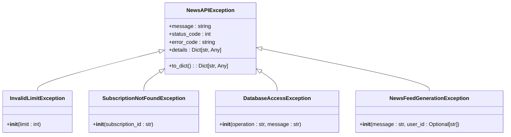
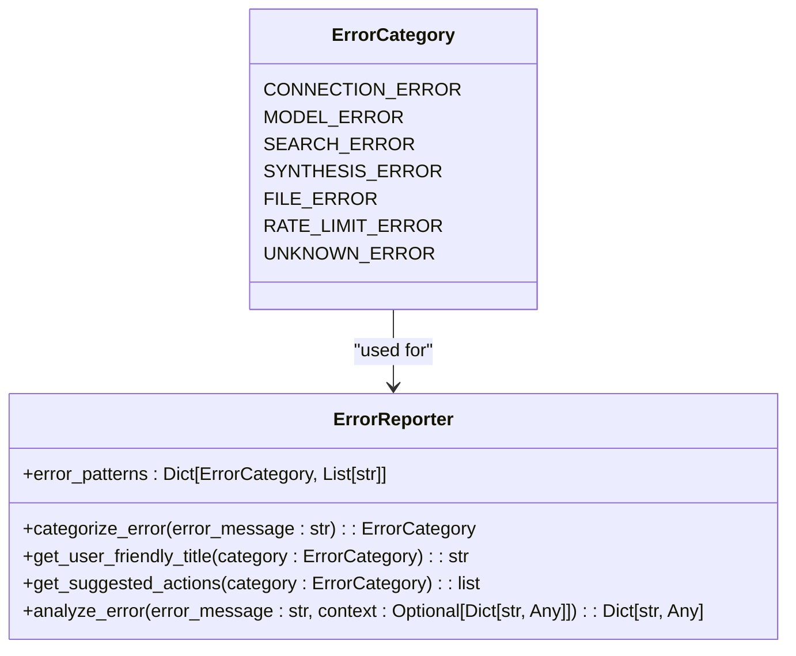
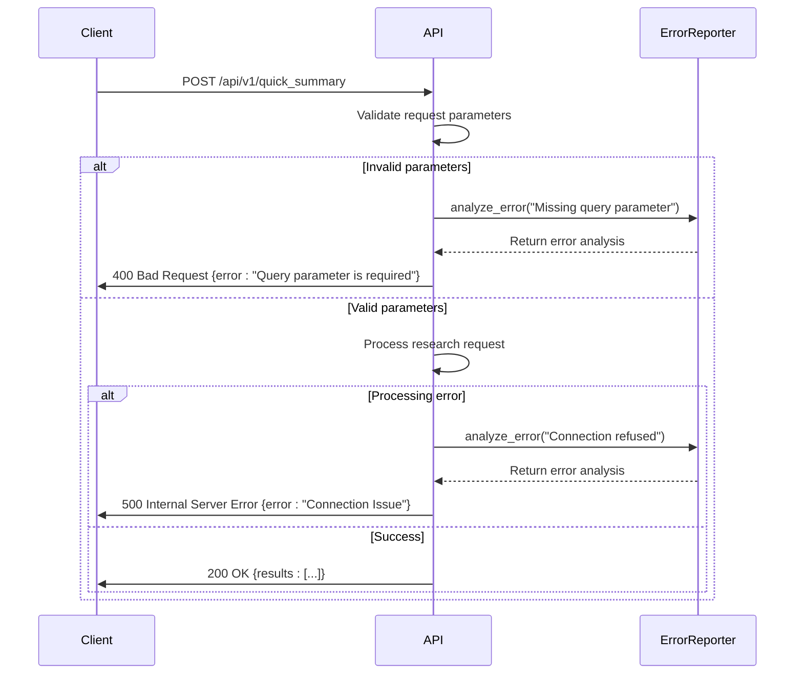
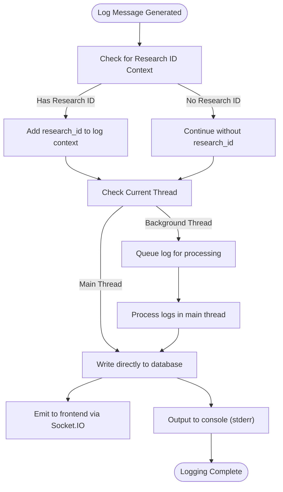
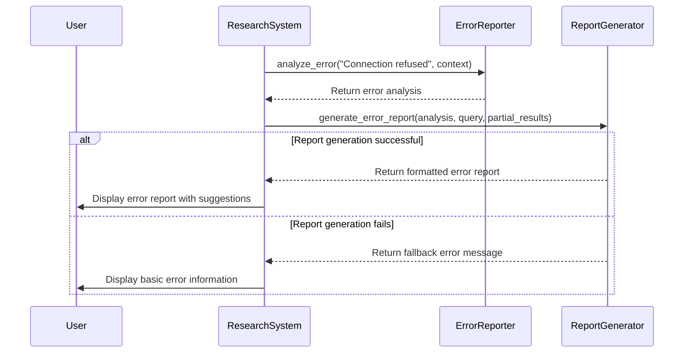

# Error Handling

<cite>
**Referenced Files in This Document**   
- [error_reporter.py](file://src/local_deep_research/error_handling/error_reporter.py)
- [report_generator.py](file://src/local_deep_research/error_handling/report_generator.py)
- [exceptions.py](file://src/local_deep_research/news/exceptions.py)
- [api.py](file://src/local_deep_research/web/api.py)
- [app_factory.py](file://src/local_deep_research/web/app_factory.py)
- [log_utils.py](file://src/local_deep_research/utilities/log_utils.py)
</cite>

## Table of Contents
1. [Introduction](#introduction)
2. [Standard Error Response Structure](#standard-error-response-structure)
3. [Error Types and Categories](#error-types-and-categories)
4. [HTTP Status Codes](#http-status-codes)
5. [Error Logging Mechanism](#error-logging-mechanism)
6. [Error Reporting System](#error-reporting-system)
7. [Client-Side Error Handling](#client-side-error-handling)
8. [Security Considerations](#security-considerations)
9. [Example Error Responses](#example-error-responses)
10. [Conclusion](#conclusion)

## Introduction
This document provides comprehensive documentation for the API error handling patterns and response formats in the Local Deep Research system. The error handling system is designed to provide clear, actionable feedback to users while maintaining security and privacy. The system categorizes errors into meaningful types, provides user-friendly messages, and includes appropriate technical details for debugging without exposing sensitive information.

The error handling framework consists of several components: a standardized error response format, comprehensive error categorization, detailed logging mechanisms, and user-friendly error reporting. This documentation covers all aspects of the error handling system, from the standard response structure to the underlying implementation details.

**Section sources**
- [error_reporter.py](file://src/local_deep_research/error_handling/error_reporter.py#L1-L385)
- [report_generator.py](file://src/local_deep_research/error_handling/report_generator.py#L1-L415)

## Standard Error Response Structure
The API follows a consistent error response structure that provides essential information in a standardized format. All error responses are returned as JSON objects with a predictable schema that includes the error message, error code, HTTP status code, and optional details.

The standard error response structure includes the following fields:
- **error**: A human-readable error message that explains what went wrong in clear, non-technical terms when possible
- **error_code**: A machine-readable error code that uniquely identifies the error type
- **status_code**: The HTTP status code associated with the error
- **details**: An optional object containing additional context-specific information

For custom exceptions derived from `NewsAPIException`, the response structure is automatically generated through the `to_dict()` method, which ensures consistency across all API endpoints. This standardized format allows clients to programmatically handle different error types while providing meaningful feedback to end users.



**Diagram sources **
- [exceptions.py](file://src/local_deep_research/news/exceptions.py#L12-L192)

**Section sources**
- [exceptions.py](file://src/local_deep_research/news/exceptions.py#L12-L192)
- [api.py](file://src/local_deep_research/web/api.py#L1-L457)

## Error Types and Categories
The system categorizes errors into distinct types based on their nature and origin. This categorization helps in providing targeted solutions and understanding the root cause of issues. The error categories are implemented through the `ErrorCategory` enum in the error handling module.

The main error categories include:

- **Connection Error**: Issues related to network connectivity or service availability
- **Model Error**: Problems with the LLM service, model configuration, or authentication
- **Search Error**: Failures in the search process or search engine configuration
- **Synthesis Error**: Issues during report generation or content synthesis
- **File Error**: Problems with file system access, permissions, or storage
- **Rate Limit Error**: API rate limits being exceeded
- **Unknown Error**: Errors that don't fit into other categories

Each error category has associated user-friendly titles, suggested actions, severity levels, and recoverability indicators. This comprehensive categorization enables the system to provide specific guidance for resolving different types of issues.



**Diagram sources **
- [error_reporter.py](file://src/local_deep_research/error_handling/error_reporter.py#L12-L22)

**Section sources**
- [error_reporter.py](file://src/local_deep_research/error_handling/error_reporter.py#L12-L22)
- [report_generator.py](file://src/local_deep_research/error_handling/report_generator.py#L1-L415)

## HTTP Status Codes
The API uses appropriate HTTP status codes to indicate the result of requests. These status codes follow standard conventions and provide immediate information about the nature of the response.

### Standard Status Codes
- **200 OK**: Successful request with results
- **202 Accepted**: Request accepted for processing (asynchronous operations)
- **400 Bad Request**: Client error due to invalid parameters
- **401 Unauthorized**: Authentication required or failed
- **403 Forbidden**: Access denied to the requested resource
- **404 Not Found**: Requested resource not found
- **429 Too Many Requests**: Rate limit exceeded
- **500 Internal Server Error**: Generic server error
- **501 Not Implemented**: Feature not yet implemented
- **503 Service Unavailable**: Service temporarily unavailable
- **504 Gateway Timeout**: Request timed out

The system automatically maps error categories to appropriate HTTP status codes. For example, validation errors return 400, authentication issues return 401, and rate limit errors return 429. This consistent mapping helps clients understand the nature of errors and implement appropriate retry logic or user guidance.



**Diagram sources **
- [api.py](file://src/local_deep_research/web/api.py#L1-L457)
- [error_reporter.py](file://src/local_deep_research/error_handling/error_reporter.py#L1-L385)

**Section sources**
- [api.py](file://src/local_deep_research/web/api.py#L1-L457)
- [app_factory.py](file://src/local_deep_research/web/app_factory.py#L710-L784)

## Error Logging Mechanism
The system implements a comprehensive logging mechanism that captures error details for debugging and monitoring purposes. The logging system is designed to be thread-safe and integrates with both database storage and real-time frontend updates.

### Logging Architecture
The logging system uses Loguru as the primary logging framework with custom sinks for different destinations:
- **Database Sink**: Stores logs in the database for persistent storage and retrieval
- **Frontend Progress Sink**: Sends progress and error messages to the frontend via Socket.IO
- **Console Sink**: Outputs logs to stderr for development and debugging
- **File Sink**: Optional file logging when enabled via environment variable

Logs are processed through a thread-safe queue to handle background operations safely. The system ensures that logs from background threads are properly queued and processed in the main thread context to avoid SQLite thread safety issues.

### Log Context
Each log entry includes contextual information such as:
- Timestamp of the log entry
- Log message content
- Module and function where the log originated
- Line number in the source code
- Log level (DEBUG, INFO, WARNING, ERROR, etc.)
- Research ID (when applicable)
- Username (when available)

This rich context enables effective debugging and correlation of log entries with specific research operations.



**Diagram sources **
- [log_utils.py](file://src/local_deep_research/utilities/log_utils.py#L1-L306)

**Section sources**
- [log_utils.py](file://src/local_deep_research/utilities/log_utils.py#L1-L306)
- [app_factory.py](file://src/local_deep_research/web/app_factory.py#L710-L784)

## Error Reporting System
The error reporting system transforms technical error messages into user-friendly reports that provide actionable guidance. This system consists of two main components: the `ErrorReporter` for error analysis and categorization, and the `ErrorReportGenerator` for creating user-facing error reports.

### Error Analysis Process
The `ErrorReporter` analyzes error messages using pattern matching to categorize them into meaningful types. It examines the error message against predefined patterns for each error category and returns a comprehensive analysis including:
- Error category
- User-friendly title
- Original error message
- Suggested actions for resolution
- Severity level
- Recoverability status
- Context information (when provided)

### User-Friendly Error Reports
The `ErrorReportGenerator` creates comprehensive error reports in Markdown format that are displayed to users. These reports include:
- A clear header indicating the research failed
- The error type and what happened
- Links to documentation, community support, and issue reporting
- Expandable section with partial results (when available)
- Technical error details for debugging

The system also provides a quick error summary for API responses, which includes the title, category, severity, and recoverability status of the error.



**Diagram sources **
- [error_reporter.py](file://src/local_deep_research/error_handling/error_reporter.py#L24-L385)
- [report_generator.py](file://src/local_deep_research/error_handling/report_generator.py#L12-L415)

**Section sources**
- [error_reporter.py](file://src/local_deep_research/error_handling/error_reporter.py#L24-L385)
- [report_generator.py](file://src/local_deep_research/error_handling/report_generator.py#L12-L415)

## Client-Side Error Handling
The client-side error handling recommendations focus on providing a smooth user experience while enabling effective debugging and recovery. The system provides clear guidance for users to resolve common issues.

### Retry Strategies
The system implements intelligent retry strategies based on the error type:
- **Transient errors** (connection issues, timeouts): Automatic retry with exponential backoff
- **Rate limit errors**: Retry after the specified reset time, with rate limiting enabled
- **Authentication errors**: Prompt user to verify credentials before retrying
- **Permanent errors** (invalid parameters, missing resources): No retry, provide user guidance

For API consumers, the recommended retry strategy is to implement exponential backoff with jitter for 5xx errors and respect the Retry-After header for 429 errors. The system provides specific retry suggestions in the error reports to guide users on appropriate actions.

### User Guidance
The error reporting system provides specific, actionable suggestions for resolving different error types:
- Connection issues: Check service availability and network connectivity
- Model errors: Verify model names and API keys
- Search errors: Try different search engines or reduce query complexity
- Rate limit errors: Enable rate limiting or upgrade API plan
- File errors: Check disk space and permissions

These suggestions are tailored to the specific error category and provide step-by-step guidance for resolution.

**Section sources**
- [error_reporter.py](file://src/local_deep_research/error_handling/error_reporter.py#L143-L200)
- [report_generator.py](file://src/local_deep_research/error_handling/report_generator.py#L287-L415)

## Security Considerations
The error handling system incorporates several security measures to prevent information disclosure while providing sufficient detail for debugging.

### Information Disclosure Prevention
The system follows the principle of least disclosure by:
- Avoiding detailed technical error messages in user-facing responses
- Not exposing stack traces or internal system details
- Sanitizing error messages to remove sensitive information
- Using generic error messages for authentication failures (to prevent user enumeration)

Error responses are carefully crafted to provide enough information for users to understand and resolve issues without revealing implementation details that could be exploited.

### Secure Error Handling
The system implements several secure error handling practices:
- Centralized error handling through Flask error handlers
- Consistent error response format across all endpoints
- Input validation and sanitization
- Proper HTTP status code usage
- Rate limiting to prevent abuse
- CSRF protection with helpful error messages

For authentication-related errors, the system provides guidance on configuring API keys without exposing whether specific credentials are valid or invalid, preventing credential enumeration attacks.

**Section sources**
- [app_factory.py](file://src/local_deep_research/web/app_factory.py#L710-L784)
- [security_headers.py](file://src/local_deep_research/security/security_headers.py#L1-L50)
- [api.py](file://src/local_deep_research/web/api.py#L1-L457)

## Example Error Responses
This section provides examples of error responses for common failure scenarios.

### Missing Required Parameters
```json
{
  "error": "Query parameter is required",
  "status_code": 400
}
```

### Authentication Failure
```json
{
  "error": "API key is missing or incorrectly configured",
  "error_code": "MODEL_ERROR",
  "status_code": 401,
  "details": {
    "service": "OpenAI"
  }
}
```

### Server-Side Exception
```json
{
  "error": "Connection Issue",
  "error_code": "CONNECTION_ERROR",
  "status_code": 500,
  "details": {
    "original_error": "Connection refused",
    "suggestions": [
      "Check if the LLM service (Ollama/LM Studio) is running",
      "Verify network connectivity",
      "Try switching to a different model provider"
    ],
    "severity": "high",
    "recoverable": true
  }
}
```

### Rate Limit Exceeded
```json
{
  "error": "API Rate Limit Exceeded",
  "error_code": "RATE_LIMIT_ERROR",
  "status_code": 429,
  "details": {
    "service": "OpenAI",
    "suggestions": [
      "The API has reached its rate limit",
      "Enable LLM Rate Limiting in Settings → Rate Limiting → Enable LLM Rate Limiting",
      "Consider upgrading to a paid API plan for higher limits"
    ]
  }
}
```

**Section sources**
- [api.py](file://src/local_deep_research/web/api.py#L1-L457)
- [exceptions.py](file://src/local_deep_research/news/exceptions.py#L1-L192)
- [error_reporter.py](file://src/local_deep_research/error_handling/error_reporter.py#L1-L385)

## Conclusion
The error handling system in the Local Deep Research application provides a comprehensive framework for managing and communicating errors effectively. By standardizing error responses, categorizing errors meaningfully, and providing user-friendly guidance, the system enhances both user experience and developer productivity.

Key aspects of the error handling system include:
- Consistent error response structure across all API endpoints
- Comprehensive error categorization with targeted solutions
- Appropriate HTTP status code usage
- Detailed logging with rich context for debugging
- User-friendly error reports with actionable suggestions
- Security-conscious error handling that prevents information disclosure

The system balances the need for detailed debugging information with the requirement to protect sensitive data, providing an optimal experience for both end users and developers. By following the patterns and practices documented here, users can effectively diagnose and resolve issues, while developers can maintain and extend the error handling system with confidence.

**Section sources**
- [error_reporter.py](file://src/local_deep_research/error_handling/error_reporter.py#L1-L385)
- [report_generator.py](file://src/local_deep_research/error_handling/report_generator.py#L1-L415)
- [exceptions.py](file://src/local_deep_research/news/exceptions.py#L1-L192)
- [api.py](file://src/local_deep_research/web/api.py#L1-L457)
- [app_factory.py](file://src/local_deep_research/web/app_factory.py#L710-L784)
- [log_utils.py](file://src/local_deep_research/utilities/log_utils.py#L1-L306)