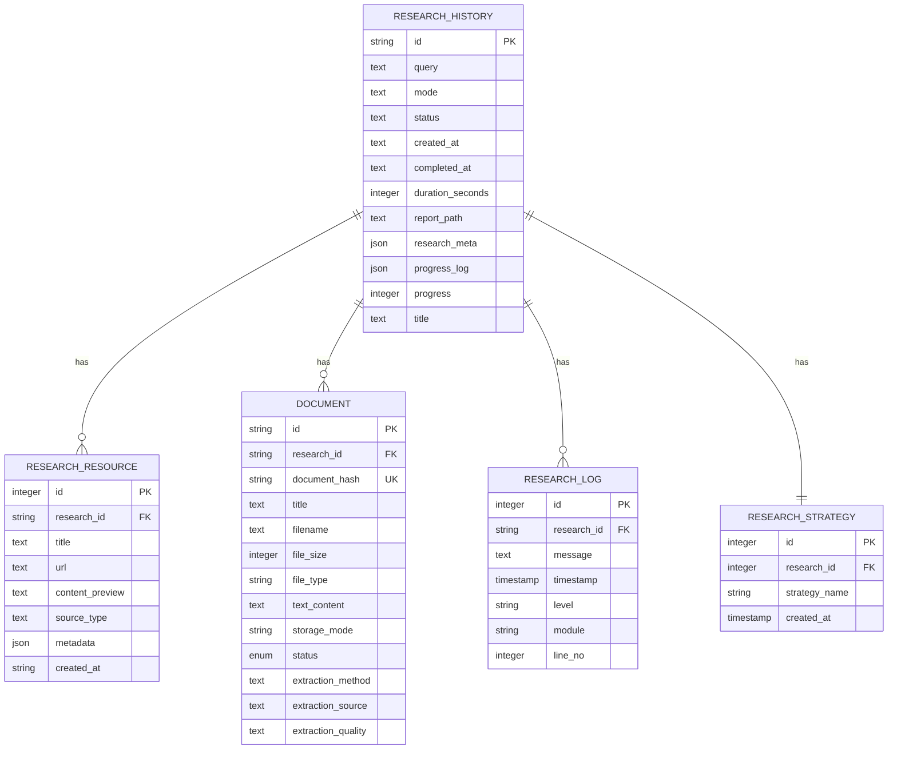

# History Access

<cite>
**Referenced Files in This Document**   
- [history_routes.py](file://src/local_deep_research/web/routes/history_routes.py)
- [research.py](file://src/local_deep_research/database/models/research.py)
- [research_routes.py](file://src/local_deep_research/web/routes/research_routes.py)
- [database.py](file://src/local_deep_research/web/models/database.py)
- [research_service.py](file://src/local_deep_research/web/services/research_service.py)
- [library.py](file://src/local_deep_research/database/models/library.py)
</cite>

## Table of Contents
1. [Introduction](#introduction)
2. [Research History Model](#research-history-model)
3. [History Endpoints](#history-endpoints)
4. [Retrieving Research Details](#retrieving-research-details)
5. [Metadata Structure](#metadata-structure)
6. [Associated Resources and Reports](#associated-resources-and-reports)
7. [Database Relationships](#database-relationships)
8. [Error Handling](#error-handling)
9. [Authentication Requirements](#authentication-requirements)

## Introduction
The History Access API provides comprehensive endpoints for retrieving research history entries, enabling users to access, filter, and analyze their research sessions. This documentation details the available endpoints, the structure of the ResearchHistory model, metadata capturing research settings, and the relationships between various components in the system. The API supports filtering, sorting, and pagination capabilities, allowing for efficient retrieval of research data.

## Research History Model
The ResearchHistory model serves as the central entity for tracking research sessions and their progress. It contains essential properties that capture the state and metadata of each research session.

### Model Properties
The ResearchHistory model includes the following key properties:

- **id**: String(36) - UUID as primary key
- **query**: Text - The search query used for the research
- **mode**: Text - The mode of research (e.g., 'quick_summary', 'detailed_report')
- **status**: Text - Current status of the research (pending, in_progress, completed, failed, cancelled, suspended)
- **created_at**: Text - Timestamp when the research started (ISO format)
- **completed_at**: Text - Timestamp when the research was completed (ISO format)
- **duration_seconds**: Integer - Duration of the research in seconds
- **report_path**: Text - Path to the generated report
- **report_content**: Text - Report content stored in the database
- **research_meta**: JSON - Additional metadata about the research
- **progress_log**: JSON - Latest progress log message
- **progress**: Integer - Current progress of the research as a percentage
- **title**: Text - Title of the research report

The model also includes a relationship with ResearchResource, allowing for the association of resources with research projects.

**Section sources**
- [research.py](file://src/local_deep_research/database/models/research.py#L214-L258)

## History Endpoints
The history API provides several endpoints for retrieving research history entries with various filtering and sorting capabilities.

### Retrieving Research History
The primary endpoint for retrieving research history is:

```
GET /history/api
```

This endpoint returns a list of research history entries ordered by creation date (latest first). The response includes comprehensive information about each research session, including query, mode, status, timestamps, and metadata.

**Response Structure:**
```json
{
  "status": "success",
  "items": [
    {
      "id": "uuid",
      "title": "string",
      "query": "string",
      "mode": "string",
      "status": "string",
      "created_at": "ISO timestamp",
      "completed_at": "ISO timestamp",
      "duration_seconds": integer,
      "report_path": "string",
      "document_count": integer,
      "metadata": { /* research_meta as parsed JSON */ },
      "progress_log": "[{...}]" /* JSON string */
    }
  ]
}
```

### Filtering and Sorting
The API automatically sorts results by creation date in descending order (newest first). While the endpoint doesn't expose explicit query parameters for filtering, the client can filter the returned results based on:

- **Status**: Filter by research status (pending, in_progress, completed, failed, cancelled, suspended)
- **Date Range**: Filter by created_at or completed_at timestamps
- **Mode**: Filter by research mode (quick, detailed)

### Pagination
The current implementation returns all history entries in a single response. For large datasets, clients should implement client-side pagination by limiting the number of displayed items.

**Section sources**
- [history_routes.py](file://src/local_deep_research/web/routes/history_routes.py#L33-L163)

## Retrieving Research Details
In addition to the main history endpoint, several specialized endpoints provide detailed information about specific research sessions.

### Research Status Endpoint
```
GET /history/status/{research_id}
```

This endpoint retrieves the current status of a specific research session, including progress information and logs. It's particularly useful for monitoring active research processes.

**Response includes:**
- Basic research information (id, query, mode, status)
- Timestamps (created_at, completed_at)
- Progress percentage
- Log entries
- Report path

### Research Details Endpoint
```
GET /history/details/{research_id}
```

This endpoint provides comprehensive details about a specific research session, including strategy information and merged logs from both database and memory (for active research).

**Response includes:**
- Research identifiers and parameters
- Status and progress information
- Strategy name used for the research
- Complete log history
- Timestamps

### Log Endpoints
Two endpoints provide access to research logs:

```
GET /history/logs/{research_id}
GET /history/log_count/{research_id}
```

These endpoints allow clients to retrieve detailed log entries for a research session and get the total count of logs, respectively.

**Section sources**
- [history_routes.py](file://src/local_deep_research/web/routes/history_routes.py#L165-L448)

## Metadata Structure
The research_meta field in the ResearchHistory model captures comprehensive metadata about each research session, including configuration snapshots and execution context.

### Metadata Components
The metadata structure includes several key components:

#### Research Settings Snapshot
The settings_snapshot contains a complete snapshot of all research settings at the time of execution, ensuring reproducibility and providing context for the research process.

```json
{
  "settings_snapshot": {
    "llm.provider": "OLLAMA",
    "llm.model": "llama3",
    "search.tool": "searxng",
    "search.iterations": 5,
    "search.questions_per_iteration": 5,
    "search.search_strategy": "source-based",
    // ... other settings
  }
}
```

#### Submission Parameters
Tracks the parameters submitted with the research request:

```json
{
  "submission": {
    "model_provider": "OLLAMA",
    "model": "llama3",
    "search_engine": "searxng",
    "max_results": 10,
    "time_period": null,
    "iterations": 5,
    "questions_per_iteration": 5,
    "strategy": "source-based"
  }
}
```

#### System Information
Includes contextual information about the research execution:

```json
{
  "system": {
    "timestamp": "ISO timestamp",
    "user": "username",
    "version": "1.0",
    "server_url": "http://localhost:8000/"
  }
}
```

#### Additional Metadata
May include other context-specific information such as:
- Original and processed queries (with date placeholders replaced)
- News search indicators
- Follow-up research context
- Error information and solutions

**Section sources**
- [research_routes.py](file://src/local_deep_research/web/routes/research_routes.py#L325-L351)
- [research_service.py](file://src/local_deep_research/web/services/research_service.py#L325-L351)

## Associated Resources and Reports
The system provides endpoints for accessing associated resources and reports for completed research sessions.

### Report Retrieval
```
GET /history/report/{research_id}
```

This endpoint retrieves the complete report for a research session, including content and enhanced metadata that combines database fields with stored metadata.

**Response Structure:**
```json
{
  "status": "success",
  "content": "markdown content",
  "query": "string",
  "mode": "string",
  "created_at": "ISO timestamp",
  "completed_at": "ISO timestamp",
  "duration": integer,
  "metadata": { /* merged metadata */ }
}
```

### Markdown Export
```
GET /history/markdown/{research_id}
```

Provides the report content in markdown format, useful for applications that need to process or display the raw content.

### Resource Association
The ResearchResource model associates external resources with research projects:

```python
class ResearchResource(Base):
    __tablename__ = "research_resources"
    
    id = Column(Integer, primary_key=True, autoincrement=True)
    research_id = Column(String(36), ForeignKey("research_history.id"), nullable=False)
    title = Column(Text)
    url = Column(Text)
    content_preview = Column(Text)
    source_type = Column(Text)
    resource_metadata = Column("metadata", JSON)
    created_at = Column(String, nullable=False)
    
    # Relationship
    research = relationship("ResearchHistory", back_populates="resources")
```

Each resource is linked to a research session and can include metadata about the source.

**Section sources**
- [history_routes.py](file://src/local_deep_research/web/routes/history_routes.py#L306-L403)
- [research.py](file://src/local_deep_research/database/models/research.py#L189-L212)

## Database Relationships
The research history system involves several interconnected database models that work together to store and retrieve research data.

### Entity Relationship Diagram


### Key Relationships
- **ResearchHistory to ResearchResource**: One-to-many relationship, where a research session can have multiple associated resources
- **ResearchHistory to Document**: One-to-many relationship, connecting research sessions to downloaded documents in the library
- **ResearchHistory to ResearchLog**: One-to-many relationship, storing log entries for each research session
- **ResearchHistory to ResearchStrategy**: One-to-one relationship, tracking which search strategy was used for the research

The Document model in the library system is particularly important as it stores both research downloads and user uploads, with the research_id field linking documents back to their originating research session.

**Diagram sources**
- [research.py](file://src/local_deep_research/database/models/research.py)
- [library.py](file://src/local_deep_research/database/models/library.py)

**Section sources**
- [research.py](file://src/local_deep_research/database/models/research.py)
- [library.py](file://src/local_deep_research/database/models/library.py)

## Error Handling
The history API implements comprehensive error handling to ensure robust operation and provide meaningful feedback to clients.

### Error Response Structure
All error responses follow a consistent format:

```json
{
  "status": "error",
  "message": "Descriptive error message",
  "items": [] // Included in history responses
}
```

### Common Error Scenarios
- **Authentication Failure**: Returns 401 status when the user is not authenticated
- **Research Not Found**: Returns 404 status when the specified research_id doesn't exist
- **Database Errors**: Returns 500 status for internal database errors
- **Invalid Requests**: Returns 400 status for malformed requests

### Error Logging
The system logs errors using Python's logging framework, with detailed traceback information for debugging purposes. The history_routes.py file includes comprehensive error handling with try-catch blocks around database operations.

```python
except Exception as e:
    print(f"Error getting history: {e!s}")
    print(traceback.format_exc())
    # Return empty array with CORS headers
    response = make_response(
        jsonify({
            "status": "error",
            "items": [],
            "message": "Failed to retrieve history",
        })
    )
```

The system also captures and stores error information in the research_meta field, including error types and suggested solutions, which can be displayed to users in the frontend.

**Section sources**
- [history_routes.py](file://src/local_deep_research/web/routes/history_routes.py#L142-L162)

## Authentication Requirements
All history API endpoints require authentication to ensure data privacy and security.

### Authentication Mechanism
The system uses session-based authentication with the `@login_required` decorator applied to all history endpoints:

```python
@history_bp.route("/api", methods=["GET"])
@login_required
def get_history():
    # Endpoint implementation
```

### Authentication Flow
1. Users must first authenticate through the system's authentication mechanism
2. Upon successful authentication, a session is created with the username stored in the session
3. Each request to history endpoints is validated by checking for the username in the session
4. If the user is not authenticated, a 401 Unauthorized response is returned

### Session Management
The system uses Flask's session management to maintain user state. The username is retrieved from the session in each endpoint:

```python
username = session.get("username")
if not username:
    return jsonify({"status": "error", "message": "Not authenticated"}), 401
```

This ensures that users can only access their own research history data, maintaining data isolation between users.

**Section sources**
- [history_routes.py](file://src/local_deep_research/web/routes/history_routes.py#L37-L39)
- [history_routes.py](file://src/local_deep_research/web/routes/history_routes.py#L169-L171)