# Metrics Retrieval

<cite>
**Referenced Files in This Document**   
- [token_counter.py](file://src/local_deep_research/metrics/token_counter.py)
- [search_tracker.py](file://src/local_deep_research/metrics/search_tracker.py)
- [database.py](file://src/local_deep_research/metrics/database.py)
- [query_utils.py](file://src/local_deep_research/metrics/query_utils.py)
- [cost_calculator.py](file://src/local_deep_research/metrics/pricing/cost_calculator.py)
- [pricing_fetcher.py](file://src/local_deep_research/metrics/pricing/pricing_fetcher.py)
- [pricing_cache.py](file://src/local_deep_research/metrics/pricing/pricing_cache.py)
- [metrics.py](file://src/local_deep_research/database/models/metrics.py)
- [thread_metrics.py](file://src/local_deep_research/database/thread_metrics.py)
- [metrics_routes.py](file://src/local_deep_research/web/routes/metrics_routes.py)
- [test_metrics_api.py](file://tests/api_tests/test_metrics_api.py)
</cite>

## Table of Contents
1. [Introduction](#introduction)
2. [Metrics Data Model](#metrics-data-model)
3. [API Endpoints](#api-endpoints)
4. [Cost Calculation System](#cost-calculation-system)
5. [Aggregation Methods](#aggregation-methods)
6. [Time-Series Data](#time-series-data)
7. [Error Handling](#error-handling)
8. [Authentication Requirements](#authentication-requirements)
9. [Relationship to Tracking System](#relationship-to-tracking-system)
10. [Examples](#examples)

## Introduction

The metrics and analytics system provides comprehensive tracking and retrieval capabilities for research costs, API usage, performance data, and system analytics. This documentation details the endpoints and data models used to monitor and analyze the system's operations, with a focus on cost analytics, token usage, and performance metrics.

The system collects detailed information during research execution, including token usage across different LLM providers, search engine performance, and cost calculations based on provider pricing. The metrics are stored in encrypted user databases and can be retrieved through various API endpoints for analysis and visualization.

**Section sources**
- [metrics_routes.py](file://src/local_deep_research/web/routes/metrics_routes.py#L1-L50)
- [token_counter.py](file://src/local_deep_research/metrics/token_counter.py#L1-L50)

## Metrics Data Model

The metrics system uses a comprehensive data model to track various aspects of research operations. The primary data structures include token usage, search call tracking, and model usage statistics.

### Token Usage Model

The `TokenUsage` model tracks detailed information about each LLM call, including token counts, costs, and performance metrics:

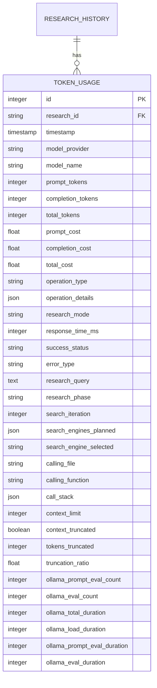

### Search Call Model

The `SearchCall` model tracks individual search engine operations with performance and success metrics:

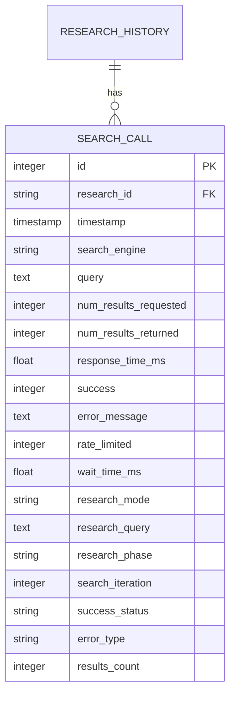

### Model Usage Model

The `ModelUsage` model provides aggregate statistics for each LLM model:

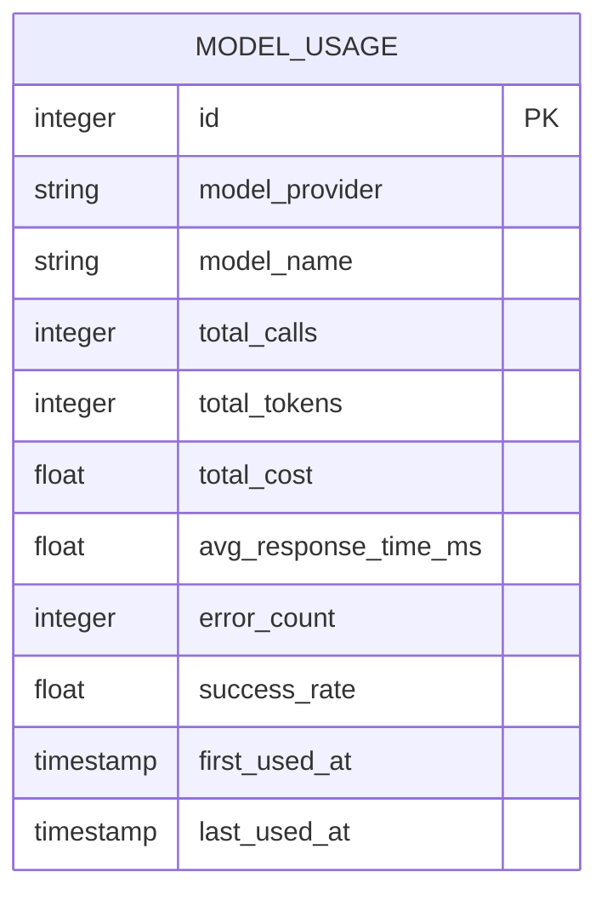

**Diagram sources**
- [metrics.py](file://src/local_deep_research/database/models/metrics.py#L20-L133)

**Section sources**
- [metrics.py](file://src/local_deep_research/database/models/metrics.py#L1-L210)

## API Endpoints

The metrics system provides several REST API endpoints for retrieving different types of analytics data. All endpoints require authentication and return JSON responses.

### Core Metrics Endpoints

```mermaid
graph TD
A[GET /metrics/api/metrics] --> B[Overall metrics summary]
C[GET /metrics/api/metrics/research/{research_id}] --> D[Specific research metrics]
E[GET /metrics/api/metrics/research/{research_id}/timeline] --> F[Timeline metrics]
G[GET /metrics/api/metrics/research/{research_id}/search] --> H[Search metrics]
I[GET /metrics/api/cost-analytics] --> J[Cost analytics]
K[GET /metrics/api/pricing] --> L[Pricing information]
M[GET /metrics/api/rate-limiting] --> N[Rate limiting metrics]
O[GET /metrics/api/rate-limiting/current] --> P[Current rate limits]
```

**Diagram sources**
- [metrics_routes.py](file://src/local_deep_research/web/routes/metrics_routes.py#L860-L1037)
- [route_registry.py](file://src/local_deep_research/web/routes/route_registry.py#L236-L276)

### Endpoint Details

#### Overall Metrics Summary
- **Endpoint**: `GET /metrics/api/metrics`
- **Parameters**: 
  - `period`: Time period filter ('7d', '30d', '3m', '1y', 'all')
  - `mode`: Research mode filter ('quick', 'detailed', 'all')
- **Response**: Comprehensive metrics including token usage, search statistics, strategy analytics, and rate limiting data

#### Research-Specific Metrics
- **Endpoint**: `GET /metrics/api/metrics/research/{research_id}`
- **Parameters**: None
- **Response**: Token usage metrics for a specific research session, including total tokens, calls, and model breakdown

#### Cost Analytics
- **Endpoint**: `GET /metrics/api/cost-analytics`
- **Parameters**: None
- **Response**: Cost breakdown by model, provider, and research session, including total costs and cost per token

#### Pricing Information
- **Endpoint**: `GET /metrics/api/pricing`
- **Parameters**: None
- **Response**: Current pricing data for all supported LLM providers and models

#### Rate Limiting Metrics
- **Endpoint**: `GET /metrics/api/rate-limiting`
- **Parameters**: 
  - `period`: Time period filter ('7d', '30d', '3m', '1y', 'all')
- **Response**: Rate limiting statistics including success rates, wait times, and engine status

**Section sources**
- [metrics_routes.py](file://src/local_deep_research/web/routes/metrics_routes.py#L860-L1037)

## Cost Calculation System

The cost calculation system determines the financial cost of LLM usage based on token counts and provider pricing. The system uses a three-tiered approach: real-time pricing fetchers, in-memory caching, and static fallback pricing.

### Cost Calculator Architecture

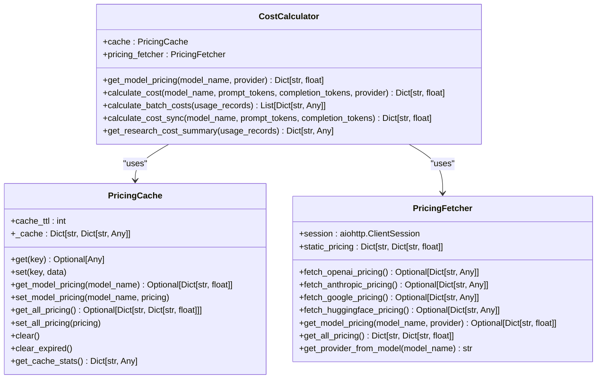

**Diagram sources**
- [cost_calculator.py](file://src/local_deep_research/metrics/pricing/cost_calculator.py#L16-L237)
- [pricing_fetcher.py](file://src/local_deep_research/metrics/pricing/pricing_fetcher.py#L14-L241)
- [pricing_cache.py](file://src/local_deep_research/metrics/pricing/pricing_cache.py#L14-L109)

### Pricing Data Flow

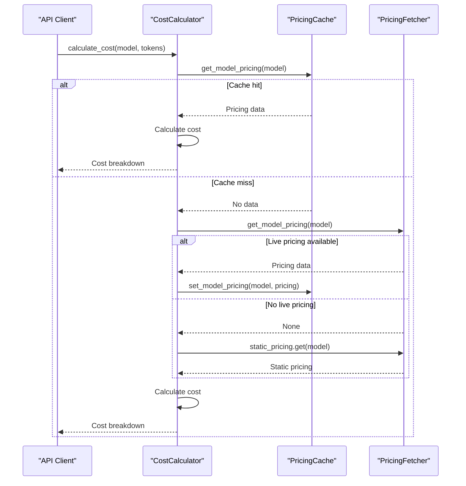

**Diagram sources**
- [cost_calculator.py](file://src/local_deep_research/metrics/pricing/cost_calculator.py#L32-L94)
- [pricing_fetcher.py](file://src/local_deep_research/metrics/pricing/pricing_fetcher.py#L117-L181)

### Static Pricing Database

The system includes a comprehensive static pricing database for major LLM providers:

```mermaid
erDiagram
PRICING_DATA {
string model_name PK
float prompt_price_per_1k_tokens
float completion_price_per_1k_tokens
string provider
}
PRICING_DATA {
"gpt-4" : 0.03 : 0.06 : "openai"
"gpt-4-turbo" : 0.01 : 0.03 : "openai"
"gpt-4o" : 0.005 : 0.015 : "openai"
"gpt-4o-mini" : 0.00015 : 0.0006 : "openai"
"gpt-3.5-turbo" : 0.001 : 0.002 : "openai"
"claude-3-opus" : 0.015 : 0.075 : "anthropic"
"claude-3-sonnet" : 0.003 : 0.015 : "anthropic"
"claude-3-haiku" : 0.00025 : 0.00125 : "anthropic"
"claude-3-5-sonnet" : 0.003 : 0.015 : "anthropic"
"gemini-pro" : 0.0005 : 0.0015 : "google"
"gemini-pro-vision" : 0.0005 : 0.0015 : "google"
"gemini-1.5-pro" : 0.0035 : 0.0105 : "google"
"gemini-1.5-flash" : 0.00035 : 0.00105 : "google"
"ollama" : 0.0 : 0.0 : "local"
"llama" : 0.0 : 0.0 : "local"
"mistral" : 0.0 : 0.0 : "local"
"gemma" : 0.0 : 0.0 : "local"
"qwen" : 0.0 : 0.0 : "local"
"codellama" : 0.0 : 0.0 : "local"
"vicuna" : 0.0 : 0.0 : "local"
"alpaca" : 0.0 : 0.0 : "local"
"vllm" : 0.0 : 0.0 : "local"
"lmstudio" : 0.0 : 0.0 : "local"
"llamacpp" : 0.0 : 0.0 : "local"
}
```

**Diagram sources**
- [pricing_fetcher.py](file://src/local_deep_research/metrics/pricing/pricing_fetcher.py#L29-L60)

**Section sources**
- [pricing_fetcher.py](file://src/local_deep_research/metrics/pricing/pricing_fetcher.py#L1-L241)

## Aggregation Methods

The metrics system employs various aggregation methods to provide summarized data across different dimensions and time periods.

### Time-Based Aggregation

The system supports multiple time periods for metric queries, with corresponding cutoff times:

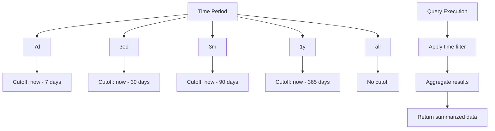

**Diagram sources**
- [query_utils.py](file://src/local_deep_research/metrics/query_utils.py#L9-L33)

### Research Mode Aggregation

Metrics can be filtered and aggregated by research mode:

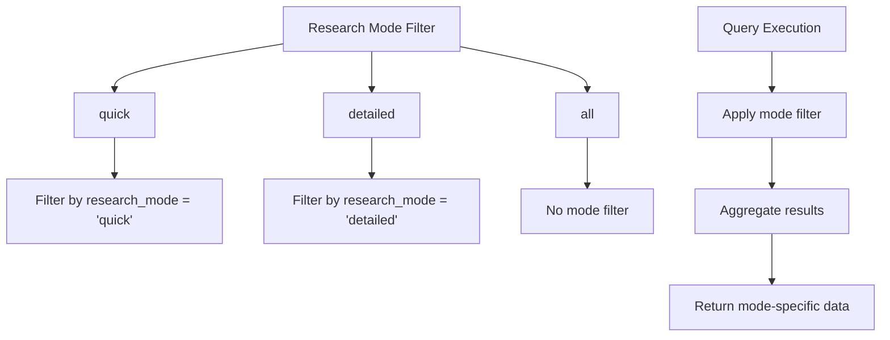

**Diagram sources**
- [query_utils.py](file://src/local_deep_research/metrics/query_utils.py#L36-L51)

### Database Aggregation Queries

The system uses SQLAlchemy to perform efficient database aggregations:

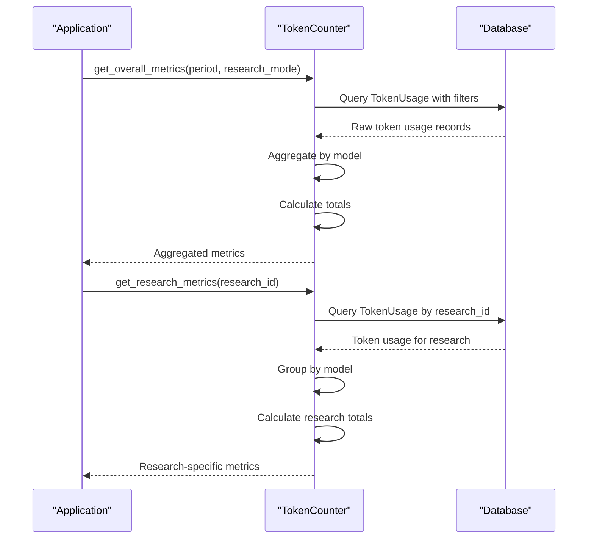

**Diagram sources**
- [token_counter.py](file://src/local_deep_research/metrics/token_counter.py#L633-L702)
- [search_tracker.py](file://src/local_deep_research/metrics/search_tracker.py#L122-L241)

**Section sources**
- [query_utils.py](file://src/local_deep_research/metrics/query_utils.py#L1-L52)
- [token_counter.py](file://src/local_deep_research/metrics/token_counter.py#L595-L702)
- [search_tracker.py](file://src/local_deep_research/metrics/search_tracker.py#L17-L241)

## Time-Series Data

The system provides time-series data for visualizing metrics over time, particularly for search activity and usage patterns.

### Search Time Series Endpoint

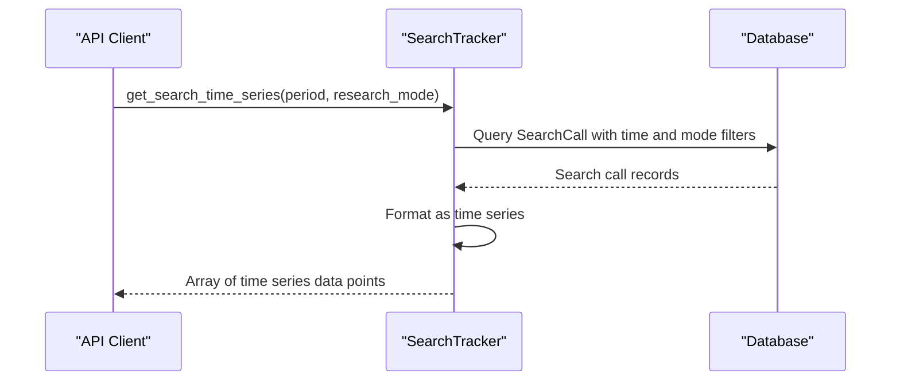

**Diagram sources**
- [search_tracker.py](file://src/local_deep_research/metrics/search_tracker.py#L343-L404)

### Time Series Data Structure

The time-series data includes the following fields for each data point:

| Field | Type | Description |
|-------|------|-------------|
| timestamp | string | ISO format timestamp of the search call |
| search_engine | string | Name of the search engine used |
| results_count | integer | Number of results returned by the search |
| response_time_ms | integer | Response time in milliseconds |
| success_status | string | "success" or "error" status of the search |
| query | string | Truncated search query (first 50 characters) |

This structure enables visualization of search activity patterns, performance trends, and engine usage over time.

**Section sources**
- [search_tracker.py](file://src/local_deep_research/metrics/search_tracker.py#L343-L404)

## Error Handling

The metrics system implements comprehensive error handling for invalid requests and system errors.

### Invalid Time Range Handling

When an invalid time period is provided, the system defaults to 30 days:

```python
def get_time_filter_condition(period: str, timestamp_column: Column) -> Any:
    """Get SQLAlchemy condition for time filtering."""
    if period == "all":
        return None
    elif period == "7d":
        cutoff = datetime.now(UTC) - timedelta(days=7)
    elif period == "30d":
        cutoff = datetime.now(UTC) - timedelta(days=30)
    elif period == "3m":
        cutoff = datetime.now(UTC) - timedelta(days=90)
    elif period == "1y":
        cutoff = datetime.now(UTC) - timedelta(days=365)
    else:
        # Default to 30 days for unknown periods
        cutoff = datetime.now(UTC) - timedelta(days=30)
    
    return timestamp_column >= cutoff
```

### API Error Responses

All API endpoints return standardized error responses:

```json
{
  "status": "error",
  "message": "An internal error occurred. Please try again later."
}
```

Or for specific validation errors:

```json
{
  "status": "error",
  "message": "No user session found"
}
```

### Exception Handling in Metrics Collection

The system gracefully handles exceptions during metrics collection:

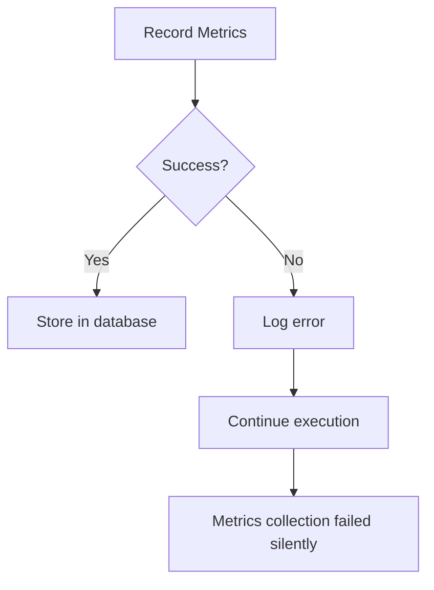

This ensures that metrics collection failures do not disrupt the primary research operations.

**Section sources**
- [query_utils.py](file://src/local_deep_research/metrics/query_utils.py#L9-L33)
- [metrics_routes.py](file://src/local_deep_research/web/routes/metrics_routes.py#L860-L958)

## Authentication Requirements

All metrics API endpoints require user authentication to ensure data privacy and security.

### Authentication Mechanism

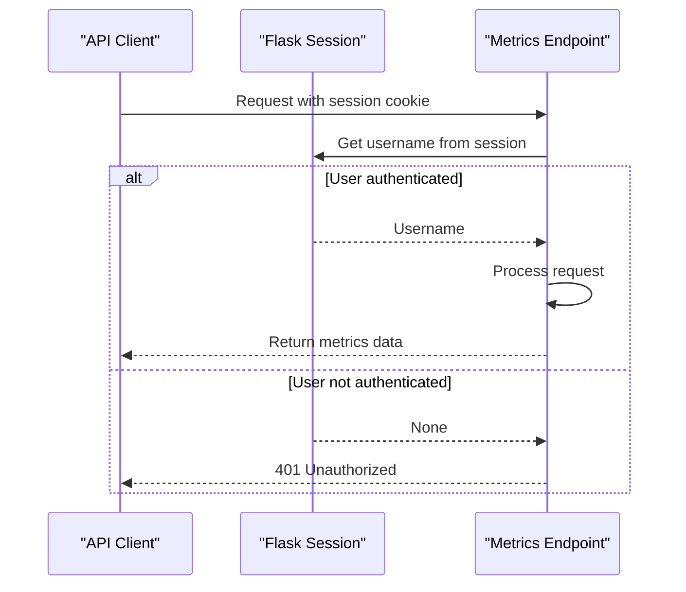

### Session-Based Authentication

The system uses Flask sessions to authenticate users:

1. Users must be logged in to access metrics endpoints
2. The username is retrieved from the Flask session
3. Database queries are scoped to the authenticated user's data
4. Thread-safe metrics writing uses session passwords for encrypted database access

This approach ensures that users can only access their own metrics data, maintaining privacy and security.

**Section sources**
- [metrics_routes.py](file://src/local_deep_research/web/routes/metrics_routes.py#L846-L872)
- [thread_metrics.py](file://src/local_deep_research/database/thread_metrics.py#L53-L65)

## Relationship to Tracking System

The metrics endpoints are closely integrated with the underlying tracking system that collects data during research execution.

### Data Flow Architecture

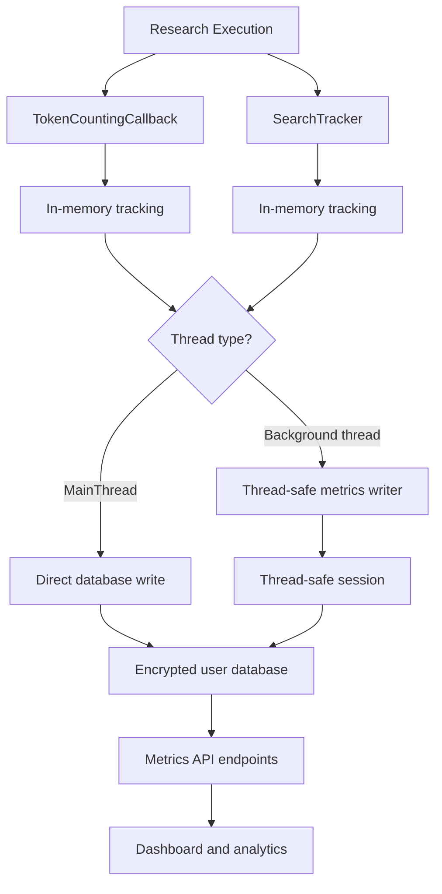

### Token Tracking Lifecycle

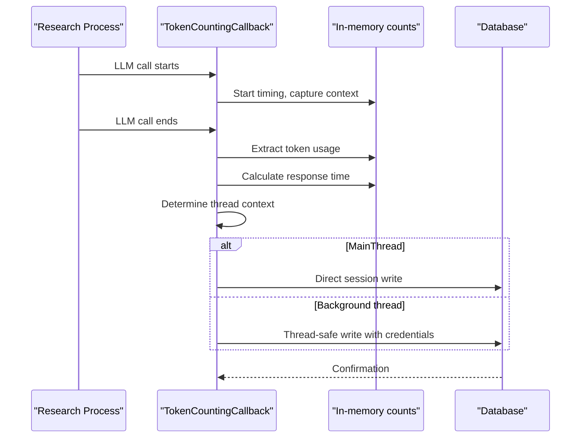

### Search Tracking Lifecycle

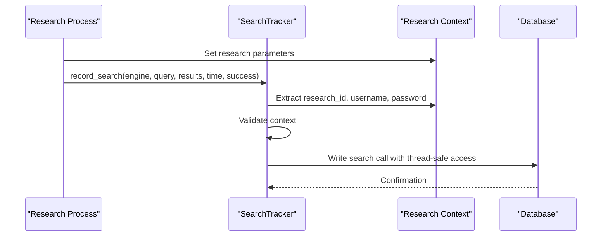

The tracking system captures metrics at the point of execution and stores them in the user's encrypted database. The metrics API endpoints then query this stored data to provide analytics and reporting capabilities.

**Diagram sources**
- [token_counter.py](file://src/local_deep_research/metrics/token_counter.py#L19-L589)
- [search_tracker.py](file://src/local_deep_research/metrics/search_tracker.py#L24-L121)
- [thread_metrics.py](file://src/local_deep_research/database/thread_metrics.py#L19-L159)

**Section sources**
- [token_counter.py](file://src/local_deep_research/metrics/token_counter.py#L1-L800)
- [search_tracker.py](file://src/local_deep_research/metrics/search_tracker.py#L1-L443)
- [thread_metrics.py](file://src/local_deep_research/database/thread_metrics.py#L1-L160)

## Examples

### Querying Daily Usage Metrics

To retrieve metrics for the last 7 days:

```bash
curl -X GET "http://localhost:5000/metrics/api/metrics?period=7d&mode=all" \
  -H "Content-Type: application/json"
```

Response:
```json
{
  "status": "success",
  "metrics": {
    "total_tokens": 154230,
    "total_calls": 234,
    "by_model": [
      {
        "model": "gpt-4o",
        "provider": "openai",
        "tokens": 89450,
        "calls": 120,
        "prompt_tokens": 45230,
        "completion_tokens": 44220
      },
      {
        "model": "claude-3-sonnet",
        "provider": "anthropic",
        "tokens": 64780,
        "calls": 114,
        "prompt_tokens": 32560,
        "completion_tokens": 32220
      }
    ],
    "search_engine_stats": [
      {
        "engine": "google_pse",
        "call_count": 45,
        "avg_response_time": 1250,
        "total_results": 450,
        "avg_results_per_call": 10,
        "success_rate": 95.6,
        "error_count": 2
      }
    ]
  },
  "period": "7d",
  "research_mode": "all"
}
```

### Retrieving Cost Breakdown by LLM Provider

To get cost analytics by provider:

```bash
curl -X GET "http://localhost:5000/metrics/api/cost-analytics" \
  -H "Content-Type: application/json"
```

Response:
```json
{
  "status": "success",
  "metrics": {
    "total_cost": 4.23,
    "prompt_cost": 1.87,
    "completion_cost": 2.36,
    "total_tokens": 154230,
    "prompt_tokens": 77790,
    "completion_tokens": 76440,
    "total_calls": 234,
    "model_breakdown": {
      "gpt-4o": {
        "total_cost": 2.67,
        "prompt_tokens": 45230,
        "completion_tokens": 44220,
        "calls": 120
      },
      "claude-3-sonnet": {
        "total_cost": 1.56,
        "prompt_tokens": 32560,
        "completion_tokens": 32220,
        "calls": 114
      }
    },
    "avg_cost_per_call": 0.018,
    "cost_per_token": 0.0000274
  }
}
```

### Obtaining Performance Statistics

To retrieve search performance metrics:

```bash
curl -X GET "http://localhost:5000/metrics/api/rate-limiting?period=30d" \
  -H "Content-Type: application/json"
```

Response:
```json
{
  "status": "success",
  "data": {
    "rate_limiting": {
      "total_attempts": 189,
      "successful_attempts": 176,
      "failed_attempts": 13,
      "success_rate": 93.1,
      "rate_limit_events": 8,
      "avg_wait_time": 1.25,
      "avg_successful_wait": 0.8,
      "tracked_engines": 3,
      "engine_stats": [
        {
          "engine": "google_pse",
          "base_wait_seconds": 1.0,
          "min_wait_seconds": 0.5,
          "max_wait_seconds": 3.0,
          "success_rate": 95.0,
          "total_attempts": 120,
          "recent_attempts": 120,
          "recent_success_rate": 95.0,
          "attempts": 120,
          "status": "healthy",
          "last_updated": "2025-01-15T10:30:45+00:00"
        }
      ],
      "total_engines_tracked": 3,
      "healthy_engines": 2,
      "degraded_engines": 1,
      "poor_engines": 0
    }
  },
  "period": "30d"
}
```

### Getting Research-Specific Metrics

To retrieve metrics for a specific research session:

```bash
curl -X GET "http://localhost:5000/metrics/api/metrics/research/abc123-def456" \
  -H "Content-Type: application/json"
```

Response:
```json
{
  "status": "success",
  "metrics": {
    "research_id": "abc123-def456",
    "total_tokens": 4560,
    "total_calls": 8,
    "model_usage": [
      {
        "model": "gpt-4o",
        "provider": "openai",
        "tokens": 4560,
        "calls": 8,
        "prompt_tokens": 2340,
        "completion_tokens": 2220
      }
    ]
  }
}
```

**Section sources**
- [test_metrics_api.py](file://tests/api_tests/test_metrics_api.py#L1-L149)
- [metrics_routes.py](file://src/local_deep_research/web/routes/metrics_routes.py#L860-L1037)