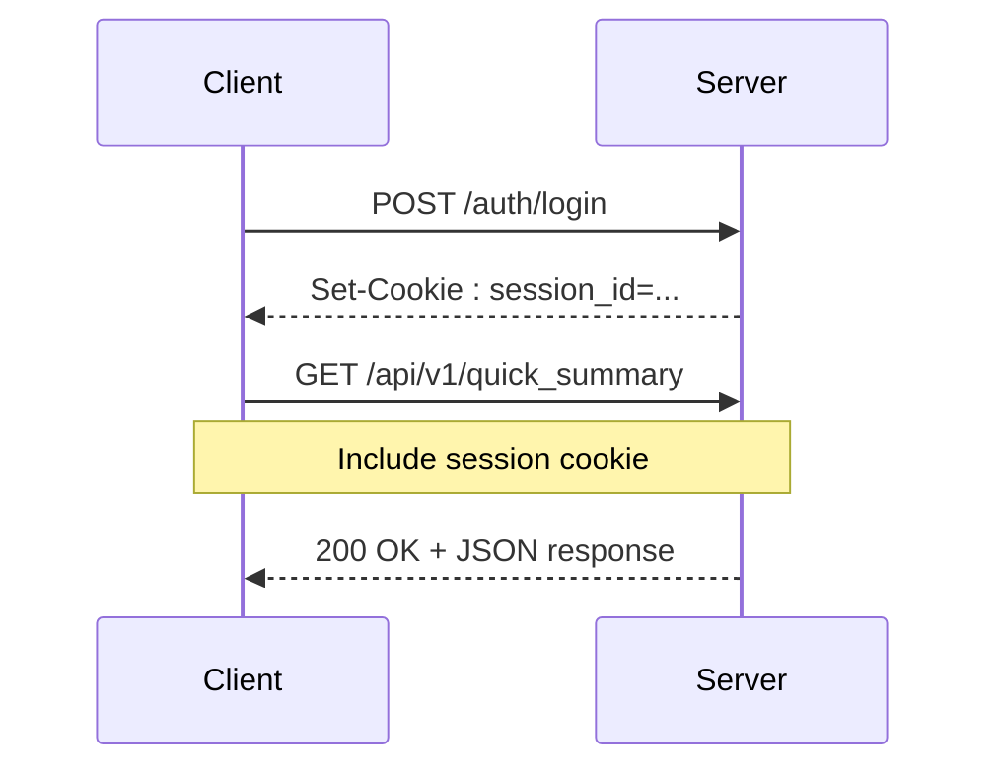
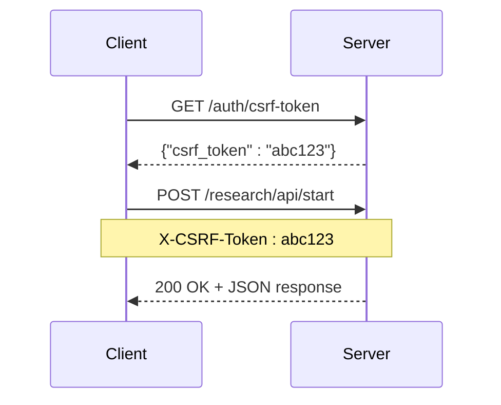

# REST API

<cite>
**Referenced Files in This Document**   
- [api.py](file://src/local_deep_research/web/api.py)
- [api_routes.py](file://src/local_deep_research/web/routes/api_routes.py)
- [research_routes.py](file://src/local_deep_research/web/routes/research_routes.py)
- [history_routes.py](file://src/local_deep_research/web/routes/history_routes.py)
- [metrics_routes.py](file://src/local_deep_research/web/routes/metrics_routes.py)
- [settings_routes.py](file://src/local_deep_research/web/routes/settings_routes.py)
- [client.py](file://src/local_deep_research/api/client.py)
</cite>

## Table of Contents
1. [Introduction](#introduction)
2. [Authentication and Security](#authentication-and-security)
3. [Core Research Endpoints](#core-research-endpoints)
4. [Research Management Endpoints](#research-management-endpoints)
5. [History and Results Endpoints](#history-and-results-endpoints)
6. [Metrics and Analytics Endpoints](#metrics-and-analytics-endpoints)
7. [Settings Management Endpoints](#settings-management-endpoints)
8. [Error Handling and Rate Limiting](#error-handling-and-rate-limiting)
9. [Client Library](#client-library)
10. [Integration Guidance](#integration-guidance)

## Introduction

The Local Deep Research (LDR) system provides a comprehensive REST API for programmatic access to its advanced research capabilities. This API enables users to initiate research tasks, retrieve results, manage settings, access historical data, and obtain metrics through standardized HTTP endpoints. The API is designed for integration with external applications, automation scripts, and custom workflows, offering both simple and advanced functionality for various use cases.

The API is organized into several logical groups:
- **Core Research**: Endpoints for initiating and managing research processes
- **Research Management**: Endpoints for controlling active research tasks
- **History and Results**: Endpoints for accessing completed research and detailed results
- **Metrics and Analytics**: Endpoints for retrieving system and research performance metrics
- **Settings Management**: Endpoints for configuring system and user preferences

All API endpoints require authentication and are protected by CSRF tokens for security. The API follows RESTful principles with clear URL patterns, standardized HTTP methods, and consistent response formats. Responses are returned in JSON format, making them easy to parse and integrate with various programming languages and frameworks.

**Section sources**
- [api.py](file://src/local_deep_research/web/api.py#L1-L457)
- [api_routes.py](file://src/local_deep_research/web/routes/api_routes.py#L1-L662)

## Authentication and Security

### Authentication Requirements

All API endpoints require user authentication. The LDR system uses a session-based authentication mechanism that requires users to log in before accessing protected endpoints. Authentication is performed through the `/auth/login` endpoint, which establishes a session cookie that must be included in subsequent requests.

To authenticate with the API:
1. Send a POST request to `/auth/login` with username and password
2. Include the returned session cookie in all subsequent requests
3. The session remains valid until explicitly logged out or expired



**Diagram sources**
- [api.py](file://src/local_deep_research/web/api.py#L24-L95)
- [auth/routes.py](file://src/local_deep_research/web/auth/routes.py#L66-L249)

### CSRF Protection

The API implements CSRF (Cross-Site Request Forgery) protection to prevent unauthorized requests. For endpoints that modify data (POST, PUT, DELETE), a CSRF token must be included in the request headers.

To obtain a CSRF token:
1. Make a GET request to `/auth/csrf-token`
2. Extract the `csrf_token` from the JSON response
3. Include it in the `X-CSRF-Token` header for subsequent requests



**Diagram sources**
- [api.py](file://src/local_deep_research/web/api.py#L24-L95)
- [auth/routes.py](file://src/local_deep_research/web/auth/routes.py#L32-L46)

### Security Headers

The API includes several security headers in all responses to enhance security:
- `Content-Security-Policy`: Restricts sources of content
- `X-Content-Type-Options`: Prevents MIME type sniffing
- `X-Frame-Options`: Prevents clickjacking attacks
- `X-XSS-Protection`: Enables XSS filtering
- `Strict-Transport-Security`: Enforces HTTPS (when enabled)

These headers are automatically applied by the SecurityHeaders middleware and cannot be disabled.

**Section sources**
- [app_factory.py](file://src/local_deep_research/web/app_factory.py#L238-L240)
- [security/security_headers.py](file://src/local_deep_research/security/security_headers.py)

## Core Research Endpoints

### Quick Research Summary

Initiate a quick research summary based on a query. This endpoint generates a concise summary of the research topic using configured search engines and LLMs.

**Endpoint**: `POST /api/v1/quick_summary`  
**Authentication**: Required  
**CSRF Protection**: Required  

#### Request Parameters

| Parameter | Type | Required | Description | Default |
|---------|------|----------|-------------|---------|
| `query` | string | Yes | The research query to investigate | N/A |
| `search_tool` | string | No | Search engine to use (e.g., "searxng", "google_pse") | "auto" |
| `iterations` | integer | No | Number of search iterations to perform | 1 |
| `temperature` | float | No | LLM temperature setting (0.0 to 1.0) | 0.7 |

#### Response Schema

```json
{
  "summary": "string",
  "findings": [
    {
      "topic": "string",
      "content": "string",
      "sources": [
        {
          "title": "string",
          "url": "string",
          "snippet": "string"
        }
      ]
    }
  ],
  "metadata": {
    "query": "string",
    "search_tool": "string",
    "iterations": "integer",
    "temperature": "float",
    "research_id": "string",
    "created_at": "string (ISO 8601)"
  }
}
```

#### Example Request

```http
POST /api/v1/quick_summary HTTP/1.1
Host: localhost:5000
Content-Type: application/json
Cookie: session_id=abc123
X-CSRF-Token: xyz789

{
  "query": "Advances in fusion energy research",
  "search_tool": "wikipedia",
  "iterations": 2,
  "temperature": 0.7
}
```

#### Example Response

```json
{
  "summary": "Recent advances in fusion energy research have focused on improving plasma confinement and increasing energy output. Key developments include...",
  "findings": [
    {
      "topic": "Tokamak Design Improvements",
      "content": "New superconducting magnets have enabled stronger magnetic fields, improving plasma confinement efficiency by 15%.",
      "sources": [
        {
          "title": "ITER Project Updates",
          "url": "https://www.iter.org/newsline/-/2987",
          "snippet": "The ITER project has achieved first plasma in its central solenoid..."
        }
      ]
    }
  ],
  "metadata": {
    "query": "Advances in fusion energy research",
    "search_tool": "wikipedia",
    "iterations": 2,
    "temperature": 0.7,
    "research_id": "550e8400-e29b-41d4-a716-446655440000",
    "created_at": "2024-01-15T10:30:00Z"
  }
}
```

**Section sources**
- [api.py](file://src/local_deep_research/web/api.py#L217-L338)

### Generate Comprehensive Report

Generate a detailed research report on a specific topic. This endpoint produces a comprehensive report with multiple sections, citations, and references.

**Endpoint**: `POST /api/v1/generate_report`  
**Authentication**: Required  
**CSRF Protection**: Required  

#### Request Parameters

| Parameter | Type | Required | Description | Default |
|---------|------|----------|-------------|---------|
| `query` | string | Yes | The research query to investigate | N/A |
| `output_file` | string | No | Path to save the report (relative to data directory) | None |
| `searches_per_section` | integer | No | Number of searches to perform per report section | 1 |
| `model_name` | string | No | LLM model to use for report generation | Configured default |
| `temperature` | float | No | LLM temperature setting (0.0 to 1.0) | 0.7 |

#### Response Schema

```json
{
  "report_id": "string",
  "title": "string",
  "content": "string",
  "table_of_contents": [
    {
      "section": "string",
      "page": "integer"
    }
  ],
  "references": [
    {
      "title": "string",
      "url": "string",
      "publication_date": "string",
      "relevance_score": "float"
    }
  ],
  "metadata": {
    "query": "string",
    "searches_per_section": "integer",
    "model_name": "string",
    "temperature": "float",
    "word_count": "integer",
    "reading_time_minutes": "integer",
    "created_at": "string (ISO 8601)"
  },
  "content_truncated": "boolean"
}
```

#### Example Request

```http
POST /api/v1/generate_report HTTP/1.1
Host: localhost:5000
Content-Type: application/json
Cookie: session_id=abc123
X-CSRF-Token: xyz789

{
  "query": "Impact of climate change on agriculture",
  "output_file": "/reports/climate_agriculture.md",
  "searches_per_section": 2,
  "model_name": "gpt-4",
  "temperature": 0.5
}
```

#### Example Response

```json
{
  "report_id": "678e9500-f30c-42e5-b827-557766554400",
  "title": "The Impact of Climate Change on Global Agriculture",
  "content": "# Executive Summary\nClimate change is having profound effects on agricultural systems worldwide. Rising temperatures, changing precipitation patterns, and increased frequency of extreme weather events are disrupting food production...\n\n# Introduction\nAgriculture is highly dependent on climatic conditions. As global temperatures rise due to anthropogenic greenhouse gas emissions, agricultural productivity is being affected in complex ways...\n\n# Regional Impacts\n## North America\nIn the United States, climate change is expected to shift suitable growing regions northward. The Midwest corn belt may become less productive due to increased heat stress and water scarcity...",
  "table_of_contents": [
    {
      "section": "Executive Summary",
      "page": 1
    },
    {
      "section": "Introduction",
      "page": 2
    },
    {
      "section": "Regional Impacts",
      "page": 3
    }
  ],
  "references": [
    {
      "title": "Climate Change and Food Security",
      "url": "https://www.nature.com/articles/s43017-022-00328-9",
      "publication_date": "2022-08-15",
      "relevance_score": 0.95
    }
  ],
  "metadata": {
    "query": "Impact of climate change on agriculture",
    "searches_per_section": 2,
    "model_name": "gpt-4",
    "temperature": 0.5,
    "word_count": 2450,
    "reading_time_minutes": 12,
    "created_at": "2024-01-15T11:45:30Z"
  },
  "content_truncated": false
}
```

**Section sources**
- [api.py](file://src/local_deep_research/web/api.py#L341-L409)

### Analyze Documents in Collection

Search and analyze documents within a local collection. This endpoint allows users to query their personal document collections using semantic search and LLM analysis.

**Endpoint**: `POST /api/v1/analyze_documents`  
**Authentication**: Required  
**CSRF Protection**: Required  

#### Request Parameters

| Parameter | Type | Required | Description | Default |
|---------|------|----------|-------------|---------|
| `query` | string | Yes | The search query to find relevant documents | N/A |
| `collection_name` | string | Yes | Name of the local collection to search | N/A |
| `max_results` | integer | No | Maximum number of results to return | 10 |
| `temperature` | float | No | LLM temperature setting (0.0 to 1.0) | 0.7 |
| `force_reindex` | boolean | No | Force reindexing of the collection before search | false |

#### Response Schema

```json
{
  "query": "string",
  "collection_name": "string",
  "results": [
    {
      "document_id": "string",
      "title": "string",
      "content_preview": "string",
      "relevance_score": "float",
      "metadata": {
        "author": "string",
        "publication_date": "string",
        "source_type": "string",
        "tags": ["string"]
      },
      "analysis": {
        "summary": "string",
        "key_points": ["string"],
        "sentiment": "string",
        "entities": ["string"]
      }
    }
  ],
  "search_metadata": {
    "total_documents": "integer",
    "documents_searched": "integer",
    "search_duration_ms": "integer",
    "index_status": "string"
  }
}
```

#### Example Request

```http
POST /api/v1/analyze_documents HTTP/1.1
Host: localhost:5000
Content-Type: application/json
Cookie: session_id=abc123
X-CSRF-Token: xyz789

{
  "query": "neural networks in medicine",
  "collection_name": "research_papers",
  "max_results": 5,
  "temperature": 0.7,
  "force_reindex": false
}
```

#### Example Response

```json
{
  "query": "neural networks in medicine",
  "collection_name": "research_papers",
  "results": [
    {
      "document_id": "doc_12345",
      "title": "Deep Learning for Medical Image Analysis",
      "content_preview": "Convolutional neural networks have revolutionized medical image analysis, achieving human-level performance in tasks such as tumor detection...",
      "relevance_score": 0.98,
      "metadata": {
        "author": "Dr. Jane Smith",
        "publication_date": "2023-05-15",
        "source_type": "academic_paper",
        "tags": ["AI", "medicine", "imaging"]
      },
      "analysis": {
        "summary": "This paper presents a novel CNN architecture for detecting tumors in medical images with 95% accuracy.",
        "key_points": [
          "Proposes a 3D CNN for volumetric medical data",
          "Achieves state-of-the-art results on public datasets",
          "Includes explainability features for clinical adoption"
        ],
        "sentiment": "positive",
        "entities": ["CNN", "tumor detection", "medical imaging"]
      }
    }
  ],
  "search_metadata": {
    "total_documents": 150,
    "documents_searched": 150,
    "search_duration_ms": 245,
    "index_status": "up_to_date"
  }
}
```

**Section sources**
- [api.py](file://src/local_deep_research/web/api.py#L412-L456)

## Research Management Endpoints

### Start Research Process

Initiate a new research process with detailed configuration options. This endpoint starts a background research task that can be monitored through other endpoints.

**Endpoint**: `POST /research/api/start`  
**Authentication**: Required  
**CSRF Protection**: Required  

#### Request Parameters

| Parameter | Type | Required | Description | Default |
|---------|------|----------|-------------|---------|
| `query` | string | Yes | The research query to investigate | N/A |
| `mode` | string | No | Research mode ("quick", "comprehensive", "focused") | "quick" |
| `model_provider` | string | No | LLM provider to use (e.g., "OLLAMA", "OPENAI") | Configured default |
| `model` | string | No | Specific LLM model to use | Configured default |
| `custom_endpoint` | string | No | Custom endpoint URL (for OPENAI_ENDPOINT provider) | None |
| `search_engine` | string | No | Search engine to use | Configured default |
| `max_results` | integer | No | Maximum search results to process | Configured default |
| `time_period` | string | No | Time period for search results ("any", "year", "month", "week") | "any" |
| `iterations` | integer | No | Number of research iterations | Configured default |
| `questions_per_iteration` | integer | No | Number of questions to generate per iteration | Configured default |
| `strategy` | string | No | Research strategy to use | Configured default |

#### Response Schema

```json
{
  "status": "string",
  "message": "string",
  "research_id": "string"
}
```

#### Example Request

```http
POST /research/api/start HTTP/1.1
Host: localhost:5000
Content-Type: application/json
Cookie: session_id=abc123
X-CSRF-Token: xyz789

{
  "query": "Latest developments in quantum computing",
  "mode": "comprehensive",
  "model_provider": "OLLAMA",
  "model": "llama2:70b",
  "search_engine": "searxng",
  "iterations": 3,
  "questions_per_iteration": 5,
  "strategy": "iterative"
}
```

#### Example Response

```json
{
  "status": "success",
  "message": "Research started successfully",
  "research_id": "550e8400-e29b-41d4-a716-446655440000"
}
```

**Section sources**
- [api_routes.py](file://src/local_deep_research/web/routes/api_routes.py#L72-L134)

### Get Research Status

Retrieve the current status of a research process. This endpoint provides real-time updates on the progress of ongoing research.

**Endpoint**: `GET /research/api/status/{research_id}`  
**Authentication**: Required  
**CSRF Protection**: Not required  

#### Path Parameters

| Parameter | Type | Required | Description |
|---------|------|----------|-------------|
| `research_id` | string | Yes | Unique identifier of the research process |

#### Response Schema

```json
{
  "status": "string",
  "progress": "integer",
  "completed_at": "string (ISO 8601)",
  "report_path": "string",
  "metadata": {
    "query": "string",
    "mode": "string",
    "model_provider": "string",
    "model": "string",
    "search_engine": "string",
    "iterations": "integer",
    "questions_per_iteration": "integer",
    "strategy": "string"
  }
}
```

#### Example Request

```http
GET /research/api/status/550e8400-e29b-41d4-a716-446655440000 HTTP/1.1
Host: localhost:5000
Cookie: session_id=abc123
```

#### Example Response

```json
{
  "status": "in_progress",
  "progress": 65,
  "completed_at": null,
  "report_path": null,
  "metadata": {
    "query": "Latest developments in quantum computing",
    "mode": "comprehensive",
    "model_provider": "OLLAMA",
    "model": "llama2:70b",
    "search_engine": "searxng",
    "iterations": 3,
    "questions_per_iteration": 5,
    "strategy": "iterative"
  }
}
```

**Section sources**
- [api_routes.py](file://src/local_deep_research/web/routes/api_routes.py#L136-L172)

### Terminate Research Process

Stop an ongoing research process. This endpoint allows users to cancel research that is currently in progress.

**Endpoint**: `POST /research/api/terminate/{research_id}`  
**Authentication**: Required  
**CSRF Protection**: Required  

#### Path Parameters

| Parameter | Type | Required | Description |
|---------|------|----------|-------------|
| `research_id` | string | Yes | Unique identifier of the research process |

#### Response Schema

```json
{
  "status": "string",
  "message": "string",
  "result": "object"
}
```

#### Example Request

```http
POST /research/api/terminate/550e8400-e29b-41d4-a716-446655440000 HTTP/1.1
Host: localhost:5000
Content-Type: application/json
Cookie: session_id=abc123
X-CSRF-Token: xyz789
```

#### Example Response

```json
{
  "status": "success",
  "message": "Research terminated",
  "result": {
    "research_id": "550e8400-e29b-41d4-a716-446655440000",
    "termination_time": "2024-01-15T12:30:45Z",
    "completed_iterations": 2,
    "partial_results": true
  }
}
```

**Section sources**
- [api_routes.py](file://src/local_deep_research/web/routes/api_routes.py#L174-L207)

## History and Results Endpoints

### Get Research History

Retrieve a list of past research activities. This endpoint returns metadata about completed and ongoing research processes.

**Endpoint**: `GET /history/api`  
**Authentication**: Required  
**CSRF Protection**: Not required  

#### Query Parameters

| Parameter | Type | Required | Description | Default |
|---------|------|----------|-------------|---------|
| `limit` | integer | No | Maximum number of items to return | 50 |
| `offset` | integer | No | Number of items to skip (for pagination) | 0 |
| `status` | string | No | Filter by status ("completed", "in_progress", "failed", "suspended") | All statuses |

#### Response Schema

```json
{
  "status": "string",
  "items": [
    {
      "id": "string",
      "query": "string",
      "mode": "string",
      "status": "string",
      "created_at": "string (ISO 8601)",
      "completed_at": "string (ISO 8601)",
      "duration_seconds": "integer",
      "report_path": "string",
      "document_count": "integer",
      "metadata": "object"
    }
  ]
}
```

#### Example Request

```http
GET /history/api?limit=10&status=completed HTTP/1.1
Host: localhost:5000
Cookie: session_id=abc123
```

#### Example Response

```json
{
  "status": "success",
  "items": [
    {
      "id": "550e8400-e29b-41d4-a716-446655440000",
      "query": "Advances in fusion energy research",
      "mode": "quick",
      "status": "completed",
      "created_at": "2024-01-15T10:30:00Z",
      "completed_at": "2024-01-15T10:45:30Z",
      "duration_seconds": 930,
      "report_path": "/reports/fusion_energy_2024.md",
      "document_count": 12,
      "metadata": {
        "provider": "OLLAMA",
        "model": "llama2:70b",
        "search_tool": "searxng",
        "iterations": 2,
        "questions_per_iteration": 5,
        "search_strategy": "focused_iteration"
      }
    }
  ]
}
```

**Section sources**
- [history_routes.py](file://src/local_deep_research/web/routes/history_routes.py#L33-L163)

### Get Research Details

Retrieve detailed information about a specific research process, including progress logs and intermediate results.

**Endpoint**: `GET /history/details/{research_id}`  
**Authentication**: Required  
**CSRF Protection**: Not required  

#### Path Parameters

| Parameter | Type | Required | Description |
|---------|------|----------|-------------|
| `research_id` | string | Yes | Unique identifier of the research process |

#### Response Schema

```json
{
  "research_id": "string",
  "query": "string",
  "mode": "string",
  "status": "string",
  "strategy": "string",
  "progress": "integer",
  "created_at": "string (ISO 8601)",
  "completed_at": "string (ISO 8601)",
  "log": [
    {
      "time": "string (ISO 8601)",
      "message": "string",
      "progress": "integer",
      "metadata": "object"
    }
  ]
}
```

#### Example Request

```http
GET /history/details/550e8400-e29b-41d4-a716-446655440000 HTTP/1.1
Host: localhost:5000
Cookie: session_id=abc123
```

#### Example Response

```json
{
  "research_id": "550e8400-e29b-41d4-a716-446655440000",
  "query": "Advances in fusion energy research",
  "mode": "quick",
  "status": "completed",
  "strategy": "focused_iteration",
  "progress": 100,
  "created_at": "2024-01-15T10:30:00Z",
  "completed_at": "2024-01-15T10:45:30Z",
  "log": [
    {
      "time": "2024-01-15T10:30:00Z",
      "message": "Research process started",
      "progress": 0,
      "metadata": {
        "phase": "initialization"
      }
    },
    {
      "time": "2024-01-15T10:32:15Z",
      "message": "Generated initial research questions",
      "progress": 10,
      "metadata": {
        "phase": "question_generation",
        "questions": [
          "What are the latest breakthroughs in fusion reactor design?",
          "How has plasma confinement efficiency improved recently?"
        ]
      }
    }
  ]
}
```

**Section sources**
- [history_routes.py](file://src/local_deep_research/web/routes/history_routes.py#L217-L304)

### Get Research Report

Retrieve the full report content for a completed research process. This endpoint returns the complete research output in a structured format.

**Endpoint**: `GET /history/report/{research_id}`  
**Authentication**: Required  
**CSRF Protection**: Not required  

#### Path Parameters

| Parameter | Type | Required | Description |
|---------|------|----------|-------------|
| `research_id` | string | Yes | Unique identifier of the research process |

#### Response Schema

```json
{
  "status": "string",
  "content": "string",
  "query": "string",
  "mode": "string",
  "created_at": "string (ISO 8601)",
  "completed_at": "string (ISO 8601)",
  "metadata": {
    "query": "string",
    "mode": "string",
    "created_at": "string (ISO 8601)",
    "completed_at": "string (ISO 8601)",
    "duration": "integer"
  }
}
```

#### Example Request

```http
GET /history/report/550e8400-e29b-41d4-a716-446655440000 HTTP/1.1
Host: localhost:5000
Cookie: session_id=abc123
```

#### Example Response

```json
{
  "status": "success",
  "content": "# Research Report: Advances in Fusion Energy\n\n## Executive Summary\nRecent advances in fusion energy research have focused on improving plasma confinement and increasing energy output. Key developments include...\n\n## Technical Breakthroughs\n### Tokamak Design Improvements\nNew superconducting magnets have enabled stronger magnetic fields, improving plasma confinement efficiency by 15%.\n\n### Laser Inertial Confinement\nThe National Ignition Facility has achieved net energy gain in multiple experiments, marking a significant milestone in fusion research.",
  "query": "Advances in fusion energy research",
  "mode": "quick",
  "created_at": "2024-01-15T10:30:00Z",
  "completed_at": "2024-01-15T10:45:30Z",
  "metadata": {
    "query": "Advances in fusion energy research",
    "mode": "quick",
    "created_at": "2024-01-15T10:30:00Z",
    "completed_at": "2024-01-15T10:45:30Z",
    "duration": 930
  }
}
```

**Section sources**
- [history_routes.py](file://src/local_deep_research/web/routes/history_routes.py#L306-L367)

## Metrics and Analytics Endpoints

### Get Rating Analytics

Retrieve analytics on user ratings for research results. This endpoint provides insights into user satisfaction and research quality.

**Endpoint**: `GET /metrics/api/rating_analytics`  
**Authentication**: Required  
**CSRF Protection**: Not required  

#### Query Parameters

| Parameter | Type | Required | Description | Default |
|---------|------|----------|-------------|---------|
| `period` | string | No | Time period for analytics ("7d", "30d", "90d", "365d", "all") | "30d" |
| `research_mode` | string | No | Filter by research mode | "all" |

#### Response Schema

```json
{
  "rating_analytics": {
    "avg_rating": "float",
    "total_ratings": "integer",
    "rating_distribution": {
      "1": "integer",
      "2": "integer",
      "3": "integer",
      "4": "integer",
      "5": "integer"
    },
    "satisfaction_stats": {
      "very_satisfied": "integer",
      "satisfied": "integer",
      "neutral": "integer",
      "dissatisfied": "integer",
      "very_dissatisfied": "integer"
    }
  }
}
```

#### Example Request

```http
GET /metrics/api/rating_analytics?period=90d HTTP/1.1
Host: localhost:5000
Cookie: session_id=abc123
```

#### Example Response

```json
{
  "rating_analytics": {
    "avg_rating": 4.2,
    "total_ratings": 156,
    "rating_distribution": {
      "1": 8,
      "2": 12,
      "3": 25,
      "4": 56,
      "5": 55
    },
    "satisfaction_stats": {
      "very_satisfied": 55,
      "satisfied": 56,
      "neutral": 25,
      "dissatisfied": 12,
      "very_dissatisfied": 8
    }
  }
}
```

**Section sources**
- [metrics_routes.py](file://src/local_deep_research/web/routes/metrics_routes.py#L31-L128)

### Get Link Analytics

Retrieve analytics on sources and links used in research. This endpoint provides insights into information sources and their reliability.

**Endpoint**: `GET /metrics/api/link_analytics`  
**Authentication**: Required  
**CSRF Protection**: Not required  

#### Query Parameters

| Parameter | Type | Required | Description | Default |
|---------|------|----------|-------------|---------|
| `period` | string | No | Time period for analytics ("7d", "30d", "90d", "365d", "all") | "30d" |

#### Response Schema

```json
{
  "link_analytics": {
    "top_domains": [
      {
        "domain": "string",
        "count": "integer",
        "percentage": "float",
        "research_count": "integer",
        "recent_researches": [
          {
            "id": "string",
            "query": "string"
          }
        ],
        "classification": {
          "category": "string",
          "subcategory": "string",
          "confidence": "float"
        }
      }
    ],
    "total_unique_domains": "integer",
    "avg_links_per_research": "float",
    "domain_distribution": {
      "top_10": "integer",
      "others": "integer"
    },
    "source_type_analysis": {
      "string": "integer"
    },
    "category_distribution": {
      "string": "integer"
    },
    "total_links": "integer",
    "total_researches": "integer",
    "temporal_trend": [
      {
        "date": "string",
        "count": "integer"
      }
    ]
  }
}
```

#### Example Request

```http
GET /metrics/api/link_analytics?period=30d HTTP/1.1
Host: localhost:5000
Cookie: session_id=abc123
```

#### Example Response

```json
{
  "link_analytics": {
    "top_domains": [
      {
        "domain": "nature.com",
        "count": 45,
        "percentage": 18.5,
        "research_count": 28,
        "recent_researches": [
          {
            "id": "550e8400-e29b-41d4-a716-446655440000",
            "query": "Advances in fusion energy research"
          }
        ],
        "classification": {
          "category": "Academic",
          "subcategory": "Scientific Journal",
          "confidence": 0.98
        }
      }
    ],
    "total_unique_domains": 124,
    "avg_links_per_research": 4.2,
    "domain_distribution": {
      "top_10": 120,
      "others": 328
    },
    "source_type_analysis": {
      "academic_paper": 89,
      "news_article": 45,
      "government_report": 23,
      "blog_post": 18
    },
    "category_distribution": {
      "Academic": 112,
      "News": 67,
      "Government": 34,
      "Commercial": 28,
      "Non-profit": 15
    },
    "total_links": 248,
    "total_researches": 59,
    "temporal_trend": [
      {
        "date": "2024-01-01",
        "count": 5
      },
      {
        "date": "2024-01-02",
        "count": 8
      }
    ]
  }
}
```

**Section sources**
- [metrics_routes.py](file://src/local_deep_research/web/routes/metrics_routes.py#L130-L393)

### Get Strategy Analytics

Retrieve analytics on research strategy usage and effectiveness. This endpoint provides insights into which research strategies are most effective.

**Endpoint**: `GET /metrics/api/strategy_analytics`  
**Authentication**: Required  
**CSRF Protection**: Not required  

#### Query Parameters

| Parameter | Type | Required | Description | Default |
|---------|------|----------|-------------|---------|
| `period` | string | No | Time period for analytics ("7d", "30d", "90d", "365d", "all") | "30d" |

#### Response Schema

```json
{
  "strategy_analytics": {
    "total_research_with_strategy": "integer",
    "total_research": "integer",
    "most_popular_strategy": "string",
    "strategy_usage": [
      {
        "strategy": "string",
        "count": "integer",
        "percentage": "float"
      }
    ],
    "strategy_distribution": {
      "string": "integer"
    },
    "available_strategies": [
      {
        "name": "string",
        "description": "string"
      }
    ]
  }
}
```

#### Example Request

```http
GET /metrics/api/strategy_analytics?period=30d HTTP/1.1
Host: localhost:5000
Cookie: session_id=abc123
```

#### Example Response

```json
{
  "strategy_analytics": {
    "total_research_with_strategy": 59,
    "total_research": 59,
    "most_popular_strategy": "focused_iteration",
    "strategy_usage": [
      {
        "strategy": "focused_iteration",
        "count": 24,
        "percentage": 40.7
      },
      {
        "strategy": "source-based",
        "count": 18,
        "percentage": 30.5
      },
      {
        "strategy": "iterative",
        "count": 10,
        "percentage": 16.9
      }
    ],
    "strategy_distribution": {
      "focused_iteration": 24,
      "source-based": 18,
      "iterative": 10,
      "rapid": 7
    },
    "available_strategies": [
      {
        "name": "standard",
        "description": "Basic iterative search strategy"
      },
      {
        "name": "iterdrag",
        "description": "Iterative Dense Retrieval Augmented Generation"
      }
    ]
  }
}
```

**Section sources**
- [metrics_routes.py](file://src/local_deep_research/web/routes/metrics_routes.py#L482-L598)

## Settings Management Endpoints

### Get All Settings

Retrieve all current user settings. This endpoint returns the complete configuration for the authenticated user.

**Endpoint**: `GET /settings/api`  
**Authentication**: Required  
**CSRF Protection**: Not required  

#### Query Parameters

| Parameter | Type | Required | Description | Default |
|---------|------|----------|-------------|---------|
| `category` | string | No | Filter settings by category ("llm", "search", "report", "database", "app") | All categories |

#### Response Schema

```json
{
  "status": "string",
  "settings": {
    "string": "any"
  }
}
```

#### Example Request

```http
GET /settings/api?category=llm HTTP/1.1
Host: localhost:5000
Cookie: session_id=abc123
```

#### Example Response

```json
{
  "status": "success",
  "settings": {
    "llm.provider": "OLLAMA",
    "llm.model": "llama2:70b",
    "llm.temperature": 0.7,
    "llm.max_tokens": 4096,
    "llm.context_window_size": 32768,
    "llm.local_context_window_size": 32768,
    "llm.context_window_unrestricted": true,
    "llm.ollama.url": "http://localhost:11434",
    "llm.openai.api_key": "sk-...",
    "llm.openai.endpoint.url": "https://api.openai.com/v1"
  }
}
```

**Section sources**
- [settings_routes.py](file://src/local_deep_research/web/routes/settings_routes.py#L693-L729)

### Get Specific Setting

Retrieve a specific setting by key. This endpoint returns detailed information about a single setting.

**Endpoint**: `GET /settings/api/{key}`  
**Authentication**: Required  
**CSRF Protection**: Not required  

#### Path Parameters

| Parameter | Type | Required | Description |
|---------|------|----------|-------------|
| `key` | string | Yes | The setting key to retrieve |

#### Response Schema

```json
{
  "key": "string",
  "value": "any",
  "type": "string",
  "name": "string",
  "description": "string",
  "category": "string",
  "ui_element": "string",
  "options": [
    {
      "label": "string",
      "value": "any"
    }
  ],
  "min_value": "number",
  "max_value": "number",
  "step": "number",
  "visible": "boolean",
  "editable": "boolean"
}
```

#### Example Request

```http
GET /settings/api/llm.model HTTP/1.1
Host: localhost:5000
Cookie: session_id=abc123
```

#### Example Response

```json
{
  "key": "llm.model",
  "value": "llama2:70b",
  "type": "llm",
  "name": "Model",
  "description": "The LLM model to use for research",
  "category": "llm_general",
  "ui_element": "select",
  "options": [
    {
      "label": "Llama 2 7B",
      "value": "llama2:7b"
    },
    {
      "label": "Llama 2 70B",
      "value": "llama2:70b"
    },
    {
      "label": "Gemma 7B",
      "value": "gemma:7b"
    }
  ],
  "min_value": null,
  "max_value": null,
  "step": null,
  "visible": true,
  "editable": true
}
```

**Section sources**
- [settings_routes.py](file://src/local_deep_research/web/routes/settings_routes.py#L732-L770)

### Update Setting

Update a specific setting value. This endpoint modifies the configuration for the authenticated user.

**Endpoint**: `PUT /settings/api/{key}`  
**Authentication**: Required  
**CSRF Protection**: Required  

#### Path Parameters

| Parameter | Type | Required | Description |
|---------|------|----------|-------------|
| `key` | string | Yes | The setting key to update |

#### Request Body

```json
{
  "value": "any"
}
```

#### Response Schema

```json
{
  "status": "string",
  "message": "string",
  "updated": ["string"],
  "created": ["string"],
  "settings": [
    {
      "key": "string",
      "value": "any",
      "name": "string",
      "description": "string",
      "type": "string",
      "category": "string",
      "ui_element": "string",
      "editable": "boolean",
      "options": "array"
    }
  ],
  "warnings": [
    {
      "type": "string",
      "icon": "string",
      "title": "string",
      "message": "string",
      "dismissKey": "string"
    }
  ]
}
```

#### Example Request

```http
PUT /settings/api/llm.temperature HTTP/1.1
Host: localhost:5000
Content-Type: application/json
Cookie: session_id=abc123
X-CSRF-Token: xyz789

{
  "value": 0.5
}
```

#### Example Response

```json
{
  "status": "success",
  "message": "llm.temperature updated",
  "updated": ["llm.temperature"],
  "created": [],
  "settings": [
    {
      "key": "llm.temperature",
      "value": 0.5,
      "name": "Temperature",
      "description": "Controls randomness of output (0.0 = deterministic, 1.0 = random)",
      "type": "llm",
      "category": "llm_parameters",
      "ui_element": "slider",
      "editable": true,
      "options": null
    }
  ],
  "warnings": []
}
```

**Section sources**
- [settings_routes.py](file://src/local_deep_research/web/routes/settings_routes.py#L773-L818)

## Error Handling and Rate Limiting

### Error Response Format

All API endpoints follow a consistent error response format. When an error occurs, the API returns an appropriate HTTP status code and a JSON response with error details.

#### Standard Error Response

```json
{
  "error": "string"
}
```

#### Validation Error Response

```json
{
  "status": "error",
  "message": "Validation errors",
  "errors": [
    {
      "key": "string",
      "name": "string",
      "error": "string"
    }
  ]
}
```

### HTTP Status Codes

The API uses standard HTTP status codes to indicate the result of requests:

| Status Code | Meaning | Description |
|------------|--------|-------------|
| 200 | OK | Request successful |
| 201 | Created | Resource created successfully |
| 400 | Bad Request | Invalid request parameters |
| 401 | Unauthorized | Authentication required or failed |
| 403 | Forbidden | Access denied |
| 404 | Not Found | Resource not found |
| 409 | Conflict | Request conflicts with current state |
| 429 | Too Many Requests | Rate limit exceeded |
| 500 | Internal Server Error | Server error occurred |
| 503 | Service Unavailable | Service temporarily unavailable |

### Rate Limiting

The API implements rate limiting to prevent abuse and ensure fair usage. Rate limits are applied per IP address and can be configured by the system administrator.

#### Rate Limit Headers

When rate limiting is active, responses include the following headers:

| Header | Description |
|-------|-------------|
| `X-RateLimit-Limit` | The maximum number of requests allowed |
| `X-RateLimit-Remaining` | The number of requests remaining in the current window |
| `X-RateLimit-Reset` | The time at which the rate limit will reset (Unix timestamp) |

#### Rate Limit Response

When the rate limit is exceeded, the API returns a 429 status code with the following response:

```json
{
  "error": "Rate limit exceeded. Maximum {limit} requests per minute allowed."
}
```

The default rate limit is 60 requests per minute, but this can be configured in the system settings.

**Section sources**
- [api.py](file://src/local_deep_research/web/api.py#L24-L95)
- [app_factory.py](file://src/local_deep_research/web/app_factory.py#L241-L267)

## Client Library

### LDRClient Class

The LDR system provides a Python client library that simplifies API integration. The `LDRClient` class handles authentication, CSRF token management, and request formatting automatically.

#### Class Initialization

```python
from local_deep_research.api.client import LDRClient

# Initialize client with default URL
client = LDRClient()

# Initialize client with custom base URL
client = LDRClient(base_url="http://localhost:5000")
```

#### Login and Authentication

```python
# Login with username and password
success = client.login("username", "password")
if success:
    print("Login successful")
else:
    print("Login failed")
```

#### Quick Research

```python
# Perform quick research and wait for results
result = client.quick_research(
    query="What is quantum computing?",
    model="gemma:7b",
    search_engines=["searxng"],
    iterations=2,
    wait_for_result=True,
    timeout=300
)
print(result["summary"])
```

#### Context Manager Usage

```python
# Use client as context manager (auto-logout)
with LDRClient() as client:
    client.login("username", "password")
    result = client.quick_research("What is DNA?")
    print(result["summary"])
# Client automatically logs out when exiting context
```

#### Convenience Function

```python
from local_deep_research.api.client import quick_query

# One-liner for quick queries
summary = quick_query("username", "password", "What is DNA?")
print(summary)
```

**Section sources**
- [client.py](file://src/local_deep_research/api/client.py#L65-L458)

## Integration Guidance

### Best Practices for API Consumption

1. **Handle Authentication Properly**: Always check login status before making API calls and handle authentication failures gracefully.

2. **Implement Retry Logic**: For endpoints that may fail due to temporary issues (e.g., network problems), implement exponential backoff retry logic.

3. **Respect Rate Limits**: Monitor rate limit headers and adjust request frequency accordingly to avoid being blocked.

4. **Use Appropriate Timeouts**: Set reasonable timeouts for API requests to prevent hanging connections.

5. **Validate Responses**: Always validate the structure and content of API responses before processing.

6. **Handle Errors Gracefully**: Implement comprehensive error handling for all possible error scenarios.

### Performance Optimization

1. **Batch Requests**: When possible, batch multiple operations into a single request rather than making multiple individual requests.

2. **Cache Responses**: Cache responses for expensive operations that don't change frequently.

3. **Use Streaming for Large Responses**: For endpoints that return large amounts of data, consider implementing streaming to process data incrementally.

4. **Optimize Polling Intervals**: When polling for research status, use adaptive polling intervals (e.g., start with short intervals and increase as research progresses).

5. **Parallel Processing**: For independent operations, use parallel processing to improve overall throughput.

### Common Integration Issues

1. **CSRF Token Issues**: Ensure CSRF tokens are properly obtained and included in requests that require them.

2. **Session Expiration**: Handle session expiration by implementing automatic re-authentication.

3. **Network Connectivity**: Implement robust network error handling for unreliable connections.

4. **Data Format Changes**: Be prepared for API response format changes by implementing flexible parsing logic.

5. **Rate Limiting**: Monitor rate limit headers and adjust application behavior to stay within limits.

**Section sources**
- [client.py](file://src/local_deep_research/api/client.py)
- [api.py](file://src/local_deep_research/web/api.py)
- [api_routes.py](file://src/local_deep_research/web/routes/api_routes.py)