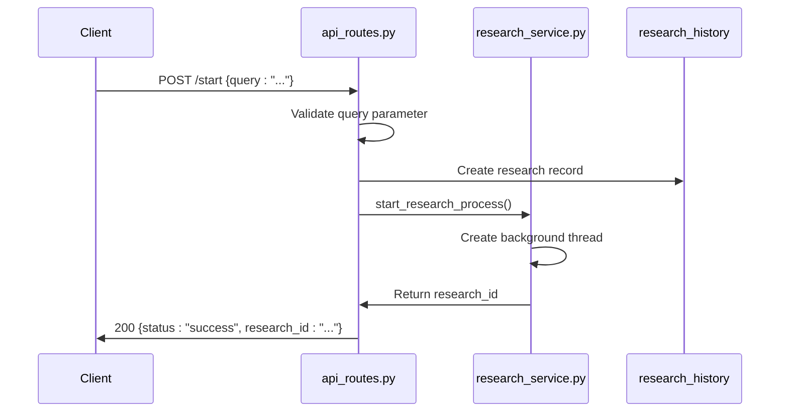
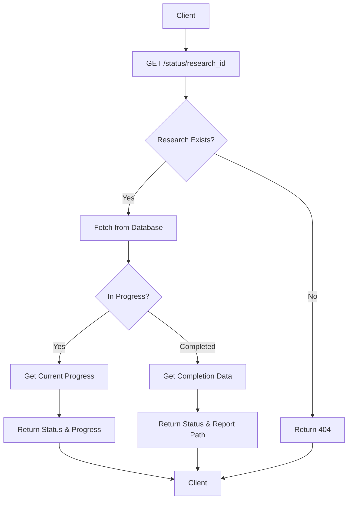
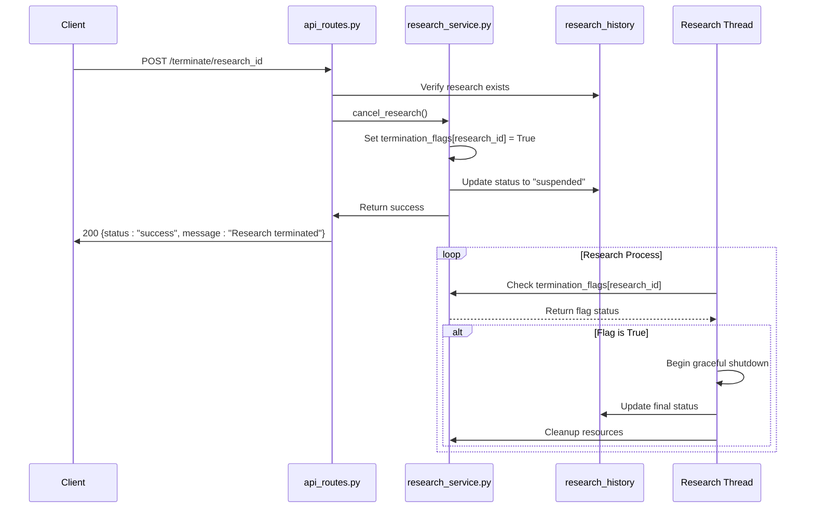
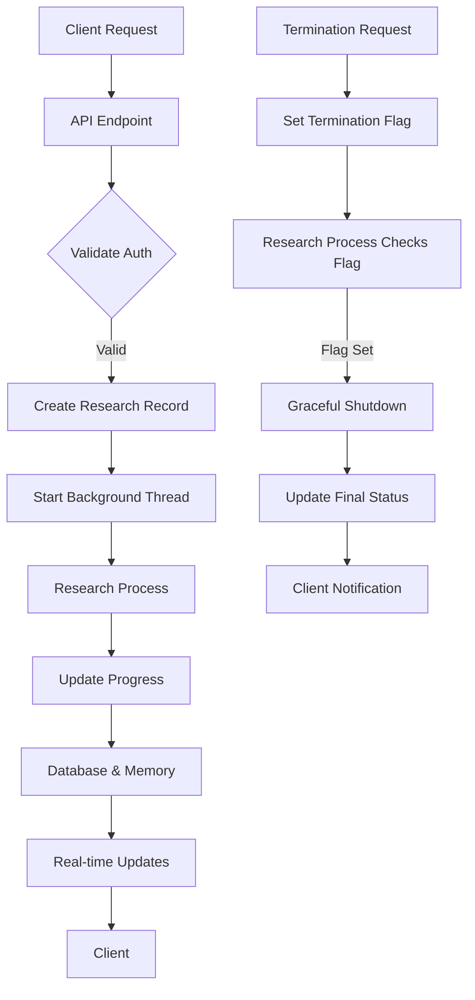

# Research Endpoints

<cite>
**Referenced Files in This Document**   
- [api_routes.py](file://src/local_deep_research/web/routes/api_routes.py)
- [research_routes.py](file://src/local_deep_research/web/routes/research_routes.py)
- [research_service.py](file://src/local_deep_research/web/services/research_service.py)
- [globals.py](file://src/local_deep_research/web/routes/globals.py)
- [research.py](file://src/local_deep_research/database/models/research.py)
- [simple_working_example.py](file://examples/api_usage/http/simple_working_example.py)
- [test_research_api_debug.py](file://tests/api_tests/test_research_api_debug.py)
</cite>

## Table of Contents
1. [Introduction](#introduction)
2. [Research Initiation](#research-initiation)
3. [Status Monitoring](#status-monitoring)
4. [Termination Process](#termination-process)
5. [Error Handling](#error-handling)
6. [Research Service Architecture](#research-service-architecture)
7. [Examples](#examples)
8. [Conclusion](#conclusion)

## Introduction

The local-deep-research system provides a comprehensive API for managing research lifecycle operations through three primary endpoints: `/start`, `/status/<research_id>`, and `/terminate/<research_id>`. These endpoints enable users to initiate, monitor, and terminate research processes programmatically. The system is designed with robust authentication, progress tracking, and error handling mechanisms to ensure reliable operation.

The research lifecycle is managed through a combination of database persistence, threading, and real-time progress updates. Each research process is assigned a unique identifier and tracked through various states from initiation to completion or termination. The API endpoints interact with an underlying research service that coordinates the complex workflow of information gathering, analysis, and report generation.

This documentation provides comprehensive details about each endpoint, including HTTP methods, request/response schemas, authentication requirements, and practical examples demonstrating their usage.

**Section sources**
- [api_routes.py](file://src/local_deep_research/web/routes/api_routes.py#L71-L206)
- [research_routes.py](file://src/local_deep_research/web/routes/research_routes.py#L129-L709)

## Research Initiation

The research initiation process begins with a POST request to the `/start` endpoint, which creates a new research process and returns a unique research identifier. This endpoint requires authentication and accepts various parameters to customize the research process.

### Endpoint Details
- **HTTP Method**: POST
- **Path**: `/start`
- **Authentication**: Required (session-based)
- **Content-Type**: application/json

### Request Parameters
The request body accepts the following parameters:

| Parameter | Type | Required | Description |
|---------|------|--------|-----------|
| `query` | string | Yes | The research query to investigate |
| `mode` | string | No | Research mode ("quick" or "detailed", default: "quick") |
| `model_provider` | string | No | LLM provider to use (e.g., "OLLAMA", "OPENAI_ENDPOINT") |
| `model` | string | No | Specific model to use for analysis |
| `search_engine` | string | No | Search engine to use (e.g., "searxng", "google_pse") |
| `iterations` | integer | No | Number of search iterations to perform |
| `questions_per_iteration` | integer | No | Number of questions to generate per iteration |
| `strategy` | string | No | Research strategy to employ |
| `custom_endpoint` | string | No | Custom endpoint URL for OpenAI-compatible providers |
| `metadata` | object | No | Additional metadata for the research process |

### Request Schema
```json
{
  "query": "What is machine learning?",
  "mode": "quick",
  "model_provider": "OLLAMA",
  "model": "gemma3:12b",
  "search_engine": "searxng",
  "iterations": 5,
  "questions_per_iteration": 5,
  "strategy": "source-based"
}
```

### Response Schema
Upon successful initiation, the endpoint returns a 200 status code with the following response:

```json
{
  "status": "success",
  "message": "Research started successfully",
  "research_id": "a1b2c3d4-e5f6-7890-g1h2-i3j4k5l6m7n8"
}
```

If the system has reached its concurrent research limit, the research may be queued:

```json
{
  "status": "queued",
  "research_id": "a1b2c3d4-e5f6-7890-g1h2-i3j4k5l6m7n8",
  "queue_position": 1,
  "message": "Your research has been queued. Position in queue: 1"
}
```

### Implementation Details
The initiation process creates a record in the `research_history` database table with the initial status set to "in_progress" or "queued" depending on system capacity. The system captures a complete snapshot of the current settings at the time of initiation to ensure consistency throughout the research process.

The research process is executed in a background thread, allowing the API to return immediately while the research continues asynchronously. The thread reference is stored in the `active_research` dictionary for monitoring and control purposes.



**Diagram sources**
- [api_routes.py](file://src/local_deep_research/web/routes/api_routes.py#L71-L129)
- [research_service.py](file://src/local_deep_research/web/services/research_service.py#L244-L295)
- [research.py](file://src/local_deep_research/database/models/research.py#L214-L248)

**Section sources**
- [api_routes.py](file://src/local_deep_research/web/routes/api_routes.py#L71-L129)
- [research_routes.py](file://src/local_deep_research/web/routes/research_routes.py#L129-L617)
- [research_service.py](file://src/local_deep_research/web/services/research_service.py#L244-L295)

## Status Monitoring

The status monitoring endpoint allows clients to check the current state and progress of an ongoing research process. This enables real-time tracking of research execution and informed decision-making about continuation or termination.

### Endpoint Details
- **HTTP Method**: GET
- **Path**: `/status/<research_id>`
- **Authentication**: Required (session-based)

### Request Parameters
The endpoint accepts the research identifier as a path parameter:
- `research_id`: UUID string identifying the research process

### Response Schema
The endpoint returns a JSON object containing the current status of the research:

```json
{
  "status": "in_progress",
  "progress": 45,
  "completed_at": null,
  "report_path": null,
  "metadata": {
    "submission": {
      "model_provider": "OLLAMA",
      "model": "gemma3:12b",
      "search_engine": "searxng"
    },
    "system": {
      "timestamp": "2024-01-15T10:30:00.000000+00:00",
      "user": "testuser"
    }
  }
}
```

When the research is complete, the response includes the completion timestamp and report path:

```json
{
  "status": "completed",
  "progress": 100,
  "completed_at": "2024-01-15T11:45:30.000000+00:00",
  "report_path": "/research_outputs/research_report_abc123_1705314330.md",
  "metadata": { ... }
}
```

For non-existent research IDs, the endpoint returns a 404 status code:

```json
{
  "error": "Research not found"
}
```

### Progress Tracking
The system maintains progress through multiple mechanisms:
1. **Database Storage**: The `progress` field in the `research_history` table stores the current percentage
2. **In-Memory Tracking**: The `active_research` dictionary maintains real-time progress updates
3. **Progress Log**: A JSON array in the `progress_log` field records milestone events with timestamps

The progress percentage is calculated based on the research phase and iteration count, with different weightings for search, analysis, and report generation phases.



**Diagram sources**
- [api_routes.py](file://src/local_deep_research/web/routes/api_routes.py#L135-L172)
- [research.py](file://src/local_deep_research/database/models/research.py#L244-L245)
- [globals.py](file://src/local_deep_research/web/routes/globals.py#L6)

**Section sources**
- [api_routes.py](file://src/local_deep_research/web/routes/api_routes.py#L135-L172)
- [research_service.py](file://src/local_deep_research/web/services/research_service.py#L464-L563)

## Termination Process

The termination endpoint allows users to stop an ongoing research process before completion. This is useful for canceling research that is taking too long, consuming excessive resources, or no longer needed.

### Endpoint Details
- **HTTP Method**: POST
- **Path**: `/terminate/<research_id>`
- **Authentication**: Required (session-based)

### Request Parameters
The endpoint accepts the research identifier as a path parameter:
- `research_id`: UUID string identifying the research process to terminate

### Response Schema
Upon successful termination, the endpoint returns:

```json
{
  "status": "success",
  "message": "Research terminated",
  "result": true
}
```

If the research has already completed or was not found:

```json
{
  "status": "success",
  "message": "Research already completed",
  "result": false
}
```

### Termination Workflow
The termination process follows these steps:

1. **Validation**: Verify the research exists and is currently in progress
2. **Flag Setting**: Set a termination flag in the `termination_flags` dictionary
3. **Database Update**: Change the research status to "suspended"
4. **Thread Communication**: The research process periodically checks the termination flag and gracefully exits when set
5. **Resource Cleanup**: Release any allocated resources and database connections

The system uses a cooperative termination model where the research thread checks the termination flag at regular intervals and terminates itself when the flag is set, ensuring data consistency and proper cleanup.



**Diagram sources**
- [api_routes.py](file://src/local_deep_research/web/routes/api_routes.py#L173-L206)
- [research_routes.py](file://src/local_deep_research/web/routes/research_routes.py#L709-L789)
- [research_service.py](file://src/local_deep_research/web/services/research_service.py#L1714-L1839)
- [globals.py](file://src/local_deep_research/web/routes/globals.py#L9)

**Section sources**
- [api_routes.py](file://src/local_deep_research/web/routes/api_routes.py#L173-L206)
- [research_routes.py](file://src/local_deep_research/web/routes/research_routes.py#L709-L789)
- [research_service.py](file://src/local_deep_research/web/services/research_service.py#L1714-L1839)

## Error Handling

The research endpoints implement comprehensive error handling to provide meaningful feedback for various failure scenarios. The system distinguishes between client errors, server errors, and authentication issues.

### Common Error Responses

#### Authentication Failure (401)
When a request is made without proper authentication:

```json
{
  "error": "Authentication required"
}
```

#### Invalid Query (400)
When the research query is missing or empty:

```json
{
  "status": "error",
  "message": "Query is required"
}
```

#### Non-existent Research (404)
When checking status or terminating a research ID that doesn't exist:

```json
{
  "error": "Research not found"
}
```

#### Server Error (500)
For internal server errors during research initiation:

```json
{
  "status": "error",
  "message": "Failed to start research"
}
```

### Error Categories

**Authentication Errors**
- Occur when session is invalid or expired
- Handled by the `login_required` decorator
- Return 401 status with JSON error for API routes

**Validation Errors**
- Missing required parameters (e.g., empty query)
- Invalid parameter values
- Return 400 status with descriptive error message

**Resource Errors**
- Database connection failures
- Model not available
- Search engine inaccessible
- Return 500 status with generic error to avoid information disclosure

**Concurrency Errors**
- Exceeding maximum concurrent research limit
- Handled by queuing mechanism
- Return "queued" status instead of error

The system logs detailed error information server-side while returning user-friendly messages to clients to maintain security and usability.

**Section sources**
- [api_routes.py](file://src/local_deep_research/web/routes/api_routes.py#L82-L83)
- [api_routes.py](file://src/local_deep_research/web/routes/api_routes.py#L152-L153)
- [api_routes.py](file://src/local_deep_research/web/routes/api_routes.py#L129-L130)
- [decorators.py](file://src/local_deep_research/web/auth/decorators.py#L13-L49)

## Research Service Architecture

The research lifecycle endpoints are supported by a sophisticated backend architecture that manages threading, progress tracking, and resource coordination. The system is designed for reliability, scalability, and real-time monitoring.

### Core Components

**Global State Management**
The system maintains global state in `globals.py` with three key dictionaries:
- `active_research`: Tracks currently running research processes
- `termination_flags`: Controls graceful termination of research threads
- `socket_subscriptions`: Manages real-time progress updates

**Database Models**
The `ResearchHistory` model in `research.py` stores persistent research data:
- `id`: UUID primary key
- `query`: Research query text
- `mode`: Research mode (quick/detailed)
- `status`: Current status (in_progress, completed, suspended, error)
- `progress`: Percentage completion (0-100)
- `created_at`: Timestamp of research initiation
- `completed_at`: Timestamp of research completion
- `research_meta`: JSON field storing configuration snapshot
- `progress_log`: JSON array of progress milestones

**Service Layer**
The `research_service.py` module provides the core functionality:
- `start_research_process()`: Creates and starts research threads
- `run_research_process()`: Executes the research workflow
- `cancel_research()`: Handles research termination
- `save_research_strategy()`: Persists research strategy selection

### Threading Model
The system uses Python threading to execute research processes asynchronously:
- Each research runs in a separate daemon thread
- Thread references are stored in `active_research` dictionary
- Progress updates are queued for main thread processing
- Termination is cooperative, with threads checking flags periodically

### Data Flow


The architecture ensures that research processes continue even if the client disconnects, while providing mechanisms for monitoring and control through the API endpoints.

**Diagram sources**
- [globals.py](file://src/local_deep_research/web/routes/globals.py#L5-L9)
- [research.py](file://src/local_deep_research/database/models/research.py#L214-L248)
- [research_service.py](file://src/local_deep_research/web/services/research_service.py#L244-L295)

**Section sources**
- [globals.py](file://src/local_deep_research/web/routes/globals.py#L5-L9)
- [research.py](file://src/local_deep_research/database/models/research.py#L214-L248)
- [research_service.py](file://src/local_deep_research/web/services/research_service.py#L244-L295)

## Examples

### Successful Research Initiation
```python
import requests

# Start a new research process
response = requests.post(
    "http://localhost:5000/start",
    json={
        "query": "What are the latest advancements in quantum computing?",
        "mode": "detailed",
        "model": "gemma3:12b",
        "search_engine": "searxng",
        "iterations": 8
    },
    headers={"X-CSRF-Token": "your-csrf-token"},
    cookies={"session": "your-session-cookie"}
)

if response.status_code == 200:
    result = response.json()
    research_id = result["research_id"]
    print(f"Research started with ID: {research_id}")
```

### Status Checking During Processing
```python
import requests
import time

# Poll for research status
while True:
    response = requests.get(
        f"http://localhost:5000/status/{research_id}",
        cookies={"session": "your-session-cookie"}
    )
    
    if response.status_code == 200:
        status = response.json()
        print(f"Progress: {status['progress']}% - Status: {status['status']}")
        
        if status["status"] == "completed":
            print(f"Report available at: {status['report_path']}")
            break
        elif status["status"] == "suspended":
            print("Research was terminated")
            break
    
    time.sleep(5)  # Wait 5 seconds before next check
```

### Termination Request
```python
import requests

# Terminate a running research process
response = requests.post(
    f"http://localhost:5000/terminate/{research_id}",
    headers={"X-CSRF-Token": "your-csrf-token"},
    cookies={"session": "your-session-cookie"}
)

if response.status_code == 200:
    result = response.json()
    print(result["message"])
```

### Error Handling Example
```python
import requests

def start_research(query):
    try:
        response = requests.post(
            "http://localhost:5000/start",
            json={"query": query},
            timeout=30
        )
        
        if response.status_code == 200:
            return response.json()
        elif response.status_code == 400:
            error = response.json()
            raise ValueError(f"Invalid request: {error['message']}")
        elif response.status_code == 401:
            raise PermissionError("Authentication required")
        elif response.status_code == 500:
            raise RuntimeError("Server error - check system status")
        else:
            raise RuntimeError(f"Unexpected status: {response.status_code}")
            
    except requests.exceptions.ConnectionError:
        raise RuntimeError("Cannot connect to research server")
    except requests.exceptions.Timeout:
        raise RuntimeError("Request timed out")

# Usage
try:
    result = start_research("What is artificial intelligence?")
    print(f"Research ID: {result['research_id']}")
except (ValueError, PermissionError, RuntimeError) as e:
    print(f"Error: {e}")
```

**Section sources**
- [simple_working_example.py](file://examples/api_usage/http/simple_working_example.py#L149-L204)
- [test_research_api_debug.py](file://tests/api_tests/test_research_api_debug.py#L255-L326)

## Conclusion

The research lifecycle endpoints in the local-deep-research system provide a robust API for managing research processes from initiation to completion. The `/start`, `/status/<research_id>`, and `/terminate/<research_id>` endpoints offer comprehensive control over research operations with proper authentication, error handling, and progress tracking.

Key features of the implementation include:
- **Authentication**: Session-based authentication ensures only authorized users can initiate and control research
- **Asynchronous Processing**: Research runs in background threads, allowing immediate response to initiation requests
- **Progress Monitoring**: Real-time progress updates through database persistence and in-memory tracking
- **Graceful Termination**: Cooperative termination model that ensures data consistency
- **Comprehensive Error Handling**: Meaningful error responses for various failure scenarios
- **Configuration Flexibility**: Support for various models, search engines, and research strategies

The architecture effectively separates concerns between API endpoints, service logic, and data persistence, creating a maintainable and scalable system. The use of global state management, threading, and real-time updates provides a responsive user experience while ensuring reliability and data integrity.

These endpoints form the foundation for programmatic interaction with the research system, enabling integration with other tools and automation of research workflows.