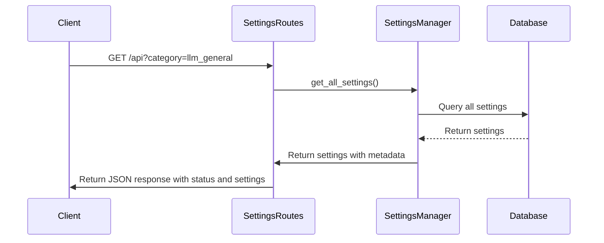
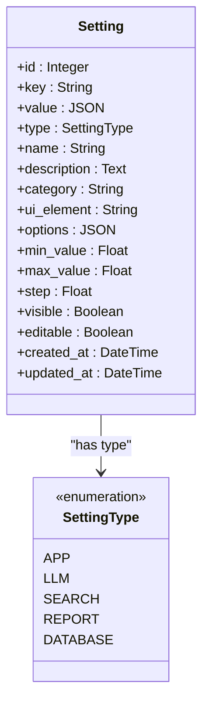
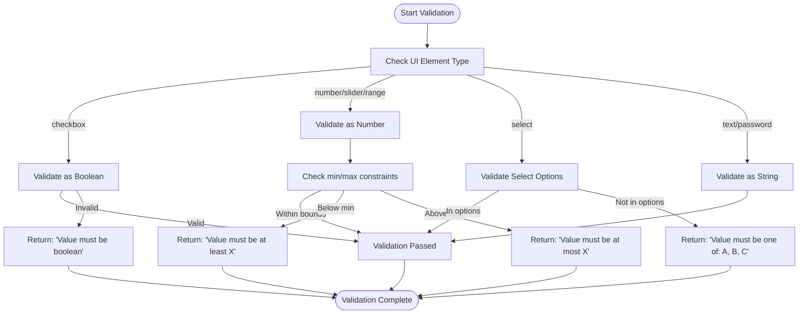
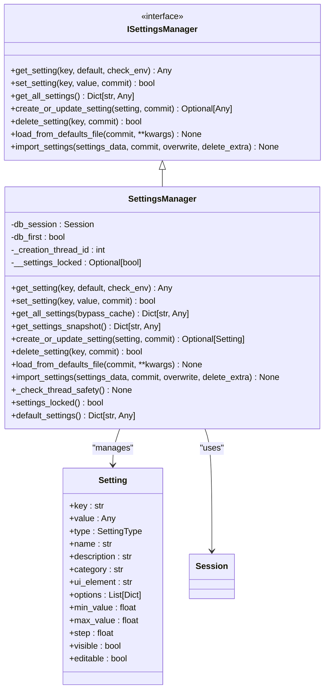
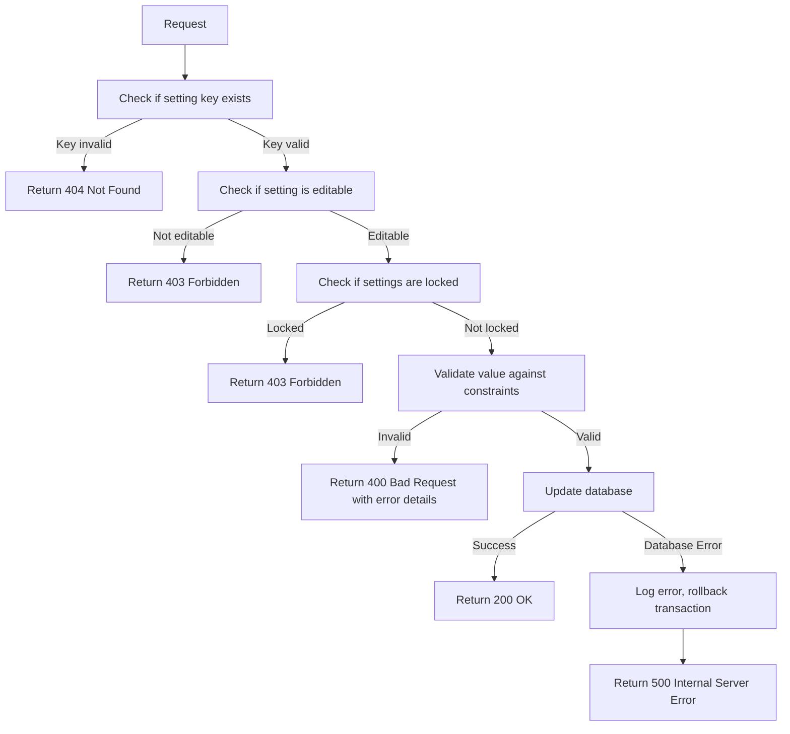

# Settings Management

<cite>
**Referenced Files in This Document**   
- [settings_routes.py](file://src/local_deep_research/web/routes/settings_routes.py)
- [manager.py](file://src/local_deep_research/settings/manager.py)
- [settings.py](file://src/local_deep_research/database/models/settings.py)
- [settings.py](file://src/local_deep_research/web/models/settings.py)
- [settings_service.py](file://src/local_deep_research/web/services/settings_service.py)
</cite>

## Table of Contents
1. [Introduction](#introduction)
2. [API Endpoints](#api-endpoints)
3. [Settings Data Model](#settings-data-model)
4. [Validation Process](#validation-process)
5. [Checkbox Value Handling](#checkbox-value-handling)
6. [SettingsManager Service](#settingsmanager-service)
7. [Error Handling](#error-handling)
8. [Usage Examples](#usage-examples)
9. [Conclusion](#conclusion)

## Introduction
The settings management system provides a comprehensive API for managing application configuration through REST endpoints. The system supports retrieving all settings, getting and updating individual settings, and performing bulk updates. Settings are stored in a database with support for type conversion, validation, and environment variable overrides. The API is designed to work seamlessly with both AJAX/JSON submissions and traditional form POSTs, with special handling for checkbox values in different submission modes.

**Section sources**
- [settings_routes.py](file://src/local_deep_research/web/routes/settings_routes.py#L1-L50)

## API Endpoints

### GET /api - Retrieve All Settings
The `/api` endpoint returns all settings in the system. This endpoint supports optional filtering by category through the `category` query parameter. The response includes all setting metadata including key, value, type, category, UI element, and constraints.



**Diagram sources**
- [settings_routes.py](file://src/local_deep_research/web/routes/settings_routes.py#L692-L730)

### GET /api/<key> - Retrieve Individual Setting
The `/api/<key>` endpoint retrieves a specific setting by its key. The response includes the complete setting object with all metadata. If the setting does not exist, a 404 error is returned.

### PUT /api/<key> - Update Individual Setting
The `/api/<key>` endpoint with PUT method updates a specific setting. The request body must be JSON containing the new value. The system validates the value against the setting's constraints before updating. If the setting does not exist, it is created with default metadata.

### POST /api/import - Import Default Settings
The `/api/import` endpoint imports settings from the default settings files, resetting the configuration to default values. This is typically used when initializing a new installation or resetting configuration.

**Section sources**
- [settings_routes.py](file://src/local_deep_research/web/routes/settings_routes.py#L692-L951)

## Settings Data Model

The settings data model defines the structure for storing and managing application settings. Each setting has the following properties:

| Property | Type | Description | Example |
|--------|------|-------------|---------|
| **key** | string | Unique identifier for the setting, using dot notation for hierarchy | "llm.temperature" |
| **value** | any | The current value of the setting, stored as JSON | 0.7 |
| **type** | SettingType | Categorization of the setting | "LLM", "SEARCH", "APP" |
| **name** | string | Human-readable name for display | "Temperature" |
| **description** | string | Detailed description of the setting's purpose | "Controls the randomness of the LLM output" |
| **category** | string | UI grouping category | "llm_parameters" |
| **ui_element** | string | Frontend UI component type | "number", "checkbox", "select" |
| **options** | array | Available options for select elements | [{"value": "gpt-3.5-turbo", "label": "GPT-3.5"}] |
| **min_value** | number | Minimum allowed value for numeric inputs | 0.0 |
| **max_value** | number | Maximum allowed value for numeric inputs | 1.0 |
| **step** | number | Increment step for sliders | 0.1 |
| **visible** | boolean | Whether the setting is visible in the UI | true |
| **editable** | boolean | Whether the setting can be modified | true |

The SettingType enum defines the following categories:
- **APP**: Application-wide settings
- **LLM**: Large Language Model configuration
- **SEARCH**: Search engine and parameters
- **REPORT**: Report generation settings
- **DATABASE**: Database configuration



**Diagram sources**
- [settings.py](file://src/local_deep_research/database/models/settings.py#L77-L109)
- [settings.py](file://src/local_deep_research/web/models/settings.py#L7-L96)

## Validation Process

The system implements comprehensive validation for setting values based on their type and constraints. Validation occurs before any setting update and ensures data integrity.

### Type-Based Validation
Different setting types have specific validation rules:

**Boolean Validation (checkbox)**
- Values are converted using HTML checkbox semantics
- Any non-empty string except explicit false values ("off", "false", "0", "") is considered true
- This ensures consistent behavior with HTML form submissions

**Numeric Validation (number, slider, range)**
- Values must be convertible to numbers
- Must satisfy min_value and max_value constraints if defined
- Step values are enforced for slider inputs

**String Validation (text, password, select)**
- For select elements, values must be in the defined options array
- Dynamic dropdowns (like LLM providers) are excluded from options validation
- String length constraints are not currently enforced



**Diagram sources**
- [settings_routes.py](file://src/local_deep_research/web/routes/settings_routes.py#L180-L232)
- [settings_service.py](file://src/local_deep_research/web/services/settings_service.py#L94-L111)

## Checkbox Value Handling

The system implements a sophisticated approach to handle checkbox values in both AJAX and traditional form submission modes, ensuring consistent behavior across different client environments.

### AJAX/JSON Submission Mode
In the primary AJAX mode, JavaScript intercepts form submission and reads checkbox states directly from the DOM using the `checked` property. This provides the most reliable method for determining checkbox state:

```javascript
// In settings.js, checkbox states are read directly
const value = document.getElementById('setting.key').checked;
```

The data is sent as JSON with boolean values:
```json
{"llm.temperature_enabled": true, "app.dark_mode": false}
```

### Traditional POST Submission Mode
For accessibility and JavaScript-disabled environments, the system supports traditional form POST submission with a hidden input fallback pattern:

```html
<!-- Checkbox input -->
<input type="checkbox" id="setting.key" name="setting.key" value="on">

<!-- Hidden fallback input -->
<input type="hidden" id="setting.key_hidden" name="setting.key" value="false" disabled>
```

The JavaScript handler manages the disabled state of the hidden input:
- When checkbox is checked: hidden input is disabled, checkbox value is submitted
- When checkbox is unchecked: hidden input is enabled, "false" value is submitted

This ensures that unchecked checkboxes are properly captured in form submissions, working around the HTML limitation where unchecked checkboxes do not submit any value.

```mermaid
sequenceDiagram
participant User
participant DOM
participant JavaScript
participant Server
User->>DOM : Checks checkbox
DOM->>JavaScript : onchange event
JavaScript->>DOM : Disable hidden fallback input
JavaScript->>User : Visual feedback
User->>DOM : Unchecks checkbox
DOM->>JavaScript : onchange event
JavaScript->>DOM : Enable hidden fallback input
JavaScript->>User : Visual feedback
User->>Server : Submit form
Server->>Server : Process form data
alt AJAX Mode
Server->>Server : Parse JSON, use boolean values directly
else Traditional POST Mode
Server->>Server : Check for checkbox value presence
Server->>Server : If present, value is true; if absent, value from hidden input
end
Server->>User : Response
```

**Diagram sources**
- [settings_routes.py](file://src/local_deep_research/web/routes/settings_routes.py#L6-L38)
- [settings_routes.py](file://src/local_deep_research/web/routes/settings_routes.py#L609-L689)

## SettingsManager Service

The SettingsManager service is the core component responsible for handling all database operations and type conversion for settings. It serves as an abstraction layer between the API endpoints and the database, providing a consistent interface for settings management.

### Architecture and Responsibilities
The SettingsManager implements the ISettingsManager interface and provides the following key responsibilities:

- **Database Operations**: CRUD operations for settings with proper transaction handling
- **Type Conversion**: Converting values to appropriate types based on UI element
- **Environment Overrides**: Checking environment variables for settings overrides
- **Thread Safety**: Ensuring instances are used in the same thread they were created
- **Validation**: Enforcing setting constraints and validation rules
- **Event Emission**: Broadcasting settings change events via WebSocket

### Type Conversion Logic
The system uses a mapping between UI elements and Python types to ensure proper type conversion:

```python
_UI_ELEMENT_TO_SETTING_TYPE = {
    "text": str,
    "json": lambda x: x,  # No conversion needed, SQLAlchemy handles JSON
    "password": str,
    "select": str,
    "number": _parse_number,  # Returns int if whole number, otherwise float
    "range": _parse_number,  # Same behavior as number
    "checkbox": parse_boolean,  # Special HTML checkbox semantics
}
```

The `parse_boolean` function implements HTML checkbox semantics where any present value (except explicit false values) indicates a checked state:

```python
def parse_boolean(value: Any) -> bool:
    FALSY_VALUES = ("off", "false", "0", "", "no")
    
    if isinstance(value, bool):
        return value
    if value is None:
        return False
    if isinstance(value, str):
        value_lower = value.lower().strip()
        if value_lower in FALSY_VALUES:
            return False
        return True  # Any other non-empty string = True (checkbox was checked)
    return bool(value)
```



**Diagram sources**
- [manager.py](file://src/local_deep_research/settings/manager.py#L197-L800)
- [base.py](file://src/local_deep_research/settings/base.py#L12-L118)

## Error Handling

The system implements comprehensive error handling for various failure scenarios, providing meaningful error messages and maintaining system stability.

### Invalid Setting Keys
When attempting to access or update a non-existent setting key:
- GET requests return the provided default value
- PUT requests create a new setting with default metadata if the key is valid
- DELETE requests return success if the setting doesn't exist (idempotent)

### Validation Failures
When a setting value fails validation:
- The system returns a 400 Bad Request response
- The response includes detailed error information about which setting failed and why
- The original setting value remains unchanged

### Database Errors
For database connectivity or operation failures:
- The system catches SQLAlchemyError exceptions
- Logs detailed error information for debugging
- Returns a 500 Internal Server Error response
- Rolls back transactions to maintain data consistency

### Settings Locking
When settings are locked (app.lock_settings = true):
- Any attempt to modify settings returns a 403 Forbidden response
- The system logs an error message indicating settings are locked
- Read operations continue to function normally



**Section sources**
- [manager.py](file://src/local_deep_research/settings/manager.py#L389-L464)
- [settings_routes.py](file://src/local_deep_research/web/routes/settings_routes.py#L773-L898)

## Usage Examples

### Retrieving Settings by Category
To retrieve all settings in a specific category:

```bash
GET /api?category=llm_parameters
```

Response:
```json
{
  "status": "success",
  "settings": {
    "llm.temperature": {
      "value": 0.7,
      "type": "LLM",
      "name": "Temperature",
      "description": "Controls the randomness of the LLM output",
      "category": "llm_parameters",
      "ui_element": "number",
      "min_value": 0.0,
      "max_value": 1.0,
      "step": 0.1,
      "visible": true,
      "editable": true
    },
    "llm.max_tokens": {
      "value": 2000,
      "type": "LLM",
      "name": "Max Tokens",
      "description": "Maximum number of tokens in the response",
      "category": "llm_parameters",
      "ui_element": "number",
      "min_value": 1,
      "max_value": 4096,
      "step": 1,
      "visible": true,
      "editable": true
    }
  }
}
```

### Updating a Single Setting Value
To update an individual setting:

```bash
PUT /api/llm.temperature
Content-Type: application/json

{
  "value": 0.5
}
```

Response on success:
```json
{
  "message": "Setting llm.temperature updated successfully"
}
```

Response on validation failure:
```json
{
  "error": "Value must be at least 0.0"
}
```

### Performing Bulk Updates
To update multiple settings at once:

```bash
POST /api/save_all_settings
Content-Type: application/json

{
  "llm.temperature": 0.3,
  "llm.max_tokens": 4000,
  "search.max_results": 20,
  "app.dark_mode": true
}
```

Response on success:
```json
{
  "status": "success",
  "message": "Settings saved successfully (4 updated, 0 created)",
  "updated": ["llm.temperature", "llm.max_tokens", "search.max_results", "app.dark_mode"],
  "created": [],
  "settings": { /* all settings */ }
}
```

Response with validation errors:
```json
{
  "status": "error",
  "message": "Validation errors",
  "errors": [
    {
      "key": "llm.temperature",
      "name": "Temperature",
      "error": "Value must be at least 0.0"
    }
  ]
}
```

**Section sources**
- [settings_routes.py](file://src/local_deep_research/web/routes/settings_routes.py#L242-L577)

## Conclusion
The settings management API provides a robust and flexible system for managing application configuration. With support for comprehensive CRUD operations, type validation, and environment variable overrides, the system ensures data integrity while providing a user-friendly interface. The dual-mode approach to checkbox handling ensures accessibility across different client environments, while the SettingsManager service provides a clean abstraction layer between the API and database. The comprehensive error handling and validation system helps prevent configuration errors and provides meaningful feedback to users and developers alike.