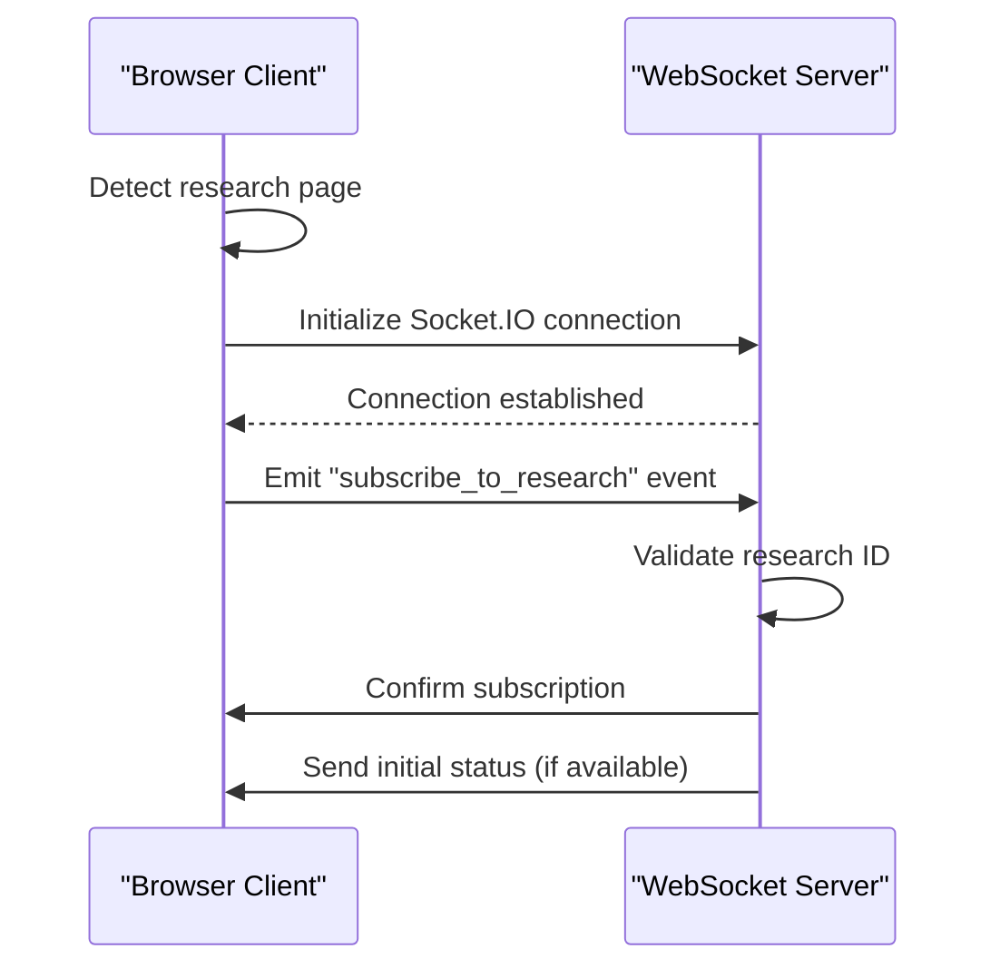
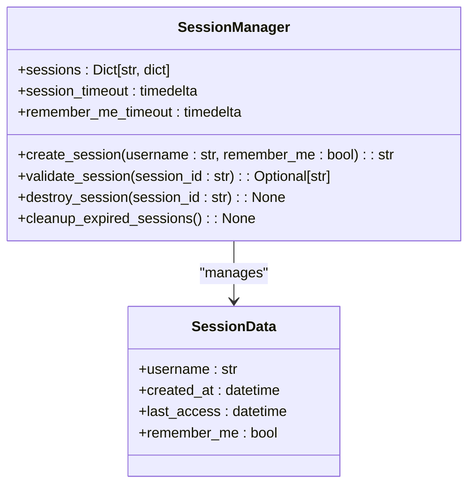
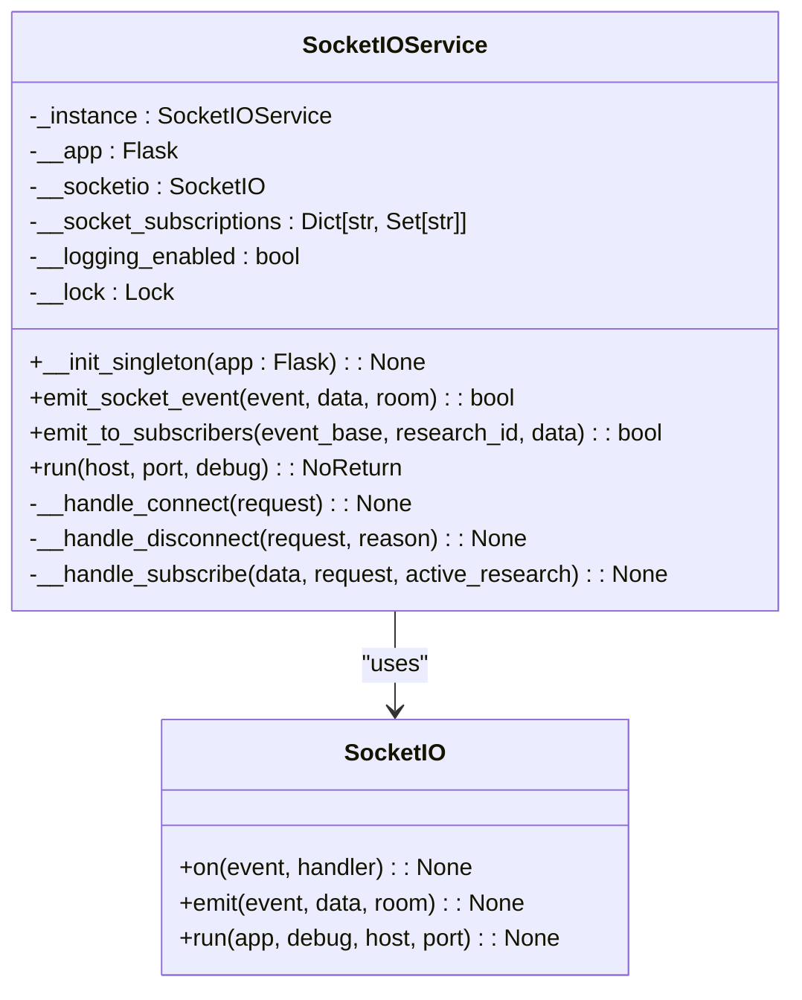
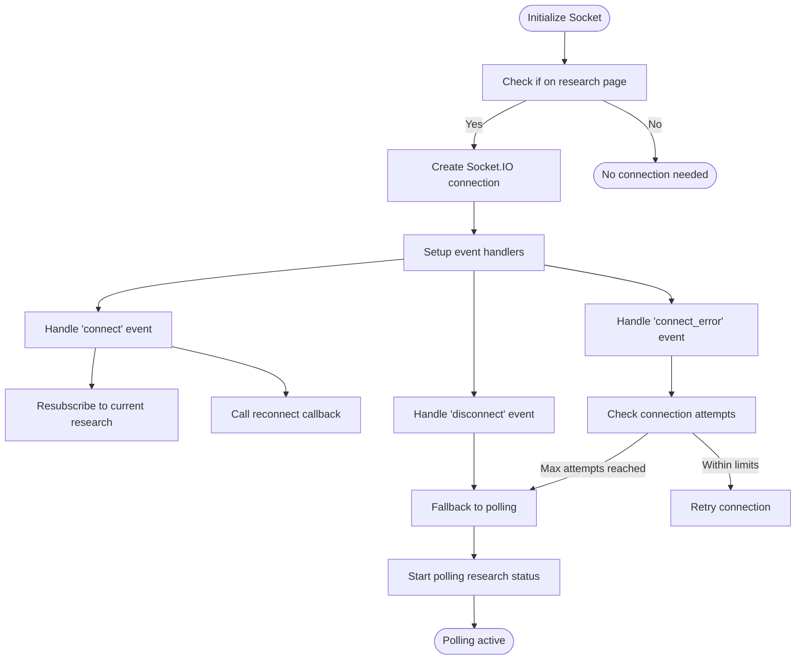
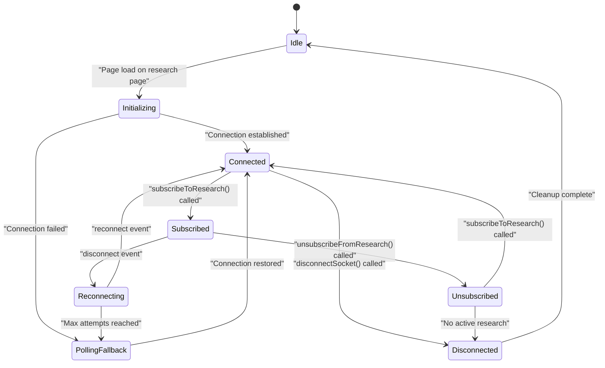
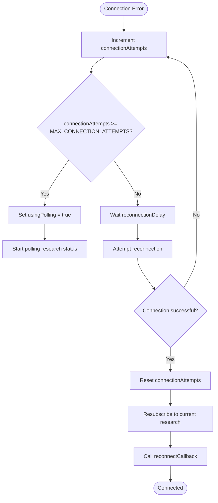

# Connection Management

<cite>
**Referenced Files in This Document**   
- [socket_service.py](file://src/local_deep_research/web/services/socket_service.py)
- [socket.js](file://src/local_deep_research/web/static/js/services/socket.js)
- [app.py](file://src/local_deep_research/web/app.py)
- [session_manager.py](file://src/local_deep_research/web/auth/session_manager.py)
- [middleware_optimizer.py](file://src/local_deep_research/web/auth/middleware_optimizer.py)
- [server_config.py](file://src/local_deep_research/web/server_config.py)
</cite>

## Table of Contents
1. [Introduction](#introduction)
2. [Connection Establishment Process](#connection-establishment-process)
3. [Authentication and Session Handling](#authentication-and-session-handling)
4. [Server-Side Connection Management](#server-side-connection-management)
5. [Client-Side Implementation](#client-side-implementation)
6. [Connection Lifecycle](#connection-lifecycle)
7. [Reconnection Strategies](#reconnection-strategies)
8. [Security Considerations](#security-considerations)
9. [Troubleshooting Common Issues](#troubleshooting-common-issues)
10. [Configuration Options](#configuration-options)

## Introduction
The local-deep-research system implements WebSocket-based real-time communication using Socket.IO to provide live updates during research processes. This documentation details the comprehensive connection management system, covering the full lifecycle from client initialization to disconnection, authentication requirements, server-side implementation, and security considerations. The system is designed to maintain persistent connections for research progress updates while providing robust fallback mechanisms and security protections.

**Section sources**
- [socket_service.py](file://src/local_deep_research/web/services/socket_service.py#L1-L263)
- [socket.js](file://src/local_deep_research/web/static/js/services/socket.js#L1-L959)

## Connection Establishment Process
The WebSocket connection establishment process in the local-deep-research system follows a structured approach to ensure reliable real-time communication. The process begins with client-side initialization, where the Socket.IO connection is created only on relevant pages such as research, progress, and benchmark pages. The client automatically detects the current page path and initializes the connection only when necessary, optimizing resource usage.

The connection configuration includes specific parameters designed for reliability: reconnection is enabled with a 1-second delay between attempts, allowing up to 5 reconnection attempts. Notably, the system uses polling transport exclusively (`transports: ['polling']`) to avoid WebSocket compatibility issues across different network environments. This approach ensures broader compatibility while maintaining real-time functionality.

On the server side, the Socket.IO service is initialized as a singleton within the Flask application, ensuring a single instance manages all connections. The server configuration includes a ping timeout of 20 seconds and a ping interval of 5 seconds, providing regular heartbeat checks to maintain connection health. The CORS policy allows connections from any origin (`cors_allowed_origins="*"`), facilitating integration across different deployment scenarios.

**Diagram sources**
- [socket.js](file://src/local_deep_research/web/static/js/services/socket.js#L22-L62)
- [socket_service.py](file://src/local_deep_research/web/services/socket_service.py#L47-L56)

**Section sources**
- [socket.js](file://src/local_deep_research/web/static/js/services/socket.js#L22-L62)
- [socket_service.py](file://src/local_deep_research/web/services/socket_service.py#L47-L56)

## Authentication and Session Handling
The local-deep-research system implements a robust authentication and session management system to secure WebSocket connections. User sessions are managed through the SessionManager class, which creates cryptographically secure session IDs using `secrets.token_urlsafe(32)`. Each session is associated with a username and includes metadata such as creation time, last access time, and "remember me" preferences.

Session validation occurs on each request, with timeout policies that differ based on the "remember me" setting: regular sessions expire after 2 hours of inactivity, while "remember me" sessions last for 30 days. The system automatically cleans up expired sessions through periodic checks, ensuring that inactive sessions do not accumulate and consume server resources.

For WebSocket connections, the system integrates with the authentication framework to ensure that only authenticated users can establish connections and subscribe to research updates. The middleware optimizer skips database middleware checks for Socket.IO endpoints (`/socket.io/`), optimizing performance while maintaining security through the session validation process. This approach balances security requirements with performance considerations, allowing efficient handling of real-time communication.

**Diagram sources**
- [session_manager.py](file://src/local_deep_research/web/auth/session_manager.py#L15-L118)
- [middleware_optimizer.py](file://src/local_deep_research/web/auth/middleware_optimizer.py#L8-L35)

**Section sources**
- [session_manager.py](file://src/local_deep_research/web/auth/session_manager.py#L15-L118)
- [middleware_optimizer.py](file://src/local_deep_research/web/auth/middleware_optimizer.py#L8-L35)

## Server-Side Connection Management
The server-side implementation of WebSocket connections in the local-deep-research system is centered around the SocketIOService class, which follows the singleton pattern to ensure a single instance manages all connections throughout the application lifecycle. This service is initialized during application startup and binds to the Flask application instance, integrating seamlessly with the existing web framework.

The SocketIOService handles several key events: connection, disconnection, and subscription to research updates. When a client connects, the service logs the connection and tracks the client's session ID. Upon disconnection, the service cleans up any subscriptions associated with the client, preventing memory leaks and ensuring accurate subscription tracking. The subscription mechanism allows clients to subscribe to specific research processes by research ID, enabling targeted updates for ongoing research tasks.

The service maintains a dictionary of socket subscriptions, mapping research IDs to sets of client session IDs. This structure allows efficient broadcasting of updates to all subscribers of a particular research process. The implementation includes thread safety through a Lock object, protecting shared state during concurrent access. Error handling is comprehensive, with dedicated handlers for socket errors and unhandled exceptions, ensuring that connection issues do not crash the server.

**Diagram sources**
- [socket_service.py](file://src/local_deep_research/web/services/socket_service.py#L11-L263)

**Section sources**
- [socket_service.py](file://src/local_deep_research/web/services/socket_service.py#L11-L263)

## Client-Side Implementation
The client-side implementation of WebSocket connections in the local-deep-research system is handled by the socket.js service, which provides a comprehensive API for managing real-time communication. The service is designed to be resilient, with automatic fallback mechanisms that switch to polling when WebSocket connections fail.

The client implementation includes several key features: connection state tracking, automatic reconnection, subscription management, and event handling. The service intelligently initializes connections only on relevant pages (research, progress, and benchmark pages), conserving resources on other pages. When a connection is established, the client automatically resubscribes to the current research process, ensuring continuity after reconnection.

Event handling is flexible, allowing multiple callbacks to be registered for research progress updates. The service processes various types of progress updates, including search engine selection events and synthesis errors, providing appropriate user feedback through notifications and log entries. For synthesis errors, the system displays user-friendly error messages based on the error type (timeout, token limit, connection issues, rate limiting), helping users understand and potentially resolve the issue.

The client also implements message deduplication to prevent redundant log entries, using a Map to track recently processed messages and filtering out duplicates within a 10-second window. This ensures a clean user experience while maintaining comprehensive logging of research progress.

**Diagram sources**
- [socket.js](file://src/local_deep_research/web/static/js/services/socket.js#L6-L800)

**Section sources**
- [socket.js](file://src/local_deep_research/web/static/js/services/socket.js#L6-L800)

## Connection Lifecycle
The connection lifecycle in the local-deep-research system follows a well-defined sequence from initialization to termination. The lifecycle begins with client initialization, where the socket service checks if the current page requires real-time updates. If on a research, progress, or benchmark page, the service initializes the Socket.IO connection with predefined parameters optimized for reliability.

Upon successful connection, the client enters the active state, where it can subscribe to research updates by research ID. The subscription process involves emitting a "subscribe_to_research" event with the research ID, which the server validates and acknowledges. During the active phase, the client receives various progress updates, including research progress, search engine selections, and synthesis errors.

The lifecycle includes several transition points: temporary disconnections trigger automatic reconnection attempts, while permanent disconnections (such as page navigation away from research pages) result in cleanup of subscriptions and intervals. The service automatically handles reconnection by resubscribing to the current research process, ensuring continuity of updates. When the user navigates away from research pages or explicitly disconnects, the service cleans up all intervals, removes event handlers, and disconnects the socket connection.

**Diagram sources**
- [socket.js](file://src/local_deep_research/web/static/js/services/socket.js#L688-L713)
- [socket_service.py](file://src/local_deep_research/web/services/socket_service.py#L176-L193)

**Section sources**
- [socket.js](file://src/local_deep_research/web/static/js/services/socket.js#L688-L713)
- [socket_service.py](file://src/local_deep_research/web/services/socket_service.py#L176-L193)

## Reconnection Strategies
The local-deep-research system implements a comprehensive reconnection strategy to maintain reliable real-time communication despite network interruptions. The client-side implementation includes automatic reconnection with exponential backoff, configured with a 1-second delay between attempts and up to 5 reconnection attempts before falling back to polling.

When a connection error occurs, the system tracks the number of connection attempts and switches to polling mode after 3 failed attempts. This fallback mechanism ensures that users continue to receive research updates even when WebSocket connections are unreliable. The polling interval is set to 3 seconds, providing reasonably timely updates while minimizing server load.

The reconnection process is designed to be seamless to the user. Upon successful reconnection, the client automatically resubscribes to the current research process, ensuring that no updates are missed. A reconnect callback mechanism allows components to register functions that execute after reconnection, enabling them to refresh their state or perform other necessary actions.

The server-side implementation complements the client strategy by maintaining subscription state even during temporary disconnections. When a client reconnects, the server recognizes the session and restores the previous subscription state, minimizing disruption to the real-time update flow.

**Diagram sources**
- [socket.js](file://src/local_deep_research/web/static/js/services/socket.js#L84-L97)
- [socket.js](file://src/local_deep_research/web/static/js/services/socket.js#L131-L134)

**Section sources**
- [socket.js](file://src/local_deep_research/web/static/js/services/socket.js#L84-L97)
- [socket.js](file://src/local_deep_research/web/static/js/services/socket.js#L131-L134)

## Security Considerations
The local-deep-research system addresses several security considerations in its WebSocket implementation to protect against common vulnerabilities. The server configuration includes CSRF protection, which is tested and verified through dedicated test cases that confirm the system properly requires CSRF tokens for authenticated operations.

Origin validation is implemented through the Socket.IO configuration, which allows connections from any origin (`cors_allowed_origins="*"`). While this provides flexibility for different deployment scenarios, it should be restricted to specific origins in production environments to prevent unauthorized access. The system also includes rate limiting for API endpoints, with configurable limits for different operations to prevent abuse.

The authentication integration ensures that only authenticated users can establish WebSocket connections and subscribe to research updates. Session management follows security best practices, with cryptographically secure session IDs and appropriate timeout policies. The system also includes protection against connection exhaustion attacks through the reconnection attempt limits and polling fallback mechanism.

For encrypted connections, the system supports HTTPS configuration, though it recommends using a reverse proxy like nginx for production deployments rather than handling SSL directly. This approach follows security best practices by separating concerns and leveraging specialized tools for SSL termination.

**Section sources**
- [middleware_optimizer.py](file://src/local_deep_research/web/auth/middleware_optimizer.py#L23-L25)
- [test_csrf_protection.py](file://tests/security/test_csrf_protection.py#L296-L323)
- [test_without_csrf.py](file://tests/api_tests/test_without_csrf.py#L1-L43)

## Troubleshooting Common Issues
This section addresses common connection issues in the local-deep-research system and provides guidance for troubleshooting and resolution.

**Connection Timeouts**: If WebSocket connections fail to establish, the system automatically falls back to polling mode after 3 failed attempts. Check network connectivity and firewall settings to ensure that the server port is accessible. The server's ping timeout is set to 20 seconds, so network latency exceeding this threshold may cause connection issues.

**Authentication Failures**: Ensure that users are properly authenticated before attempting to establish WebSocket connections. Authentication failures typically result from expired sessions or incorrect credentials. The session timeout is 2 hours for regular sessions and 30 days for "remember me" sessions.

**Network Interruptions**: The system is designed to handle temporary network interruptions through its reconnection strategy. If reconnection fails repeatedly, the client falls back to polling mode, which is more resilient to network issues. Monitor the browser console for connection error messages to diagnose specific issues.

**Subscription Issues**: If research updates are not received, verify that the client has successfully subscribed to the research process. The subscription requires a valid research ID, and empty or missing IDs are ignored by the server. Check that the research ID matches an active research process on the server.

**Performance Issues**: High-frequency updates may impact performance. The system includes message deduplication to reduce redundant processing, but excessive update rates may still affect responsiveness. Monitor server logs for any errors related to event emission.

**Section sources**
- [socket.js](file://src/local_deep_research/web/static/js/services/socket.js#L84-L97)
- [socket_service.py](file://src/local_deep_research/web/services/socket_service.py#L194-L207)
- [socket.js](file://src/local_deep_research/web/static/js/services/socket.js#L555-L594)

## Configuration Options
The WebSocket connection system in local-deep-research includes several configurable parameters that can be adjusted to optimize performance and reliability for different deployment scenarios.

The server configuration is managed through the server_config.py module, which loads settings from a JSON file or environment variables. Key configuration options include:
- **host**: The hostname to bind the server to (default: "0.0.0.0")
- **port**: The port number to listen on (default: 5000)
- **debug**: Whether to run in debug mode (default: False)
- **use_https**: Whether to enable HTTPS (default: True)

The Socket.IO service has several configurable parameters:
- **ping_timeout**: 20 seconds (time to wait for a ping response)
- **ping_interval**: 5 seconds (interval between ping messages)
- **reconnectionDelay**: 1000 milliseconds (delay between reconnection attempts)
- **reconnectionAttempts**: 5 (maximum number of reconnection attempts)

Rate limiting is configurable through settings that control the number of requests allowed per time period:
- **rate_limit_default**: "5000 per hour;50000 per day" (default rate limit)
- **rate_limit_login**: "5 per 15 minutes" (login rate limit)
- **rate_limit_registration**: "3 per hour" (registration rate limit)

These configuration options can be modified through the web UI or by editing the server_config.json file directly, allowing administrators to tune the system for their specific requirements.

**Section sources**
- [server_config.py](file://src/local_deep_research/web/server_config.py#L42-L83)
- [socket_service.py](file://src/local_deep_research/web/services/socket_service.py#L47-L56)
- [socket.js](file://src/local_deep_research/web/static/js/services/socket.js#L47-L50)