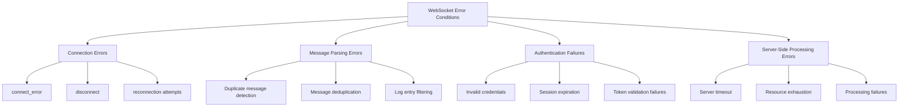
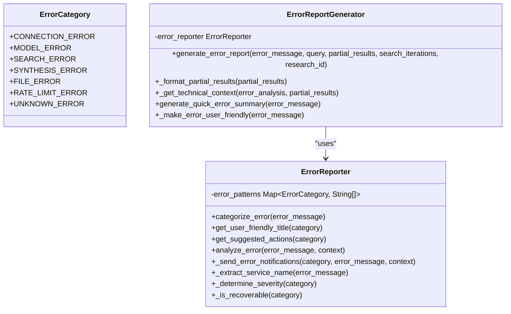
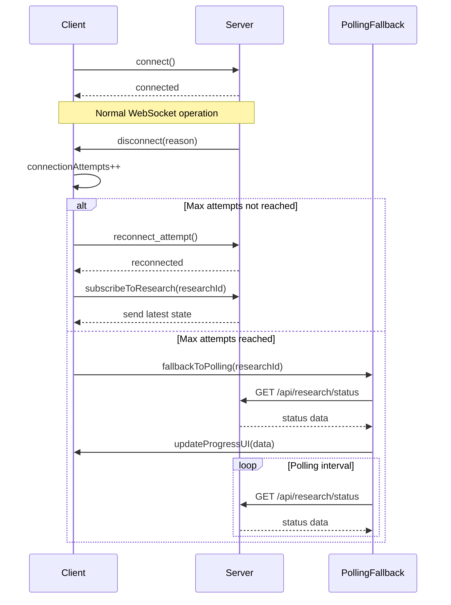
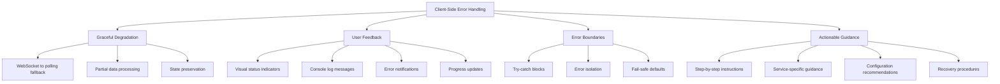
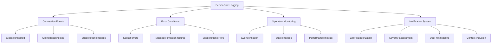
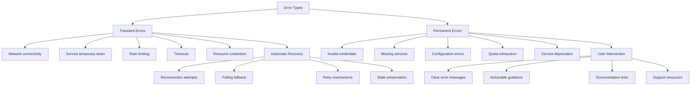
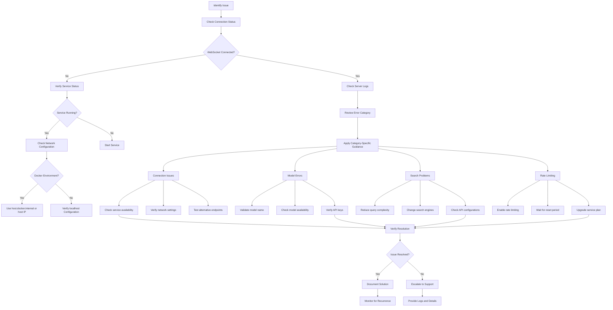

# Error Handling

<cite>
**Referenced Files in This Document**   
- [socket_service.py](file://src/local_deep_research/web/services/socket_service.py)
- [socket.js](file://src/local_deep_research/web/static/js/services/socket.js)
- [error_reporter.py](file://src/local_deep_research/error_handling/error_reporter.py)
- [report_generator.py](file://src/local_deep_research/error_handling/report_generator.py)
- [logpanel.js](file://src/local_deep_research/web/static/js/components/logpanel.js)
- [progress.js](file://src/local_deep_research/web/static/js/components/progress.js)
</cite>

## Table of Contents
1. [Introduction](#introduction)
2. [WebSocket Error Conditions](#websocket-error-conditions)
3. [Error Message Format and Standardized Error Codes](#error-message-format-and-standardized-error-codes)
4. [Error Recovery Strategies](#error-recovery-strategies)
5. [Client-Side Error Handling Best Practices](#client-side-error-handling-best-practices)
6. [Server-Side Error Logging and Monitoring](#server-side-error-logging-and-monitoring)
7. [Transient vs. Permanent Errors](#transient-vs-permanent-errors)
8. [Troubleshooting Workflows](#troubleshooting-workflows)
9. [Conclusion](#conclusion)

## Introduction
The local-deep-research system employs a robust WebSocket-based communication architecture to provide real-time updates during research operations. This documentation details the comprehensive error handling framework that ensures system reliability, user experience, and effective troubleshooting capabilities. The system implements a multi-layered approach to error management, encompassing connection errors, message parsing issues, authentication failures, and server-side processing errors. Through standardized error codes, recovery mechanisms, and user-friendly error presentation, the system maintains operational integrity even under adverse conditions.

**Section sources**
- [socket_service.py](file://src/local_deep_research/web/services/socket_service.py#L1-L263)
- [socket.js](file://src/local_deep_research/web/static/js/services/socket.js#L1-L959)

## WebSocket Error Conditions
The local-deep-research system handles various WebSocket error conditions through both server-side and client-side mechanisms. The server-side SocketIOService class manages connection lifecycle events and error handling, while the client-side socket.js implementation provides comprehensive error detection and recovery.

On the server side, the SocketIOService class implements error handlers for various connection issues:
- Connection errors are handled through the `__handle_connect` method, which logs client connections
- Disconnection events are managed by `__handle_disconnect`, which cleans up client subscriptions
- Socket-level errors are captured by `__handle_socket_error` and `__handle_default_error` methods
- The service uses a singleton pattern to ensure consistent error handling across the application

The client-side implementation in socket.js detects and responds to multiple error conditions:
- `connect_error`: Triggered when initial connection attempts fail
- `error`: Captures general socket errors during communication
- `disconnect`: Handles connection termination events
- Individual subscription errors are caught and logged without disrupting overall functionality

The system also handles message parsing errors by implementing duplicate message detection and filtering. The logpanel.js component uses a Map to track recently processed messages, preventing duplicate entries within a 10-second window. This mechanism helps maintain log clarity during error conditions that might generate repeated messages.

**Diagram sources**
- [socket_service.py](file://src/local_deep_research/web/services/socket_service.py#L68-L88)
- [socket.js](file://src/local_deep_research/web/static/js/services/socket.js#L84-L147)

**Section sources**
- [socket_service.py](file://src/local_deep_research/web/services/socket_service.py#L68-L88)
- [socket.js](file://src/local_deep_research/web/static/js/services/socket.js#L84-L147)
- [logpanel.js](file://src/local_deep_research/web/static/js/components/logpanel.js#L288-L316)

## Error Message Format and Standardized Error Codes
The local-deep-research system implements a standardized error message format and categorization system to ensure consistent error handling and user communication. The ErrorReporter class in error_reporter.py defines a comprehensive set of error categories and patterns for automatic error classification.

The system uses the ErrorCategory enum to categorize errors into distinct types:
- CONNECTION_ERROR: Network connectivity issues
- MODEL_ERROR: LLM service and model-related problems
- SEARCH_ERROR: Search engine and query failures
- SYNTHESIS_ERROR: Report generation issues
- FILE_ERROR: File system and storage problems
- RATE_LIMIT_ERROR: API rate limiting issues
- UNKNOWN_ERROR: Unclassified errors

Each error category is associated with specific regex patterns that help automatically identify and categorize error messages. For example, connection errors are identified by patterns matching "Connection refused", "timeout", or "EOF" in error messages. The system analyzes error messages against these patterns to determine the appropriate category.

The ErrorReportGenerator class transforms technical error messages into user-friendly formats. It replaces cryptic technical errors with actionable guidance, such as:
- "max_workers must be greater than 0" becomes guidance about LLM service connectivity
- "POST predict.*EOF" is translated to instructions for restarting Ollama
- "Connection refused" provides specific steps for Docker networking issues

Error messages include both technical details for debugging and user-friendly explanations with suggested actions. The system also extracts service names from error messages (e.g., OpenAI, Anthropic, Ollama) to provide context-specific guidance.

**Diagram sources**
- [error_reporter.py](file://src/local_deep_research/error_handling/error_reporter.py#L12-L22)
- [report_generator.py](file://src/local_deep_research/error_handling/report_generator.py#L12-L15)

**Section sources**
- [error_reporter.py](file://src/local_deep_research/error_handling/error_reporter.py#L12-L384)
- [report_generator.py](file://src/local_deep_research/error_handling/report_generator.py#L1-L415)

## Error Recovery Strategies
The local-deep-research system implements comprehensive error recovery strategies to maintain system availability and user experience during WebSocket communication issues. These strategies include automatic reconnection, message retry mechanisms, and state synchronization after disconnection.

The client-side socket.js implementation features a robust reconnection strategy:
- Automatic reconnection is enabled with `reconnection: true`
- Reconnection attempts are limited to 5 with a 1-second delay between attempts
- The system tracks connection attempts and falls back to polling after MAX_CONNECTION_ATTEMPTS (3)
- Reconnection callbacks allow components to resubscribe to research updates

When WebSocket connections fail, the system implements a polling fallback mechanism:
- The `fallbackToPolling` function switches to HTTP polling for research status updates
- Polling occurs every 3 seconds to maintain near real-time updates
- The system checks for socket connection status and automatically switches between WebSocket and polling modes
- Polling continues until the research is completed or cancelled

The system also handles state synchronization after disconnection:
- On reconnection, the client automatically resubscribes to the current research
- The server sends the latest progress state immediately after subscription
- Duplicate message detection prevents redundant log entries during recovery
- The system maintains a record of processed messages to avoid reprocessing

For message delivery reliability, the system implements several mechanisms:
- The `emit_socket_event` method includes error handling and returns success status
- The `emit_to_subscribers` method attempts delivery to individual subscribers and logs failures without interrupting overall operation
- Client-side message deduplication prevents duplicate processing of the same message

**Diagram sources**
- [socket.js](file://src/local_deep_research/web/static/js/services/socket.js#L47-L50)
- [socket.js](file://src/local_deep_research/web/static/js/services/socket.js#L84-L96)
- [socket.js](file://src/local_deep_research/web/static/js/services/socket.js#L555-L593)

**Section sources**
- [socket.js](file://src/local_deep_research/web/static/js/services/socket.js#L47-L96)
- [socket.js](file://src/local_deep_research/web/static/js/services/socket.js#L555-L593)
- [progress.js](file://src/local_deep_research/web/static/js/components/progress.js#L260-L271)

## Client-Side Error Handling Best Practices
The local-deep-research system implements several client-side error handling best practices to ensure a robust user experience during WebSocket communication issues. These practices focus on graceful degradation, user feedback, and maintaining functionality even when WebSocket connections are unreliable.

The system prioritizes graceful degradation by implementing a polling fallback mechanism:
- When WebSocket connections fail after multiple attempts, the system automatically switches to HTTP polling
- The `fallbackToPolling` function in socket.js initiates periodic status checks
- Users continue to receive research updates, albeit with slightly higher latency
- The transition between WebSocket and polling is transparent to the user

User feedback is enhanced through multiple mechanisms:
- Visual indicators show the current connection status
- Console log entries inform users when polling is being used due to WebSocket issues
- Error notifications are displayed prominently for critical issues
- The system provides specific, actionable guidance for common error conditions

The codebase demonstrates several best practices in error handling implementation:
- Comprehensive error boundary handling with try-catch blocks around critical operations
- Detailed logging of errors for debugging purposes
- Prevention of error cascades by isolating failure domains
- User-friendly error messages that avoid exposing technical implementation details

Specific implementation examples include:
- The `subscribeToResearch` function includes error handling for subscription failures
- The `handleProgressUpdate` function processes partial data even when errors occur
- Message deduplication prevents overwhelming users with repeated error messages
- Connection state tracking allows components to adapt their behavior based on connectivity

**Diagram sources**
- [socket.js](file://src/local_deep_research/web/static/js/services/socket.js#L555-L593)
- [progress.js](file://src/local_deep_research/web/static/js/components/progress.js#L233-L249)
- [socket.js](file://src/local_deep_research/web/static/js/services/socket.js#L204-L231)

**Section sources**
- [socket.js](file://src/local_deep_research/web/static/js/services/socket.js#L555-L593)
- [progress.js](file://src/local_deep_research/web/static/js/components/progress.js#L233-L249)
- [socket.js](file://src/local_deep_research/web/static/js/services/socket.js#L204-L231)

## Server-Side Error Logging and Monitoring
The local-deep-research system implements comprehensive server-side error logging and monitoring to ensure system reliability and facilitate troubleshooting. The logging infrastructure captures detailed information about WebSocket operations, error conditions, and system performance.

The SocketIOService class implements a sophisticated logging system:
- Three logging methods (`__log_info`, `__log_error`, `__log_exception`) provide different levels of detail
- Logging can be temporarily disabled during critical operations to prevent recursion
- The `__logging_enabled` flag protects against logging within logging handlers
- All connection events, errors, and emissions are logged with relevant context

Error monitoring is enhanced through the ErrorReporter and ErrorReportGenerator classes:
- Errors are categorized using regex patterns for consistent classification
- Severity levels are assigned based on error type
- Recoverability is determined to guide user response
- Contextual information is captured for comprehensive analysis

The system also implements error notification mechanisms:
- Authentication issues trigger notifications to alert users of credential problems
- API quota warnings are sent when rate limits are approached
- Notifications include service-specific context to aid troubleshooting
- The notification system integrates with the error categorization framework

Log entries include detailed information to support debugging:
- Timestamps for all events
- Client session identifiers (SID)
- Error stack traces when available
- Contextual data about the research operation
- Categorized error types and suggested actions

**Diagram sources**
- [socket_service.py](file://src/local_deep_research/web/services/socket_service.py#L90-L103)
- [error_reporter.py](file://src/local_deep_research/error_handling/error_reporter.py#L240-L327)

**Section sources**
- [socket_service.py](file://src/local_deep_research/web/services/socket_service.py#L90-L103)
- [error_reporter.py](file://src/local_deep_research/error_handling/error_reporter.py#L240-L327)

## Transient vs. Permanent Errors
The local-deep-research system distinguishes between transient and permanent errors to implement appropriate recovery strategies and user guidance. This distinction is crucial for determining whether errors can be resolved through automatic recovery or require user intervention.

Transient errors are temporary conditions that may resolve themselves or through automated recovery:
- Network connectivity issues
- Temporary service unavailability
- Rate limiting with defined reset times
- Resource contention
- Timeout conditions

Permanent errors represent fundamental issues that require user intervention:
- Invalid credentials
- Missing required services
- Configuration errors
- Quota exhaustion
- Service deprecation

The system determines error recoverability through the `_is_recoverable` method in ErrorReporter:
- CONNECTION_ERROR: True (can retry with service restart)
- MODEL_ERROR: True (can switch models or restart service)
- SEARCH_ERROR: True (can change search parameters)
- SYNTHESIS_ERROR: True (can use different models)
- FILE_ERROR: True (can adjust permissions or paths)
- RATE_LIMIT_ERROR: True (can enable rate limiting)
- UNKNOWN_ERROR: False (requires investigation)

For transient errors, the system implements automatic recovery:
- Reconnection attempts with exponential backoff
- Polling fallback when WebSockets fail
- Retry mechanisms for failed operations
- State preservation during recovery

For permanent errors, the system provides specific guidance:
- Clear error categorization and severity assessment
- Actionable steps for resolution
- Links to documentation and support resources
- Partial results when available

**Diagram sources**
- [error_reporter.py](file://src/local_deep_research/error_handling/error_reporter.py#L373-L384)
- [socket.js](file://src/local_deep_research/web/static/js/services/socket.js#L48-L50)

**Section sources**
- [error_reporter.py](file://src/local_deep_research/error_handling/error_reporter.py#L373-L384)
- [socket.js](file://src/local_deep_research/web/static/js/services/socket.js#L48-L50)

## Troubleshooting Workflows
The local-deep-research system provides structured troubleshooting workflows to help users diagnose and resolve WebSocket communication issues. These workflows are designed to guide users from initial problem identification through resolution.

The primary troubleshooting workflow follows these steps:
1. Identify the error type and category
2. Check connection status and fallback mechanisms
3. Review error-specific guidance and suggested actions
4. Implement recommended solutions
5. Verify resolution and monitor for recurrence

For WebSocket connection issues, the troubleshooting workflow includes:
- Verifying that the LLM service (Ollama/LM Studio) is running
- Checking network connectivity and firewall settings
- Validating service URLs and port configurations
- Testing with different transport methods (polling vs WebSocket)
- Examining browser console logs for detailed error information

The system provides specific troubleshooting guidance for common issues:
- Docker networking problems: Instructions for using host.docker.internal on Mac/Windows or host IP on Linux
- API key configuration: Guidance on setting keys in the web UI rather than .env files
- Model availability: Commands to list and pull models in Ollama
- Search query length: Recommendations for shortening queries that exceed API limits
- Permission issues: Steps to resolve database write protection errors

The troubleshooting process is supported by comprehensive logging:
- Server-side logs capture connection events and errors
- Client-side console logs provide real-time feedback
- Research-specific logs track progress and issues
- Error reports include technical details and user-friendly explanations

Users are directed to additional resources:
- Documentation and setup guides
- Community support channels (Discord, Reddit)
- Issue reporting on GitHub
- Wiki with troubleshooting articles

**Diagram sources**
- [error_reporter.py](file://src/local_deep_research/error_handling/error_reporter.py#L154-L198)
- [report_generator.py](file://src/local_deep_research/error_handling/report_generator.py#L298-L404)
- [socket.js](file://src/local_deep_research/web/static/js/services/socket.js#L84-L96)

**Section sources**
- [error_reporter.py](file://src/local_deep_research/error_handling/error_reporter.py#L154-L198)
- [report_generator.py](file://src/local_deep_research/error_handling/report_generator.py#L298-L404)
- [socket.js](file://src/local_deep_research/web/static/js/services/socket.js#L84-L96)

## Conclusion
The local-deep-research system implements a comprehensive WebSocket error handling framework that ensures reliability, user experience, and effective troubleshooting. By combining server-side robustness with client-side resilience, the system maintains functionality even under challenging network conditions. The multi-layered approach to error management includes automatic recovery mechanisms, standardized error categorization, and user-friendly error presentation.

Key strengths of the error handling system include:
- Automatic fallback to polling when WebSocket connections fail
- Comprehensive error categorization with actionable guidance
- Detailed logging for both debugging and user support
- Clear distinction between transient and permanent errors
- Structured troubleshooting workflows with specific solutions

The system's design prioritizes user experience by transforming technical errors into actionable steps, providing context-specific guidance, and maintaining operation through fallback mechanisms. This approach minimizes disruption to research workflows while empowering users to resolve issues effectively. The integration of monitoring and notification systems further enhances system reliability by proactively alerting users to potential problems.

Future improvements could include enhanced error prediction, more sophisticated recovery strategies, and expanded monitoring capabilities. However, the current implementation provides a solid foundation for reliable WebSocket communication in the local-deep-research environment.

[No sources needed since this section summarizes without analyzing specific files]