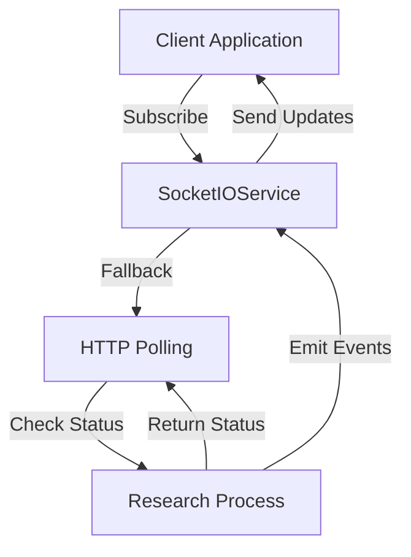
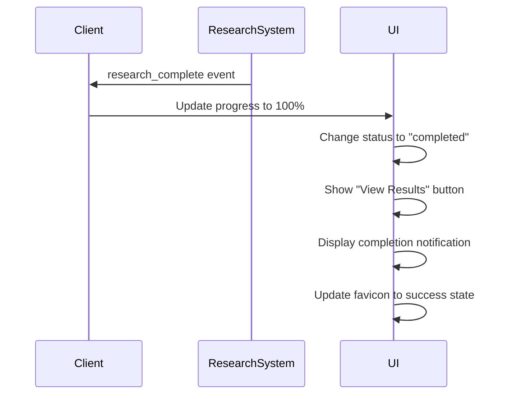

# Event Types

<cite>
**Referenced Files in This Document**   
- [socket_service.py](file://src/local_deep_research/web/services/socket_service.py)
- [research_service.py](file://src/local_deep_research/web/services/research_service.py)
- [socket.js](file://src/local_deep_research/web/static/js/services/socket.js)
- [progress.js](file://src/local_deep_research/web/static/js/components/progress.js)
- [settings_manager.py](file://src/local_deep_research/web/services/settings_manager.py)
</cite>

## Table of Contents
1. [Introduction](#introduction)
2. [WebSocket Event Architecture](#websocket-event-architecture)
3. [Event Types](#event-types)
   - [progress_update](#progress_update)
   - [status_change](#status_change)
   - [intermediate_results](#intermediate_results)
   - [research_complete](#research_complete)
   - [error](#error)
4. [Event Sequence Examples](#event-sequence-examples)
5. [Client Handling Guidelines](#client-handling-guidelines)
6. [Custom Event Extensions](#custom-event-extensions)
7. [Conclusion](#conclusion)

## Introduction

The local-deep-research system utilizes WebSocket events to provide real-time updates about research processes to clients. These events enable responsive user interfaces by communicating progress, status changes, intermediate results, completion, and error conditions. This documentation catalogs all WebSocket event types emitted by the system, detailing their triggering conditions, payload structures, and expected client behavior. The events are designed to support both real-time progress tracking and robust error handling throughout the research workflow.

**Section sources**
- [socket_service.py](file://src/local_deep_research/web/services/socket_service.py)
- [research_service.py](file://src/local_deep_research/web/services/research_service.py)

## WebSocket Event Architecture

The WebSocket event system in local-deep-research is built on Socket.IO and follows a subscription-based pattern where clients subscribe to specific research processes by ID. The architecture includes fallback mechanisms to HTTP polling when WebSocket connections are unavailable, ensuring reliable delivery of research updates across different network conditions.

The core components of the event system include:
- **SocketIOService**: A singleton class that manages Socket.IO connections and subscriptions
- **Event emission**: Events are emitted to subscribers using research-specific channels
- **Fallback mechanism**: Automatic fallback to polling when WebSocket connections fail
- **Subscription management**: Tracking of client subscriptions to research processes

Events are emitted throughout the research lifecycle, from initialization to completion or failure, providing clients with comprehensive visibility into the research process.



**Diagram sources **
- [socket_service.py](file://src/local_deep_research/web/services/socket_service.py)
- [research_service.py](file://src/local_deep_research/web/services/research_service.py)

**Section sources**
- [socket_service.py](file://src/local_deep_research/web/services/socket_service.py)
- [research_service.py](file://src/local_deep_research/web/services/research_service.py)

## Event Types

### progress_update

The `progress_update` event is emitted periodically during research execution to provide information about the current progress percentage and status.

**Triggering Conditions:**
- Research process initialization
- Completion of search iterations
- Progress through different research phases (e.g., information gathering, synthesis)
- Periodic updates during long-running operations

**Payload Structure:**
```json
{
  "progress": 75,
  "message": "Analyzing search results and synthesizing findings",
  "status": "in_progress",
  "metadata": {
    "phase": "information_analysis",
    "timestamp": "2024-01-15T10:30:00Z"
  }
}
```

**Fields:**
- `progress`: Integer from 0-100 representing completion percentage
- `message`: Human-readable description of current activity
- `status`: Current status (e.g., "in_progress")
- `metadata.phase`: Current phase of research (e.g., "init", "output_generation", "synthesis_error")

**Semantic Meaning:**
This event indicates the ongoing progress of a research task, allowing clients to update progress bars and status indicators. The progress value is carefully managed to never decrease, ensuring a smooth user experience.

**Expected Client Behavior:**
- Update progress bar with the provided percentage
- Display the message as the current task description
- Update any phase-specific UI elements based on the metadata
- Maintain the last known progress value if subsequent updates are missed

**Section sources**
- [research_service.py](file://src/local_deep_research/web/services/research_service.py#L553-L562)
- [socket.js](file://src/local_deep_research/web/static/js/services/socket.js#L200-L211)

### status_change

The `status_change` event is emitted when the overall status of a research process changes, such as transitioning from "in_progress" to "completed" or "cancelled".

**Triggering Conditions:**
- Research process starts
- Research is cancelled by user
- Research enters a new major phase
- System-wide status changes (e.g., settings changes)

**Payload Structure:**
```json
{
  "status": "cancelled",
  "message": "Research was cancelled by the user",
  "timestamp": "2024-01-15T10:35:00Z",
  "metadata": {
    "reason": "user_request"
  }
}
```

**Fields:**
- `status`: New status value (e.g., "in_progress", "completed", "cancelled", "error")
- `message`: Description of the status change
- `timestamp`: ISO format timestamp of the change
- `metadata.reason`: Optional reason for the status change

**Semantic Meaning:**
This event signals significant transitions in the research lifecycle, enabling clients to update their UI state appropriately. It provides a higher-level view of the research process compared to the detailed progress updates.

**Expected Client Behavior:**
- Update the overall status indicator in the UI
- Enable or disable controls based on the new status (e.g., disable cancel button for completed research)
- Show appropriate notifications to the user
- Handle special cases like cancellation by updating UI elements accordingly

**Section sources**
- [research_service.py](file://src/local_deep_research/web/services/research_service.py#L1587-L1609)
- [progress.js](file://src/local_deep_research/web/static/js/components/progress.js#L971-L998)

### intermediate_results

The `intermediate_results` event is emitted when partial research findings are available, typically after each search iteration or major analysis phase.

**Triggering Conditions:**
- Completion of a search iteration
- Generation of preliminary findings
- Availability of synthesized information before final report generation

**Payload Structure:**
```json
{
  "findings": [
    {
      "phase": "Initial Search",
      "content": "Summary of initial search results...",
      "sources": ["https://example.com/source1", "https://example.com/source2"],
      "confidence": 0.85
    }
  ],
  "search_results": [
    {
      "title": "Relevant Research Paper",
      "url": "https://example.com/paper",
      "snippet": "Abstract of the paper..."
    }
  ],
  "iteration": 2,
  "total_iterations": 5
}
```

**Fields:**
- `findings`: Array of finding objects with phase, content, sources, and confidence
- `search_results`: Array of search result objects with title, URL, and snippet
- `iteration`: Current iteration number
- `total_iterations`: Total number of planned iterations

**Semantic Meaning:**
This event provides access to research findings as they become available, allowing clients to display incremental results to users. It supports the system's iterative research approach by exposing intermediate outputs.

**Expected Client Behavior:**
- Display intermediate findings in a dedicated area of the UI
- Update search results list with new entries
- Show iteration progress (e.g., "2 of 5 iterations completed")
- Optionally allow users to review and provide feedback on intermediate results
- Store intermediate results for inclusion in the final report

**Section sources**
- [research_service.py](file://src/local_deep_research/web/services/research_service.py#L641-L653)
- [progress.js](file://src/local_deep_research/web/static/js/components/progress.js#L277-L291)

### research_complete

The `research_complete` event is emitted when a research process successfully completes and a final report is available.

**Triggering Conditions:**
- Successful completion of all research iterations
- Final synthesis of findings into a comprehensive report
- Successful saving of the research results to storage

**Payload Structure:**
```json
{
  "research_id": "abc123",
  "status": "completed",
  "completed_at": "2024-01-15T10:45:00Z",
  "report_path": "/research/outputs/abc123.md",
  "duration": 300,
  "metrics": {
    "total_searches": 15,
    "total_tokens": 8500,
    "cost_estimate": 0.0425
  }
}
```

**Fields:**
- `research_id`: Unique identifier for the research process
- `status`: Always "completed" for this event type
- `completed_at`: ISO format timestamp of completion
- `report_path`: File system path to the generated report
- `duration`: Total duration in seconds
- `metrics`: Object containing various research metrics

**Semantic Meaning:**
This event signifies the successful conclusion of a research task, indicating that all processing is complete and the final results are available for access. It represents the culmination of the research workflow.

**Expected Client Behavior:**
- Update progress bar to 100% and change to success state
- Change status indicator to "completed"
- Show a "View Results" button that links to the report
- Display a notification to inform the user of completion
- Update the favicon to indicate success
- Enable export and sharing options for the completed research



**Diagram sources **
- [progress.js](file://src/local_deep_research/web/static/js/components/progress.js#L870-L899)
- [research_service.py](file://src/local_deep_research/web/services/research_service.py#L917-L919)

**Section sources**
- [progress.js](file://src/local_deep_research/web/static/js/components/progress.js#L870-L899)
- [research_service.py](file://src/local_deep_research/web/services/research_service.py#L917-L919)

### error

The `error` event is emitted when an error occurs during the research process, preventing normal completion.

**Triggering Conditions:**
- LLM service unavailability (e.g., Ollama not running)
- Model not found in LLM service
- API connection errors
- Rate limiting by external services
- Context/token limits exceeded
- Timeout during synthesis
- Any unhandled exception in the research process

**Payload Structure:**
```json
{
  "research_id": "abc123",
  "error": "Ollama AI service is unavailable (HTTP 503)",
  "error_type": "ollama_unavailable",
  "status": "failed",
  "timestamp": "2024-01-15T10:32:00Z",
  "metadata": {
    "phase": "output_generation",
    "retry_available": true
  }
}
```

**Fields:**
- `research_id`: Unique identifier for the research process
- `error`: Human-readable error message
- `error_type`: Categorized error type (e.g., "ollama_unavailable", "model_not_found", "timeout")
- `status`: Always "failed" for this event type
- `timestamp`: ISO format timestamp of the error
- `metadata.phase`: Research phase when error occurred
- `metadata.retry_available`: Whether retrying might resolve the issue

**Semantic Meaning:**
This event indicates that the research process has encountered a problem that prevents successful completion. The system attempts to categorize errors to help clients and users understand the nature of the issue and potential remediation steps.

**Expected Client Behavior:**
- Update progress bar to 100% and change to error state
- Change status indicator to "error"
- Display the error message prominently
- Show an "Error Report" button instead of "View Results"
- Display a notification with the error details
- Update the favicon to indicate error state
- Suggest appropriate next steps based on error type (e.g., check Ollama service, retry with different settings)

```mermaid
flowchart TD
A[Error Occurs] --> B{Error Type}
B --> |ollama_unavailable| C[Show: "Check Ollama Service"]
B --> |model_not_found| D[Show: "Pull Required Model"]
B --> |timeout| E[Show: "Retry with Simpler Query"]
B --> |rate_limit| F[Show: "Wait and Retry"]
B --> |token_limit| G[Show: "Reduce Scope or Use Different Model"]
B --> |connection_error| H[Show: "Check Network Connection"]
B --> |unknown| I[Show: "Generic Error Message"]
C --> J[Update UI with Error State]
D --> J
E --> J
F --> J
G --> J
H --> J
I --> J
```

**Diagram sources **
- [progress.js](file://src/local_deep_research/web/static/js/components/progress.js#L905-L941)
- [research_service.py](file://src/local_deep_research/web/services/research_service.py#L693-L780)

**Section sources**
- [progress.js](file://src/local_deep_research/web/static/js/components/progress.js#L905-L941)
- [research_service.py](file://src/local_deep_research/web/services/research_service.py#L693-L780)

## Event Sequence Examples

### Standard Research Workflow

In a typical research scenario without errors, the event sequence would be:

```json
// Research starts
{
  "event": "progress_update",
  "data": {
    "progress": 5,
    "message": "Starting research process",
    "status": "in_progress",
    "metadata": {"phase": "init"}
  }
}

// Progress through iterations
{
  "event": "progress_update",
  "data": {
    "progress": 40,
    "message": "Completing search iteration 2 of 3",
    "status": "in_progress",
    "metadata": {"phase": "search_iterations"}
  }
}

// Intermediate results available
{
  "event": "intermediate_results",
  "data": {
    "findings": [...],
    "iteration": 2,
    "total_iterations": 3
  }
}

// Approaching completion
{
  "event": "progress_update",
  "data": {
    "progress": 85,
    "message": "Search complete, generating output",
    "status": "in_progress",
    "metadata": {"phase": "output_generation"}
  }
}

// Research completes successfully
{
  "event": "research_complete",
  "data": {
    "research_id": "abc123",
    "status": "completed",
    "completed_at": "2024-01-15T10:45:00Z",
    "report_path": "/research/outputs/abc123.md"
  }
}
```

**Section sources**
- [research_service.py](file://src/local_deep_research/web/services/research_service.py#L638-L653)
- [progress.js](file://src/local_deep_research/web/static/js/components/progress.js#L870-L899)

### Error Recovery Workflow

When an error occurs but the system can provide fallback results:

```json
// Error during synthesis
{
  "event": "progress_update",
  "data": {
    "progress": 87,
    "message": "Synthesis hit token limits. Attempting fallback...",
    "status": "in_progress",
    "metadata": {
      "phase": "synthesis_error",
      "error_type": "token_limit"
    }
  }
}

// Using fallback synthesis
{
  "event": "progress_update",
  "data": {
    "progress": 88,
    "message": "Using fallback synthesis due to token_limit error",
    "status": "in_progress",
    "metadata": {
      "phase": "synthesis_fallback",
      "error_type": "token_limit"
    }
  }
}

// Continuing with fallback results
{
  "event": "progress_update",
  "data": {
    "progress": 95,
    "message": "Saving research report to database...",
    "status": "in_progress",
    "metadata": {"phase": "output_generation"}
  }
}

// Completing with partial results
{
  "event": "research_complete",
  "data": {
    "research_id": "def456",
    "status": "completed",
    "completed_at": "2024-01-15T11:20:00Z",
    "report_path": "/research/outputs/def456.md",
    "warning": "Report generated using fallback synthesis due to token limits"
  }
}
```

**Section sources**
- [research_service.py](file://src/local_deep_research/web/services/research_service.py#L700-L844)
- [progress.js](file://src/local_deep_research/web/static/js/components/progress.js#L870-L899)

### Failed Research Workflow

When an error prevents any meaningful results:

```json
// Error occurs
{
  "event": "error",
  "data": {
    "research_id": "ghi789",
    "error": "Ollama AI service is unavailable (HTTP 503)",
    "error_type": "ollama_unavailable",
    "status": "failed",
    "timestamp": "2024-01-15T12:10:00Z",
    "metadata": {
      "phase": "output_generation",
      "retry_available": true
    }
  }
}

// Status update to failed
{
  "event": "status_change",
  "data": {
    "status": "failed",
    "message": "Research failed due to Ollama service unavailability",
    "timestamp": "2024-01-15T12:10:01Z"
  }
}
```

**Section sources**
- [research_service.py](file://src/local_deep_research/web/services/research_service.py#L1587-L1609)
- [progress.js](file://src/local_deep_research/web/static/js/components/progress.js#L905-L941)

## Client Handling Guidelines

### Connection and Subscription

Clients should follow these steps to properly handle WebSocket events:

1. **Initialize connection**: Establish a WebSocket connection to the server
2. **Subscribe to research**: Use the `subscribeToResearch` method with the research ID
3. **Handle connection failures**: Implement fallback to HTTP polling when WebSocket connections fail
4. **Reconnect handling**: Resubscribe to research events when the connection is reestablished

```javascript
// Example subscription
window.socket.subscribeToResearch(researchId, handleProgressUpdate);

// Handle reconnection
window.socket.onReconnect(() => {
    window.socket.subscribeToResearch(researchId, handleProgressUpdate);
});
```

### UI Updates

For optimal user experience, clients should:

- **Progress visualization**: Use a progress bar that never decreases, even if updates are missed
- **Status messaging**: Display clear, user-friendly messages that explain what the system is doing
- **Error presentation**: Categorize errors and provide specific guidance for resolution
- **Notifications**: Use system notifications for important events like completion or errors
- **Favicon updates**: Change the favicon to reflect research status (progress, success, error)

### Error Handling

Clients should implement robust error handling:

- **Categorized responses**: Respond differently based on error type
- **Retry mechanisms**: Offer retry options when appropriate
- **Fallback content**: Display available intermediate results even when final synthesis fails
- **User guidance**: Provide clear instructions for resolving common issues

**Section sources**
- [socket.js](file://src/local_deep_research/web/static/js/services/socket.js)
- [progress.js](file://src/local_deep_research/web/static/js/components/progress.js)

## Custom Event Extensions

The local-deep-research system supports custom event extensions for specialized use cases. These can be implemented by extending the existing event system.

### Implementing New Event Types

To implement a new event type:

1. **Define the event structure**: Determine the payload schema and triggering conditions
2. **Add emission points**: Insert event emission in the appropriate research service methods
3. **Update client handlers**: Implement client-side handling for the new event type

Example implementation for a custom "resource_usage" event:

```python
# In research_service.py
SocketIOService().emit_to_subscribers(
    "resource_usage",
    research_id,
    {
        "cpu_usage": cpu_percent,
        "memory_usage": memory_percent,
        "token_count": current_tokens,
        "timestamp": datetime.now(UTC).isoformat()
    }
)
```

### Extension Points

Key extension points in the codebase:

- **Progress callback**: The `progress_callback` function in `research_service.py` can be extended to emit additional event types
- **Socket service**: The `SocketIOService` class provides methods for emitting events to subscribers
- **Client components**: The JavaScript components in `web/static/js` can be extended to handle new event types

Custom events should follow the same naming conventions and payload structures as existing events to maintain consistency.

**Section sources**
- [socket_service.py](file://src/local_deep_research/web/services/socket_service.py)
- [research_service.py](file://src/local_deep_research/web/services/research_service.py)

## Conclusion

The WebSocket event system in local-deep-research provides a comprehensive mechanism for real-time communication between the server and clients during research processes. By understanding and properly handling the various event types—progress_update, status_change, intermediate_results, research_complete, and error—clients can create responsive, user-friendly interfaces that keep users informed throughout the research workflow.

The system's design emphasizes reliability through its fallback to polling when WebSocket connections are unavailable, and provides detailed error categorization to help users understand and resolve issues. The event sequences demonstrate the system's ability to handle both successful workflows and error conditions gracefully, often providing fallback results when complete synthesis is not possible.

For developers extending the system, the architecture supports custom event types that can provide additional insights into research processes, such as resource usage or specialized analysis results. By following the patterns established in the existing codebase, new event types can be seamlessly integrated into the system.

**Section sources**
- [socket_service.py](file://src/local_deep_research/web/services/socket_service.py)
- [research_service.py](file://src/local_deep_research/web/services/research_service.py)
- [socket.js](file://src/local_deep_research/web/static/js/services/socket.js)
- [progress.js](file://src/local_deep_research/web/static/js/components/progress.js)