# Message Formats

<cite>
**Referenced Files in This Document**   
- [socket_service.py](file://src/local_deep_research/web/services/socket_service.py)
- [socket.js](file://src/local_deep_research/web/static/js/services/socket.js)
- [logpanel.js](file://src/local_deep_research/web/static/js/components/logpanel.js)
- [research_routes.py](file://src/local_deep_research/web/routes/research_routes.py)
- [history_routes.py](file://src/local_deep_research/web/routes/history_routes.py)
</cite>

## Table of Contents
1. [Introduction](#introduction)
2. [WebSocket Connection Management](#websocket-connection-management)
3. [Message Types and Event Structure](#message-types-and-event-structure)
4. [Request Messages](#request-messages)
5. [Response Messages](#response-messages)
6. [Notification Messages](#notification-messages)
7. [Progress Update Messages](#progress-update-messages)
8. [Error Handling and Malformed Messages](#error-handling-and-malformed-messages)
9. [Message Serialization and Deserialization](#message-serialization-and-deserialization)
10. [Message Size and Performance Optimization](#message-size-and-performance-optimization)
11. [Message Validation](#message-validation)
12. [Versioning and Backward Compatibility](#versioning-and-backward-compatibility)
13. [Examples](#examples)

## Introduction

The local-deep-research system utilizes WebSocket communication to provide real-time updates during research processes. This documentation details the message formats used in the WebSocket implementation, covering request, response, and notification messages. The system employs Socket.IO for bidirectional communication between the server and client, enabling live progress updates, status changes, and error notifications during research execution.

The WebSocket messaging system is designed to keep the user interface synchronized with the backend research processes, providing immediate feedback on search progress, engine selection, and final results. This real-time communication is critical for maintaining a responsive user experience during potentially long-running research operations.

**Section sources**
- [socket_service.py](file://src/local_deep_research/web/services/socket_service.py#L1-L263)
- [socket.js](file://src/local_deep_research/web/static/js/services/socket.js#L1-L800)

## WebSocket Connection Management

The WebSocket connection is established using Socket.IO with polling as the primary transport mechanism to ensure compatibility across different network environments. The connection is initialized when the user navigates to research-related pages such as `/research`, `/progress`, or `/benchmark`.

The client-side socket service automatically detects the appropriate page context and initializes the connection only when necessary. Connection attempts are retried with exponential backoff, and after a configurable number of failed attempts, the system falls back to HTTP polling for status updates.

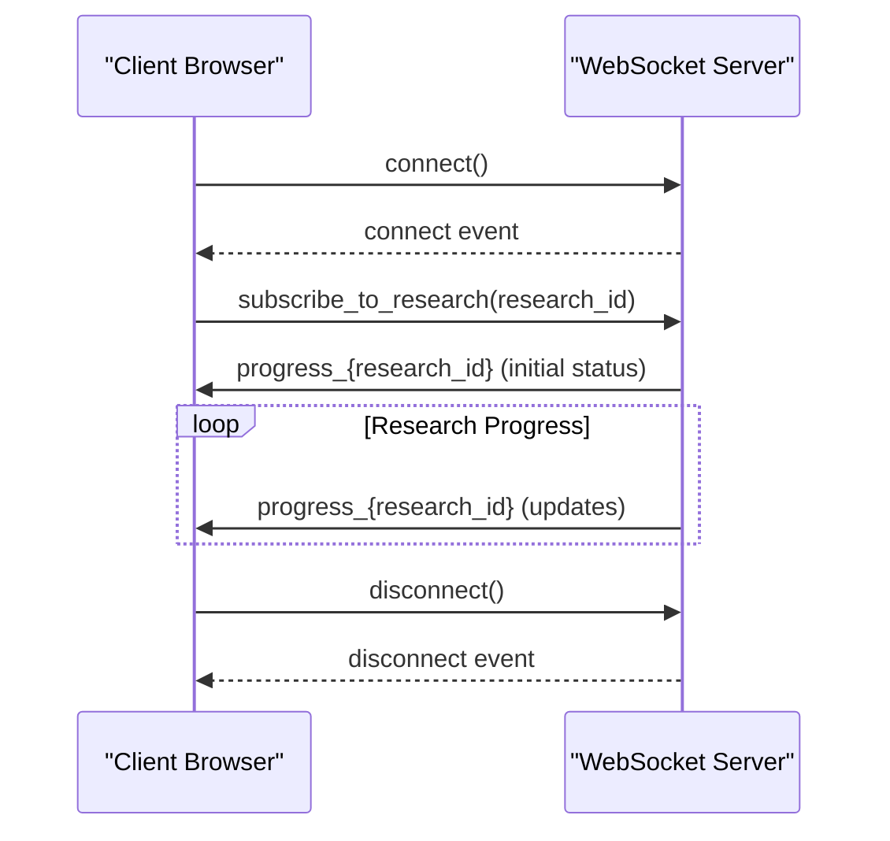

**Diagram sources**
- [socket_service.py](file://src/local_deep_research/web/services/socket_service.py#L68-L88)
- [socket.js](file://src/local_deep_research/web/static/js/services/socket.js#L22-L62)

**Section sources**
- [socket_service.py](file://src/local_deep_research/web/services/socket_service.py#L1-L263)
- [socket.js](file://src/local_deep_research/web/static/js/services/socket.js#L1-L800)

## Message Types and Event Structure

The WebSocket system in local-deep-research uses a structured event-based messaging pattern with three primary message types: requests, responses, and notifications. All messages follow a consistent JSON structure with standardized fields for status, metadata, and payload data.

The event naming convention follows a pattern of `{event_type}_{research_id}` for research-specific events, allowing multiple research processes to be tracked simultaneously without interference. The system supports both broadcast messages to all connected clients and targeted messages to specific research subscribers.

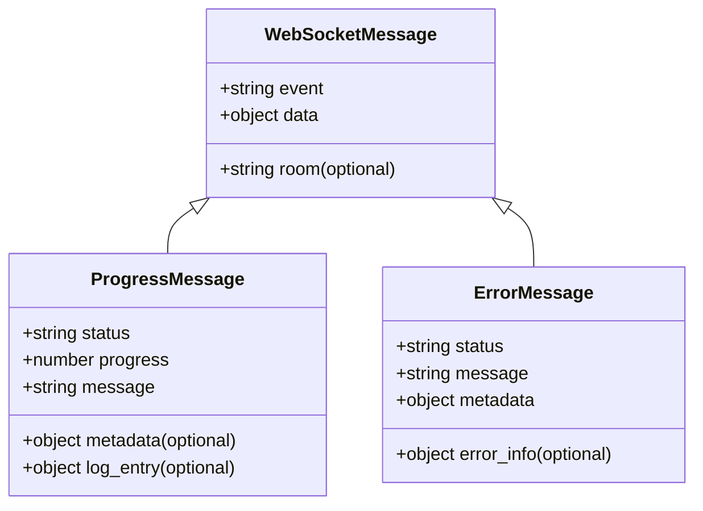

**Diagram sources**
- [socket_service.py](file://src/local_deep_research/web/services/socket_service.py#L105-L127)
- [socket.js](file://src/local_deep_research/web/static/js/services/socket.js#L179-L211)

**Section sources**
- [socket_service.py](file://src/local_deep_research/web/services/socket_service.py#L1-L263)
- [socket.js](file://src/local_deep_research/web/static/js/services/socket.js#L1-L800)

## Request Messages

Request messages are initiated by the client to subscribe to research updates or perform other WebSocket-related operations. The primary request message type is the subscription request, which allows the client to receive real-time updates for a specific research process.

The subscription request requires a research_id parameter and follows the event name "subscribe_to_research". The server validates the research_id and establishes the subscription if valid. Empty or missing research_id values are ignored by the server to prevent invalid subscriptions.

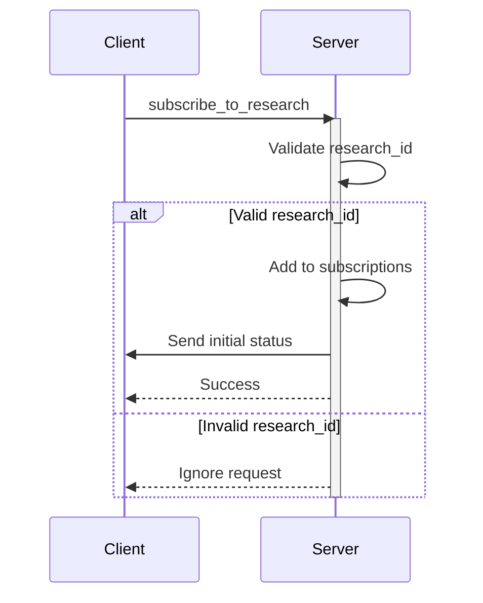

**Diagram sources**
- [socket_service.py](file://src/local_deep_research/web/services/socket_service.py#L194-L231)
- [socket.js](file://src/local_deep_research/web/static/js/services/socket.js#L155-L193)

**Section sources**
- [socket_service.py](file://src/local_deep_research/web/services/socket_service.py#L194-L231)
- [socket.js](file://src/local_deep_research/web/static/js/services/socket.js#L155-L193)

## Response Messages

Response messages are sent from the server to the client as acknowledgments or data responses to client requests. These messages typically include a status field indicating success or failure, along with relevant data or error information.

The system uses response messages to confirm subscription requests and to provide immediate feedback on the current state of a research process. When a client subscribes to a research process, the server responds with the current progress status if available, allowing the UI to be updated immediately without waiting for the next progress update.

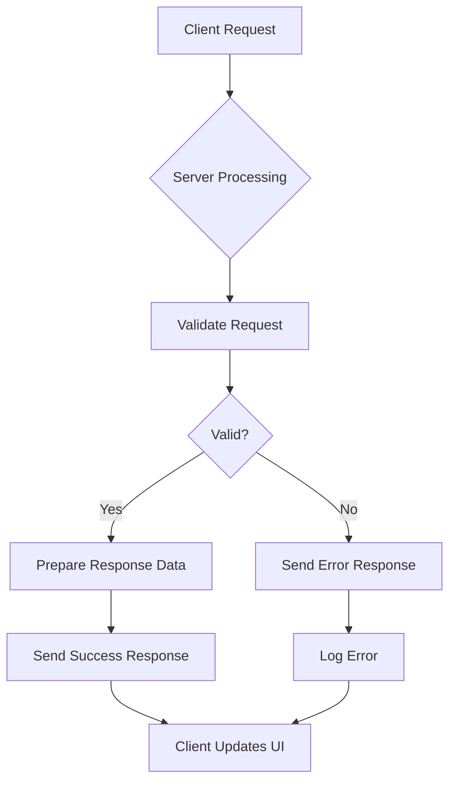

**Diagram sources**
- [socket_service.py](file://src/local_deep_research/web/services/socket_service.py#L209-L231)
- [socket.js](file://src/local_deep_research/web/static/js/services/socket.js#L200-L231)

**Section sources**
- [socket_service.py](file://src/local_deep_research/web/services/socket_service.py#L209-L231)
- [socket.js](file://src/local_deep_research/web/static/js/services/socket.js#L200-L231)

## Notification Messages

Notification messages are server-initiated messages that provide real-time updates about research progress and system events. These messages are broadcast to all subscribed clients and follow the event naming pattern "research_progress_{research_id}".

The notification system supports various message types including progress updates, milestone notifications, and completion events. Each notification includes a standardized structure with fields for status, progress percentage, descriptive message, and optional metadata that provides additional context about the current research phase.

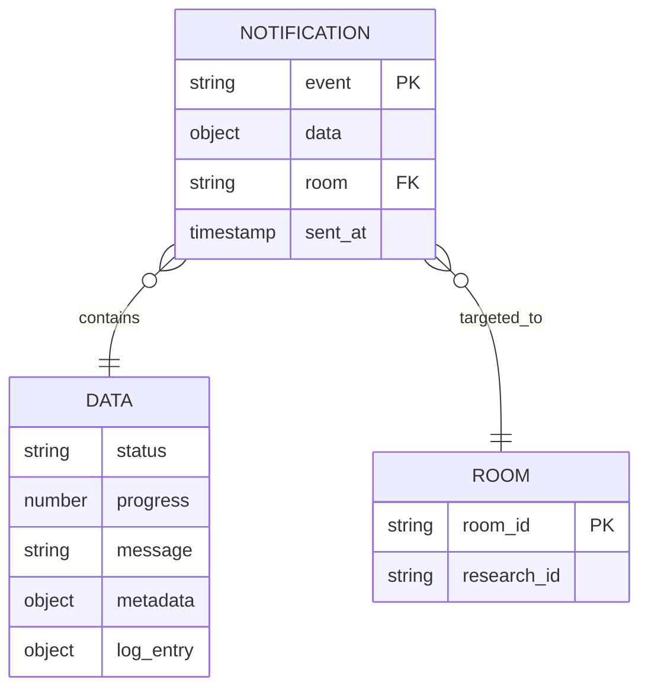

**Diagram sources**
- [socket_service.py](file://src/local_deep_research/web/services/socket_service.py#L129-L174)
- [research_routes.py](file://src/local_deep_research/web/routes/research_routes.py#L799-L801)

**Section sources**
- [socket_service.py](file://src/local_deep_research/web/services/socket_service.py#L129-L174)
- [research_routes.py](file://src/local_deep_research/web/routes/research_routes.py#L799-L801)

## Progress Update Messages

Progress update messages are the primary notification type used to communicate the status of ongoing research processes. These messages are emitted whenever there is a significant change in the research state, such as advancing to a new phase, completing a search iteration, or encountering an error condition.

The progress message structure includes several key fields:
- **status**: Current research status (in_progress, completed, failed, suspended)
- **progress**: Numeric progress percentage (0-100)
- **message**: Human-readable description of current activity
- **metadata**: Additional context about the research phase
- **log_entry**: Detailed log information for the current event

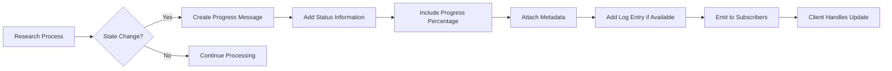

**Diagram sources**
- [socket_service.py](file://src/local_deep_research/web/services/socket_service.py#L129-L174)
- [socket.js](file://src/local_deep_research/web/static/js/services/socket.js#L200-L451)

**Section sources**
- [socket_service.py](file://src/local_deep_research/web/services/socket_service.py#L129-L174)
- [socket.js](file://src/local_deep_research/web/static/js/services/socket.js#L200-L451)

## Error Handling and Malformed Messages

The WebSocket system includes comprehensive error handling for both server-side exceptions and malformed client messages. Server-side errors are caught and logged without disrupting the WebSocket service, ensuring that transient issues do not terminate the connection for all clients.

When malformed messages are received from clients, the system silently ignores them rather than sending error responses, preventing potential denial-of-service attacks through malformed message flooding. The server validates all incoming messages and discards those that do not conform to the expected structure.

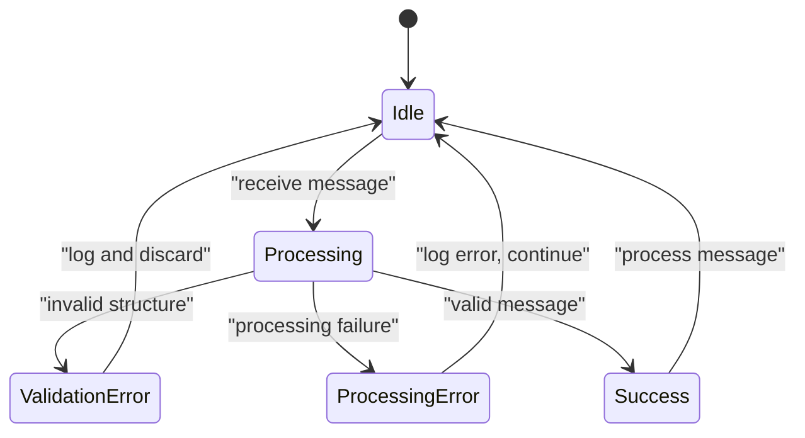

**Diagram sources**
- [socket_service.py](file://src/local_deep_research/web/services/socket_service.py#L232-L242)
- [socket.js](file://src/local_deep_research/web/static/js/services/socket.js#L140-L147)

**Section sources**
- [socket_service.py](file://src/local_deep_research/web/services/socket_service.py#L232-L242)
- [socket.js](file://src/local_deep_research/web/static/js/services/socket.js#L140-L147)

## Message Serialization and Deserialization

The WebSocket messaging system uses JSON as the serialization format for all messages, ensuring compatibility across different platforms and programming languages. The server-side Python code automatically serializes Python dictionaries to JSON, while the client-side JavaScript handles JSON parsing natively through the Socket.IO library.

Both client and server implement message validation during deserialization to ensure data integrity. The system handles special data types such as timestamps by converting them to ISO 8601 format strings, ensuring consistent representation across the system.

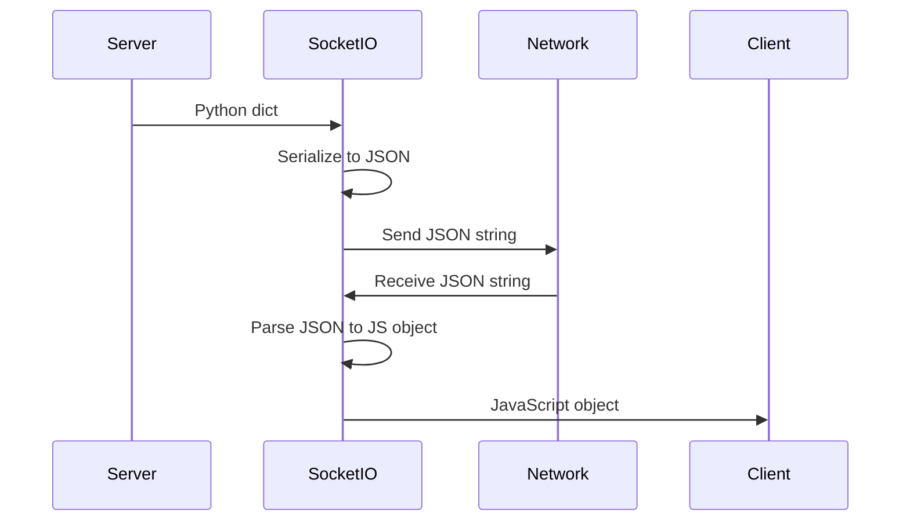

**Diagram sources**
- [socket_service.py](file://src/local_deep_research/web/services/socket_service.py#L105-L127)
- [socket.js](file://src/local_deep_research/web/static/js/services/socket.js#L294-L305)

**Section sources**
- [socket_service.py](file://src/local_deep_research/web/services/socket_service.py#L105-L127)
- [socket.js](file://src/local_deep_research/web/static/js/services/socket.js#L294-L305)

## Message Size and Performance Optimization

The system implements several performance optimizations to minimize message size and network overhead. Large data payloads such as complete research logs are not sent in individual messages but are available through separate HTTP endpoints.

The client implements message deduplication to prevent display of identical messages within a short time window, reducing visual clutter in the user interface. Server-side emissions are optimized to avoid redundant updates when the research state has not significantly changed.

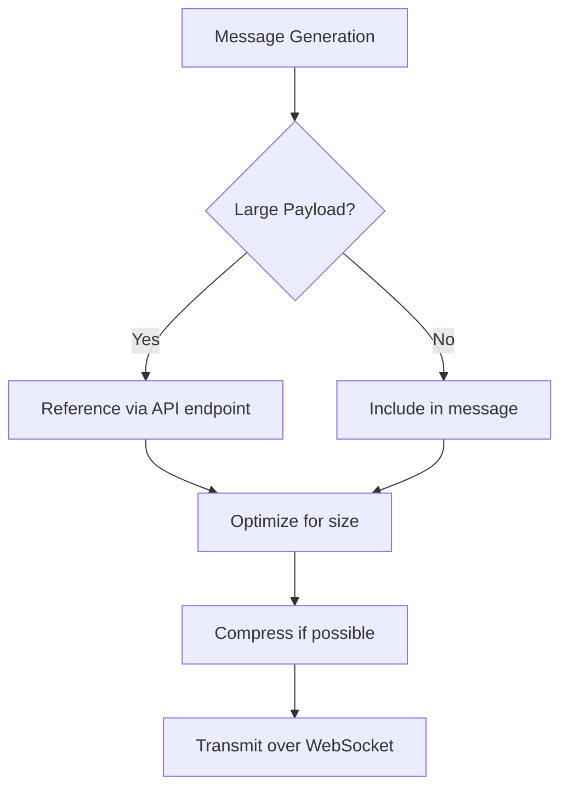

**Diagram sources**
- [socket.js](file://src/local_deep_research/web/static/js/services/socket.js#L288-L316)
- [logpanel.js](file://src/local_deep_research/web/static/js/components/logpanel.js#L288-L316)

**Section sources**
- [socket.js](file://src/local_deep_research/web/static/js/services/socket.js#L288-L316)
- [logpanel.js](file://src/local_deep_research/web/static/js/components/logpanel.js#L288-L316)

## Message Validation

Message validation occurs on both client and server sides to ensure data integrity and prevent injection attacks. The server validates all incoming messages against expected schemas, while the client validates received messages before processing them for display.

The validation system checks for required fields, proper data types, and acceptable value ranges. For example, progress values are validated to be between 0 and 100, and status values are checked against a predefined set of allowed values.

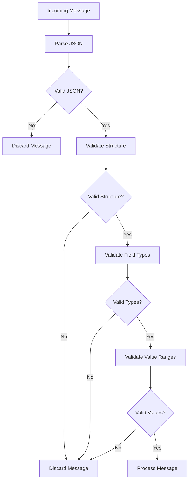

**Diagram sources**
- [socket_service.py](file://src/local_deep_research/web/services/socket_service.py#L196-L197)
- [socket.js](file://src/local_deep_research/web/static/js/services/socket.js#L419-L425)

**Section sources**
- [socket_service.py](file://src/local_deep_research/web/services/socket_service.py#L196-L197)
- [socket.js](file://src/local_deep_research/web/static/js/services/socket.js#L419-L425)

## Versioning and Backward Compatibility

The messaging system is designed with backward compatibility in mind, allowing older clients to work with newer server versions. New message fields are added as optional properties, ensuring that clients that don't recognize them can still process the core message content.

The system does not currently implement explicit version numbers in messages, relying instead on graceful degradation when encountering unknown fields. Future versions may introduce a version field in the message metadata to facilitate more sophisticated version negotiation.

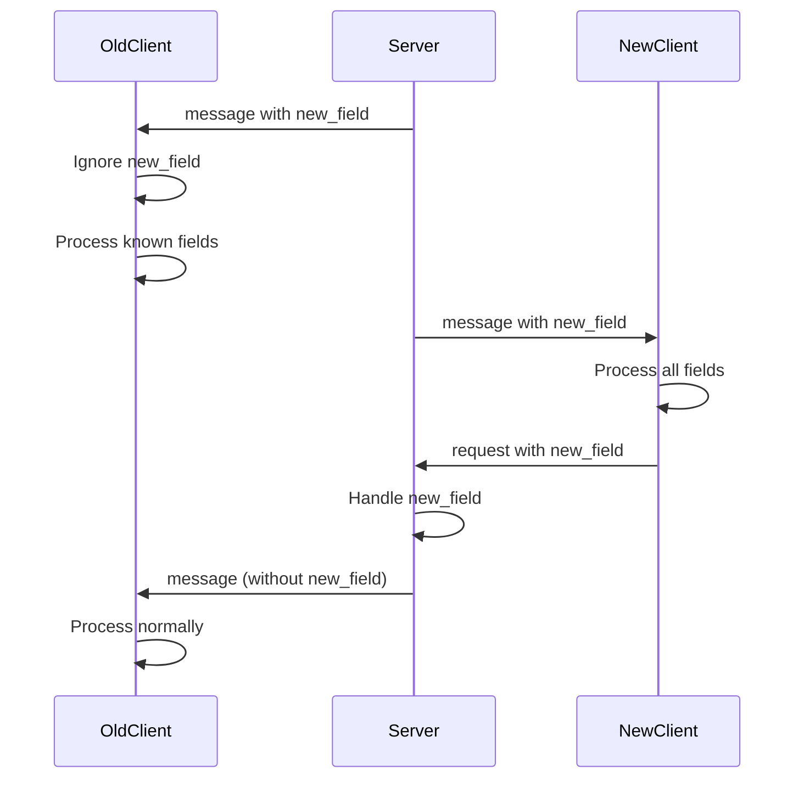

**Diagram sources**
- [socket.js](file://src/local_deep_research/web/static/js/services/socket.js#L204-L205)
- [socket_service.py](file://src/local_deep_research/web/services/socket_service.py#L222-L228)

**Section sources**
- [socket.js](file://src/local_deep_research/web/static/js/services/socket.js#L204-L205)
- [socket_service.py](file://src/local_deep_research/web/services/socket_service.py#L222-L228)

## Examples

This section provides concrete examples of properly formatted messages for each message type used in the local-deep-research WebSocket system.

### Subscription Request Example
```json
{
  "event": "subscribe_to_research",
  "data": {
    "research_id": "research-12345"
  }
}
```

### Progress Update Example
```json
{
  "event": "research_progress_research-12345",
  "data": {
    "status": "in_progress",
    "progress": 45,
    "message": "Searching with Google Scholar",
    "metadata": {
      "phase": "searching",
      "search_engine": "google_scholar",
      "result_count": 12
    },
    "log_entry": {
      "time": "2024-01-15T10:30:45.123Z",
      "message": "Initiated search with Google Scholar",
      "type": "info",
      "metadata": {
        "phase": "search_initiated"
      }
    }
  }
}
```

### Completion Notification Example
```json
{
  "event": "research_progress_research-12345",
  "data": {
    "status": "completed",
    "progress": 100,
    "message": "Research completed successfully",
    "metadata": {
      "phase": "complete",
      "report_available": true,
      "total_sources": 23
    },
    "log_entry": {
      "time": "2024-01-15T11:45:30.456Z",
      "message": "Research completed and report generated",
      "type": "milestone",
      "metadata": {
        "phase": "report_complete"
      }
    }
  }
}
```

### Error Notification Example
```json
{
  "event": "research_progress_research-12345",
  "data": {
    "status": "failed",
    "progress": 30,
    "message": "Search engine timeout",
    "metadata": {
      "phase": "synthesis_error",
      "error_type": "timeout",
      "retry_count": 2
    },
    "log_entry": {
      "time": "2024-01-15T10:45:20.789Z",
      "message": "Timeout occurred while querying search engine",
      "type": "error",
      "metadata": {
        "phase": "error",
        "error_type": "timeout"
      }
    }
  }
}
```

**Section sources**
- [socket_service.py](file://src/local_deep_research/web/services/socket_service.py#L219-L230)
- [socket.js](file://src/local_deep_research/web/static/js/services/socket.js#L219-L230)
- [research_routes.py](file://src/local_deep_research/web/routes/research_routes.py#L799-L801)