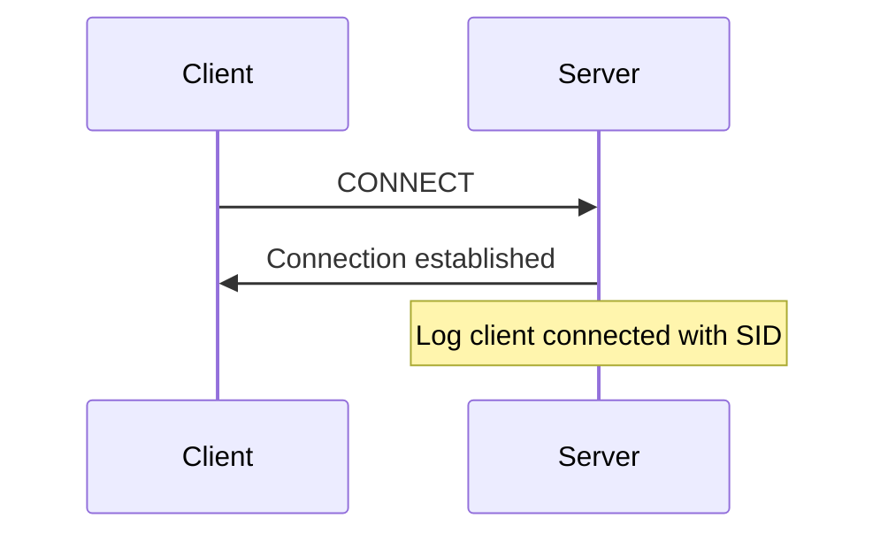
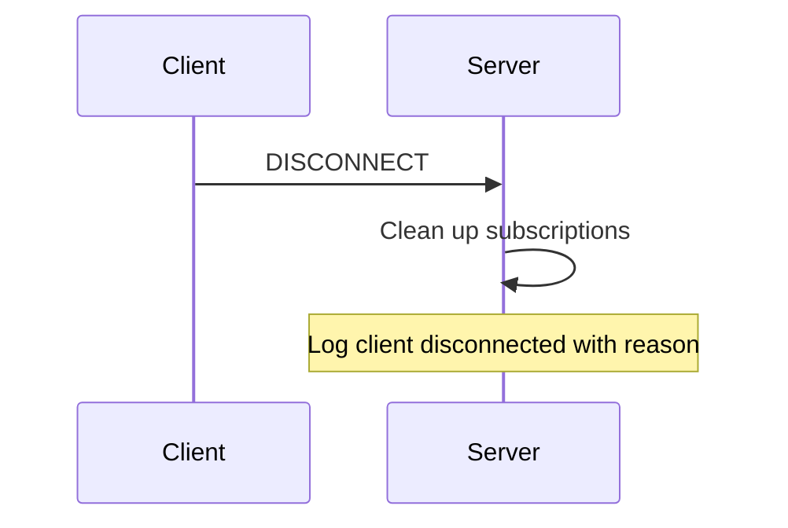
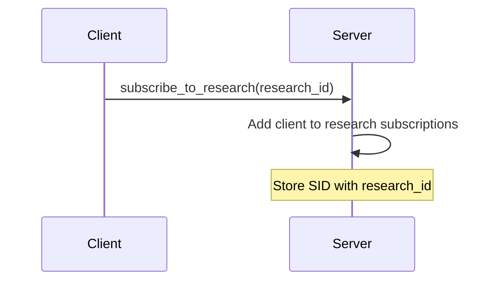
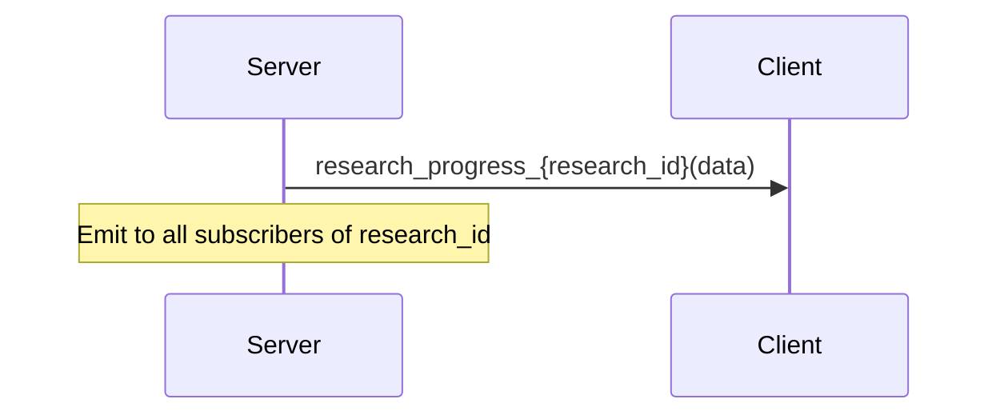
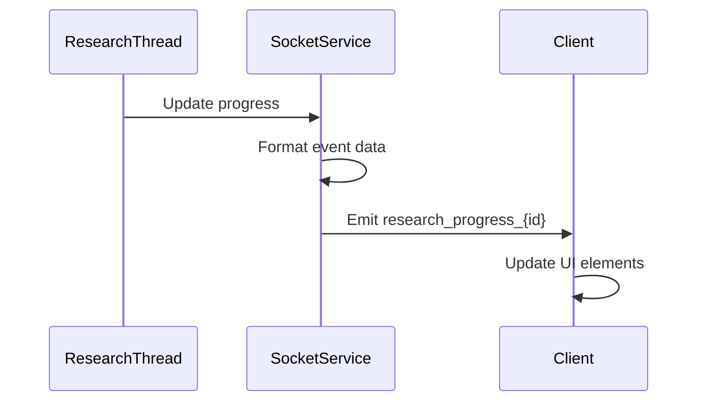
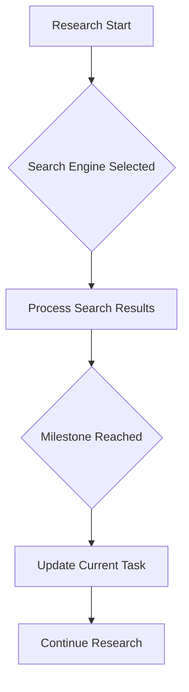
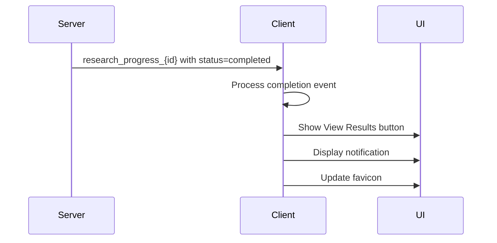

# WebSocket API

<cite>
**Referenced Files in This Document**   
- [socket_service.py](file://src/local_deep_research/web/services/socket_service.py)
- [socket.js](file://src/local_deep_research/web/static/js/services/socket.js)
- [progress.js](file://src/local_deep_research/web/static/js/components/progress.js)
- [research_routes.py](file://src/local_deep_research/web/routes/research_routes.py)
</cite>

## Table of Contents
1. [Introduction](#introduction)
2. [Connection Establishment](#connection-establishment)
3. [Message Formats](#message-formats)
4. [Event Types](#event-types)
5. [Progress Updates](#progress-updates)
6. [Status Changes](#status-changes)
7. [Intermediate Results](#intermediate-results)
8. [Completion Notifications](#completion-notifications)
9. [Error Handling](#error-handling)
10. [Reconnection Strategies](#reconnection-strategies)
11. [Message Acknowledgment Patterns](#message-acknowledgment-patterns)
12. [Implementation Examples](#implementation-examples)
13. [Performance Considerations](#performance-considerations)
14. [Connection Limits](#connection-limits)
15. [Security Aspects](#security-aspects)

## Introduction
The WebSocket API in the local-deep-research system provides real-time progress updates for research execution. This documentation details the connection establishment, message formats, event types, and disconnection handling for the WebSocket implementation. The system uses Socket.IO for bidirectional communication between the server and client, enabling real-time updates on research progress, status changes, intermediate results, and completion notifications.

The WebSocket service is implemented as a singleton class `SocketIOService` that manages connections and subscriptions. It integrates with the Flask application and provides methods for emitting events to clients. The client-side implementation handles connection management, reconnection strategies, and fallback to polling when WebSocket connections fail.

**Section sources**
- [socket_service.py](file://src/local_deep_research/web/services/socket_service.py#L1-L263)
- [socket.js](file://src/local_deep_research/web/static/js/services/socket.js#L1-L959)

## Connection Establishment
The WebSocket connection is established using Socket.IO with specific configuration parameters. The server-side `SocketIOService` class initializes the Socket.IO instance with the following configuration:

```python
self.__socketio = SocketIO(
    app,
    cors_allowed_origins="*",
    async_mode="threading",
    path="/socket.io",
    logger=False,
    engineio_logger=False,
    ping_timeout=20,
    ping_interval=5,
)
```

The client-side connection is initialized in the `initializeSocket` function, which creates a new socket instance with polling as the primary transport method to avoid WebSocket issues:

```javascript
socket = io(baseUrl, {
    path: '/socket.io',
    reconnection: true,
    reconnectionDelay: 1000,
    reconnectionAttempts: 5,
    transports: ['polling']  // Use only polling to avoid WebSocket issues
});
```

The connection is only initialized on research-related pages (containing '/research', '/progress', or '/benchmark' in the path). When the connection is established, the client automatically subscribes to research events for the current research ID.

**Section sources**
- [socket_service.py](file://src/local_deep_research/web/services/socket_service.py#L47-L56)
- [socket.js](file://src/local_deep_research/web/static/js/services/socket.js#L44-L51)

## Message Formats
The WebSocket API uses JSON-formatted messages for communication between server and client. Messages are structured as objects with various fields depending on the event type. The base message structure includes:

- `event`: The event name
- `data`: The payload data
- `room`: Optional room ID for targeted messaging

For research progress updates, the message structure includes:

- `progress`: Numeric progress percentage (0-100)
- `message`: Status message
- `status`: Research status (e.g., "in_progress", "completed")
- `log_entry`: Optional log entry with timestamp, message, type, and metadata
- `progress_log`: Optional array of log entries in JSON string format

The server emits messages using the `emit_socket_event` and `emit_to_subscribers` methods, while the client processes incoming messages through event handlers.

**Section sources**
- [socket_service.py](file://src/local_deep_research/web/services/socket_service.py#L105-L127)
- [socket.js](file://src/local_deep_research/web/static/js/services/socket.js#L200-L231)

## Event Types
The WebSocket API supports several event types for real-time communication:

### Connect Event
Emitted when a client successfully connects to the server. The server logs the connection with the client's session ID.



**Diagram sources**
- [socket_service.py](file://src/local_deep_research/web/services/socket_service.py#L68-L70)

### Disconnect Event
Emitted when a client disconnects from the server. The server cleans up subscriptions and logs the disconnection reason.



**Diagram sources**
- [socket_service.py](file://src/local_deep_research/web/services/socket_service.py#L72-L74)

### Subscribe to Research Event
Emitted when a client wants to subscribe to research updates. The server adds the client to the subscription list for the specified research ID.



**Diagram sources**
- [socket_service.py](file://src/local_deep_research/web/services/socket_service.py#L76-L80)

### Research Progress Event
Emitted to provide real-time progress updates for a specific research. The event name is formatted as `research_progress_{research_id}`.



**Diagram sources**
- [socket_service.py](file://src/local_deep_research/web/services/socket_service.py#L152-L153)

## Progress Updates
The WebSocket API provides real-time progress updates during research execution. Progress updates are emitted using the `emit_to_subscribers` method with the `research_progress` event base.

The progress update data structure includes:
- `progress`: Numeric progress percentage (0-100)
- `message`: Current status message
- `status`: Research status
- `log_entry`: Detailed log entry with metadata

The server emits progress updates whenever there is a change in the research state. The client processes these updates and updates the UI accordingly, including the progress bar, status text, and current task display.



**Diagram sources**
- [socket_service.py](file://src/local_deep_research/web/services/socket_service.py#L129-L175)
- [progress.js](file://src/local_deep_research/web/static/js/components/progress.js#L439-L485)

## Status Changes
The WebSocket API communicates research status changes in real-time. The system tracks several status states:

- `in_progress`: Research is actively being processed
- `completed`: Research has completed successfully
- `failed`: Research failed due to an error
- `cancelled`: Research was cancelled by the user
- `queued`: Research is waiting in the queue

When a status change occurs, the server emits a progress event with the updated status. The client handles these status changes by updating the UI, showing appropriate buttons (like "View Results" for completed research), and displaying notifications.

The status change flow includes:
1. Research state changes in the backend
2. Server emits progress event with new status
3. Client receives and processes the event
4. UI updates based on the new status
5. Additional actions (like showing notifications) are triggered

**Section sources**
- [research_routes.py](file://src/local_deep_research/web/routes/research_routes.py#L793-L795)
- [progress.js](file://src/local_deep_research/web/static/js/components/progress.js#L617-L661)

## Intermediate Results
During research execution, intermediate results are communicated through the WebSocket connection. These include:

- Search engine selection events
- Individual search results
- Processing milestones
- Synthesis progress

The `search_engine_selected` event is emitted when a search engine is selected, containing information about the engine and number of results found:

```javascript
{
    "event": "search_engine_selected",
    "engine": "searxng",
    "result_count": 10
}
```

Log entries with phase metadata indicate intermediate milestones in the research process. The client processes these entries and displays them in the console log, with special handling for milestone events that update the current task display.



**Diagram sources**
- [socket.js](file://src/local_deep_research/web/static/js/services/socket.js#L100-L119)
- [progress.js](file://src/local_deep_research/web/static/js/components/progress.js#L317-L332)

## Completion Notifications
When research completes (successfully or with errors), the system sends completion notifications through the WebSocket connection. The completion event includes the final status and appropriate messaging.

For successful completion:
```javascript
{
    "status": "completed",
    "message": "Research has been completed successfully"
}
```

For failed research:
```javascript
{
    "status": "failed",
    "message": "Research failed due to an error"
}
```

The client handles completion notifications by:
1. Clearing polling intervals
2. Updating the UI to reflect completion status
3. Showing appropriate buttons (View Results or Start New Research)
4. Displaying desktop or in-app notifications
5. Updating the favicon and page title



**Diagram sources**
- [research_routes.py](file://src/local_deep_research/web/routes/research_routes.py#L793-L795)
- [progress.js](file://src/local_deep_research/web/static/js/components/progress.js#L617-L661)

## Error Handling
The WebSocket API includes comprehensive error handling for both server and client sides.

### Server-Side Error Handling
The `SocketIOService` class implements error handlers for Socket.IO errors:

```python
@self.__socketio.on_error
def on_error(e):
    self.__log_exception(f"Socket.IO error: {str(e)}")
    return False

@self.__socketio.on_error_default
def on_default_error(e):
    self.__log_exception(f"Unhandled Socket.IO error: {str(e)}")
    return False
```

These handlers log errors without propagating exceptions that could crash the server.

### Client-Side Error Handling
The client implements multiple fallback mechanisms:

1. **Polling Fallback**: When WebSocket connection fails, the system falls back to HTTP polling
2. **Error Notifications**: User-friendly error messages are displayed for different error types
3. **Graceful Degradation**: The UI remains functional even when WebSocket is unavailable

```javascript
socket.on('connect_error', (error) => {
    connectionAttempts++;
    if (connectionAttempts >= MAX_CONNECTION_ATTEMPTS) {
        usingPolling = true;
        if (currentResearchId && typeof window.pollResearchStatus === 'function') {
            window.pollResearchStatus(currentResearchId);
        }
    }
});
```

Special handling exists for synthesis errors, which display prominent notifications with user-friendly error messages based on the error type (timeout, token_limit, connection, rate_limit, etc.).

**Section sources**
- [socket_service.py](file://src/local_deep_research/web/services/socket_service.py#L232-L242)
- [socket.js](file://src/local_deep_research/web/static/js/services/socket.js#L84-L97)

## Reconnection Strategies
The WebSocket API implements robust reconnection strategies to maintain real-time updates during network disruptions.

### Client-Side Reconnection
The client configures Socket.IO with automatic reconnection:

```javascript
socket = io(baseUrl, {
    reconnection: true,
    reconnectionDelay: 1000,
    reconnectionAttempts: 5,
    transports: ['polling']
});
```

When a reconnection occurs, the client automatically resubscribes to research events:

```javascript
socket.on('reconnect', (attemptNumber) => {
    console.log('Socket reconnected after', attemptNumber, 'attempts');
    connectionAttempts = 0;
    
    // Re-subscribe to current research if any
    if (currentResearchId) {
        subscribeToResearch(currentResearchId);
    }
});
```

A callback mechanism allows components to register for reconnection events:

```javascript
window.socket.onReconnect(() => {
    console.log('Socket reconnected, resubscribing to research events');
    window.socket.subscribeToResearch(currentResearchId, handleProgressUpdate);
});
```

### Server-Side Session Management
The server maintains subscription state using a dictionary that maps research IDs to sets of client session IDs. When a client reconnects, it resubscribes to the research, and the server adds the new session ID to the subscription set.

**Section sources**
- [socket.js](file://src/local_deep_research/web/static/js/services/socket.js#L131-L134)
- [socket_service.py](file://src/local_deep_research/web/services/socket_service.py#L194-L207)

## Message Acknowledgment Patterns
The WebSocket API uses a fire-and-forget pattern for message delivery, with built-in error handling and retry mechanisms.

### Server-Side Emission
The `emit_socket_event` and `emit_to_subscribers` methods return boolean values indicating success or failure:

```python
def emit_socket_event(self, event, data, room=None):
    try:
        if room:
            self.__socketio.emit(event, data, room=room)
        else:
            self.__socketio.emit(event, data)
        return True
    except Exception as e:
        logger.exception(f"Error emitting socket event {event}: {str(e)}")
        return False
```

The `emit_to_subscribers` method attempts to deliver messages to individual subscribers, logging errors for failed deliveries but continuing with other subscribers.

### Client-Side Processing
The client processes messages and acknowledges receipt through UI updates and logging. For critical operations, the system falls back to polling to ensure no updates are missed.

The message deduplication system prevents duplicate log entries by tracking processed messages:

```javascript
window._processedSocketMessages = window._processedSocketMessages || new Map();
const messageKey = `${logItem.time}-${logItem.message}`;
if (window._processedSocketMessages.has(messageKey)) {
    console.log('Skipping duplicate socket message:', logItem.message);
} else {
    window._processedSocketMessages.set(messageKey, Date.now());
    // Process message
}
```

**Section sources**
- [socket_service.py](file://src/local_deep_research/web/services/socket_service.py#L117-L127)
- [socket.js](file://src/local_deep_research/web/static/js/services/socket.js#L290-L315)

## Implementation Examples
### Server-Side Example
```python
# Initialize SocketIOService with Flask app
socket_service = SocketIOService(app=flask_app)

# Emit progress update to research subscribers
socket_service.emit_to_subscribers(
    "research_progress",
    research_id,
    {
        "progress": 50,
        "message": "Processing search results",
        "status": "in_progress",
        "log_entry": {
            "time": "2023-12-07T10:30:00Z",
            "message": "Processing search results",
            "type": "info",
            "metadata": {"phase": "processing"}
        }
    }
)
```

### Client-Side Example
```javascript
// Subscribe to research updates
window.socket.subscribeToResearch(researchId, handleProgressUpdate);

// Handle progress updates
function handleProgressUpdate(data) {
    console.log('Received progress update:', data);
    
    // Update progress bar
    if (data.progress !== undefined) {
        updateProgressBar(data.progress);
    }
    
    // Add log entry if available
    if (data.log_entry) {
        window.addConsoleLog(
            data.log_entry.message,
            data.log_entry.type,
            data.log_entry.metadata
        );
    }
    
    // Handle completion
    if (data.status === 'completed' || data.status === 'failed') {
        handleResearchCompletion(data);
    }
}

// Handle reconnection
window.socket.onReconnect(() => {
    console.log('Socket reconnected, resubscribing');
    window.socket.subscribeToResearch(researchId, handleProgressUpdate);
});
```

**Section sources**
- [socket_service.py](file://src/local_deep_research/web/services/socket_service.py#L129-L175)
- [socket.js](file://src/local_deep_research/web/static/js/services/socket.js#L155-L184)

## Performance Considerations
The WebSocket implementation includes several performance optimizations:

### Connection Efficiency
- Uses polling as the primary transport method to avoid WebSocket handshake overhead
- Implements connection reuse through the singleton pattern
- Minimizes message size by using efficient JSON serialization

### Message Optimization
- Batches log entries in the `progress_log` field to reduce message frequency
- Implements message deduplication to prevent redundant processing
- Uses efficient data structures for subscription tracking (sets and dictionaries)

### Resource Management
- Cleans up subscriptions on disconnect to prevent memory leaks
- Implements proper error handling to prevent uncaught exceptions
- Uses thread-safe operations for shared state access

### Scalability
- Supports multiple concurrent research sessions
- Efficiently handles multiple clients subscribed to the same research
- Implements proper cleanup of inactive connections

The system is designed to handle the real-time update requirements of research execution while maintaining responsiveness and minimizing resource usage.

**Section sources**
- [socket_service.py](file://src/local_deep_research/web/services/socket_service.py#L58-L65)
- [socket.js](file://src/local_deep_research/web/static/js/services/socket.js#L290-L370)

## Connection Limits
The WebSocket implementation manages connection limits through several mechanisms:

### Concurrent Research Limits
The system enforces a maximum number of concurrent research sessions per user, configurable through settings:

```python
max_concurrent_researches = settings_manager.get_setting(
    "app.max_concurrent_researches", 3
)
```

When this limit is reached, new research requests are queued rather than started immediately.

### Connection Management
- Each client connection is tracked by session ID
- Subscriptions are cleaned up on disconnect
- The system falls back to polling when WebSocket connections fail
- Connection attempts are limited to prevent abuse

### Resource Constraints
- Memory usage is optimized by using efficient data structures
- CPU usage is minimized by batching updates
- Network bandwidth is conserved by using compact message formats

The connection management system ensures stable operation even under heavy load, with graceful degradation when limits are reached.

**Section sources**
- [research_routes.py](file://src/local_deep_research/web/routes/research_routes.py#L286-L288)
- [socket_service.py](file://src/local_deep_research/web/services/socket_service.py#L58-L65)

## Security Aspects
The WebSocket implementation includes several security features:

### Authentication
- WebSocket connections require user authentication
- Research access is restricted to the owning user
- Session management ensures proper user context

### Data Protection
- All communication occurs over the same origin as the main application
- CORS is configured to allow connections from any origin (appropriate for local applications)
- Sensitive data is protected through application-level access controls

### Error Security
- Error messages are sanitized to prevent information disclosure
- Exception details are logged server-side but not exposed to clients
- The system gracefully handles malformed messages

### Connection Security
- The implementation includes protection against connection flooding
- Proper cleanup prevents resource exhaustion
- The fallback to polling ensures functionality even when WebSocket is blocked

The security model leverages the existing application authentication and authorization system, ensuring that WebSocket communications are as secure as the rest of the application.

**Section sources**
- [socket_service.py](file://src/local_deep_research/web/services/socket_service.py#L49-L50)
- [research_routes.py](file://src/local_deep_research/web/routes/research_routes.py#L59-L60)