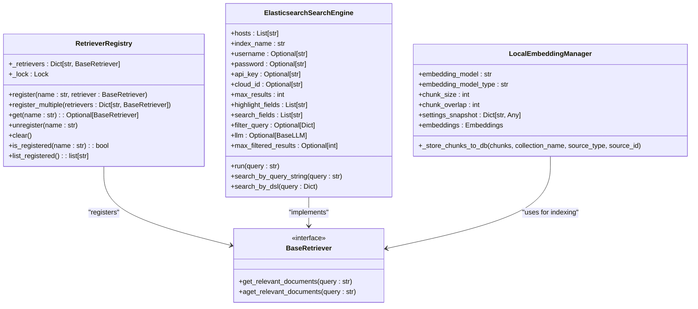
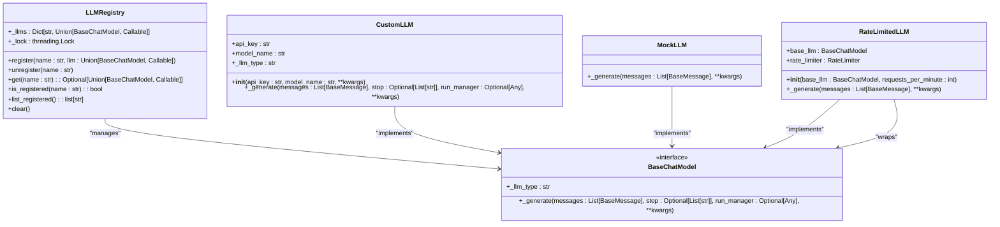
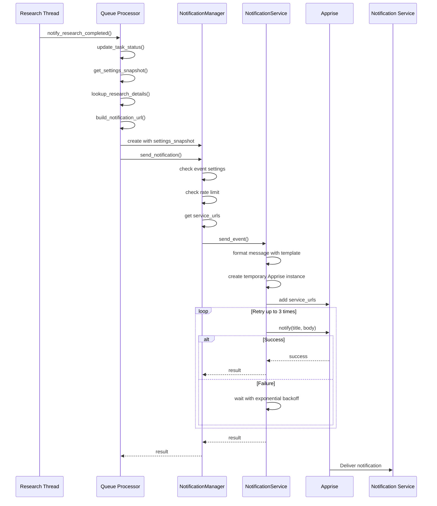
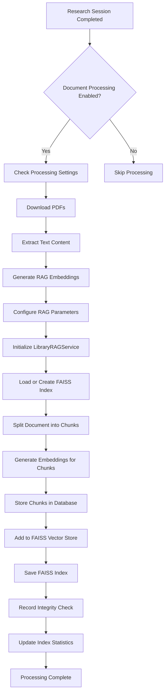

# Advanced Features

<cite>
**Referenced Files in This Document**   
- [LANGCHAIN_RETRIEVER_INTEGRATION.md](file://docs/LANGCHAIN_RETRIEVER_INTEGRATION.md)
- [CUSTOM_LLM_INTEGRATION.md](file://docs/CUSTOM_LLM_INTEGRATION.md)
- [NOTIFICATIONS.md](file://docs/NOTIFICATIONS.md)
- [NOTIFICATION_FLOW.md](file://docs/NOTIFICATION_FLOW.md)
- [search-engines.md](file://docs/search-engines.md)
- [elasticsearch_search_engine.md](file://docs/elasticsearch_search_engine.md)
- [library_rag_service.py](file://src/local_deep_research/research_library/services/library_rag_service.py)
- [document_scheduler.py](file://src/local_deep_research/research_scheduler/document_scheduler.py)
- [retriever_registry.py](file://src/local_deep_research/web_search_engines/retriever_registry.py)
- [llm_registry.py](file://src/local_deep_research/llm/llm_registry.py)
- [templates.py](file://src/local_deep_research/notifications/templates.py)
- [scheduler.py](file://src/local_deep_research/news/subscription_manager/scheduler.py)
</cite>

## Table of Contents
1. [LangChain Retriever Integration](#langchain-retriever-integration)
2. [Custom Search Engine System](#custom-search-engine-system)
3. [Custom LLM Provider Development](#custom-llm-provider-development)
4. [Notification System Architecture](#notification-system-architecture)
5. [Research Subscription Functionality](#research-subscription-functionality)
6. [Research Library Features](#research-library-features)

## LangChain Retriever Integration

The system provides seamless integration with LangChain retrievers, allowing users to leverage any LangChain-compatible retriever as a search engine within the research workflow. This integration enables the use of vector stores, databases, or custom retriever implementations with the system's research capabilities.

The integration works by allowing users to pass retrievers as a dictionary to any research function, where each retriever is assigned a name (dictionary key) and can be used by setting the `search_tool` parameter to its name. Retrievers function identically to built-in search engines, providing a consistent interface across different data sources.

This approach supports various LangChain `BaseRetriever` implementations including vector stores (FAISS, Chroma, Pinecone, Weaviate, Qdrant), cloud services (Vertex AI, AWS Bedrock, Azure Cognitive Search), databases (PostgreSQL, MongoDB, Elasticsearch), and any custom class inheriting from `BaseRetriever`.

The system offers flexible usage patterns, including single retriever usage, multiple retrievers for comprehensive searches, hybrid search combining retrievers with web search engines, and selective usage when multiple retrievers are available. This flexibility allows users to tailor their research approach to specific needs, whether focusing on a single knowledge base or combining multiple sources for comprehensive analysis.

**Section sources**
- [LANGCHAIN_RETRIEVER_INTEGRATION.md](file://docs/LANGCHAIN_RETRIEVER_INTEGRATION.md#L1-L164)
- [search-engines.md](file://docs/search-engines.md#L150-L164)

## Custom Search Engine System

The system implements a flexible custom search engine framework that allows users to integrate various search sources beyond the built-in options. The architecture is built around a registry pattern that enables dynamic registration of search engines at runtime.

At the core of this system is the `RetrieverRegistry` class, which provides a thread-safe mechanism for registering, retrieving, and managing LangChain retrievers as search engines. This registry allows users to programmatically register retrievers and use them within the research workflow. The registry supports operations for registering single or multiple retrievers, retrieving registered retrievers by name, unregistering retrievers, and listing all registered retrievers.

The system supports various search engine types categorized into free search engines (no API key required), premium search engines (require API keys), and custom sources. Free search engines include academic sources like arXiv, PubMed, and Semantic Scholar; general purpose engines like Wikipedia and SearXNG; technical search engines like GitHub; and specialized engines like the Wayback Machine for historical content.

For enterprise knowledge base applications, the system provides specific integration for Elasticsearch, allowing users to search within their Elasticsearch clusters. The Elasticsearch integration includes a dedicated search engine class with configurable parameters such as hosts, index name, authentication credentials, and search fields. Additionally, a utility class `ElasticsearchManager` is provided to simplify indexing data into Elasticsearch, supporting operations like creating indices, indexing single documents, bulk indexing, and indexing files with automatic content extraction.

The system also supports local document search, enabling users to search private documents in various formats including PDF, TXT, MD, DOCX, and CSV. This feature allows organizations to incorporate their internal documentation into the research process while maintaining data privacy.

**Diagram sources **
- [retriever_registry.py](file://src/local_deep_research/web_search_engines/retriever_registry.py#L1-L110)
- [elasticsearch_search_engine.md](file://docs/elasticsearch_search_engine.md#L1-L155)

**Section sources**
- [search-engines.md](file://docs/search-engines.md#L1-L253)
- [elasticsearch_search_engine.md](file://docs/elasticsearch_search_engine.md#L1-L155)
- [retriever_registry.py](file://src/local_deep_research/web_search_engines/retriever_registry.py#L1-L110)

## Custom LLM Provider Development

The system supports integration with custom LangChain LLMs, enabling users to utilize proprietary models, specialized wrappers, third-party LLM providers, or fine-tuned models alongside the built-in options. This extensibility allows for customized model configurations, custom retry logic, preprocessing, and testing with mock LLMs.

The integration is facilitated through an LLM registry system that allows users to register any LangChain-compatible LLM and use it throughout the system. The `LLMRegistry` class provides a thread-safe mechanism for managing custom LLMs with operations for registration, retrieval, and management. Custom LLMs can be registered either as instances or as factory functions, providing flexibility in how models are instantiated and configured.

To implement a custom LLM, the class must inherit from `langchain_core.language_models.BaseChatModel` and implement the required methods such as `_generate` and `_llm_type`. The `_generate` method handles the actual model invocation and response processing, converting the response to the standard LangChain format. The `_llm_type` property returns an identifier for the LLM.

The system supports multiple usage patterns for custom LLMs, including using them with different research modes (quick summary, detailed research, report generation), combining multiple custom LLMs for different purposes, and integrating custom LLMs with retrievers for enhanced research capabilities. Advanced usage patterns include factory functions with configuration parameters, allowing for dynamic model creation with specific settings like temperature, max retries, and other custom parameters.

The implementation includes best practices for custom LLM development, such as consistent naming, proper error handling, token counting support, temperature handling, and async support when applicable. Common use cases include fine-tuned models for domain-specific research, mock LLMs for testing, and rate-limited wrappers to manage API usage.

**Diagram sources **
- [llm_registry.py](file://src/local_deep_research/llm/llm_registry.py#L1-L162)
- [CUSTOM_LLM_INTEGRATION.md](file://docs/CUSTOM_LLM_INTEGRATION.md#L1-L276)

**Section sources**
- [CUSTOM_LLM_INTEGRATION.md](file://docs/CUSTOM_LLM_INTEGRATION.md#L1-L276)
- [llm_registry.py](file://src/local_deep_research/llm/llm_registry.py#L1-L162)

## Notification System Architecture

The notification system provides a flexible mechanism for sending notifications to various services when important events occur, such as research completion, failures, or subscription updates. Built on the Apprise library, the system supports multiple notification services with a unified API, including Discord, Slack, Telegram, email (SMTP), Pushover, Gotify, and many others.

The system architecture consists of three main components: `NotificationManager`, `NotificationService`, and settings integration. The `NotificationManager` serves as the high-level manager handling rate limiting, settings, and user preferences. The `NotificationService` is the low-level service that uses Apprise to send notifications. Settings integration enables user-specific configuration for services and event preferences.

Key architectural features include per-user rate limiting, where each user can configure their own rate limits independently, ensuring fair resource allocation in multi-user deployments. The system implements a shared rate limiter with per-user limits, maintaining separate counters for each user while using a single rate limiter instance for memory efficiency. Rate limits are enforced per-user, so one user hitting their limit does not affect other users.

The system employs a settings snapshot pattern to ensure thread safety when sending notifications from background threads. Instead of passing database sessions to the notification manager, settings are captured once with a database session and passed as a snapshot. This approach avoids thread-safety issues while maintaining consistent settings throughout the notification process.

Security features include encrypted storage of notification service URLs (including credentials) using SQLCipher (AES-256) in per-user encrypted databases. The encryption key is derived from the user's login password using PBKDF2-SHA512, implementing a zero-knowledge architecture where notification settings cannot be recovered without the password. Service URLs are automatically masked in logs to prevent credential exposure.

The notification flow follows a comprehensive sequence from event occurrence to delivery. For research completion, the flow begins with the research thread completing, which triggers cleanup and notifies the queue processor. The queue processor updates the queue status and delegates to a helper method that builds the notification context, including query, research ID, summary, and full URL. The `NotificationManager` then checks event-specific settings, rate limits, and service URLs before sending the notification through the `NotificationService`.

The `NotificationService` formats the message using templates and sends it via Apprise with retry logic that includes exponential backoff (0.5s → 1.0s → 2.0s) for transient network issues. Apprise handles the actual delivery to configured services, supporting multiple service URLs simultaneously.

**Diagram sources **
- [NOTIFICATIONS.md](file://docs/NOTIFICATIONS.md#L1-L262)
- [NOTIFICATION_FLOW.md](file://docs/NOTIFICATION_FLOW.md#L1-L618)
- [templates.py](file://src/local_deep_research/notifications/templates.py#L1-L231)

**Section sources**
- [NOTIFICATIONS.md](file://docs/NOTIFICATIONS.md#L1-L262)
- [NOTIFICATION_FLOW.md](file://docs/NOTIFICATION_FLOW.md#L1-L618)
- [templates.py](file://src/local_deep_research/notifications/templates.py#L1-L231)

## Research Subscription Functionality

The research subscription system provides automated scheduling capabilities for regular research tasks and content monitoring. Built on a singleton scheduler architecture using APScheduler, the system manages subscriptions for active users by monitoring user activity and temporarily storing credentials for automatic updates.

The `NewsScheduler` class implements the core scheduling functionality, tracking user activity through database access and automatically scheduling subscription checks based on configured refresh intervals. The scheduler supports various subscription types including search subscriptions (monitoring search results) and topic subscriptions (tracking specific topics). Each subscription can be configured with different refresh frequencies, from frequent intervals (every few minutes) to less frequent schedules (daily or weekly).

A key feature of the system is its activity-based user management. When a user interacts with the system, their credentials are temporarily stored in memory, and their subscriptions are scheduled for automatic updates. The scheduler tracks user activity and automatically cleans up inactive users after a configurable retention period (default 48 hours), ensuring security by not persisting credentials longer than necessary.

The system includes comprehensive configuration options that can be managed through user settings, including enabling/disabling the scheduler, setting retention hours, cleanup intervals, maximum jitter for scheduling, maximum concurrent jobs, subscription batch size, and activity check intervals. These settings allow administrators to balance between timely updates and system resource usage.

The scheduler implements intelligent scheduling with jitter to prevent multiple users' subscriptions from running simultaneously, which could overwhelm external services. For subscriptions with refresh intervals of 60 minutes or less, the system uses interval triggers, while longer intervals use date triggers with calculated next run times. This approach ensures efficient resource utilization while maintaining timely updates.

The system also supports manual triggering of subscription updates, allowing users to force immediate processing when needed. Error handling is robust, with logging of scheduling errors and automatic recovery from transient issues.

**Section sources**
- [scheduler.py](file://src/local_deep_research/news/subscription_manager/scheduler.py#L1-L800)

## Research Library Features

The research library system provides comprehensive document management, RAG (Retrieval-Augmented Generation) capabilities, and PDF processing functionality. This system enables users to build and maintain a personal or organizational knowledge base that can be leveraged in research workflows.

The library architecture is built around several core services: `DownloadService` for managing PDF downloads, `LibraryService` for general library operations, and `LibraryRAGService` for RAG indexing and search capabilities. The system supports various document formats including PDF, TXT, MD, DOCX, CSV, and more, with automatic text extraction and processing.

The RAG implementation uses FAISS as the vector store for efficient similarity search, with configurable embedding models (supporting both sentence_transformers and Ollama providers) and text splitting strategies (recursive, token, sentence, and semantic chunking). Documents are chunked according to configurable parameters (chunk size and overlap) and indexed into the vector database, enabling semantic search across the library.

Key features of the research library include:

- **Document indexing**: Automatic indexing of documents into vector databases with configurable parameters
- **Chunking strategies**: Support for multiple text splitting methods to optimize retrieval quality
- **Embedding models**: Flexible configuration of embedding models and providers
- **FAISS index management**: Creation, loading, and maintenance of FAISS indices with integrity verification
- **Collection-based organization**: Documents organized into collections for targeted searching
- **Metadata preservation**: Document metadata (authors, publication date, DOI, etc.) preserved and searchable

The system also includes automated document processing through the document scheduler, which can be configured to automatically process completed research sessions. This functionality includes downloading PDFs from research sources, extracting text content, and generating RAG embeddings for new documents.

The `LibraryRAGService` class provides the core RAG functionality, handling the entire workflow from document ingestion to vector storage. It manages the creation and loading of FAISS indices, text splitting using configurable splitters, embedding generation using the selected model, and storage of chunks in both the vector database and the application database for provenance tracking.

The system implements integrity verification for FAISS indexes, ensuring data consistency and automatically rebuilding corrupted indexes. It also handles embedding dimension mismatches by detecting when the current model returns a different dimension than the stored index and automatically recreating the index with the correct dimensions.

**Diagram sources **
- [library_rag_service.py](file://src/local_deep_research/research_library/services/library_rag_service.py#L1-L800)
- [document_scheduler.py](file://src/local_deep_research/research_scheduler/document_scheduler.py#L1-L98)

**Section sources**
- [library_rag_service.py](file://src/local_deep_research/research_library/services/library_rag_service.py#L1-L800)
- [document_scheduler.py](file://src/local_deep_research/research_scheduler/document_scheduler.py#L1-L98)