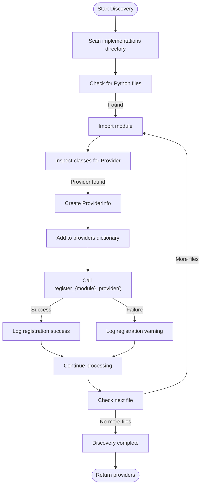
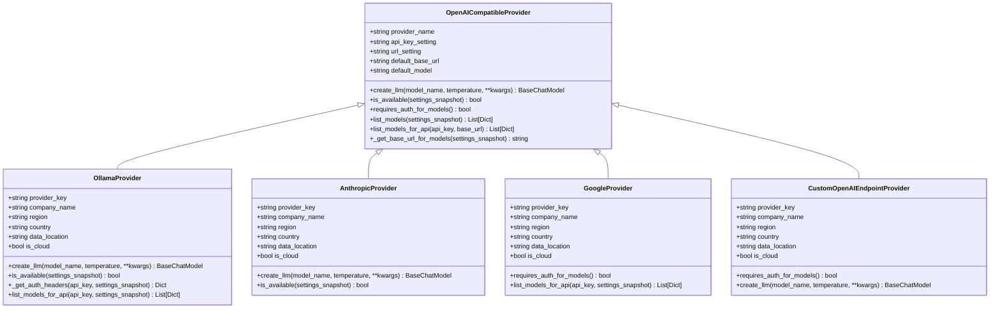
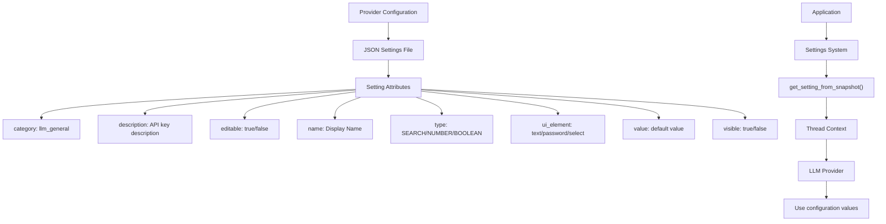
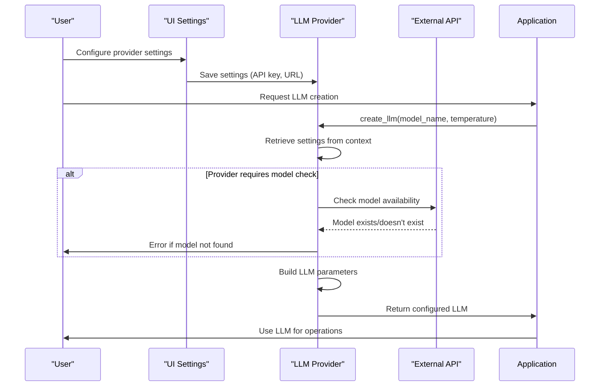

# Custom LLM Provider Integration

<cite>
**Referenced Files in This Document**   
- [openai_base.py](file://src/local_deep_research/llm/providers/openai_base.py)
- [auto_discovery.py](file://src/local_deep_research/llm/providers/auto_discovery.py)
- [llm_registry.py](file://src/local_deep_research/llm/llm_registry.py)
- [ollama.py](file://src/local_deep_research/llm/providers/implementations/ollama.py)
- [anthropic.py](file://src/local_deep_research/llm/providers/implementations/anthropic.py)
- [google.py](file://src/local_deep_research/llm/providers/implementations/google.py)
- [custom_openai_endpoint.py](file://src/local_deep_research/llm/providers/implementations/custom_openai_endpoint.py)
- [google_settings.json](file://src/local_deep_research/defaults/llm_providers/google_settings.json)
- [ionos_settings.json](file://src/local_deep_research/defaults/llm_providers/ionos_settings.json)
</cite>

## Table of Contents
1. [Provider Registration System](#provider-registration-system)
2. [Auto-Discovery Mechanism](#auto-discovery-mechanism)
3. [OpenAICompatibleProvider Base Class](#openaicompatibleprovider-base-class)
4. [Creating Custom Providers](#creating-custom-providers)
5. [Provider Configuration System](#provider-configuration-system)
6. [Custom OpenAI Endpoint Feature](#custom-openai-endpoint-feature)
7. [Provider Implementation Examples](#provider-implementation-examples)
8. [Testing and Error Handling](#testing-and-error-handling)

## Provider Registration System

The LLM provider registration system uses a global registry pattern to manage custom LangChain LLMs. The system provides a thread-safe registry that allows providers to be registered, retrieved, and unregistered dynamically. The registry supports both direct LLM instances and factory functions that create LLM instances on demand.

The registration system is implemented in the `LLMRegistry` class, which maintains a dictionary of LLMs with case-insensitive names. When a provider is registered, it is normalized to lowercase for storage, ensuring consistent access regardless of case. The registry includes methods for registering, unregistering, retrieving, and listing LLMs, as well as checking registration status and clearing all registered providers.

Each provider is registered with a unique name and either a BaseChatModel instance or a callable factory function. The registration process includes logging to track provider registration and potential overwrites of existing providers. The system also provides a global registry instance and public API functions that wrap the registry methods for easier access.

**Section sources**
- [llm_registry.py](file://src/local_deep_research/llm/llm_registry.py#L1-L162)

## Auto-Discovery Mechanism

The auto-discovery mechanism scans the implementations directory to automatically detect and register available LLM providers. This system uses Python's importlib and inspect modules to dynamically load provider modules and identify provider classes. The discovery process occurs when the providers module is imported, ensuring all providers are available immediately.

The discovery system scans the implementations subdirectory for Python files, excluding special files that start with underscores. For each Python file found, it imports the module and inspects its classes to find those that end with "Provider" and have a provider_name attribute. When a provider class is discovered, it creates a ProviderInfo object containing metadata about the provider and adds it to the internal providers dictionary.

The auto-discovery system also attempts to automatically register each discovered provider by calling a module-specific registration function (e.g., register_ollama_provider). If the registration function doesn't exist, it logs a warning but continues processing other providers. The system maintains a singleton pattern to ensure discovery only occurs once per application lifecycle, with an option to force refresh if needed.

**Diagram sources**
- [auto_discovery.py](file://src/local_deep_research/llm/providers/auto_discovery.py#L1-L270)

**Section sources**
- [auto_discovery.py](file://src/local_deep_research/llm/providers/auto_discovery.py#L1-L270)
- [__init__.py](file://src/local_deep_research/llm/providers/__init__.py#L1-L21)

## OpenAICompatibleProvider Base Class

The OpenAICompatibleProvider base class serves as a foundation for implementing providers that interface with OpenAI-compatible API endpoints. This abstract base class provides common functionality for authentication, configuration, and model management, reducing code duplication across different providers.

The base class defines several class-level attributes that should be overridden by subclasses, including provider_name (display name), api_key_setting (settings key for API key), url_setting (settings key for endpoint URL), default_base_url (default API endpoint), and default_model (default model to use). These attributes allow each provider to customize its behavior while maintaining a consistent interface.

The class includes several key methods: create_llm for creating configured LLM instances, is_available for checking provider availability, requires_auth_for_models for determining if authentication is needed to list models, and list_models for retrieving available models from the provider. The create_llm method handles common configuration such as API key retrieval, endpoint URL normalization, and parameter construction for the underlying LangChain client.

The base class also implements error handling and logging to provide consistent feedback during provider initialization and operation. It integrates with the application's settings system to retrieve configuration values from the current context, ensuring thread-safe access to settings without direct database queries.

**Diagram sources**
- [openai_base.py](file://src/local_deep_research/llm/providers/openai_base.py#L1-L340)

**Section sources**
- [openai_base.py](file://src/local_deep_research/llm/providers/openai_base.py#L1-L340)

## Creating Custom Providers

Creating a new LLM provider involves implementing a provider-specific class that inherits from the appropriate base class and registering it with the LLM registry. The implementation process follows a consistent pattern across different provider types, with specific variations based on the underlying API and authentication requirements.

To create a custom provider, first define a new class that inherits from OpenAICompatibleProvider (for OpenAI-compatible APIs) or implements the necessary interfaces for non-compatible APIs. The class should override key attributes such as provider_name, api_key_setting, url_setting, default_base_url, and default_model to match the specific provider's configuration.

The provider class must implement the create_llm method to return a configured LLM instance, typically using the appropriate LangChain integration (e.g., ChatOpenAI, ChatAnthropic). The method should handle authentication, endpoint configuration, and parameter construction based on the application's settings. For providers that require special handling for model listing, the list_models_for_api method should be overridden to implement the specific API calls needed.

Each provider implementation should include metadata attributes (provider_key, company_name, region, country, data_location, is_cloud) used by the auto-discovery system to display provider information in the UI. The implementation should also include error handling for common issues such as network connectivity problems, authentication failures, and model availability.

Finally, the provider must be registered with the LLM registry through a standalone registration function (e.g., register_myprovider_provider) that calls the global register_llm function with the provider name and factory function. This ensures the provider is available for use within the application.

**Section sources**
- [ollama.py](file://src/local_deep_research/llm/providers/implementations/ollama.py#L1-L345)
- [anthropic.py](file://src/local_deep_research/llm/providers/implementations/anthropic.py#L1-L162)
- [google.py](file://src/local_deep_research/llm/providers/implementations/google.py#L1-L133)

## Provider Configuration System

The provider configuration system uses JSON files stored in the defaults/llm_providers/ directory to define settings for each LLM provider. These configuration files specify the parameters that users can configure for each provider, including API keys, endpoint URLs, and other provider-specific options.

Each provider has its own JSON settings file (e.g., google_settings.json, ionos_settings.json) that defines the configurable parameters using a consistent schema. The schema includes properties such as category (grouping for UI organization), description (explanation of the setting), editable (whether users can modify the value), name (display name in UI), type (data type), ui_element (UI component type), and value (default value).

The configuration system integrates with the application's settings management to provide a seamless user experience. Settings are retrieved from the current context using the get_setting_from_snapshot function, which ensures thread-safe access without direct database queries. This approach allows providers to access their configuration values during LLM creation and operation while maintaining separation between configuration and implementation.

The system supports various UI elements for different types of settings, including password fields for API keys, text inputs for URLs, and dropdowns for selection options. The visible property controls whether a setting appears in the UI, allowing for internal settings that are not exposed to users. The system also supports validation constraints through min_value, max_value, and step properties for numeric settings.

**Diagram sources**
- [google_settings.json](file://src/local_deep_research/defaults/llm_providers/google_settings.json#L1-L17)
- [ionos_settings.json](file://src/local_deep_research/defaults/llm_providers/ionos_settings.json#L1-L17)

**Section sources**
- [google_settings.json](file://src/local_deep_research/defaults/llm_providers/google_settings.json#L1-L17)
- [ionos_settings.json](file://src/local_deep_research/defaults/llm_providers/ionos_settings.json#L1-L17)

## Custom OpenAI Endpoint Feature

The custom OpenAI endpoint feature enables users to connect to any OpenAI-compatible API server by specifying a custom URL in the settings. This functionality is implemented through the CustomOpenAIEndpointProvider class, which extends the OpenAICompatibleProvider base class with specific handling for user-defined endpoints.

The provider allows connection to various local and third-party LLM servers that implement the OpenAI API specification, such as vLLM, LocalAI, or other OpenAI-compatible services. Users configure the connection by setting the llm.openai_endpoint.url parameter to point to their desired endpoint, along with the corresponding API key in llm.openai_endpoint.api_key.

A key feature of this implementation is that it assumes most OpenAI-compatible servers do not require authentication for model listing, allowing users to discover available models without providing an API key. This behavior is controlled by the requires_auth_for_models method, which returns False to enable anonymous model discovery. If the endpoint does require authentication, the underlying OpenAI client will handle the authentication error during model listing.

The create_llm method overrides the parent implementation to retrieve the custom endpoint URL from settings and pass it to the parent class using the base_url parameter. This ensures that all API requests are directed to the user-specified endpoint rather than the default OpenAI URL. The provider maintains all other functionality from the base class, including support for temperature, max_tokens, streaming, and other standard parameters.

**Section sources**
- [custom_openai_endpoint.py](file://src/local_deep_research/llm/providers/implementations/custom_openai_endpoint.py#L1-L112)

## Provider Implementation Examples

The codebase includes several examples of provider implementations that demonstrate different patterns and requirements. These examples serve as templates for creating new providers and illustrate how to handle various authentication methods, API configurations, and special requirements.

The OllamaProvider implementation demonstrates a local LLM provider that may or may not require authentication. It includes special handling for model availability checking by querying the Ollama API to verify that the requested model exists before creating the LLM instance. The provider also supports configurable context window sizes through the llm.local_context_window_size setting, with logic to limit max_tokens to 80% of the context window to leave room for prompts.

The AnthropicProvider shows a cloud-based provider implementation that inherits from OpenAICompatibleProvider but uses the specialized ChatAnthropic client instead of ChatOpenAI. It demonstrates how to map the standard configuration parameters to provider-specific requirements, such as using anthropic_api_key instead of api_key in the client parameters.

The GoogleProvider implementation illustrates how to handle providers with non-standard API behaviors. Since Google's OpenAI-compatible /models endpoint has a known issue (returns 401), the implementation overrides the list_models_for_api method to use Google's native Gemini API endpoint instead. This demonstrates how providers can implement custom model discovery logic when the standard OpenAI-compatible approach doesn't work.

These examples show consistent patterns in provider implementation, including the use of metadata attributes for auto-discovery, proper error handling, and integration with the application's settings system. They also demonstrate the importance of provider-specific optimizations, such as the OllamaProvider's model existence check and context window management.

**Diagram sources**
- [ollama.py](file://src/local_deep_research/llm/providers/implementations/ollama.py#L1-L345)
- [anthropic.py](file://src/local_deep_research/llm/providers/implementations/anthropic.py#L1-L162)
- [google.py](file://src/local_deep_research/llm/providers/implementations/google.py#L1-L133)

**Section sources**
- [ollama.py](file://src/local_deep_research/llm/providers/implementations/ollama.py#L1-L345)
- [anthropic.py](file://src/local_deep_research/llm/providers/implementations/anthropic.py#L1-L162)
- [google.py](file://src/local_deep_research/llm/providers/implementations/google.py#L1-L133)

## Testing and Error Handling

The provider system includes comprehensive error handling and testing mechanisms to ensure reliability and robustness. Each provider implementation includes specific error handling for common issues such as network connectivity problems, authentication failures, and model availability.

For network-related errors, providers use the application's safe_get utility with appropriate timeouts and retry logic. This ensures that temporary network issues don't immediately fail provider operations. The system also includes specific handling for localhost and private IP addresses, which is important for local providers like Ollama.

Authentication errors are handled through consistent patterns across providers. When an API key is not configured, providers raise ValueError with descriptive messages that guide users to the correct settings. For providers that support optional authentication (like some Ollama configurations), the system uses dummy keys to allow unauthenticated access while still supporting authenticated scenarios when needed.

Model availability issues are handled differently depending on the provider. Some providers like Ollama explicitly check for model existence before creating the LLM instance, providing immediate feedback if the requested model is not available. Others rely on the underlying LangChain client to handle model errors during the first API call.

The system includes comprehensive logging at multiple levels (info, warning, error, exception) to aid in debugging and monitoring. Log messages include relevant context such as provider name, model, endpoint URL, and error details, making it easier to diagnose issues in production environments.

Rate limiting and timeouts are managed through the application's settings system, with providers retrieving max_retries and request_timeout values from the current context. This allows users to configure these parameters globally or per-provider as needed.

**Section sources**
- [ollama.py](file://src/local_deep_research/llm/providers/implementations/ollama.py#L1-L345)
- [anthropic.py](file://src/local_deep_research/llm/providers/implementations/anthropic.py#L1-L162)
- [google.py](file://src/local_deep_research/llm/providers/implementations/google.py#L1-L133)
- [custom_openai_endpoint.py](file://src/local_deep_research/llm/providers/implementations/custom_openai_endpoint.py#L1-L112)