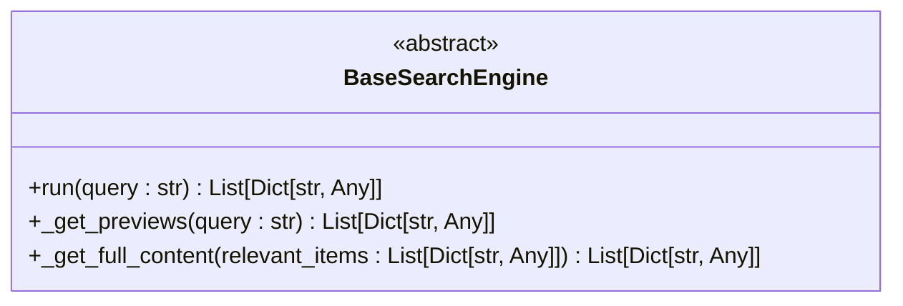
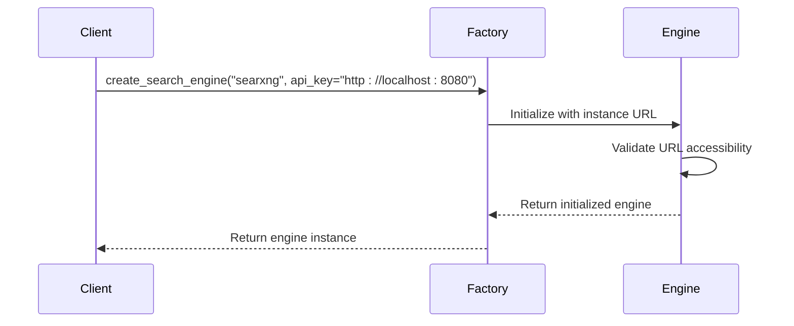
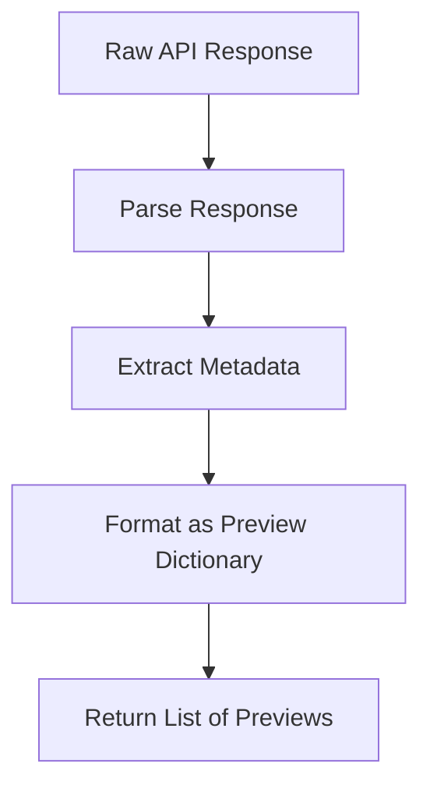
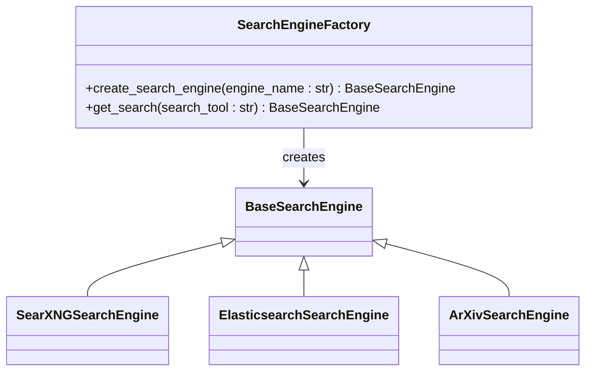
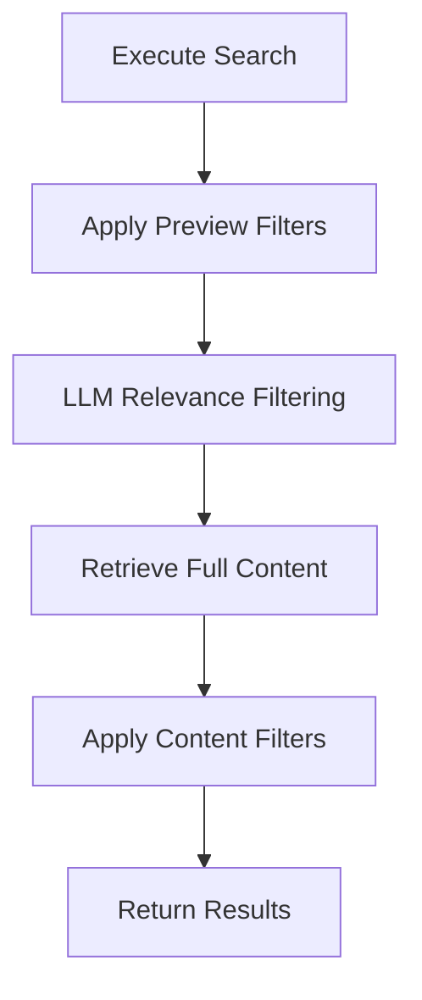

# Custom Search Engine Development

<cite>
**Referenced Files in This Document**   
- [search_engine_base.py](file://src/local_deep_research/web_search_engines/search_engine_base.py)
- [search_engine_factory.py](file://src/local_deep_research/web_search_engines/search_engine_factory.py)
- [search_engines_config.py](file://src/local_deep_research/web_search_engines/search_engines_config.py)
- [retriever_registry.py](file://src/local_deep_research/web_search_engines/retriever_registry.py)
- [search_engine_searxng.py](file://src/local_deep_research/web_search_engines/engines/search_engine_searxng.py)
- [search_engine_elasticsearch.py](file://src/local_deep_research/web_search_engines/engines/search_engine_elasticsearch.py)
- [search_engine_arxiv.py](file://src/local_deep_research/web_search_engines/engines/search_engine_arxiv.py)
- [search_engine_pubmed.py](file://src/local_deep_research/web_search_engines/engines/search_engine_pubmed.py)
- [search_engine_github.py](file://src/local_deep_research/web_search_engines/engines/search_engine_github.py)
- [default_search_engines.py](file://src/local_deep_research/web_search_engines/default_search_engines.py)
</cite>

## Table of Contents
1. [Introduction](#introduction)
2. [BaseSearchEngine Interface](#basesearchengine-interface)
3. [Search Engine Implementation](#search-engine-implementation)
4. [Search Engine Factory and Discovery](#search-engine-factory-and-discovery)
5. [Configuration System](#configuration-system)
6. [Specialized Engine Types](#specialized-engine-types)
7. [Testing and Integration](#testing-and-integration)
8. [Conclusion](#conclusion)

## Introduction
This document provides comprehensive guidance for developing custom search engine integrations within the Local Deep Research system. The architecture is built around a flexible, extensible framework that supports various search engine types including scientific, news, technical, and local document search engines. The system implements a two-phase retrieval approach that first obtains preview information, applies relevance filtering, and then retrieves full content for the most relevant results. This design optimizes performance while maintaining high-quality results. The framework includes robust support for authentication, rate limiting, result parsing, and error handling, making it suitable for integrating with a wide variety of external services and local data sources.

## BaseSearchEngine Interface

The `BaseSearchEngine` abstract class serves as the foundation for all search engine implementations in the system. It defines a standardized interface that ensures consistency across different search engine types while providing flexibility for specialized functionality.

### Required Methods
The base class requires two abstract methods that must be implemented by all subclasses:



**Diagram sources**
- [search_engine_base.py](file://src/local_deep_research/web_search_engines/search_engine_base.py#L630-L657)

The `_get_previews` method retrieves initial search results with basic information such as title, URL, and snippet. This method should return a list of dictionaries containing at least 'id', 'title', and 'snippet' keys. The `_get_full_content` method then retrieves complete content for the relevant items identified during the filtering phase.

### Class Attributes
The base class defines several class-level boolean attributes that categorize the search engine type:

- `is_public`: Indicates if the engine searches public internet sources
- `is_generic`: Indicates if this is a general web search engine vs specialized
- `is_scientific`: Indicates if this is a scientific/academic search engine
- `is_local`: Indicates if this is a local RAG/document search engine  
- `is_news`: Indicates if this is a news search engine
- `is_code`: Indicates if this is a code search engine

These attributes enable the system to automatically categorize and route queries appropriately based on the research context.

### Lifecycle Methods
The `run` method implements a two-phase retrieval approach that is consistent across all search engine types:

1. Get preview information for many results
2. Filter the previews for relevance
3. Get full content for only the relevant results

The method includes built-in support for rate limiting, retry logic, and metrics tracking. It uses the Tenacity library for retry functionality with adaptive wait times based on rate limiting feedback from the search engines.

**Section sources**
- [search_engine_base.py](file://src/local_deep_research/web_search_engines/search_engine_base.py#L258-L432)

## Search Engine Implementation

Creating a new search engine involves extending the `BaseSearchEngine` class and implementing the required methods. The implementation should handle authentication, rate limiting, result parsing, and error handling specific to the target search service.

### Authentication
Authentication is typically handled through API keys passed to the constructor. The base class provides infrastructure for checking API key availability and validating credentials. For example, the SearXNG search engine uses an instance URL as its authentication mechanism:



**Diagram sources**
- [search_engine_searxng.py](file://src/local_deep_research/web_search_engines/engines/search_engine_searxng.py#L60-L119)

### Rate Limiting
All search engines inherit rate limiting capabilities from the base class. The system uses an adaptive rate limiting tracker that monitors response times and adjusts wait periods accordingly. Engines should call `apply_rate_limit` before making external requests:

```python
self._last_wait_time = self.rate_tracker.apply_rate_limit(self.engine_type)
```

This ensures compliance with API rate limits while maximizing throughput.

### Result Parsing
Result parsing involves transforming the raw API response into the standardized format expected by the system. The `_get_previews` method should extract essential information and structure it as a list of dictionaries with consistent keys. For example, the arXiv search engine parses XML responses and extracts paper metadata:



**Diagram sources**
- [search_engine_arxiv.py](file://src/local_deep_research/web_search_engines/engines/search_engine_arxiv.py#L127-L173)

### Error Handling
Robust error handling is critical for maintaining system reliability. The base class includes comprehensive error handling in the `run` method, but individual engines should also implement service-specific error handling. For example, the PubMed search engine detects rate limiting responses and raises a `RateLimitError`:

```python
if "429" in error_msg or "too many requests" in error_msg.lower():
    raise RateLimitError(f"PubMed rate limit hit: {error_msg}")
```

This allows the retry mechanism to handle the error appropriately.

**Section sources**
- [search_engine_pubmed.py](file://src/local_deep_research/web_search_engines/engines/search_engine_pubmed.py#L147-L150)
- [search_engine_base.py](file://src/local_deep_research/web_search_engines/search_engine_base.py#L408-L416)

## Search Engine Factory and Discovery

The search engine factory pattern provides a centralized mechanism for creating and managing search engine instances. This pattern enables automatic discovery and registration of search engines, making the system highly extensible.

### Factory Pattern
The `create_search_engine` function serves as the factory method for creating search engine instances. It handles the entire lifecycle from configuration retrieval to instance creation:



**Diagram sources**
- [search_engine_factory.py](file://src/local_deep_research/web_search_engines/search_engine_factory.py#L13-L619)

The factory uses reflection to dynamically load engine classes based on configuration, allowing new engines to be added without modifying the factory code.

### Automatic Discovery
The system automatically discovers and registers search engines through multiple mechanisms:

1. **Configuration-based discovery**: Engines defined in JSON configuration files
2. **Programmatic registration**: LangChain retrievers registered via the retriever registry
3. **Local collection registration**: Document collections automatically exposed as search engines

The `search_config` function orchestrates this discovery process, aggregating engines from all sources:

```python
# Register registered retrievers as available search engines
for name in retriever_registry.list_registered():
    search_engines[name] = {
        "module_path": ".engines.search_engine_retriever",
        "class_name": "RetrieverSearchEngine",
        "is_retriever": True,
    }
```

This enables seamless integration of programmatically registered retrievers as first-class search engines.

**Section sources**
- [search_engines_config.py](file://src/local_deep_research/web_search_engines/search_engines_config.py#L128-L147)
- [retriever_registry.py](file://src/local_deep_research/web_search_engines/retriever_registry.py#L12-L110)

## Configuration System

The search engine configuration system uses JSON files stored in `defaults/settings/search_engines/` to define engine parameters and settings. This approach enables flexible, user-configurable search engine behavior without requiring code changes.

### Configuration Structure
Each search engine is defined with a consistent structure that includes:

- `module_path`: Python module path for the engine class
- `class_name`: Name of the engine class
- `requires_api_key`: Whether the engine requires an API key
- `requires_llm`: Whether the engine requires a language model
- `default_params`: Default initialization parameters
- `description`: Brief description of the engine
- `strengths`: Engine strengths
- `weaknesses`: Engine limitations

For example, the default Elasticsearch configuration:

```python
def get_default_elasticsearch_config():
    return {
        "module_path": "local_deep_research.web_search_engines.engines.search_engine_elasticsearch",
        "class_name": "ElasticsearchSearchEngine",
        "requires_llm": True,
        "default_params": {
            "hosts": ["http://172.16.4.131:9200"],
            "index_name": "sample_documents",
        },
        "description": "Search engine for Elasticsearch databases",
    }
```

### Dynamic Configuration
The system supports dynamic configuration through settings snapshots that capture the current user configuration. This allows engines to access their specific configuration parameters at runtime:

```python
def _get_setting(key: str, settings_snapshot: Optional[Dict[str, Any]] = None):
    if settings_snapshot:
        return get_setting_from_snapshot(key, settings_snapshot=settings_snapshot)
```

This enables user-specific configuration of search engines, such as custom API keys or parameter overrides.

**Section sources**
- [default_search_engines.py](file://src/local_deep_research/web_search_engines/default_search_engines.py#L7-L40)
- [search_engines_config.py](file://src/local_deep_research/web_search_engines/search_engines_config.py#L16-L57)

## Specialized Engine Types

The system supports several specialized engine types designed for specific use cases. Each type extends the base search engine with domain-specific functionality.

### Scientific Engines
Scientific engines like arXiv and PubMed are designed for academic research. They include features such as:

- Metadata extraction (authors, publication date, journal)
- Abstract retrieval
- Full-text access when available
- Citation information

The arXiv engine, for example, can download PDFs and extract text content:

```python
if self.include_full_text and self.download_dir:
    paper_path = paper.download_pdf(dirpath=self.download_dir)
    result["pdf_path"] = str(paper_path)
```

### News Engines
News engines like The Guardian and Wikinews specialize in current events. They typically include:

- Time-based filtering
- Source credibility assessment
- Article freshness prioritization
- Topic categorization

### Technical Engines
Technical engines like GitHub focus on code and technical documentation. Features include:

- Code snippet search
- Repository metadata
- Issue tracking integration
- README content retrieval

The GitHub engine can search across repositories, code, issues, and users:

```python
def __init__(self, search_type: str = "repositories"):
    self.search_endpoint = f"{self.api_base}/search/{search_type}"
```

### Local Engines
Local engines like Elasticsearch search private document collections. They provide:

- Secure access to internal documents
- Custom indexing and search capabilities
- Integration with document management systems
- Support for various document formats

The Elasticsearch engine supports configurable search fields and highlighting:

```python
def __init__(self, search_fields: List[str] = ["content", "title"]):
    self.search_fields = search_fields
```

**Section sources**
- [search_engine_arxiv.py](file://src/local_deep_research/web_search_engines/engines/search_engine_arxiv.py#L15-L37)
- [search_engine_github.py](file://src/local_deep_research/web_search_engines/engines/search_engine_github.py#L20-L29)
- [search_engine_elasticsearch.py](file://src/local_deep_research/web_search_engines/engines/search_engine_elasticsearch.py#L14-L28)

## Testing and Integration

Testing custom search engines is essential to ensure reliability and compatibility with the research system's filtering and evaluation pipeline.

### Testing Guidelines
When testing a custom search engine, verify the following:

1. **Basic functionality**: The engine can be instantiated and executes searches
2. **Result format**: Results conform to the expected dictionary structure
3. **Error handling**: Proper handling of network errors and API limitations
4. **Rate limiting**: Compliance with API rate limits
5. **Authentication**: Correct handling of API keys and credentials

The system includes comprehensive test coverage for existing engines, which can serve as examples for testing new implementations.

### Integration with Filtering Pipeline
Custom engines integrate seamlessly with the system's filtering pipeline, which includes:

- **Preview filtering**: Applied to all previews before relevance checks
- **Relevance filtering**: Uses LLM to filter results based on query relevance
- **Content filtering**: Applied to full content after retrieval

The base class automatically applies these filters in the correct sequence:



**Diagram sources**
- [search_engine_base.py](file://src/local_deep_research/web_search_engines/search_engine_base.py#L321-L372)

Engines can customize filtering behavior by implementing their own filter classes or configuring the base class parameters.

**Section sources**
- [search_engine_base.py](file://src/local_deep_research/web_search_engines/search_engine_base.py#L146-L178)

## Conclusion
The custom search engine framework provides a robust, extensible foundation for integrating diverse information sources into the research system. By following the patterns and practices outlined in this document, developers can create high-quality search engine integrations that leverage the system's advanced features including two-phase retrieval, adaptive rate limiting, and intelligent filtering. The factory pattern and automatic discovery mechanisms ensure that new engines can be easily added and configured, while the standardized interface guarantees consistent behavior across all engine types. This architecture enables researchers to access a wide range of information sources through a unified, powerful interface.