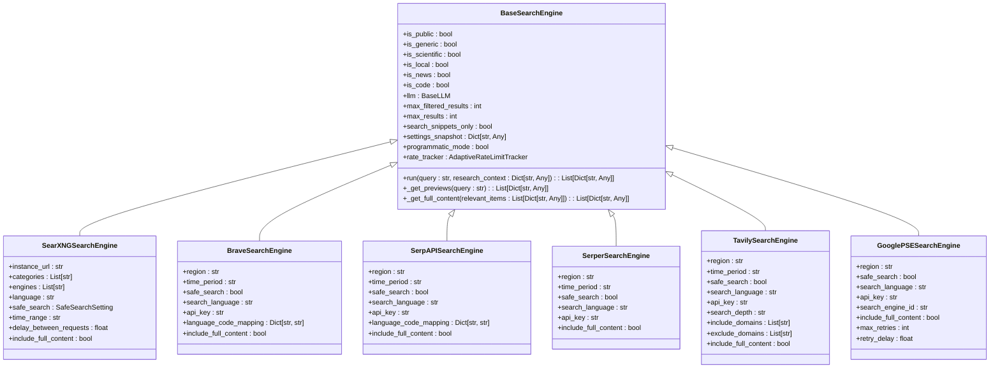
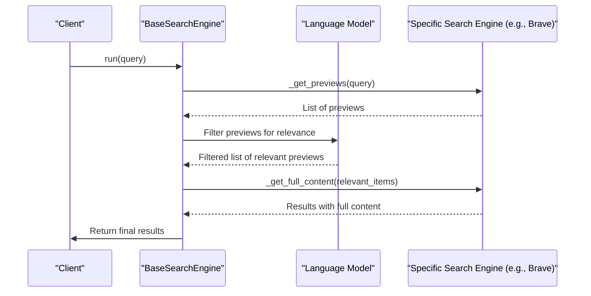
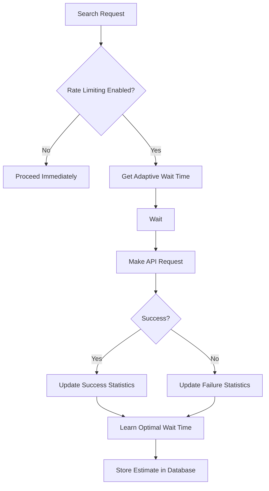

# General Web Search Engines

<cite>
**Referenced Files in This Document**   
- [search_engine_base.py](file://src/local_deep_research/web_search_engines/search_engine_base.py)
- [search_engine_factory.py](file://src/local_deep_research/web_search_engines/search_engine_factory.py)
- [search_engines_config.py](file://src/local_deep_research/web_search_engines/search_engines_config.py)
- [search_engine_searxng.py](file://src/local_deep_research/web_search_engines/engines/search_engine_searxng.py)
- [search_engine_brave.py](file://src/local_deep_research/web_search_engines/engines/search_engine_brave.py)
- [search_engine_serpapi.py](file://src/local_deep_research/web_search_engines/engines/search_engine_serpapi.py)
- [search_engine_serper.py](file://src/local_deep_research/web_search_engines/engines/search_engine_serper.py)
- [search_engine_tavily.py](file://src/local_deep_research/web_search_engines/engines/search_engine_tavily.py)
- [search_engine_google_pse.py](file://src/local_deep_research/web_search_engines/engines/search_engine_google_pse.py)
- [full_search.py](file://src/local_deep_research/web_search_engines/engines/full_search.py)
- [meta_search_engine.py](file://src/local_deep_research/web_search_engines/engines/meta_search_engine.py)
- [parallel_search_engine.py](file://src/local_deep_research/web_search_engines/engines/parallel_search_engine.py)
- [tracker.py](file://src/local_deep_research/web_search_engines/rate_limiting/tracker.py)
</cite>

## Table of Contents
1. [Introduction](#introduction)
2. [Core Architecture](#core-architecture)
3. [Search Engine Implementation Patterns](#search-engine-implementation-patterns)
4. [Configuration and Engine Management](#configuration-and-engine-management)
5. [Advanced Search Features](#advanced-search-features)
6. [Rate Limiting and Cost Management](#rate-limiting-and-cost-management)
7. [Result Processing and Filtering](#result-processing-and-filtering)
8. [Troubleshooting and Common Issues](#troubleshooting-and-common-issues)
9. [Conclusion](#conclusion)

## Introduction

This document provides a comprehensive analysis of the implementation of general web search engines within the local-deep-research system. It details the architecture, configuration, and operational patterns for integrating commercial search APIs such as SearXNG, DuckDuckGo, SerpAPI, Serper, ScaleSERP, Tavily, Google Programmable Search Engine, and Brave Search. The system is designed to handle the complexities of web search integration, including result snippet extraction, duplicate content detection, sponsored results handling, and advanced features like image search and knowledge graph data extraction. The architecture emphasizes flexibility, cost management, and result diversity across multiple sources.

**Section sources**
- [search_engine_base.py](file://src/local_deep_research/web_search_engines/search_engine_base.py#L1-L657)
- [search_engine_factory.py](file://src/local_deep_research/web_search_engines/search_engine_factory.py#L1-L619)

## Core Architecture

The web search engine system is built on a modular, extensible architecture centered around the `BaseSearchEngine` abstract class. This design enables a consistent interface and shared functionality across diverse search providers while allowing for engine-specific customizations.



**Diagram sources **
- [search_engine_base.py](file://src/local_deep_research/web_search_engines/search_engine_base.py#L35-L657)
- [search_engine_searxng.py](file://src/local_deep_research/web_search_engines/engines/search_engine_searxng.py#L26-L588)
- [search_engine_brave.py](file://src/local_deep_research/web_search_engines/engines/search_engine_brave.py#L12-L294)
- [search_engine_serpapi.py](file://src/local_deep_research/web_search_engines/engines/search_engine_serpapi.py#L11-L267)
- [search_engine_serper.py](file://src/local_deep_research/web_search_engines/engines/search_engine_serper.py#L13-L367)
- [search_engine_tavily.py](file://src/local_deep_research/web_search_engines/engines/search_engine_tavily.py#L13-L321)
- [search_engine_google_pse.py](file://src/local_deep_research/web_search_engines/engines/search_engine_google_pse.py#L14-L363)

**Section sources**
- [search_engine_base.py](file://src/local_deep_research/web_search_engines/search_engine_base.py#L35-L657)

## Search Engine Implementation Patterns

The system implements a two-phase retrieval approach across all search engines, which optimizes for both relevance and efficiency. This pattern is enforced by the `BaseSearchEngine` class and implemented by all concrete engine classes.

### Two-Phase Retrieval Pattern

The two-phase retrieval pattern consists of:
1.  **Preview Retrieval**: Fetching a large number of initial results with minimal information (title, URL, snippet).
2.  **Relevance Filtering**: Using an LLM to filter the previews for relevance to the query.
3.  **Full Content Retrieval**: Fetching the complete content only for the filtered, relevant results.

This pattern is critical for managing API costs and ensuring high-quality results. The `run()` method in `BaseSearchEngine` orchestrates this flow, as shown in the sequence diagram below.



**Diagram sources **
- [search_engine_base.py](file://src/local_deep_research/web_search_engines/search_engine_base.py#L258-L432)

### Engine-Specific Implementation Details

Each search engine implements the abstract methods `_get_previews()` and `_get_full_content()` to handle provider-specific APIs and response formats.

#### SearXNG Implementation
The `SearXNGSearchEngine` uses self-hosted instances for ethical usage. It performs HTML parsing with BeautifulSoup to extract results, as SearXNG's JSON API is not used. The implementation includes robust validation to filter out error pages and internal SearXNG links.

#### Commercial API Implementations
Engines like `BraveSearchEngine`, `SerpAPISearchEngine`, `SerperSearchEngine`, `TavilySearchEngine`, and `GooglePSESearchEngine` use their respective Python SDKs or direct HTTP requests. They handle API keys, region targeting, language filtering, and safe search settings through standardized parameters that are mapped to each provider's specific API requirements.

**Section sources**
- [search_engine_searxng.py](file://src/local_deep_research/web_search_engines/engines/search_engine_searxng.py#L26-L588)
- [search_engine_brave.py](file://src/local_deep_research/web_search_engines/engines/search_engine_brave.py#L12-L294)
- [search_engine_serpapi.py](file://src/local_deep_research/web_search_engines/engines/search_engine_serpapi.py#L11-L267)
- [search_engine_serper.py](file://src/local_deep_research/web_search_engines/engines/search_engine_serper.py#L13-L367)
- [search_engine_tavily.py](file://src/local_deep_research/web_search_engines/engines/search_engine_tavily.py#L13-L321)
- [search_engine_google_pse.py](file://src/local_deep_research/web_search_engines/engines/search_engine_google_pse.py#L14-L363)

## Configuration and Engine Management

The system uses a dynamic configuration model to manage search engine definitions, which are loaded from a user's settings database or a snapshot. This allows for runtime customization of search engines without code changes.

```mermaid
flowchart TD
A[Settings Database or Snapshot] --> B[search_engines_config.py]
B --> C[search_config() function]
C --> D[Dictionary of Engine Configs]
D --> E[search_engine_factory.py]
E --> F[create_search_engine()]
F --> G[Initialized Search Engine Instance]
```

**Diagram sources **
- [search_engines_config.py](file://src/local_deep_research/web_search_engines/search_engines_config.py#L94-L302)
- [search_engine_factory.py](file://src/local_deep_research/web_search_engines/search_engine_factory.py#L13-L345)

The `search_engine_factory.py` module is responsible for instantiating search engine objects. The `create_search_engine()` function takes an engine name and configuration parameters, then dynamically loads the appropriate engine class and creates an instance with the provided settings. This factory pattern ensures that the system can easily support new search engines by simply adding a new configuration and implementation file.

**Section sources**
- [search_engines_config.py](file://src/local_deep_research/web_search_engines/search_engines_config.py#L94-L302)
- [search_engine_factory.py](file://src/local_deep_research/web_search_engines/search_engine_factory.py#L13-L345)

## Advanced Search Features

The system supports advanced search features through specialized components and wrapper classes.

### Full Content Retrieval
The `FullSearchResults` class is used by several engines to retrieve the full content of web pages. It uses `AsyncChromiumLoader` to fetch HTML and `BeautifulSoupTransformer` to parse it, followed by `justext` to remove boilerplate text. This process is resource-intensive and is only triggered when `include_full_content=True`.


**Diagram sources **
- [full_search.py](file://src/local_deep_research/web_search_engines/engines/full_search.py#L15-L134)

### Meta and Parallel Search
The `MetaSearchEngine` uses an LLM to analyze a query and select the most appropriate single search engine. The `ParallelSearchEngine` executes multiple engines simultaneously and combines their results, using a global thread pool for efficiency. This allows for comprehensive searches across diverse sources.

**Section sources**
- [full_search.py](file://src/local_deep_research/web_search_engines/engines/full_search.py#L15-L134)
- [meta_search_engine.py](file://src/local_deep_research/web_search_engines/engines/meta_search_engine.py#L12-L534)
- [parallel_search_engine.py](file://src/local_deep_research/web_search_engines/engines/parallel_search_engine.py#L90-L759)

## Rate Limiting and Cost Management

The system employs an adaptive rate limiting strategy to prevent API abuse and manage costs. The `AdaptiveRateLimitTracker` learns optimal wait times for each engine based on past success and failure rates.



**Diagram sources **
- [tracker.py](file://src/local_deep_research/web_search_engines/rate_limiting/tracker.py#L43-L762)

The tracker uses a combination of exploration (trying faster rates) and exploitation (using learned estimates) to find the optimal balance between speed and reliability. It persists learned patterns to the database to improve performance over time.

**Section sources**
- [tracker.py](file://src/local_deep_research/web_search_engines/rate_limiting/tracker.py#L43-L762)

## Result Processing and Filtering

Results are processed through a series of filters to ensure quality and relevance. The base engine applies LLM-based relevance filtering to the previews. Engine-specific filters can be applied to both previews and full content. The system also includes mechanisms to handle common challenges like duplicate content and sponsored results, although the specific filter implementations are defined in separate modules.

**Section sources**
- [search_engine_base.py](file://src/local_deep_research/web_search_engines/search_engine_base.py#L450-L628)

## Troubleshooting and Common Issues

Common issues include missing API keys, rate limiting, and inaccessible SearXNG instances. The system provides detailed logging to diagnose these problems. For example, the `SearXNGSearchEngine` checks the availability of its instance URL during initialization and sets an `is_available` flag. Similarly, the `create_search_engine()` function validates API key availability before attempting to create an engine instance.

**Section sources**
- [search_engine_searxng.py](file://src/local_deep_research/web_search_engines/engines/search_engine_searxng.py#L100-L124)
- [search_engine_factory.py](file://src/local_deep_research/web_search_engines/search_engine_factory.py#L156-L182)

## Conclusion

The local-deep-research system provides a robust, flexible framework for integrating and managing multiple general web search engines. Its core architecture, based on the `BaseSearchEngine` class, ensures a consistent interface and shared functionality. The two-phase retrieval pattern optimizes for cost and relevance. Dynamic configuration and a factory pattern allow for easy extension. Advanced features like full content retrieval and parallel search enhance the system's capabilities, while adaptive rate limiting ensures responsible API usage. This comprehensive design enables effective and efficient web search integration for deep research applications.