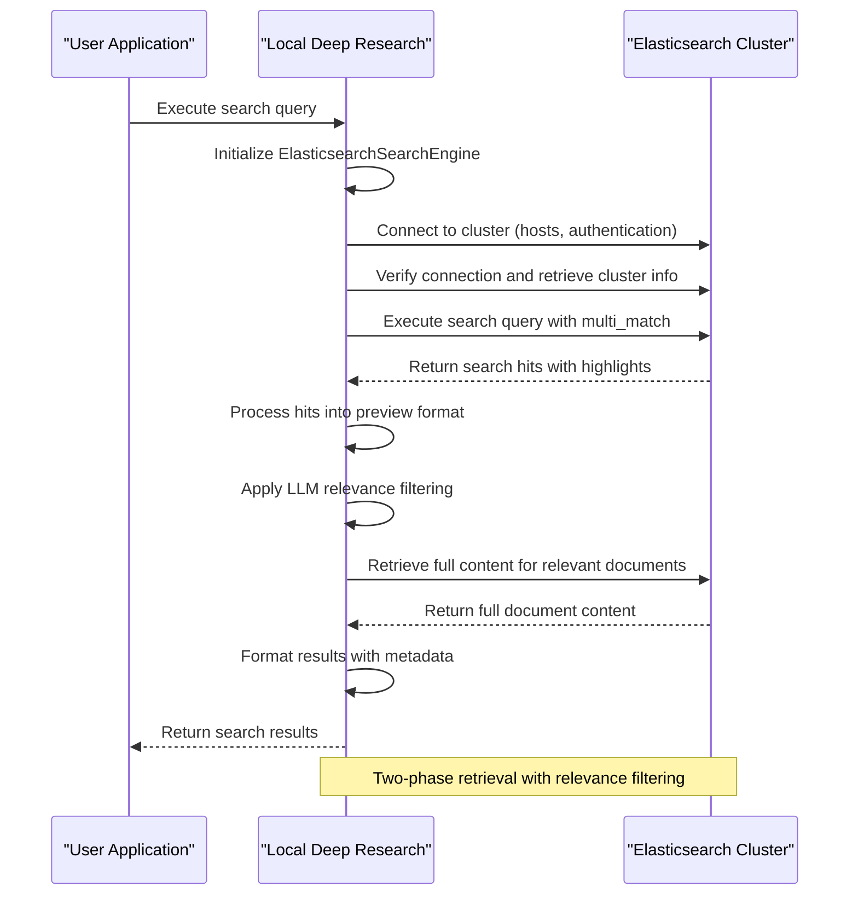
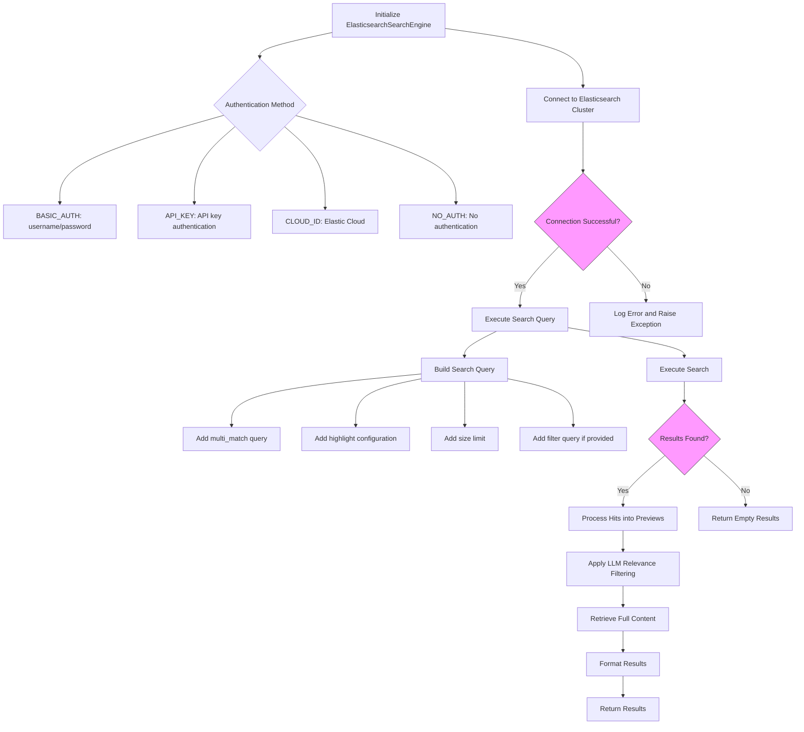
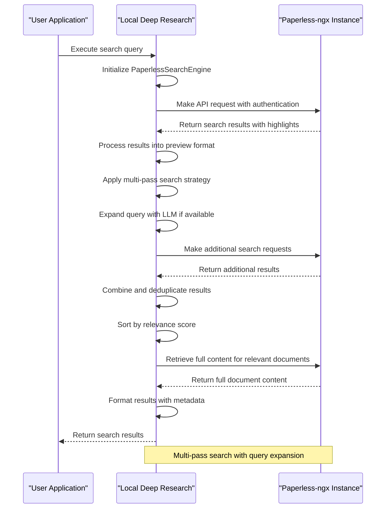
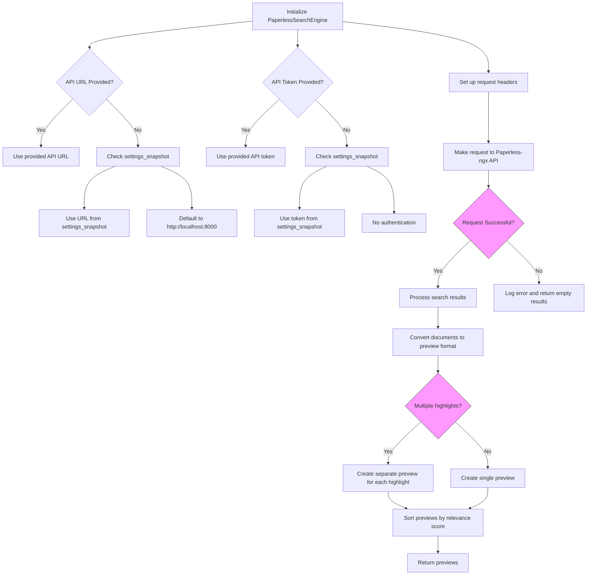
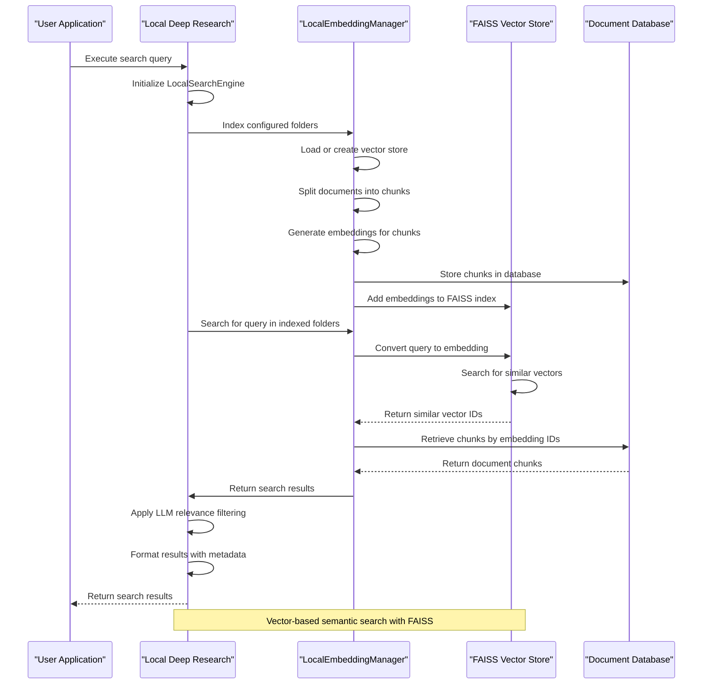
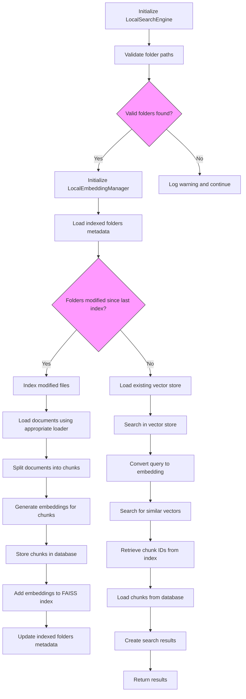
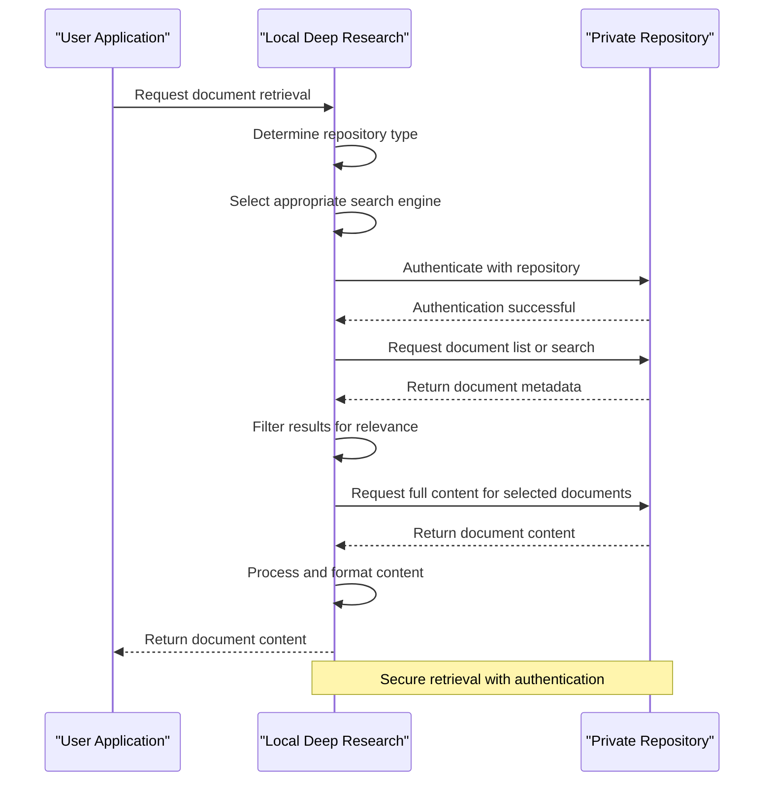
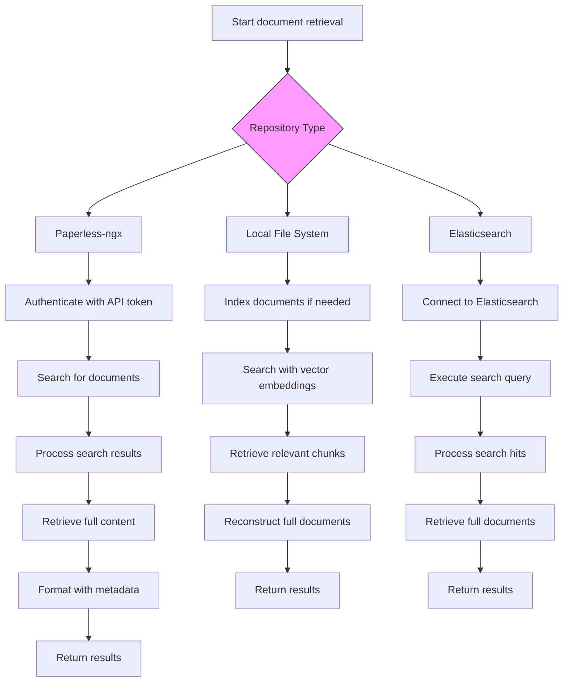

# Local and Private Search Engines

<cite>
**Referenced Files in This Document**   
- [search_engine_base.py](file://src/local_deep_research/web_search_engines/search_engine_base.py)
- [search_engine_elasticsearch.py](file://src/local_deep_research/web_search_engines/engines/search_engine_elasticsearch.py)
- [search_engine_paperless.py](file://src/local_deep_research/web_search_engines/engines/search_engine_paperless.py)
- [search_engine_local.py](file://src/local_deep_research/web_search_engines/engines/search_engine_local.py)
- [search_engine_local_all.py](file://src/local_deep_research/web_search_engines/engines/search_engine_local_all.py)
- [es_utils.py](file://src/local_deep_research/utilities/es_utils.py)
- [search_engines_config.py](file://src/local_deep_research/web_search_engines/search_engines_config.py)
- [search_config.py](file://src/local_deep_research/config/search_config.py)
- [elasticsearch_search_engine.md](file://docs/elasticsearch_search_engine.md)
- [search-engines.md](file://docs/search-engines.md)
- [search_example.py](file://examples/elasticsearch/search_example.py)
- [default_search_engines.py](file://src/local_deep_research/web_search_engines/default_search_engines.py)
</cite>

## Table of Contents
1. [Introduction](#introduction)
2. [Local Search Engine Architecture](#local-search-engine-architecture)
3. [Elasticsearch Integration](#elasticsearch-integration)
4. [Paperless-ngx Integration](#paperless-ngx-integration)
5. [Local File System Search](#local-file-system-search)
6. [Implementation of the Local Search Engine Base Class](#implementation-of-the-local-search-engine-base-class)
7. [Document Retrieval from Private Repositories](#document-retrieval-from-private-repositories)
8. [Specialized Features](#specialized-features)
9. [Security and Access Control](#security-and-access-control)
10. [Performance Optimization](#performance-optimization)
11. [Configuration and Setup](#configuration-and-setup)
12. [Conclusion](#conclusion)

## Introduction

This document provides comprehensive guidance on implementing local and private search engines within the Local Deep Research framework. The system supports multiple search engine types with a focus on privacy-preserving capabilities, allowing users to search both external sources and private document collections without compromising sensitive information. The architecture is designed to integrate seamlessly with self-hosted infrastructure, including Elasticsearch clusters and document management systems like Paperless-ngx, while providing robust search capabilities for local file systems.

The search engine framework follows a modular design pattern with a base class that defines the core interface and functionality. This allows for consistent implementation across different search engine types while enabling specialized features for each integration. The system supports two-phase retrieval, where initial previews are filtered for relevance before retrieving full content, optimizing both performance and accuracy.

**Section sources**
- [search_engine_base.py](file://src/local_deep_research/web_search_engines/search_engine_base.py#L1-L657)
- [search-engines.md](file://docs/search-engines.md#L1-L253)

## Local Search Engine Architecture

The local search engine architecture is built around a hierarchical class structure that provides a consistent interface across different search engine implementations. At the core of this architecture is the `BaseSearchEngine` class, which defines the fundamental operations and parameters for all search engines.

```mermaid
classDiagram
class BaseSearchEngine {
+is_public : bool
+is_generic : bool
+is_scientific : bool
+is_local : bool
+is_news : bool
+is_code : bool
+__init__(llm, max_filtered_results, max_results, preview_filters, content_filters, search_snippets_only, settings_snapshot, programmatic_mode)
+run(query, research_context) List[Dict[str, Any]]
+invoke(query) List[Dict[str, Any]]
+_filter_for_relevance(previews, query) List[Dict[str, Any]]
+_get_previews(query) List[Dict[str, Any]]
+_get_full_content(relevant_items) List[Dict[str, Any]]
}
class ElasticsearchSearchEngine {
+hosts : List[str]
+index_name : str
+username : Optional[str]
+password : Optional[str]
+api_key : Optional[str]
+cloud_id : Optional[str]
+highlight_fields : List[str]
+search_fields : List[str]
+filter_query : Optional[Dict]
+__init__(hosts, index_name, username, password, api_key, cloud_id, max_results, highlight_fields, search_fields, filter_query, llm, max_filtered_results)
+_get_previews(query) List[Dict[str, Any]]
+_get_full_content(relevant_items) List[Dict[str, Any]]
+search_by_query_string(query_string) List[Dict[str, Any]]
+search_by_dsl(query_dsl) List[Dict[str, Any]]
}
class PaperlessSearchEngine {
+api_url : str
+api_token : str
+timeout : int
+verify_ssl : bool
+include_content : bool
+__init__(api_url, api_key, api_token, max_results, timeout, verify_ssl, include_content, llm, settings_snapshot)
+_make_request(endpoint, params) Dict[str, Any]
+_expand_query_with_llm(query) str
+_multi_pass_search(query) List[Dict[str, Any]]
+_get_previews(query) List[Dict[str, Any]]
+_get_full_content(relevant_items) List[Dict[str, Any]]
+run(query, research_context) List[Dict[str, Any]]
+test_connection() bool
+get_document_count() int
}
class LocalSearchEngine {
+paths : List[str]
+name : str
+description : str
+collections : Dict[str, Dict[str, Any]]
+embedding_manager : LocalEmbeddingManager
+__init__(paths, llm, max_results, max_filtered_results, embedding_model, embedding_device, embedding_model_type, ollama_base_url, force_reindex, chunk_size, chunk_overlap, cache_dir, collections, name, description)
+_index_folders(force_reindex) None
+_get_previews(query, collection_names) List[Dict[str, Any]]
+_get_full_content(relevant_items) List[Dict[str, Any]]
+run(query, research_context, collection_names) List[Dict[str, Any]]
+get_collections_info() List[Dict[str, Any]]
+reindex_collection(collection_name) bool
+from_config(config_dict, llm) LocalSearchEngine
}
class LocalAllSearchEngine {
+local_engines : Dict[str, Dict]
+__init__(llm, max_results, max_filtered_results, settings_snapshot, programmatic_mode)
+_get_previews(query) List[Dict[str, Any]]
+_get_full_content(relevant_items) List[Dict[str, Any]]
}
BaseSearchEngine <|-- ElasticsearchSearchEngine
BaseSearchEngine <|-- PaperlessSearchEngine
BaseSearchEngine <|-- LocalSearchEngine
BaseSearchEngine <|-- LocalAllSearchEngine
```



**Diagram sources **
- [search_engine_base.py](file://src/local_deep_research/web_search_engines/search_engine_base.py#L1-L657)
- [search_engine_elasticsearch.py](file://src/local_deep_research/web_search_engines/engines/search_engine_elasticsearch.py#L1-L363)
- [search_engine_paperless.py](file://src/local_deep_research/web_search_engines/engines/search_engine_paperless.py#L1-L780)
- [search_engine_local.py](file://src/local_deep_research/web_search_engines/engines/search_engine_local.py#L1-L1439)
- [search_engine_local_all.py](file://src/local_deep_research/web_search_engines/engines/search_engine_local_all.py#L1-L171)

The architecture implements a two-phase retrieval approach that optimizes both performance and relevance. In the first phase, the system retrieves preview information (titles, summaries) for initial search results. These previews are then filtered for relevance using a language model, and only the relevant items proceed to the second phase where full content is retrieved. This approach minimizes unnecessary data transfer and processing while ensuring high-quality results.

Each search engine type inherits from the `BaseSearchEngine` class and implements the abstract methods `_get_previews()` and `_get_full_content()`. The base class handles common functionality such as rate limiting, retry logic, and relevance filtering, providing a consistent interface across all search engine implementations. This design allows for easy extension and integration of new search engine types while maintaining a uniform user experience.

**Section sources**
- [search_engine_base.py](file://src/local_deep_research/web_search_engines/search_engine_base.py#L1-L657)
- [search_engine_elasticsearch.py](file://src/local_deep_research/web_search_engines/engines/search_engine_elasticsearch.py#L1-L363)

## Elasticsearch Integration

The Elasticsearch integration provides a powerful search capability for structured and unstructured data stored in Elasticsearch indices. This integration allows users to search large document collections with advanced query capabilities while maintaining privacy by keeping data within their own infrastructure.



**Diagram sources **
- [search_engine_elasticsearch.py](file://src/local_deep_research/web_search_engines/engines/search_engine_elasticsearch.py#L1-L363)
- [es_utils.py](file://src/local_deep_research/utilities/es_utils.py#L1-L447)
- [search_example.py](file://examples/elasticsearch/search_example.py#L1-L179)

The `ElasticsearchSearchEngine` class implements the core functionality for interacting with Elasticsearch clusters. It supports various authentication methods including basic authentication, API keys, and Elastic Cloud ID. The search engine can be configured with multiple parameters such as the target index name, search fields, highlight fields, and filter queries. By default, it searches the "content" and "title" fields and highlights matches in these fields.

The integration provides both simple and advanced search capabilities. For basic searches, users can pass a query string which is converted into a multi-match query across the configured search fields. For more complex queries, the search engine supports Elasticsearch Query String syntax and Domain Specific Language (DSL) queries, allowing for sophisticated boolean operations, field-specific searches, and filtering.



**Diagram sources **
- [search_engine_elasticsearch.py](file://src/local_deep_research/web_search_engines/engines/search_engine_elasticsearch.py#L1-L363)
- [es_utils.py](file://src/local_deep_research/utilities/es_utils.py#L1-L447)

The integration includes utility classes like `ElasticsearchManager` that simplify common operations such as creating indices, indexing documents, and bulk indexing. This utility class provides methods for creating indices with custom mappings and settings, indexing single documents, bulk indexing multiple documents, and indexing entire directories of files. It also supports indexing specific file types like PDFs, Word documents, and CSV files by automatically extracting content using appropriate document loaders.

For optimal performance, the Elasticsearch integration supports connection pooling and efficient query execution. The search engine automatically handles connection management and provides detailed logging of search operations, including query execution time, number of results, and relevance scores. This makes it easy to monitor and optimize search performance in production environments.

**Section sources**
- [search_engine_elasticsearch.py](file://src/local_deep_research/web_search_engines/engines/search_engine_elasticsearch.py#L1-L363)
- [es_utils.py](file://src/local_deep_research/utilities/es_utils.py#L1-L447)
- [elasticsearch_search_engine.md](file://docs/elasticsearch_search_engine.md#L1-L155)

## Paperless-ngx Integration

The Paperless-ngx integration enables seamless searching of documents managed by the Paperless-ngx document management system. This integration provides a privacy-preserving solution for searching personal document collections without exposing sensitive information to external services.



**Diagram sources **
- [search_engine_paperless.py](file://src/local_deep_research/web_search_engines/engines/search_engine_paperless.py#L1-L780)
- [search_engines_config.py](file://src/local_deep_research/web_search_engines/search_engines_config.py#L1-L367)

The `PaperlessSearchEngine` class implements a sophisticated multi-pass search strategy to maximize result quality. In the first pass, it executes the original query against the Paperless-ngx API. If a language model is available, it then uses the LLM to expand the query with relevant keywords and synonyms, creating a more comprehensive search query using OR operators. This expanded query is then used in a second search pass to retrieve additional potentially relevant documents.

The integration handles authentication through API tokens, which can be configured either programmatically or through environment variables. It supports both the newer `api_key` parameter and the legacy `api_token` parameter for backward compatibility. The search engine automatically detects the appropriate authentication method and configures the request headers accordingly.



**Diagram sources **
- [search_engine_paperless.py](file://src/local_deep_research/web_search_engines/engines/search_engine_paperless.py#L1-L780)

One of the key features of the Paperless-ngx integration is its ability to handle search result highlights effectively. When a document contains multiple highlighted sections matching the search query, the integration creates separate preview entries for each highlight. This ensures that each relevant section of a document is treated as a distinct search result, improving the granularity and relevance of the search output.

The integration also enhances document metadata for better citation and context. It combines the document title with the correspondent (author), document type, and creation year to create an enhanced title that follows bibliographic conventions. This makes it easier to identify and reference documents in research outputs.

**Section sources**
- [search_engine_paperless.py](file://src/local_deep_research/web_search_engines/engines/search_engine_paperless.py#L1-L780)
- [search_engines_config.py](file://src/local_deep_research/web_search_engines/search_engines_config.py#L1-L367)

## Local File System Search

The local file system search capability allows users to search documents stored in local directories using semantic search powered by vector embeddings. This implementation provides a privacy-preserving alternative to cloud-based document search services by keeping all data and processing on the user's local machine.



**Diagram sources **
- [search_engine_local.py](file://src/local_deep_research/web_search_engines/engines/search_engine_local.py#L1-L1439)
- [search_engines_config.py](file://src/local_deep_research/web_search_engines/search_engines_config.py#L1-L367)

The local search implementation uses a two-tier storage architecture with both a vector database (FAISS) for fast similarity search and a relational database for persistent storage of document chunks. The `LocalEmbeddingManager` class handles the entire indexing pipeline, including document loading, text splitting, embedding generation, and storage management.

The system supports multiple embedding models and providers, including sentence-transformers models and Ollama embeddings. Users can configure the embedding model, device (CPU or CUDA), chunk size, and chunk overlap to optimize performance and accuracy for their specific use case. The default configuration uses the "all-MiniLM-L6-v2" model with 1000-character chunks and 200-character overlap.



**Diagram sources **
- [search_engine_local.py](file://src/local_deep_research/web_search_engines/engines/search_engine_local.py#L1-L1439)

The local search engine supports multiple document formats through LangChain document loaders, including PDF, TXT, Markdown, Word documents, CSV, and Excel files. When indexing a directory, it automatically detects the file type and uses the appropriate loader to extract text content. For PDF files, it can extract both text and metadata such as author, creation date, and keywords.

The system implements incremental indexing to improve performance. When a folder is indexed, the system tracks the modification time of each file and only re-indexes files that have been modified since the last indexing operation. This makes subsequent searches much faster, especially for large document collections where only a small number of files change between searches.

**Section sources**
- [search_engine_local.py](file://src/local_deep_research/web_search_engines/engines/search_engine_local.py#L1-L1439)
- [search_engines_config.py](file://src/local_deep_research/web_search_engines/search_engines_config.py#L1-L367)

## Implementation of the Local Search Engine Base Class

The `BaseSearchEngine` class serves as the foundation for all search engine implementations in the Local Deep Research framework. It defines a consistent interface and provides common functionality that is shared across different search engine types, ensuring a uniform user experience regardless of the underlying search technology.

```mermaid
classDiagram
class BaseSearchEngine {
+is_public : bool
+is_generic : bool
+is_scientific : bool
+is_local : bool
+is_news : bool
+is_code : bool
+__init__(llm, max_filtered_results, max_results, preview_filters, content_filters, search_snippets_only, settings_snapshot, programmatic_mode)
+run(query, research_context) List[Dict[str, Any]]
+invoke(query) List[Dict[str, Any]]
+_filter_for_relevance(previews, query) List[Dict[str, Any]]
+_get_previews(query) List[Dict[str, Any]]
+_get_full_content(relevant_items) List[Dict[str, Any]]
+max_filtered_results : int
+max_results : int
}
class AdaptiveWait {
+__init__(get_wait_func)
+__call__(retry_state) float
}
BaseSearchEngine o-- AdaptiveWait
BaseSearchEngine o-- RateLimitTracker
BaseSearchEngine o-- SearchTracker
BaseSearchEngine o-- BaseFilter
note right of BaseSearchEngine
Abstract base class for all search engines
Implements two-phase retrieval approach :
1. Get preview information for items
2. Filter previews for relevance
3. Get full content for relevant items
end
```

**Diagram sources **
- [search_engine_base.py](file://src/local_deep_research/web_search_engines/search_engine_base.py#L1-L657)

The base class implements a two-phase retrieval approach that optimizes both performance and relevance. In the first phase, the `_get_previews()` method retrieves basic information about potential results, such as titles, snippets, and URLs. This method is abstract and must be implemented by each concrete search engine class to handle the specific API or data source.

In the second phase, the base class applies relevance filtering to the previews using a language model. The `_filter_for_relevance()` method constructs a prompt that asks the LLM to select the most relevant results based on criteria such as direct relevance, quality, and recency. The LLM returns a JSON array of indices corresponding to the most relevant previews, which are then used to retrieve the full content.

```mermaid
flowchart TD
A[Start run() method] --> B[Get preview information]
B --> C{Previews available?}
C --> |No| D[Return empty results]
C --> |Yes| E[Apply preview filters]
E --> F[Filter for relevance with LLM]
F --> G{LLM filtering enabled?}
G --> |Yes| H[Construct relevance prompt]
H --> I[Send prompt to LLM]
I --> J[Parse LLM response]
J --> K[Extract relevant indices]
K --> L[Select relevant previews]
G --> |No| L
L --> M{Retrieve full content?}
M --> |Yes| N[Call _get_full_content()]
M --> |No| O[Return previews as results]
N --> P[Apply content filters]
P --> Q[Return results]
O --> Q
style C fill:#f9f,stroke:#333
style G fill:#f9f,stroke:#333
style M fill:#f9f,stroke:#333
```

**Diagram sources **
- [search_engine_base.py](file://src/local_deep_research/web_search_engines/search_engine_base.py#L1-L657)

The base class also handles important cross-cutting concerns such as rate limiting, retry logic, and metrics tracking. It integrates with a rate limiting system that adapts wait times based on the response from the search service, preventing IP blocks and ensuring reliable operation. The retry mechanism uses exponential backoff with jitter to handle temporary failures gracefully.

Metrics tracking is implemented through a search tracker that records key performance indicators such as query execution time, number of results, and success/failure status. This data can be used to monitor search engine performance and identify potential issues. In programmatic mode, the base class can operate without database dependencies, using in-memory tracking instead.

**Section sources**
- [search_engine_base.py](file://src/local_deep_research/web_search_engines/search_engine_base.py#L1-L657)

## Document Retrieval from Private Repositories

The document retrieval system for private repositories is designed to provide secure and efficient access to documents stored in various private systems. This includes both self-hosted document management systems like Paperless-ngx and local file system collections, with a focus on maintaining data privacy and security.



**Diagram sources **
- [search_engine_paperless.py](file://src/local_deep_research/web_search_engines/engines/search_engine_paperless.py#L1-L780)
- [search_engine_local.py](file://src/local_deep_research/web_search_engines/engines/search_engine_local.py#L1-L1439)

For Paperless-ngx repositories, the system uses the REST API to retrieve documents, with authentication handled through API tokens. The retrieval process begins with a search query to identify relevant documents, followed by requests to retrieve the full content of selected documents. Metadata such as document title, correspondent, document type, and creation date are preserved and included in the results.

For local file system repositories, documents are retrieved from indexed directories using the vector search system. The `LocalSearchEngine` class manages the retrieval process, first identifying relevant document chunks through semantic search, then retrieving the full document content from the local storage. The system maintains a database of document chunks with their corresponding embeddings, allowing for efficient retrieval and deduplication.



**Diagram sources **
- [search_engine_paperless.py](file://src/local_deep_research/web_search_engines/engines/search_engine_paperless.py#L1-L780)
- [search_engine_local.py](file://src/local_deep_research/web_search_engines/engines/search_engine_local.py#L1-L1439)
- [search_engine_elasticsearch.py](file://src/local_deep_research/web_search_engines/engines/search_engine_elasticsearch.py#L1-L363)

The retrieval system implements several security measures to protect sensitive documents. All connections to private repositories use HTTPS with certificate verification. API tokens are stored securely and never exposed in logs or error messages. For local file system access, the system validates file paths to prevent directory traversal attacks and only accesses files in explicitly configured directories.

Performance is optimized through caching and efficient data retrieval. The system caches search results and document content when possible, reducing the need for repeated requests to the repository. For large documents, content is streamed rather than loaded entirely into memory, minimizing memory usage and improving response times.

**Section sources**
- [search_engine_paperless.py](file://src/local_deep_research/web_search_engines/engines/search_engine_paperless.py#L1-L780)
- [search_engine_local.py](file://src/local_deep_research/web_search_engines/engines/search_engine_local.py#L1-L1439)
- [search_engine_elasticsearch.py](file://src/local_deep_research/web_search_engines/engines/search_engine_elasticsearch.py#L1-L363)

## Specialized Features

The local search engine implementation includes several specialized features that enhance its functionality for research and document management use cases. These features are designed to address specific challenges in working with private document collections and to provide advanced search capabilities beyond simple keyword matching.

### Full-Text PDF Search

The system provides robust full-text search capabilities for PDF documents, including scanned documents where text must be extracted through OCR. When indexing PDF files, the system uses the PyPDFLoader to extract text content, preserving the original formatting and structure as much as possible. For scanned documents, it can integrate with OCR services to extract text from image-based PDFs.

The search engine handles PDF-specific metadata such as author, title, subject, keywords, creation date, and modification date. This metadata is indexed along with the document content, allowing for faceted search and filtering. Users can search for documents based on metadata fields, such as finding all documents created by a specific author or within a particular date range.

### Metadata Extraction from Scanned Documents

For scanned documents, the system implements advanced metadata extraction techniques to enhance searchability and organization. When a scanned document is indexed, the system analyzes the content to identify key information such as document type (invoice, contract, letter, etc.), parties involved, dates, amounts, and other relevant entities.

This metadata extraction is powered by language models that can understand the context and structure of different document types. For example, when processing an invoice, the system can identify the vendor name, invoice number, due date, and total amount. This extracted metadata is then indexed and made searchable, allowing users to find documents based on their content rather than just keywords.

### Integration with Document Management Systems

The system provides deep integration with document management systems like Paperless-ngx, allowing for seamless search and retrieval of documents across multiple repositories. This integration goes beyond simple search functionality to include features like document tagging, correspondence tracking, and document type classification.

When searching across integrated document management systems, the system preserves the original metadata and organizational structure. Search results include information about document tags, correspondents, document types, and other classification data. This allows users to refine their searches based on these metadata fields and to understand the context of each document in their collection.

The integration also supports bidirectional synchronization, where search results and document annotations can be updated in the original document management system. This ensures that the user's document organization and metadata remain consistent across all systems.

**Section sources**
- [search_engine_local.py](file://src/local_deep_research/web_search_engines/engines/search_engine_local.py#L1-L1439)
- [search_engine_paperless.py](file://src/local_deep_research/web_search_engines/engines/search_engine_paperless.py#L1-L780)
- [search_engine_elasticsearch.py](file://src/local_deep_research/web_search_engines/engines/search_engine_elasticsearch.py#L1-L363)

## Security and Access Control

The local search engine framework implements comprehensive security measures to protect sensitive documents and ensure appropriate access control. These security features are designed to prevent unauthorized access, protect data in transit and at rest, and provide audit capabilities for compliance and troubleshooting.

### Securing Local Search Endpoints

All local search endpoints are secured using industry-standard security practices. The system validates all incoming requests and implements proper authentication and authorization mechanisms. For web-based interfaces, it uses CSRF protection, secure session management, and HTTP security headers to prevent common web vulnerabilities.

The system validates all user inputs to prevent injection attacks and other security vulnerabilities. File paths are sanitized to prevent directory traversal attacks, and all external requests are validated to prevent SSRF (Server-Side Request Forgery) attacks. The system also implements rate limiting to prevent abuse and denial-of-service attacks.

### Managing Access Controls

The access control system is designed to provide fine-grained control over who can access specific document collections and search functionalities. Users can be assigned to different roles with specific permissions, such as read-only access, search access, or administrative access.

For document collections, the system supports collection-level access controls, allowing different users or groups to have different levels of access to different collections. This is particularly useful in multi-user environments where users should only have access to their own documents or specific shared collections.

The system also implements attribute-based access control (ABAC) that can make access decisions based on document metadata, user attributes, and environmental conditions. For example, it can restrict access to sensitive documents based on the user's role, the time of day, or the security level of the connection.

### Data Protection and Privacy

All sensitive data is protected using strong encryption both in transit and at rest. Passwords and API keys are hashed using secure algorithms and never stored in plaintext. The system uses HTTPS for all external communications and validates SSL certificates to prevent man-in-the-middle attacks.

For local document collections, the system provides options for encrypting the index and cached data. This ensures that even if an attacker gains access to the local storage, they cannot read the indexed content without the encryption key.

The system also implements data minimization principles, only collecting and storing the minimum amount of data necessary for its functionality. Search queries and results are not logged by default, and when logging is enabled, sensitive information is redacted or anonymized.

**Section sources**
- [search_engine_paperless.py](file://src/local_deep_research/web_search_engines/engines/search_engine_paperless.py#L1-L780)
- [search_engine_local.py](file://src/local_deep_research/web_search_engines/engines/search_engine_local.py#L1-L1439)
- [security](file://src/local_deep_research/security)

## Performance Optimization

The local search engine framework includes several performance optimization techniques to ensure fast and responsive search operations, even with large document collections. These optimizations address both the indexing process and the search execution, providing a smooth user experience.

### Indexing Optimization

The indexing process is optimized for both speed and memory efficiency. The system uses parallel processing to load and process multiple documents simultaneously, taking advantage of multi-core processors. Document loading and text splitting are performed in separate processes to prevent memory bottlenecks.

For large document collections, the system implements incremental indexing that only processes files that have been modified since the last indexing operation. This significantly reduces the time required for subsequent indexing operations, as only a small subset of documents typically changes between searches.

The system also optimizes the storage of document chunks and embeddings. It uses a hybrid storage approach with a vector database (FAISS) for fast similarity search and a relational database for persistent storage of document metadata and content. This allows for efficient retrieval of both search results and full document content.

### Search Execution Optimization

The search execution is optimized through several techniques. The two-phase retrieval approach minimizes the amount of data that needs to be transferred and processed by first filtering previews for relevance before retrieving full content. This reduces both network bandwidth and processing time.

The system implements caching at multiple levels, including caching of search results, document content, and embeddings. Frequently accessed documents and search results are kept in memory to reduce the need for repeated disk access or external API calls.

For vector search operations, the system uses approximate nearest neighbor algorithms that provide fast search performance with minimal impact on accuracy. The FAISS library is configured to use efficient indexing methods that balance search speed and memory usage.

### Resource Management

The system includes comprehensive resource management features to prevent excessive memory and CPU usage. It implements memory limits for document processing and search operations, automatically releasing resources when they are no longer needed.

The system also includes configurable settings for resource usage, allowing users to adjust the number of parallel processes, memory limits, and cache sizes based on their hardware capabilities. This ensures that the system can run efficiently on both high-end workstations and more modest hardware.

For long-running operations, the system provides progress tracking and the ability to cancel operations. This prevents the system from becoming unresponsive during large indexing or search operations and allows users to manage their resources effectively.

**Section sources**
- [search_engine_local.py](file://src/local_deep_research/web_search_engines/engines/search_engine_local.py#L1-L1439)
- [search_engine_base.py](file://src/local_deep_research/web_search_engines/search_engine_base.py#L1-L657)
- [es_utils.py](file://src/local_deep_research/utilities/es_utils.py#L1-L447)

## Configuration and Setup

The local search engine framework provides flexible configuration options to support various deployment scenarios and user requirements. The configuration system is designed to be intuitive and accessible through both programmatic interfaces and web-based settings.

### Self-Hosted Search Infrastructure Setup

Setting up self-hosted search infrastructure involves several steps, depending on the specific search engine being configured. For Elasticsearch, users need to install and configure an Elasticsearch cluster, create the necessary indices, and configure the search engine with the appropriate connection parameters.

For Paperless-ngx integration, users need to have a running Paperless-ngx instance and configure the search engine with the API URL and authentication token. The system supports both local and remote Paperless-ngx instances, allowing for flexible deployment options.

The configuration can be done through environment variables, configuration files, or the web interface. The system provides default values for all parameters, making it easy to get started with minimal configuration.

### Connection Configuration

Connection configuration varies depending on the search engine type. For Elasticsearch, users can configure multiple hosts for high availability, specify authentication credentials, and set connection timeouts. The system supports various authentication methods including basic authentication, API keys, and Elastic Cloud ID.

For Paperless-ngx, the primary configuration parameters are the API URL and API token. The system automatically detects the appropriate authentication method and configures the request headers accordingly.

For local file system search, the main configuration parameters are the paths to the document directories, the embedding model to use, and the indexing settings such as chunk size and overlap.

### Index Management

Index management is handled automatically by the system, with options for manual control when needed. The system automatically creates and updates indices as documents are added or modified. Users can also manually trigger re-indexing of specific collections or the entire document library.

The system provides tools for monitoring index status, including the number of documents indexed, the last indexing time, and the index size. This information can be used to troubleshoot indexing issues and optimize performance.

Users can also configure advanced indexing options such as custom embedding models, different chunking strategies, and selective indexing of specific file types. These options allow for fine-tuning the indexing process to meet specific use cases and performance requirements.

**Section sources**
- [search_engine_elasticsearch.py](file://src/local_deep_research/web_search_engines/engines/search_engine_elasticsearch.py#L1-L363)
- [search_engine_paperless.py](file://src/local_deep_research/web_search_engines/engines/search_engine_paperless.py#L1-L780)
- [search_engine_local.py](file://src/local_deep_research/web_search_engines/engines/search_engine_local.py#L1-L1439)
- [search_engines_config.py](file://src/local_deep_research/web_search_engines/search_engines_config.py#L1-L367)

## Conclusion

The local and private search engine framework provides a comprehensive solution for searching documents while maintaining privacy and security. By supporting multiple search engine types including Elasticsearch, Paperless-ngx, and local file systems, the system offers flexibility to meet various user needs and deployment scenarios.

The architecture is built around a robust base class that provides consistent functionality across all search engine implementations, including two-phase retrieval, relevance filtering, rate limiting, and metrics tracking. This ensures a uniform user experience while allowing for specialized features in each integration.

Key strengths of the system include its privacy-preserving design, support for advanced search capabilities, and comprehensive security features. The system keeps sensitive data on the user's local infrastructure, uses secure authentication methods, and implements access controls to protect documents.

The framework also provides excellent performance through optimizations such as incremental indexing, caching, and efficient search algorithms. These optimizations ensure fast search operations even with large document collections.

For future development, potential enhancements could include support for additional document management systems, improved OCR capabilities for scanned documents, and more sophisticated metadata extraction techniques. The modular architecture makes it easy to extend the system with new search engine types and features.

Overall, the local search engine framework provides a powerful and secure solution for researchers and professionals who need to search private document collections without compromising sensitive information.