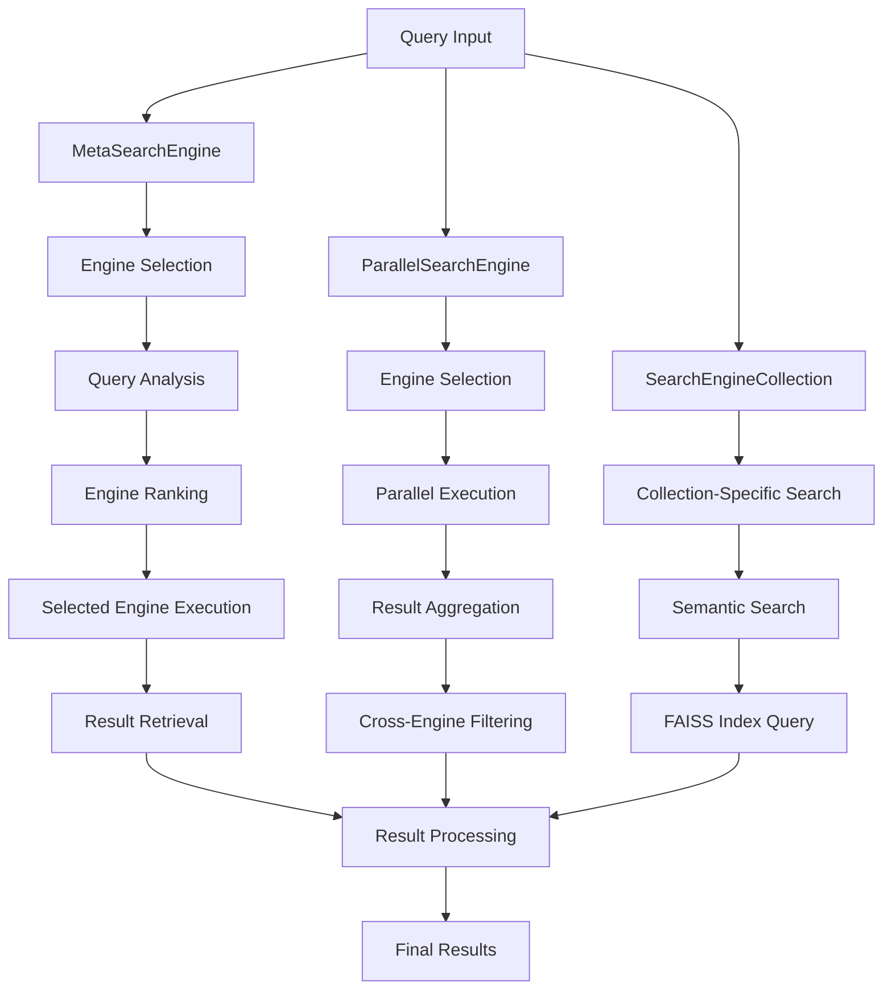
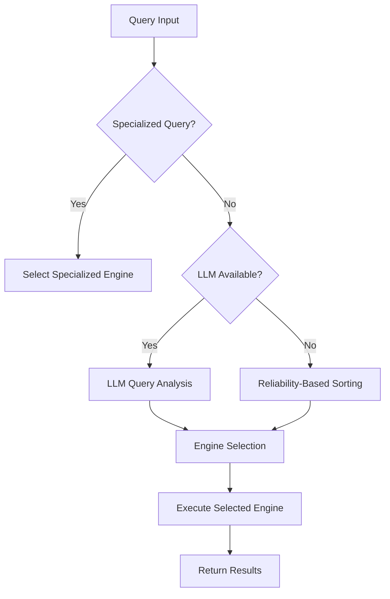
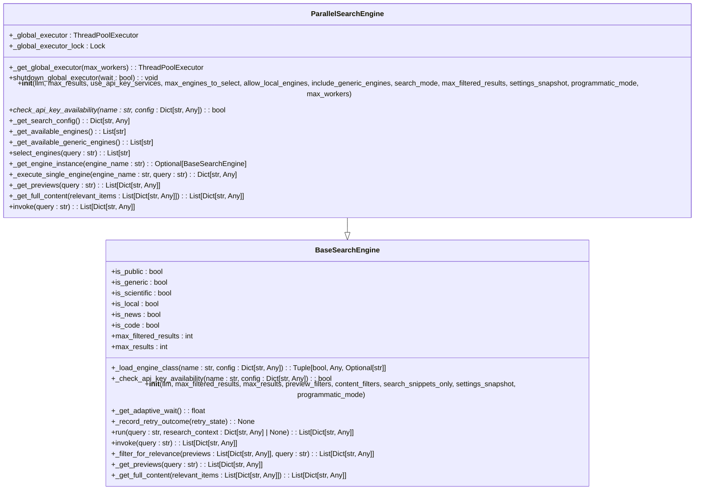
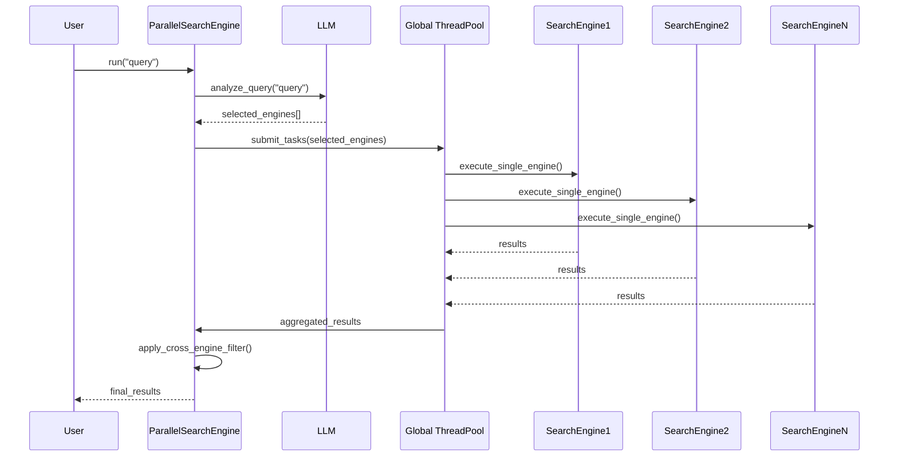
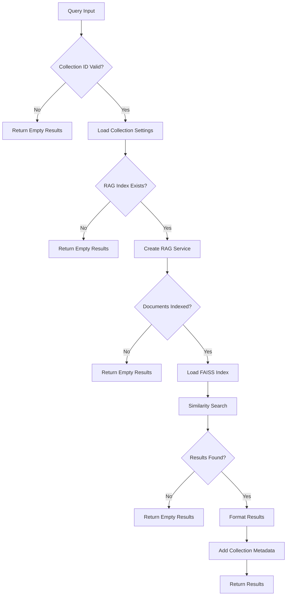
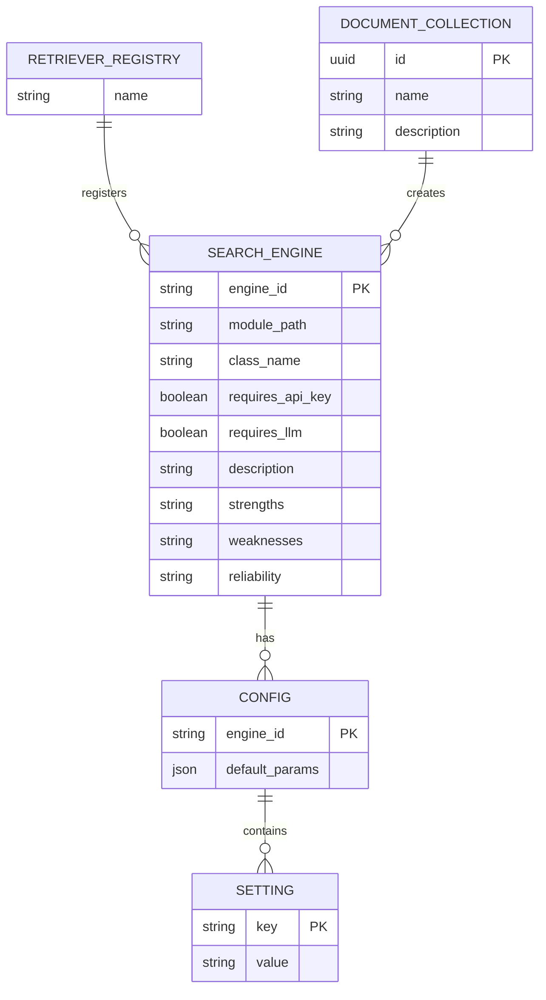

# Meta and Composite Search Engines

<cite>
**Referenced Files in This Document**   
- [full_search.py](file://src/local_deep_research/web_search_engines/engines/full_search.py)
- [meta_search_engine.py](file://src/local_deep_research/web_search_engines/engines/meta_search_engine.py)
- [parallel_search_engine.py](file://src/local_deep_research/web_search_engines/engines/parallel_search_engine.py)
- [search_engine_collection.py](file://src/local_deep_research/web_search_engines/engines/search_engine_collection.py)
- [search_engine_base.py](file://src/local_deep_research/web_search_engines/search_engine_base.py)
- [search_engines_config.py](file://src/local_deep_research/web_search_engines/search_engines_config.py)
- [search_system.py](file://src/local_deep_research/search_system.py)
- [search_system_factory.py](file://src/local_deep_research/search_system_factory.py)
</cite>

## Table of Contents
1. [Introduction](#introduction)
2. [Architecture Overview](#architecture-overview)
3. [Meta-Search Engine Implementation](#meta-search-engine-implementation)
4. [Parallel Search Engine Implementation](#parallel-search-engine-implementation)
5. [Search Engine Collection](#search-engine-collection)
6. [Result Merging and Ranking](#result-merging-and-ranking)
7. [Configuration and Orchestration](#configuration-and-orchestration)
8. [Performance Optimization](#performance-optimization)
9. [Error Handling and Fallbacks](#error-handling-and-fallbacks)
10. [Conclusion](#conclusion)

## Introduction

This document provides a comprehensive analysis of the meta and composite search engine system implemented in the local-deep-research repository. The system is designed to aggregate results from multiple underlying search engines, providing a unified interface for information retrieval. The architecture combines meta-search capabilities with parallel execution strategies to deliver comprehensive and relevant results efficiently.

The core components of this system include the MetaSearchEngine, which intelligently selects appropriate search engines based on query analysis; the ParallelSearchEngine, which executes multiple search engines simultaneously; and the SearchEngineCollection, which enables semantic search within specific document collections. These components work together to provide a robust search infrastructure that can handle diverse query types and information needs.

**Section sources**
- [search_system.py](file://src/local_deep_research/search_system.py#L1-L377)
- [search_system_factory.py](file://src/local_deep_research/search_system_factory.py#L1-L800)

## Architecture Overview

The meta and composite search engine system follows a modular architecture that separates concerns between search orchestration, engine selection, result aggregation, and presentation. The system is built on a foundation of abstract base classes and concrete implementations that allow for extensibility and maintainability.

**Diagram sources **
- [meta_search_engine.py](file://src/local_deep_research/web_search_engines/engines/meta_search_engine.py#L12-L534)
- [parallel_search_engine.py](file://src/local_deep_research/web_search_engines/engines/parallel_search_engine.py#L90-L759)
- [search_engine_collection.py](file://src/local_deep_research/web_search_engines/engines/search_engine_collection.py#L18-L273)

## Meta-Search Engine Implementation

The MetaSearchEngine class implements a sophisticated meta-search system that intelligently selects and uses appropriate search engines based on query analysis. This engine acts as a smart router, determining the most suitable search engine for a given query rather than executing multiple engines in parallel.

### Query Analysis and Engine Selection

The MetaSearchEngine analyzes queries to determine the best search engines to use, prioritizing SearXNG for general queries while selecting specialized engines for domain-specific queries. The analysis process combines heuristic checks with LLM-powered classification to make informed decisions.

**Diagram sources **
- [meta_search_engine.py](file://src/local_deep_research/web_search_engines/engines/meta_search_engine.py#L175-L367)

The engine selection process begins with a quick heuristic check for specialized queries. If the query contains terms like "scientific paper," "medical research," or "github," the system immediately selects the appropriate specialized engines. For general queries, the system uses the LLM to analyze the query and recommend the most suitable engines based on their documented strengths and weaknesses.

When the LLM is not available or fails to provide a valid response, the system falls back to reliability-based sorting, prioritizing engines with higher reliability scores. This ensures that the system can still function effectively even when the LLM component is unavailable.

### Two-Phase Retrieval Process

The MetaSearchEngine implements a two-phase retrieval process that optimizes both speed and relevance. In the first phase, it retrieves preview information from the selected engine, including titles, snippets, and URLs. In the second phase, it retrieves full content only for the most relevant results, minimizing bandwidth usage and processing time.

The engine maintains a cache of engine instances to avoid the overhead of repeatedly creating and initializing search engine objects. This caching mechanism improves performance, especially when handling multiple queries in succession. The system also implements a fallback mechanism using the WikipediaSearchEngine to ensure that results are returned even when primary engines fail.

**Section sources**
- [meta_search_engine.py](file://src/local_deep_research/web_search_engines/engines/meta_search_engine.py#L12-L534)

## Parallel Search Engine Implementation

The ParallelSearchEngine implements a comprehensive parallel search strategy that executes multiple search engines simultaneously to maximize coverage and speed. Unlike the MetaSearchEngine, which selects a single engine, the ParallelSearchEngine leverages the power of parallelism to gather results from multiple sources concurrently.

### Global Thread Pool Management

A key architectural feature of the ParallelSearchEngine is its use of a global thread pool shared by all instances. This design prevents thread proliferation and ensures efficient resource utilization across the application.

**Diagram sources **
- [parallel_search_engine.py](file://src/local_deep_research/web_search_engines/engines/parallel_search_engine.py#L90-L759)
- [search_engine_base.py](file://src/local_deep_research/web_search_engines/search_engine_base.py#L35-L657)

The global thread pool is initialized lazily and thread-safely, ensuring that only one pool is created regardless of how many ParallelSearchEngine instances are created. The pool size is configurable, with a default value calculated based on the number of CPU cores available, following Python's recommended formula for I/O-bound operations.

### Engine Selection Strategy

The ParallelSearchEngine employs a sophisticated engine selection strategy that combines LLM-powered analysis with configurable rules. The system first identifies all available engines based on user settings, API key availability, and privacy preferences. It then uses the LLM to select the most appropriate engines for the specific query.

The selection process can operate in different modes, including ALL mode (all available engines) and SCIENTIFIC mode (scientific and generic engines only). The system also supports the inclusion of generic engines like SearXNG, Brave, and DDG, which are automatically added to the selection unless explicitly disabled.

For specialized queries, the system prioritizes domain-specific engines such as arXiv for academic papers and PubMed for medical research. For general queries, it relies on the LLM to recommend the most suitable engines based on their documented strengths and weaknesses.

### Parallel Execution and Result Aggregation

The core functionality of the ParallelSearchEngine lies in its ability to execute multiple search engines in parallel and aggregate their results. The system uses the global thread pool to submit search tasks for each selected engine, collecting results as they become available.

**Diagram sources **
- [parallel_search_engine.py](file://src/local_deep_research/web_search_engines/engines/parallel_search_engine.py#L566-L693)

The result aggregation process combines results from all successful engines, adding source information to each result to maintain provenance. The system emits socket events to inform the user interface about the progress of each engine, providing real-time feedback on which engines are being executed and their success or failure status.

After collecting results from all engines, the system performs a comprehensive summary, reporting the number of successful and failed engines. This transparency helps users understand the breadth of the search and the reliability of the results.

**Section sources**
- [parallel_search_engine.py](file://src/local_deep_research/web_search_engines/engines/parallel_search_engine.py#L90-L759)

## Search Engine Collection

The SearchEngineCollection provides semantic search capabilities within specific document collections using Retrieval-Augmented Generation (RAG) technology. This component enables users to search within their curated collections of research papers and documents, offering a powerful alternative to web-based search engines.

### Collection-Specific RAG Search

The CollectionSearchEngine class implements a search engine specifically designed for a single document collection. Each collection uses its own FAISS index and embedding model, ensuring that search results are optimized for the specific content and context of the collection.

**Diagram sources **
- [search_engine_collection.py](file://src/local_deep_research/web_search_engines/engines/search_engine_collection.py#L18-L273)

The search process begins by validating the collection ID and loading the collection-specific embedding settings from the RAG index. This ensures that the same embedding model used during indexing is used for searching, maintaining consistency and accuracy in the search results.

The system checks for the existence of a current RAG index for the collection and verifies that there are indexed documents before proceeding with the search. This prevents unnecessary processing when a collection is empty or not properly indexed.

### Semantic Search with FAISS

The CollectionSearchEngine leverages FAISS (Facebook AI Similarity Search) for efficient similarity search within the document collection. FAISS is a library for efficient similarity search and clustering of dense vectors, making it ideal for semantic search applications.

When a search is performed, the system creates a RAG service with the collection's specific embedding settings and loads the corresponding FAISS index. It then performs a similarity search using the query, retrieving the most relevant document chunks based on vector similarity.

The results are formatted with comprehensive metadata, including the document title, snippet, URL, and collection information. The relevance score is calculated from the FAISS distance score, providing a meaningful measure of how closely each result matches the query.

**Section sources**
- [search_engine_collection.py](file://src/local_deep_research/web_search_engines/engines/search_engine_collection.py#L18-L273)

## Result Merging and Ranking

The system implements sophisticated result merging and ranking algorithms to combine heterogeneous search results from multiple engines into a coherent and relevant output. This process addresses the challenges of duplicate detection, ranking normalization, and relevance assessment across diverse search sources.

### Cross-Engine Filtering

The CrossEngineFilter class plays a crucial role in the result merging process, eliminating duplicates and ensuring that only the most relevant results are presented to the user. This filter operates on the principle that similar content from different search engines should be consolidated into a single result.

The filtering process analyzes the titles, snippets, and URLs of search results to identify duplicates and near-duplicates. It uses the LLM to assess the relevance of each result to the original query, applying a selective approach that prioritizes quality over quantity. The filter also reorders results by relevance and reindexes them to maintain a consistent numbering scheme.

### Ranking Normalization

One of the key challenges in meta-search systems is the normalization of ranking scores across different search engines. Each engine may use its own scoring algorithm, making direct comparison of relevance scores problematic.

The system addresses this challenge through a combination of techniques. First, it converts raw scores from each engine into a normalized relevance score between 0 and 1. For engines that don't provide explicit scores, the system uses position-based weighting, assuming that higher-ranked results are more relevant.

Second, the system applies LLM-powered relevance filtering to re-rank results based on their actual relevance to the query, rather than their original ranking within each engine. This ensures that the final result order reflects true relevance rather than the idiosyncrasies of individual search algorithms.

### Duplicate Detection Strategies

The system employs multiple strategies for duplicate detection, combining URL analysis, content similarity, and metadata comparison. For web search results, the system normalizes URLs to identify different representations of the same resource. For document collection results, it uses document IDs to prevent duplication.

The duplicate detection process is configurable, allowing users to adjust the sensitivity of the detection algorithm based on their needs. In some cases, near-duplicates with complementary information may be preserved to provide a more comprehensive view of the topic.

**Section sources**
- [parallel_search_engine.py](file://src/local_deep_research/web_search_engines/engines/parallel_search_engine.py#L680-L686)
- [search_engine_base.py](file://src/local_deep_research/web_search_engines/search_engine_base.py#L450-L629)

## Configuration and Orchestration

The meta and composite search engine system is highly configurable, allowing users to define search engine groups, weighting schemes, and fallback behaviors through a comprehensive configuration system.

### Search Engine Configuration

The search engine configuration is managed through the search_engines_config.py module, which loads engine definitions from the user's configuration. This system supports both web-based search engines and local document collections, providing a unified interface for diverse information sources.

**Diagram sources **
- [search_engines_config.py](file://src/local_deep_research/web_search_engines/search_engines_config.py#L94-L302)

The configuration system automatically registers LangChain retrievers as available search engines, expanding the system's capabilities to include domain-specific knowledge bases. It also registers local document collections as search engines, enabling seamless integration between web search and personal knowledge management.

### Full Search Orchestration

The FullSearchResults class implements the full_search.py orchestrator that coordinates multiple search strategies, including web search, URL quality filtering, and full content retrieval. This component represents the highest level of search orchestration in the system.

The orchestrator follows a multi-step process: first, it performs a web search to obtain initial results; second, it filters URLs using LLM evaluation to ensure timeliness, factual accuracy, and source reliability; third, it downloads the full HTML pages for filtered URLs; fourth, it processes the HTML to extract relevant content; and finally, it removes boilerplate text to provide clean, readable content.

This comprehensive approach ensures that users receive not just links to information, but the actual content they need, processed and refined for maximum utility.

**Section sources**
- [search_engines_config.py](file://src/local_deep_research/web_search_engines/search_engines_config.py#L94-L302)
- [full_search.py](file://src/local_deep_research/web_search_engines/engines/full_search.py#L15-L134)

## Performance Optimization

The system incorporates several performance optimization techniques to ensure efficient execution of parallel search operations and minimize resource consumption.

### Thread Pool Management

The global thread pool implementation in the ParallelSearchEngine is a key performance optimization. By sharing a single thread pool across all instances, the system prevents the creation of excessive threads that could overwhelm system resources.

The thread pool size is automatically determined based on the number of CPU cores, following Python's recommended formula for I/O-bound operations: min(32, (os.cpu_count() or 1) + 4). This ensures optimal performance across different hardware configurations, from single-core devices to high-end servers.

The thread pool is automatically cleaned up at process exit, preventing resource leaks and ensuring proper application shutdown. This automatic cleanup is implemented using Python's atexit module, which registers a cleanup function to be called when the program terminates.

### Adaptive Rate Limiting

The system implements adaptive rate limiting through the RateLimitTracker class, which monitors the performance of each search engine and adjusts wait times accordingly. This prevents overwhelming external APIs with too many requests while maximizing throughput.

The rate limiting system records outcomes after each search attempt, including success status, wait time, retry count, and result count. This data is used to dynamically adjust the wait time for subsequent requests, creating a feedback loop that optimizes performance over time.

### Caching Strategies

Both the MetaSearchEngine and ParallelSearchEngine implement caching strategies to reduce the overhead of repeatedly creating and initializing search engine instances. The engine cache stores fully configured engine instances, allowing for rapid reuse across multiple queries.

The caching mechanism is thread-safe, using locks to prevent race conditions when multiple threads access the cache simultaneously. This ensures reliable performance in multi-threaded environments, such as web servers handling concurrent requests.

**Section sources**
- [parallel_search_engine.py](file://src/local_deep_research/web_search_engines/engines/parallel_search_engine.py#L18-L87)
- [search_engine_base.py](file://src/local_deep_research/web_search_engines/search_engine_base.py#L193-L257)

## Error Handling and Fallbacks

The system implements comprehensive error handling and fallback mechanisms to ensure robust operation even when individual search engines fail or return no results.

### Graceful Degradation

Both the MetaSearchEngine and ParallelSearchEngine implement graceful degradation strategies that allow the system to continue functioning even when some components fail. The MetaSearchEngine uses a fallback Wikipedia engine when all other engines fail, ensuring that users always receive some results.

The ParallelSearchEngine continues processing even when individual engines fail, collecting results from all successful engines and reporting the status of failed engines. This partial success model provides more value than a simple all-or-nothing approach.

### Comprehensive Error Reporting

The system provides detailed error reporting through logging and socket events, allowing users and developers to understand what happened during a search operation. When an engine fails, the system logs the error and emits a socket event with the engine name and error message.

The error handling is designed to be non-blocking, ensuring that the failure of one engine does not prevent other engines from completing their searches. This is particularly important in the parallel execution model, where the performance of the entire system should not be compromised by a single failing component.

### Configuration Validation

The system validates configuration settings at startup, checking for missing API keys and disabled engines. This proactive validation helps prevent runtime errors and provides clear feedback to users about configuration issues.

When an engine requires an API key but none is configured, the system logs a debug message and skips that engine, continuing with the remaining available engines. This allows the system to operate with whatever resources are available, rather than failing completely due to a single misconfiguration.

**Section sources**
- [meta_search_engine.py](file://src/local_deep_research/web_search_engines/engines/meta_search_engine.py#L394-L449)
- [parallel_search_engine.py](file://src/local_deep_research/web_search_engines/engines/parallel_search_engine.py#L596-L657)

## Conclusion

The meta and composite search engine system implemented in the local-deep-research repository represents a sophisticated approach to information retrieval that combines the strengths of multiple search strategies. By intelligently selecting and combining results from diverse sources, the system provides comprehensive and relevant information to users.

The architecture balances the need for broad coverage with the requirement for efficient execution, using parallel processing where appropriate and intelligent routing when a single specialized engine is likely to provide the best results. The system's modular design allows for easy extension and customization, supporting both web-based search engines and local document collections.

Key strengths of the system include its adaptive engine selection, sophisticated result merging algorithms, and comprehensive error handling. The implementation demonstrates a deep understanding of the challenges involved in combining heterogeneous search results and provides effective solutions to these challenges.

Future enhancements could include more advanced ranking algorithms, improved duplicate detection using machine learning techniques, and enhanced personalization based on user preferences and search history. Overall, the system provides a robust foundation for advanced information retrieval in research and knowledge management applications.