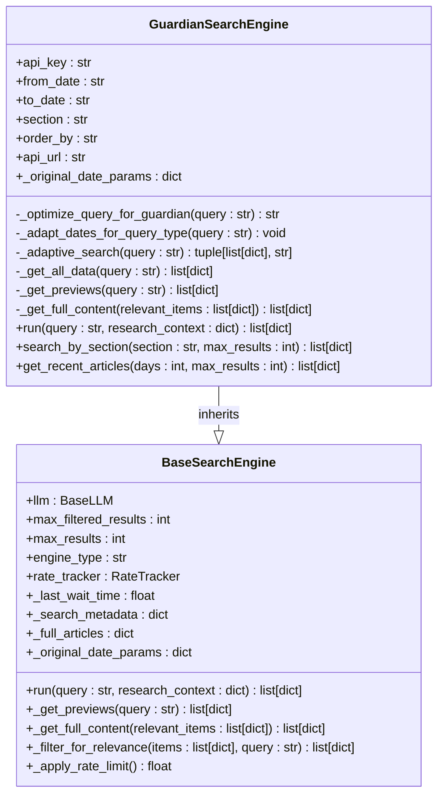
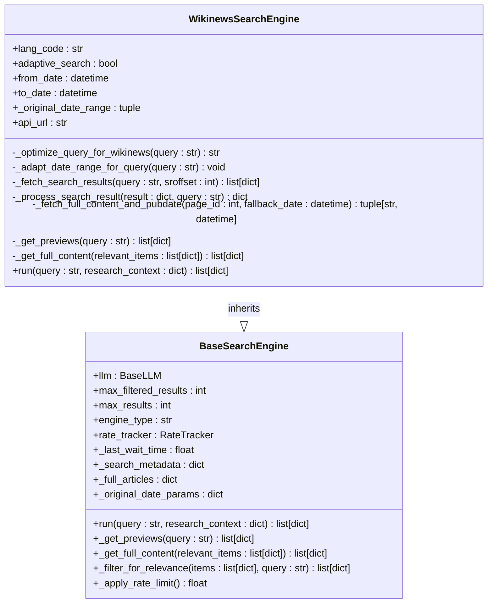
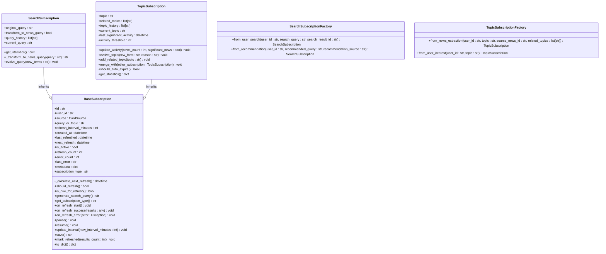
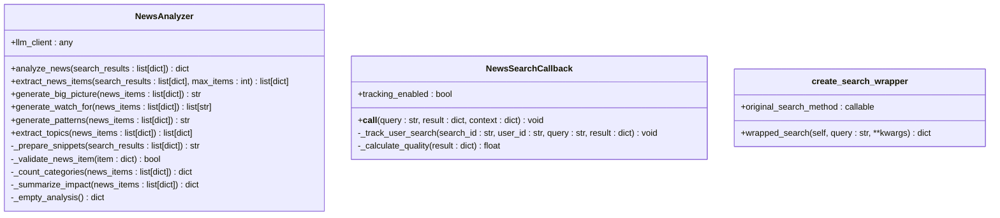

# News Search Engines

<cite>
**Referenced Files in This Document**   
- [search_engine_guardian.py](file://src/local_deep_research/web_search_engines/engines/search_engine_guardian.py)
- [search_engine_wikinews.py](file://src/local_deep_research/web_search_engines/engines/search_engine_wikinews.py)
- [api.py](file://src/local_deep_research/news/api.py)
- [news_analyzer.py](file://src/local_deep_research/news/core/news_analyzer.py)
- [search_integration.py](file://src/local_deep_research/news/core/search_integration.py)
- [scheduler.py](file://src/local_deep_research/news/subscription_manager/scheduler.py)
- [base_subscription.py](file://src/local_deep_research/news/subscription_manager/base_subscription.py)
- [topic_subscription.py](file://src/local_deep_research/news/subscription_manager/topic_subscription.py)
- [search_subscription.py](file://src/local_deep_research/news/subscription_manager/search_subscription.py)
</cite>

## Table of Contents
1. [Introduction](#introduction)
2. [News Source Integration Requirements](#news-source-integration-requirements)
3. [The Guardian API Integration](#the-guardian-api-integration)
4. [Wikinews API Integration](#wikinews-api-integration)
5. [News Subscription System](#news-subscription-system)
6. [News Analysis and Processing](#news-analysis-and-processing)
7. [Integration with Recommendation Features](#integration-with-recommendation-features)
8. [Handling Challenges and Edge Cases](#handling-challenges-and-edge-cases)
9. [Conclusion](#conclusion)

## Introduction
This document provides comprehensive documentation for implementing news search engines within the Local Deep Research (LDR) system. It details the architecture, implementation, and integration of news search capabilities with a focus on The Guardian and Wikinews as primary news sources. The system enables real-time news monitoring, article freshness detection, and handling of breaking news through a sophisticated subscription and analysis framework. The documentation covers API key management, date filtering, category-based searching, content extraction, and integration with the system's news subscription and recommendation features. Special attention is given to challenges such as API rate limits, handling conflicting reports, and ensuring journalistic credibility assessment.

## News Source Integration Requirements
The news search engine implementation must satisfy several critical requirements to ensure effective and reliable news monitoring and delivery. These requirements are designed to provide users with timely, relevant, and credible news content while maintaining system performance and reliability.

### Real-time Updates and Article Freshness
The system implements a sophisticated subscription scheduler that enables real-time updates for news content. The `NewsScheduler` class manages active users and automatically schedules subscription checks based on user activity. When a user interacts with the system, their credentials are temporarily stored in memory, allowing the scheduler to automatically refresh their subscriptions according to the configured intervals. The scheduler uses exponential backoff for error recovery and automatically disables subscriptions after ten consecutive failures to prevent excessive API calls.

Article freshness is ensured through multiple mechanisms. The system tracks the last significant activity for each topic subscription and can automatically expire subscriptions that have been inactive for more than 30 days. For search subscriptions, the system updates any date placeholders (YYYY-MM-DD) with the current date in the user's timezone before executing queries, ensuring that searches always reflect the most current information. The scheduler also implements jitter (randomized delays) to prevent multiple users from making simultaneous requests, which helps distribute load and ensures more consistent freshness across the user base.

### Breaking News Handling
Breaking news is handled through a combination of subscription types and query transformation strategies. Search subscriptions can be configured to transform regular search queries into news-focused queries by adding temporal and news context terms like "latest news," "developments," or "breaking news." The system also supports topic subscriptions that can evolve over time as news stories develop, allowing the system to adapt to changing circumstances. The news analyzer identifies developing stories and generates "watch for" items that highlight what developments to expect in the next 24-48 hours, providing users with forward-looking insights on breaking news.

**Section sources**
- [scheduler.py](file://src/local_deep_research/news/subscription_manager/scheduler.py#L26-L1579)
- [topic_subscription.py](file://src/local_deep_research/news/subscription_manager/topic_subscription.py#L14-L314)
- [search_subscription.py](file://src/local_deep_research/news/subscription_manager/search_subscription.py#L13-L255)

## The Guardian API Integration
The Guardian API integration is implemented as a specialized search engine class that extends the base search engine functionality with news-specific features and optimizations.

### API Key Management
API key management for The Guardian is implemented through a hierarchical configuration system. The API key can be provided directly to the `GuardianSearchEngine` constructor, but if not provided, the system retrieves it from the user's settings snapshot using the `get_setting_from_snapshot` function. This allows users to configure their API keys through the UI settings, which are then securely stored in their encrypted database. The system raises a `ValueError` if no API key is found, providing clear guidance to users to either provide the key as a parameter or set it in the UI settings.

**Diagram sources** 
- [search_engine_guardian.py](file://src/local_deep_research/web_search_engines/engines/search_engine_guardian.py#L14-L677)

**Section sources**
- [search_engine_guardian.py](file://src/local_deep_research/web_search_engines/engines/search_engine_guardian.py#L14-L677)

### Date Filtering and Category-based Searching
Date filtering in the Guardian integration is implemented with intelligent defaults and adaptive behavior. If no date range is specified, the system defaults to searching one month back from the current date. Users can specify custom date ranges using the `from_date` and `to_date` parameters. The system also implements adaptive date range adjustment based on query type classification. When a query is identified as historical (older than one year), the search timeframe is extended to ten years back. For current events, the system focuses on recent content within the past 60 days and prioritizes newest articles.

Category-based searching is supported through the `section` parameter, which allows filtering by specific Guardian sections such as "politics," "technology," or "sport." The integration provides convenience methods like `search_by_section` and `get_recent_articles` that simplify common search patterns. The `search_by_section` method temporarily sets the section parameter and executes an empty query to retrieve all articles in that section, while `get_recent_articles` focuses on the most recent content by setting the `from_date` to a specified number of days back and ordering by "newest."

### Content Extraction and Metadata Parsing
Content extraction from The Guardian API is performed through the `_get_all_data` method, which retrieves article data in a single API call. The method requests specific fields including headline, trail text, byline, body content, and publication information. The response is parsed to extract key metadata such as title, link, snippet, publication date, section, author, and content. The system also extracts keywords from the article tags, providing additional context for analysis.

Metadata parsing includes handling of publication dates, which are converted to ISO format for consistency. The system extracts author information from the byline field and categorizes articles by their section name. For credibility assessment, the system includes the source information ("The Guardian") in the result metadata, making it clear where the content originated. The integration also preserves the original query and optimized query in the search metadata, allowing for debugging and analysis of the query optimization process.

**Section sources**
- [search_engine_guardian.py](file://src/local_deep_research/web_search_engines/engines/search_engine_guardian.py#L14-L677)

## Wikinews API Integration
The Wikinews API integration provides access to community-written news articles across multiple languages, offering a diverse perspective on current events.

### API Key Management
Unlike The Guardian integration, the Wikinews implementation does not require an API key. Instead, it relies on proper user agent identification to comply with Wikinews' usage policies. The integration sets a custom User-Agent header that identifies the application and provides a link to its source code repository. This approach aligns with Wikinews' open API policy while ensuring responsible usage that can be traced back to the application in case of issues.

**Diagram sources** 
- [search_engine_wikinews.py](file://src/local_deep_research/web_search_engines/engines/search_engine_wikinews.py#L48-L535)

**Section sources**
- [search_engine_wikinews.py](file://src/local_deep_research/web_search_engines/engines/search_engine_wikinews.py#L48-L535)

### Date Filtering and Category-based Searching
Date filtering in the Wikinews integration is implemented with a flexible time period system. Users can specify the look-back window using the `time_period` parameter with options including "all" (no time filter), "y" (1 year), "m" (1 month), "w" (1 week), or "d" (24 hours). The system converts these time periods into datetime objects for filtering. The integration also implements adaptive date range adjustment based on query classification, extending the search timeframe for historical queries and focusing on recent content for current events.

Category-based searching is not directly supported by the Wikinews API, but the integration provides language-based filtering through the `search_language` parameter. The system supports multiple languages including English, French, German, Spanish, and others, allowing users to access news in their preferred language. The language code is validated against the supported languages list, with English used as the default fallback if an unsupported language is requested.

### Content Extraction and Metadata Parsing
Content extraction from Wikinews involves a two-step process due to API limitations. First, the system performs a search to retrieve article previews, then fetches the full content and publication date for each relevant article. The `_fetch_search_results` method retrieves search results with snippets and timestamps, while `_fetch_full_content_and_pubdate` makes additional API calls to get the complete article content and determine the actual publication date from the first revision.

Metadata parsing includes extracting the publication date from the article's revision history, which provides more accurate information than the last edit timestamp. The system also cleans HTML entities and removes HTML tags from snippets to provide clean, readable text. For credibility assessment, the integration includes the source information ("wikinews") in the result metadata and preserves the original URL for verification. The system implements strict filtering to ensure that query words appear in the article title or content, preventing false positives from related articles sections.

**Section sources**
- [search_engine_wikinews.py](file://src/local_deep_research/web_search_engines/engines/search_engine_wikinews.py#L48-L535)

## News Subscription System
The news subscription system provides a robust framework for users to monitor specific topics or searches over time, with automatic updates and sophisticated management capabilities.

### Subscription Types and Management
The system supports two primary subscription types: `SearchSubscription` and `TopicSubscription`. Search subscriptions allow users to convert their existing searches into living news feeds that automatically refresh at specified intervals. Topic subscriptions enable users to follow specific news topics that can evolve over time as stories develop. Both subscription types inherit from the `BaseSubscription` abstract class, which defines common functionality including refresh scheduling, error handling, and metadata management.

**Diagram sources** 
- [base_subscription.py](file://src/local_deep_research/news/subscription_manager/base_subscription.py#L16-L251)
- [search_subscription.py](file://src/local_deep_research/news/subscription_manager/search_subscription.py#L13-L255)
- [topic_subscription.py](file://src/local_deep_research/news/subscription_manager/topic_subscription.py#L14-L314)

**Section sources**
- [base_subscription.py](file://src/local_deep_research/news/subscription_manager/base_subscription.py#L16-L251)
- [search_subscription.py](file://src/local_deep_research/news/subscription_manager/search_subscription.py#L13-L255)
- [topic_subscription.py](file://src/local_deep_research/news/subscription_manager/topic_subscription.py#L14-L314)

### Refresh Scheduling and Error Handling
Refresh scheduling is managed by the `NewsScheduler` class, which uses APScheduler to handle the timing of subscription updates. The scheduler monitors user activity and temporarily stores credentials in memory to enable automatic updates. Each subscription is scheduled with jitter (randomized delays) to prevent multiple users from making simultaneous requests, which helps distribute load and avoid API rate limits.

Error handling is implemented with exponential backoff and automatic subscription disabling. When a refresh fails, the error count is incremented, and the next refresh time is delayed using exponential backoff (doubling the interval with each failure, up to a maximum of one week). After ten consecutive failures, the subscription is automatically disabled to prevent excessive API calls. The system also implements a cleanup process that removes inactive users from the scheduler after a configurable retention period (default 48 hours), ensuring that credentials are not stored indefinitely.

### Integration with User Authentication
The subscription system integrates with user authentication through the use of encrypted databases and session management. When a user logs in, their password is temporarily stored in the scheduler's memory, allowing the system to access their encrypted database for subscription management. The scheduler updates user information on every database interaction, ensuring that active users remain in the system. When a user logs out, they are unregistered from the scheduler, and their credentials are removed from memory. This approach balances the need for automatic updates with security considerations, as credentials are only stored temporarily and are cleared when no longer needed.

**Section sources**
- [scheduler.py](file://src/local_deep_research/news/subscription_manager/scheduler.py#L26-L1579)

## News Analysis and Processing
The news analysis system transforms raw search results into structured, actionable information through a modular analysis process.

### News Analyzer Architecture
The `NewsAnalyzer` class implements a modular analysis approach that breaks down news analysis into separate, reusable components. Instead of producing a single monolithic analysis, the system generates multiple components including a news items table, big picture summary, watch list for upcoming developments, pattern recognition, and extractable topics for subscriptions. This modular design allows different parts of the system to consume only the components they need, improving efficiency and flexibility.

**Diagram sources** 
- [news_analyzer.py](file://src/local_deep_research/news/core/news_analyzer.py#L15-L449)
- [search_integration.py](file://src/local_deep_research/news/core/search_integration.py#L11-L159)

**Section sources**
- [news_analyzer.py](file://src/local_deep_research/news/core/news_analyzer.py#L15-L449)
- [search_integration.py](file://src/local_deep_research/news/core/search_integration.py#L11-L159)

### Content Processing Pipeline
The content processing pipeline begins with extracting structured news items from search results using LLM-powered analysis. The `extract_news_items` method prepares search result snippets for LLM processing and uses a prompt to extract key information including headline, category, summary, impact score, source URL, entities, and whether the story is developing. The system validates each news item to ensure it contains required fields before including it in the results.

Following item extraction, the system generates higher-level analysis components. The big picture summary connects the dots between events to reveal the larger narrative. The watch list identifies developments to monitor in the next 24-48 hours, focusing on developing stories. Pattern recognition identifies emerging trends from the news distribution, while topic extraction identifies subscribable topics from the news items. Each component is generated independently, allowing for parallel processing and modular consumption.

### Journalistic Credibility Assessment
Journalistic credibility assessment is implemented through multiple mechanisms. The system includes source information in the result metadata, making it clear where each article originated. For paywalled content, the system can be configured to prioritize sources that provide accessible content or to extract available metadata even when full content is not accessible. The analysis process evaluates the quality of search results based on factors such as the number of findings and the presence of actual content, providing a quality score that can be used to filter or rank results.

The system also implements conflict resolution when handling reports from different sources. By extracting entities and topics from multiple articles on the same subject, the system can identify areas of agreement and disagreement between sources. The pattern recognition component helps identify bias or framing differences by analyzing how different sources categorize and emphasize various aspects of a story. This multi-source analysis provides users with a more comprehensive understanding of complex events.

**Section sources**
- [news_analyzer.py](file://src/local_deep_research/news/core/news_analyzer.py#L15-L449)

## Integration with Recommendation Features
The news system is tightly integrated with the recommendation features to provide personalized news experiences.

### Personalization and Recommendation Engine
The recommendation system is implemented through the `TopicBasedRecommender` class, which is used by the news API to generate personalized news feeds. The system tracks user searches through the `NewsSearchCallback` class, which logs search queries, results, and context for personalization. The search wrapper function integrates news tracking into the search process, capturing information about user searches that can be used to inform recommendations.

The personalization system considers multiple factors including search history, subscription preferences, and interaction patterns. When generating a news feed, the system queries the research history database for completed research items that have news metadata or are related to news queries. The results are processed to extract headlines, categories, summaries, and other metadata that can be used for recommendation. The system also considers the focus area and search strategy parameters to tailor the recommendations to the user's current interests.

### News Feed Generation
News feed generation is handled by the `get_news_feed` function in the news API. The function retrieves news items from the research history database, filtering for items that have news metadata or are related to news queries. The results are processed to extract key information including headline, category, summary, impact score, and source URL. The system uses the research metadata to determine if an item should be included in the news feed, looking for indicators such as "generated_headline" or "generated_topics."

The feed generation process includes handling of subscription-specific content. When a subscription ID is provided, the system filters the results to include only items related to that subscription. The function also implements rate limiting and caching to ensure responsive performance. The generated feed includes metadata such as the generation timestamp, focus area, search strategy, and total item count, providing context for the recommendations.

**Section sources**
- [api.py](file://src/local_deep_research/news/api.py#L87-L482)

## Handling Challenges and Edge Cases
The news search system addresses several challenges and edge cases to ensure reliable and effective operation.

### API Rate Limits and High-frequency Monitoring
API rate limits are managed through the rate limiting system implemented in the base search engine class. The `apply_rate_limit` method is called before each API request, ensuring that requests are spaced appropriately to avoid exceeding rate limits. The system implements jitter (randomized delays) in the subscription scheduler to prevent multiple users from making simultaneous requests, which helps distribute load and avoid rate limit issues.

For high-frequency news monitoring, the system allows refresh intervals as short as one hour, with exponential backoff for error recovery. The scheduler implements a maximum concurrent jobs limit to prevent overwhelming the system or external APIs. The system also includes adaptive search strategies that progressively adjust parameters based on results, reducing the number of API calls needed to find relevant content.

### Conflicting Reports from Different Sources
Conflicting reports are handled through the modular analysis process, which extracts entities, topics, and key facts from multiple sources. The system identifies areas of agreement and disagreement between sources by comparing the extracted information. The pattern recognition component helps identify bias or framing differences by analyzing how different sources categorize and emphasize various aspects of a story.

When presenting conflicting reports, the system can generate a summary that highlights the different perspectives and provides context for the discrepancies. The recommendation system can also prioritize sources with higher credibility or provide balanced coverage by including multiple perspectives on controversial topics. The system's ability to extract topics and entities from multiple sources allows it to create a more comprehensive understanding of complex events.

### Paywalled Content and Accessibility
Paywalled content is handled through a combination of metadata extraction and alternative source selection. The system attempts to extract available metadata such as headline, snippet, publication date, and author even when full content is behind a paywall. The analysis process evaluates the quality of results based on the availability of content, potentially deprioritizing sources that consistently provide limited information.

The system can be configured to prioritize sources that provide accessible content or to use alternative sources when paywalled content is encountered. The recommendation system can also consider accessibility factors when generating news feeds, ensuring that users have access to the information they need. For sources that provide APIs with different access levels, the system can adapt its queries to retrieve the maximum available information within the access constraints.

**Section sources**
- [search_engine_guardian.py](file://src/local_deep_research/web_search_engines/engines/search_engine_guardian.py#L14-L677)
- [search_engine_wikinews.py](file://src/local_deep_research/web_search_engines/engines/search_engine_wikinews.py#L48-L535)
- [news_analyzer.py](file://src/local_deep_research/news/core/news_analyzer.py#L15-L449)

## Conclusion
The news search engine implementation in the Local Deep Research system provides a comprehensive solution for monitoring, analyzing, and delivering news content. By integrating with The Guardian and Wikinews APIs, the system offers access to high-quality news from diverse sources. The sophisticated subscription system enables real-time updates and automatic monitoring of topics and searches, while the modular analysis process transforms raw content into structured, actionable information.

The system addresses key challenges such as API rate limits, conflicting reports, and paywalled content through intelligent design and adaptive strategies. Integration with the recommendation features provides personalized news experiences that evolve with user interests. The architecture balances functionality with security considerations, particularly in the handling of API keys and user credentials.

Future enhancements could include expanded source integration, improved conflict resolution algorithms, and more sophisticated personalization models. The modular design of the system facilitates these enhancements, allowing new features to be added without disrupting existing functionality. Overall, the implementation provides a robust foundation for news search and monitoring that can be extended and customized to meet evolving user needs.