# Scientific Search Engines

<cite>
**Referenced Files in This Document**   
- [search_engine_arxiv.py](file://src/local_deep_research/web_search_engines/engines/search_engine_arxiv.py)
- [search_engine_pubmed.py](file://src/local_deep_research/web_search_engines/engines/search_engine_pubmed.py)
- [search_engine_semantic_scholar.py](file://src/local_deep_research/web_search_engines/engines/search_engine_semantic_scholar.py)
- [search_engine_openalex.py](file://src/local_deep_research/web_search_engines/engines/search_engine_openalex.py)
- [search_engine_nasa_ads.py](file://src/local_deep_research/web_search_engines/engines/search_engine_nasa_ads.py)
- [search_engine_base.py](file://src/local_deep_research/web_search_engines/search_engine_base.py)
- [tracker.py](file://src/local_deep_research/web_search_engines/rate_limiting/tracker.py)
- [base_citation_handler.py](file://src/local_deep_research/citation_handlers/base_citation_handler.py)
</cite>

## Table of Contents
1. [Introduction](#introduction)
2. [Core Scientific Search Engines](#core-scientific-search-engines)
3. [Metadata Handling and Citation Extraction](#metadata-handling-and-citation-extraction)
4. [API Integration and Query Construction](#api-integration-and-query-construction)
5. [Result Normalization and Data Flow](#result-normalization-and-data-flow)
6. [Rate Limiting and Adaptive Strategies](#rate-limiting-and-adaptive-strategies)
7. [Citation Pipeline Integration](#citation-pipeline-integration)
8. [Handling Pre-print vs. Peer-reviewed Content](#handling-pre-print-vs-peer-reviewed-content)
9. [Common Challenges and Solutions](#common-challenges-and-solutions)
10. [Conclusion](#conclusion)

## Introduction
Scientific search engines are specialized systems designed to retrieve academic and research literature from domain-specific databases. Unlike general web search engines, these systems must handle complex metadata, citation networks, and abstract content while preserving the scholarly context throughout the research process. This document details the implementation patterns for integrating with major academic sources including arXiv, PubMed, Semantic Scholar, OpenAlex, and NASA ADS, focusing on the specialized requirements for metadata handling, citation extraction, and abstract parsing.

The system implements a two-phase retrieval approach where preview information is first gathered from multiple sources, filtered for relevance using language models, and then full content is retrieved only for the most relevant results. This approach optimizes API usage while ensuring comprehensive coverage of relevant academic literature.

## Core Scientific Search Engines

The system implements specialized search engines for five major academic databases, each with unique characteristics and API requirements. These engines inherit from a common base class that provides rate limiting, relevance filtering, and result normalization capabilities.

### arXiv Implementation
The arXiv search engine provides access to pre-print papers in physics, mathematics, computer science, and related fields. It uses the official arXiv API to retrieve papers and can optionally download and extract text from PDFs when full content is requested.

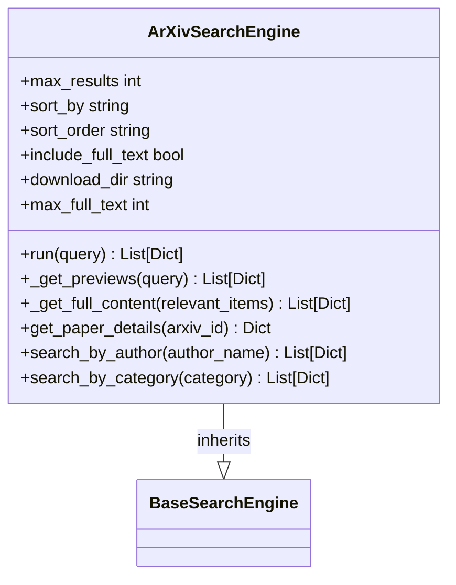

**Diagram sources**
- [search_engine_arxiv.py](file://src/local_deep_research/web_search_engines/engines/search_engine_arxiv.py#L15-L520)

**Section sources**
- [search_engine_arxiv.py](file://src/local_deep_research/web_search_engines/engines/search_engine_arxiv.py#L1-L520)

### PubMed Implementation
The PubMed search engine provides access to biomedical literature from MEDLINE, life science journals, and online books. It implements adaptive search strategies that adjust based on topic volume and whether the query focuses on historical information.

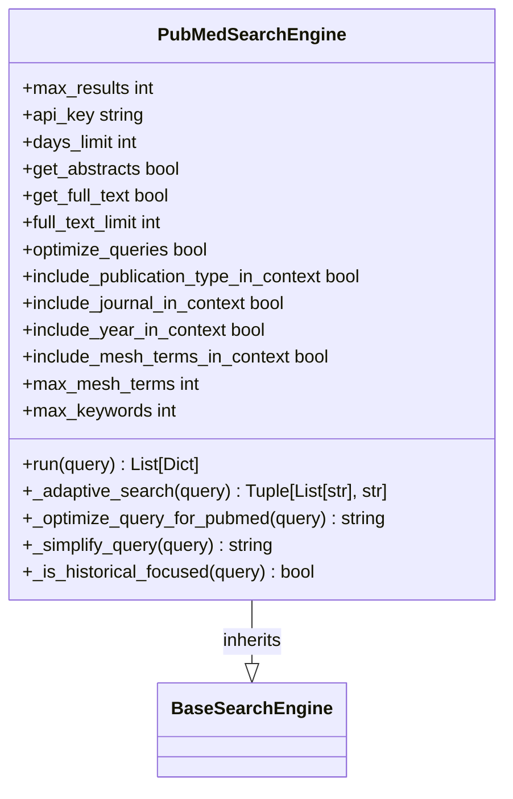

**Diagram sources**
- [search_engine_pubmed.py](file://src/local_deep_research/web_search_engines/engines/search_engine_pubmed.py#L14-L1782)

**Section sources**
- [search_engine_pubmed.py](file://src/local_deep_research/web_search_engines/engines/search_engine_pubmed.py#L1-L1782)

### Semantic Scholar Implementation
The Semantic Scholar search engine provides AI-powered access to scientific literature across all fields. It can retrieve TLDR summaries, citations, references, and SPECTER embeddings for papers, enhancing the research capabilities.

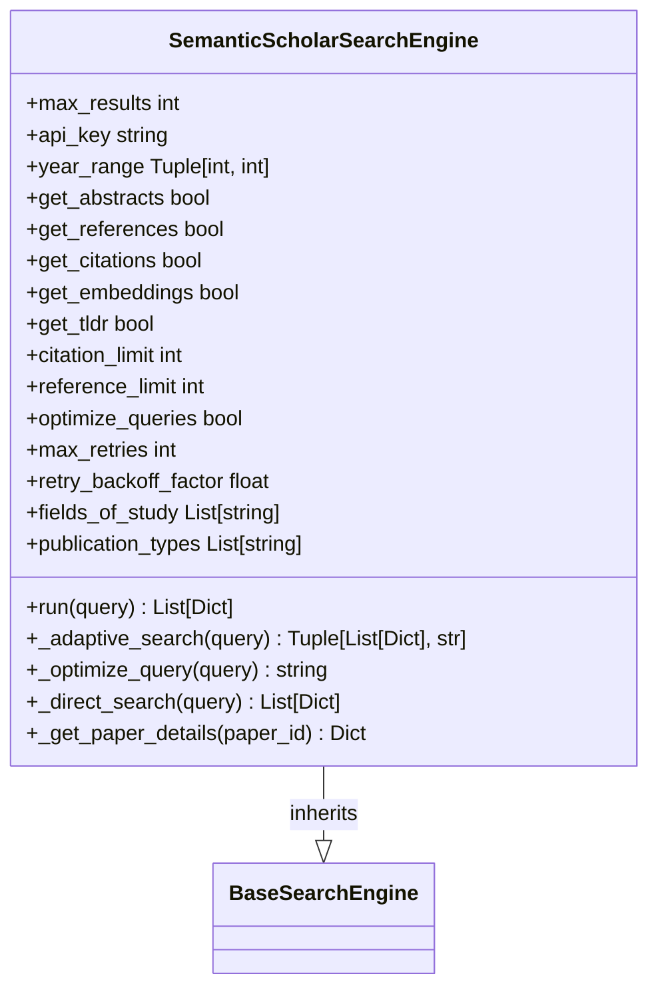

**Diagram sources**
- [search_engine_semantic_scholar.py](file://src/local_deep_research/web_search_engines/engines/search_engine_semantic_scholar.py#L15-L648)

**Section sources**
- [search_engine_semantic_scholar.py](file://src/local_deep_research/web_search_engines/engines/search_engine_semantic_scholar.py#L1-L648)

### OpenAlex Implementation
The OpenAlex search engine provides comprehensive access to academic papers and research with natural language query support. It returns rich metadata including abstracts in inverted index format, citation counts, and open access information.

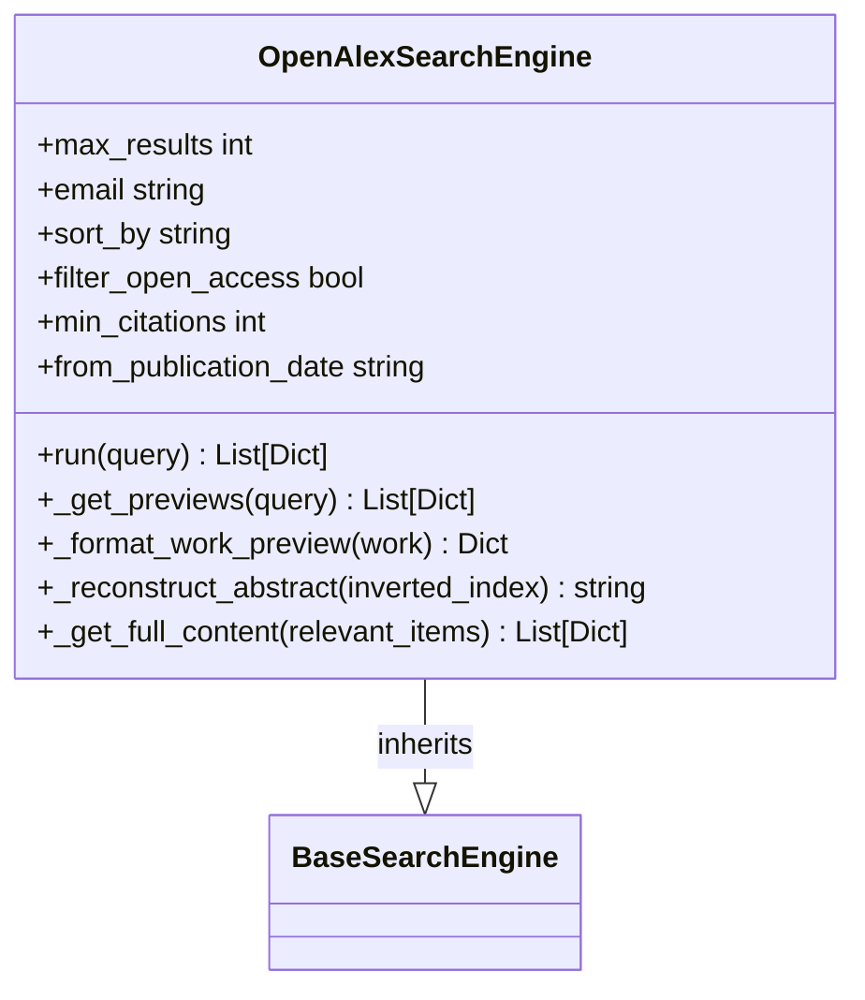

**Diagram sources**
- [search_engine_openalex.py](file://src/local_deep_research/web_search_engines/engines/search_engine_openalex.py#L16-L427)

**Section sources**
- [search_engine_openalex.py](file://src/local_deep_research/web_search_engines/engines/search_engine_openalex.py#L1-L427)

### NASA ADS Implementation
The NASA Astrophysics Data System (ADS) search engine provides access to physics, astronomy, and astrophysics papers. It supports filtering by citation count, publication date, and inclusion of arXiv preprints.

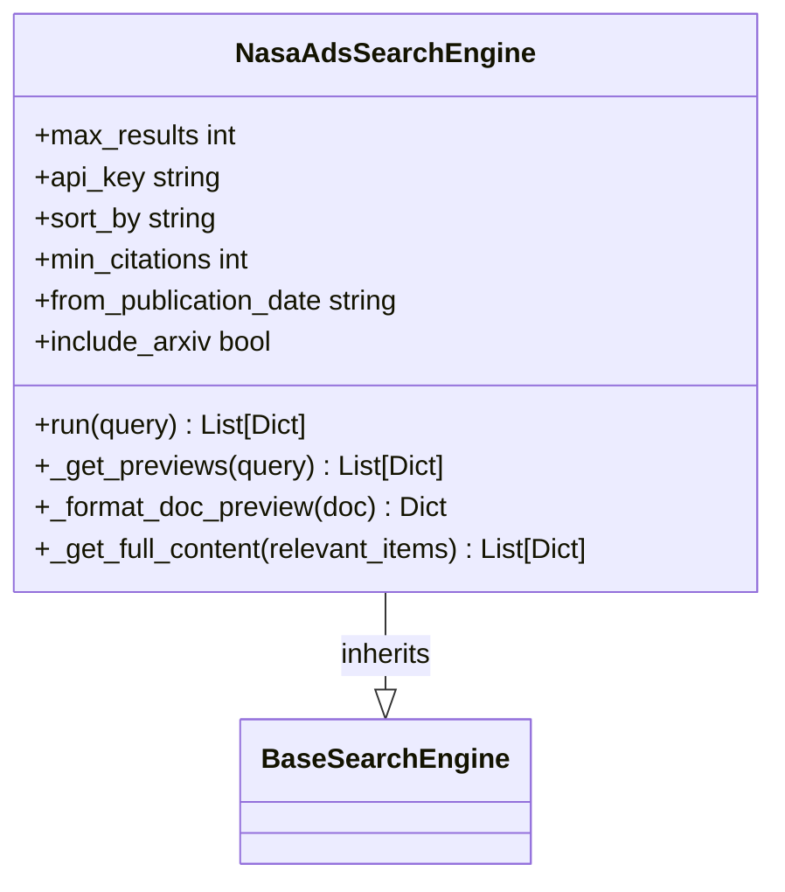

**Diagram sources**
- [search_engine_nasa_ads.py](file://src/local_deep_research/web_search_engines/engines/search_engine_nasa_ads.py#L16-L364)

**Section sources**
- [search_engine_nasa_ads.py](file://src/local_deep_research/web_search_engines/engines/search_engine_nasa_ads.py#L1-L364)

## Metadata Handling and Citation Extraction

Scientific search engines must handle complex metadata structures that vary significantly across different academic sources. The system normalizes this metadata into a consistent format while preserving source-specific information.

### Metadata Normalization
Each search engine converts its native metadata format into a standardized structure with common fields:

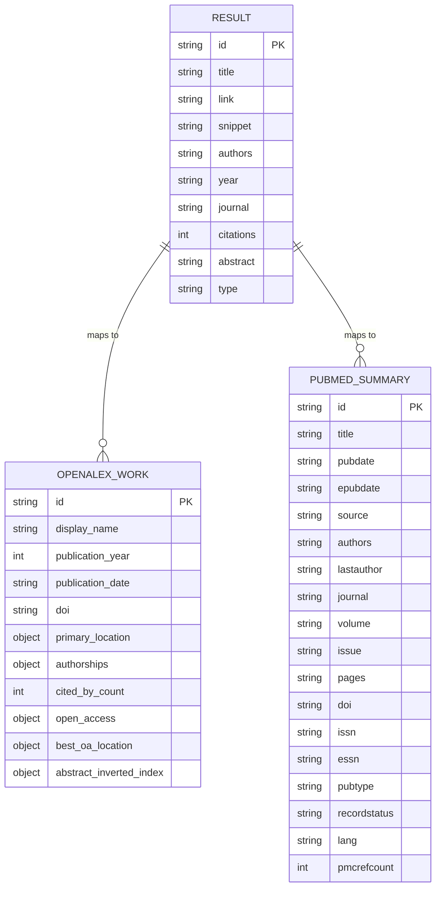

**Diagram sources**
- [search_engine_openalex.py](file://src/local_deep_research/web_search_engines/engines/search_engine_openalex.py#L251-L355)
- [search_engine_pubmed.py](file://src/local_deep_research/web_search_engines/engines/search_engine_pubmed.py#L721-L743)

**Section sources**
- [search_engine_openalex.py](file://src/local_deep_research/web_search_engines/engines/search_engine_openalex.py#L1-L427)
- [search_engine_pubmed.py](file://src/local_deep_research/web_search_engines/engines/search_engine_pubmed.py#L1-L1782)

### Abstract Parsing
Academic databases provide abstracts in various formats, requiring specialized parsing techniques:

- **OpenAlex**: Abstracts are stored in inverted index format, requiring reconstruction
- **PubMed**: Abstracts are returned as plain text
- **Semantic Scholar**: Abstracts may be accompanied by TLDR summaries
- **arXiv**: Abstracts are part of the paper metadata
- **NASA ADS**: Abstracts are included in the document response

The system handles these variations through engine-specific parsing methods that reconstruct the abstract text and include it in the normalized result structure.

**Section sources**
- [search_engine_openalex.py](file://src/local_deep_research/web_search_engines/engines/search_engine_openalex.py#L269-L286)
- [search_engine_pubmed.py](file://src/local_deep_research/web_search_engines/engines/search_engine_pubmed.py#L1588-L1590)

## API Integration and Query Construction

The system implements sophisticated API integration patterns that handle authentication, query optimization, and error recovery for each scientific database.

### Authentication Strategies
Each academic source has different authentication requirements:

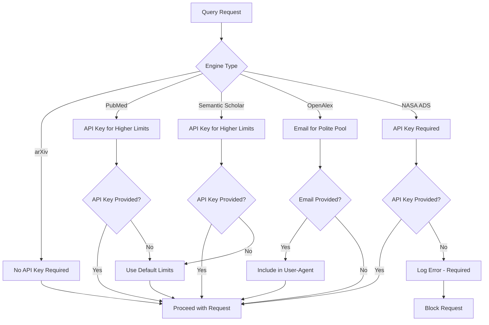

**Diagram sources**
- [search_engine_pubmed.py](file://src/local_deep_research/web_search_engines/engines/search_engine_pubmed.py#L27-L45)
- [search_engine_semantic_scholar.py](file://src/local_deep_research/web_search_engines/engines/search_engine_semantic_scholar.py#L28-L45)
- [search_engine_openalex.py](file://src/local_deep_research/web_search_engines/engines/search_engine_openalex.py#L27-L35)
- [search_engine_nasa_ads.py](file://src/local_deep_research/web_search_engines/engines/search_engine_nasa_ads.py#L27-L35)

**Section sources**
- [search_engine_pubmed.py](file://src/local_deep_research/web_search_engines/engines/search_engine_pubmed.py#L1-L1782)
- [search_engine_semantic_scholar.py](file://src/local_deep_research/web_search_engines/engines/search_engine_semantic_scholar.py#L1-L648)

### Query Optimization
The system optimizes natural language queries for each academic database using language models:

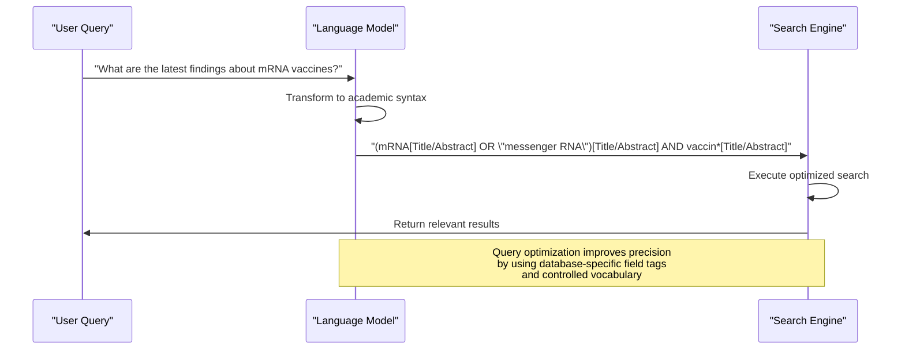

**Diagram sources**
- [search_engine_pubmed.py](file://src/local_deep_research/web_search_engines/engines/search_engine_pubmed.py#L225-L378)
- [search_engine_semantic_scholar.py](file://src/local_deep_research/web_search_engines/engines/search_engine_semantic_scholar.py#L214-L254)

**Section sources**
- [search_engine_pubmed.py](file://src/local_deep_research/web_search_engines/engines/search_engine_pubmed.py#L1-L1782)
- [search_engine_semantic_scholar.py](file://src/local_deep_research/web_search_engines/engines/search_engine_semantic_scholar.py#L1-L648)

## Result Normalization and Data Flow

The system implements a two-phase retrieval approach that optimizes API usage while ensuring comprehensive coverage of relevant academic literature.

### Two-Phase Retrieval Process
```mermaid
flowchart TD
A[User Query] --> B[Get Previews]
B --> C{Apply Preview Filters}
C --> D[Filter for Relevance]
D --> E{Apply Content Filters}
E --> F[Return Results]
subgraph "Phase 1: Preview Retrieval"
B
C
end
subgraph "Phase 2: Full Content Retrieval"
D
E
end
style B fill:#f9f,stroke:#333
style D fill:#f9f,stroke:#333
Note over B: Retrieve basic metadata<br/>from multiple sources
Note over D: Retrieve full content only<br/>for relevant results
```

**Diagram sources**
- [search_engine_base.py](file://src/local_deep_research/web_search_engines/search_engine_base.py#L258-L394)

**Section sources**
- [search_engine_base.py](file://src/local_deep_research/web_search_engines/search_engine_base.py#L1-L657)

### Data Flow Architecture
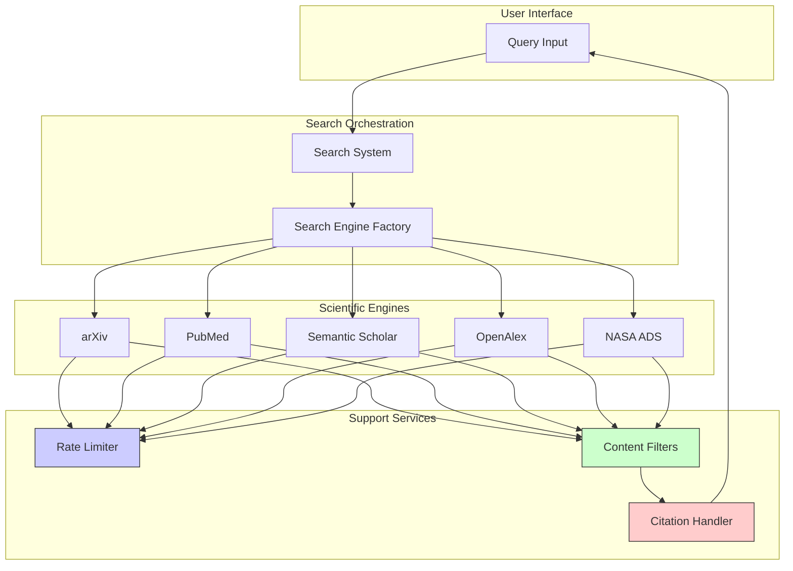

**Diagram sources**
- [search_engine_base.py](file://src/local_deep_research/web_search_engines/search_engine_base.py#L1-L657)
- [search_engine_factory.py](file://src/local_deep_research/web_search_engines/search_engine_factory.py#L1-L100)

**Section sources**
- [search_engine_base.py](file://src/local_deep_research/web_search_engines/search_engine_base.py#L1-L657)

## Rate Limiting and Adaptive Strategies

The system implements an adaptive rate limiting system that learns optimal retry wait times for each search engine based on historical performance.

### Adaptive Rate Limiting Architecture
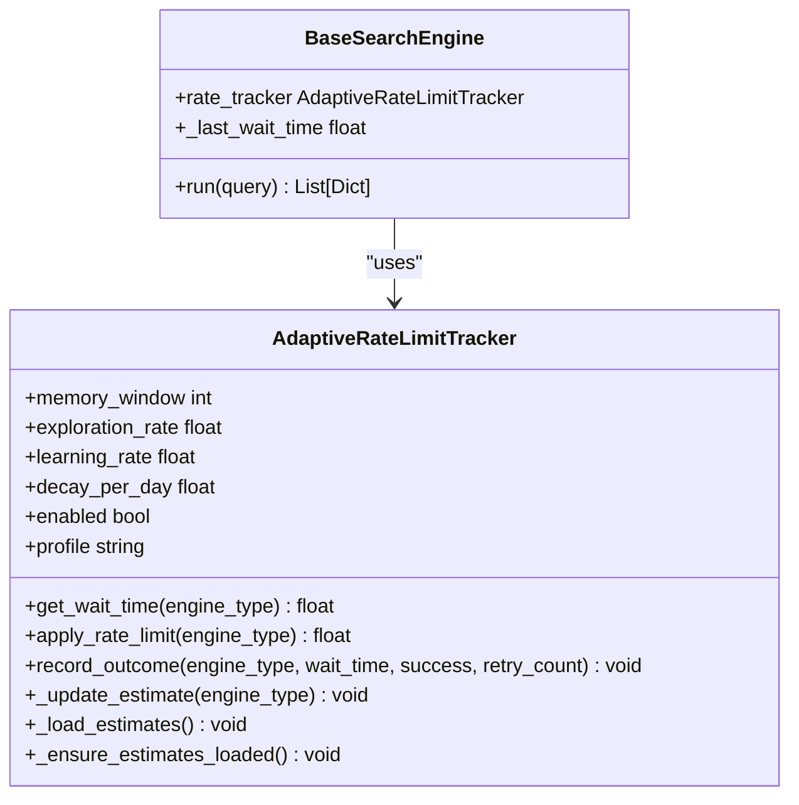

**Diagram sources**
- [tracker.py](file://src/local_deep_research/web_search_engines/rate_limiting/tracker.py#L43-L762)
- [search_engine_base.py](file://src/local_deep_research/web_search_engines/search_engine_base.py#L193-L207)

**Section sources**
- [tracker.py](file://src/local_deep_research/web_search_engines/rate_limiting/tracker.py#L1-L762)

### Rate Limiting Profile Configuration
The system supports different rate limiting profiles that balance reliability and speed:

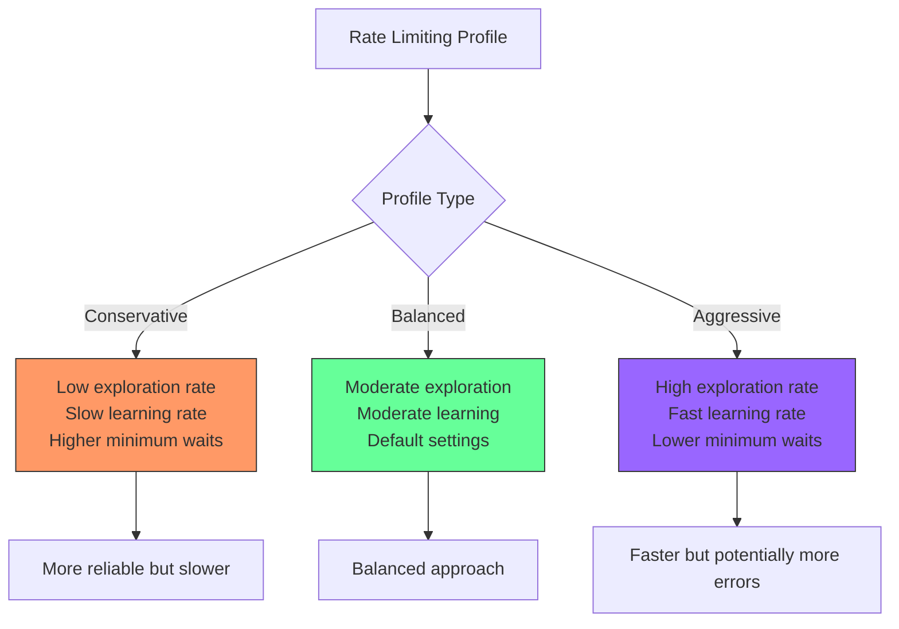

**Diagram sources**
- [tracker.py](file://src/local_deep_research/web_search_engines/rate_limiting/tracker.py#L109-L132)

**Section sources**
- [tracker.py](file://src/local_deep_research/web_search_engines/rate_limiting/tracker.py#L1-L762)

## Citation Pipeline Integration

The system integrates scientific search results with a citation handling pipeline that preserves academic context throughout the research process.

### Citation Handler Architecture
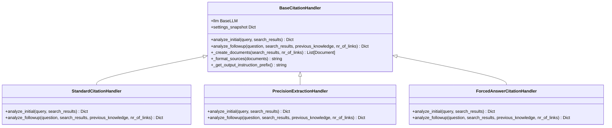

**Diagram sources**
- [base_citation_handler.py](file://src/local_deep_research/citation_handlers/base_citation_handler.py#L11-L111)

**Section sources**
- [base_citation_handler.py](file://src/local_deep_research/citation_handlers/base_citation_handler.py#L1-L111)

### Citation Processing Flow
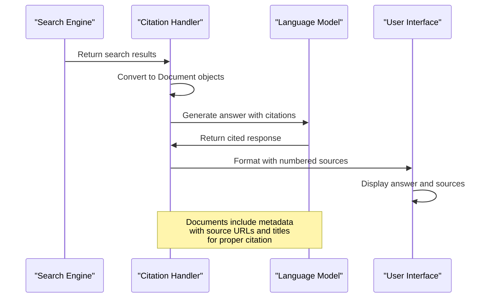

**Diagram sources**
- [base_citation_handler.py](file://src/local_deep_research/citation_handlers/base_citation_handler.py#L53-L84)

**Section sources**
- [base_citation_handler.py](file://src/local_deep_research/citation_handlers/base_citation_handler.py#L1-L111)

## Handling Pre-print vs. Peer-reviewed Content

The system distinguishes between pre-print and peer-reviewed content, providing appropriate context to users.

### Content Type Classification
```mermaid
flowchart TD
A[Research Paper] --> B{Source Type}
B --> |arXiv| C[Pre-print<br/>Not peer-reviewed]
B --> |PubMed| D[Peer-reviewed<br/>Published in journal]
B --> |Semantic Scholar| E[May include both<br/>pre-prints and published papers]
B --> |OpenAlex| F[Includes both<br/>with publication status]
B --> |NASA ADS| G[Includes both<br/>pre-prints and published papers]
C --> H[Display warning icon<br/>and "Pre-print" label]
D --> I[Display journal name<br/>and publication details]
E --> J[Check publication status<br/>and display accordingly]
F --> J
G --> J
style C fill:#ff9,stroke:#333
style D fill:#9f9,stroke:#333
style E fill:#9ff,stroke:#333
style F fill:#9ff,stroke:#333
style G fill:#9ff,stroke:#333
```

**Diagram sources**
- [search_engine_arxiv.py](file://src/local_deep_research/web_search_engines/engines/search_engine_arxiv.py#L23-L24)
- [search_engine_pubmed.py](file://src/local_deep_research/web_search_engines/engines/search_engine_pubmed.py#L22-L23)
- [search_engine_nasa_ads.py](file://src/local_deep_research/web_search_engines/engines/search_engine_nasa_ads.py#L301-L303)

**Section sources**
- [search_engine_arxiv.py](file://src/local_deep_research/web_search_engines/engines/search_engine_arxiv.py#L1-L520)
- [search_engine_pubmed.py](file://src/local_deep_research/web_search_engines/engines/search_engine_pubmed.py#L1-L1782)

## Common Challenges and Solutions

The integration with academic databases presents several common challenges that the system addresses through specialized implementation patterns.

### API Limitations
Academic APIs often have strict rate limits and query constraints:

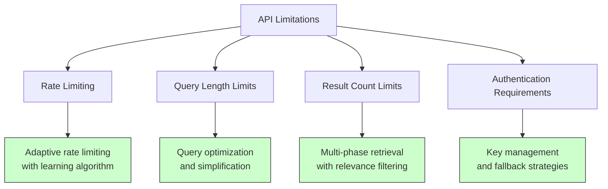

**Diagram sources**
- [tracker.py](file://src/local_deep_research/web_search_engines/rate_limiting/tracker.py#L226-L312)
- [search_engine_pubmed.py](file://src/local_deep_research/web_search_engines/engines/search_engine_pubmed.py#L385-L425)

**Section sources**
- [tracker.py](file://src/local_deep_research/web_search_engines/rate_limiting/tracker.py#L1-L762)
- [search_engine_pubmed.py](file://src/local_deep_research/web_search_engines/engines/search_engine_pubmed.py#L1-L1782)

### Metadata Inconsistencies
Different databases provide metadata in inconsistent formats:

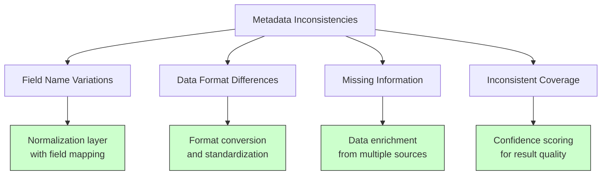

**Diagram sources**
- [search_engine_openalex.py](file://src/local_deep_research/web_search_engines/engines/search_engine_openalex.py#L251-L355)
- [search_engine_pubmed.py](file://src/local_deep_research/web_search_engines/engines/search_engine_pubmed.py#L721-L743)

**Section sources**
- [search_engine_openalex.py](file://src/local_deep_research/web_search_engines/engines/search_engine_openalex.py#L1-L427)
- [search_engine_pubmed.py](file://src/local_deep_research/web_search_engines/engines/search_engine_pubmed.py#L1-L1782)

## Conclusion
The implementation of scientific search engines requires specialized handling of academic metadata, citation networks, and abstract content. By implementing a consistent architecture across multiple academic databases, the system provides researchers with comprehensive access to scholarly literature while preserving the academic context throughout the research process.

Key implementation patterns include:
- Two-phase retrieval to optimize API usage
- Adaptive rate limiting with machine learning
- Query optimization using language models
- Metadata normalization across diverse sources
- Integration with citation handling pipelines
- Distinction between pre-print and peer-reviewed content

These patterns enable researchers to efficiently discover, analyze, and cite academic literature from multiple sources through a unified interface.