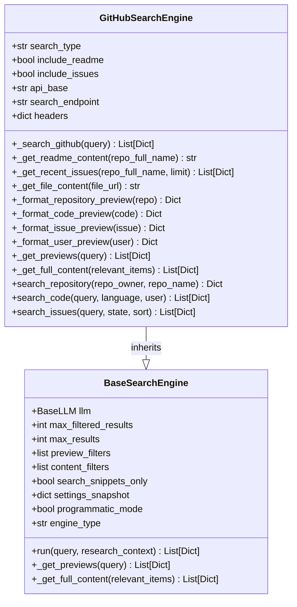
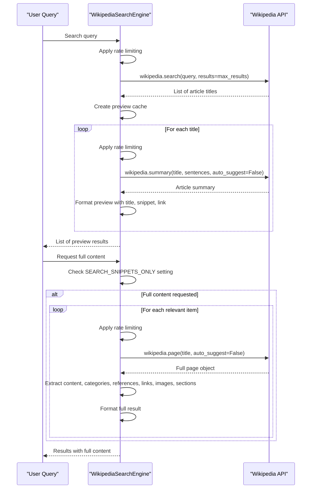
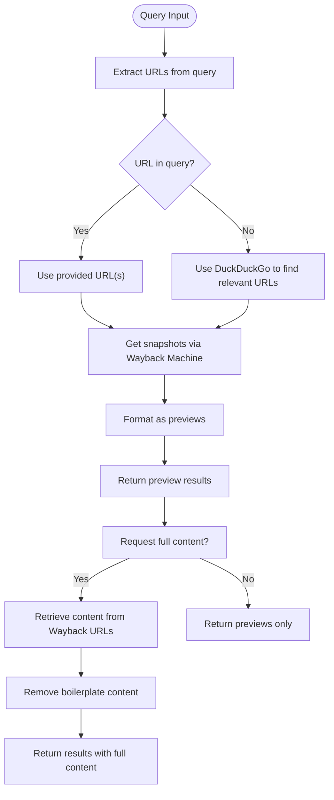
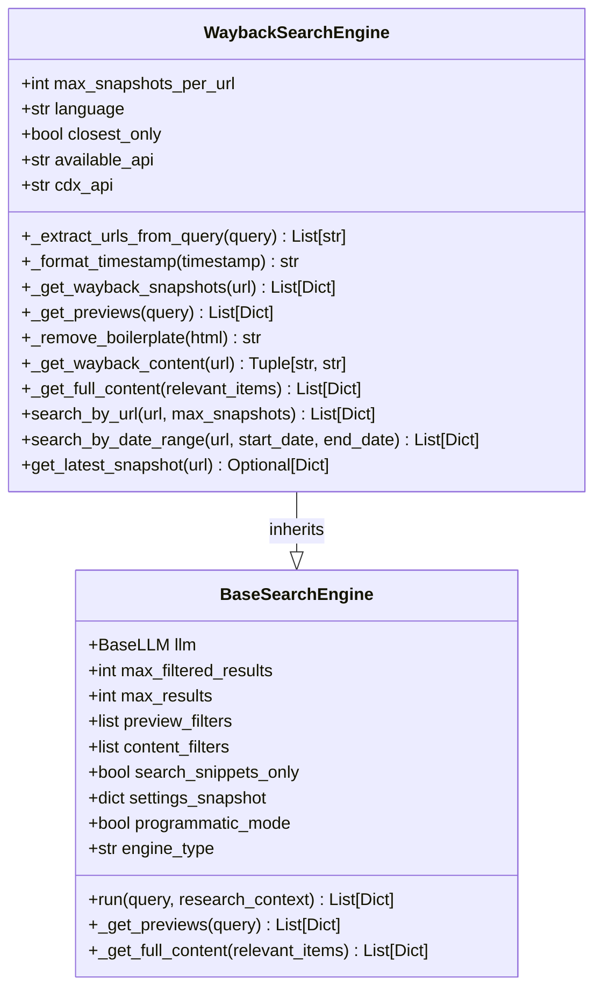
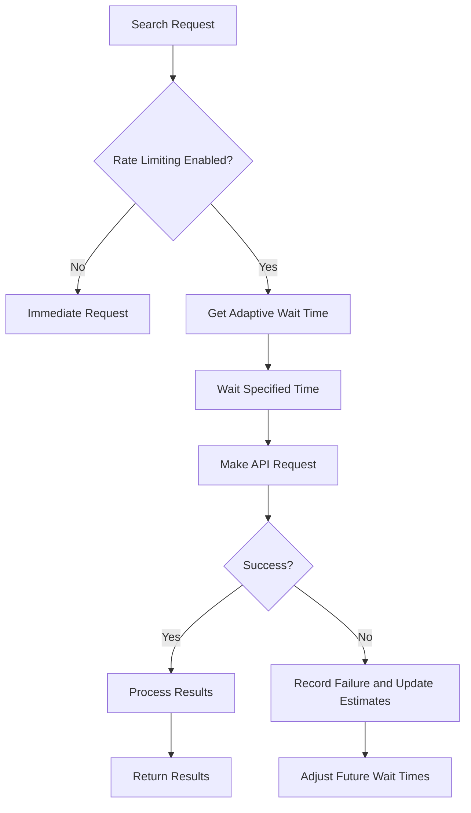

# Technical and Code Search Engines

<cite>
**Referenced Files in This Document**   
- [search_engine_github.py](file://src/local_deep_research/web_search_engines/engines/search_engine_github.py)
- [search_engine_wikipedia.py](file://src/local_deep_research/web_search_engines/engines/search_engine_wikipedia.py)
- [search_engine_wayback.py](file://src/local_deep_research/web_search_engines/engines/search_engine_wayback.py)
- [search_engine_base.py](file://src/local_deep_research/web_search_engines/search_engine_base.py)
- [search_config.py](file://src/local_deep_research/config/search_config.py)
- [tracker.py](file://src/local_deep_research/web_search_engines/rate_limiting/tracker.py)
</cite>

## Table of Contents
1. [Introduction](#introduction)
2. [GitHub Search Engine Implementation](#github-search-engine-implementation)
3. [Wikipedia Search Engine Implementation](#wikipedia-search-engine-implementation)
4. [Wayback Machine Search Engine Implementation](#wayback-machine-search-engine-implementation)
5. [Technical Search Result Processing](#technical-search-result-processing)
6. [Best Practices for Technical Document Handling](#best-practices-for-technical-document-handling)
7. [Conclusion](#conclusion)

## Introduction
This document provides a comprehensive analysis of the implementation of technical search engines for GitHub, Wikipedia, and the Wayback Machine. The system is designed to handle the unique technical requirements of each platform, with specialized approaches for repository search, code snippet extraction, version control metadata handling, article parsing, section navigation, citation extraction, temporal querying, snapshot selection, and archived content processing. The architecture follows a two-phase retrieval approach that optimizes performance and relevance while respecting API rate limits and handling large technical documents efficiently.

**Section sources**
- [search_engine_base.py](file://src/local_deep_research/web_search_engines/search_engine_base.py#L1-L657)

## GitHub Search Engine Implementation

The GitHub search engine implementation provides comprehensive search capabilities across repositories, code, issues, and users. The system is built on a modular architecture that handles authentication, query optimization, result formatting, and content retrieval with specialized methods for each search type.

### Repository Search and Code Snippet Extraction
The GitHub search engine supports multiple search types through the `search_type` parameter, which can be configured as "repositories", "code", "issues", or "users". For repository searches, the engine retrieves metadata including stars, forks, language, topics, and owner information. The implementation includes specialized methods for extracting README content and recent issues when requested:



**Diagram sources**
- [search_engine_github.py](file://src/local_deep_research/web_search_engines/engines/search_engine_github.py#L14-L800)
- [search_engine_base.py](file://src/local_deep_research/web_search_engines/search_engine_base.py#L35-L657)

The engine implements a two-phase retrieval approach where it first retrieves preview information (titles, summaries, metadata) and then selectively retrieves full content for relevant results. This approach minimizes API usage while ensuring comprehensive results for the most relevant items. For code search, the engine can extract file content from specific repositories, preserving the original formatting and syntax.

### Version Control Metadata Handling
The implementation handles version control metadata through several specialized methods. The `_get_recent_issues` method retrieves issue information including state, creation date, update date, user, and comment count. Repository metadata includes stargazers count, forks count, programming language, update timestamp, creation timestamp, topics, and owner information.

The system also implements query optimization using a language model to transform natural language queries into optimized GitHub search syntax. This optimization process adds GitHub-specific filters with dynamic thresholds based on query context, such as star thresholds, language filters, and date ranges. For example, the system can automatically add filters like 'stars:>1000' for mainstream topics or 'stars:>50' for specialized topics.

**Section sources**
- [search_engine_github.py](file://src/local_deep_research/web_search_engines/engines/search_engine_github.py#L1-L800)

## Wikipedia Search Engine Implementation

The Wikipedia search engine implementation provides access to Wikipedia's extensive knowledge base with support for multiple languages and comprehensive content retrieval. The system handles article parsing, section navigation, and citation extraction from wiki markup through a structured approach that preserves the hierarchical organization of Wikipedia content.

### Article Parsing and Section Navigation
The Wikipedia search engine implements a two-phase retrieval approach that first retrieves article previews (titles and summaries) and then selectively retrieves full content for relevant results. The implementation includes comprehensive support for Wikipedia's structured data model:



**Diagram sources**
- [search_engine_wikipedia.py](file://src/local_deep_research/web_search_engines/engines/search_engine_wikipedia.py#L11-L303)

The engine retrieves and preserves Wikipedia's hierarchical structure through the `sections` property, which maintains the article's outline. This allows for effective section navigation and targeted content extraction. The implementation also handles disambiguation pages by attempting to resolve them to the most relevant article, providing a seamless user experience when multiple articles match a query.

### Citation Extraction from Wiki Markup
The Wikipedia search engine extracts citations through the `references` property of the page object, which contains all external references cited in the article. The implementation also preserves internal links through the `links` property and categories through the `categories` property, providing comprehensive metadata about the article's context and relationships.

The system handles various edge cases in Wikipedia content retrieval, including disambiguation errors, page errors, and other Wikipedia-specific exceptions. When a disambiguation error occurs, the engine attempts to resolve it by using the first option from the disambiguation list, ensuring that users receive relevant results even when their query matches multiple articles.

**Section sources**
- [search_engine_wikipedia.py](file://src/local_deep_research/web_search_engines/engines/search_engine_wikipedia.py#L1-L303)

## Wayback Machine Search Engine Implementation

The Wayback Machine search engine implementation provides access to historical versions of web pages through the Internet Archive's Wayback Machine service. The system handles temporal querying, snapshot selection, and archived content processing with specialized methods for different use cases.

### Temporal Querying and Snapshot Selection
The Wayback Machine search engine implements multiple approaches for temporal querying and snapshot selection. The core functionality is built around two API endpoints: the availability API for finding the closest snapshot and the CDX API for retrieving multiple snapshots within a date range:



**Diagram sources**
- [search_engine_wayback.py](file://src/local_deep_research/web_search_engines/engines/search_engine_wayback.py#L14-L539)

The engine supports several specialized methods for different temporal querying scenarios:
- `search_by_url`: Retrieves archived versions of a specific URL
- `search_by_date_range`: Searches for archived versions within a specified date range
- `get_latest_snapshot`: Retrieves the most recent snapshot of a URL

The implementation handles both direct URL queries and natural language queries by first extracting URLs from the query text or using DuckDuckGo to discover relevant URLs when no URLs are present.

### Handling of Archived Content
The Wayback Machine search engine processes archived content by retrieving the raw HTML from the Wayback Machine and then removing boilerplate content using the justext library. This content extraction process preserves the main content of the archived page while removing navigation elements, advertisements, and other non-essential components.



**Diagram sources**
- [search_engine_wayback.py](file://src/local_deep_research/web_search_engines/engines/search_engine_wayback.py#L14-L539)
- [search_engine_base.py](file://src/local_deep_research/web_search_engines/search_engine_base.py#L35-L657)

The content retrieval process includes rate limiting to respect the Wayback Machine's API constraints and error handling for various failure modes, including rate limit errors (HTTP 429) and network errors. The engine also formats timestamps into human-readable dates, making it easier to understand when each snapshot was archived.

**Section sources**
- [search_engine_wayback.py](file://src/local_deep_research/web_search_engines/engines/search_engine_wayback.py#L1-L539)

## Technical Search Result Processing

Technical search results are processed differently from general web results through a two-phase retrieval approach that optimizes performance and relevance. The system implements specialized processing for code blocks and technical documentation to preserve formatting and extract meaningful content.

### Code Block Identification and Processing
The system identifies and processes code blocks through specialized methods in the search engines. For GitHub, code search results include the file path, repository name, and direct link to the code. The implementation preserves the original formatting and syntax when retrieving file content:

```mermaid
flowchart TD
A[Source Document] --> B{Contains code blocks?}
B --> |Yes| C[Identify PRE tags and code elements]
C --> D[Apply monospace font (Courier)]
D --> E[Add gray background for visual distinction]
E --> F[Preserve line breaks and indentation]
F --> G[Wrap long lines to fit page width]
G --> H[Add padding around code block]
H --> I[Render in PDF with proper formatting]
B --> |No| J[Process as regular text]
```

**Diagram sources**
- [pdf.js](file://src/local_deep_research/web/static/js/services/pdf.js#L674-L718)

The processing pipeline ensures that code blocks maintain their structural integrity when rendered in different formats, particularly in PDF output where proper formatting is critical for readability and usability.

### Technical Documentation Parsing
Technical documentation is parsed and processed with attention to preserving structure and formatting. The system handles various technical document elements including tables, code blocks, mathematical notation, and diagrams. For Wikipedia content, the parser extracts and preserves sections, categories, references, and internal links, maintaining the document's hierarchical organization.

The implementation uses a two-phase approach where it first retrieves metadata and summaries, then selectively retrieves full content for relevant results. This approach minimizes bandwidth usage and API calls while ensuring comprehensive results for the most relevant items. The system also applies content filters to remove boilerplate content from archived pages, focusing on the main content of technical documents.

**Section sources**
- [search_engine_base.py](file://src/local_deep_research/web_search_engines/search_engine_base.py#L259-L445)
- [search_engine_github.py](file://src/local_deep_research/web_search_engines/engines/search_engine_github.py#L577-L660)
- [search_engine_wikipedia.py](file://src/local_deep_research/web_search_engines/engines/search_engine_wikipedia.py#L153-L227)
- [search_engine_wayback.py](file://src/local_deep_research/web_search_engines/engines/search_engine_wayback.py#L329-L379)

## Best Practices for Technical Document Handling

The system implements several best practices for handling large technical documents and preserving formatting in technical content. These practices ensure that technical information is presented accurately and usefully to end users.

### Large Document Processing Strategies
For large technical documents, the system implements several optimization strategies:
- **Two-phase retrieval**: First retrieve metadata and summaries, then selectively retrieve full content for relevant results
- **Content filtering**: Apply preview and content filters to reduce noise and focus on relevant information
- **Rate limiting**: Implement adaptive rate limiting to respect API constraints and avoid service disruptions
- **Memory management**: Use streaming and chunking for large content to minimize memory usage

The rate limiting system uses an adaptive approach that learns optimal retry wait times for each search engine, persisting learned patterns to the application database. This system balances the need for timely results with the need to respect API rate limits:



**Diagram sources**
- [tracker.py](file://src/local_deep_research/web_search_engines/rate_limiting/tracker.py#L43-L762)
- [search_engine_base.py](file://src/local_deep_research/web_search_engines/search_engine_base.py#L299-L445)

### Formatting Preservation in Technical Content
The system preserves formatting in technical content through several mechanisms:
- **Code blocks**: Rendered with monospace font, gray background, and preserved indentation
- **Tables**: Maintained with proper column alignment and borders
- **Mathematical notation**: Preserved through appropriate rendering methods
- **Diagrams and images**: Maintained in their original form when possible

For PDF output, the system specifically handles technical content elements:
- Code blocks are rendered with a courier font and gray background
- Long lines are wrapped to fit the page width
- Proper padding is added around code blocks for readability
- Tables are rendered with vertical and horizontal lines to separate cells

These formatting preservation techniques ensure that technical content remains readable and usable in the final output, maintaining the integrity of the original information.

**Section sources**
- [pdf.js](file://src/local_deep_research/web/static/js/services/pdf.js#L662-L718)
- [search_engine_wayback.py](file://src/local_deep_research/web_search_engines/engines/search_engine_wayback.py#L280-L302)
- [search_config.py](file://src/local_deep_research/config/search_config.py#L17-L153)

## Conclusion
The technical search engine implementation provides comprehensive support for GitHub, Wikipedia, and Wayback Machine integrations, each with specialized approaches for their unique technical requirements. The system's two-phase retrieval architecture optimizes performance and relevance while respecting API constraints through adaptive rate limiting. For GitHub, the implementation supports repository search, code snippet extraction, and version control metadata handling. For Wikipedia, it provides article parsing, section navigation, and citation extraction from wiki markup. For the Wayback Machine, it enables temporal querying, snapshot selection, and archived content processing. The system processes technical search results differently from general web results, with specialized handling for code blocks and technical documentation. Best practices for handling large technical documents include two-phase retrieval, content filtering, and adaptive rate limiting, while formatting preservation ensures that technical content remains readable and usable in the final output.