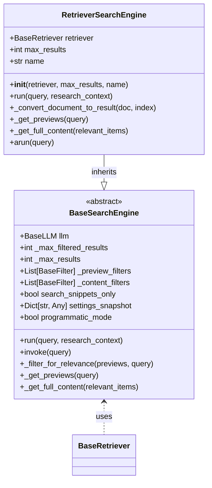
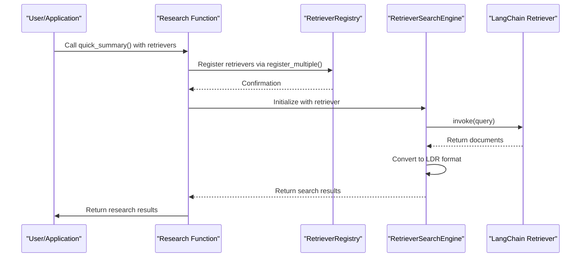
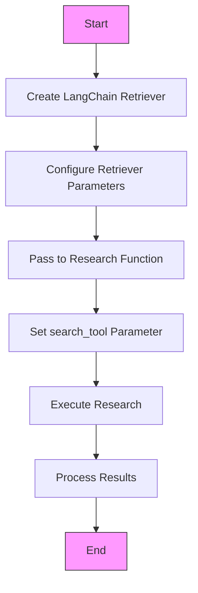
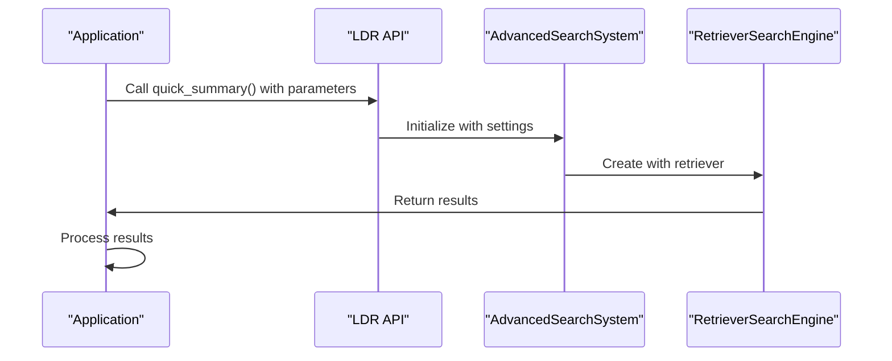

# LangChain Retriever Integration

<cite>
**Referenced Files in This Document**   
- [LANGCHAIN_RETRIEVER_INTEGRATION.md](file://docs/LANGCHAIN_RETRIEVER_INTEGRATION.md)
- [search_engine_retriever.py](file://src/local_deep_research/web_search_engines/engines/search_engine_retriever.py)
- [retriever_registry.py](file://src/local_deep_research/web_search_engines/retriever_registry.py)
- [research_functions.py](file://src/local_deep_research/api/research_functions.py)
- [search_engine_factory.py](file://src/local_deep_research/web_search_engines/search_engine_factory.py)
- [test_custom_langchain_retriever.py](file://tests/langchain_integration/test_custom_langchain_retriever.py)
- [test_combined_llm_retriever.py](file://tests/langchain_integration/test_combined_llm_retriever.py)
</cite>

## Table of Contents
1. [Introduction](#introduction)
2. [LangChainRetriever Architecture](#langchainretriever-architecture)
3. [Setup for Enterprise Knowledge Base Applications](#setup-for-enterprise-knowledge-base-applications)
4. [Integration with LangChain Pipelines](#integration-with-langchain-pipelines)
5. [Programmatic vs Web Interface Usage](#programmatic-vs-web-interface-usage)
6. [Serialization and Deserialization](#serialization-and-deserialization)
7. [Troubleshooting Common Issues](#troubleshooting-common-issues)
8. [Testing Strategy](#testing-strategy)
9. [Conclusion](#conclusion)

## Introduction
The LangChain Retriever Integration enables the use of any LangChain retriever as a search engine within the Local Deep Research (LDR) system. This integration allows users to leverage vector stores, databases, or custom retriever implementations as search sources, providing seamless access to internal knowledge bases and external data sources. The system supports both programmatic and web interface usage patterns, with comprehensive configuration options for enterprise applications.

**Section sources**
- [LANGCHAIN_RETRIEVER_INTEGRATION.md](file://docs/LANGCHAIN_RETRIEVER_INTEGRATION.md#L1-L164)

## LangChainRetriever Architecture

### Initialization Process
The `RetrieverSearchEngine` class serves as the bridge between LangChain retrievers and the LDR search system. It is initialized with a LangChain `BaseRetriever` instance, maximum results parameter, and an optional name. The initialization process registers the retriever in a global registry, making it available for use as a search tool.



**Diagram sources**
- [search_engine_retriever.py](file://src/local_deep_research/web_search_engines/engines/search_engine_retriever.py#L14-L197)
- [search_engine_base.py](file://src/local_deep_research/web_search_engines/search_engine_base.py#L35-L657)

### Search Methods
The `RetrieverSearchEngine` implements the search functionality through its `run` method, which executes the LangChain retriever's `invoke` method to retrieve relevant documents. The results are then converted to the LDR search result format using the `_convert_document_to_result` method. The system also supports asynchronous search through the `arun` method, which attempts to use the retriever's async capabilities when available.

The search process follows a two-phase retrieval approach:
1. Retrieve preview information from the retriever
2. Convert LangChain documents to LDR search result format
3. Apply filtering and relevance checks
4. Return results in the standardized format



**Diagram sources**
- [search_engine_retriever.py](file://src/local_deep_research/web_search_engines/engines/search_engine_retriever.py#L42-L72)
- [research_functions.py](file://src/local_deep_research/api/research_functions.py#L149-L658)

### Metadata Handling
The integration preserves metadata from LangChain documents by including it in the LDR search result format. The `_convert_document_to_result` method extracts metadata from the LangChain Document and maps it to the LDR result structure, ensuring that source information, titles, URLs, authors, dates, and other metadata are maintained throughout the retrieval process.

The conversion process includes:
- Extracting metadata from the LangChain Document
- Mapping metadata fields to LDR result fields
- Preserving all original metadata for flexibility
- Adding retriever-specific information such as retriever type

**Section sources**
- [search_engine_retriever.py](file://src/local_deep_research/web_search_engines/engines/search_engine_retriever.py#L74-L110)

## Setup for Enterprise Knowledge Base Applications

### Configuration of Search Parameters
Enterprise knowledge base applications can be configured through the research functions by passing retrievers as a dictionary to any research function. Each retriever is assigned a name (the dictionary key) and can be selected by setting the `search_tool` parameter to its name. The system supports various configuration options including maximum results, region, time period, safe search, and search language.



**Diagram sources**
- [LANGCHAIN_RETRIEVER_INTEGRATION.md](file://docs/LANGCHAIN_RETRIEVER_INTEGRATION.md#L7-L164)

### Result Formatting
The integration automatically converts LangChain Document objects to the LDR search result format, which includes fields such as title, URL, snippet, full_content, author, date, metadata, score, source, and retriever_type. This standardized format ensures consistency across different retriever types and enables seamless integration with LDR's research capabilities.

The result formatting process handles various edge cases:
- Missing metadata fields
- Long content truncation
- URL generation for documents without explicit sources
- Score assignment based on retriever confidence

**Section sources**
- [search_engine_retriever.py](file://src/local_deep_research/web_search_engines/engines/search_engine_retriever.py#L74-L110)

### Citation Handling
The system preserves citation information through metadata fields in the search results. When a retriever returns documents with citation metadata, this information is maintained in the LDR result format. The citation handler can then use this information to generate proper citations in research reports and summaries.

The citation handling process includes:
- Extracting citation metadata from LangChain documents
- Preserving citation information in the LDR result format
- Using citation data in report generation
- Supporting various citation styles through the citation formatter

**Section sources**
- [text_optimization/citation_formatter.py](file://src/local_deep_research/text_optimization/citation_formatter.py)
- [citation_handler.py](file://src/local_deep_research/citation_handler.py)

## Integration with LangChain Pipelines

### Practical Examples
The integration supports various usage patterns, including single retriever, multiple retrievers, and hybrid search (retriever + web). These patterns can be implemented through the research functions by configuring the `retrievers` and `search_tool` parameters appropriately.

#### Single Retriever Example
```python
result = quick_summary(
    query="Your question",
    retrievers={"my_kb": retriever},
    search_tool="my_kb"  # Use only this retriever
)
```

#### Multiple Retrievers Example
```python
result = detailed_research(
    query="Complex question",
    retrievers={
        "vector_db": vector_retriever,
        "graph_db": graph_retriever,
        "sql_db": sql_retriever
    },
    search_tool="auto"  # Use all retrievers
)
```

#### Hybrid Search Example
```python
result = quick_summary(
    query="Compare internal and external practices",
    retrievers={"internal": internal_retriever},
    search_tool="auto",
    search_engines=["internal", "wikipedia", "searxng"]
)
```

**Section sources**
- [LANGCHAIN_RETRIEVER_INTEGRATION.md](file://docs/LANGCHAIN_RETRIEVER_INTEGRATION.md#L34-L67)

### Supported Retriever Types
The integration supports any LangChain `BaseRetriever` implementation, including:
- **Vector Stores**: FAISS, Chroma, Pinecone, Weaviate, Qdrant, etc.
- **Cloud Services**: Vertex AI, AWS Bedrock, Azure Cognitive Search
- **Databases**: PostgreSQL, MongoDB, Elasticsearch
- **Custom**: Any class inheriting from `BaseRetriever`

The system's flexibility allows users to plug in any retriever implementation without requiring changes to the LDR codebase, enabling zero coupling between the research system and the underlying data sources.

**Section sources**
- [LANGCHAIN_RETRIEVER_INTEGRATION.md](file://docs/LANGCHAIN_RETRIEVER_INTEGRATION.md#L87-L94)

## Programmatic vs Web Interface Usage

### Programmatic Usage Patterns
Programmatic usage involves directly calling the research functions with retriever configurations. This approach provides full control over the research process and enables integration with custom applications and workflows. The programmatic interface supports advanced features such as custom LLMs, settings snapshots, and progress callbacks.

Key characteristics of programmatic usage:
- Direct function calls with parameter configuration
- Support for custom LLMs and retrievers
- Ability to pass settings snapshots
- Progress callback integration
- Flexible result handling



**Diagram sources**
- [research_functions.py](file://src/local_deep_research/api/research_functions.py#L149-L658)

### Web Interface Usage Patterns
Web interface usage involves configuring retrievers through the web UI and executing research through the web interface. This approach provides a user-friendly experience for non-technical users and enables collaboration through shared configurations and results.

Key characteristics of web interface usage:
- Configuration through web forms
- Visual result presentation
- Collaboration features
- Persistent configurations
- Access control and security

The web interface abstracts the complexity of retriever configuration while maintaining the same underlying functionality as the programmatic interface.

**Section sources**
- [web/app.py](file://src/local_deep_research/web/app.py)
- [web/routes/api.py](file://src/local_deep_research/web/routes/api.py)

## Serialization and Deserialization

### State Maintenance Across Sessions
The integration maintains state across sessions through the use of settings snapshots and the retriever registry. Settings snapshots capture the configuration state at a specific point in time, allowing for reproducible research across sessions. The retriever registry provides a thread-safe mechanism for registering and accessing retrievers throughout the application lifecycle.

The serialization process includes:
- Capturing retriever configurations in settings snapshots
- Storing retriever state in the registry
- Preserving metadata and context information
- Enabling session persistence

The deserialization process ensures that retrievers can be reconstructed from their serialized state, maintaining continuity across application restarts and user sessions.

**Section sources**
- [retriever_registry.py](file://src/local_deep_research/web_search_engines/retriever_registry.py#L1-L110)
- [settings_utils.py](file://src/local_deep_research/api/settings_utils.py)

## Troubleshooting Common Issues

### Schema Mismatches
Schema mismatches can occur when the metadata structure of LangChain documents doesn't align with the expected LDR result format. To resolve these issues:
1. Ensure metadata fields in LangChain documents match the expected LDR fields
2. Use the `_convert_document_to_result` method to map custom metadata fields
3. Validate document structure before registration

### Performance Bottlenecks
Performance issues may arise from inefficient retriever implementations or excessive result processing. To address performance bottlenecks:
1. Optimize retriever queries and indexing
2. Limit the number of results returned
3. Use appropriate filtering and relevance checks
4. Monitor and optimize LLM usage

### Authentication Problems
Authentication issues typically occur when retrievers require API keys or other credentials. To resolve authentication problems:
1. Ensure API keys are properly configured in the settings
2. Verify credential validity and permissions
3. Check network connectivity and firewall rules
4. Use secure credential storage mechanisms

**Section sources**
- [security/credential_store_base.py](file://src/local_deep_research/security/credential_store_base.py)
- [retriever_registry.py](file://src/local_deep_research/web_search_engines/retriever_registry.py#L1-L110)

## Testing Strategy

### Test Suite Overview
The integration includes a comprehensive test suite that validates the functionality of custom LangChain retrievers with LDR. The tests cover various scenarios including basic usage, multiple retrievers, hybrid search, empty results, error handling, and report generation.

The test suite is organized into multiple test files:
- `test_custom_langchain_retriever.py`: Tests for custom retriever integration
- `test_combined_llm_retriever.py`: Tests for combined LLM and retriever usage
- `test_retriever_registry.py`: Tests for the retriever registry functionality

### Code Examples from Test Suite
The test suite includes practical examples that demonstrate integration patterns and edge cases. These examples serve as both validation and documentation for the integration.

#### Custom Retriever Test
```python
class CustomTestRetriever(BaseRetriever):
    """Custom retriever for testing."""
    
    def _get_relevant_documents(self, query: str) -> List[Document]:
        """Get documents relevant to the query."""
        # Simple keyword matching for testing
        relevant_docs = []
        query_lower = query.lower()
        
        for doc in self.documents:
            content_lower = doc.page_content.lower()
            if any(word in content_lower for word in query_lower.split()):
                relevant_docs.append(doc)
        
        return relevant_docs
```

#### Combined LLM and Retriever Test
```python
def test_engineering_research_with_custom_components(self, settings_snapshot):
    """Test engineering-focused research with custom LLM and retriever."""
    # Create custom components
    eng_retriever = CompanyKnowledgeRetriever(knowledge_domain="engineering")
    custom_llm = CompanyCustomLLM(model_version="v1", use_company_style=True)
    
    result = quick_summary(
        query="What are our engineering best practices for microservices?",
        research_id=10001,
        llms={"custom": custom_llm},
        retrievers={"eng_kb": eng_retriever},
        search_tool="eng_kb",
        settings_snapshot=settings_snapshot,
        iterations=1,
        questions_per_iteration=2,
    )
```

**Section sources**
- [test_custom_langchain_retriever.py](file://tests/langchain_integration/test_custom_langchain_retriever.py#L1-L469)
- [test_combined_llm_retriever.py](file://tests/langchain_integration/test_combined_llm_retriever.py#L1-L524)

## Conclusion
The LangChain Retriever Integration provides a flexible and powerful mechanism for incorporating various data sources into the Local Deep Research system. By supporting any LangChain `BaseRetriever` implementation, the integration enables seamless access to vector stores, databases, and custom retrieval systems. The architecture is designed for enterprise applications with comprehensive configuration options, robust error handling, and thorough testing. Whether used programmatically or through the web interface, the integration maintains state across sessions and provides consistent result formatting and citation handling. This comprehensive approach ensures that organizations can effectively leverage their internal knowledge bases and external data sources for advanced research and analysis.