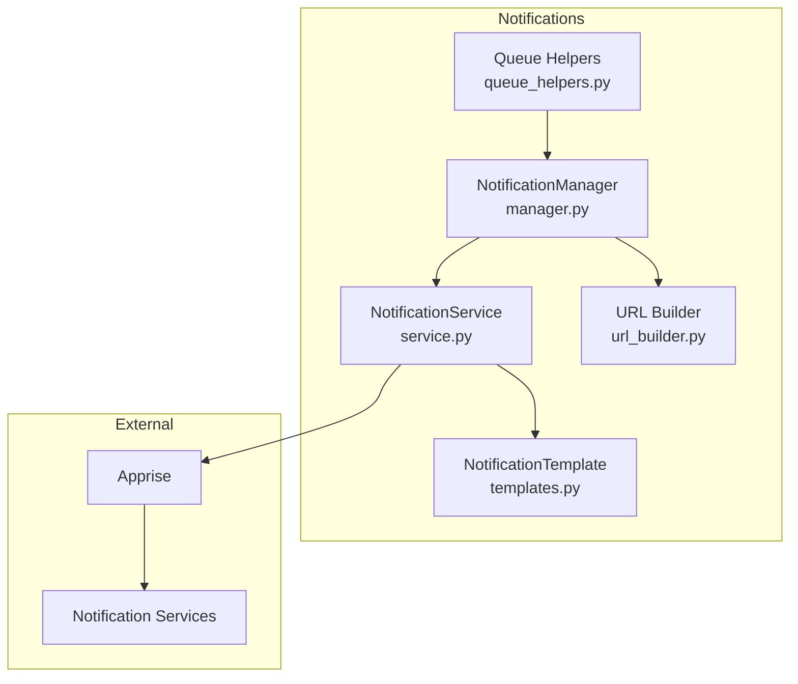
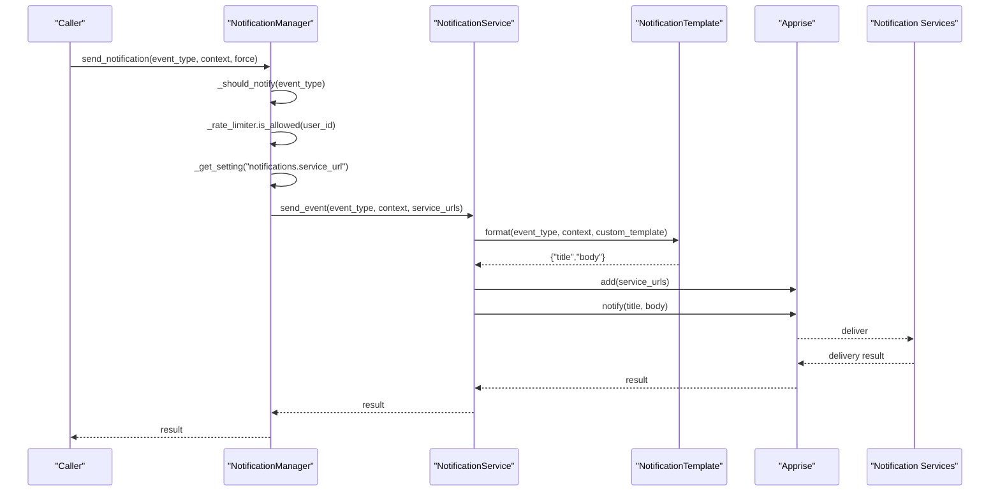
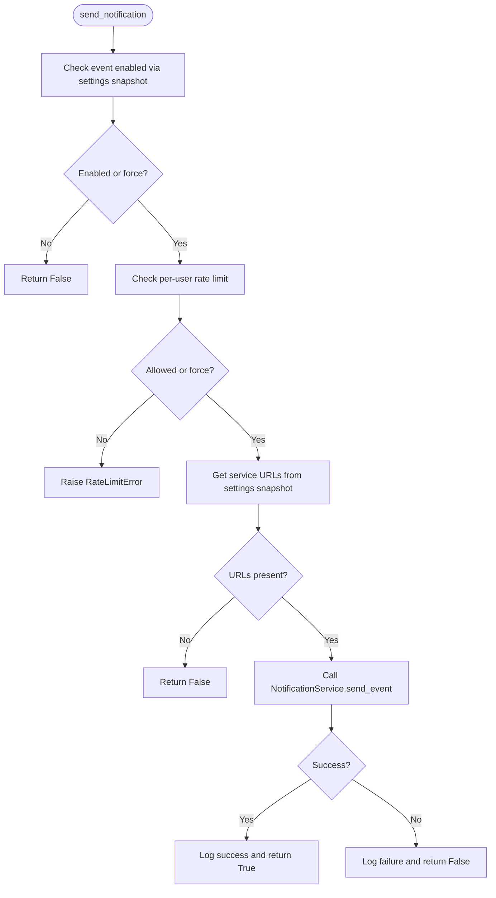
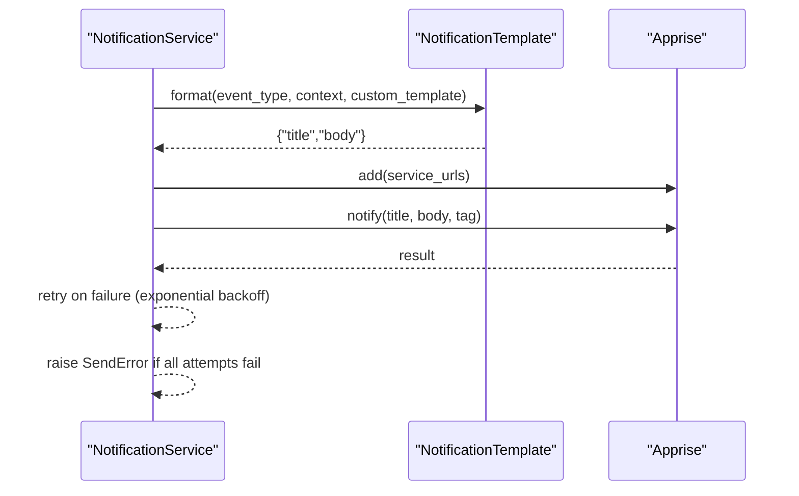
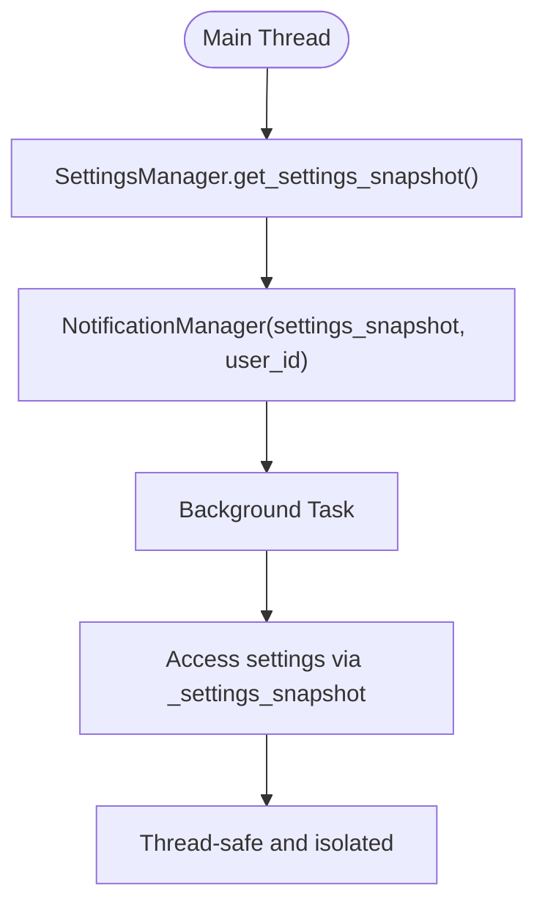
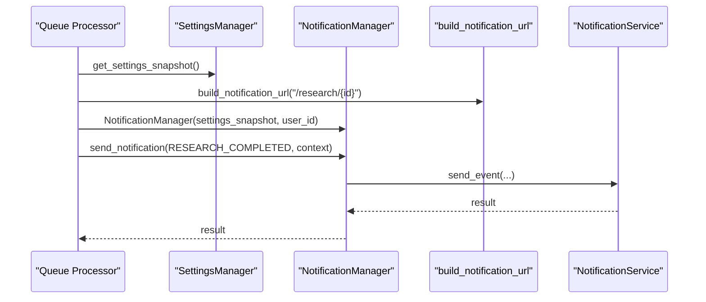
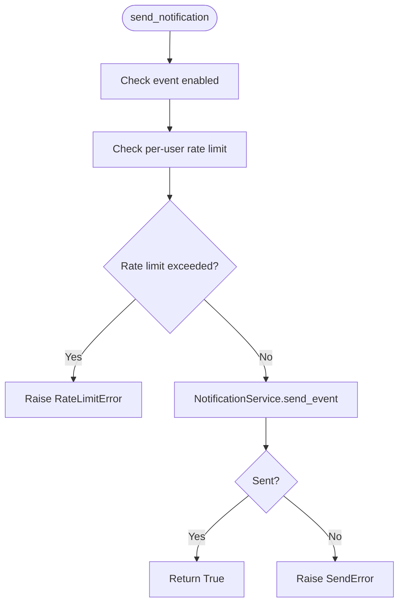
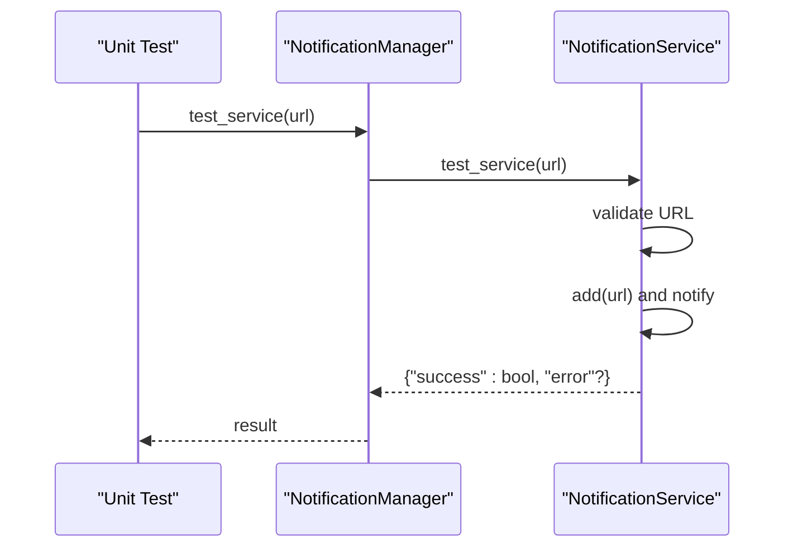
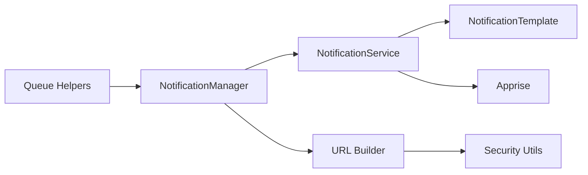

# API and Integration

<cite>
**Referenced Files in This Document**
- [manager.py](file://src/local_deep_research/notifications/manager.py)
- [service.py](file://src/local_deep_research/notifications/service.py)
- [templates.py](file://src/local_deep_research/notifications/templates.py)
- [exceptions.py](file://src/local_deep_research/notifications/exceptions.py)
- [url_builder.py](file://src/local_deep_research/notifications/url_builder.py)
- [queue_helpers.py](file://src/local_deep_research/notifications/queue_helpers.py)
- [NOTIFICATIONS.md](file://docs/NOTIFICATIONS.md)
- [NOTIFICATION_FLOW.md](file://docs/NOTIFICATION_FLOW.md)
- [test_manager.py](file://tests/notifications/test_manager.py)
- [test_service.py](file://tests/notifications/test_service.py)
- [test_url_builder.py](file://tests/notifications/test_url_builder.py)
</cite>

## Table of Contents
1. [Introduction](#introduction)
2. [Project Structure](#project-structure)
3. [Core Components](#core-components)
4. [Architecture Overview](#architecture-overview)
5. [Detailed Component Analysis](#detailed-component-analysis)
6. [Dependency Analysis](#dependency-analysis)
7. [Performance Considerations](#performance-considerations)
8. [Troubleshooting Guide](#troubleshooting-guide)
9. [Conclusion](#conclusion)
10. [Appendices](#appendices)

## Introduction
This document provides API documentation and integration guidance for programmatic notification workflows in Local Deep Research. It focuses on:
- NotificationManager.send_notification method parameters: event_type, context, and force flag
- How to obtain settings snapshots for thread-safe usage in background tasks
- Integrating notifications into custom research workflows and follow-up systems
- NotificationService.send_event method for direct service access
- Python examples for sending notifications from web request contexts and background worker threads
- Error handling for RateLimitError and SendError exceptions
- Testing notification integration using the test_service method and appropriate mocking strategies for unit tests

## Project Structure
The notification system is organized around three primary modules:
- NotificationManager: High-level orchestrator with rate limiting and settings integration
- NotificationService: Low-level Apprise-backed sender with retry logic
- Templates: Event-driven message formatting and required context variables
- Utilities: URL builder for clickable links and queue helpers for research workflows

**Diagram sources**
- [manager.py](file://src/local_deep_research/notifications/manager.py#L1-L120)
- [service.py](file://src/local_deep_research/notifications/service.py#L1-L120)
- [templates.py](file://src/local_deep_research/notifications/templates.py#L1-L120)
- [url_builder.py](file://src/local_deep_research/notifications/url_builder.py#L1-L60)
- [queue_helpers.py](file://src/local_deep_research/notifications/queue_helpers.py#L1-L60)

**Section sources**
- [manager.py](file://src/local_deep_research/notifications/manager.py#L1-L120)
- [service.py](file://src/local_deep_research/notifications/service.py#L1-L120)
- [templates.py](file://src/local_deep_research/notifications/templates.py#L1-L120)
- [url_builder.py](file://src/local_deep_research/notifications/url_builder.py#L1-L60)
- [queue_helpers.py](file://src/local_deep_research/notifications/queue_helpers.py#L1-L60)

## Core Components
- NotificationManager
  - Purpose: Centralized notification orchestration with per-user rate limiting and settings snapshot access
  - Key capabilities:
    - send_notification(event_type, context, force)
    - test_service(url)
    - Internal rate limiting via a shared singleton with per-user limits
- NotificationService
  - Purpose: Apprise-backed sender with retry logic and URL validation
  - Key capabilities:
    - send_event(event_type, context, service_urls, tag, custom_template)
    - test_service(url)
    - get_service_type(url)
- NotificationTemplate
  - Purpose: Event-driven message formatting using Jinja2 templates
  - Key capabilities:
    - format(event_type, context, custom_template)
    - get_required_context(event_type)
- URL Builder
  - Purpose: Construct HTTP/HTTPS URLs for clickable links in notifications
  - Key capabilities:
    - build_notification_url(path, settings_manager/settings_snapshot, fallback_base, validate)
- Queue Helpers
  - Purpose: Convenience wrappers for research queue notifications
  - Key capabilities:
    - send_queue_notification(...)
    - send_queue_failed_notification(...)
    - send_research_completed_notification_from_session(...)
    - send_research_failed_notification_from_session(...)

**Section sources**
- [manager.py](file://src/local_deep_research/notifications/manager.py#L120-L260)
- [service.py](file://src/local_deep_research/notifications/service.py#L120-L240)
- [templates.py](file://src/local_deep_research/notifications/templates.py#L90-L180)
- [url_builder.py](file://src/local_deep_research/notifications/url_builder.py#L20-L98)
- [queue_helpers.py](file://src/local_deep_research/notifications/queue_helpers.py#L1-L120)

## Architecture Overview
The notification pipeline integrates research lifecycle events with user-configured services. The flow below maps to actual code paths and demonstrates how settings snapshots, rate limiting, and Apprise are orchestrated.

**Diagram sources**
- [manager.py](file://src/local_deep_research/notifications/manager.py#L149-L238)
- [service.py](file://src/local_deep_research/notifications/service.py#L195-L235)
- [templates.py](file://src/local_deep_research/notifications/templates.py#L92-L155)

**Section sources**
- [NOTIFICATION_FLOW.md](file://docs/NOTIFICATION_FLOW.md#L1-L120)
- [manager.py](file://src/local_deep_research/notifications/manager.py#L149-L238)
- [service.py](file://src/local_deep_research/notifications/service.py#L195-L235)
- [templates.py](file://src/local_deep_research/notifications/templates.py#L92-L155)

## Detailed Component Analysis

### NotificationManager.send_notification
- Parameters
  - event_type: EventType enum value indicating the event category
  - context: Dict[str, Any] providing variables required by the template for the given event
  - force: bool controlling whether to bypass rate limiting and disabled settings
- Behavior
  - Checks event enablement via settings snapshot
  - Enforces per-user rate limiting using a shared singleton
  - Retrieves service URLs from settings snapshot
  - Delegates to NotificationService.send_event
  - Logs outcomes and returns success/failure
- Error handling
  - Raises RateLimitError when rate limit exceeded and force is False
  - Catches and logs other exceptions, returning False without raising

**Diagram sources**
- [manager.py](file://src/local_deep_research/notifications/manager.py#L149-L238)

**Section sources**
- [manager.py](file://src/local_deep_research/notifications/manager.py#L149-L238)
- [test_manager.py](file://tests/notifications/test_manager.py#L91-L170)

### NotificationService.send_event
- Parameters
  - event_type: EventType
  - context: Dict[str, Any]
  - service_urls: Optional[str] (comma-separated)
  - tag: Optional[str]
  - custom_template: Optional[Dict[str, str]]
- Behavior
  - Formats message using NotificationTemplate.format
  - Sends via NotificationService.send with retry logic
  - Validates service URLs when provided
- Error handling
  - Raises SendError after retries exhausted
  - Returns False when no configured service URLs

**Diagram sources**
- [service.py](file://src/local_deep_research/notifications/service.py#L195-L235)
- [templates.py](file://src/local_deep_research/notifications/templates.py#L92-L155)

**Section sources**
- [service.py](file://src/local_deep_research/notifications/service.py#L110-L235)
- [test_service.py](file://tests/notifications/test_service.py#L172-L210)

### Obtaining Settings Snapshots for Thread-Safe Usage
- Best practice
  - Capture settings once in the main thread/session and pass a dict (settings_snapshot) to NotificationManager
  - Never pass a database session to NotificationManager from background threads
- Implementation pattern
  - Use SettingsManager.get_settings_snapshot() to capture a dict of current user settings
  - Pass settings_snapshot and user_id to NotificationManager
- Why it matters
  - Ensures thread safety and avoids reliance on Flask g or SQLite sessions in background threads

**Diagram sources**
- [NOTIFICATION_FLOW.md](file://docs/NOTIFICATION_FLOW.md#L315-L345)
- [manager.py](file://src/local_deep_research/notifications/manager.py#L57-L120)

**Section sources**
- [NOTIFICATIONS.md](file://docs/NOTIFICATIONS.md#L158-L170)
- [NOTIFICATION_FLOW.md](file://docs/NOTIFICATION_FLOW.md#L315-L345)
- [manager.py](file://src/local_deep_research/notifications/manager.py#L57-L120)

### Integrating Notifications into Custom Research Workflows and Follow-Up Systems
- Research completed
  - Use queue helpers to build context and send notifications
  - Build full URL with build_notification_url for clickable links
- Research failed
  - Use queue helpers to sanitize and send failure notifications
- Queue events
  - Use send_queue_notification and send_queue_failed_notification for queue lifecycle updates
- Patterns
  - Always capture settings_snapshot in the main thread
  - Use NotificationManager.user_id for per-user rate limiting
  - Optionally use force=True for critical notifications

**Diagram sources**
- [queue_helpers.py](file://src/local_deep_research/notifications/queue_helpers.py#L164-L297)
- [url_builder.py](file://src/local_deep_research/notifications/url_builder.py#L21-L98)
- [manager.py](file://src/local_deep_research/notifications/manager.py#L149-L238)

**Section sources**
- [queue_helpers.py](file://src/local_deep_research/notifications/queue_helpers.py#L1-L120)
- [queue_helpers.py](file://src/local_deep_research/notifications/queue_helpers.py#L164-L297)
- [url_builder.py](file://src/local_deep_research/notifications/url_builder.py#L21-L98)

### NotificationService.send_event for Direct Service Access
- When to use
  - When you need to bypass NotificationManager’s settings checks and rate limiting
  - For direct, immediate delivery with explicit service URLs
- Parameters and behavior
  - Same as NotificationService.send_event documented above
  - Returns immediately upon success or raises SendError after retries

**Section sources**
- [service.py](file://src/local_deep_research/notifications/service.py#L195-L235)
- [test_service.py](file://tests/notifications/test_service.py#L172-L210)

### Python Examples: Web Request Context and Background Worker Threads
- Web request context
  - Obtain settings_snapshot from SettingsManager in the request thread
  - Create NotificationManager with settings_snapshot and user_id
  - Call send_notification with appropriate event_type and context
- Background worker thread
  - Capture settings_snapshot in the main thread before spawning background tasks
  - Pass settings_snapshot and user_id to NotificationManager in the worker
  - Use force=True sparingly for critical notifications

References to example patterns:
- Settings snapshot usage and NotificationManager instantiation
- URL building for clickable links
- Queue helper usage for research lifecycle events

**Section sources**
- [NOTIFICATIONS.md](file://docs/NOTIFICATIONS.md#L96-L128)
- [NOTIFICATION_FLOW.md](file://docs/NOTIFICATION_FLOW.md#L315-L345)
- [queue_helpers.py](file://src/local_deep_research/notifications/queue_helpers.py#L164-L297)
- [url_builder.py](file://src/local_deep_research/notifications/url_builder.py#L21-L98)

### Error Handling: RateLimitError and SendError
- RateLimitError
  - Raised when per-user rate limit is exceeded and force is False
  - Managed by NotificationManager._rate_limiter (shared singleton with per-user limits)
- SendError
  - Raised by NotificationService after retry attempts are exhausted
  - Indicates service connectivity or credential issues

**Diagram sources**
- [manager.py](file://src/local_deep_research/notifications/manager.py#L193-L205)
- [service.py](file://src/local_deep_research/notifications/service.py#L110-L194)
- [exceptions.py](file://src/local_deep_research/notifications/exceptions.py#L1-L28)

**Section sources**
- [manager.py](file://src/local_deep_research/notifications/manager.py#L193-L205)
- [service.py](file://src/local_deep_research/notifications/service.py#L110-L194)
- [exceptions.py](file://src/local_deep_research/notifications/exceptions.py#L1-L28)

### Testing Notification Integration
- test_service(url)
  - Validates a service URL and attempts to send a test notification
  - Returns a dict with success and optional error message
- Unit testing strategies
  - Mock NotificationService.send_event to return True/False
  - Mock NotificationService.send to simulate retries and failures
  - Use RateLimiter.is_allowed to simulate rate limit scenarios
  - Validate URL building with build_notification_url and URLValidator

**Diagram sources**
- [manager.py](file://src/local_deep_research/notifications/manager.py#L249-L259)
- [service.py](file://src/local_deep_research/notifications/service.py#L236-L298)

**Section sources**
- [test_manager.py](file://tests/notifications/test_manager.py#L342-L379)
- [test_service.py](file://tests/notifications/test_service.py#L210-L249)
- [test_url_builder.py](file://tests/notifications/test_url_builder.py#L100-L170)

## Dependency Analysis
- Internal dependencies
  - NotificationManager depends on NotificationService, NotificationTemplate, and settings snapshot
  - NotificationService depends on NotificationTemplate and Apprise
  - URL Builder depends on security utilities and SettingsManager
  - Queue Helpers depend on NotificationManager, URL Builder, and SettingsManager
- External dependencies
  - Apprise for multi-service delivery
  - Jinja2 for templating
  - Tenacity for retry logic

**Diagram sources**
- [manager.py](file://src/local_deep_research/notifications/manager.py#L1-L120)
- [service.py](file://src/local_deep_research/notifications/service.py#L1-L120)
- [templates.py](file://src/local_deep_research/notifications/templates.py#L1-L120)
- [url_builder.py](file://src/local_deep_research/notifications/url_builder.py#L1-L60)
- [queue_helpers.py](file://src/local_deep_research/notifications/queue_helpers.py#L1-L60)

**Section sources**
- [manager.py](file://src/local_deep_research/notifications/manager.py#L1-L120)
- [service.py](file://src/local_deep_research/notifications/service.py#L1-L120)
- [templates.py](file://src/local_deep_research/notifications/templates.py#L1-L120)
- [url_builder.py](file://src/local_deep_research/notifications/url_builder.py#L1-L60)
- [queue_helpers.py](file://src/local_deep_research/notifications/queue_helpers.py#L1-L60)

## Performance Considerations
- Temporary Apprise instances: Created per send and garbage-collected automatically
- Shared rate limiter: Singleton with per-user limits and counters for memory efficiency
- Exponential backoff retry: Up to 3 attempts with increasing delays to handle transient failures
- Thread safety: Rate limiter uses locks for concurrent access within a process

**Section sources**
- [service.py](file://src/local_deep_research/notifications/service.py#L130-L194)
- [manager.py](file://src/local_deep_research/notifications/manager.py#L312-L420)

## Troubleshooting Guide
Common issues and resolutions:
- No service URLs configured
  - Cause: notifications.service_url is empty
  - Resolution: Configure service URL in settings
- Rate limit exceeded
  - Cause: Per-user hourly/daily limit reached
  - Resolution: Wait for window to reset, adjust settings, or use force=True for critical notifications
- Send failure after retries
  - Cause: Service unreachable or invalid credentials
  - Resolution: Test service URL, verify network connectivity, and reconfigure service URLs
- Notifications disabled for event type
  - Cause: Event-specific toggle disabled
  - Resolution: Enable the relevant notifications.on_<event> setting

**Section sources**
- [NOTIFICATIONS.md](file://docs/NOTIFICATIONS.md#L235-L262)
- [NOTIFICATION_FLOW.md](file://docs/NOTIFICATION_FLOW.md#L464-L509)

## Conclusion
The notification system provides a robust, thread-safe, and extensible mechanism for delivering user-facing alerts across multiple services. By leveraging settings snapshots, per-user rate limiting, and Apprise-backed delivery with retry logic, it supports reliable integration in both web request contexts and background worker threads. Use the provided APIs and helpers to build custom research workflows and follow-up systems that are secure, scalable, and maintainable.

## Appendices

### API Reference: NotificationManager.send_notification
- Parameters
  - event_type: EventType
  - context: Dict[str, Any]
  - force: bool (default False)
- Returns
  - bool indicating success
- Exceptions
  - RateLimitError when rate limit exceeded and force is False

**Section sources**
- [manager.py](file://src/local_deep_research/notifications/manager.py#L149-L238)
- [exceptions.py](file://src/local_deep_research/notifications/exceptions.py#L24-L28)

### API Reference: NotificationService.send_event
- Parameters
  - event_type: EventType
  - context: Dict[str, Any]
  - service_urls: Optional[str]
  - tag: Optional[str]
  - custom_template: Optional[Dict[str, str]]
- Returns
  - bool indicating success
- Exceptions
  - SendError after retries exhausted

**Section sources**
- [service.py](file://src/local_deep_research/notifications/service.py#L195-L235)
- [exceptions.py](file://src/local_deep_research/notifications/exceptions.py#L18-L23)

### API Reference: URL Builder
- Parameters
  - path: str
  - settings_manager or settings_snapshot: Optional
  - fallback_base: str (default "http://localhost:5000")
  - validate: bool (default True)
- Returns
  - str full HTTP/HTTPS URL
- Exceptions
  - URLValidationError when validation fails

**Section sources**
- [url_builder.py](file://src/local_deep_research/notifications/url_builder.py#L21-L98)
- [test_url_builder.py](file://tests/notifications/test_url_builder.py#L100-L170)

### Event Types and Required Context
- RESEARCH_COMPLETED: requires query, research_id, summary, url
- RESEARCH_FAILED: requires query, research_id, error
- RESEARCH_QUEUED: requires query, research_id, position (optional)
- SUBSCRIPTION_UPDATE/SUBSCRIPTION_ERROR: requires subscription_name/id and details
- API_QUOTA_WARNING/AUTH_ISSUE: requires service and related metrics

**Section sources**
- [templates.py](file://src/local_deep_research/notifications/templates.py#L13-L52)
- [templates.py](file://src/local_deep_research/notifications/templates.py#L180-L231)