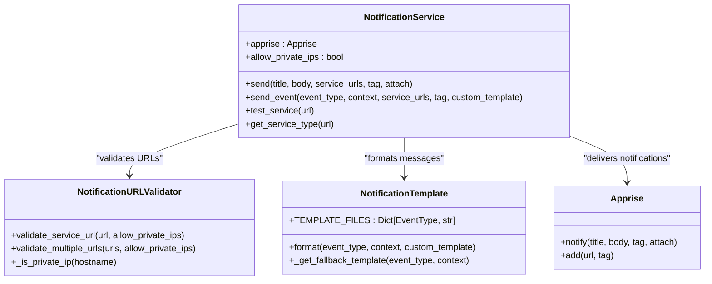
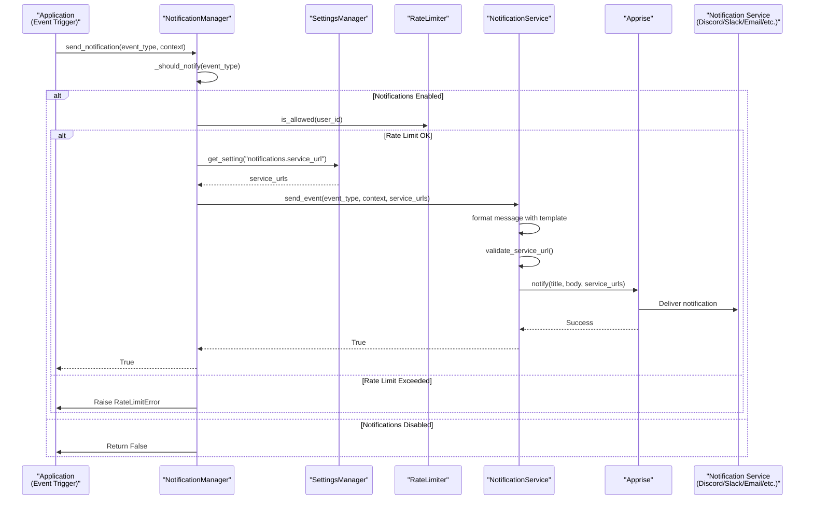
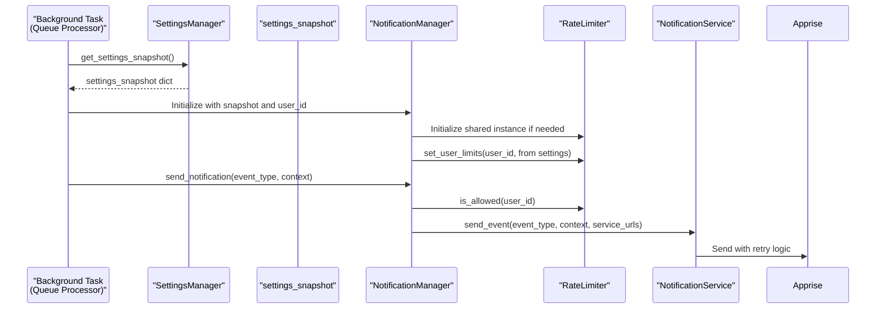

# Architecture Overview

<cite>
**Referenced Files in This Document**   
- [manager.py](file://src/local_deep_research/notifications/manager.py)
- [service.py](file://src/local_deep_research/notifications/service.py)
- [templates.py](file://src/local_deep_research/notifications/templates.py)
- [settings/manager.py](file://src/local_deep_research/settings/manager.py)
- [security/notification_validator.py](file://src/local_deep_research/security/notification_validator.py)
- [exceptions.py](file://src/local_deep_research/notifications/exceptions.py)
- [queue_helpers.py](file://src/local_deep_research/notifications/queue_helpers.py)
</cite>

## Table of Contents
1. [Introduction](#introduction)
2. [Three-Tier Architecture](#three-tier-architecture)
3. [Notification Flow](#notification-flow)
4. [Settings Integration](#settings-integration)
5. [Rate Limiting System](#rate-limiting-system)
6. [Notification Service](#notification-service)
7. [Sequence Diagrams](#sequence-diagrams)
8. [Conclusion](#conclusion)

## Introduction
The notification system in Local Deep Research (LDR) is designed to provide a robust, secure, and flexible mechanism for delivering event-driven notifications to users. This document details the three-tier architecture that comprises the NotificationManager, NotificationService, and Settings Integration components. The system enables users to receive notifications through various channels including email, messaging platforms, SMS, and push notifications via the Apprise library. The architecture emphasizes thread safety, per-user rate limiting, and secure handling of sensitive information while maintaining isolation between users in multi-user environments.

## Three-Tier Architecture
The notification system follows a three-tier architecture that separates concerns between high-level management, service integration, and user configuration. This design enables clear separation of responsibilities while maintaining efficient communication between components.

The first tier, NotificationManager, serves as the high-level interface that handles rate limiting, settings access, and user preferences. It acts as the primary entry point for notification requests and ensures that all business rules are enforced before messages are sent. The second tier, NotificationService, provides the low-level integration with Apprise, handling the actual delivery of notifications with security validation and retry logic. The third tier, Settings Integration, manages user-specific configuration including notification preferences, service URLs, and rate limit settings stored in the encrypted database.

This architecture enables the system to scale efficiently while maintaining security and reliability. The separation of concerns allows each component to focus on its specific responsibilities: NotificationManager on business logic and rate limiting, NotificationService on delivery mechanics, and Settings Integration on user configuration persistence. The components communicate through well-defined interfaces, ensuring loose coupling and high cohesion throughout the system.

**Section sources**
- [manager.py](file://src/local_deep_research/notifications/manager.py#L1-L572)
- [service.py](file://src/local_deep_research/notifications/service.py#L1-L341)
- [settings/manager.py](file://src/local_deep_research/settings/manager.py#L1-L800)

## Notification Flow
The notification flow begins when an event trigger occurs within the application, such as research completion, research failure, or subscription updates. The process follows a well-defined sequence from event detection to final delivery, ensuring reliability and proper handling of edge cases.

When an event occurs, the system creates a context dictionary containing relevant information about the event, such as the research query, research ID, summary, and URL. This context is then passed to the NotificationManager along with the event type. The NotificationManager first checks whether notifications are enabled for the specific event type by consulting the user's settings snapshot. If notifications are disabled for that event type, the process terminates early without further processing.

If notifications are enabled, the system proceeds to check rate limiting using the shared RateLimiter instance. The rate limiter evaluates whether the user has exceeded their configured limits for the current time window. If the rate limit is exceeded and the force parameter is not set to true, a RateLimitError is raised and the notification is not sent. If rate limiting allows the notification, the system retrieves the service URLs from the user's settings snapshot.

The notification is then forwarded to the NotificationService, which validates the service URLs for security purposes, formats the message using Jinja2 templates, and attempts delivery through Apprise. The service implements retry logic with exponential backoff to handle transient failures. Upon successful delivery, the system logs the notification event; otherwise, it records the failure for diagnostic purposes.

**Section sources**
- [manager.py](file://src/local_deep_research/notifications/manager.py#L149-L247)
- [service.py](file://src/local_deep_research/notifications/service.py#L110-L139)
- [queue_helpers.py](file://src/local_deep_research/notifications/queue_helpers.py#L15-L413)

## Settings Integration
The settings integration component provides a secure and thread-safe mechanism for accessing user preferences and configuration. It leverages the SettingsManager class to retrieve user-specific settings, including notification service URLs, event preferences, and rate limit configurations.

User preferences are stored in an encrypted database using SQLCipher with AES-256 encryption, ensuring zero-knowledge security. The encryption key is derived from the user's login password using PBKDF2-SHA512, meaning that notification settings cannot be recovered without the user's password. This approach protects sensitive information such as SMTP passwords and webhook tokens stored in service URLs.

To enable thread-safe access from background processes, the system employs a settings snapshot pattern. Instead of passing database sessions to background threads (which would create thread-safety issues), the system captures a dictionary of settings key-value pairs from the main thread using SettingsManager.get_settings_snapshot(). This snapshot is then passed to the NotificationManager, allowing it to access user settings without maintaining a database connection.

The settings system supports environment variable overrides through the LDR_SETTINGS_KEY format, where underscores replace dots in the setting key. For example, the setting "notifications.service_url" can be overridden by the environment variable LDR_NOTIFICATIONS_SERVICE_URL. This allows for flexible configuration in different deployment environments while maintaining user-level customization.

**Section sources**
- [settings/manager.py](file://src/local_deep_research/settings/manager.py#L537-L554)
- [manager.py](file://src/local_deep_research/notifications/manager.py#L57-L83)
- [url_builder.py](file://src/local_deep_research/notifications/url_builder.py#L21-L98)

## Rate Limiting System
The rate limiting system implements a sophisticated per-user rate limiting mechanism using a shared RateLimiter singleton pattern. This design provides both memory efficiency and proper isolation between users, ensuring that one user's notification volume does not impact others.

The RateLimiter class maintains separate counters and limit configurations for each user while sharing a single instance across all NotificationManager instances. When the first NotificationManager is created, it initializes the shared RateLimiter with default limits. Subsequent instances use this shared instance but configure user-specific limits based on the user's settings. This approach reduces memory overhead while maintaining per-user isolation.

Each user's rate limits are configured through their settings, with parameters for maximum notifications per hour and per day. The system stores these limits in the _user_limits dictionary, with each user having their own tuple of (max_per_hour, max_per_day). The rate limiter maintains separate deques for hourly and daily notification counts, automatically removing entries older than the respective time windows.

The implementation is thread-safe using threading.Lock() to protect all operations, allowing concurrent access from multiple threads within the same process. For multi-worker deployments, the documentation notes that each worker process maintains its own rate limit counters, which could allow users to bypass limits by distributing requests across workers. The system includes periodic cleanup of inactive users (no activity for 7 days) to prevent memory leaks.

```mermaid
classDiagram
class NotificationManager {
+settings_snapshot : Dict[str, Any]
+user_id : str
+service : NotificationService
+_rate_limiter : RateLimiter
+send_notification(event_type, context, force)
+_should_notify(event_type)
}
class RateLimiter {
+max_per_hour : int
+max_per_day : int
+_user_limits : Dict[str, tuple[int, int]]
+_hourly_counts : Dict[str, deque]
+_daily_counts : Dict[str, deque]
+_lock : threading.Lock
+is_allowed(user_id)
+set_user_limits(user_id, max_per_hour, max_per_day)
+reset(user_id)
}
NotificationManager --> RateLimiter : "uses shared instance"
NotificationManager ..> "settings_snapshot" : "thread-safe access"
class SettingsManager {
+get_settings_snapshot()
+get_setting(key, default)
}
SettingsManager --> NotificationManager : "provides settings"
```

**Diagram sources **
- [manager.py](file://src/local_deep_research/notifications/manager.py#L51-L54)
- [manager.py](file://src/local_deep_research/notifications/manager.py#L312-L572)

**Section sources**
- [manager.py](file://src/local_deep_research/notifications/manager.py#L26-L49)
- [manager.py](file://src/local_deep_research/notifications/manager.py#L93-L134)
- [manager.py](file://src/local_deep_research/notifications/manager.py#L312-L572)

## Notification Service
The NotificationService component wraps the Apprise library with additional security validation and retry logic to ensure reliable and secure notification delivery. It serves as the low-level interface responsible for the actual transmission of notifications to various services.

Security validation is implemented through the NotificationURLValidator class, which prevents Server-Side Request Forgery (SSRF) attacks by validating service URLs. The validator blocks dangerous protocols such as file://, ftp://, javascript://, and data:// while allowing safe protocols like http://, https://, mailto://, and service-specific protocols (discord://, slack://, telegram://). For HTTP/HTTPS URLs, the validator checks for private IP addresses and blocks requests to internal infrastructure unless explicitly allowed for development purposes.

The service implements retry logic using the Tenacity library, automatically retrying failed notifications up to three times with exponential backoff (0.5s → 1.0s → 2.0s). This handles transient network issues and service unavailability without requiring application-level retry logic. Temporary Apprise instances are created for each send operation and automatically garbage collected, avoiding memory management complexity.

Message formatting is handled through Jinja2 templates stored in the notifications/templates directory. The system supports different templates for various event types (research_completed, research_failed, subscription_update, etc.), allowing for consistent and professional-looking notifications. A fallback template system ensures notifications can still be delivered even if Jinja2 initialization fails.



**Diagram sources **
- [service.py](file://src/local_deep_research/notifications/service.py#L31-L341)
- [security/notification_validator.py](file://src/local_deep_research/security/notification_validator.py#L20-L252)
- [templates.py](file://src/local_deep_research/notifications/templates.py#L34-L231)

**Section sources**
- [service.py](file://src/local_deep_research/notifications/service.py#L5-L29)
- [service.py](file://src/local_deep_research/notifications/service.py#L147-L160)
- [service.py](file://src/local_deep_research/notifications/service.py#L57-L62)

## Sequence Diagrams
The following sequence diagrams illustrate the interaction between components during key notification processes, showing the flow of control and data between system components.



**Diagram sources **
- [manager.py](file://src/local_deep_research/notifications/manager.py#L149-L247)
- [service.py](file://src/local_deep_research/notifications/service.py#L195-L234)



**Diagram sources **
- [manager.py](file://src/local_deep_research/notifications/manager.py#L57-L83)
- [manager.py](file://src/local_deep_research/notifications/manager.py#L93-L134)
- [queue_helpers.py](file://src/local_deep_research/notifications/queue_helpers.py#L15-L413)

## Conclusion
The notification system architecture in Local Deep Research demonstrates a well-designed, three-tier approach that effectively separates concerns while maintaining robust security and reliability. The integration of NotificationManager, NotificationService, and Settings components creates a cohesive system that handles notification delivery from event trigger to final delivery.

Key architectural decisions, such as the shared RateLimiter singleton with per-user limits, enable efficient memory usage while maintaining proper isolation between users. The settings snapshot pattern ensures thread-safe access to user preferences from background processes, addressing a common challenge in multi-threaded applications. Security measures, including URL validation to prevent SSRF attacks and encrypted storage of sensitive credentials, demonstrate a strong commitment to user data protection.

The system's design accommodates both simplicity and extensibility, using temporary Apprise instances to avoid memory management complexity while supporting a wide range of notification services through the Apprise library. The implementation of exponential backoff retry logic and comprehensive error handling ensures reliable delivery even in the face of transient network issues.

This architecture provides a solid foundation for future enhancements, such as Redis-based rate limiting for multi-worker deployments or additional notification channels, while maintaining the core principles of security, reliability, and user privacy.