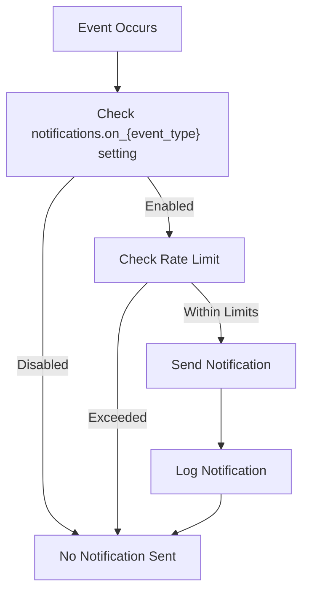
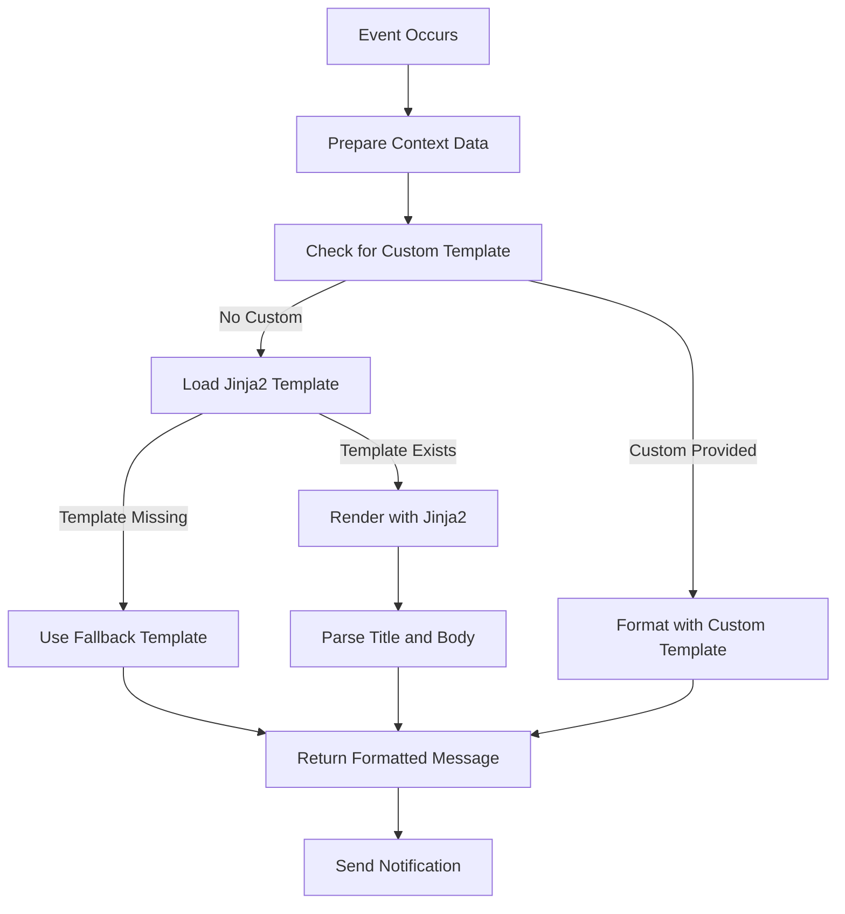

# Event Types and Triggers

<cite>
**Referenced Files in This Document**   
- [EventType Enum](file://src/local_deep_research/notifications/templates.py#L13-L31)
- [Notification Templates](file://src/local_deep_research/notifications/templates.py)
- [Notification Manager](file://src/local_deep_research/notifications/manager.py)
- [Queue Helpers](file://src/local_deep_research/notifications/queue_helpers.py)
- [research_completed.jinja2](file://src/local_deep_research/notifications/templates/research_completed.jinja2)
- [research_failed.jinja2](file://src/local_deep_research/notifications/templates/research_failed.jinja2)
- [research_queued.jinja2](file://src/local_deep_research/notifications/templates/research_queued.jinja2)
- [subscription_update.jinja2](file://src/local_deep_research/notifications/templates/subscription_update.jinja2)
- [subscription_error.jinja2](file://src/local_deep_research/notifications/templates/subscription_error.jinja2)
- [api_quota_warning.jinja2](file://src/local_deep_research/notifications/templates/api_quota_warning.jinja2)
- [auth_issue.jinja2](file://src/local_deep_research/notifications/templates/auth_issue.jinja2)
</cite>

## Table of Contents
1. [Introduction](#introduction)
2. [Event Type Configuration](#event-type-configuration)
3. [Research Event Types](#research-event-types)
   - [research_completed](#research_completed)
   - [research_failed](#research_failed)
   - [research_queued](#research_queued)
4. [Subscription Event Types](#subscription-event-types)
   - [subscription_update](#subscription_update)
   - [subscription_error](#subscription_error)
5. [System Event Types](#system-event-types)
   - [api_quota_warning](#api_quota_warning)
   - [auth_issue](#auth_issue)
6. [Context Data and Templating](#context-data-and-templating)
7. [Notification Control Settings](#notification-control-settings)
8. [Best Practices](#best-practices)

## Introduction

The notification system in Local Deep Research provides event-driven alerts for various system activities and status changes. This document details the event types defined in the `EventType` enum, including their triggers, context data, and usage patterns. The system uses Jinja2 templates for message formatting and supports per-user rate limiting to prevent notification spam. Each event type can be individually enabled or disabled through user settings, allowing for fine-grained control over notification preferences.

## Event Type Configuration

Event notifications are controlled through specific settings that determine whether notifications are sent for each event type. The setting pattern follows the format `notifications.on_{event_type}` where `{event_type}` is the lowercase name of the event. For example, the setting `notifications.on_research_completed` controls whether notifications are sent when research completes successfully.

The notification system uses a centralized configuration approach where:
- Each event type has a corresponding boolean setting that enables or disables notifications
- Notifications are disabled by default for most event types (opt-in model)
- The `NotificationManager` class checks these settings before sending notifications
- Rate limiting is applied per user to prevent excessive notifications



**Diagram sources**
- [manager.py](file://src/local_deep_research/notifications/manager.py#L261-L285)

**Section sources**
- [templates.py](file://src/local_deep_research/notifications/templates.py#L13-L31)
- [manager.py](file://src/local_deep_research/notifications/manager.py#L261-L285)

## Research Event Types

### research_completed

The `research_completed` event is triggered when a research task completes successfully and generates a complete report. This notification informs users that their research is ready for review.

**Trigger Conditions:**
- Research process completes without errors
- Report generation is successful
- All required data has been collected and processed
- The research status is updated to "completed" in the database

**Context Data Structure:**
```python
{
    "query": "Research query string",
    "research_id": "UUID of the research",
    "summary": "Brief summary of findings (first 200 characters of report)",
    "url": "Full URL to view the research results"
}
```

**Template Variables:**
- `query`: The original research query
- `summary`: A brief summary of the research findings
- `url`: Direct link to the research results page

**Typical Use Cases:**
- Alerting users when their research is complete
- Providing quick access to results via notification links
- Integration with external systems that need to process completed research

**Section sources**
- [research_completed.jinja2](file://src/local_deep_research/notifications/templates/research_completed.jinja2)
- [queue_helpers.py](file://src/local_deep_research/notifications/queue_helpers.py#L164-L292)

### research_failed

The `research_failed` event is triggered when a research task encounters an error and cannot be completed. This notification alerts users to issues with their research requests.

**Trigger Conditions:**
- Research process encounters an unrecoverable error
- Required services are unavailable
- Authentication fails during the research process
- The research status is updated to "failed" in the database

**Context Data Structure:**
```python
{
    "query": "Research query string",
    "research_id": "UUID of the research",
    "error": "Sanitized error message"
}
```

**Template Variables:**
- `query`: The original research query
- `error`: A user-friendly error message (sensitive details are sanitized)

**Security Note:** Error messages are sanitized before being included in notifications to prevent exposure of sensitive system information.

**Typical Use Cases:**
- Alerting users when their research fails
- Providing basic error information without exposing system details
- Facilitating troubleshooting by identifying failed research tasks

**Section sources**
- [research_failed.jinja2](file://src/local_deep_research/notifications/templates/research_failed.jinja2)
- [queue_helpers.py](file://src/local_deep_research/notifications/queue_helpers.py#L299-L412)

### research_queued

The `research_queued` event is triggered when a research task is added to the processing queue. This notification informs users that their request has been received and is waiting for processing.

**Trigger Conditions:**
- Research request is submitted and added to the queue
- System is currently processing other research tasks
- The research status is updated to "queued" in the database

**Context Data Structure:**
```python
{
    "query": "Research query string",
    "research_id": "UUID of the research",
    "position": "Position in the queue (optional)",
    "wait_time": "Estimated wait time (optional)"
}
```

**Template Variables:**
- `query`: The original research query
- `position`: The position of the research in the processing queue
- `wait_time`: Estimated time until processing begins

**Typical Use Cases:**
- Providing immediate feedback when research is submitted
- Managing user expectations about processing time
- Informing users of their position in the queue during high-usage periods

**Section sources**
- [research_queued.jinja2](file://src/local_deep_research/notifications/templates/research_queued.jinja2)
- [queue_helpers.py](file://src/local_deep_research/notifications/queue_helpers.py#L15-L56)

## Subscription Event Types

### subscription_update

The `subscription_update` event is triggered when a subscription detects new content. This notification informs users about updates to topics they are following.

**Trigger Conditions:**
- Subscription process completes successfully
- New content is detected for a subscribed topic
- Update threshold (number of new items) is met
- The subscription status is updated in the database

**Context Data Structure:**
```python
{
    "subscription_name": "Name of the subscription",
    "item_count": "Number of new items found",
    "url": "URL to view the updates"
}
```

**Template Variables:**
- `subscription_name`: The name of the subscription that was updated
- `item_count`: The number of new items found
- `url`: Direct link to view the subscription updates

**Typical Use Cases:**
- Alerting users to new content in their subscriptions
- Driving engagement with updated research topics
- Providing quick access to new findings without manual checking

**Section sources**
- [subscription_update.jinja2](file://src/local_deep_research/notifications/templates/subscription_update.jinja2)

### subscription_error

The `subscription_error` event is triggered when a subscription update fails. This notification alerts users to issues with their subscriptions.

**Trigger Conditions:**
- Subscription process encounters an error
- Required services are unavailable
- Authentication fails during subscription update
- The subscription status is updated to reflect the error

**Context Data Structure:**
```python
{
    "subscription_name": "Name of the subscription",
    "error": "Error message"
}
```

**Template Variables:**
- `subscription_name`: The name of the subscription that encountered an error
- `error`: A description of the error that occurred

**Typical Use Cases:**
- Alerting users when their subscriptions fail to update
- Identifying subscription configuration issues
- Notifying users of service disruptions affecting their subscriptions

**Section sources**
- [subscription_error.jinja2](file://src/local_deep_research/notifications/templates/subscription_error.jinja2)

## System Event Types

### api_quota_warning

The `api_quota_warning` event is triggered when API usage approaches quota limits. This notification helps users manage their API usage and avoid service interruptions.

**Trigger Conditions:**
- API usage reaches a configured threshold of the quota
- Rate limit headers indicate approaching limits
- Usage monitoring detects high consumption patterns
- The system determines that quota exhaustion is likely

**Context Data Structure:**
```python
{
    "service": "API service name",
    "current": "Current usage count",
    "limit": "Quota limit",
    "reset_time": "When the quota resets"
}
```

**Template Variables:**
- `service`: The name of the API service
- `current`: The current usage count
- `limit`: The quota limit
- `reset_time`: When the quota will reset

**Typical Use Cases:**
- Alerting users to approaching API limits
- Preventing service disruption due to quota exhaustion
- Helping users plan their research activities around quota limits

**Section sources**
- [api_quota_warning.jinja2](file://src/local_deep_research/notifications/templates/api_quota_warning.jinja2)
- [NOTIFICATION_FLOW.md](file://docs/NOTIFICATION_FLOW.md#L585-L591)

### auth_issue

The `auth_issue` event is triggered when authentication fails for a service. This notification alerts users to credential problems that may affect system functionality.

**Trigger Conditions:**
- Authentication request returns an authentication error
- Credentials are rejected by the target service
- Token expiration is detected
- Permission errors indicate authentication problems

**Context Data Structure:**
```python
{
    "service": "Service requiring authentication"
}
```

**Template Variables:**
- `service`: The name of the service that requires authentication

**Typical Use Cases:**
- Alerting users to expired or invalid credentials
- Identifying authentication issues with integrated services
- Prompting users to update their credentials before they affect research

**Section sources**
- [auth_issue.jinja2](file://src/local_deep_research/notifications/templates/auth_issue.jinja2)

## Context Data and Templating

The notification system uses Jinja2 templates to format messages with dynamic context data. Each event type has a corresponding template file that defines the message structure.

### Template Processing Flow



**Diagram sources**
- [templates.py](file://src/local_deep_research/notifications/templates.py#L93-L149)

### Context Variable Handling

The system handles missing variables through Jinja2's template rendering capabilities:

1. **Graceful Degradation**: If a variable is missing, Jinja2 renders the template with empty values rather than failing
2. **Fallback Templates**: If Jinja2 initialization fails, a simple fallback template is used
3. **Error Handling**: Template formatting errors are caught and result in a generic notification

The `NotificationTemplate.format()` method implements this behavior, attempting to use Jinja2 templates first and falling back to simpler formatting if necessary.

### Required Context Variables

While the system doesn't enforce strict validation of context variables, each template expects certain variables to produce meaningful notifications:

| Event Type | Required Variables | Optional Variables |
|------------|-------------------|-------------------|
| research_completed | query, research_id, summary, url | None |
| research_failed | query, research_id, error | None |
| research_queued | query, research_id | position, wait_time |
| subscription_update | subscription_name, item_count, url | None |
| subscription_error | subscription_name, error | None |
| api_quota_warning | service, current, limit, reset_time | None |
| auth_issue | service | None |

**Section sources**
- [templates.py](file://src/local_deep_research/notifications/templates.py#L180-L231)

## Notification Control Settings

Notification behavior is controlled through settings that follow a consistent naming pattern: `notifications.on_{event_type}`. These settings are boolean values that enable or disable notifications for specific event types.

### Event-Specific Settings

| Event Type | Setting Name | Default Value | Description |
|------------|--------------|---------------|-------------|
| research_completed | notifications.on_research_completed | False | Enable notifications when research completes |
| research_failed | notifications.on_research_failed | True | Enable notifications when research fails |
| research_queued | notifications.on_research_queued | False | Enable notifications when research is queued |
| subscription_update | notifications.on_subscription_update | True | Enable notifications for subscription updates |
| subscription_error | notifications.on_subscription_error | True | Enable notifications for subscription errors |
| api_quota_warning | notifications.on_api_quota_warning | True | Enable notifications for API quota warnings |
| auth_issue | notifications.on_auth_issue | True | Enable notifications for authentication issues |

### Rate Limiting Settings

The system includes rate limiting to prevent notification spam:

- `notifications.rate_limit_per_hour`: Maximum notifications per hour (default: 10)
- `notifications.rate_limit_per_day`: Maximum notifications per day (default: 50)

Rate limits are enforced per user, allowing different users to have different limits. The rate limiter uses an in-memory store with automatic cleanup of inactive users.

### Configuration Best Practices

1. **Set appropriate defaults**: Configure sensible default values for notification settings
2. **Document settings**: Provide clear documentation for each notification setting
3. **Monitor usage**: Track notification rates to identify potential issues
4. **Test configurations**: Verify that notification settings work as expected

**Section sources**
- [manager.py](file://src/local_deep_research/notifications/manager.py#L261-L285)
- [manager.py](file://src/local_deep_research/notifications/manager.py#L312-L572)

## Best Practices

### Ensuring Proper Data Flow

To ensure notifications contain the correct information:

1. **Validate context data**: Verify that all required variables are present before sending notifications
2. **Use consistent naming**: Follow the established naming conventions for context variables
3. **Handle missing data**: Provide default values for optional variables
4. **Sanitize sensitive information**: Remove or mask sensitive data from notification content

### Template Design Guidelines

When creating or modifying notification templates:

1. **Keep messages concise**: Notifications should be brief and to the point
2. **Include actionable information**: Provide clear next steps or links when appropriate
3. **Use consistent formatting**: Follow the established style for notification messages
4. **Test thoroughly**: Verify that templates render correctly with various data inputs

### Error Handling

The notification system includes several layers of error handling:

1. **Template rendering errors**: Fall back to simple formatting if Jinja2 fails
2. **Missing templates**: Use generic templates if specific templates are not found
3. **Rate limiting**: Prevent excessive notifications through configurable limits
4. **Service failures**: Log errors but continue processing other notifications

By following these best practices, users can ensure that the notification system provides timely, relevant information without becoming a source of distraction or information overload.

**Section sources**
- [templates.py](file://src/local_deep_research/notifications/templates.py)
- [manager.py](file://src/local_deep_research/notifications/manager.py)
- [queue_helpers.py](file://src/local_deep_research/notifications/queue_helpers.py)