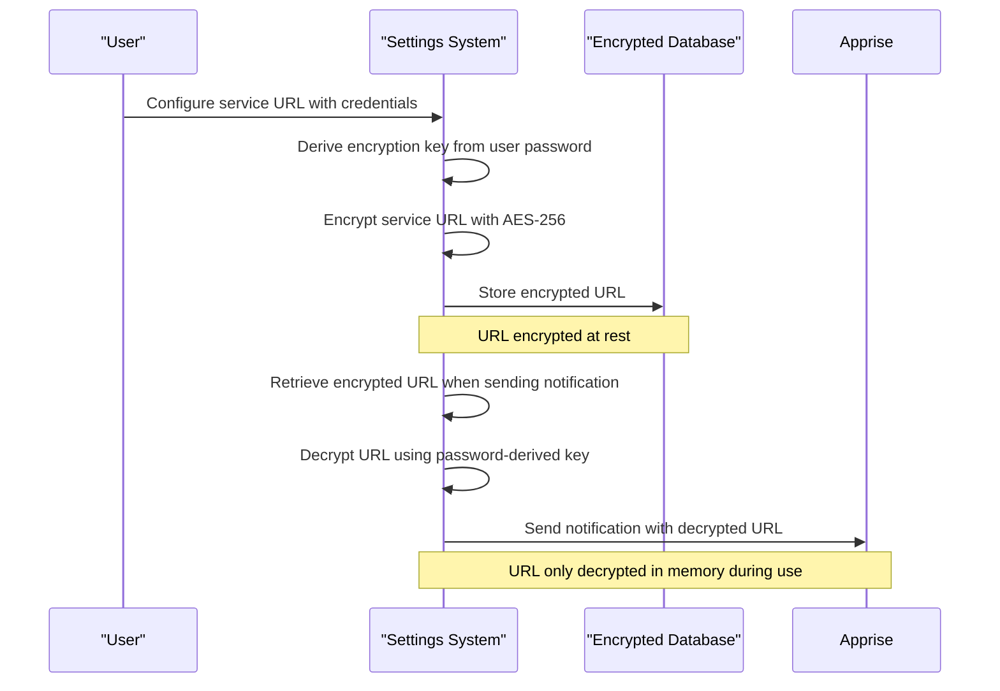
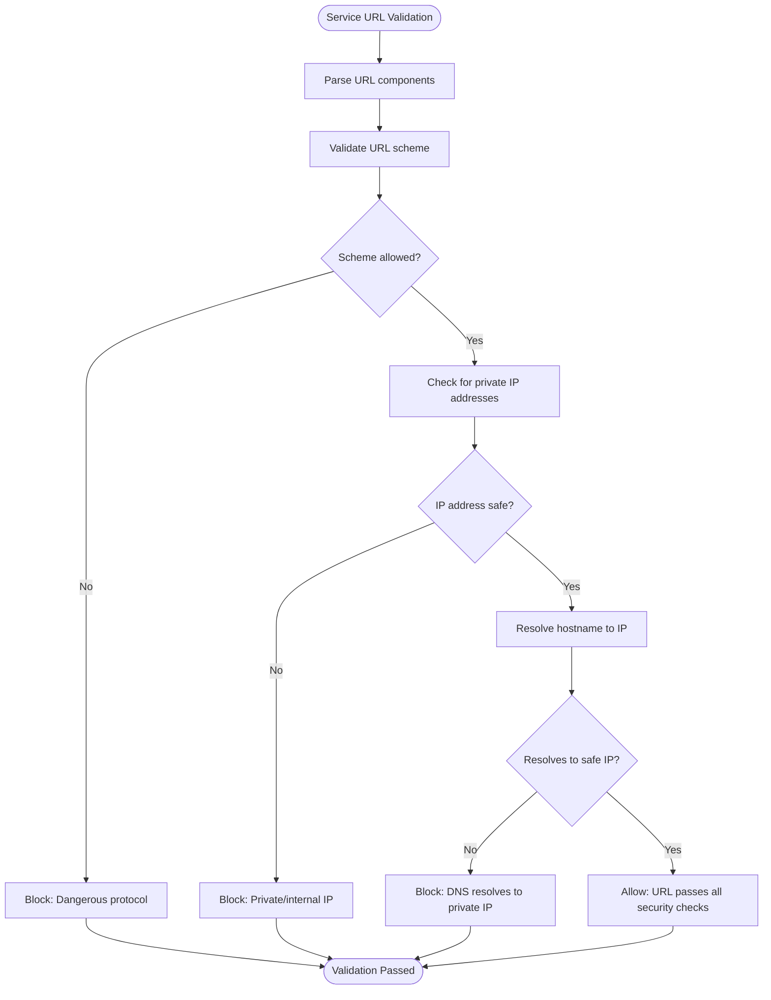
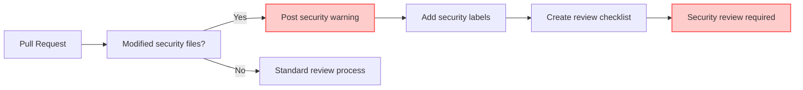
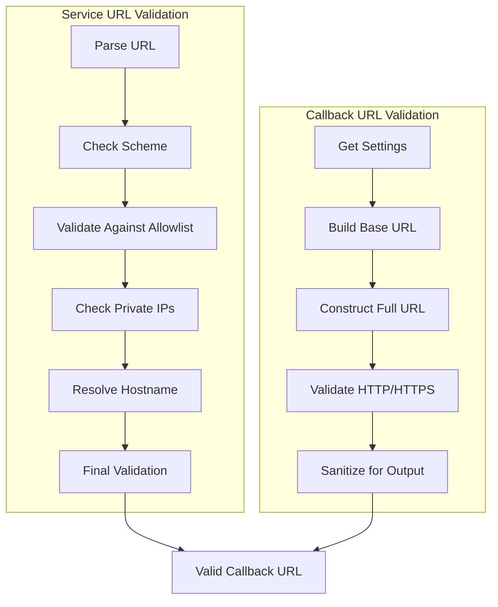
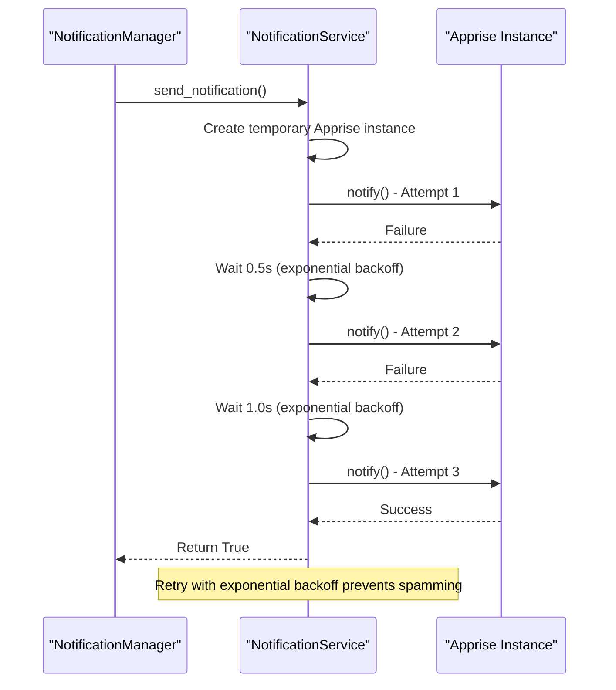

# Security Model

<cite>
**Referenced Files in This Document**   
- [NOTIFICATIONS.md](file://docs/NOTIFICATIONS.md)
- [NOTIFICATION_FLOW.md](file://docs/NOTIFICATION_FLOW.md)
- [SECURITY_REVIEW_PROCESS.md](file://docs/SECURITY_REVIEW_PROCESS.md)
- [manager.py](file://src/local_deep_research/notifications/manager.py)
- [service.py](file://src/local_deep_research/notifications/service.py)
- [url_builder.py](file://src/local_deep_research/notifications/url_builder.py)
- [notification_validator.py](file://src/local_deep_research/security/notification_validator.py)
- [ssrf_validator.py](file://src/local_deep_research/security/ssrf_validator.py)
- [url_validator.py](file://src/local_deep_research/security/url_validator.py)
- [url_builder.py](file://src/local_deep_research/security/url_builder.py)
- [data_sanitizer.py](file://src/local_deep_research/security/data_sanitizer.py)
</cite>

## Table of Contents
1. [Introduction](#introduction)
2. [Zero-Knowledge Architecture](#zero-knowledge-architecture)
3. [SSRF Prevention](#ssrf-prevention)
4. [Apprise Integration Security](#apprise-integration-security)
5. [URL Validation and Sanitization](#url-validation-and-sanitization)
6. [Retry Mechanism with Exponential Backoff](#retry-mechanism-with-exponential-backoff)
7. [Secure Deployment Practices](#secure-deployment-practices)
8. [Audit and Monitoring](#audit-and-monitoring)
9. [Conclusion](#conclusion)

## Introduction

The notification security model in Local Deep Research (LDR) is designed to ensure secure, private, and reliable delivery of notifications while protecting user data and system integrity. This document details the comprehensive security architecture that governs notification handling, from encryption and validation to delivery and monitoring.

The system leverages a zero-knowledge architecture where sensitive information is encrypted using keys derived from user passwords, ensuring that even administrators cannot access notification service credentials. Server-Side Request Forgery (SSRF) prevention measures are implemented through rigorous URL validation that blocks access to private IP ranges and dangerous protocols.

The integration with Apprise, a popular notification library, is carefully controlled through a security review process that ensures only approved services are allowed. All callback URLs are validated and sanitized to prevent injection attacks, while a robust retry mechanism with exponential backoff prevents notification spamming during failures.

This security model combines multiple layers of protection, including encryption, validation, rate limiting, and secure coding practices, to create a trustworthy notification system that respects user privacy and maintains system security.

**Section sources**
- [NOTIFICATIONS.md](file://docs/NOTIFICATIONS.md#L3-L262)

## Zero-Knowledge Architecture

The notification system implements a zero-knowledge architecture where notification service URLs containing credentials are encrypted at rest using AES-256 encryption via SQLCipher in each user's encrypted database. The encryption key is derived from the user's login password using PBKDF2-SHA512, ensuring that the system cannot access or recover notification settings without the user's password.

This architecture provides several critical security benefits:
- **Complete Privacy**: Service URLs with credentials (such as SMTP passwords or webhook tokens) are stored encrypted, preventing unauthorized access even by system administrators
- **Password-Derived Keys**: The encryption key is derived from the user's password, creating a true zero-knowledge model where the system has no access to decryption keys
- **Per-User Isolation**: Each user's notification settings are completely isolated in their own encrypted database, preventing cross-user access
- **Secure Recovery**: Notification settings cannot be recovered without the user's password, aligning with security best practices for sensitive data

The encryption process occurs transparently when users configure their notification settings through the settings system. When a user sets their `notifications.service_url` setting, the value is automatically encrypted before being stored in the database. During notification delivery, the system retrieves the encrypted URL, decrypts it using the password-derived key, and uses it to send notifications.

This approach ensures that sensitive credentials are never stored in plaintext and are only accessible when the user is authenticated and their password is available for key derivation.



**Diagram sources**
- [NOTIFICATIONS.md](file://docs/NOTIFICATIONS.md#L31-L32)
- [manager.py](file://src/local_deep_research/notifications/manager.py#L87-L91)

## SSRF Prevention

The notification system implements comprehensive Server-Side Request Forgery (SSRF) prevention measures through the `NotificationURLValidator` class, which validates service URLs before they are used for notification delivery. This validator prevents attacks that could allow malicious users to make the server connect to internal or private resources.

The validation process includes several layers of protection:

### Protocol Validation
The system maintains strict allowlists and blocklists for URL schemes:
- **Blocked Schemes**: `file`, `ftp`, `ftps`, `data`, `javascript`, `vbscript`, `about`, `blob` - these are prohibited as they could lead to local file access, code execution, or data exfiltration
- **Allowed Schemes**: `http`, `https`, `mailto`, `discord`, `slack`, `telegram`, `gotify`, `pushover`, `ntfy`, `matrix`, `mattermost`, `rocketchat`, `teams`, `json`, `xml`, `form` - only these notification-specific protocols are permitted

### Private IP Range Protection
The validator prevents connections to private and internal IP ranges by checking against a comprehensive list of RFC-defined private networks:
- IPv4 private ranges: `127.0.0.0/8`, `10.0.0.0/8`, `172.16.0.0/12`, `192.168.0.0/16`, `169.254.0.0/16`
- IPv6 private ranges: `::1/128`, `fc00::/7`, `fe80::/10`
- Special cases: `localhost`, `127.0.0.1`, `::1`, `0.0.0.0`, `::`

For HTTP/HTTPS URLs, the validator checks both the hostname and resolves it to IP addresses to prevent DNS rebinding attacks. The AWS metadata endpoint (`169.254.169.254`) is specifically blocked as it's a common target for credential theft in SSRF attacks.

### Configuration-Based Exceptions
In development or trusted environments, administrators can allow private IP access by setting `notifications.allow_private_ips=True` in the user's settings. This setting is disabled by default for security and should only be enabled in controlled environments.

The validation occurs at multiple points in the notification flow:
1. When testing a service URL through the `test_service` method
2. When sending notifications with provided service URLs
3. When validating multiple comma-separated URLs

This multi-layered approach ensures that potentially dangerous URLs are caught before they can be used to make unauthorized requests from the server.



**Diagram sources**
- [notification_validator.py](file://src/local_deep_research/security/notification_validator.py#L24-L65)
- [ssrf_validator.py](file://src/local_deep_research/security/ssrf_validator.py#L20-L31)

## Apprise Integration Security

The integration with Apprise, the underlying notification library, is secured through a comprehensive review and validation process that ensures only approved services are allowed and that all interactions are properly sanitized.

### Security Review Process
Changes to security-critical files, including those related to notification and encryption functionality, trigger an automated security review process. When a pull request modifies files in the security-sensitive areas:
- A prominent warning comment is posted with a security-specific review checklist
- Labels such as `security-review-needed` and `touches-encryption` are added to the PR
- A status check shows "Security Review Required" (informational, not blocking)

The review checklists are context-specific:
- **For Encryption Changes**: Verify SQLCipher pragma order, ensure no hardcoded keys, check backward compatibility, and validate migration paths
- **For Authentication Changes**: Confirm no auth bypasses, verify secure session handling, ensure proper password hashing, and check for privilege escalation
- **For All Security Changes**: Ensure no exposed secrets, verify no debug bypasses, check for safe error messages, and confirm secure logging

### Approved Services Only
The system maintains an explicit allowlist of Apprise-compatible services that are permitted for use. This prevent users from configuring potentially dangerous or unsupported notification methods. The allowed services include:
- Discord (via webhooks)
- Slack (via webhooks)
- Telegram
- Email (SMTP)
- Pushover
- Gotify
- Many others supported by Apprise

Apprise itself provides an additional layer of security by maintaining its own comprehensive whitelist of supported notification services and rejecting unsupported schemes like `file://` or `javascript://`.

### URL Masking and Sanitization
To prevent credential leakage in logs and error messages, the system automatically masks sensitive information in URLs. The `mask_sensitive_url` function replaces:
- Passwords in URLs with `***`
- Long alphanumeric tokens (common in webhooks) with `***`
- Query parameters with `?***`

This ensures that even if a URL is logged for debugging purposes, sensitive credentials remain protected.



**Diagram sources**
- [SECURITY_REVIEW_PROCESS.md](file://docs/SECURITY_REVIEW_PROCESS.md#L9-L15)
- [data_sanitizer.py](file://src/local_deep_research/security/data_sanitizer.py#L14-L25)

## URL Validation and Sanitization

The notification system implements rigorous URL validation and sanitization for both service URLs and callback links to prevent various security vulnerabilities including XSS, data exfiltration, and injection attacks.

### Service URL Validation
The `NotificationURLValidator` class performs comprehensive validation of notification service URLs:

```python
def validate_service_url(url: str, allow_private_ips: bool = False) -> Tuple[bool, Optional[str]]:
    # Check for blocked schemes (file, ftp, javascript, etc.)
    # Validate against allowed schemes (http, https, mailto, discord, etc.)
    # Check for private IP addresses in hostname
    # Resolve hostname to prevent DNS rebinding attacks
    pass
```

The validation process is invoked in multiple contexts:
- When testing a service URL through `test_service()`
- When sending notifications with provided service URLs
- When validating multiple comma-separated URLs

### Callback URL Validation
For callback links in notifications (such as links to view research results), the system uses the `build_notification_url` function to construct and validate HTTP/HTTPS URLs:

```python
def build_notification_url(
    path: str,
    settings_manager=None,
    settings_snapshot: Optional[dict] = None,
    fallback_base: str = "http://localhost:5000",
    validate: bool = True,
) -> str:
    # Extract external_url, host, and port from settings
    # Build base URL using build_base_url_from_settings
    # Construct full URL with build_full_url
    # Validate with URLValidator.validate_http_url
    pass
```

The validation ensures that:
- URLs have valid schemes (http or https only)
- Hostnames are properly formatted
- Paths start with a forward slash
- No dangerous schemes are present (javascript, data, etc.)

### Sanitization Functions
The system provides several utility functions for URL sanitization:

- `sanitize_url()`: Adds a default scheme if missing and validates the URL
- `mask_sensitive_url()`: Masks passwords and tokens in URLs for secure logging
- `validate_http_url()`: Strict validation for HTTP/HTTPS callback URLs

These functions are used throughout the application to ensure consistent URL handling and prevent security vulnerabilities.



**Diagram sources**
- [url_builder.py](file://src/local_deep_research/notifications/url_builder.py#L21-L98)
- [url_validator.py](file://src/local_deep_research/security/url_validator.py#L20-L21)

## Retry Mechanism with Exponential Backoff

The notification system implements a robust retry mechanism with exponential backoff to handle transient failures while preventing notification spamming and resource exhaustion.

### Retry Strategy
The system uses a three-attempt retry strategy with increasing delays between attempts:
- **Attempt 1**: Immediate send
- **Attempt 2**: Wait 0.5 seconds, then retry
- **Attempt 3**: Wait 1.0 seconds, then retry

After three failed attempts, the system raises a `SendError` exception, indicating that the notification could not be delivered. This prevents infinite retry loops and potential denial-of-service conditions.

The retry logic is implemented using the Tenacity library with the following configuration:
```python
@retry(
    stop=stop_after_attempt(3),
    wait=wait_exponential(multiplier=1, min=0.5, max=10),
    retry=retry_if_exception_type((Exception,)),
    reraise=True,
)
```

### Benefits of Exponential Backoff
This approach provides several advantages:
- **Failure Resilience**: Handles temporary network issues, service outages, and rate limiting
- **Resource Protection**: Prevents overwhelming notification services with rapid retry requests
- **System Stability**: Reduces load on the server during periods of external service unavailability
- **User Experience**: Increases the likelihood of successful delivery without requiring user intervention

### Implementation Details
The retry mechanism is integrated into the `NotificationService` class, which wraps the Apprise library:

```python
def _send_with_retry(
    self,
    title: str,
    body: str,
    apprise_instance: apprise.Apprise,
    tag: Optional[str] = None,
    attach: Optional[List[str]] = None,
) -> bool:
    # Send notification with retry logic
    # Log success or failure
    # Raise SendError after maximum attempts
    pass
```

Temporary Apprise instances are created for each send operation and automatically garbage collected, ensuring memory efficiency and preventing resource leaks.

The retry mechanism works in conjunction with rate limiting to provide a balanced approach to notification delivery that is both reliable and responsible.



**Diagram sources**
- [service.py](file://src/local_deep_research/notifications/service.py#L57-L62)
- [manager.py](file://src/local_deep_research/notifications/manager.py#L229-L257)

## Secure Deployment Practices

To ensure the notification security model functions effectively in production environments, several secure deployment practices should be followed:

### Environment Configuration
- Set `app.external_url` to the public URL where your LDR instance is accessible (e.g., `https://ldr.example.com`)
- This ensures that callback links in notifications are correct and accessible to users
- If not set, the system defaults to `http://localhost:5000` or constructs from `app.host` and `app.port`

### Rate Limiting Configuration
The system supports per-user rate limiting to prevent notification abuse:
- `notifications.rate_limit_per_hour`: Maximum notifications per hour per user (default: 10)
- `notifications.rate_limit_per_day`: Maximum notifications per day per user (default: 50)

**Important Note on Multi-Worker Deployments**: The current rate limiting implementation uses in-memory storage and is process-local. In multi-worker deployments (e.g., gunicorn with multiple workers), each worker maintains its own rate limit counters. This means a user could potentially send up to N × max_per_hour notifications (where N = number of workers). For production multi-worker deployments, consider implementing Redis-based rate limiting.

### Private IP Access
By default, the system blocks notifications to private/internal IP addresses for security. For development or trusted internal services, this can be overridden:
- Set `notifications.allow_private_ips=True` in user settings
- This should only be enabled in controlled environments
- The AWS metadata endpoint (169.254.169.254) is always blocked regardless of this setting

### Testing and Validation
Before deploying to production:
- Test notification configuration using the `test_service()` method
- Verify that service URLs are correctly configured and accessible
- Check that event-specific settings are properly enabled
- Monitor logs for any rate limit or validation errors

### Security Headers
Ensure that the web server is configured with appropriate security headers:
- Content Security Policy (CSP) to prevent XSS
- Strict-Transport-Security (HSTS) for HTTPS enforcement
- X-Content-Type-Options to prevent MIME type sniffing
- X-Frame-Options to prevent clickjacking

These practices ensure that the notification system operates securely and reliably in various deployment scenarios.

**Section sources**
- [NOTIFICATIONS.md](file://docs/NOTIFICATIONS.md#L42-L48)
- [NOTIFICATION_FLOW.md](file://docs/NOTIFICATION_FLOW.md#L421-L446)

## Audit and Monitoring

The notification security model includes comprehensive audit and monitoring capabilities to ensure system integrity and facilitate troubleshooting.

### Logging and Monitoring
The system implements detailed logging for all notification activities:
- **URL Masking**: Service URLs are automatically masked in logs to prevent credential exposure (e.g., `discord://webhook_id/***`)
- **Event Logging**: All notification attempts are logged with success/failure status
- **Rate Limit Tracking**: Rate limit violations are logged with user context
- **Validation Errors**: URL validation failures are logged with specific error messages

Log entries include:
- Notification event type
- User identifier
- Success/failure status
- Error messages (with sensitive data redacted)
- Timestamps for audit purposes

### Error Handling
The system provides structured error handling for common issues:
- **RateLimitError**: Raised when rate limits are exceeded
- **SendError**: Raised after failed delivery attempts
- **ServiceError**: Raised for service configuration issues
- **URLValidationError**: Raised for invalid URLs

These exceptions can be caught and handled gracefully in application code:

```python
try:
    notification_manager.send_notification(
        event_type=EventType.RESEARCH_COMPLETED,
        context=context,
    )
except RateLimitError as e:
    logger.warning(f"Rate limit exceeded: {e}")
    # Handle rate limit (e.g., queue for later, notify user)
except SendError as e:
    logger.error(f"Failed to send notification: {e}")
    # Handle delivery failure
```

### Health Checks
The system supports health checks for notification functionality:
- Use `test_service()` to verify connectivity to notification services
- Monitor rate limit counters for unusual patterns
- Check for repeated validation failures that might indicate configuration issues
- Verify that callback URLs are correctly constructed and accessible

### Security Audits
Regular security audits should include:
- Reviewing notification service configurations for unauthorized services
- Checking for excessive notification volumes that might indicate abuse
- Verifying that encryption is properly implemented and functioning
- Ensuring that SSRF protections are effective against private IP access
- Confirming that URL validation is catching potentially dangerous patterns

These audit and monitoring practices help maintain the security and reliability of the notification system over time.

**Section sources**
- [NOTIFICATIONS.md](file://docs/NOTIFICATIONS.md#L235-L258)
- [NOTIFICATION_FLOW.md](file://docs/NOTIFICATION_FLOW.md#L464-L508)

## Conclusion

The notification security model in Local Deep Research provides a comprehensive, multi-layered approach to securing notification delivery while protecting user privacy and system integrity. By combining zero-knowledge encryption, rigorous SSRF prevention, controlled Apprise integration, thorough URL validation, and responsible retry mechanisms, the system creates a secure environment for notification handling.

Key security features include:
- **Zero-Knowledge Architecture**: Notification service URLs with credentials are encrypted at rest using AES-256, with keys derived from user passwords
- **SSRF Prevention**: Comprehensive validation blocks access to private IP ranges and dangerous protocols
- **Approved Services Only**: Security review processes ensure only approved notification services are allowed
- **URL Validation**: Callback links are properly validated and sanitized to prevent injection attacks
- **Responsible Retries**: Exponential backoff prevents notification spamming during failures
- **Per-User Isolation**: Each user's notification settings are completely isolated with independent rate limiting

The system balances security with usability, providing robust protection while allowing users to configure notifications for various services. The transparent logging, comprehensive error handling, and monitoring capabilities enable effective auditing and troubleshooting.

By following secure deployment practices and conducting regular security audits, administrators can ensure that the notification system remains a trusted component of the overall security architecture. This comprehensive approach demonstrates a commitment to user privacy and system security in all aspects of notification handling.

**Section sources**
- [NOTIFICATIONS.md](file://docs/NOTIFICATIONS.md#L143-L155)
- [NOTIFICATION_FLOW.md](file://docs/NOTIFICATION_FLOW.md#L562-L573)