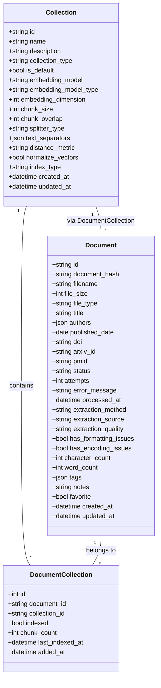
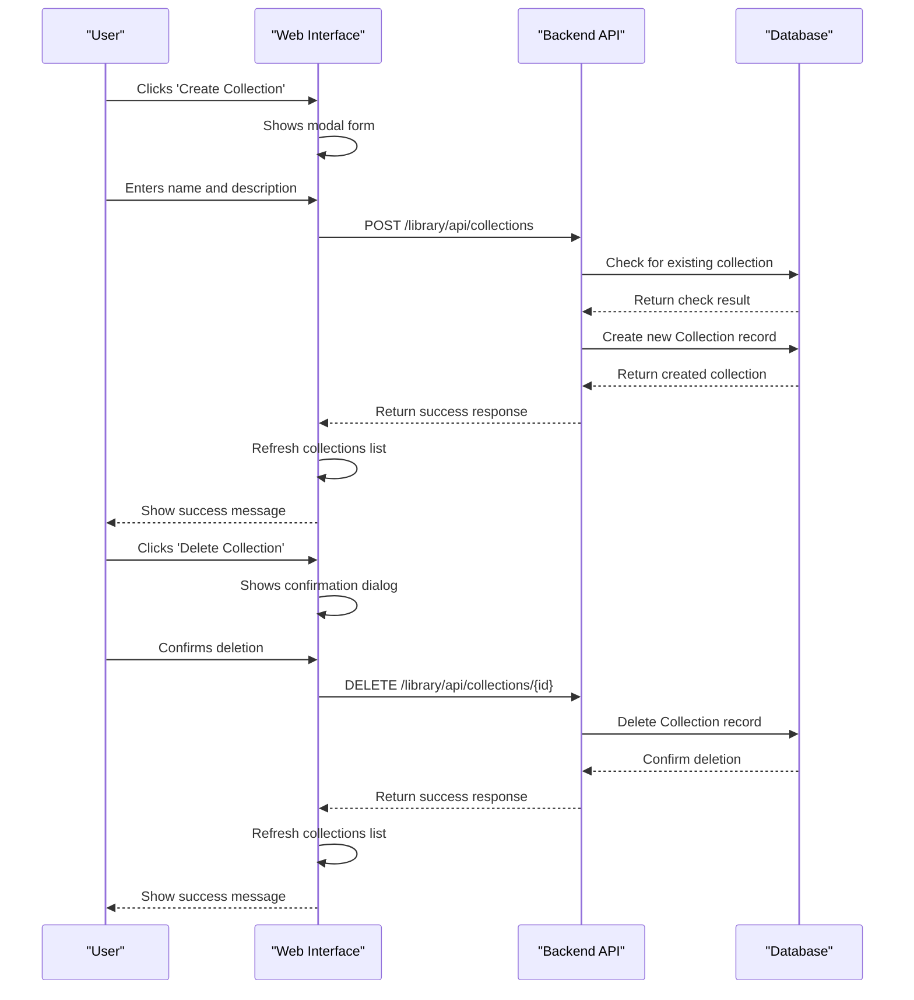
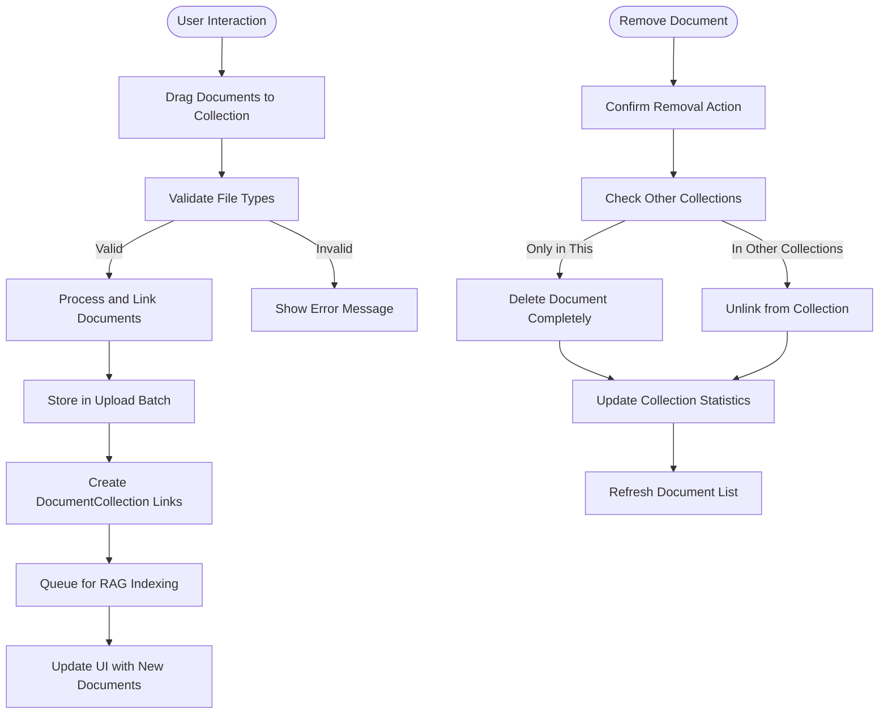

# Collections and Folder Organization

<cite>
**Referenced Files in This Document**   
- [library.py](file://src/local_deep_research/database/models/library.py#L348-L446)
- [collections_manager.js](file://src/local_deep_research/web/static/js/collections_manager.js)
- [collection_details.js](file://src/local_deep_research/web/static/js/collection_details.js)
- [collection_create.js](file://src/local_deep_research/web/static/js/collection_create.js)
- [collection_details.html](file://src/local_deep_research/web/templates/pages/collection_details.html)
- [collections.html](file://src/local_deep_research/web/templates/pages/collections.html)
- [rag_routes.py](file://src/local_deep_research/research_library/routes/rag_routes.py#L1170-L1218)
- [urls.js](file://src/local_deep_research/web/static/js/config/urls.js#L98-L113)
- [test_collections_api.py](file://tests/api_tests/test_collections_api.py)
</cite>

## Table of Contents
1. [Introduction](#introduction)
2. [Collection Entity Model](#collection-entity-model)
3. [CRUD Operations](#crud-operations)
4. [Document Management in Collections](#document-management-in-collections)
5. [Hierarchical Organization](#hierarchical-organization)
6. [Sharing Mechanisms](#sharing-mechanisms)
7. [Use Cases and Examples](#use-cases-and-examples)
8. [Integration with Other Features](#integration-with-other-features)
9. [Conclusion](#conclusion)

## Introduction
The collections system provides a folder-like organization for research documents, enabling users to organize their research materials in a structured manner. This system allows for the creation of custom collections, management of documents within these collections, and integration with various research features such as RAG (Retrieval-Augmented Generation) and export functions. The collections serve as containers for documents, supporting both hierarchical organization and collaborative research through sharing mechanisms.

## Collection Entity Model
The Collection entity model represents a container for organizing research documents, functioning as a folder-like structure within the system. Each collection is identified by a unique UUID and contains metadata such as name, description, creation timestamp, and type. The model supports different collection types, including user-created collections and system-managed collections like the default library.

Collections maintain relationships with documents through a many-to-many association, allowing documents to belong to multiple collections simultaneously. This relationship is managed through the DocumentCollection junction table, which tracks the indexing status of each document within a specific collection. The collection model also stores embedding configuration details when documents are indexed for RAG operations, including the embedding model, chunk size, overlap, and other advanced settings.

The entity model enforces referential integrity through cascading deletes, ensuring that when a collection is deleted, all associated document links are automatically removed. However, documents themselves are only deleted if they are not referenced by any other collection, implementing a safe deletion mechanism that prevents accidental data loss.

**Diagram sources**
- [library.py](file://src/local_deep_research/database/models/library.py#L348-L446)

**Section sources**
- [library.py](file://src/local_deep_research/database/models/library.py#L348-L446)

## CRUD Operations
The collections system provides comprehensive CRUD (Create, Read, Update, Delete) operations through both UI and API interfaces. Users can create new collections through a modal interface on the collections page or via the API endpoint `/library/api/collections` using a POST request with the collection name and optional description. The system validates that collection names are unique within a user's account and enforces required fields.

Reading collections is accomplished through the GET `/library/api/collections` endpoint, which returns a list of all collections with their metadata, including document counts and indexing status. The UI displays collections in a grid format with visual indicators for indexing status and basic statistics. Each collection card provides a link to the detailed view.

Updating collections, specifically renaming, is performed through the PUT `/library/api/collections/{id}` endpoint. The UI does not currently provide an inline editing interface, requiring users to navigate to the collection details page for modifications. The API allows partial updates, accepting only the fields that need to be changed.

Deleting collections is implemented through the DELETE `/library/api/collections/{id}` endpoint. The UI presents a confirmation dialog to prevent accidental deletion. When a collection is deleted, all document-collection links are removed, but documents are only permanently deleted if they are not referenced by any other collection, preserving data integrity across the system.

**Diagram sources**
- [rag_routes.py](file://src/local_deep_research/research_library/routes/rag_routes.py#L1170-L1218)
- [collections_manager.js](file://src/local_deep_research/web/static/js/collections_manager.js)
- [test_collections_api.py](file://tests/api_tests/test_collections_api.py)

**Section sources**
- [rag_routes.py](file://src/local_deep_research/research_library/routes/rag_routes.py#L1170-L1218)
- [collections_manager.js](file://src/local_deep_research/web/static/js/collections_manager.js)
- [test_collections_api.py](file://tests/api_tests/test_collections_api.py)

## Document Management in Collections
Documents are added to collections through a drag-and-drop interface or file upload mechanism, providing an intuitive user experience for organizing research materials. The system supports bulk operations, allowing users to add multiple documents to a collection simultaneously. When documents are added to a collection, they are linked through the DocumentCollection junction table, which maintains the many-to-many relationship between documents and collections.

The UI provides visual feedback during the drag-and-drop process, with hover effects and drop zone highlighting to indicate valid drop targets. After documents are added, they appear in the collection's document list with metadata such as file size, source type, and indexing status. Users can filter documents by indexing status (indexed, unindexed, or all) to manage the RAG indexing process efficiently.

Documents can be removed from collections through a dedicated "Remove from Collection" button, which presents a confirmation dialog explaining the consequences. If a document exists only in the current collection, removal will result in permanent deletion. If the document exists in other collections, it will only be unlinked from the current collection, preserving the document in the system.

**Diagram sources**
- [collection_details.js](file://src/local_deep_research/web/static/js/collection_details.js)
- [collection_upload.html](file://src/local_deep_research/web/templates/pages/collection_upload.html)

**Section sources**
- [collection_details.js](file://src/local_deep_research/web/static/js/collection_details.js)
- [collection_upload.html](file://src/local_deep_research/web/templates/pages/collection_upload.html)

## Hierarchical Organization
The collections system supports hierarchical organization through nested collections, allowing users to create a tree-like structure for their research materials. While the current implementation primarily focuses on flat collections, the entity model is designed to support parent-child relationships between collections, enabling the creation of sub-collections for more granular organization.

Users can organize collections by research topic, project phase, or workflow stage, creating a logical hierarchy that mirrors their research process. For example, a user might create a top-level collection for a research project, with sub-collections for different aspects of the project such as "Literature Review," "Methodology," "Results," and "References." This hierarchical approach facilitates better information architecture and improves navigation within large research repositories.

The UI displays collections in a grid format that can be sorted by name, creation date, or document count, helping users quickly locate specific collections. Future enhancements could include a tree view navigation panel that visualizes the hierarchical relationships between collections, providing a more intuitive way to navigate complex research structures.

## Sharing Mechanisms
The collections system enables collaborative research through sharing mechanisms that allow users to share collections with other users. When a collection is shared, collaborators gain access to all documents within the collection, along with their associated metadata and indexing status. The sharing system implements access controls to ensure that only authorized users can view or modify shared collections.

Sharing is accomplished through a dedicated sharing interface that allows users to enter email addresses or select contacts from their network. The system sends invitations to the specified users, who can then accept or decline the sharing request. Once accepted, the shared collection appears in the collaborator's collection list with a visual indicator showing that it is a shared collection.

The sharing mechanism respects the document ownership model, where the original creator of a document maintains ownership even when the document is included in shared collections. This ensures that users retain control over their intellectual property while still enabling collaborative research. Permissions can be set at the collection level, allowing for read-only or read-write access depending on the collaboration requirements.

## Use Cases and Examples
The collections system supports various use cases for organizing research, including organizing by topic, project, or workflow stage. For topic-based organization, users can create collections for specific research areas such as "Machine Learning," "Climate Change," or "Healthcare Innovation." Within each topic collection, users can add relevant documents from various sources, creating a comprehensive resource library for each subject area.

For project-based organization, users can create collections that correspond to specific research projects. For example, a user working on a paper about renewable energy might create a collection titled "Renewable Energy Research" and add documents related to solar power, wind energy, and energy storage. The collection serves as a central repository for all materials related to the project, making it easy to access and reference relevant information.

Workflow-based organization allows users to structure collections according to the stages of their research process. A typical workflow might include collections such as "Initial Research," "Data Collection," "Analysis," "Drafting," and "Final Review." As the research progresses, documents can be moved between collections to reflect their current status, providing a visual representation of the research pipeline.

## Integration with Other Features
The collections system integrates seamlessly with other features such as RAG and export functions, enhancing the research workflow. For RAG integration, entire collections can be used as context sources for AI-powered research assistance. When a collection is indexed for RAG, the system creates a FAISS vector index that enables semantic search across all documents in the collection. This allows users to ask natural language questions and receive answers based on the collective knowledge within the collection.

Export functions enable users to export entire collections as compressed archives, preserving the folder structure and metadata. This is particularly useful for sharing research with colleagues who may not have access to the system or for creating backups of important research materials. The export process includes options for selecting the file format (PDF, Markdown, HTML) and whether to include original documents or only extracted text.

The collections system also integrates with search functionality, allowing users to search across all collections or limit searches to specific collections. This targeted search capability improves the precision of research queries and reduces information overload. Additionally, collections can be used as sources for automated research workflows, where the system periodically checks for new publications in specific domains and adds them to designated collections.

## Conclusion
The collections system provides a robust framework for organizing research documents in a folder-like structure, supporting both individual and collaborative research workflows. By implementing a flexible entity model, comprehensive CRUD operations, and seamless integration with other research features, the system enhances the efficiency and effectiveness of the research process. The ability to organize documents by topic, project, or workflow stage, combined with sharing mechanisms and RAG integration, makes the collections system a powerful tool for modern research.