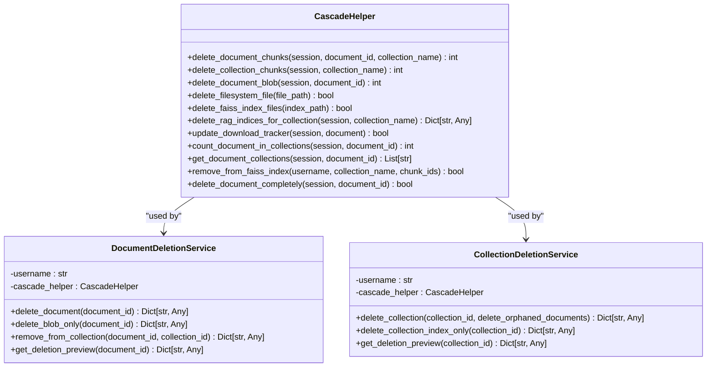
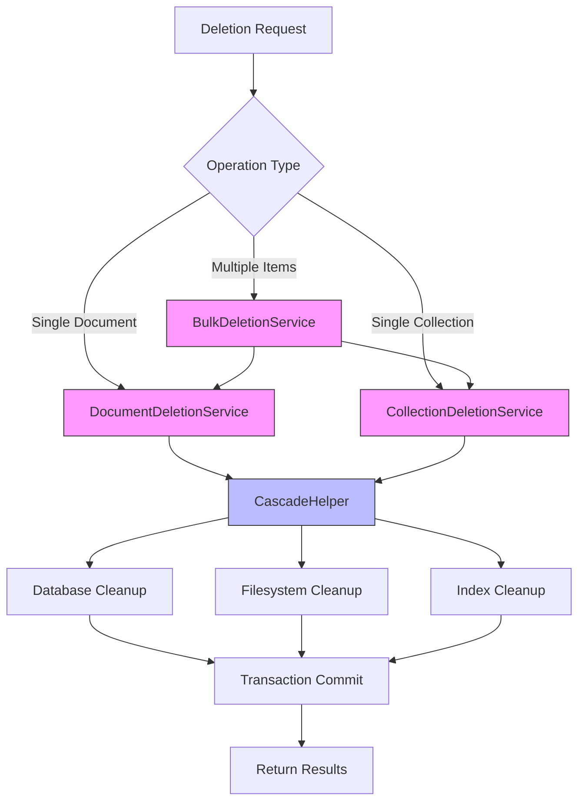
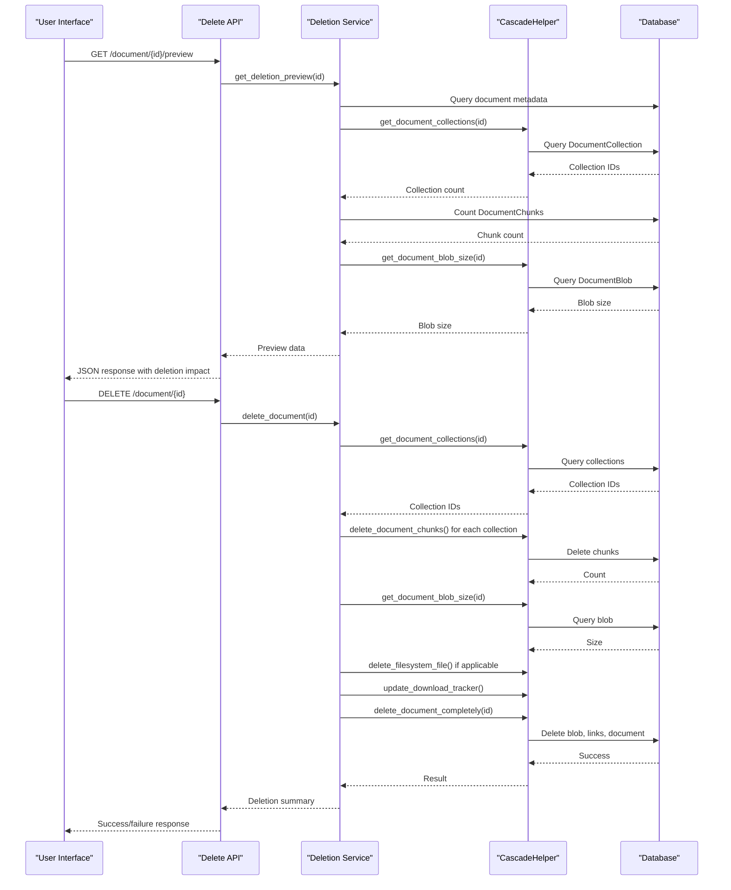
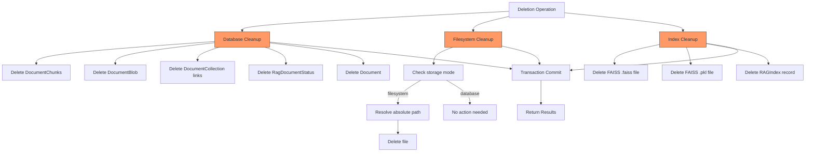
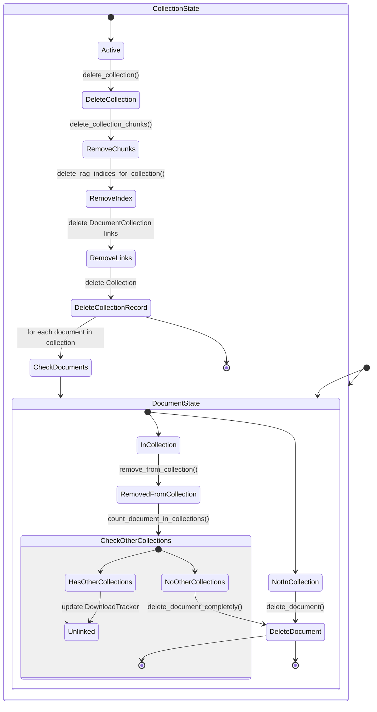
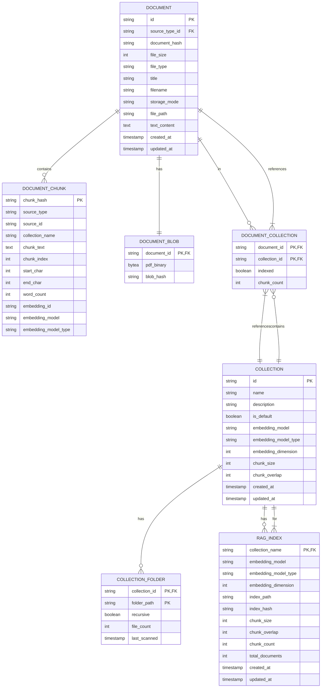

# Deletion System and Data Integrity

<cite>
**Referenced Files in This Document**   
- [cascade_helper.py](file://src/local_deep_research/research_library/deletion/utils/cascade_helper.py)
- [document_deletion.py](file://src/local_deep_research/research_library/deletion/services/document_deletion.py)
- [collection_deletion.py](file://src/local_deep_research/research_library/deletion/services/collection_deletion.py)
- [bulk_deletion.py](file://src/local_deep_research/research_library/deletion/services/bulk_deletion.py)
- [delete_routes.py](file://src/local_deep_research/research_library/deletion/routes/delete_routes.py)
- [test_document_deletion.py](file://tests/deletion/test_document_deletion.py)
- [test_collection_deletion.py](file://tests/deletion/test_collection_deletion.py)
- [test_cascade_integration.py](file://tests/deletion/test_cascade_integration.py)
</cite>

## Table of Contents
1. [Introduction](#introduction)
2. [Cascade Deletion Pattern](#cascade-deletion-pattern)
3. [Three-Level Deletion Service Architecture](#three-level-deletion-service-architecture)
4. [Safety Mechanisms and Deletion Previews](#safety-mechanisms-and-deletion-previews)
5. [Resource Cleanup During Deletion](#resource-cleanup-during-deletion)
6. [Deletion Scenarios and Data Impact](#deletion-scenarios-and-data-impact)
7. [API Endpoints for Deletion Operations](#api-endpoints-for-deletion-operations)
8. [Conclusion](#conclusion)

## Introduction

The deletion system in the Local Deep Research application is designed to ensure data integrity while providing flexible document and collection management capabilities. This system implements a comprehensive cascade deletion pattern to maintain referential integrity across multiple data stores, including databases, filesystems, and search indexes. The architecture supports three distinct levels of deletion operations—document, collection, and bulk—each with specific behaviors and safety mechanisms. The system also includes features for previewing deletion impacts, recovering recently deleted items, and cleaning up associated resources such as PDF files, database records, and index entries. This documentation provides a detailed analysis of the deletion system's implementation, focusing on its architecture, safety mechanisms, and integration points.

## Cascade Deletion Pattern

The cascade deletion pattern implemented in the Local Deep Research application ensures referential integrity by systematically cleaning up related records that would otherwise become orphaned. This pattern is primarily facilitated through the `CascadeHelper` utility class, which addresses the absence of foreign key constraints in certain database relationships.

The `CascadeHelper` class provides static methods for cleaning up various types of related records during deletion operations. Key methods include `delete_document_chunks()` for removing DocumentChunks associated with a document, `delete_document_blob()` for handling document binary data, and `delete_faiss_index_files()` for removing FAISS index files. The helper also manages the update of DownloadTracker records when documents are deleted, ensuring that download status is properly maintained.

A critical aspect of the cascade pattern is the manual cleanup of DocumentChunks, which lack foreign key constraints. When a document is deleted, the system must explicitly remove all associated chunks to prevent orphaned records. This is accomplished by first retrieving all collection IDs associated with the document and then deleting chunks for each collection. The `delete_document_completely()` method in `CascadeHelper` implements a specific deletion order to avoid database constraint violations, first deleting the DocumentBlob (which has the document ID as a primary key), then the DocumentCollection links, and finally the Document itself.

**Diagram sources**
- [cascade_helper.py](file://src/local_deep_research/research_library/deletion/utils/cascade_helper.py#L26-L418)
- [document_deletion.py](file://src/local_deep_research/research_library/deletion/services/document_deletion.py#L23-L436)
- [collection_deletion.py](file://src/local_deep_research/research_library/deletion/services/collection_deletion.py#L26-L328)

**Section sources**
- [cascade_helper.py](file://src/local_deep_research/research_library/deletion/utils/cascade_helper.py#L26-L418)

## Three-Level Deletion Service Architecture

The deletion system implements a three-level service architecture consisting of document, collection, and bulk deletion services. Each level provides specific functionality while maintaining data integrity through the cascade deletion pattern.

The **Document Deletion Service** handles individual document operations, including complete document deletion, blob-only deletion (removing the PDF while preserving text content), and removing documents from collections. When a document is removed from a collection, the service checks if the document exists in any other collections. If not, the document is completely deleted to prevent orphaned records. The service returns detailed results including the number of chunks deleted, blob size freed, and whether the document was unlinked or deleted.

The **Collection Deletion Service** manages collection-level operations, including full collection deletion and index-only deletion. When a collection is deleted, all associated DocumentChunks, RAG indices, and FAISS index files are removed. Documents are preserved but unlinked from the collection unless they are no longer referenced by any other collection, in which case they are also deleted. The service supports an option to preserve all documents regardless of their collection membership.

The **Bulk Deletion Service** provides operations for handling multiple documents simultaneously. It leverages the Document Deletion Service to perform bulk operations such as deleting multiple documents, removing multiple documents from a collection, or deleting blobs for multiple documents. The service aggregates results from individual operations, providing summary statistics on the number of successful and failed deletions, total chunks deleted, and bytes freed.

**Diagram sources**
- [document_deletion.py](file://src/local_deep_research/research_library/deletion/services/document_deletion.py#L23-L436)
- [collection_deletion.py](file://src/local_deep_research/research_library/deletion/services/collection_deletion.py#L26-L328)
- [bulk_deletion.py](file://src/local_deep_research/research_library/deletion/services/bulk_deletion.py#L17-L298)

**Section sources**
- [document_deletion.py](file://src/local_deep_research/research_library/deletion/services/document_deletion.py#L23-L436)
- [collection_deletion.py](file://src/local_deep_research/research_library/deletion/services/collection_deletion.py#L26-L328)
- [bulk_deletion.py](file://src/local_deep_research/research_library/deletion/services/bulk_deletion.py#L17-L298)

## Safety Mechanisms and Deletion Previews

The deletion system incorporates several safety mechanisms to prevent accidental data loss and provide users with clear information about the impact of deletion operations. The primary safety feature is the deletion preview functionality, which allows users to see exactly what will be affected before confirming a deletion.

The preview system is implemented through `get_deletion_preview()` methods in both the DocumentDeletionService and CollectionDeletionService. For document deletion, the preview shows information such as the document title, file type, storage mode, whether a blob exists and its size, the number of collections the document belongs to, and the number of text chunks that will be deleted. For collection deletion, the preview displays the collection name, description, number of documents, number of chunks, number of folders, and whether a RAG index exists.

These preview methods are exposed through dedicated API endpoints that return detailed information about the impending deletion. The frontend can use this information to display confirmation dialogs with specific details about the operation, helping users make informed decisions. The preview functionality is also available for bulk operations through the `get_bulk_preview()` method in the BulkDeletionService, which provides aggregate statistics on the total number of documents, documents with blobs, total blob size, and total chunks affected.

The system also implements transactional integrity through database sessions, ensuring that deletion operations are atomic. If any part of the deletion process fails, the entire transaction is rolled back, preventing partial deletions that could compromise data integrity. Error handling is comprehensive, with detailed error messages returned to the client to help diagnose issues.

**Diagram sources**
- [document_deletion.py](file://src/local_deep_research/research_library/deletion/services/document_deletion.py#L389-L436)
- [delete_routes.py](file://src/local_deep_research/research_library/deletion/routes/delete_routes.py#L87-L109)

**Section sources**
- [document_deletion.py](file://src/local_deep_research/research_library/deletion/services/document_deletion.py#L389-L436)
- [delete_routes.py](file://src/local_deep_research/research_library/deletion/routes/delete_routes.py#L87-L109)

## Resource Cleanup During Deletion

The deletion system comprehensively cleans up all associated resources when documents or collections are removed, ensuring no orphaned data remains in the system. This cleanup process targets three main resource types: database records, filesystem files, and search index entries.

For **database records**, the system removes multiple related entities when a document is deleted. The DocumentBlob record is deleted either through CASCADE operations or explicitly via the `delete_document_blob()` method. DocumentCollection links are removed to disconnect the document from collections, and RagDocumentStatus records are cleaned up as part of the CASCADE deletion. The system handles the special case of DocumentChunks, which lack foreign key constraints, by explicitly deleting them through query-based operations before removing the parent document.

For **filesystem files**, the system identifies and removes PDF files when appropriate. The `delete_filesystem_file()` method in CascadeHelper handles this cleanup, checking the document's storage mode and file path before attempting deletion. The method includes safeguards to prevent deletion of special path markers like "metadata_only" or "text_only_not_stored". When a document is stored in the filesystem (storage_mode="filesystem"), the absolute path is resolved using `get_absolute_path_from_settings()` before deletion.

For **search index entries**, the system removes both the FAISS index files (.faiss and .pkl) and the corresponding RAGIndex database records. The `delete_faiss_index_files()` method deletes the physical index files from storage, while `delete_rag_indices_for_collection()` removes the database records and returns statistics on the cleanup. When removing specific chunks from a collection, the `remove_from_faiss_index()` method interacts with the LibraryRAGService to update the FAISS index directly.

The cleanup process is designed to be idempotent and resilient, with error handling that logs failures but continues with other cleanup operations. This ensures that even if one resource type cannot be cleaned up (e.g., a filesystem file is locked), other cleanup operations still proceed, minimizing the risk of data inconsistency.

**Diagram sources**
- [cascade_helper.py](file://src/local_deep_research/research_library/deletion/utils/cascade_helper.py#L140-L208)
- [document_deletion.py](file://src/local_deep_research/research_library/deletion/services/document_deletion.py#L109-L119)
- [collection_deletion.py](file://src/local_deep_research/research_library/deletion/services/collection_deletion.py#L114-L119)

**Section sources**
- [cascade_helper.py](file://src/local_deep_research/research_library/deletion/utils/cascade_helper.py#L140-L208)
- [document_deletion.py](file://src/local_deep_research/research_library/deletion/services/document_deletion.py#L109-L119)
- [collection_deletion.py](file://src/local_deep_research/research_library/deletion/services/collection_deletion.py#L114-L119)

## Deletion Scenarios and Data Impact

The deletion system handles various scenarios with specific behaviors to maintain data integrity and user expectations. These scenarios include single document deletion, document removal from collections, collection deletion, and bulk operations.

In the **single document deletion** scenario, the system removes the document and all its associated data, including text chunks, PDF blob, and collection links. If the document is stored in the filesystem, the physical file is also deleted. The DownloadTracker record is updated to reflect that the document is no longer downloaded. This operation is comprehensive and irreversible, freeing all resources associated with the document.

When **removing a document from a collection**, the system's behavior depends on whether the document exists in other collections. If the document is only in the specified collection, it is completely deleted after being unlinked (an "orphan" deletion). If the document exists in other collections, it is only unlinked from the specified collection, preserving the document and its data. This behavior ensures that documents are only deleted when they are no longer referenced anywhere in the system.

For **collection deletion**, the system preserves documents but removes all collection-specific data. This includes deleting all DocumentChunks associated with the collection, removing the RAG index and FAISS files, and deleting CollectionFolder records. Documents are unlinked from the collection but remain in the library unless they are no longer referenced by any other collection, in which case they are also deleted. This allows users to reorganize their collections without losing document content.

**Bulk operations** apply the same logic to multiple items simultaneously. The BulkDeletionService processes each item individually, aggregating the results to provide a comprehensive summary of the operation's success and impact. This includes tracking the number of successful deletions, failures, total chunks deleted, and bytes freed.

The system's behavior is validated through comprehensive integration tests that verify the complete cleanup of all related records and the absence of orphaned data. These tests confirm that the cascade deletion pattern works correctly across all scenarios, maintaining referential integrity throughout the application.

**Diagram sources**
- [document_deletion.py](file://src/local_deep_research/research_library/deletion/services/document_deletion.py#L246-L377)
- [collection_deletion.py](file://src/local_deep_research/research_library/deletion/services/collection_deletion.py#L38-L178)
- [test_document_deletion.py](file://tests/deletion/test_document_deletion.py#L190-L222)
- [test_collection_deletion.py](file://tests/deletion/test_collection_deletion.py#L373-L426)

**Section sources**
- [document_deletion.py](file://src/local_deep_research/research_library/deletion/services/document_deletion.py#L246-L377)
- [collection_deletion.py](file://src/local_deep_research/research_library/deletion/services/collection_deletion.py#L38-L178)

## API Endpoints for Deletion Operations

The deletion system exposes a comprehensive set of REST API endpoints through the delete_routes module, providing programmatic access to all deletion functionality. These endpoints follow consistent patterns for request handling, error reporting, and response formatting.

The **document deletion endpoints** include:
- `DELETE /library/api/document/{document_id}`: Permanently deletes a document and all associated data
- `DELETE /library/api/document/{document_id}/blob`: Deletes only the PDF blob, preserving text content
- `GET /library/api/document/{document_id}/preview`: Returns a preview of what will be deleted
- `DELETE /library/api/collection/{collection_id}/document/{document_id}`: Removes a document from a specific collection

The **collection deletion endpoints** include:
- `DELETE /library/api/collections/{collection_id}`: Deletes a collection and cleans up related data
- `DELETE /library/api/collections/{collection_id}/index`: Deletes only the RAG index for a collection
- `GET /library/api/collections/{collection_id}/preview`: Returns a preview of collection deletion impact

The **bulk deletion endpoints** include:
- `DELETE /library/api/documents/bulk`: Deletes multiple documents at once
- `DELETE /library/api/documents/blobs`: Deletes PDF blobs for multiple documents
- `DELETE /library/api/collection/{collection_id}/documents/bulk`: Removes multiple documents from a collection
- `POST /library/api/documents/preview`: Gets a preview of bulk deletion impact

All endpoints require authentication via the `@login_required` decorator and return JSON responses with a consistent structure. Successful operations return a 200 status code with a response body containing `"success": true` and operation-specific details. Failed operations return appropriate HTTP status codes (404 for not found, 400 for bad requests) with `"success": false` and an error message. The endpoints handle request validation, including checking for required parameters and proper data types, providing clear error messages when validation fails.

**Diagram sources**
- [delete_routes.py](file://src/local_deep_research/research_library/deletion/routes/delete_routes.py#L32-L414)
- [document_deletion.py](file://src/local_deep_research/research_library/deletion/services/document_deletion.py#L35-L436)
- [collection_deletion.py](file://src/local_deep_research/research_library/deletion/services/collection_deletion.py#L38-L328)

**Section sources**
- [delete_routes.py](file://src/local_deep_research/research_library/deletion/routes/delete_routes.py#L32-L414)

## Conclusion

The deletion system in the Local Deep Research application provides a robust and comprehensive solution for managing document and collection removal while ensuring data integrity. Through the implementation of a cascade deletion pattern via the CascadeHelper utility, the system maintains referential integrity across multiple data stores, including databases, filesystems, and search indexes. The three-level service architecture—document, collection, and bulk—offers flexible deletion capabilities that meet various user needs while incorporating safety mechanisms like deletion previews and confirmation dialogs.

The system thoroughly cleans up all associated resources during deletion operations, including database records, filesystem files, and index entries, preventing orphaned data and ensuring efficient resource utilization. Various deletion scenarios are handled appropriately, with intelligent behavior for orphaned documents and collections. The comprehensive API endpoints provide programmatic access to all deletion functionality with consistent error handling and response formats.

While the current implementation does not show direct integration with the notification system to inform users of deletion results, such integration could be added to enhance user experience by providing real-time feedback on deletion operations and any errors encountered. Overall, the deletion system demonstrates a well-designed approach to data management that prioritizes integrity, safety, and usability.