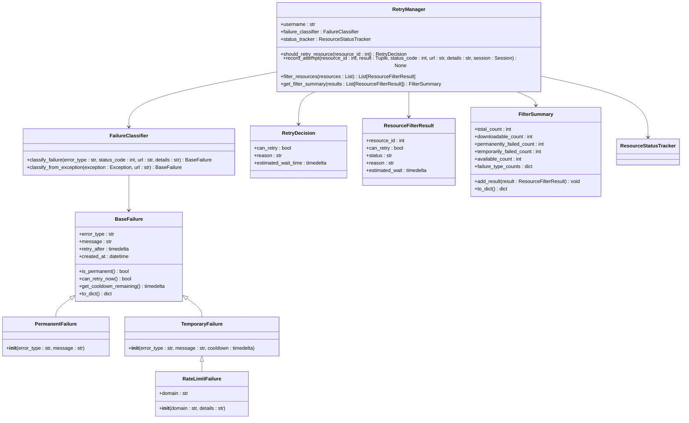

# Document Download and Processing Pipeline

<cite>
**Referenced Files in This Document**   
- [download_service.py](file://src/local_deep_research/research_library/services/download_service.py)
- [base.py](file://src/local_deep_research/research_library/downloaders/base.py)
- [arxiv.py](file://src/local_deep_research/research_library/downloaders/arxiv.py)
- [pubmed.py](file://src/local_deep_research/research_library/downloaders/pubmed.py)
- [openalex.py](file://src/local_deep_research/research_library/downloaders/openalex.py)
- [semantic_scholar.py](file://src/local_deep_research/research_library/downloaders/semantic_scholar.py)
- [direct_pdf.py](file://src/local_deep_research/research_library/downloaders/direct_pdf.py)
- [generic.py](file://src/local_deep_research/research_library/downloaders/generic.py)
- [retry_manager.py](file://src/local_deep_research/library/download_management/retry_manager.py)
- [failure_classifier.py](file://src/local_deep_research/library/download_management/failure_classifier.py)
- [pdf_storage_manager.py](file://src/local_deep_research/research_library/services/pdf_storage_manager.py)
- [download_manager.html](file://src/local_deep_research/web/templates/pages/download_manager.html)
</cite>

## Table of Contents
1. [Introduction](#introduction)
2. [Downloader Registry Pattern](#downloader-registry-pattern)
3. [Download Service Orchestration](#download-service-orchestration)
4. [Retry Mechanism and Failure Classification](#retry-mechanism-and-failure-classification)
5. [Post-Download Processing](#post-download-processing)
6. [Configuration and Customization](#configuration-and-customization)
7. [UI Interface for Download Management](#ui-interface-for-download-management)
8. [Conclusion](#conclusion)

## Introduction
The document download and processing pipeline is a comprehensive system designed to retrieve academic research papers from various sources, process their content, and manage the download lifecycle. This system supports multiple academic repositories including arXiv, PubMed, OpenAlex, Semantic Scholar, and others through a modular architecture that enables extensibility and maintainability. The pipeline handles URL resolution, content retrieval, format handling, retry mechanisms, failure classification, and post-processing tasks such as PDF extraction and text cleaning. This documentation provides a detailed analysis of the system's architecture, components, and functionality.

## Downloader Registry Pattern

The system implements a downloader registry pattern through specialized downloader classes that handle different academic sources. This pattern follows the Strategy design pattern, where each downloader class implements a common interface while providing source-specific logic for content retrieval.


**Diagram sources**
- [base.py](file://src/local_deep_research/research_library/downloaders/base.py#L37-L380)
- [arxiv.py](file://src/local_deep_research/research_library/downloaders/arxiv.py#L13-L233)
- [pubmed.py](file://src/local_deep_research/research_library/downloaders/pubmed.py#L14-L506)
- [openalex.py](file://src/local_deep_research/research_library/downloaders/openalex.py#L1-L200)
- [semantic_scholar.py](file://src/local_deep_research/research_library/downloaders/semantic_scholar.py#L1-L200)
- [direct_pdf.py](file://src/local_deep_research/research_library/downloaders/direct_pdf.py#L1-L100)
- [generic.py](file://src/local_deep_research/research_library/downloaders/generic.py#L1-L100)

The downloader registry pattern is implemented through an abstract base class `BaseDownloader` that defines the interface for all downloader implementations. Each specialized downloader class inherits from this base class and implements the `can_handle` method to determine if it can process a given URL, and the `download` method to retrieve content from supported sources.

The system supports the following academic sources:
- **arXiv**: Handles papers from arxiv.org with support for PDF and abstract retrieval
- **PubMed/PMC**: Retrieves articles from pubmed.ncbi.nlm.nih.gov and ncbi.nlm.nih.gov/pmc with rate limiting
- **OpenAlex**: Downloads content using the OpenAlex API
- **Semantic Scholar**: Retrieves papers using the Semantic Scholar API
- **Direct PDF**: Handles URLs that directly point to PDF files
- **Generic**: Fallback downloader for other academic sources

The downloaders are registered and prioritized in the `DownloadService` initialization, with `DirectPDFDownloader` given priority for efficiency with direct PDF links, followed by API-based downloaders, and the `GenericDownloader` serving as a fallback option.

**Section sources**
- [base.py](file://src/local_deep_research/research_library/downloaders/base.py#L37-L380)
- [arxiv.py](file://src/local_deep_research/research_library/downloaders/arxiv.py#L13-L233)
- [pubmed.py](file://src/local_deep_research/research_library/downloaders/pubmed.py#L14-L506)

## Download Service Orchestration

The `DownloadService` class orchestrates the entire download process, coordinating between different components to ensure efficient and reliable content retrieval. It manages the download lifecycle from URL resolution to content storage, handling deduplication, progress tracking, and error management.

```mermaid
sequenceDiagram
participant UI as "UI Interface"
participant Service as "DownloadService"
participant Downloader as "Specialized Downloader"
participant Storage as "PDFStorageManager"
participant DB as "Database"
UI->>Service : queue_research_downloads(research_id)
Service->>DB : Query ResearchResource
loop For each resource
Service->>DB : Check is_already_downloaded()
alt Already downloaded
Service-->>Service : Skip
else Not downloaded
Service->>Service : Add to LibraryDownloadQueue
end
end
Service-->>UI : Return queued count
UI->>Service : download_resource(resource_id)
Service->>DB : Get ResearchResource
Service->>DB : Check existing document
alt Not downloaded
Service->>Service : Create DownloadTracker
loop For each downloader
Service->>Downloader : can_handle(url)
alt Can handle
Downloader-->>Service : True
Service->>Downloader : download_with_result()
alt Success
Downloader-->>Service : PDF content
Service->>Storage : save_pdf()
Storage-->>Service : file_path
Service->>DB : Update Document status
break
else Failed
Downloader-->>Service : skip_reason
end
else Cannot handle
Downloader-->>Service : False
end
end
Service->>DB : Record attempt
else Already downloaded
Service-->>UI : Success
end
```

**Diagram sources**
- [download_service.py](file://src/local_deep_research/research_library/services/download_service.py#L62-L1580)
- [pdf_storage_manager.py](file://src/local_deep_research/research_library/services/pdf_storage_manager.py#L24-L426)

The download orchestration process begins with the `queue_research_downloads` method, which identifies downloadable resources from a research session and adds them to the download queue. The service checks for duplicates using URL hashing and verifies download status through the `is_already_downloaded` method, which validates both database records and file existence.

When processing individual downloads through `download_resource`, the service follows a systematic approach:
1. Retrieve the research resource from the database
2. Check if the document has already been downloaded
3. Create a download tracker entry for monitoring
4. Iterate through registered downloaders to find one that can handle the URL
5. Execute the download with the selected downloader
6. Store the content using the PDF storage manager
7. Update database records with download status

The service implements intelligent URL normalization and hashing to prevent duplicate downloads from equivalent URLs with different parameters or protocols. It also handles collection management, linking downloaded documents to appropriate collections in the research library.

**Section sources**
- [download_service.py](file://src/local_deep_research/research_library/services/download_service.py#L62-L1580)

## Retry Mechanism and Failure Classification

The system implements a sophisticated retry mechanism and failure classification system to handle transient errors and prevent endless retry loops. This is achieved through the `RetryManager` and `FailureClassifier` classes, which work together to categorize failures and determine appropriate retry strategies.



**Diagram sources**
- [failure_classifier.py](file://src/local_deep_research/library/download_management/failure_classifier.py#L16-L212)
- [retry_manager.py](file://src/local_deep_research/library/download_management/retry_manager.py#L80-L284)

The failure classification system uses inheritance to organize different failure categories. The base `BaseFailure` class provides common functionality, while specialized classes handle specific failure types:
- **PermanentFailure**: Resources that should never be retried (e.g., 404 Not Found, 410 Gone)
- **TemporaryFailure**: Resources that can be retried after a cooldown period
- **RateLimitFailure**: Domain-specific rate limit handling with longer cooldowns

The `FailureClassifier` analyzes error patterns, HTTP status codes, and exception types to categorize failures appropriately. For example, it identifies rate limiting (HTTP 429) and applies domain-specific cooldown periods, with longer waits for sources like arXiv (6 hours) compared to others.

The `RetryManager` uses this classification to make intelligent decisions about retry eligibility. It tracks retry attempts and enforces cooldown periods to prevent overwhelming external services. The manager also provides filtering capabilities to categorize resources based on their retry status, which is useful for UI display and batch processing.

**Section sources**
- [failure_classifier.py](file://src/local_deep_research/library/download_management/failure_classifier.py#L16-L212)
- [retry_manager.py](file://src/local_deep_research/library/download_management/retry_manager.py#L80-L284)

## Post-Download Processing

After successful content retrieval, the system performs several post-processing steps to extract and organize information from downloaded documents. This includes PDF text extraction, metadata enrichment, and content cleaning to prepare the data for further analysis and storage.


**Diagram sources**
- [download_service.py](file://src/local_deep_research/research_library/services/download_service.py#L62-L1580)
- [pdf_storage_manager.py](file://src/local_deep_research/research_library/services/pdf_storage_manager.py#L24-L426)
- [base.py](file://src/local_deep_research/research_library/downloaders/base.py#L37-L380)

The post-download processing pipeline begins with PDF storage, which supports three modes:
- **Filesystem**: Stores PDFs unencrypted on disk for fast access and compatibility with external tools
- **Database**: Stores PDFs encrypted in the SQLCipher database for security and portability
- **None**: Doesn't store PDFs, only extracts and stores text content

Text extraction uses multiple libraries for optimal results. The system first attempts extraction with `pdfplumber`, which handles complex layouts better, and falls back to `PyPDF` if needed. The extracted text is then cleaned and stored in the encrypted database along with metadata from the source APIs.

For metadata enrichment, the system queries the respective APIs to retrieve additional information such as titles, authors, abstracts, and publication details. This metadata is combined with the extracted text to create a comprehensive document record. For example, when downloading from arXiv, the system retrieves metadata from the arXiv API and prepends it to the extracted full text.

The processing pipeline also handles edge cases such as large PDFs (above the configured size limit of 100MB) by skipping storage while still attempting text extraction, ensuring that valuable content is not lost even if the full document cannot be stored.

**Section sources**
- [download_service.py](file://src/local_deep_research/research_library/services/download_service.py#L62-L1580)
- [pdf_storage_manager.py](file://src/local_deep_research/research_library/services/pdf_storage_manager.py#L24-L426)

## Configuration and Customization

The download system supports extensive customization through configuration options that allow users to tailor the behavior to their specific needs. These configurations are managed through the settings system and can be adjusted via the application's configuration files or UI.

The primary configuration options include:

**Table: Download Configuration Options**
| Configuration Key | Default Value | Description |
|-------------------|-------------|-------------|
| research_library.storage_path | ~/.local-deep-research/library | Root directory for the research library |
| research_library.pdf_storage_mode | none | Storage mode for PDFs (none, filesystem, database) |
| research_library.max_pdf_size_mb | 100 | Maximum PDF file size in MB |
| search.engine.web.semantic_scholar.api_key | "" | API key for Semantic Scholar |
| research_library.download_timeout | 30 | Request timeout in seconds |
| research_library.max_concurrent_downloads | 5 | Maximum number of concurrent downloads |

The system also supports extending functionality by adding new downloader types. To create a custom downloader, developers need to:
1. Create a new class that inherits from `BaseDownloader`
2. Implement the `can_handle` method to identify supported URLs
3. Implement the `download` method to retrieve content
4. Register the downloader in the `DownloadService` initialization

For example, to add support for a new academic source like JSTOR, a developer would create a `JSTORDownloader` class that handles JSTOR-specific URL patterns and API requirements, then add it to the list of downloaders in the `DownloadService` constructor.

The system's modular design makes it easy to customize download behavior without modifying core functionality. Configuration options allow users to balance between storage security (database mode) and performance (filesystem mode), while the extensible downloader architecture enables support for additional academic sources as needed.

**Section sources**
- [download_service.py](file://src/local_deep_research/research_library/services/download_service.py#L62-L1580)
- [pdf_storage_manager.py](file://src/local_deep_research/research_library/services/pdf_storage_manager.py#L24-L426)

## UI Interface for Download Management

The user interface provides comprehensive tools for monitoring download status and managing the download queue. The download manager interface displays research sessions with options to download PDFs, extract text only, view downloaded files, and monitor progress.


**Diagram sources**
- [download_manager.html](file://src/local_deep_research/web/templates/pages/download_manager.html#L300-L499)

The UI displays a list of research sessions with key metrics including the total number of resources and how many have been downloaded. For each session, users can choose to:
- Download all PDFs: Initiates downloading of all available PDFs from the research session
- Text Only: Extracts text content without storing PDF files
- View Downloaded: Opens the library to view already downloaded documents

When downloads are initiated, a progress modal appears showing the overall progress with a progress bar and detailed log of individual download attempts. The modal includes a cancel button to stop all ongoing downloads.

The interface also provides status tracking through summary statistics that show the number of successful, failed, and pending downloads. This allows users to quickly assess the success rate of their download attempts and identify any issues that need attention.

The system supports pause, resume, and retry operations through the download queue management. Failed downloads can be retried individually or in bulk, with the retry mechanism respecting cooldown periods to avoid overwhelming external services. The UI reflects the retry eligibility of failed downloads, indicating when they can be retried based on the failure classification.

**Section sources**
- [download_manager.html](file://src/local_deep_research/web/templates/pages/download_manager.html#L300-L499)

## Conclusion
The document download and processing pipeline provides a robust and extensible system for retrieving and processing academic research papers from multiple sources. Through its downloader registry pattern, the system supports various academic repositories with specialized handling for each source, ensuring optimal retrieval success rates. The download service orchestrates the entire process from URL resolution to content storage, implementing deduplication and progress tracking.

The retry mechanism and failure classification system intelligently handle transient errors, preventing endless retry loops while respecting rate limits of external services. Post-download processing extracts and cleans text content while enriching it with metadata from source APIs, creating comprehensive document records.

The system's configuration options and extensible architecture allow for customization to meet specific user needs, from storage preferences to support for additional academic sources. The user interface provides intuitive controls for managing downloads, monitoring progress, and handling failures, making the system accessible to users with varying technical expertise.

Overall, this pipeline represents a sophisticated solution for academic research management, combining reliability, efficiency, and user-friendliness in a single integrated system.