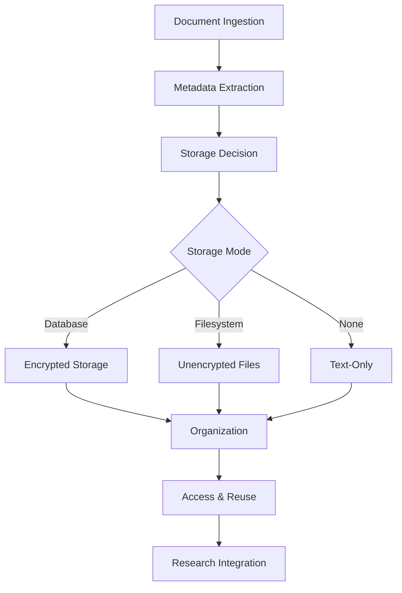
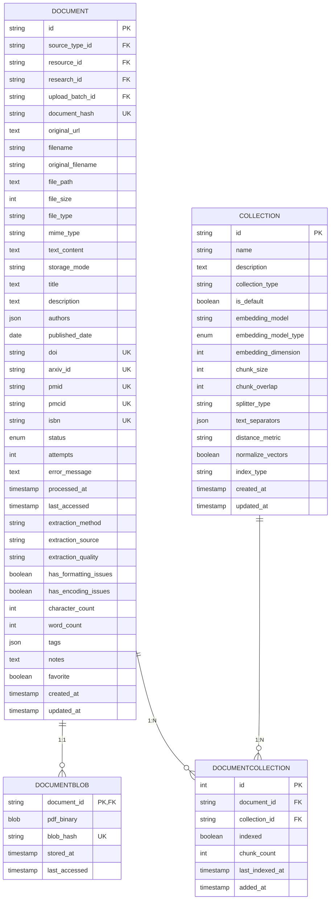
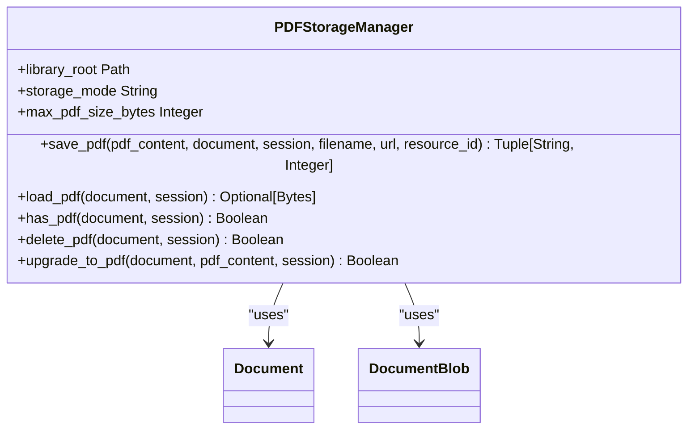
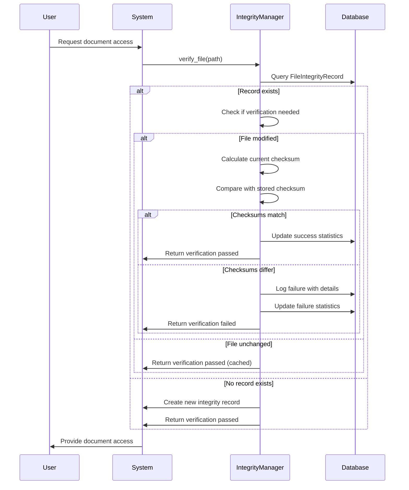
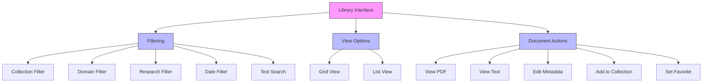
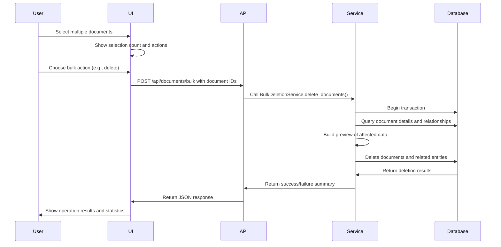

# Document Management System

<cite>
**Referenced Files in This Document**   
- [library.py](file://src/local_deep_research/database/models/library.py)
- [pdf_storage_manager.py](file://src/local_deep_research/research_library/services/pdf_storage_manager.py)
- [download_service.py](file://src/local_deep_research/research_library/services/download_service.py)
- [library_routes.py](file://src/local_deep_research/research_library/routes/library_routes.py)
- [delete_routes.py](file://src/local_deep_research/research_library/deletion/routes/delete_routes.py)
- [integrity_manager.py](file://src/local_deep_research/security/file_integrity/integrity_manager.py)
- [library.html](file://src/local_deep_research/web/templates/pages/library.html)
- [storage_mode_modal.html](file://src/local_deep_research/web/templates/components/storage_mode_modal.html)
</cite>

## Table of Contents
1. [Introduction](#introduction)
2. [Document Lifecycle](#document-lifecycle)
3. [Database Schema](#database-schema)
4. [Storage Options](#storage-options)
5. [Metadata Extraction](#metadata-extraction)
6. [File Integrity Verification](#file-integrity-verification)
7. [User Interface](#user-interface)
8. [Bulk Operations](#bulk-operations)
9. [Research Integration](#research-integration)
10. [Conclusion](#conclusion)

## Introduction

The Document Management System provides comprehensive functionality for managing research documents throughout their lifecycle. The system handles document ingestion from various academic sources, organization through collections and metadata, and integration with the research process. Documents are stored with configurable options for security and accessibility, and can be easily accessed and reused in subsequent research queries.

**Section sources**
- [library.py](file://src/local_deep_research/database/models/library.py#L1-L888)

## Document Lifecycle

The document lifecycle begins with ingestion through the research process, where documents are downloaded from academic sources like arXiv, PubMed, and Semantic Scholar. During download, metadata is automatically extracted and stored alongside the document content. The system supports both PDF and text-only storage modes, allowing users to balance between preserving original formatting and minimizing storage requirements.

Once ingested, documents are organized into collections, with a default "Library" collection for research downloads and support for user-created collections. Documents can be tagged, favorited, and annotated with user notes for enhanced organization. The system tracks document status throughout its lifecycle, including pending, processing, completed, and failed states.

Documents can be accessed through various interfaces, including direct PDF viewing, text content extraction, and integration with the research process as context for new queries. The system supports bulk operations for managing multiple documents simultaneously, including deletion, export, and organization.

**Diagram sources**
- [library.py](file://src/local_deep_research/database/models/library.py#L163-L888)
- [download_service.py](file://src/local_deep_research/research_library/services/download_service.py#L62-L1580)

## Database Schema

The document management system uses a unified database schema to store all document types, whether from research downloads or user uploads. The core entities are Document, DocumentBlob, and Collection, with relationships that support flexible organization and retrieval.

The Document entity stores metadata, text content, and file information, with fields for title, authors, publication date, academic identifiers (DOI, arXiv ID, PMID), and download status. Text content is always stored in the database, while PDF content is managed separately in the DocumentBlob table for performance optimization.

The DocumentBlob entity stores PDF binary content in an encrypted SQLCipher database, with a SHA256 hash for integrity verification. This separation follows SQLite best practices by keeping BLOBs in a separate table to maintain query performance on the main Document table.

Collections provide organizational structure, with a many-to-many relationship between documents and collections through the DocumentCollection junction table. This allows documents to belong to multiple collections simultaneously, supporting flexible organization strategies.

**Diagram sources**
- [library.py](file://src/local_deep_research/database/models/library.py#L163-L888)

## Storage Options

The document management system provides three configurable storage options through the STORAGE_MODE setting: database, filesystem, and none. Each option offers different trade-offs between security, portability, and external accessibility.

The database storage mode encrypts PDFs using SQLCipher and stores them directly in the database. This provides maximum security and portability, as all data is contained within a single encrypted file. However, it increases the database size and may impact performance with large collections.

The filesystem storage mode saves PDFs as unencrypted files on the local filesystem in a structured directory. This allows external tools to access the files directly and provides better performance for large files. However, it reduces security and makes the system dependent on the filesystem structure.

The none storage mode stores only text content in the database, extracting text from PDFs during download but discarding the original files. This minimizes storage requirements and focuses on content rather than formatting, but loses the ability to view original documents.

Users can configure the storage mode through the settings interface, with the system providing recommendations based on their use case. The PDFStorageManager class handles the logic for saving and retrieving PDFs according to the configured mode.

**Diagram sources**
- [pdf_storage_manager.py](file://src/local_deep_research/research_library/services/pdf_storage_manager.py#L24-L426)
- [library.py](file://src/local_deep_research/database/models/library.py#L163-L888)

## Metadata Extraction

During document download, the system automatically extracts metadata from academic sources using source-specific downloaders. For arXiv papers, metadata includes title, authors, abstract, publication date, and arXiv identifier. For PubMed articles, the system extracts MEDLINE metadata including journal information, publication date, and MeSH terms.

Text content is extracted from PDFs using multiple methods, with pdfplumber as the primary extraction engine. The system attempts to preserve document structure and formatting during extraction, storing information about formatting and encoding issues. Extraction quality is rated as high, medium, or low based on the success of text extraction and preservation of document structure.

Academic identifiers are automatically parsed and stored in dedicated fields, enabling advanced search and organization capabilities. DOIs are resolved to metadata through CrossRef, while arXiv and PubMed IDs are used to construct canonical URLs and enable direct linking to source repositories.

The system also extracts domain information from URLs, categorizing documents by source (arXiv, PubMed, Semantic Scholar, etc.). This enables filtering and organization by academic domain, supporting research in specific fields.

**Section sources**
- [download_service.py](file://src/local_deep_research/research_library/services/download_service.py#L62-L1580)
- [library.py](file://src/local_deep_research/database/models/library.py#L163-L888)

## File Integrity Verification

The system implements a comprehensive file integrity verification system to ensure document reliability and detect corruption or tampering. The FileIntegrityManager monitors files using checksums (SHA256) and modification timestamps, verifying integrity only when files have changed to minimize performance overhead.

Verification failures are logged in an audit trail with detailed information about the discrepancy, including expected and actual checksums, file size, and failure reason. The system maintains statistics on verification success rates and consecutive failures, providing insights into file stability.

The integrity system supports multiple file types through a pluggable verifier architecture. Currently, FAISS index files are verified with type-specific logic, but the system can be extended to support additional file types. Verification records include relationships to related entities, enabling traceability of file integrity to specific research sessions or collections.

The system automatically cleans up old failure records to prevent unbounded growth, maintaining a configurable number of recent failures per file and a global limit across all files. This ensures the audit trail remains useful without consuming excessive storage.

**Diagram sources**
- [integrity_manager.py](file://src/local_deep_research/security/file_integrity/integrity_manager.py#L29-L598)
- [library.py](file://src/local_deep_research/database/models/file_integrity.py#L1-L127)

## User Interface

The document management interface provides a comprehensive view of the library with filtering, sorting, and organization capabilities. Users can filter documents by collection, domain, research session, and date, with search functionality across titles, authors, and DOIs.

The interface displays documents in a grid or list view, showing metadata, source domain, download status, and storage indicators. Badges highlight document types (arXiv, PubMed) and status (favorites, indexing progress). Users can toggle between viewing PDFs and extracted text content.

Collection management is integrated into the interface, allowing users to create, rename, and delete collections. Documents can be added to or removed from collections through drag-and-drop or selection interfaces. The default Library collection is automatically populated with research downloads.

Domain-based filtering enables users to focus on specific academic sources, with dedicated filters for arXiv, PubMed, and other domains. Research-based filtering shows documents grouped by their originating research query, supporting contextual exploration of related work.

**Diagram sources**
- [library.html](file://src/local_deep_research/web/templates/pages/library.html#L84-L1369)
- [library_routes.py](file://src/local_deep_research/research_library/routes/library_routes.py#L194-L800)

## Bulk Operations

The system supports bulk operations for efficient management of multiple documents. Users can select documents through checkboxes and perform actions like deletion, export, and organization. The bulk deletion service provides a preview of affected documents and associated data before confirmation.

Bulk operations are implemented through dedicated API endpoints that process document IDs in batches. The system returns detailed results including the number of successfully processed documents, failures, and any error messages. This enables users to understand the outcome of bulk operations and address any issues.

Document selection supports various filtering criteria, allowing users to target specific subsets of their library. For example, users can select all documents from a particular research session, domain, or collection. The interface provides visual feedback on the number of selected documents and the actions available.

The bulk deletion preview shows the impact of deletion on associated data, including PDF blobs, RAG index chunks, and download history. This helps users understand the consequences of their actions and prevent accidental data loss.

**Diagram sources**
- [delete_routes.py](file://src/local_deep_research/research_library/deletion/routes/delete_routes.py#L234-L413)
- [bulk_deletion.py](file://src/local_deep_research/research_library/deletion/services/bulk_deletion.py#L1-L52)

## Research Integration

The document management system integrates closely with the research process, allowing previously downloaded documents to be reused as context in new research queries. When conducting follow-up research, the system automatically includes relevant documents from previous sessions based on domain, topic, and content similarity.

The contextual follow-up strategy uses document metadata and extracted text to build a comprehensive context for the research query. This includes past findings, source links, and key entities, enabling the LLM to provide more accurate and relevant responses without requiring redundant downloads.

Documents can be manually selected as context for new research queries, allowing users to guide the research process with specific sources. The system tracks the provenance of information, showing which documents contributed to specific findings in the research report.

The integration supports both automated and manual context inclusion, giving users control over how previous work informs new research. This creates a cumulative knowledge base that grows with each research session, increasing efficiency and depth of analysis over time.

**Section sources**
- [followup_context_manager.py](file://src/local_deep_research/advanced_search_system/knowledge/followup_context_manager.py#L40-L72)
- [enhanced_contextual_followup.py](file://src/local_deep_research/advanced_search_system/strategies/followup/enhanced_contextual_followup.py#L138-L172)

## Conclusion

The Document Management System provides a comprehensive solution for managing research documents throughout their lifecycle. By integrating ingestion, organization, storage, and research reuse, the system creates a cohesive workflow that enhances research efficiency and knowledge retention. The flexible storage options, robust metadata extraction, and integrity verification ensure documents are both accessible and reliable. Through its integration with the research process, the system transforms individual documents into a cumulative knowledge base that supports increasingly sophisticated inquiry.