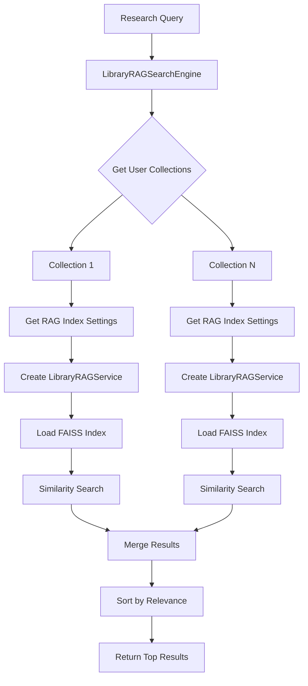
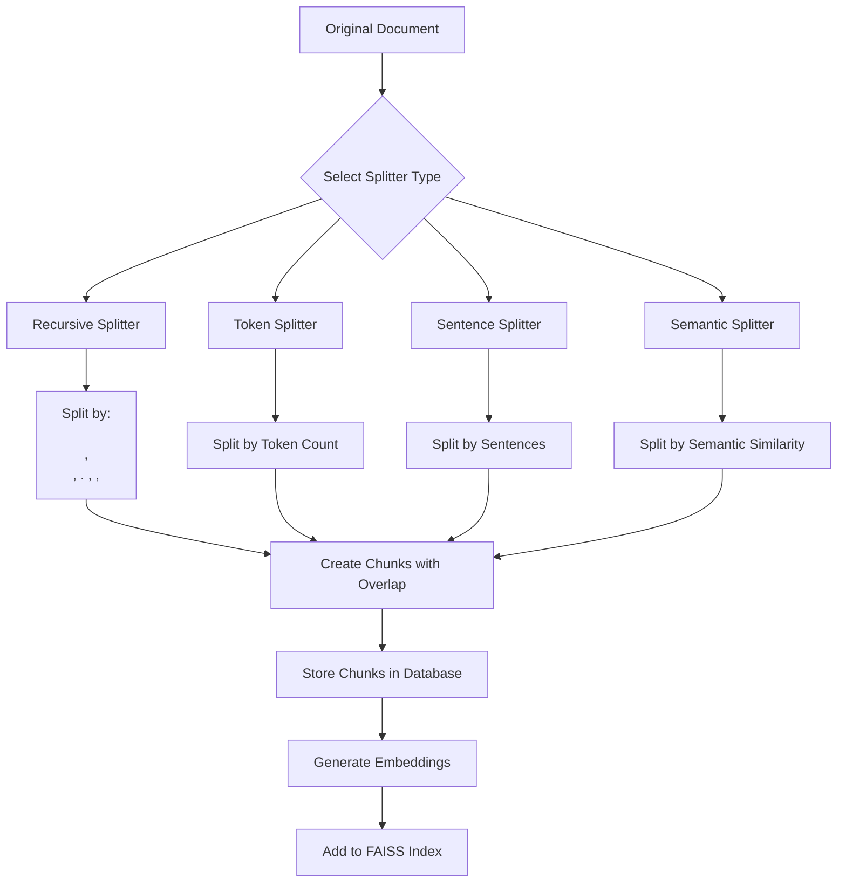
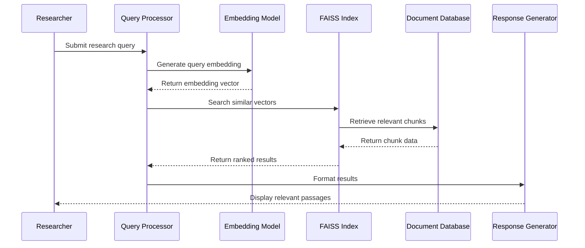

# RAG Capabilities and Context Utilization

<cite>
**Referenced Files in This Document**   
- [library_rag_service.py](file://src/local_deep_research/research_library/services/library_rag_service.py)
- [search_engine_library.py](file://src/local_deep_research/web_search_engines/engines/search_engine_library.py)
- [text_splitter_registry.py](file://src/local_deep_research/embeddings/splitters/text_splitter_registry.py)
- [search_engine_local.py](file://src/local_deep_research/web_search_engines/engines/search_engine_local.py)
- [library.py](file://src/local_deep_research/database/models/library.py)
</cite>

## Table of Contents
1. [Introduction](#introduction)
2. [Library RAG Service Implementation](#library-rag-service-implementation)
3. [Integration with Main Search System](#integration-with-main-search-system)
4. [Document Selection for Context Sources](#document-selection-for-context-sources)
5. [Chunking Strategy for Long Documents](#chunking-strategy-for-long-documents)
6. [Embedding and Retrieval Mechanism](#embedding-and-retrieval-mechanism)
7. [Research Scenarios Benefiting from Library RAG](#research-scenarios-benefiting-from-library-rag)
8. [UI Controls for Library Context](#ui-controls-for-library-context)
9. [Performance Considerations](#performance-considerations)
10. [Best Practices for Optimal Results](#best-practices-for-optimal-results)

## Introduction
The Retrieval-Augmented Generation (RAG) capabilities in this research system enable users to leverage their personal research library as a knowledge base for new research inquiries. By integrating proprietary documents, previous research outputs, and curated collections into the analysis process, the system enhances the depth and relevance of generated insights. This documentation details the implementation of the library_rag_service, its integration with the main search system, and the mechanisms for selecting, chunking, embedding, and retrieving relevant passages from library documents. The RAG system supports various research scenarios, from follow-up investigations on previous topics to incorporating specialized domain knowledge into current analyses.

## Library RAG Service Implementation

The LibraryRAGService class provides comprehensive functionality for managing RAG indexing of library documents. It handles text document indexing into a vector database, document chunking for semantic search, embedding generation using local models, FAISS index management per research collection, and RAG status tracking within the library.

The service is initialized with configuration parameters including the embedding model (default: "all-MiniLM-L6-v2"), embedding provider ("sentence_transformers" or "ollama"), chunk size (default: 1000), chunk overlap (default: 200), splitter type ("recursive", "token", "sentence", or "semantic"), and distance metric ("cosine", "l2", or "dot_product"). During initialization, it creates a LocalEmbeddingManager instance and configures a text splitter based on the specified type.

Key methods include:
- `index_document()`: Indexes a single document into RAG for a specific collection
- `index_all_documents()`: Indexes all documents in a collection into RAG
- `remove_document_from_rag()`: Removes a document from RAG indexing
- `get_rag_stats()`: Retrieves statistics about indexed documents
- `get_current_index_info()`: Gets information about the current RAG index

The service manages FAISS indices stored in the user's cache directory under `.cache/local_deep_research/rag_indices/`. Each index is identified by a hash generated from the collection name, embedding model, and embedding model type. The service handles index creation, loading, and integrity verification, including automatic recreation of indices when embedding dimensions change.

**Section sources**
- [library_rag_service.py](file://src/local_deep_research/research_library/services/library_rag_service.py#L40-L800)

## Integration with Main Search System

The library RAG functionality is integrated into the main search system through the LibraryRAGSearchEngine class, which extends the BaseSearchEngine. This integration enables seamless semantic search across the user's research library alongside other search sources.

The LibraryRAGSearchEngine initializes with parameters including the LLM for relevance filtering, maximum results, and settings snapshot. It extracts configuration from the settings snapshot, including the embedding model, embedding provider, chunk size, and chunk overlap. The search engine is marked as local (is_local = True), indicating it operates on locally stored documents rather than external sources.

The search process involves:
1. Retrieving all collections for the user through the LibraryService
2. For each collection, loading the corresponding RAG index to obtain embedding settings
3. Creating a LibraryRAGService instance with the collection's specific embedding configuration
4. Loading the FAISS index for the collection
5. Performing similarity search on the index
6. Merging and sorting results across all collections

The search method returns results in a standardized format with title, snippet, URL, source identifier, and relevance score. The engine also implements preview and full content retrieval methods, with the latter fetching complete document text when available.

**Diagram sources **
- [search_engine_library.py](file://src/local_deep_research/web_search_engines/engines/search_engine_library.py#L20-L357)
- [library_rag_service.py](file://src/local_deep_research/research_library/services/library_rag_service.py#L40-L800)

**Section sources**
- [search_engine_library.py](file://src/local_deep_research/web_search_engines/engines/search_engine_library.py#L20-L357)

## Document Selection for Context Sources

Users can select specific documents or collections from their research library as context sources for research queries. The system organizes documents into collections, with a default "Library" collection containing all documents. Users can create additional collections to group related documents for specific research domains or projects.

The selection process occurs through the library interface, where users can:
- Browse all collections and their document counts
- View individual documents with metadata including title, authors, publication date, and availability status
- Filter documents by research session, domain, file type, or favorites
- Search across documents using keywords

When a document is selected for RAG indexing, it must have text content available in the database. Documents are automatically processed to extract text content during download, with various extraction methods depending on the document type (PDF, HTML, etc.). The system tracks indexing status at both the document and collection levels, allowing users to see which documents have been indexed and how many chunks were created.

Collections can be indexed individually or as a group. The indexing process is managed through the LibraryRAGService, which handles the creation of document chunks and their storage in both the database and FAISS vector index. Users can force re-indexing of documents when content updates require refreshed embeddings.

**Section sources**
- [library_rag_service.py](file://src/local_deep_research/research_library/services/library_rag_service.py#L468-L744)
- [library_service.py](file://src/local_deep_research/research_library/services/library_service.py#L196-L389)

## Chunking Strategy for Long Documents

The system implements a flexible chunking strategy for processing long documents into smaller segments suitable for semantic search and retrieval. The chunking approach is configurable and supports multiple splitting methods through the text splitter registry.

The available splitter types include:
- **Recursive**: Splits text by iterating over separators like paragraphs, sentences, and words
- **Token**: Splits text based on token count, useful for LLM context limits
- **Sentence**: Splits text into sentences using sentence transformers
- **Semantic**: Uses embeddings to identify natural breakpoints in text

The default configuration uses a chunk size of 1000 characters with an overlap of 200 characters. The overlap helps preserve context between chunks, ensuring that relevant information spanning chunk boundaries is not lost. For the recursive splitter, the system uses a hierarchy of separators: ["\n\n", "\n", ". ", " ", ""].

The chunking process is implemented in the text_splitter_registry module, which provides a factory function to create the appropriate splitter based on configuration. When using semantic chunking, the system requires an embeddings instance to calculate similarity between text segments and identify optimal breakpoints.

During indexing, documents are split into chunks that are stored in the DocumentChunk database table. Each chunk includes metadata such as the source document ID, collection name, chunk index, character positions, word count, and document title. The system prevents duplication by using SHA-256 hashes of chunk text for deduplication.

**Diagram sources **
- [text_splitter_registry.py](file://src/local_deep_research/embeddings/splitters/text_splitter_registry.py#L26-L139)
- [library_rag_service.py](file://src/local_deep_research/research_library/services/library_rag_service.py#L136-L146)

**Section sources**
- [text_splitter_registry.py](file://src/local_deep_research/embeddings/splitters/text_splitter_registry.py#L26-L139)

## Embedding and Retrieval Mechanism

The system uses a robust embedding and retrieval mechanism to enable semantic search across the research library. The process involves generating vector embeddings for document chunks and storing them in a FAISS (Facebook AI Similarity Search) index for efficient similarity search.

Embeddings are generated using configurable models and providers. The default configuration uses the "all-MiniLM-L6-v2" model from the sentence-transformers library, but users can configure alternative models or use Ollama as the embedding provider. The embedding process converts text chunks into high-dimensional vectors that capture semantic meaning, allowing for similarity-based retrieval.

The retrieval workflow follows these steps:
1. A research query is converted into an embedding vector using the same model that processed the documents
2. The system searches the FAISS index for vectors similar to the query vector
3. Similarity is calculated using the configured distance metric (cosine, L2, or dot product)
4. Results are ranked by similarity score and returned as relevant passages

The FAISS index supports different index types for performance optimization:
- **Flat**: Exact search with linear time complexity
- **HNSW**: Hierarchical Navigable Small World graph for approximate nearest neighbor search
- **IVF**: Inverted File Index for large-scale search (not fully implemented)

The system stores embeddings in multiple locations for redundancy and performance:
- FAISS index files on disk for fast similarity search
- DocumentChunk database table for persistent storage and metadata
- In-memory docstore for temporary operations

When searching, the system queries all collections with indexed documents, retrieves results from each collection's FAISS index, merges the results, and returns the top matches sorted by relevance. The relevance score is converted from distance to similarity (1/(1+distance)) for intuitive interpretation.

**Diagram sources **
- [library_rag_service.py](file://src/local_deep_research/research_library/services/library_rag_service.py#L245-L395)
- [search_engine_library.py](file://src/local_deep_research/web_search_engines/engines/search_engine_library.py#L169-L178)

**Section sources**
- [library_rag_service.py](file://src/local_deep_research/research_library/services/library_rag_service.py#L245-L395)
- [search_engine_library.py](file://src/local_deep_research/web_search_engines/engines/search_engine_library.py#L169-L178)

## Research Scenarios Benefiting from Library RAG

The library RAG capabilities enable several valuable research scenarios that leverage existing knowledge to enhance new investigations:

**Follow-up Research on Previous Topics**: When conducting follow-up research on a previously explored topic, users can activate their relevant collections as context sources. This allows the system to incorporate findings, references, and insights from prior research into the new analysis. For example, a researcher studying climate change impacts can activate their "Climate Studies 2023" collection to ensure continuity with previous work, avoiding redundant information gathering and building upon established knowledge.

**Incorporating Proprietary Documents**: Organizations can integrate internal reports, technical documentation, or confidential research into their analysis without exposing sensitive information to external LLMs. By indexing proprietary documents in a private collection, users can query this specialized knowledge base alongside public information, creating comprehensive analyses that combine internal expertise with external data.

**Cross-Domain Synthesis**: Researchers can create collections that aggregate knowledge from multiple domains to facilitate interdisciplinary analysis. For instance, a medical researcher studying the socioeconomic factors affecting healthcare outcomes could create a collection combining medical literature with economic reports and demographic studies. The RAG system can then identify connections across these domains that might not be apparent through traditional search methods.

**Literature Review Acceleration**: When conducting literature reviews, users can index relevant papers into a dedicated collection. The semantic search capabilities allow for more effective exploration of the literature, finding papers that are conceptually related even if they don't share specific keywords. This helps identify seminal works, track research evolution, and discover connections between different research threads.

**Knowledge Preservation and Transfer**: The system enables institutional knowledge preservation by allowing experienced researchers to curate collections of important findings, methodologies, and resources. These collections can then be used by new team members to quickly get up to speed, ensuring continuity and reducing onboarding time.

**Section sources**
- [library_rag_service.py](file://src/local_deep_research/research_library/services/library_rag_service.py#L468-L744)
- [search_engine_library.py](file://src/local_deep_research/web_search_engines/engines/search_engine_library.py#L83-L357)

## UI Controls for Library Context

The user interface provides intuitive controls for enabling library context and selecting specific documents or collections for research queries. These controls are integrated into the research workflow, allowing users to manage their knowledge base effectively.

Key UI components include:
- **Collection Management Interface**: A panel that displays all available collections with their document counts and indexing status. Users can create new collections, rename existing ones, or delete collections they no longer need.
- **Document Browser**: A searchable interface for exploring documents within collections, showing metadata such as title, authors, publication date, and availability status. Users can filter documents by various criteria and sort them by different attributes.
- **Context Activation Toggle**: A switch that enables or disables the use of library context for research queries. When activated, the system includes the selected collections in the search process.
- **Collection Selection Menu**: A multi-select dropdown or checklist that allows users to choose which collections should be used as context sources for the current research query.
- **Indexing Status Indicators**: Visual indicators showing whether documents have been indexed for RAG search, along with the number of chunks created. This helps users understand which documents are available for semantic search.
- **Bulk Operations**: Controls for indexing all documents in a collection, re-indexing updated documents, or removing documents from the RAG index.

The interface also provides feedback on the RAG process, including progress indicators during indexing operations and notifications when indexing is complete. Users can monitor the status of their collections and understand the scope of their searchable knowledge base.

**Section sources**
- [library_service.py](file://src/local_deep_research/research_library/services/library_service.py#L390-L428)
- [library_rag_service.py](file://src/local_deep_research/research_library/services/library_rag_service.py#L745-L800)

## Performance Considerations

Using large document sets as context presents several performance considerations that affect both indexing and retrieval operations:

**Indexing Performance**: The initial indexing of large collections can be time-consuming, as each document must be processed, chunked, and embedded. The system uses background processing to avoid blocking the main application, but users should expect delays when indexing substantial amounts of content. Performance scales with the number of documents, their size, and the chosen chunking parameters.

**Memory Usage**: FAISS indexes and embedding models require significant memory resources. The system stores indexes in memory during active search sessions, which can consume substantial RAM for large collections. Users with limited system resources may need to limit the size of their indexed collections or use approximate search methods.

**Storage Requirements**: Indexed documents consume additional storage space beyond the original files. Each chunk is stored in the database with metadata, and FAISS index files are created on disk. The storage overhead depends on the chunk size, overlap, and number of documents.

**Search Latency**: Retrieval performance depends on the size of the indexed corpus and the search method used. Exact search (Flat index) provides precise results but has linear time complexity, while approximate methods (HNSW) offer faster search at the cost of some accuracy. Users should balance search speed with result quality based on their needs.

**Model Loading**: Embedding models can be large and take time to load into memory. The system uses lazy initialization to load models only when needed, but the first search operation after startup may experience delays due to model loading.

**Optimization Strategies**:
- Use smaller chunk sizes for more granular retrieval but balance against increased index size
- Adjust chunk overlap to preserve context without excessive duplication
- Select appropriate index types based on collection size and performance requirements
- Regularly clean up unused collections to reduce index size
- Monitor system resources and adjust indexing operations accordingly

**Section sources**
- [library_rag_service.py](file://src/local_deep_research/research_library/services/library_rag_service.py#L352-L384)
- [search_engine_local.py](file://src/local_deep_research/web_search_engines/engines/search_engine_local.py#L652-L663)

## Best Practices for Optimal Results

To achieve optimal results with the library RAG system, users should follow these best practices:

**Collection Organization**: Organize documents into meaningful collections based on research domains, projects, or topics. This allows for targeted context selection and improves retrieval relevance. Avoid creating excessively large collections that mix unrelated content.

**Document Quality**: Ensure documents have high-quality text content before indexing. For PDFs, verify that text extraction was successful and the content is readable. Consider preprocessing documents to remove irrelevant material like headers, footers, or navigation elements.

**Indexing Strategy**: Index documents incrementally rather than attempting to process large batches at once. This allows for better progress tracking and error recovery. Regularly update the index when adding new documents or when existing documents are modified.

**Chunking Configuration**: Select chunking parameters appropriate for your use case:
- Use smaller chunks (500-800 characters) for detailed information retrieval
- Use larger chunks (1000-2000 characters) for maintaining broader context
- Adjust overlap (10-25% of chunk size) to balance context preservation with efficiency

**Embedding Model Selection**: Choose embedding models based on your requirements:
- Use "all-MiniLM-L6-v2" for general-purpose semantic search with good performance
- Consider domain-specific models for specialized content
- Evaluate Ollama embeddings if local LLM infrastructure is available

**Search Query Formulation**: Craft specific, well-structured queries that clearly express the information need. Include relevant keywords and context to improve retrieval accuracy. Use the system's feedback to refine queries iteratively.

**Result Validation**: Always review retrieved passages in context to verify relevance and accuracy. Cross-reference information with original sources when possible, especially for critical applications.

**Resource Management**: Monitor system resources and adjust usage patterns accordingly. Consider the trade-offs between indexing comprehensiveness and system performance. Regularly review and clean up unused collections to maintain optimal performance.

**Section sources**
- [library_rag_service.py](file://src/local_deep_research/research_library/services/library_rag_service.py#L48-L55)
- [text_splitter_registry.py](file://src/local_deep_research/embeddings/splitters/text_splitter_registry.py#L27-L33)