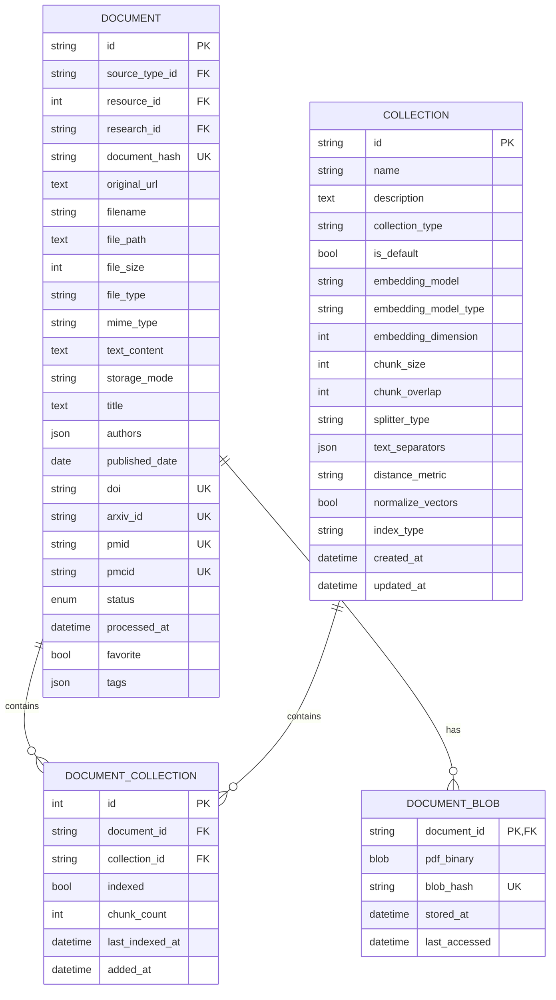
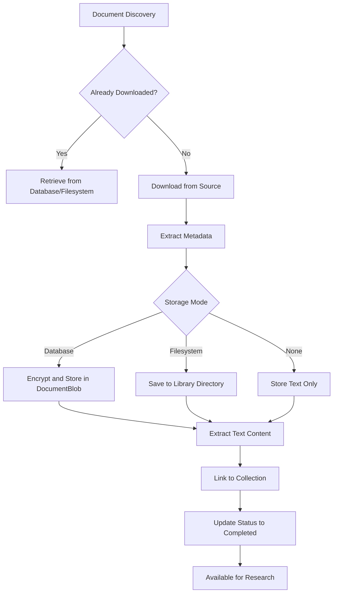
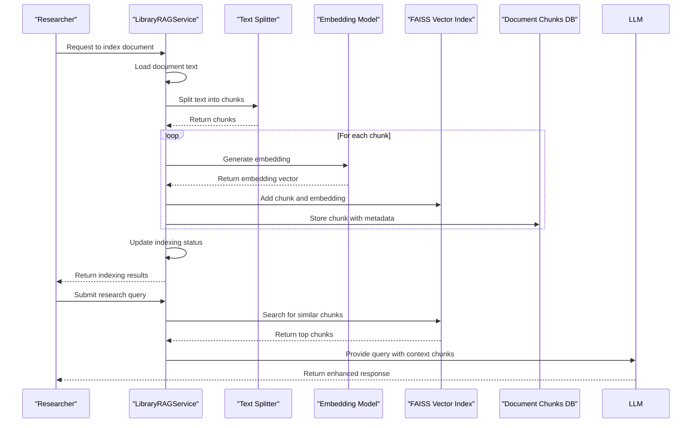
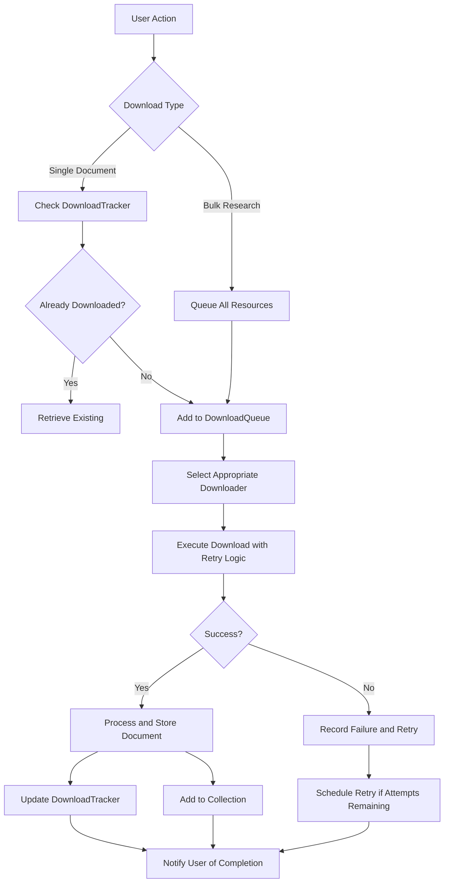
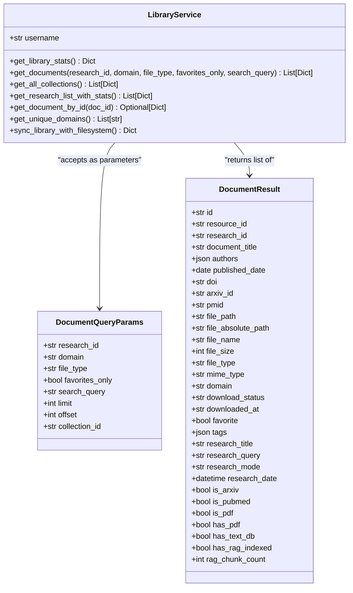
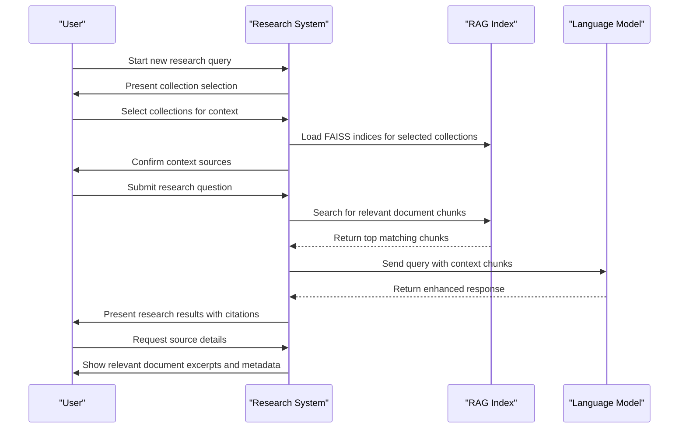

# Research Library and Document Management

<cite>
**Referenced Files in This Document**   
- [library_service.py](file://src/local_deep_research/research_library/services/library_service.py)
- [download_service.py](file://src/local_deep_research/research_library/services/download_service.py)
- [library_rag_service.py](file://src/local_deep_research/research_library/services/library_rag_service.py)
- [library_routes.py](file://src/local_deep_research/research_library/routes/library_routes.py)
- [rag_routes.py](file://src/local_deep_research/research_library/routes/rag_routes.py)
- [pdf_storage_manager.py](file://src/local_deep_research/research_library/services/pdf_storage_manager.py)
- [library.py](file://src/local_deep_research/database/models/library.py)
</cite>

## Table of Contents
1. [Introduction](#introduction)
2. [Core Entities and Architecture](#core-entities-and-architecture)
3. [Document Lifecycle Management](#document-lifecycle-management)
4. [PDF Storage and Processing](#pdf-storage-and-processing)
5. [RAG (Retrieval-Augmented Generation) Capabilities](#rag-retrieval-augmented-generation-capabilities)
6. [Collection System and Organization](#collection-system-and-organization)
7. [Download Management and Bulk Operations](#download-management-and-bulk-operations)
8. [Querying the Library](#querying-the-library)
9. [Using Library Documents in Research](#using-library-documents-in-research)

## Introduction
The Research Library feature provides a comprehensive system for managing academic documents, enabling researchers to download, store, organize, and utilize research papers and other documents. This system supports advanced document management through a unified architecture that handles both automatically downloaded research resources and user-uploaded files. The library integrates Retrieval-Augmented Generation (RAG) capabilities, allowing users to leverage their document collection as contextual knowledge for new research queries. Documents can be organized into collections (similar to folders), shared for collaborative research, and processed through various storage options including database, filesystem, or text-only modes. The system provides a complete lifecycle from document discovery and download through metadata extraction, storage, and utilization in subsequent research activities.

## Core Entities and Architecture

The research library architecture is built around three core entities: **Document**, **Collection**, and **DocumentBlob**, which work together to provide a flexible and secure document management system.

The **Document** entity serves as the central model for all documents in the system, unifying both research downloads and user uploads into a single table. Each document contains comprehensive metadata including title, authors, publication date, and academic identifiers (DOI, arXiv ID, PMID, etc.). The document model also tracks file information such as file size, type, and storage mode, along with processing status and timestamps. Documents are linked to their source research sessions and can be associated with multiple collections.

The **Collection** entity provides organizational structure, functioning as a folder-like container for documents. Every user has a default "Library" collection where research downloads are automatically placed, but users can create additional custom collections for specialized organization. Collections support advanced configuration for RAG indexing, including embedding model selection, chunking parameters, and similarity search settings. This allows different collections to be optimized for specific research domains or use cases.

The **DocumentBlob** entity handles secure storage of PDF binary content in a separate table from the main document metadata. This separation follows database best practices, improving query performance on the primary document table. PDF blobs are stored in an encrypted SQLCipher database, ensuring document security while allowing efficient retrieval when needed.

These entities are connected through well-defined relationships. The many-to-many **DocumentCollection** relationship allows documents to belong to multiple collections simultaneously, enabling flexible organization and cross-collection analysis. Documents are also linked to their source research sessions through the **ResearchHistory** entity, preserving the context of how each document was discovered.



**Diagram sources**
- [library.py](file://src/local_deep_research/database/models/library.py#L163-L800)

**Section sources**
- [library.py](file://src/local_deep_research/database/models/library.py#L163-L800)

## Document Lifecycle Management

The document lifecycle in the research library spans from initial discovery through download, storage, metadata extraction, and final organization. This process ensures that documents are properly managed and made available for research use.

The lifecycle begins with **document discovery** during a research session, where the system identifies relevant resources from various academic sources. When a user initiates a download, the **DownloadService** manages the process, first checking if the document has already been downloaded by verifying the URL hash against the **DownloadTracker**. This deduplication mechanism prevents redundant downloads and conserves bandwidth.

Once a download is initiated, the system retrieves the document content, typically a PDF file from academic sources like arXiv, PubMed, or Semantic Scholar. The **DownloadService** employs specialized downloaders for different sources, each optimized for the specific API or website structure. After successful retrieval, the document metadata is extracted and stored in the **Document** table, including title, authors, publication date, and academic identifiers.

The **PDFStorageManager** then handles the storage decision based on the configured storage mode. For "database" mode, the PDF binary is encrypted and stored in the **DocumentBlob** table. For "filesystem" mode, the PDF is saved to a designated directory with a generated filename. In "none" mode, only the extracted text content is retained, conserving storage space.

Following storage, the system automatically extracts text from the PDF using libraries like pdfplumber or PyPDF2. This text content is stored in the **Document.text_content** field and can be used for search and RAG indexing. The extraction process also calculates metadata such as word count and character count, which are stored with the document.

Finally, the document is linked to the appropriate collection, typically the default "Library" collection, through the **DocumentCollection** relationship. The document status is updated to "completed," making it available for browsing and use in subsequent research. Throughout this lifecycle, the system maintains comprehensive logging and error handling to ensure reliability and provide diagnostic information when issues occur.



**Section sources**
- [download_service.py](file://src/local_deep_research/research_library/services/download_service.py#L62-L720)
- [pdf_storage_manager.py](file://src/local_deep_research/research_library/services/pdf_storage_manager.py#L24-L369)
- [library_service.py](file://src/local_deep_research/research_library/services/library_service.py#L36-L800)

## PDF Storage and Processing

The research library provides flexible PDF storage options through the **PDFStorageManager**, allowing users to configure how PDF files are stored based on their security, performance, and accessibility requirements. Three storage modes are supported: database, filesystem, and none.

In **database mode**, PDF files are stored encrypted within the SQLCipher database in the **DocumentBlob** table. This approach provides maximum security and portability, as all document data is contained within a single encrypted database file. The PDF binary is stored as a BLOB (Binary Large Object) with integrity verification through SHA256 hashing. This mode is ideal for users who prioritize data security and need to access their library across different devices, as the entire library can be backed up and restored as a single file.

The **filesystem mode** stores PDF files unencrypted on the local filesystem in a designated library directory. This approach offers better performance for large libraries and allows external tools to access the PDF files directly. Files are organized in a flat structure within a "pdfs" subdirectory, with filenames generated from document metadata or source URLs. This mode is suitable for users who need to integrate with other document management tools or who have large collections where database performance might become a bottleneck.

The **none mode** does not store PDF files at all, retaining only the extracted text content in the database. This mode conserves the most storage space and is appropriate for users who only need the textual content of documents for analysis and search. Text extraction occurs during the download process using libraries like pdfplumber for complex layouts or PyPDF2 as a fallback.

The **PDFStorageManager** provides a unified interface for all storage operations, abstracting the underlying storage mechanism. When saving a PDF, it checks the configured storage mode and routes the content accordingly. For database storage, it creates or updates a **DocumentBlob** record. For filesystem storage, it writes the file to the appropriate directory with security verification. The manager also enforces a maximum file size limit (configurable via settings) to prevent excessively large files from consuming storage.

PDF retrieval is handled intelligently by checking both database and filesystem locations. The system first attempts to load from the database, falling back to the filesystem if no blob is found. This hybrid approach ensures compatibility with documents stored under different configurations. The manager also provides methods to check PDF availability without loading the entire file, improving performance for library browsing operations.

```mermaid
classDiagram
class PDFStorageManager {
+Path library_root
+str storage_mode
+int max_pdf_size_bytes
+save_pdf(pdf_content, document, session, filename) Tuple[str, int]
+load_pdf(document, session) Optional[bytes]
+has_pdf(document, session) bool
+delete_pdf(document, session) bool
+upgrade_to_pdf(document, pdf_content, session) bool
}
class Document {
+str id
+str storage_mode
+str file_path
+int file_size
+str file_type
+str mime_type
}
class DocumentBlob {
+str document_id
+bytes pdf_binary
+str blob_hash
+datetime stored_at
+datetime last_accessed
}
PDFStorageManager --> Document : "uses for metadata"
PDFStorageManager --> DocumentBlob : "reads/writes binary content"
PDFStorageManager ..> "database session" : "requires for operations"
```

**Diagram sources**
- [pdf_storage_manager.py](file://src/local_deep_research/research_library/services/pdf_storage_manager.py#L24-L369)
- [library.py](file://src/local_deep_research/database/models/library.py#L163-L800)

**Section sources**
- [pdf_storage_manager.py](file://src/local_deep_research/research_library/services/pdf_storage_manager.py#L24-L369)

## RAG (Retrieval-Augmented Generation) Capabilities

The research library's RAG (Retrieval-Augmented Generation) capabilities enable users to leverage their document collection as contextual knowledge for new research queries. This system indexes document text into vector databases, allowing semantic search and context provision for language models.

The **LibraryRAGService** manages the RAG indexing process, creating FAISS vector indices for each collection. When a document is indexed, its text content is split into chunks using configurable parameters such as chunk size, overlap, and text separators. The default recursive text splitter divides content at natural boundaries like paragraph breaks, but semantic splitting is also supported for more context-aware chunking.

Each collection maintains its own RAG index configuration, allowing different embedding models and parameters to be used for different research domains. Supported embedding providers include Sentence Transformers (local), Ollama (local), and OpenAI API. The system tracks index configuration in the **RAGIndex** table, including the embedding model, dimension, chunking parameters, and similarity search settings such as distance metric (cosine, L2, or dot product) and vector normalization.

The indexing process creates **DocumentChunk** records in the database, storing the text chunks along with metadata like word count, character positions, and source document information. These chunks are also added to the FAISS index with unique identifiers, enabling efficient similarity search. The system maintains a **RagDocumentStatus** table to track which documents have been indexed for each collection, allowing for incremental updates and reindexing when configurations change.

When conducting research with RAG context, the system searches the appropriate collection's index for chunks semantically similar to the query. These relevant chunks are then provided as context to the language model, enhancing its responses with information from the user's library. The search process supports configurable parameters like the number of results and similarity threshold, allowing users to balance comprehensiveness with relevance.

The RAG system also provides bulk indexing operations with progress tracking through Server-Sent Events, allowing users to monitor the indexing of large collections. Index health is verified through file integrity checks, and the system handles embedding dimension mismatches by automatically rebuilding indices when models are changed.



**Diagram sources**
- [library_rag_service.py](file://src/local_deep_research/research_library/services/library_rag_service.py#L40-L800)
- [library.py](file://src/local_deep_research/database/models/library.py#L473-L547)

**Section sources**
- [library_rag_service.py](file://src/local_deep_research/research_library/services/library_rag_service.py#L40-L800)

## Collection System and Organization

The collection system provides a flexible organizational framework for managing documents within the research library. Collections function as folders that can contain multiple documents, enabling users to group related research materials for specific projects, domains, or topics.

Every user has a default "Library" collection where all research downloads are automatically placed. This collection serves as the primary repository for all acquired documents. Users can create additional custom collections through the web interface, assigning meaningful names and descriptions to organize their research. The **Collection** entity supports various collection types, including user-created collections and linked folders that index local directories.

Documents can belong to multiple collections simultaneously through the **DocumentCollection** relationship. This many-to-many association enables flexible organization, allowing a single document to be part of several research projects or thematic groups. For example, a paper on climate change impacts might belong to collections for "Environmental Science," "Climate Policy," and "Renewable Energy" simultaneously.

The collection system integrates with the RAG capabilities, allowing each collection to maintain its own indexing configuration. This means different collections can use different embedding models, chunking parameters, and similarity search settings optimized for their specific content. When conducting research, users can select which collections to use as context sources, providing fine-grained control over the knowledge base used for retrieval.

Collections also support sharing for collaborative research. While the current implementation focuses on individual user libraries, the architecture allows for future expansion to team-based research with shared collections. The system tracks collection membership and indexing status separately for each collection, ensuring that changes to one collection (like reindexing with different parameters) do not affect others.

The web interface provides comprehensive collection management, including browsing documents within a collection, viewing indexing statistics, and configuring RAG parameters. Users can filter the library view by collection, making it easy to focus on specific research areas. The system also supports bulk operations on collection contents, such as indexing all documents or exporting selected items.

```mermaid
classDiagram
class Collection {
+str id
+str name
+text description
+str collection_type
+bool is_default
+str embedding_model
+str embedding_model_type
+int embedding_dimension
+int chunk_size
+int chunk_overlap
+str splitter_type
+json text_separators
+str distance_metric
+bool normalize_vectors
+str index_type
+datetime created_at
+datetime updated_at
}
class Document {
+str id
+text title
+json authors
+date published_date
+string doi
+string arxiv_id
+string pmid
+int file_size
+str file_type
+enum status
+bool favorite
+json tags
}
class DocumentCollection {
+int id
+str document_id
+str collection_id
+bool indexed
+int chunk_count
+datetime last_indexed_at
+datetime added_at
}
Collection ||--o{ DocumentCollection : "contains"
Document ||--o{ DocumentCollection : "belongs to"
```

**Diagram sources**
- [library.py](file://src/local_deep_research/database/models/library.py#L348-L471)
- [library_service.py](file://src/local_deep_research/research_library/services/library_service.py#L36-L800)

**Section sources**
- [library.py](file://src/local_deep_research/database/models/library.py#L348-L471)

## Download Management and Bulk Operations

The download management system provides a comprehensive interface for controlling the acquisition of research documents, supporting both individual and bulk operations. This system ensures efficient and reliable document retrieval while providing users with full visibility and control over the download process.

The **DownloadService** manages the download workflow, coordinating between the user interface, download trackers, and storage systems. When a user initiates a download, the service first checks the **DownloadTracker** to determine if the document has already been downloaded, preventing redundant operations. If not already present, the URL is added to the **DownloadQueue** for processing.

The system employs specialized downloaders for different academic sources, each optimized for the specific website or API. These include dedicated downloaders for arXiv, PubMed, BioRxiv, Semantic Scholar, OpenAlex, and generic academic sites. The downloaders handle source-specific authentication, rate limiting, and content extraction, ensuring reliable retrieval from diverse sources.

For bulk operations, the system supports downloading all PDFs from a research session with a single action. This queues all downloadable resources from the session, processing them either synchronously or through background tasks. The download manager interface provides a comprehensive view of all research sessions, showing statistics like total resources, already downloaded count, and available-to-download count, helping users prioritize their download activities.

The system implements intelligent retry management through the **RetryManager**, which tracks download attempts and failures. When a download fails, the system records the error and can automatically retry with appropriate delays to respect rate limits. This improves success rates for downloads from sources with strict access controls.

Progress tracking is provided through both the web interface and API endpoints. For bulk operations, the system can stream progress updates using Server-Sent Events, showing the current status, percentage complete, and individual file results. This allows users to monitor long-running download operations and identify any failures that require attention.



**Section sources**
- [download_service.py](file://src/local_deep_research/research_library/services/download_service.py#L62-L720)
- [library_routes.py](file://src/local_deep_research/research_library/routes/library_routes.py#L1-L800)

## Querying the Library

The research library provides flexible querying capabilities that allow users to search and filter documents based on various criteria, facilitating efficient discovery and analysis of research materials. These querying features are accessible through both the web interface and API endpoints.

The primary query interface allows filtering by **research project**, enabling users to view all documents associated with a specific research session. This is particularly useful for reviewing the sources used in previous investigations or continuing work on an ongoing project. The system displays comprehensive statistics for each research session, including the total number of resources, downloaded count, and domain breakdown.

Documents can also be queried by **domain or source**, with filters for major academic platforms like arXiv, PubMed, and other scholarly sources. This allows researchers to focus on literature from specific disciplines or publishers. The system automatically categorizes documents by domain based on their source URLs, making it easy to identify papers from particular academic communities.

The **collection-based querying** system enables users to browse documents within specific organizational groups. This is valuable for managing research by topic, project, or team. Users can filter the library view to show only documents in a particular collection, making it easy to focus on specific areas of interest.

Full-text search capabilities allow users to find documents by keywords in titles, authors, DOIs, or extracted text content. This semantic search functionality helps locate relevant papers even when users don't remember specific details. The search interface supports pagination and sorting, ensuring usability even with large document collections.

The API provides programmatic access to these querying capabilities, allowing integration with external tools and automated workflows. Query parameters include research ID, domain, file type, favorites status, and search terms, with responses returning enriched document information including metadata, availability flags, and RAG indexing status.



**Diagram sources**
- [library_service.py](file://src/local_deep_research/research_library/services/library_service.py#L36-L800)
- [library_routes.py](file://src/local_deep_research/research_library/routes/library_routes.py#L1-L800)

**Section sources**
- [library_service.py](file://src/local_deep_research/research_library/services/library_service.py#L36-L800)

## Using Library Documents in Research

The research library enables seamless integration of existing documents into new research queries through its RAG (Retrieval-Augmented Generation) capabilities. This allows users to leverage their accumulated knowledge base to enhance the quality and depth of new investigations.

When initiating a research query, users can select one or more collections from their library to serve as context sources. The system indexes the text content of documents in these collections into a vector database using configurable embedding models and chunking parameters. During the research process, the system performs semantic search on this index to find document chunks most relevant to the current query.

These relevant chunks are then provided as context to the language model, enriching its responses with information from the user's library. This approach combines the broad knowledge of the LLM with the specific, curated information from the user's research collection, producing more accurate and relevant results. The system supports various similarity search configurations, allowing users to balance comprehensiveness with precision based on their needs.

For documents that have been indexed, the system provides detailed information about their RAG status, including the number of chunks, embedding model used, and indexing date. This transparency helps users understand how their documents are being utilized in the research process. Users can also reindex documents with different parameters to optimize for specific research domains or to incorporate updated content.

The integration extends to both automated research workflows and manual exploration. In automated mode, the system can use library documents as context for generating comprehensive research reports. In manual mode, researchers can browse indexed documents, view extracted text, and examine specific chunks that were retrieved for a query, providing full traceability of how library content influenced the research outcomes.



**Section sources**
- [library_rag_service.py](file://src/local_deep_research/research_library/services/library_rag_service.py#L40-L800)
- [library_service.py](file://src/local_deep_research/research_library/services/library_service.py#L36-L800)