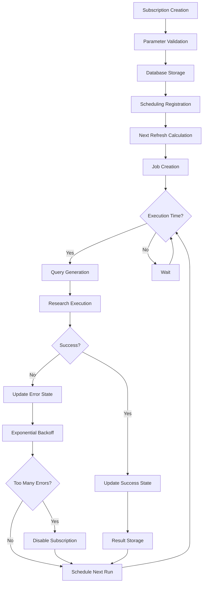
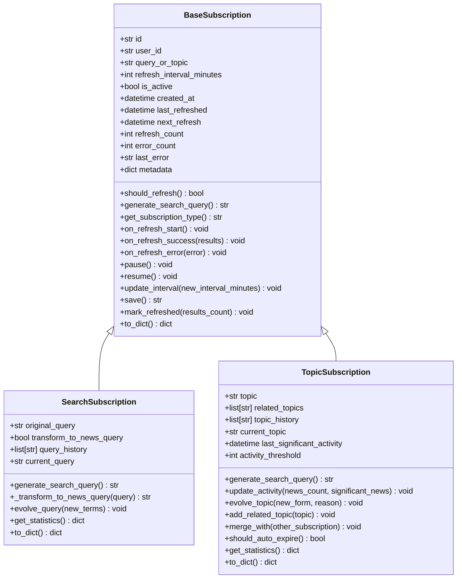
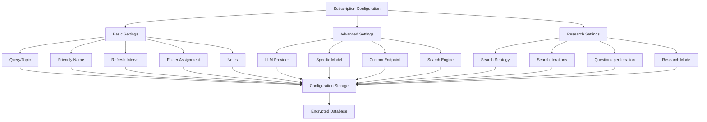
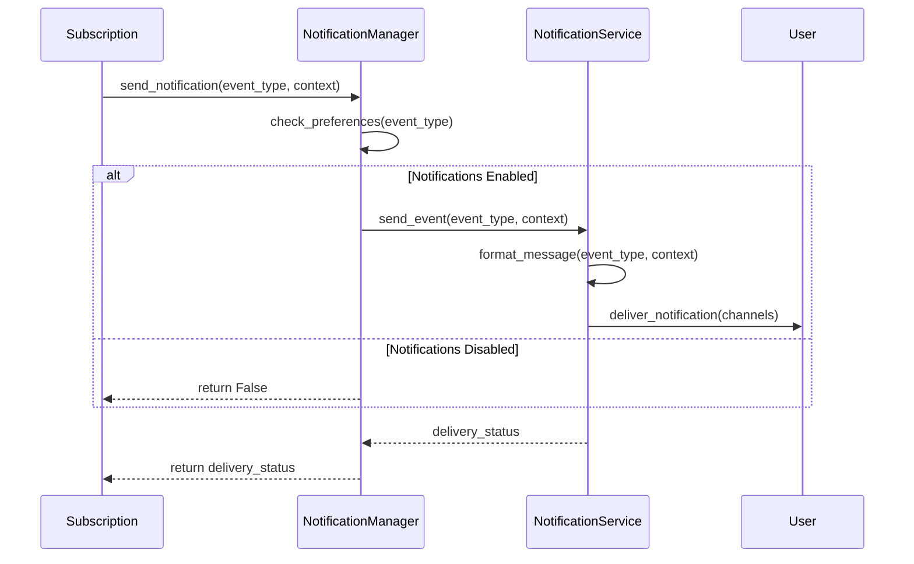
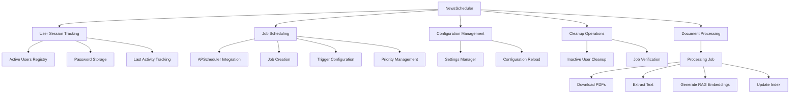
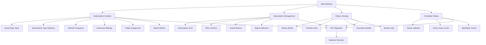

# Research Subscriptions and Scheduling

<cite>
**Referenced Files in This Document**   
- [base_subscription.py](file://src/local_deep_research/news/subscription_manager/base_subscription.py)
- [search_subscription.py](file://src/local_deep_research/news/subscription_manager/search_subscription.py)
- [topic_subscription.py](file://src/local_deep_research/news/subscription_manager/topic_subscription.py)
- [scheduler.py](file://src/local_deep_research/news/subscription_manager/scheduler.py)
- [news.py](file://src/local_deep_research/database/models/news.py)
- [api.py](file://src/local_deep_research/news/api.py)
- [flask_api.py](file://src/local_deep_research/news/flask_api.py)
- [subscriptions.js](file://src/local_deep_research/web/static/js/pages/subscriptions.js)
- [news-subscription-form.html](file://src/local_deep_research/web/templates/pages/news-subscription-form.html)
- [manager.py](file://src/local_deep_research/notifications/manager.py)
- [NOTIFICATIONS.md](file://docs/NOTIFICATIONS.md)
- [document_scheduler.py](file://src/local_deep_research/research_scheduler/document_scheduler.py)
- [routes.py](file://src/local_deep_research/research_scheduler/routes.py)
</cite>

## Table of Contents
1. [Introduction](#introduction)
2. [Subscription Lifecycle](#subscription-lifecycle)
3. [Subscription Types](#subscription-types)
4. [Configuration Options](#configuration-options)
5. [Notification Integration](#notification-integration)
6. [Scheduler Architecture](#scheduler-architecture)
7. [Web Interface](#web-interface)
8. [Use Cases](#use-cases)
9. [Management and Troubleshooting](#management-and-troubleshooting)
10. [Conclusion](#conclusion)

## Introduction
The research subscription system enables users to create automated, periodic research tasks that monitor specific topics or search queries for new information. This document details the comprehensive functionality of the subscription system, including its lifecycle, types, configuration options, integration with notification systems, scheduler architecture, web interface, and practical use cases. The system is designed to provide continuous monitoring of evolving topics, delivering timely updates through a sophisticated scheduling mechanism and notification framework.

**Section sources**
- [base_subscription.py](file://src/local_deep_research/news/subscription_manager/base_subscription.py#L1-L251)
- [search_subscription.py](file://src/local_deep_research/news/subscription_manager/search_subscription.py#L1-L255)
- [topic_subscription.py](file://src/local_deep_research/news/subscription_manager/topic_subscription.py#L1-L314)

## Subscription Lifecycle
The subscription lifecycle encompasses the complete journey from creation through periodic execution to result delivery. Each subscription follows a well-defined sequence of states and transitions, ensuring reliable and consistent operation.

When a subscription is created, it is initialized with specific parameters including the query or topic, refresh interval, and various configuration settings. The subscription enters an active state by default, making it eligible for scheduling. During the initialization phase, the system validates the subscription parameters and stores the subscription details in the user's encrypted database.

The scheduling phase begins when the subscription is registered with the NewsScheduler. The scheduler calculates the next refresh time based on the subscription's refresh interval and current time. For new subscriptions, the next refresh is typically set to the creation time plus the refresh interval. The scheduler then creates a job using APScheduler, which will trigger the subscription at the appropriate time.

During execution, the subscription generates a search query based on its type (search-based or topic-based) and configuration. The system then initiates a research process using the core research functionality, passing along metadata that identifies the request as originating from a subscription. This metadata includes the subscription ID, which allows for proper tracking and attribution of the research results.

After execution, the subscription updates its state based on the outcome. Successful executions increment the refresh count and reset the error count, while failed executions increment the error count and implement exponential backoff to prevent overwhelming the system. If a subscription experiences too many consecutive failures, it may be automatically disabled to prevent further issues.

The result delivery phase involves storing the research results in the database and making them available through the news feed system. Subscriptions that generate new results trigger notifications according to the user's notification preferences. The system also maintains a history of all research runs associated with each subscription, allowing users to review past results and performance.

**Diagram sources **
- [base_subscription.py](file://src/local_deep_research/news/subscription_manager/base_subscription.py#L1-L251)
- [scheduler.py](file://src/local_deep_research/news/subscription_manager/scheduler.py#L1-L1579)
- [api.py](file://src/local_deep_research/news/api.py#L1-L1301)

**Section sources**
- [base_subscription.py](file://src/local_deep_research/news/subscription_manager/base_subscription.py#L1-L251)
- [scheduler.py](file://src/local_deep_research/news/subscription_manager/scheduler.py#L1-L1579)
- [api.py](file://src/local_deep_research/news/api.py#L1-L1301)

## Subscription Types
The system supports two primary subscription types: search-based subscriptions and topic-based subscriptions. Each type serves different use cases and has distinct characteristics in how it generates queries and processes results.

Search-based subscriptions are created from existing search queries and are designed to monitor specific research topics for updates. When a user creates a search-based subscription, the system captures the original query and stores it as the subscription's foundation. The subscription then transforms this query into a news-focused version by adding temporal and contextual terms. For example, a query about "AI security vulnerabilities" might be transformed into "AI security vulnerabilities breaking news alerts today" to ensure it captures the most recent developments. The system intelligently applies different transformations based on the query type, using terms like "latest updates developments" for technical queries and "breaking news alerts today" for security-related queries.

Topic-based subscriptions focus on monitoring specific news topics that may evolve over time. These subscriptions are particularly useful for tracking emerging trends or ongoing developments in a particular field. When a topic-based subscription is created, it can include related topics to broaden its coverage. The system generates search queries by combining the main topic with up to two related topics, enclosed in quotes for exact matching, and appends news-specific terms like "latest news today developments breaking." This approach ensures comprehensive coverage of the topic while maintaining relevance to current events.

Both subscription types support query evolution, allowing them to adapt to changing circumstances. Search-based subscriptions can incorporate new terms to refine their focus, while topic-based subscriptions can evolve to new forms when the nature of the topic changes. Topic-based subscriptions also include activity tracking, monitoring when the topic was last significantly active and automatically adjusting their status based on inactivity thresholds. This feature helps prevent users from receiving updates on topics that are no longer relevant.

**Diagram sources **
- [base_subscription.py](file://src/local_deep_research/news/subscription_manager/base_subscription.py#L1-L251)
- [search_subscription.py](file://src/local_deep_research/news/subscription_manager/search_subscription.py#L1-L255)
- [topic_subscription.py](file://src/local_deep_research/news/subscription_manager/topic_subscription.py#L1-L314)

**Section sources**
- [search_subscription.py](file://src/local_deep_research/news/subscription_manager/search_subscription.py#L1-L255)
- [topic_subscription.py](file://src/local_deep_research/news/subscription_manager/topic_subscription.py#L1-L314)

## Configuration Options
Subscriptions offer a comprehensive set of configuration options that allow users to customize their behavior and performance characteristics. These options are accessible through the web interface and can be modified at any time during the subscription's lifecycle.

The primary configuration option is the refresh interval, which determines how frequently the subscription checks for new information. Users can select from predefined intervals including hourly, every 12 hours, daily, and weekly, or specify a custom interval in minutes. The system enforces minimum and maximum limits to prevent excessive resource usage, with intervals required to be at least 60 minutes and not exceeding 30 days.

Each subscription can be assigned to a folder for organizational purposes. Folders help users manage multiple subscriptions by grouping them into categories such as "Technology," "Finance," or "Health." Users can create custom folders and assign subscriptions to them, making it easier to filter and manage their subscriptions.

Advanced settings allow users to configure the research process in detail. These include selecting the LLM provider and specific model to use for analysis, choosing the search strategy (such as iterative or adaptive), and specifying the search engine to use for information retrieval. Users can also configure the number of search iterations and questions per iteration, which affects the depth and thoroughness of the research.

Subscription-specific settings include the ability to add a friendly name and notes for better identification and context. The system also supports custom API endpoints for users who want to use self-hosted or specialized LLM services. These configuration options are stored in the subscription's metadata and are applied each time the subscription executes.

**Diagram sources **
- [news.py](file://src/local_deep_research/database/models/news.py#L1-L263)
- [news-subscription-form.html](file://src/local_deep_research/web/templates/pages/news-subscription-form.html#L1-L651)
- [subscriptions.js](file://src/local_deep_research/web/static/js/pages/subscriptions.js#L1-L758)

**Section sources**
- [news.py](file://src/local_deep_research/database/models/news.py#L1-L263)
- [news-subscription-form.html](file://src/local_deep_research/web/templates/pages/news-subscription-form.html#L1-L651)
- [subscriptions.js](file://src/local_deep_research/web/static/js/pages/subscriptions.js#L1-L758)

## Notification Integration
The subscription system integrates with the notification framework to alert users when new results are available or when issues occur. This integration ensures that users stay informed about the status of their subscriptions without needing to constantly monitor the system.

Notifications are triggered by specific events in the subscription lifecycle. When a subscription successfully completes a research run and generates new results, a notification is sent to inform the user. The notification includes details about the subscription and a link to view the new results. Users can configure whether they want to receive these completion notifications through their notification settings.

If a subscription encounters an error during execution, an error notification is generated. These notifications help users identify and address issues with their subscriptions, such as connectivity problems or API limitations. The system implements exponential backoff for error recovery, and users are notified when a subscription has been disabled due to repeated failures.

Users can also receive notifications when they create or modify subscriptions, providing confirmation that their changes have been applied. The notification system supports multiple delivery channels, including in-app alerts, email, and external services like Discord or Slack, depending on the user's configuration.

The notification preferences are configurable at both the system level and per-user level. Users can enable or disable specific notification types based on their preferences. For example, a user might choose to receive notifications for subscription errors but not for successful completions if they prefer to check results manually.

**Diagram sources **
- [manager.py](file://src/local_deep_research/notifications/manager.py#L1-L306)
- [NOTIFICATIONS.md](file://docs/NOTIFICATIONS.md#L33-L40)
- [api.py](file://src/local_deep_research/news/api.py#L40-L85)

**Section sources**
- [manager.py](file://src/local_deep_research/notifications/manager.py#L1-L306)
- [NOTIFICATIONS.md](file://docs/NOTIFICATIONS.md#L33-L40)
- [api.py](file://src/local_deep_research/news/api.py#L40-L85)

## Scheduler Architecture
The scheduler architecture is designed to efficiently manage subscription timing and execution priorities while maintaining system stability and resource efficiency. The system uses a singleton pattern with a background scheduler to coordinate all subscription activities.

The NewsScheduler class serves as the central coordinator for all subscription activities. It maintains a registry of active users and their subscription jobs, ensuring that each user's subscriptions are properly scheduled and executed. The scheduler uses APScheduler's BackgroundScheduler to manage the timing of subscription executions, allowing for precise control over when subscriptions run.

User session tracking is a critical component of the scheduler architecture. When a user interacts with the system, their credentials are temporarily stored in memory, allowing the scheduler to access their encrypted database when needed. This approach enables the scheduler to work in the background without requiring the user to remain logged in. User sessions are automatically cleaned up after a configurable retention period, typically 48 hours, to maintain security and resource efficiency.

The scheduler implements several optimization strategies to manage execution priorities and prevent resource contention. It limits the maximum number of concurrent jobs to prevent system overload and uses jitter to distribute subscription executions evenly over time. For users with multiple subscriptions, the scheduler processes them in batches to minimize database connections and improve efficiency.

Document processing is integrated into the scheduler architecture through a separate document processing job for each user. This job runs at a configurable interval and handles tasks such as downloading PDFs, extracting text, and generating RAG embeddings for research results. The document processing job is designed to run independently of subscription executions, ensuring that these resource-intensive tasks do not interfere with the timely execution of subscriptions.

**Diagram sources **
- [scheduler.py](file://src/local_deep_research/news/subscription_manager/scheduler.py#L1-L1579)
- [document_scheduler.py](file://src/local_deep_research/research_scheduler/document_scheduler.py#L1-L97)
- [routes.py](file://src/local_deep_research/research_scheduler/routes.py#L1-L53)

**Section sources**
- [scheduler.py](file://src/local_deep_research/news/subscription_manager/scheduler.py#L1-L1579)
- [document_scheduler.py](file://src/local_deep_research/research_scheduler/document_scheduler.py#L1-L97)
- [routes.py](file://src/local_deep_research/research_scheduler/routes.py#L1-L53)

## Web Interface
The web interface provides a comprehensive set of tools for creating, managing, and monitoring subscriptions. The interface is designed to be intuitive and user-friendly, making it easy for users to set up and maintain their subscriptions.

The subscription creation form is the primary entry point for new subscriptions. It includes fields for the query or topic, refresh frequency, and advanced settings. Users can choose between search-based and topic-based subscription types and configure various options such as the LLM provider, model, and search strategy. The form also includes validation to ensure that required fields are completed and that values are within acceptable ranges.

The subscription management page displays all active subscriptions in a grid layout, with each subscription represented by a card showing key information such as the query, refresh frequency, and status. Users can filter subscriptions by folder, status, and frequency, making it easy to find specific subscriptions. Each subscription card includes action buttons for running the subscription immediately, pausing or resuming it, viewing its history, editing its settings, or deleting it.

Subscription history is accessible through a dedicated modal that shows a timeline of all research runs associated with a subscription. The history includes details such as the execution date, status, duration, and generated topics. Users can click on individual history items to view the full research results. This feature provides valuable insights into the performance and effectiveness of each subscription over time.

The interface also includes a scheduler status indicator that shows whether the subscription scheduler is running and how many active users are being tracked. If the scheduler is not running, users can start it directly from the interface. This feature provides transparency into the system's operation and helps users troubleshoot issues with automated subscriptions.

**Diagram sources **
- [news-subscription-form.html](file://src/local_deep_research/web/templates/pages/news-subscription-form.html#L1-L651)
- [subscriptions.js](file://src/local_deep_research/web/static/js/pages/subscriptions.js#L1-L758)
- [flask_api.py](file://src/local_deep_research/news/flask_api.py#L469-L1096)

**Section sources**
- [news-subscription-form.html](file://src/local_deep_research/web/templates/pages/news-subscription-form.html#L1-L651)
- [subscriptions.js](file://src/local_deep_research/web/static/js/pages/subscriptions.js#L1-L758)
- [flask_api.py](file://src/local_deep_research/news/flask_api.py#L469-L1096)

## Use Cases
The research subscription system supports a variety of practical use cases that demonstrate its versatility and value in different contexts. These use cases illustrate how users can leverage the system to monitor breaking news, track research topics, and perform automated market analysis.

For monitoring breaking news, users can create search-based subscriptions focused on specific events or developments. For example, a journalist might create a subscription for "latest developments in renewable energy policy" with an hourly refresh interval to stay current on breaking news. The system automatically transforms this query into a news-focused version and executes it at the specified interval, delivering updates directly to the user's news feed.

Tracking research topics is another valuable use case, particularly for academics and professionals who need to stay current in their fields. A researcher studying artificial intelligence might create a topic-based subscription for "large language models" with related topics such as "transformer architectures" and "few-shot learning." As the field evolves, the subscription can adapt by incorporating new terms and adjusting its focus, ensuring that the user receives relevant updates.

Automated market analysis is a powerful application of the subscription system for financial professionals. Users can create subscriptions that monitor specific stocks, economic indicators, or market trends. For example, an investor might create a subscription for "NVIDIA stock analysis" with a daily refresh interval to receive regular updates on company news, financial performance, and market sentiment. The system can integrate with financial data sources and provide comprehensive analysis of market conditions.

Other use cases include competitive intelligence, where businesses monitor their competitors' activities and market positioning; regulatory compliance, where organizations track changes in regulations and legal requirements; and personal interest tracking, where individuals follow topics of personal interest such as hobbies, sports teams, or entertainment news. The flexibility of the subscription system makes it suitable for a wide range of monitoring and research needs.

**Section sources**
- [search_subscription.py](file://src/local_deep_research/news/subscription_manager/search_subscription.py#L1-L255)
- [topic_subscription.py](file://src/local_deep_research/news/subscription_manager/topic_subscription.py#L1-L314)
- [api.py](file://src/local_deep_research/news/api.py#L87-L482)

## Management and Troubleshooting
Effective management and troubleshooting of subscriptions are essential for maintaining a reliable and productive research workflow. The system provides several tools and features to help users manage their subscriptions and address any issues that may arise.

Subscription management includes the ability to pause and resume subscriptions, which is useful when users want to temporarily stop updates without deleting the subscription. Users can also modify subscription settings such as the refresh interval, query, or advanced configuration options. When changes are made, the system automatically notifies the scheduler to update the subscription's job, ensuring that the changes take effect immediately.

Troubleshooting failed runs is facilitated by comprehensive error reporting and logging. When a subscription fails to execute, the system records the error details and displays them in the subscription history. Users can review these errors to identify the cause, which might include connectivity issues, API limitations, or invalid configuration settings. The system also implements exponential backoff for error recovery, automatically increasing the interval between attempts to prevent overwhelming external services.

Performance monitoring is another important aspect of subscription management. Users can view statistics such as the number of successful and failed runs, average execution time, and results count. This information helps users evaluate the effectiveness of their subscriptions and make informed decisions about optimization. For example, if a subscription consistently returns few results, the user might consider broadening the query or adjusting the search strategy.

The system also provides tools for managing subscription overload. Users can set limits on the number of concurrent subscriptions or configure priorities to ensure that critical subscriptions receive adequate resources. The scheduler's batch processing and job prioritization features help prevent resource contention and ensure that high-priority subscriptions are executed promptly.

**Section sources**
- [base_subscription.py](file://src/local_deep_research/news/subscription_manager/base_subscription.py#L1-L251)
- [scheduler.py](file://src/local_deep_research/news/subscription_manager/scheduler.py#L1-L1579)
- [api.py](file://src/local_deep_research/news/api.py#L542-L609)

## Conclusion
The research subscription and scheduling system provides a powerful and flexible framework for automated information monitoring and research. By combining sophisticated subscription types, comprehensive configuration options, seamless notification integration, and a robust scheduler architecture, the system enables users to stay current on evolving topics with minimal effort.

The system's design emphasizes reliability, security, and user control, ensuring that subscriptions operate efficiently while respecting user preferences and system resources. The web interface makes it easy to create and manage subscriptions, while the underlying architecture handles the complexities of scheduling, execution, and result delivery.

As the system continues to evolve, future enhancements might include machine learning-based query optimization, collaborative filtering for recommendation-based subscriptions, and enhanced analytics for subscription performance. These improvements would further increase the value of the subscription system for users across various domains and applications.

**Section sources**
- [base_subscription.py](file://src/local_deep_research/news/subscription_manager/base_subscription.py#L1-L251)
- [scheduler.py](file://src/local_deep_research/news/subscription_manager/scheduler.py#L1-L1579)
- [api.py](file://src/local_deep_research/news/api.py#L1-L1301)