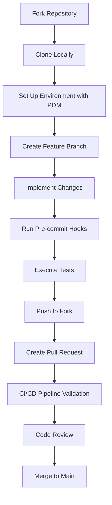
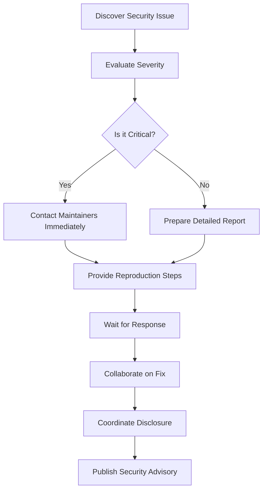
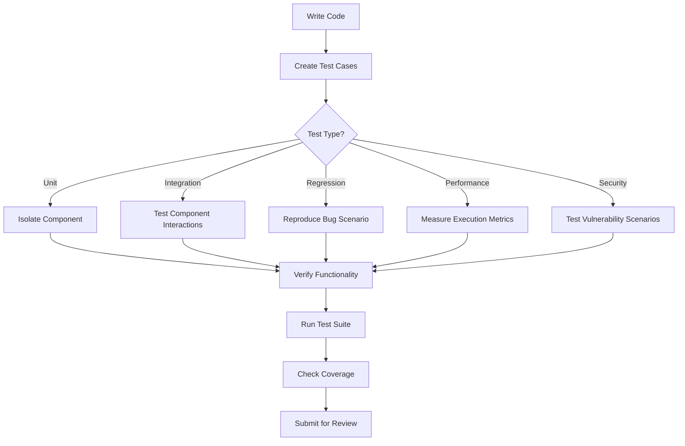
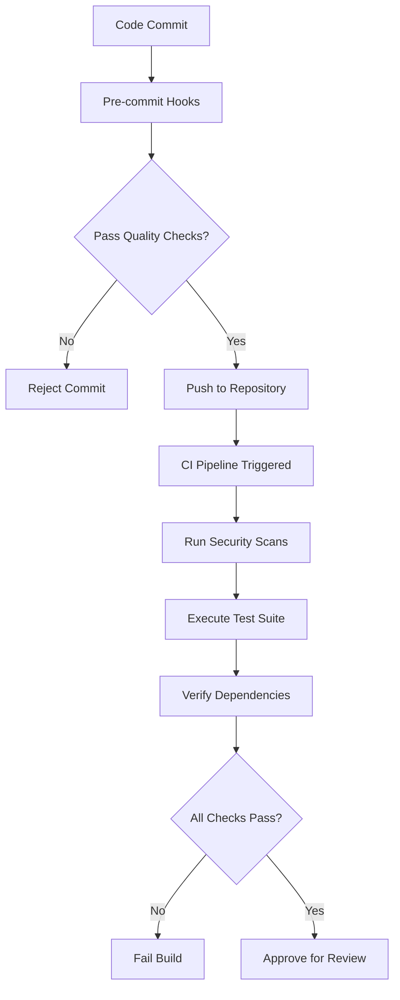
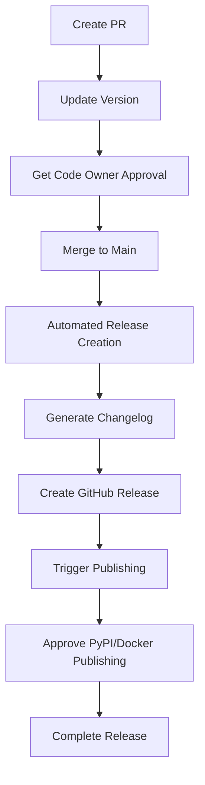

# Community and Contribution

<cite>
**Referenced Files in This Document**   
- [CONTRIBUTING.md](file://CONTRIBUTING.md)
- [developing.md](file://docs/developing.md)
- [RELEASE_GUIDE.md](file://docs/RELEASE_GUIDE.md)
- [SECURITY_REVIEW_PROCESS.md](file://docs/SECURITY_REVIEW_PROCESS.md)
- [MIGRATION_GUIDE_v1.md](file://docs/MIGRATION_GUIDE_v1.md)
- [pyproject.toml](file://pyproject.toml)
- [scripts/dev/run_tests.py](file://scripts/dev/run_tests.py)
</cite>

## Table of Contents
1. [Introduction](#introduction)
2. [Contribution Workflow](#contribution-workflow)
3. [Issue Reporting Process](#issue-reporting-process)
4. [Code Review and Testing Requirements](#code-review-and-testing-requirements)
5. [CI/CD Pipeline Expectations](#cicd-pipeline-expectations)
6. [Documentation Guidelines](#documentation-guidelines)
7. [Communication Channels](#communication-channels)
8. [Release Process and Versioning](#release-process-and-versioning)
9. [Conclusion](#conclusion)

## Introduction

Local Deep Research (LDR) is an open-source AI-powered research assistant designed for deep, iterative research using multiple LLMs and search engines with proper citations. This document provides comprehensive guidance for community engagement and contribution to the project. The project follows a community-driven development model where contributions from developers worldwide help enhance the system's capabilities for researchers, students, and professionals.

The project emphasizes privacy, security, and transparency, with features like local execution, encrypted databases, and detailed analytics. The community plays a vital role in the project's evolution through contributions, testing, and feedback. This documentation outlines the processes and guidelines for effective participation in the project's development lifecycle.

**Section sources**
- [README.md](file://README.md#L1-L513)

## Contribution Workflow

### Fork-Build-Test-Submit Cycle

The contribution workflow for Local Deep Research follows a standardized process to ensure code quality and maintain project integrity. Contributors begin by forking the repository on GitHub, creating their own copy to work on. After forking, they clone the repository locally and set up the development environment following the Developer Guide.

The build process uses PDM (Python Development Master) as the package manager. Contributors configure the environment by running `pdm install --no-self` to install dependencies. For frontend development, contributors must build frontend assets using npm with the commands `npm install` followed by `npm run build`, which generates files in the `src/local_deep_research/web/static/dist/` directory.

Testing is a critical step before submission. Contributors run tests using the command `pdm run python run_tests.py`, which executes the test suite and generates coverage reports. The pre-commit hooks automatically format code with Black, sort imports with isort, and run flake8 linting to ensure code quality standards are met before commits.

The submission process involves creating a focused pull request with one feature or fix per PR. Contributors must ensure their PR includes clear commit messages explaining both what and why changes were made, updated documentation to reflect code changes, appropriate tests for new functionality, and passing CI checks.

**Diagram sources**
- [CONTRIBUTING.md](file://CONTRIBUTING.md#L41-L49)
- [developing.md](file://docs/developing.md#L10-L16)
- [scripts/dev/run_tests.py](file://scripts/dev/run_tests.py#L1-L50)

### Branch Naming Conventions

The project follows a structured branch naming convention to maintain organization and clarity in the development process. Feature branches should be named with a descriptive prefix followed by a hyphen and a concise description of the feature or fix. The accepted prefixes are:

- `feature/` for new functionality implementation
- `fix/` for bug fixes and issue resolution
- `docs/` for documentation updates
- `refactor/` for code restructuring without changing behavior
- `test/` for test-related changes
- `hotfix/` for urgent fixes requiring immediate release

Examples of proper branch names include `feature/user-authentication`, `fix/database-connection-leak`, and `docs/contribution-guide-update`. This convention helps maintainers quickly identify the purpose of each branch and facilitates organized code review and tracking.

The main branch is protected with branch protection rules that prevent direct pushes, require code owner approval, and mandate passing status checks before merging. This ensures that all changes go through proper review and testing before becoming part of the stable codebase.

**Section sources**
- [CONTRIBUTING.md](file://CONTRIBUTING.md#L48-L49)
- [RELEASE_GUIDE.md](file://docs/RELEASE_GUIDE.md#L57-L60)

### Pull Request Requirements

Pull requests to the Local Deep Research project must adhere to specific requirements to ensure code quality, security, and maintainability. Each PR should focus on a single feature or fix to facilitate clear review and reduce merge conflicts. Contributors must provide detailed descriptions explaining the motivation for the changes, the implementation approach, and any alternatives considered.

All PRs automatically trigger a comprehensive CI/CD pipeline that includes file whitelist enforcement, large file detection (>1MB), security pattern scanning, and binary file detection. The pre-commit hooks enforce code formatting standards using Black, import sorting with isort, and linting with flake8. PRs that modify security-critical files trigger additional automated warnings and checklists to ensure proper scrutiny.

Contributors must update relevant documentation to reflect their changes, including docstrings, README files, and user guides. For new features, appropriate tests must be included to verify functionality and prevent regressions. The CI pipeline must pass all automated checks before a PR can be merged.

Code owners (`@LearningCircuit`, `@hashedviking`, and `@djpetti`) must approve PRs before merging. The review process examines code quality, adherence to project architecture, security implications, and overall alignment with project goals.

**Section sources**
- [CONTRIBUTING.md](file://CONTRIBUTING.md#L74-L88)
- [SECURITY_REVIEW_PROCESS.md](file://docs/SECURITY_REVIEW_PROCESS.md#L9-L21)

## Issue Reporting Process

### Bug Report Template

When reporting bugs in the Local Deep Research project, contributors should follow a structured template to ensure all necessary information is provided for effective diagnosis and resolution. The bug report should include:

- **Environment**: Operating system, Python version, and installation method (Docker, pip, etc.)
- **Steps to Reproduce**: Clear, step-by-step instructions to recreate the issue
- **Expected Behavior**: Description of what should happen under normal circumstances
- **Actual Behavior**: Detailed description of the observed behavior, including error messages
- **Screenshots/Logs**: Relevant screenshots, console output, or log files (with sensitive information redacted)
- **Configuration**: Relevant configuration settings that might affect the behavior
- **Additional Context**: Any other information that might help understand the issue

The project uses GitHub Issues for bug tracking, and contributors are encouraged to search existing issues before creating new ones to avoid duplicates. For security-related bugs, a separate disclosure process is available to ensure responsible handling.

**Section sources**
- [CONTRIBUTING.md](file://CONTRIBUTING.md#L109-L110)
- [README.md](file://README.md#L500-L501)

### Feature Request Template

Feature requests should provide comprehensive information to help the development team evaluate the proposal's feasibility and alignment with project goals. The template includes:

- **Problem Statement**: Clear description of the problem the feature would solve
- **Proposed Solution**: Detailed explanation of the suggested implementation
- **Use Cases**: Specific scenarios where the feature would be beneficial
- **Alternatives Considered**: Other approaches that were evaluated
- **Impact Assessment**: Expected benefits and potential drawbacks
- **Implementation Ideas**: Technical suggestions for how the feature could be implemented
- **Priority Indication**: Whether the request is critical, important, or nice-to-have

The community is encouraged to participate in discussions about feature requests, providing feedback and use cases to help prioritize development efforts. The project maintainers regularly review feature requests and may implement highly requested features in future releases.

**Section sources**
- [README.md](file://README.md#L497-L501)

### Security Disclosure Process

The Local Deep Research project follows a responsible disclosure process for security vulnerabilities. Security issues should not be reported through public channels but rather through direct communication with the maintainers. The project uses automated security scanning tools including CodeQL, Semgrep, and GitGuardian to detect potential vulnerabilities.

For contributors who discover security issues, the recommended process is:
1. Do not create a public issue or PR
2. Contact the maintainers directly through secure channels
3. Provide detailed information about the vulnerability, including reproduction steps
4. Allow time for the team to develop and test a fix
5. Coordinate disclosure timing

The project has implemented a security review process that automatically detects changes to security-critical files and triggers appropriate review checklists. This includes monitoring for modifications to database encryption, authentication systems, and security utilities.

**Diagram sources**
- [SECURITY_REVIEW_PROCESS.md](file://docs/SECURITY_REVIEW_PROCESS.md#L9-L21)
- [CONTRIBUTING.md](file://CONTRIBUTING.md#L92-L98)

## Code Review and Testing Requirements

### Code Review Process

The code review process for Local Deep Research is designed to maintain high code quality, security, and architectural consistency. All pull requests require approval from at least one code owner before merging. The review process focuses on several key aspects:

- **Code Quality**: Adherence to PEP 8 standards, proper documentation, and maintainable code structure
- **Security Implications**: Identification of potential vulnerabilities, especially in security-critical components
- **Performance Impact**: Assessment of computational efficiency and resource usage
- **Test Coverage**: Verification that new code is adequately tested and existing tests are not broken
- **Documentation**: Ensuring that code changes are reflected in relevant documentation
- **Architecture Alignment**: Confirmation that the changes fit within the project's overall design principles

For changes that modify security-critical files, the automated system adds specific labels and checklists to ensure thorough review. These include `security-review-needed`, `touches-encryption`, and `touches-authentication`. The review checklists provide specific guidance for different types of security changes, such as encryption modifications, authentication changes, and general security considerations.

Reviewers are encouraged to ask questions, request clarification, and suggest improvements. The process is collaborative, with the goal of improving the code rather than simply approving or rejecting changes. Maintainers may request additional tests, documentation updates, or code modifications before approving a PR.

**Section sources**
- [SECURITY_REVIEW_PROCESS.md](file://docs/SECURITY_REVIEW_PROCESS.md#L62-L71)
- [CONTRIBUTING.md](file://CONTRIBUTING.md#L74-L88)

### Testing Requirements

The Local Deep Research project maintains a comprehensive testing framework to ensure reliability and prevent regressions. All contributions must include appropriate tests that verify the functionality of new features and fixes. The testing requirements vary based on the type of change:

- **Unit Tests**: Required for new functions and classes, testing individual components in isolation
- **Integration Tests**: Required for features that interact with multiple components or external services
- **Regression Tests**: Required for bug fixes to prevent the issue from recurring
- **Performance Tests**: Recommended for changes that may impact system performance
- **Security Tests**: Required for modifications to security-critical components

The test suite is organized into multiple categories including API tests, authentication tests, database tests, and security tests. Tests are written using pytest and are located in the `tests/` directory. The project uses pytest markers to categorize tests, including `requires_llm` for tests that need a real LLM, `integration` for integration tests, and `slow` for time-consuming tests.

The coverage configuration in `pyproject.toml` specifies that the test coverage should focus on the `src` directory while excluding test files, cache directories, and experimental code. The project aims for high test coverage, with HTML coverage reports generated to identify areas needing additional tests.

**Diagram sources**
- [pyproject.toml](file://pyproject.toml#L153-L159)
- [scripts/dev/run_tests.py](file://scripts/dev/run_tests.py#L23-L33)

## CI/CD Pipeline Expectations

### Automated Testing Pipeline

The Continuous Integration pipeline for Local Deep Research is designed to automatically validate all code changes through a comprehensive suite of tests and checks. When a pull request is created or updated, GitHub Actions triggers the CI workflow that includes:

- **Code Formatting Check**: Verifies that code adheres to Black formatting standards
- **Static Analysis**: Runs flake8 and mypy to identify potential bugs and type issues
- **Unit and Integration Tests**: Executes the full test suite with coverage measurement
- **Security Scanning**: Performs automated security analysis using CodeQL and Semgrep
- **Dependency Check**: Verifies that dependencies are up-to-date and free of known vulnerabilities
- **Build Verification**: Confirms that the package can be successfully built

The CI pipeline uses pytest with multiple configuration options to ensure thorough testing. It measures code coverage for the `src` directory and generates both terminal and HTML reports. The pipeline is configured to fail if any tests do not pass or if coverage falls below acceptable thresholds.

For Python dependencies, the project uses PDM with a locked dependency file (`pdm.lock`) to ensure reproducible builds. The `pyproject.toml` file specifies the exact versions and sources for all dependencies, including platform-specific variants for SQLCipher.

**Section sources**
- [pyproject.toml](file://pyproject.toml#L123-L272)
- [CONTRIBUTING.md](file://CONTRIBUTING.md#L84-L88)

### Security and Quality Checks

The CI/CD pipeline incorporates multiple layers of security and quality checks to maintain the integrity of the codebase. These checks are designed to catch issues early in the development process before they can be merged into the main branch.

The pre-commit hooks enforce code quality standards by automatically formatting code with Black, sorting imports with isort, and running flake8 linting. They also prevent commits of large files (>1MB) and block commits directly to the main branch, ensuring all changes go through the pull request process.

Security-specific checks include:
- **File Whitelist Enforcement**: Only permitted file types can be committed
- **Large File Detection**: Blocks files larger than 1MB
- **Security Pattern Scanning**: Identifies potential security vulnerabilities
- **Binary File Detection**: Prevents binary files from being committed
- **Secrets Detection**: Scans for accidentally committed credentials

The project uses GitGuardian for enhanced security on forks, which scans commits for exposed secrets. If sensitive data is accidentally committed, contributors are instructed to immediately revoke the credentials, clean the git history, and notify maintainers.

**Diagram sources**
- [CONTRIBUTING.md](file://CONTRIBUTING.md#L67-L72)
- [CONTRIBUTING.md](file://CONTRIBUTING.md#L84-L88)

## Documentation Guidelines

### Documentation Update Process

The Local Deep Research project maintains comprehensive documentation to support users and contributors. Documentation updates are treated with the same importance as code changes and must be included with relevant code modifications. The documentation is organized into several categories:

- **User Documentation**: Guides for installation, configuration, and usage
- **Developer Documentation**: Information for contributors on architecture, APIs, and development processes
- **API Documentation**: Detailed specifications for programmatic access
- **Release Documentation**: Notes on version changes, migration paths, and upgrade instructions

When contributing code changes, developers must update the appropriate documentation files to reflect the modifications. For new features, this includes adding sections to relevant guides, updating API references, and providing usage examples. For bug fixes, documentation should be updated to correct any inaccurate information.

The project uses Markdown for documentation files, with a consistent structure and formatting style. Documentation files are located in the `docs/` directory, organized by topic. The README.md file serves as the primary entry point for project information, with links to more detailed guides.

**Section sources**
- [CONTRIBUTING.md](file://CONTRIBUTING.md#L78-L79)
- [README.md](file://README.md#L453-L482)

### Example Contributions

The project provides numerous examples to help contributors understand best practices and expected patterns. These examples are located in the `examples/` directory and cover various use cases and integration scenarios.

Key example categories include:
- **API Usage**: Demonstrations of programmatic access through Python and HTTP APIs
- **Benchmarks**: Scripts for testing and optimizing configuration
- **Optimization**: Examples of performance tuning and strategy improvement
- **LLM Integration**: Samples for integrating custom language models
- **Elasticsearch**: Examples of using Elasticsearch as a search engine

The examples serve as both learning resources for new contributors and test cases for verifying functionality. Contributors are encouraged to study these examples when implementing similar features or fixing related issues. When adding new functionality, contributors should consider whether an example would help users understand how to use the feature effectively.

The API examples include both simple working examples and advanced scenarios, demonstrating everything from basic queries to complex multi-engine research workflows. The benchmark examples show how to evaluate different configurations and measure performance improvements.

**Section sources**
- [README.md](file://README.md#L479-L482)
- [examples/api_usage/](file://examples/api_usage/)

### Code Style Standards

The Local Deep Research project follows established Python coding standards to ensure consistency and readability across the codebase. The primary style guidelines are enforced through automated tools and include:

- **PEP 8 Compliance**: Code formatting follows PEP 8 standards with some project-specific adaptations
- **Black Formatting**: The Black code formatter is used to ensure consistent code style
- **isort for Imports**: Import statements are sorted and organized using isort
- **Type Hints**: Comprehensive type annotations are used throughout the codebase
- **Docstrings**: Google-style docstrings are used for functions, classes, and modules

The project uses Ruff as the primary linter, configured in `pyproject.toml` with specific rules for line length (80 characters), indentation (4 spaces), and quote style (double quotes). The configuration excludes common directories like `.git`, `__pycache__`, and `venv` from linting.

For naming conventions, the project follows standard Python practices:
- **Variables and Functions**: snake_case
- **Classes**: PascalCase
- **Constants**: UPPER_CASE
- **Private Members**: prefixed with underscore

The mypy configuration in `pyproject.toml` enables strict type checking with options like `warn_return_any`, `strict_equality`, and `no_implicit_optional` to catch potential type-related issues.

**Section sources**
- [pyproject.toml](file://pyproject.toml#L191-L237)
- [CONTRIBUTING.md](file://CONTRIBUTING.md#L67-L71)

## Communication Channels

### GitHub Discussions and Issue Tracking

The primary communication channels for the Local Deep Research project are hosted on GitHub, providing transparent and accessible platforms for community interaction. GitHub Issues serves as the central hub for bug reports, feature requests, and technical discussions. The issue tracker is organized with labels to categorize issues by type (bug, enhancement, question), priority, and affected component.

GitHub Discussions provides a forum for broader conversations about the project, including usage questions, implementation ideas, and community announcements. This platform is particularly useful for discussions that don't fit the scope of a specific issue or feature request.

The project maintains a responsive issue management process:
- New issues are triaged regularly by maintainers
- Questions are answered promptly by community members and maintainers
- Bug reports are verified and prioritized
- Feature requests are evaluated for feasibility and alignment with project goals
- Pull requests are reviewed in a timely manner

The community is encouraged to participate in discussions, provide feedback on proposals, and help answer questions from other users. This collaborative approach helps distribute knowledge and reduces the burden on core maintainers.

**Section sources**
- [CONTRIBUTING.md](file://CONTRIBUTING.md#L107-L110)
- [README.md](file://README.md#L497-L501)

### Community Forums and Support

In addition to GitHub-based communication, the Local Deep Research project maintains several community forums to support users and contributors. These channels provide real-time interaction and specialized support for different aspects of the project.

The Discord server serves as the primary real-time communication platform, with dedicated channels for:
- General discussion and announcements
- Technical support and troubleshooting
- Development discussions
- Feature brainstorming
- Community showcases

The Reddit community (r/LocalDeepResearch) provides a platform for sharing research results, discussing use cases, and posting updates. This channel is particularly useful for reaching a broader audience beyond active contributors.

For users who prefer email-based communication, the project provides support through GitHub Issues and Discussions. The community is encouraged to search existing conversations before creating new ones to avoid duplication.

The project also maintains a wiki for community-contributed documentation, tutorials, and best practices. This collaborative knowledge base allows experienced users to share their expertise with newcomers.

**Section sources**
- [CONTRIBUTING.md](file://CONTRIBUTING.md#L108-L110)
- [README.md](file://README.md#L497-L501)

## Release Process and Versioning

### Release Process

The release process for Local Deep Research is fully automated to ensure consistency and reliability. Releases are triggered automatically when pull requests are merged to the main branch, following a well-defined workflow.

The automated release process includes:
1. **Version Detection**: The system reads the version number from `src/local_deep_research/__version__.py`
2. **Changelog Generation**: A changelog is automatically generated from the commit history since the last release
3. **Release Creation**: A GitHub Release is created with the version, changelog, and relevant metadata
4. **Package Publishing**: The release triggers publishing to PyPI and Docker Hub (with manual approval)

Code owners (`@LearningCircuit`, `@hashedviking`, and `@djpetti`) are responsible for approving the publishing step to ensure quality control. The process includes safeguards to prevent duplicate releases for the same version.

For regular releases, contributors follow these steps:
1. Create a PR with the desired changes
2. Update the version in `__version__.py` according to semantic versioning
3. Obtain approval from code owners
4. Merge to main, triggering the automated release
5. Approve publishing to PyPI and Docker Hub

Hotfixes follow a similar process but are prioritized for urgent bug fixes. The team creates a hotfix branch from main, implements the minimal necessary fix, bumps the patch version, and fast-tracks the review process.

**Diagram sources**
- [RELEASE_GUIDE.md](file://docs/RELEASE_GUIDE.md#L9-L35)

### Versioning Scheme

The Local Deep Research project follows Semantic Versioning (SemVer) 2.0.0 to provide clear and predictable version numbers that communicate the nature of changes between releases. The version format is MAJOR.MINOR.PATCH, where:

- **MAJOR version** (X.0.0): Incremented for breaking changes that are not backward compatible
- **MINOR version** (0.X.0): Incremented for new features that are backward compatible
- **PATCH version** (0.0.X): Incremented for bug fixes and backward compatible changes

This versioning scheme helps users understand the impact of upgrades and plan their migrations accordingly. For example, upgrading from version 0.4.2 to 0.5.0 indicates the addition of new features without breaking changes, while upgrading from 0.4.2 to 1.0.0 indicates significant breaking changes requiring careful migration.

The version number is maintained in `src/local_deep_research/__version__.py` and is automatically detected by the release process. Contributors are responsible for updating this file appropriately when making changes that affect the version.

The project maintains backward compatibility whenever possible, with deprecation cycles for features that need to be removed or modified. Migration guides are provided for major version changes to help users transition smoothly.

**Section sources**
- [RELEASE_GUIDE.md](file://docs/RELEASE_GUIDE.md#L62-L67)
- [MIGRATION_GUIDE_v1.md](file://docs/MIGRATION_GUIDE_v1.md#L1-L262)

## Conclusion

The Local Deep Research project provides a comprehensive framework for community engagement and contribution, designed to foster collaboration while maintaining high standards of code quality, security, and reliability. The well-documented contribution workflow, clear issue reporting processes, and automated CI/CD pipeline enable developers of all experience levels to participate effectively in the project's development.

By following the established guidelines for code review, testing, documentation, and releases, contributors can ensure their work aligns with the project's goals and integrates smoothly into the existing codebase. The various communication channels provide multiple avenues for support, discussion, and knowledge sharing, creating a vibrant community around the project.

The automated release process and semantic versioning scheme provide predictability and reliability for users, while the comprehensive security measures protect both the codebase and user data. As the project continues to evolve, these contribution guidelines will adapt to meet new challenges and opportunities, always with the goal of advancing the state of open-source AI research tools.

**Section sources**
- [CONTRIBUTING.md](file://CONTRIBUTING.md#L1-L127)
- [RELEASE_GUIDE.md](file://docs/RELEASE_GUIDE.md#L1-L85)