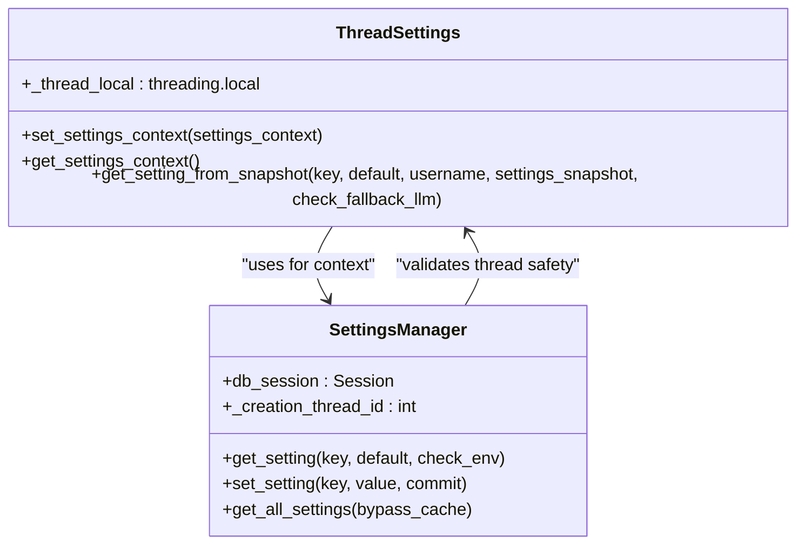
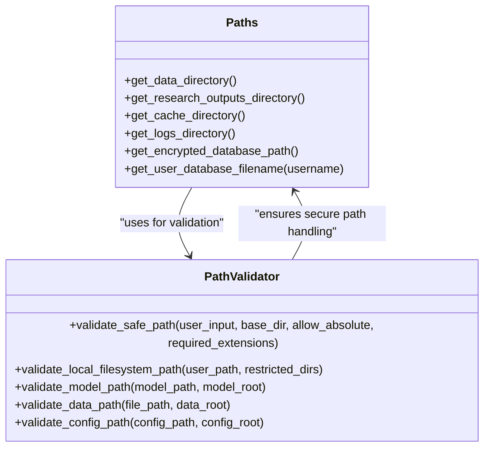
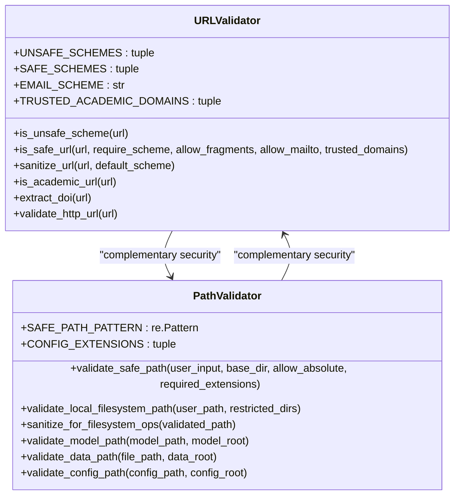
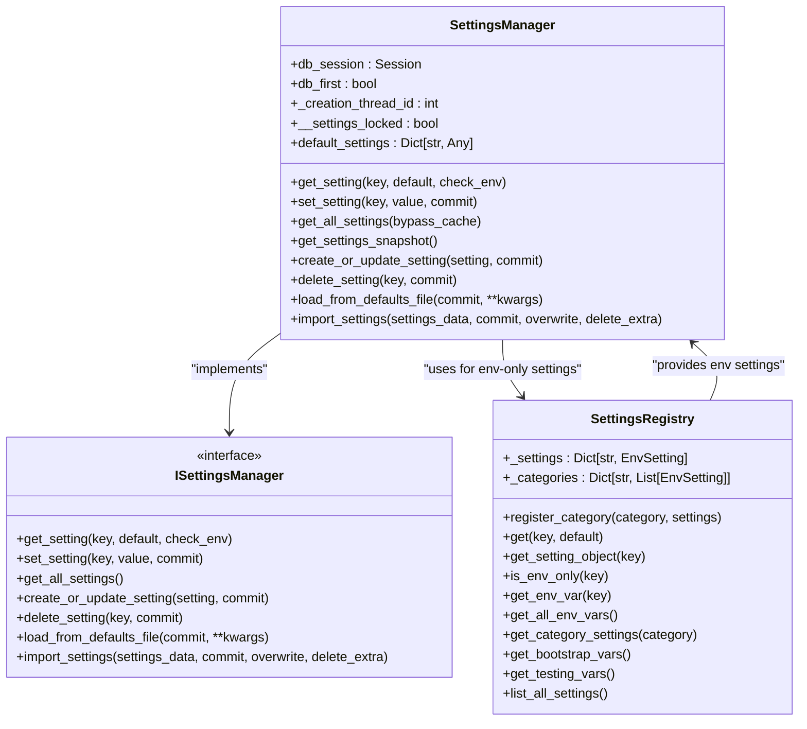
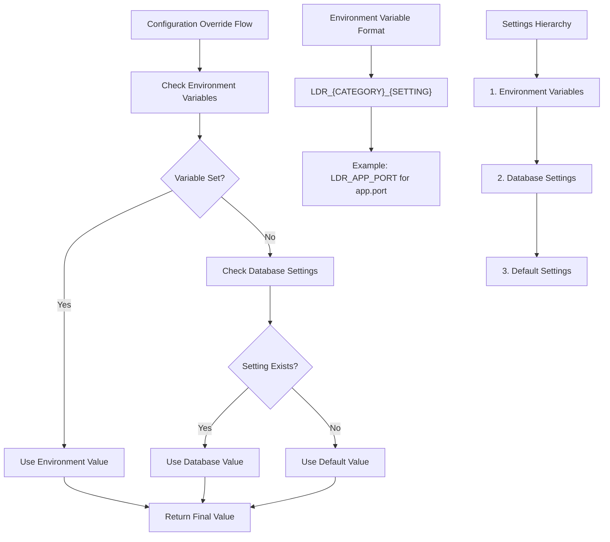
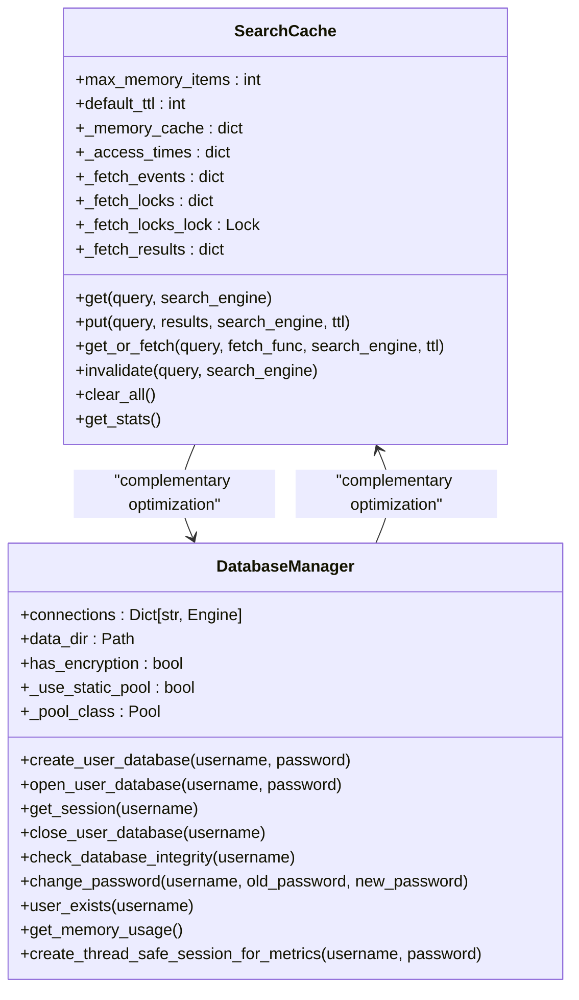

# Advanced Configuration

<cite>
**Referenced Files in This Document**   
- [thread_settings.py](file://src/local_deep_research/config/thread_settings.py)
- [paths.py](file://src/local_deep_research/config/paths.py)
- [search_config.py](file://src/local_deep_research/config/search_config.py)
- [default_settings.json](file://src/local_deep_research/defaults/default_settings.json)
- [env_settings.py](file://src/local_deep_research/settings/env_settings.py)
- [path_validator.py](file://src/local_deep_research/security/path_validator.py)
- [url_validator.py](file://src/local_deep_research/security/url_validator.py)
- [db_utils.py](file://src/local_deep_research/utilities/db_utils.py)
- [base.py](file://src/local_deep_research/settings/base.py)
- [encrypted_db.py](file://src/local_deep_research/database/encrypted_db.py)
- [manager.py](file://src/local_deep_research/settings/manager.py)
- [threading_utils.py](file://src/local_deep_research/utilities/threading_utils.py)
- [search_cache.py](file://src/local_deep_research/utilities/search_cache.py)
</cite>

## Table of Contents
1. [Introduction](#introduction)
2. [Thread Management Settings](#thread-management-settings)
3. [Path Configuration](#path-configuration)
4. [Security-Related Advanced Settings](#security-related-advanced-settings)
5. [Default Settings System](#default-settings-system)
6. [Configuration Override Mechanisms](#configuration-override-mechanisms)
7. [Production-Ready Configuration Profiles](#production-ready-configuration-profiles)
8. [Performance Optimization](#performance-optimization)
9. [Configuration Validation and Error Recovery](#configuration-validation-and-error-recovery)
10. [Conclusion](#conclusion)

## Introduction
This document provides comprehensive guidance on advanced configuration options for the Local Deep Research application. It covers critical aspects including thread management, path configuration, security settings, default settings system, configuration overrides, production profiles, performance optimization, and configuration validation. The configuration system is designed to be flexible and secure, allowing for both environment variable overrides and persistent storage in encrypted databases. The application uses a hierarchical configuration approach with multiple layers of defaults and overrides, ensuring robust operation across different deployment scenarios.

## Thread Management Settings

The application implements a sophisticated thread management system to handle concurrent operations while maintaining thread safety and proper context propagation. The core of this system is the thread-local storage mechanism that ensures settings context is properly maintained across different threads.

The `thread_settings.py` module provides a shared thread-local storage instance through the `_thread_local` object, which maintains settings context for each thread. This allows different threads to have their own isolated settings context, preventing race conditions and ensuring thread safety. The module provides functions to set and get the settings context for the current thread, as well as a `get_setting_from_snapshot` function that retrieves settings from a context without requiring database access.

For thread safety, the application uses several mechanisms:
- Thread-specific caching with unique thread IDs to prevent cache collisions
- Explicit thread safety checks in the `SettingsManager` class that prevent cross-thread usage
- Proper cleanup of thread-local resources to prevent memory leaks

The system also includes safeguards against improper database access from background threads, raising runtime errors when such access is attempted. This is crucial for maintaining SQLite's thread safety constraints, as SQLite does not support concurrent access from multiple threads.



**Diagram sources**
- [thread_settings.py](file://src/local_deep_research/config/thread_settings.py#L19-L127)
- [manager.py](file://src/local_deep_research/settings/manager.py#L213-L244)

**Section sources**
- [thread_settings.py](file://src/local_deep_research/config/thread_settings.py#L1-L127)
- [manager.py](file://src/local_deep_research/settings/manager.py#L213-L244)
- [threading_utils.py](file://src/local_deep_research/utilities/threading_utils.py#L1-L105)

## Path Configuration

The application provides a centralized path configuration system that handles data storage, cache directories, and temporary files in a secure and platform-independent manner. The `paths.py` module defines functions to determine appropriate directory locations for various types of data.

The primary function `get_data_directory()` uses the `platformdirs` library to determine the appropriate user data directory based on the operating system:
- Windows: `C:\Users\Username\AppData\Local\local-deep-research`
- macOS: `~/Library/Application Support/local-deep-research`
- Linux: `~/.local/share/local-deep-research`

This ensures that data is stored in the conventional location for each platform, following best practices for application data storage. The function also supports overriding the default location through the `LDR_DATA_DIR` environment variable, providing flexibility for custom deployments.

The module provides several convenience functions for specific directory types:
- `get_research_outputs_directory()`: For storing research reports and outputs
- `get_cache_directory()`: For storing cached search results and other temporary data
- `get_logs_directory()`: For storing log files
- `get_encrypted_database_path()`: For storing encrypted user databases

All directory creation is handled with `parents=True, exist_ok=True`, ensuring that parent directories are created as needed and no errors are raised if directories already exist.



**Diagram sources**
- [paths.py](file://src/local_deep_research/config/paths.py#L1-L127)
- [path_validator.py](file://src/local_deep_research/security/path_validator.py#L17-L392)

**Section sources**
- [paths.py](file://src/local_deep_research/config/paths.py#L1-L127)
- [path_validator.py](file://src/local_deep_research/security/path_validator.py#L1-L392)

## Security-Related Advanced Settings

The application implements comprehensive security measures for both path and URL validation to prevent common web vulnerabilities such as path traversal and XSS attacks.

The `path_validator.py` module provides a `PathValidator` class with multiple methods for validating different types of paths:
- `validate_safe_path()`: Validates paths within a safe base directory using `werkzeug.security.safe_join` to prevent path traversal
- `validate_local_filesystem_path()`: Validates absolute paths for local file indexing while blocking access to system directories
- `validate_model_path()`: Validates paths for model files with specific security considerations
- `validate_data_path()`: Validates paths within the application's data directory
- `validate_config_path()`: Validates configuration file paths with restrictions on allowed extensions

For URL security, the `url_validator.py` module provides a `URLValidator` class that:
- Blocks unsafe URL schemes like `javascript:`, `data:`, and `file:` that could lead to XSS attacks
- Validates URL structure and components
- Provides methods to sanitize URLs by adding default schemes
- Includes specific validation for academic URLs and DOI extraction
- Implements a JavaScript version for client-side validation that matches the Python implementation

The security configuration also includes rate limiting settings defined in `settings_security.json`, which control:
- Default rate limits for HTTP endpoints
- Login attempt rate limits to prevent brute force attacks
- Registration attempt rate limits to prevent spam



**Diagram sources**
- [url_validator.py](file://src/local_deep_research/security/url_validator.py#L20-L459)
- [path_validator.py](file://src/local_deep_research/security/path_validator.py#L17-L392)

**Section sources**
- [url_validator.py](file://src/local_deep_research/security/url_validator.py#L1-L459)
- [path_validator.py](file://src/local_deep_research/security/path_validator.py#L1-L392)
- [settings_security.json](file://src/local_deep_research/defaults/settings_security.json#L1-L39)

## Default Settings System

The application's default settings system is centered around the `default_settings.json` file, which provides baseline configuration for all aspects of the application. This JSON file contains a comprehensive set of default values organized by category, including application interface, LLM parameters, report generation, and search parameters.

Each setting in the defaults file includes metadata that defines its behavior:
- `category`: Organizational grouping for UI presentation
- `description`: Human-readable explanation of the setting's purpose
- `editable`: Whether the setting can be modified by users
- `max_value` and `min_value`: Value constraints for numeric settings
- `name`: Display name for the UI
- `options`: Available choices for select-type settings
- `step`: Increment step for numeric inputs
- `type`: Setting type (APP, LLM, SEARCH, REPORT)
- `ui_element`: UI component type (checkbox, text, number, select, password)
- `value`: Default value
- `visible`: Whether the setting is visible in the UI

The `SettingsManager` class is responsible for loading and managing these default settings. It implements a hierarchical approach where settings can be overridden at multiple levels:
1. Environment variables (highest priority)
2. Database-stored settings
3. Default settings from the JSON file (lowest priority)

The system ensures that new settings added to the defaults file automatically appear in the UI without requiring a database reset, by merging defaults with database values in the `get_all_settings()` method.



**Diagram sources**
- [manager.py](file://src/local_deep_research/settings/manager.py#L197-L794)
- [base.py](file://src/local_deep_research/settings/base.py#L12-L118)
- [env_settings.py](file://src/local_deep_research/settings/env_settings.py#L33-L348)
- [default_settings.json](file://src/local_deep_research/defaults/default_settings.json#L1-L5819)

**Section sources**
- [manager.py](file://src/local_deep_research/settings/manager.py#L1-L969)
- [base.py](file://src/local_deep_research/settings/base.py#L1-L118)
- [env_settings.py](file://src/local_deep_research/settings/env_settings.py#L1-L348)
- [default_settings.json](file://src/local_deep_research/defaults/default_settings.json#L1-L5819)

## Configuration Override Mechanisms

The application supports multiple mechanisms for overriding default settings, providing flexibility for different deployment scenarios and user preferences.

### Environment Variables
Environment variables provide the highest priority override mechanism. The system automatically converts setting keys to environment variable names by:
1. Converting to uppercase
2. Replacing dots with underscores
3. Prefixing with `LDR_`

For example, the setting `app.port` becomes the environment variable `LDR_APP_PORT`. This convention is consistently applied throughout the application, making it predictable and easy to use.

The `env_settings.py` module defines a comprehensive system for environment-only settings that are required before database initialization, used for testing/CI configuration, or needed for system bootstrap. These settings are defined using specialized classes:
- `BooleanSetting`: For boolean values
- `StringSetting`: For string values
- `IntegerSetting`: For integer values with optional min/max validation
- `PathSetting`: For path values with validation and creation options
- `SecretSetting`: For sensitive values like API keys
- `EnumSetting`: For values restricted to a specific set of options

### Custom Configuration Files
While the primary configuration is stored in the database, the system supports loading settings from custom configuration files through the `import_settings()` method. This allows for programmatic configuration management and bulk updates.

### Runtime Overrides
The application also supports runtime overrides through the `settings_snapshot` parameter in various functions. This mechanism is particularly important for background threads, as it allows passing settings context without requiring database access, which is prohibited from background threads due to SQLite's thread safety constraints.



**Diagram sources**
- [env_settings.py](file://src/local_deep_research/settings/env_settings.py#L33-L348)
- [manager.py](file://src/local_deep_research/settings/manager.py#L178-L194)
- [thread_settings.py](file://src/local_deep_research/config/thread_settings.py#L35-L127)

**Section sources**
- [env_settings.py](file://src/local_deep_research/settings/env_settings.py#L1-L348)
- [manager.py](file://src/local_deep_research/settings/manager.py#L1-L969)
- [thread_settings.py](file://src/local_deep_research/config/thread_settings.py#L1-L127)

## Production-Ready Configuration Profiles

The application can be configured for various production scenarios through strategic setting of key parameters. Below are recommended configuration profiles for different deployment scenarios.

### High-Concurrency Production Server
For production servers expecting high traffic and concurrent users:
```json
{
    "app.max_concurrent_researches": 5,
    "app.queue_mode": "queue",
    "app.enable_file_logging": true,
    "llm.context_window_unrestricted": true,
    "llm.temperature": 0.5,
    "report.enable_fact_checking": true,
    "search.max_results": 50,
    "security.rate_limit_default": "10000 per hour;100000 per day",
    "security.rate_limit_login": "10 per 15 minutes"
}
```

### Resource-Constrained Environment
For systems with limited memory or processing power:
```json
{
    "app.max_concurrent_researches": 2,
    "app.queue_mode": "direct",
    "llm.context_window_size": 8192,
    "llm.local_context_window_size": 2048,
    "llm.max_tokens": 16000,
    "report.searches_per_section": 1,
    "search.max_results": 25,
    "search.questions_per_iteration": 2
}
```

### Security-Focused Deployment
For environments with strict security requirements:
```json
{
    "app.debug": false,
    "app.enable_file_logging": false,
    "llm.openai.api_key": "****",
    "llm.anthropic.api_key": "****",
    "security.rate_limit_default": "1000 per hour;10000 per day",
    "security.rate_limit_login": "3 per 15 minutes",
    "security.rate_limit_registration": "1 per hour"
}
```

### Research-Optimized Configuration
For users focused on deep research with comprehensive results:
```json
{
    "llm.context_window_unrestricted": false,
    "llm.context_window_size": 128000,
    "report.detailed_citations": true,
    "report.citation_format": "domain_id_hyperlinks",
    "report.searches_per_section": 3,
    "search.iterations": 3,
    "search.questions_per_iteration": 5,
    "search.max_filtered_results": 30
}
```

These profiles can be applied through environment variables, database updates, or configuration files, depending on the deployment requirements.

**Section sources**
- [default_settings.json](file://src/local_deep_research/defaults/default_settings.json#L1-L5819)
- [env_settings.py](file://src/local_deep_research/settings/env_settings.py#L1-L348)

## Performance Optimization

The application includes several performance optimization mechanisms to improve efficiency and reduce resource usage.

### Caching Strategies
The `search_cache.py` module implements a multi-layer caching system for search results:
- In-memory cache with LRU eviction for frequently accessed items
- Persistent SQLite database cache for long-term storage
- TTL-based expiration to ensure freshness
- Stampede protection to prevent cache thundering herds

The cache uses query normalization and hashing to ensure consistent caching, and includes comprehensive statistics tracking for monitoring cache effectiveness.

### Database Connection Pooling
The `encrypted_db.py` module implements connection pooling for database operations:
- Uses `QueuePool` for regular operation with configurable pool size and overflow
- Uses `StaticPool` for testing to avoid locking issues
- Implements thread-safe session creation for background operations
- Applies performance pragmas to optimize SQLite performance

### Resource Limits
The application enforces resource limits through various settings:
- `app.max_concurrent_researches`: Limits concurrent research processes per user
- `llm.max_tokens`: Controls maximum response size from LLMs
- `search.max_results`: Limits search results to prevent excessive processing
- `search.max_filtered_results`: Controls final result count after filtering

### Thread Pool Management
The system manages worker threads through:
- Thread-local storage for settings context
- Proper cleanup of thread resources
- Prevention of database access from background threads
- Use of thread-safe data structures and synchronization primitives



**Diagram sources**
- [search_cache.py](file://src/local_deep_research/utilities/search_cache.py#L22-L507)
- [encrypted_db.py](file://src/local_deep_research/database/encrypted_db.py#L27-L621)

**Section sources**
- [search_cache.py](file://src/local_deep_research/utilities/search_cache.py#L1-L507)
- [encrypted_db.py](file://src/local_deep_research/database/encrypted_db.py#L1-L621)
- [db_utils.py](file://src/local_deep_research/utilities/db_utils.py#L1-L207)

## Configuration Validation and Error Recovery

The application implements robust configuration validation and error recovery mechanisms to ensure reliable operation.

### Validation Mechanisms
- Type validation through `get_typed_setting_value()` which ensures settings have the correct type
- Range validation for numeric settings with min/max constraints
- Path validation using `PathValidator` to prevent path traversal attacks
- URL validation using `URLValidator` to prevent XSS and other web vulnerabilities
- Database integrity checks for encrypted databases

### Error Recovery
- Fallback to default values when settings cannot be retrieved
- Graceful degradation when encryption is not available
- Comprehensive logging for troubleshooting
- Thread safety checks that prevent improper cross-thread access
- Database connection recovery and reconnection logic

### Configuration Integrity
The system ensures configuration integrity through:
- Automatic initialization of missing settings from defaults
- Version tracking to detect configuration changes between releases
- Transactional updates to prevent partial configuration changes
- Consistent error reporting and logging

The `SettingsManager` class includes comprehensive error handling for database operations, with proper rollback on failures and detailed logging to aid in troubleshooting configuration issues.

**Section sources**
- [manager.py](file://src/local_deep_research/settings/manager.py#L1-L969)
- [path_validator.py](file://src/local_deep_research/security/path_validator.py#L1-L392)
- [url_validator.py](file://src/local_deep_research/security/url_validator.py#L1-L459)
- [encrypted_db.py](file://src/local_deep_research/database/encrypted_db.py#L1-L621)

## Conclusion
The Local Deep Research application provides a comprehensive and flexible configuration system that balances ease of use with security and performance. The hierarchical approach to settings, with defaults, database storage, and environment variable overrides, allows for deployment in various scenarios from development to production. The security-focused design, with path and URL validation, encrypted databases, and rate limiting, ensures that the application can be deployed safely in multi-user environments. Performance optimizations through caching, connection pooling, and resource limits enable efficient operation even under heavy load. The system's robust error recovery and validation mechanisms ensure reliable operation and simplify troubleshooting. By understanding and properly configuring these advanced options, administrators can optimize the application for their specific use cases and deployment requirements.