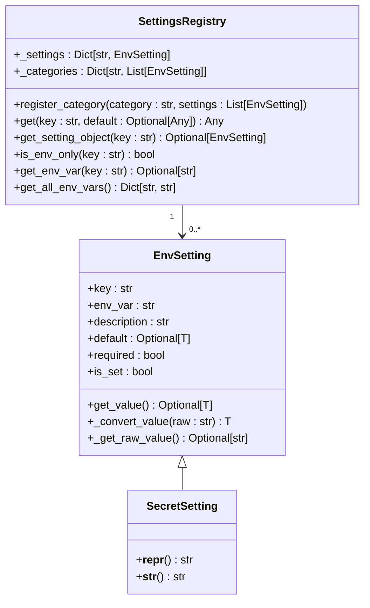
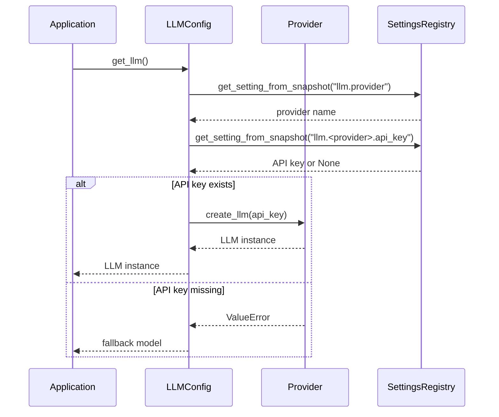
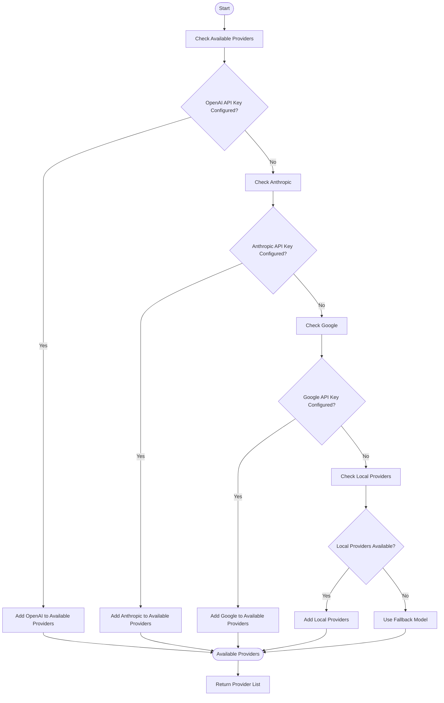
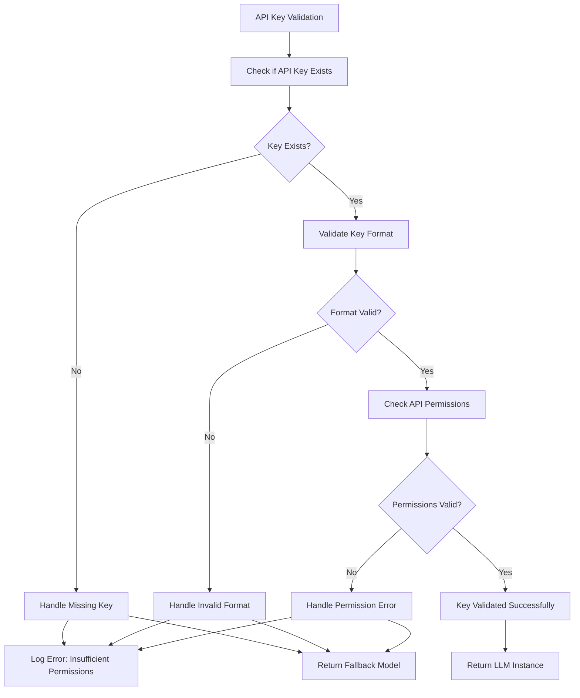

# API Key Environment Variables

<cite>
**Referenced Files in This Document**   
- [env_registry.py](file://src/local_deep_research/settings/env_registry.py)
- [env_settings.py](file://src/local_deep_research/settings/env_settings.py)
- [llm_config.py](file://src/local_deep_research/config/llm_config.py)
- [openai.py](file://src/local_deep_research/llm/providers/implementations/openai.py)
- [anthropic.py](file://src/local_deep_research/llm/providers/implementations/anthropic.py)
- [troubleshooting-openai-api-key.md](file://docs/troubleshooting-openai-api-key.md)
</cite>

## Table of Contents
1. [Introduction](#introduction)
2. [Configuration and Usage](#configuration-and-usage)
3. [Secure Loading and Validation](#secure-loading-and-validation)
4. [Provider Integration](#provider-integration)
5. [Multi-Provider Configurations](#multi-provider-configurations)
6. [Error Handling](#error-handling)
7. [Common Issues](#common-issues)
8. [Best Practices](#best-practices)
9. [Conclusion](#conclusion)

## Introduction
This document provides comprehensive guidance on managing API keys through environment variables for various LLM providers in the Local Deep Research system. It covers the configuration, validation, and secure usage of API credentials for OpenAI, Anthropic, Google, and other LLM providers. The system implements a robust environment variable management framework that ensures secure handling of sensitive credentials while providing flexibility for different deployment scenarios.

## Configuration and Usage
The API key management system uses environment variables prefixed with `LDR_` to configure credentials for various LLM providers. Each provider has a specific environment variable format that follows the pattern `LDR_LLM_<PROVIDER>_API_KEY`, where `<PROVIDER>` is the uppercase name of the provider.

For OpenAI integration, the system uses the `LDR_LLM_OPENAI_API_KEY` environment variable to store the API key. Similarly, Anthropic integration uses `LDR_LLM_ANTHROPIC_API_KEY`, and Google integration uses `LDR_LLM_GOOGLE_API_KEY`. These environment variables are automatically detected and loaded by the system during initialization.

The configuration system supports both direct environment variable assignment and fallback mechanisms. When multiple providers are configured, the system can automatically detect available providers and prioritize them based on configuration settings. The environment variable system allows for easy switching between providers without code changes, making it ideal for development, testing, and production environments.

**Section sources**
- [env_settings.py](file://src/local_deep_research/settings/env_settings.py#L195-L215)
- [llm_config.py](file://src/local_deep_research/config/llm_config.py#L53-63)
- [openai.py](file://src/local_deep_research/llm/providers/implementations/openai.py#L33)

## Secure Loading and Validation
The system implements a secure loading mechanism for API keys through the `SecretSetting` class in the environment settings module. This class extends the base `StringSetting` and provides additional security features for handling sensitive information.

When loading API keys, the system performs several validation steps:
1. Checks if the environment variable is set
2. Validates the format of the API key
3. Ensures the key meets minimum length requirements
4. Confirms the key follows the expected pattern for the provider

The `env_registry` module contains a global registry that manages all environment settings, including API keys. This registry provides a centralized location for accessing and validating environment variables. The registry also includes convenience functions for checking the availability of specific providers based on their API key configuration.

**Diagram sources**
- [env_settings.py](file://src/local_deep_research/settings/env_settings.py#L33-L215)
- [env_registry.py](file://src/local_deep_research/settings/env_registry.py#L14-L26)

**Section sources**
- [env_settings.py](file://src/local_deep_research/settings/env_settings.py#L195-L215)
- [env_registry.py](file://src/local_deep_research/settings/env_registry.py#L14-L26)

## Provider Integration
The system integrates with LLM providers through a modular provider architecture that uses factory functions to create LLM instances. Each provider implementation follows a consistent pattern for API key handling and validation.

For OpenAI integration, the `OpenAIProvider` class checks for the presence of the API key in the settings snapshot. If the key is not found, it raises a `ValueError` with a descriptive message. The provider uses the `get_setting_from_snapshot` function to retrieve the API key, which first checks the database settings and then falls back to environment variables.

Similarly, the `AnthropicProvider` class implements the same pattern, using the `llm.anthropic.api_key` setting key to retrieve the API key. Both providers include comprehensive error handling and logging to help diagnose configuration issues.

**Diagram sources**
- [llm_config.py](file://src/local_deep_research/config/llm_config.py#L283-L700)
- [openai.py](file://src/local_deep_research/llm/providers/implementations/openai.py#L46-L160)
- [anthropic.py](file://src/local_deep_research/llm/providers/implementations/anthropic.py#L46-L104)

**Section sources**
- [llm_config.py](file://src/local_deep_research/config/llm_config.py#L283-L700)
- [openai.py](file://src/local_deep_research/llm/providers/implementations/openai.py#L46-L160)
- [anthropic.py](file://src/local_deep_research/llm/providers/implementations/anthropic.py#L46-L104)

## Multi-Provider Configurations
The system supports multi-provider configurations through the `get_available_providers` function, which detects and returns all available LLM providers based on their API key configuration. This function performs availability checks for each provider and returns a dictionary of available providers with their display names.

When multiple providers are configured, the system can implement fallback strategies based on provider availability. The fallback mechanism first checks if API keys are configured for cloud providers (OpenAI, Anthropic, Google), then checks for local providers (Ollama, LM Studio, LlamaCpp). If no providers are available, the system can use a fallback model for testing purposes.

The configuration system allows for provider-specific settings, such as custom API endpoints, organization IDs, and request timeouts. These settings can be configured independently for each provider, enabling complex multi-provider scenarios.

**Diagram sources**
- [llm_config.py](file://src/local_deep_research/config/llm_config.py#L237-L274)
- [env_settings.py](file://src/local_deep_research/settings/env_settings.py#L195-L215)

**Section sources**
- [llm_config.py](file://src/local_deep_research/config/llm_config.py#L237-L274)

## Error Handling
The system implements comprehensive error handling for API key management, with specific strategies for different types of errors. When an API key is missing or invalid, the system follows a consistent error handling pattern across all providers.

For missing API keys, providers raise a `ValueError` with a descriptive message that includes the required setting key. This helps users identify and fix configuration issues. The error messages are designed to be user-friendly while providing sufficient technical detail for troubleshooting.

The system also handles authentication failures by validating API keys before making requests to provider APIs. If a key is invalid or has insufficient permissions, the system detects this during the provider availability check and prevents failed API calls.

**Diagram sources**
- [openai.py](file://src/local_deep_research/llm/providers/implementations/openai.py#L69-L74)
- [anthropic.py](file://src/local_deep_research/llm/providers/implementations/anthropic.py#L69-L74)
- [llm_config.py](file://src/local_deep_research/config/llm_config.py#L538-L542)

**Section sources**
- [openai.py](file://src/local_deep_research/llm/providers/implementations/openai.py#L69-L74)
- [anthropic.py](file://src/local_deep_research/llm/providers/implementations/anthropic.py#L69-L74)

## Common Issues
Several common issues can occur when configuring API keys through environment variables. The most frequent issue is missing or incorrectly formatted environment variables. Users often forget to prefix environment variable names with `LDR_` or use incorrect provider names in the variable names.

Another common issue is permission errors, where API keys have insufficient permissions for the required operations. This can occur when using API keys with restricted access or when the key has been revoked. The system provides clear error messages to help identify these issues.

Rate limiting is another common issue, particularly when using shared API keys or free-tier accounts. The system includes rate limiting detection and handling, with appropriate error messages when rate limits are exceeded.

Authentication failures can occur due to various reasons, including:
- Expired API keys
- Revoked API keys
- Incorrect API key format
- Network connectivity issues
- Provider API outages

The system provides diagnostic tools to help identify and resolve these issues, including logging and error reporting features.

**Section sources**
- [troubleshooting-openai-api-key.md](file://docs/troubleshooting-openai-api-key.md#L228-L249)
- [llm_config.py](file://src/local_deep_research/config/llm_config.py#L538-L542)
- [openai.py](file://src/local_deep_research/llm/providers/implementations/openai.py#L69-L74)

## Best Practices
To ensure secure and reliable API key management, follow these best practices:

1. **Environment Isolation**: Use different API keys for development, testing, and production environments. This prevents accidental usage of production keys in development and limits the impact of key leaks.

2. **Credential Masking**: Never commit API keys to version control. Use environment variables or secret management systems to store credentials securely.

3. **Key Rotation**: Regularly rotate API keys to minimize the impact of potential leaks. Set up a schedule for key rotation and document the process.

4. **Least Privilege**: Use API keys with the minimum required permissions for the application's needs. Avoid using administrator or full-access keys.

5. **Monitoring and Alerts**: Set up monitoring for API usage and configure alerts for unusual activity patterns that might indicate a security issue.

6. **Secure Storage**: Store API keys in secure locations, such as environment variables or dedicated secret management services. Avoid storing keys in configuration files.

7. **Access Control**: Restrict access to API keys to only those who need them. Use role-based access control to manage permissions.

8. **Audit Logs**: Maintain audit logs of API key usage to track access and detect potential security incidents.

9. **Backup Keys**: Maintain backup API keys in a secure location in case of emergencies or key revocation.

10. **Documentation**: Document the API key management process, including how keys are created, rotated, and revoked.

**Section sources**
- [troubleshooting-openai-api-key.md](file://docs/troubleshooting-openai-api-key.md#L245-L249)
- [env_settings.py](file://src/local_deep_research/settings/env_settings.py#L195-L215)

## Conclusion
The API key management system in Local Deep Research provides a secure and flexible way to handle credentials for various LLM providers. By using environment variables with a consistent naming convention, the system enables easy configuration across different environments while maintaining security best practices. The modular provider architecture allows for seamless integration with multiple LLM providers, and the comprehensive error handling ensures reliable operation even when configuration issues occur. Following the best practices outlined in this document will help ensure secure and efficient API key management in your deployment.