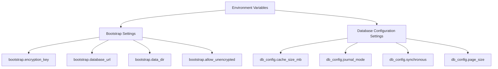
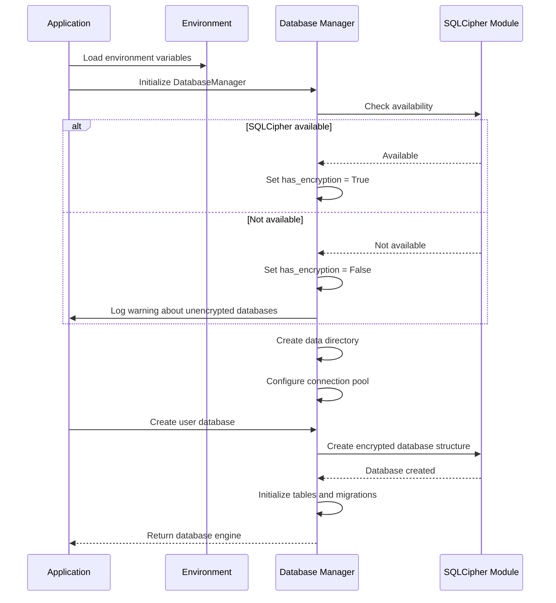
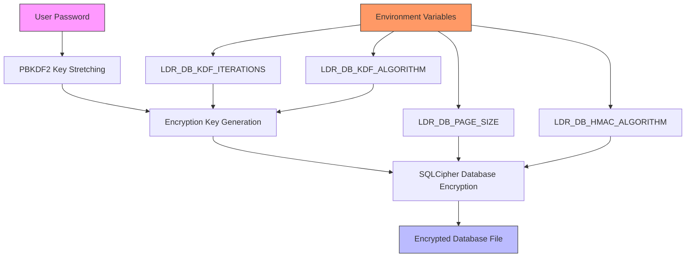
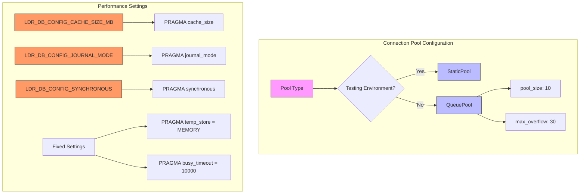

# Database Environment Variables

<cite>
**Referenced Files in This Document**   
- [db_config.py](file://src/local_deep_research/settings/env_definitions/db_config.py)
- [bootstrap.py](file://src/local_deep_research/settings/env_definitions/bootstrap.py)
- [encrypted_db.py](file://src/local_deep_research/database/encrypted_db.py)
- [sqlcipher_utils.py](file://src/local_deep_research/database/sqlcipher_utils.py)
- [env_settings.py](file://src/local_deep_research/settings/env_settings.py)
- [env_registry.py](file://src/local_deep_research/settings/env_registry.py)
</cite>

## Table of Contents
1. [Introduction](#introduction)
2. [Core Database Environment Variables](#core-database-environment-variables)
3. [Database Initialization Process](#database-initialization-process)
4. [SQLCipher Encryption Configuration](#sqlcipher-encryption-configuration)
5. [Connection Pooling and Performance Settings](#connection-pooling-and-performance-settings)
6. [Common Configuration Issues](#common-configuration-issues)
7. [Security Best Practices](#security-best-practices)
8. [Environment Variable Reference](#environment-variable-reference)

## Introduction

The database configuration system uses environment variables to control critical database parameters that must be established before database initialization. These settings are essential for configuring both the database connection and encryption parameters, particularly for the SQLCipher encrypted database system. The environment-based configuration approach ensures that these foundational settings are available during the application bootstrap phase, before any database connections are established.

The configuration system is divided into two main categories: bootstrap settings required for application initialization and database-specific settings that control SQLite and SQLCipher behavior. This separation ensures that critical security and path settings are available early in the application lifecycle, while performance and storage settings can be tuned for specific deployment environments.

**Section sources**
- [env_settings.py](file://src/local_deep_research/settings/env_settings.py#L1-L348)
- [env_registry.py](file://src/local_deep_research/settings/env_registry.py#L1-L112)

## Core Database Environment Variables

The database configuration system relies on several key environment variables that control database connectivity, encryption, and initialization. These variables are processed during application startup and cannot be modified through the application interface once the database is initialized.

The primary environment variables include:

- **DATABASE_URL**: Specifies the database connection string, though in the current implementation this is primarily used for configuration documentation rather than direct connection management
- **SQLCIPHER_PASSWORD**: The encryption key used for SQLCipher-encrypted databases, passed through the application authentication system
- **DATABASE_TIMEOUT**: Connection timeout settings that control how long the application waits for database operations to complete
- **LDR_DB_CONFIG_CACHE_SIZE_MB**: Configures the SQLite cache size in megabytes for improved performance
- **LDR_DB_CONFIG_JOURNAL_MODE**: Sets the SQLite journal mode, with WAL (Write-Ahead Logging) as the default for optimal concurrency

These environment variables follow a consistent naming convention, with all variables prefixed with "LDR_" to avoid conflicts with system variables. The naming structure uses underscores to separate components, with the pattern LDR_[CATEGORY]_[SETTING_NAME] for easy identification and organization.

**Diagram sources**
- [bootstrap.py](file://src/local_deep_research/settings/env_definitions/bootstrap.py#L1-L60)
- [db_config.py](file://src/local_deep_research/settings/env_definitions/db_config.py#L1-L73)

**Section sources**
- [bootstrap.py](file://src/local_deep_research/settings/env_definitions/bootstrap.py#L1-L60)
- [db_config.py](file://src/local_deep_research/settings/env_definitions/db_config.py#L1-L73)

## Database Initialization Process

The database initialization process begins with the evaluation of environment variables to determine the database configuration. During application startup, the system checks for the presence of SQLCipher support and configures the database accordingly. If SQLCipher is available, the system initializes encrypted databases; otherwise, it falls back to unencrypted SQLite databases with appropriate warnings.

The initialization sequence follows these steps:
1. Environment variables are loaded and validated
2. SQLCipher availability is tested through a runtime check
3. Database paths are established based on the data directory setting
4. Connection parameters are configured based on environment settings
5. The database engine is created with appropriate pooling and timeout settings
6. Database tables are initialized or migrated as needed

When creating a new user database, the system first verifies the encryption key's validity before proceeding with database creation. The database structure is created using raw SQLCipher commands outside of SQLAlchemy's DDL execution to avoid memory issues, particularly in Flask environments. After the basic structure is in place, SQLAlchemy is used to manage subsequent operations and ensure consistency.

**Diagram sources**
- [encrypted_db.py](file://src/local_deep_research/database/encrypted_db.py#L1-L621)
- [initialize.py](file://src/local_deep_research/database/initialize.py#L1-L219)

**Section sources**
- [encrypted_db.py](file://src/local_deep_research/database/encrypted_db.py#L1-L621)
- [initialize.py](file://src/local_deep_research/database/initialize.py#L1-L219)

## SQLCipher Encryption Configuration

The SQLCipher encryption system provides transparent database encryption using industry-standard cryptographic algorithms. The encryption configuration is controlled through environment variables that set key derivation parameters, page sizes, and integrity checking algorithms.

Key configuration parameters include:
- **LDR_DB_KDF_ITERATIONS**: Controls the number of iterations in the key derivation function, with higher values providing greater security against brute force attacks but increasing database opening time
- **LDR_DB_PAGE_SIZE**: Sets the database page size, which affects performance and memory usage
- **LDR_DB_HMAC_ALGORITHM**: Specifies the HMAC algorithm used for database integrity verification
- **LDR_DB_KDF_ALGORITHM**: Determines the key derivation function algorithm

The system uses PBKDF2 with HMAC-SHA512 as the default key derivation mechanism, with 256,000 iterations to provide strong protection against password cracking attempts. When a user database is created, the password is used to generate an encryption key through the PBKDF2 key stretching algorithm. This key is then used to encrypt the database at the page level by SQLCipher.

The encryption process uses a placeholder salt (b"no salt") for PBKDF2 key stretching, while relying on SQLCipher's internal per-database salting mechanism for actual encryption. This design ensures that each database has a unique salt while maintaining compatibility across different deployment environments.

**Diagram sources**
- [sqlcipher_utils.py](file://src/local_deep_research/database/sqlcipher_utils.py#L1-L267)
- [encrypted_db.py](file://src/local_deep_research/database/encrypted_db.py#L1-L621)

**Section sources**
- [sqlcipher_utils.py](file://src/local_deep_research/database/sqlcipher_utils.py#L1-L267)
- [encrypted_db.py](file://src/local_deep_research/database/encrypted_db.py#L1-L621)

## Connection Pooling and Performance Settings

The database connection system implements a sophisticated pooling strategy to balance performance and resource usage. The connection pool configuration adapts based on the execution environment, using different settings for testing versus production deployments.

In production environments, the system uses SQLAlchemy's QueuePool with a pool size of 10 connections and a maximum overflow of 30 connections. This configuration ensures that the application can handle bursts of concurrent database operations without exhausting system resources. In testing environments, the system switches to StaticPool to avoid connection locking issues that can occur during test execution.

Performance tuning is achieved through several configurable parameters:
- **Cache size**: Configured via LDR_DB_CONFIG_CACHE_SIZE_MB, controlling the amount of memory dedicated to caching database pages
- **Journal mode**: Set to WAL (Write-Ahead Logging) by default, allowing concurrent reads during writes and improving overall throughput
- **Synchronous mode**: Configured as NORMAL, providing a balance between data safety and write performance
- **Busy timeout**: Set to 10 seconds, determining how long the system waits when the database is locked before raising an exception

The system also applies performance-related PRAGMA settings to optimize database operations, including memory-based temporary storage and appropriate cache sizing based on the configured cache size.

**Diagram sources**
- [encrypted_db.py](file://src/local_deep_research/database/encrypted_db.py#L1-L621)
- [sqlcipher_utils.py](file://src/local_deep_research/database/sqlcipher_utils.py#L1-L267)

**Section sources**
- [encrypted_db.py](file://src/local_deep_research/database/encrypted_db.py#L1-L621)
- [sqlcipher_utils.py](file://src/local_deep_research/database/sqlcipher_utils.py#L1-L267)

## Common Configuration Issues

Several common issues can arise when configuring the database environment variables, particularly related to encryption setup and connection parameters.

**Connection Failures**: These typically occur when SQLCipher is not properly installed or when the database URL points to a non-existent path. The system requires the sqlcipher3 or sqlcipher3-binary Python package and the underlying SQLCipher library to be installed on the system. When SQLCipher is unavailable, the system can operate in unencrypted mode if LDR_ALLOW_UNENCRYPTED is set to "true", but this is not recommended for production use.

**Password Mismatches**: Since the database is encrypted with a user-provided password, any discrepancy between the password used for creation and access will result in connection failures. The system verifies the password by attempting to read from the database after key setup, ensuring that the correct password is being used.

**Schema Initialization Problems**: These can occur when the database structure becomes corrupted or when migration scripts fail to execute properly. The system includes integrity checking through PRAGMA quick_check and PRAGMA cipher_integrity_check commands to verify database health. If integrity issues are detected, the database may need to be recreated from backup.

**Environment Variable Conflicts**: Issues can arise when environment variables are not properly formatted or when there are conflicts between different configuration sources. The system follows a strict naming convention (LDR_[CATEGORY]_[SETTING_NAME]) to minimize conflicts and provides clear error messages when required variables are missing or invalid.

**Section sources**
- [encrypted_db.py](file://src/local_deep_research/database/encrypted_db.py#L1-L621)
- [encryption_check.py](file://src/local_deep_research/database/encryption_check.py#L87-L103)

## Security Best Practices

When deploying the application in production environments, several security best practices should be followed to protect database credentials and ensure data confidentiality.

**Credential Management**: Database encryption keys should never be hardcoded in configuration files or version control systems. Instead, they should be managed through secure environment variable management systems or secret management services. The application uses the SecretSetting class to hide sensitive values in logs and debugging output.

**Environment Isolation**: Different environments (development, staging, production) should use separate database configurations and encryption keys. This prevents accidental data exposure and limits the impact of configuration errors.

**Regular Backups**: Encrypted databases should be backed up regularly, with backups also stored securely. Since the database cannot be accessed without the correct password, backup procedures should include secure password management.

**Access Control**: File system permissions should be configured to restrict access to database files to only the application process and authorized administrators. This provides an additional layer of protection beyond database encryption.

**Monitoring and Alerts**: Systems should be in place to monitor for repeated failed database connection attempts, which could indicate brute force attacks or configuration issues.

**Section sources**
- [encrypted_db.py](file://src/local_deep_research/database/encrypted_db.py#L1-L621)
- [env_settings.py](file://src/local_deep_research/settings/env_settings.py#L1-L348)

## Environment Variable Reference

The following table provides a comprehensive reference for all database-related environment variables:

| Environment Variable | Default Value | Description | Category |
|----------------------|-------------|-------------|----------|
| LDR_BOOTSTRAP_ENCRYPTION_KEY | None | Database encryption key for SQLCipher databases | Bootstrap |
| LDR_BOOTSTRAP_DATABASE_URL | None | Database connection URL | Bootstrap |
| LDR_BOOTSTRAP_DATA_DIR | ./data | Path to the data directory | Bootstrap |
| LDR_BOOTSTRAP_ALLOW_UNENCRYPTED | false | Allow operation without SQLCipher encryption | Bootstrap |
| LDR_DB_CONFIG_CACHE_SIZE_MB | 100 | SQLite cache size in MB | Database Configuration |
| LDR_DB_CONFIG_JOURNAL_MODE | WAL | SQLite journal mode | Database Configuration |
| LDR_DB_CONFIG_SYNCHRONOUS | NORMAL | SQLite synchronous mode | Database Configuration |
| LDR_DB_CONFIG_PAGE_SIZE | 4096 | SQLite page size in bytes | Database Configuration |
| LDR_DB_KDF_ITERATIONS | 256000 | Number of KDF iterations for key derivation | SQLCipher Configuration |
| LDR_DB_KDF_ALGORITHM | PBKDF2_HMAC_SHA512 | Key derivation function algorithm | SQLCipher Configuration |
| LDR_DB_HMAC_ALGORITHM | HMAC_SHA512 | HMAC algorithm for database integrity | SQLCipher Configuration |
| LDR_DB_PAGE_SIZE | 16384 | SQLCipher page size in bytes | SQLCipher Configuration |

**Section sources**
- [bootstrap.py](file://src/local_deep_research/settings/env_definitions/bootstrap.py#L1-L60)
- [db_config.py](file://src/local_deep_research/settings/env_definitions/db_config.py#L1-L73)
- [sqlcipher_utils.py](file://src/local_deep_research/database/sqlcipher_utils.py#L1-L267)