# Environment Variables

<cite>
**Referenced Files in This Document**   
- [env_registry.py](file://src/local_deep_research/settings/env_registry.py)
- [env_settings.py](file://src/local_deep_research/settings/env_settings.py)
- [bootstrap.py](file://src/local_deep_research/settings/env_definitions/bootstrap.py)
- [db_config.py](file://src/local_deep_research/settings/env_definitions/db_config.py)
- [security.py](file://src/local_deep_research/settings/env_definitions/security.py)
- [testing.py](file://src/local_deep_research/settings/env_definitions/testing.py)
- [env_configuration.md](file://docs/env_configuration.md)
- [manager.py](file://src/local_deep_research/settings/manager.py)
- [show_env_vars.py](file://examples/show_env_vars.py)
</cite>

## Table of Contents
1. [Introduction](#introduction)
2. [Environment Variable Categories](#environment-variable-categories)
3. [Security Settings](#security-settings)
4. [Database Configuration](#database-configuration)
5. [API Keys](#api-keys)
6. [Performance Tuning](#performance-tuning)
7. [Environment Registry System](#environment-registry-system)
8. [Bootstrap Process](#bootstrap-process)
9. [Settings Manager](#settings-manager)
10. [Configuration Examples](#configuration-examples)
11. [Security Best Practices](#security-best-practices)
12. [Environment Isolation](#environment-isolation)

## Introduction

The Local Deep Research application uses a comprehensive environment variable system to manage configuration across different deployment scenarios. This system allows for flexible configuration of security settings, database parameters, API credentials, and performance tuning options. The environment variable framework is designed to support multiple environments (development, testing, production) while maintaining security and consistency across deployments.

The configuration system is built around a hierarchical structure where environment variables take precedence over database-stored settings, enabling easy customization without modifying persistent configuration. This document provides a comprehensive overview of the environment variable system, including the purpose and usage of each category, the registration and validation process, and best practices for secure configuration.

**Section sources**
- [env_configuration.md](file://docs/env_configuration.md#L1-L202)

## Environment Variable Categories

The environment variable system is organized into distinct categories based on their purpose and timing of use in the application lifecycle. These categories include bootstrap settings required before database initialization, database configuration parameters, security settings, testing flags, and news scheduler configurations. Each category serves a specific role in the application's operation and is registered in the global environment registry.

The categorization enables logical grouping of related settings and facilitates targeted configuration for different deployment scenarios. For example, bootstrap settings are essential for initializing the application environment, while testing settings control behavior in test and CI/CD environments. This structured approach ensures that settings are organized in a way that reflects their functional purpose and dependencies.

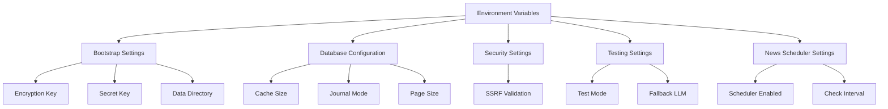

**Diagram sources**
- [env_definitions/__init__.py](file://src/local_deep_research/settings/env_definitions/__init__.py#L1-L28)
- [bootstrap.py](file://src/local_deep_research/settings/env_definitions/bootstrap.py#L1-L61)
- [db_config.py](file://src/local_deep_research/settings/env_definitions/db_config.py#L1-L73)
- [security.py](file://src/local_deep_research/settings/env_definitions/security.py#L1-L24)
- [testing.py](file://src/local_deep_research/settings/env_definitions/testing.py#L1-L35)

## Security Settings

Security settings in the Local Deep Research application are designed to protect sensitive data and control access to critical functionality. The primary security settings include encryption keys for database protection and application secret keys for session management. These settings are implemented as SecretSetting objects, which provide special handling to prevent accidental exposure of sensitive values.

The ENCRYPTION_KEY setting is used to encrypt the application database, ensuring that sensitive research data remains protected even if the database file is accessed directly. The SECRET_KEY is used for session encryption and CSRF protection, helping to prevent cross-site request forgery attacks. Both settings are marked as sensitive and are masked in logs and debugging output to prevent accidental exposure.

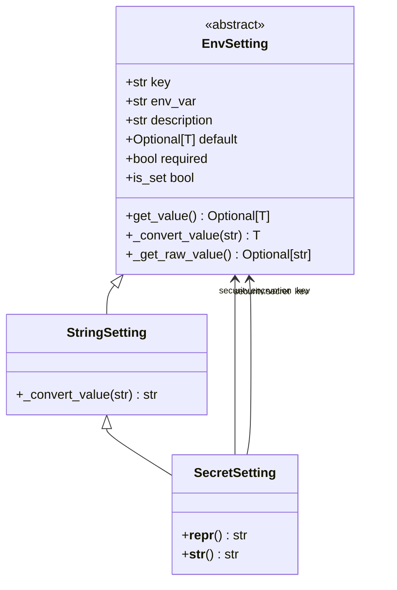

**Diagram sources**
- [env_settings.py](file://src/local_deep_research/settings/env_settings.py#L33-L215)
- [bootstrap.py](file://src/local_deep_research/settings/env_definitions/bootstrap.py#L19-L27)

## Database Configuration

Database configuration settings control the SQLite and SQLCipher database parameters that must be established before opening the database connection. These settings include performance parameters such as cache size and journal mode, storage settings like page size, and encryption parameters including KDF iterations and algorithms. The database configuration is critical for optimizing performance and ensuring data integrity.

The DATABASE_URL setting specifies the connection URL for the database, allowing for flexible configuration of database location and type. Performance settings like cache_size_mb and journal_mode can significantly impact database performance, with WAL (Write-Ahead Logging) mode recommended for concurrent access scenarios. Encryption settings such as kdf_iterations control the security level of database encryption, with higher values providing stronger protection at the cost of increased initialization time.

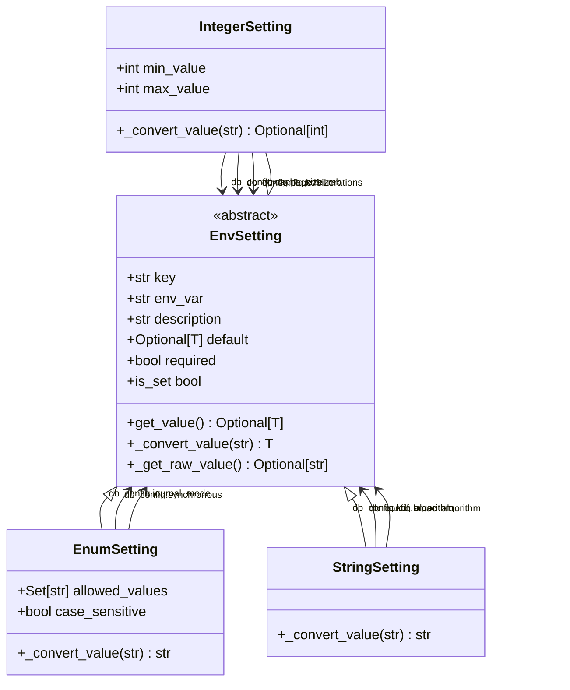

**Diagram sources**
- [env_settings.py](file://src/local_deep_research/settings/env_settings.py#L114-L256)
- [db_config.py](file://src/local_deep_research/settings/env_definitions/db_config.py#L1-L73)

## API Keys

API keys are used to authenticate with external services such as OpenAI, Anthropic, and various search engines. These keys are implemented as SecretSetting objects to ensure they are handled securely and not exposed in logs or debugging output. The application requires API keys to be set both with and without the LDR_ prefix to ensure compatibility across different components.

The OPENAI_API_KEY and ANTHROPIC_API_KEY settings provide access to their respective LLM services, enabling the application to generate research content and perform natural language processing. Other API keys such as SERP_API_KEY and BRAVE_API_KEY enable integration with search engines for information retrieval. Proper configuration of these keys is essential for the application's core functionality.

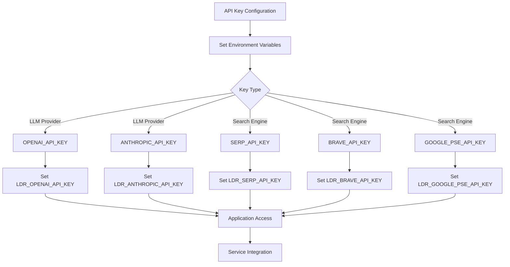

**Diagram sources**
- [env_settings.py](file://src/local_deep_research/settings/env_settings.py#L195-L215)
- [env_configuration.md](file://docs/env_configuration.md#L36-L62)

## Performance Tuning

Performance tuning settings control the application's resource usage and concurrency behavior. The MAX_WORKERS setting determines the maximum number of worker threads in the global thread pool, which affects the application's ability to handle concurrent search operations. The THREAD_TIMEOUT setting controls how long threads will wait before timing out, helping to prevent resource exhaustion during long-running operations.

These settings are particularly important in production environments where resource constraints and performance requirements must be carefully balanced. The MAX_WORKERS value should be set based on the available CPU cores and expected workload, with higher values enabling more concurrent operations but potentially increasing memory usage. The THREAD_TIMEOUT setting helps ensure that operations don't hang indefinitely, providing better resilience in the face of network issues or service outages.

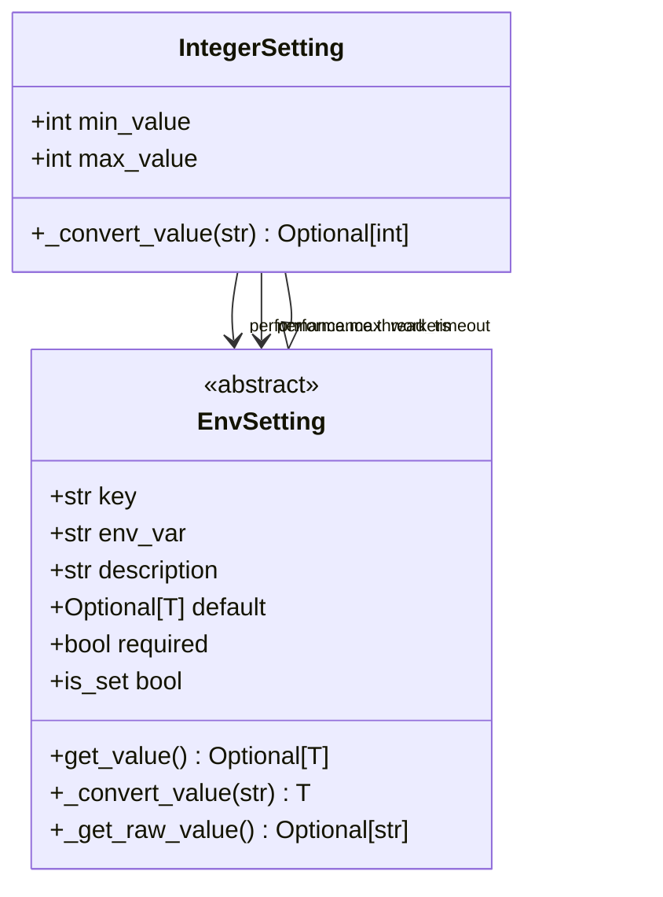

**Diagram sources**
- [env_settings.py](file://src/local_deep_research/settings/env_settings.py#L114-L149)
- [parallel_search_engine.py](file://src/local_deep_research/web_search_engines/engines/parallel_search_engine.py#L23-L61)

## Environment Registry System

The environment registry system is the core component that manages all environment-only settings in the application. It provides a centralized registry for defining, validating, and accessing environment variables, ensuring consistent handling across the codebase. The registry is implemented as a singleton instance that is created during application initialization and made available globally.

The registry system supports different types of settings through specialized classes such as BooleanSetting, StringSetting, IntegerSetting, PathSetting, SecretSetting, and EnumSetting. Each setting type includes validation and conversion logic appropriate to its data type. The registry also provides convenience functions for common checks such as test mode and CI environment detection.

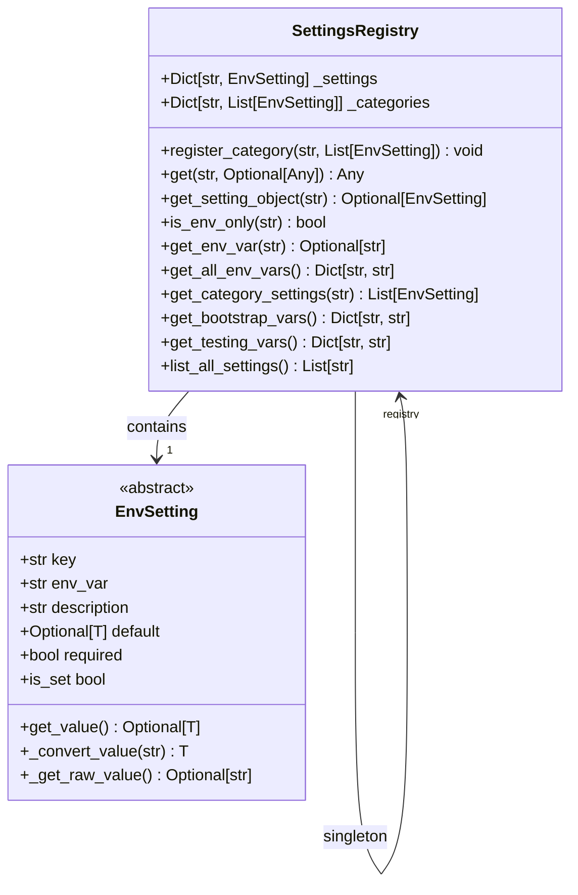

**Diagram sources**
- [env_registry.py](file://src/local_deep_research/settings/env_registry.py#L1-L112)
- [env_settings.py](file://src/local_deep_research/settings/env_settings.py#L257-L335)

## Bootstrap Process

The bootstrap process initializes the environment definitions and sets up the application's core configuration before database access is required. This process is critical because certain settings, such as encryption keys and database URLs, are needed to establish the database connection itself. The bootstrap settings are defined in the bootstrap.py file and include essential configuration for security, database access, and system paths.

During the bootstrap process, the application reads environment variables and applies them to configure the initial state. This includes setting up the data directory, configuration directory, and log directory paths. The process also handles the encryption key and secret key configuration, which are essential for securing the database and application sessions. The bootstrap process ensures that all prerequisites for database initialization are met before attempting to connect to the database.

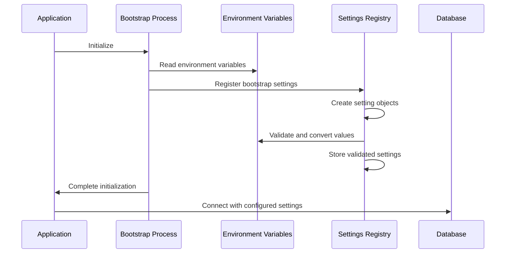

**Diagram sources**
- [bootstrap.py](file://src/local_deep_research/settings/env_definitions/bootstrap.py#L1-L61)
- [env_registry.py](file://src/local_deep_research/settings/env_registry.py#L14-L26)
- [env_settings.py](file://src/local_deep_research/settings/env_settings.py#L30-L215)

## Settings Manager

The SettingsManager class provides a unified interface for managing application settings, combining environment variables with database-stored configuration. It implements the ISettingsManager interface and provides methods for getting, setting, and deleting settings while handling the priority between environment variables and database values. The manager ensures that environment variables take precedence over database settings, allowing for flexible configuration without modifying persistent data.

The SettingsManager includes features such as thread safety checks, settings locking, and automatic initialization of default settings. It also provides methods for importing and exporting settings, enabling backup and migration scenarios. The manager handles type conversion and validation, ensuring that settings are properly formatted before being used by the application.

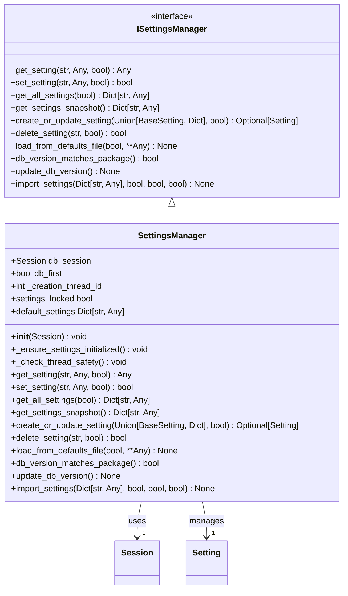

**Diagram sources**
- [manager.py](file://src/local_deep_research/settings/manager.py#L197-L800)
- [base.py](file://src/local_deep_research/settings/base.py)

## Configuration Examples

The application supports various deployment scenarios through different .env file configurations. For development environments, a minimal configuration with basic settings is typically sufficient. Production deployments require more comprehensive configuration including security settings, database optimization parameters, and API keys for external services.

Example configurations include a development setup with unencrypted database access, a production setup with encrypted database and performance tuning, and a testing configuration with mock services. Each configuration scenario demonstrates how environment variables can be combined to achieve the desired behavior for different deployment contexts.

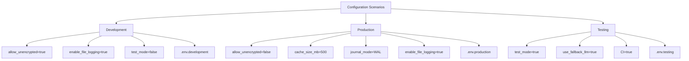

**Diagram sources**
- [env_configuration.md](file://docs/env_configuration.md#L28-L62)
- [show_env_vars.py](file://examples/show_env_vars.py#L17-L65)

## Security Best Practices

Security best practices for handling environment variables include using .env files for local development, avoiding hardcoding sensitive values in source code, and using appropriate file permissions to protect configuration files. Sensitive credentials such as API keys and encryption keys should never be committed to version control systems.

For production deployments, environment variables should be set through secure mechanisms such as Docker secrets, Kubernetes secrets, or cloud provider secret management services. The application's SecretSetting class helps protect sensitive values by masking them in logs and debugging output, but additional precautions should be taken to ensure that environment variables are not exposed through error messages or debugging interfaces.

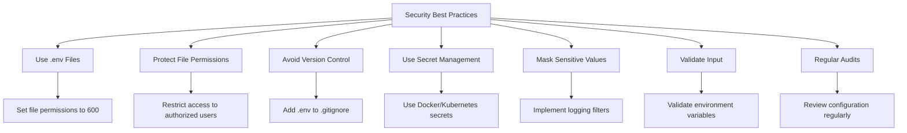

**Diagram sources**
- [env_settings.py](file://src/local_deep_research/settings/env_settings.py#L195-L215)
- [security.py](file://src/local_deep_research/settings/env_definitions/security.py#L1-L24)

## Environment Isolation

Environment isolation is achieved through separate configuration for development, testing, and production environments. Each environment has its own set of environment variables that control behavior specific to that context. For example, development environments may use unencrypted databases and mock services, while production environments require encrypted storage and real API credentials.

The application supports environment-specific configuration through different .env files and environment variable prefixes. This isolation prevents configuration leakage between environments and ensures that sensitive production credentials are not accidentally used in development or testing contexts. The testing.py file defines specific settings for test mode, including flags to enable mock LLM services and disable rate limiting.

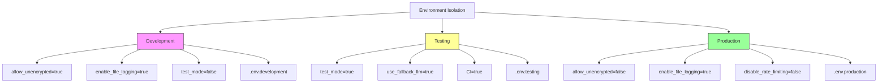

**Diagram sources**
- [testing.py](file://src/local_deep_research/settings/env_definitions/testing.py#L1-L35)
- [env_configuration.md](file://docs/env_configuration.md#L5-L8)