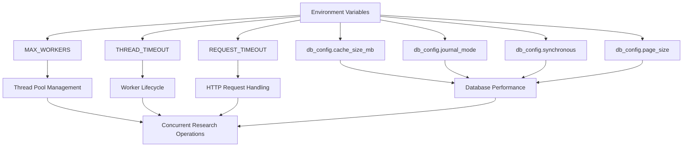
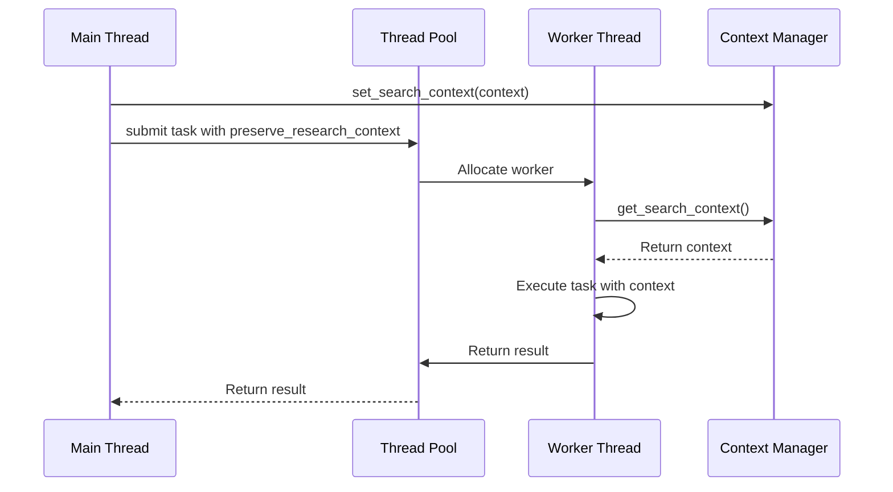

# Performance & Threading Environment Variables

<cite>
**Referenced Files in This Document**   
- [env_settings.py](file://src/local_deep_research/settings/env_settings.py)
- [thread_settings.py](file://src/local_deep_research/config/thread_settings.py)
- [threading_utils.py](file://src/local_deep_research/utilities/threading_utils.py)
- [thread_context.py](file://src/local_deep_research/utilities/thread_context.py)
- [env_registry.py](file://src/local_deep_research/settings/env_registry.py)
- [bootstrap.py](file://src/local_deep_research/settings/env_definitions/bootstrap.py)
- [db_config.py](file://src/local_deep_research/settings/env_definitions/db_config.py)
- [testing.py](file://src/local_deep_research/settings/env_definitions/testing.py)
- [parallel_search_engine.py](file://src/local_deep_research/web_search_engines/engines/parallel_search_engine.py)
- [safe_requests.py](file://src/local_deep_research/security/safe_requests.py)
</cite>

## Table of Contents
1. [Introduction](#introduction)
2. [Performance-Related Environment Variables](#performance-related-environment-variables)
3. [Threading Model and Worker Management](#threading-model-and-worker-management)
4. [Optimal Configuration Profiles](#optimal-configuration-profiles)
5. [Common Performance Issues and Solutions](#common-performance-issues-and-solutions)
6. [Monitoring and Tuning Guidance](#monitoring-and-tuning-guidance)
7. [Conclusion](#conclusion)

## Introduction
This document provides comprehensive guidance on performance tuning through environment variables in the local deep research system. The system leverages environment variables to control critical performance parameters that affect concurrent research operations, thread pool management, and system responsiveness. These settings are essential for optimizing throughput and stability under various load conditions and hardware configurations. The environment variable system is designed to provide early configuration before database initialization, allowing for fine-grained control over system behavior from the earliest stages of application startup.

**Section sources**
- [env_settings.py](file://src/local_deep_research/settings/env_settings.py#L1-L348)
- [env_registry.py](file://src/local_deep_research/settings/env_registry.py#L1-L112)

## Performance-Related Environment Variables

### MAX_WORKERS
The `MAX_WORKERS` environment variable controls the maximum number of worker threads in the global thread pool used for parallel search operations. This setting directly impacts the system's ability to handle concurrent research tasks and should be tuned based on available CPU cores and workload characteristics.

When not explicitly set, the system uses Python's recommended formula for I/O-bound operations: `min(32, (os.cpu_count() or 1) + 4)`. This default balances resource utilization with the overhead of thread management. Higher values can improve throughput for I/O-intensive operations but may lead to resource contention on CPU-constrained systems.

### THREAD_TIMEOUT
The `THREAD_TIMEOUT` setting defines the maximum duration (in seconds) that a worker thread will wait for a task to complete before being terminated. This timeout prevents individual operations from indefinitely blocking thread resources and helps maintain system responsiveness during network delays or unresponsive services.

The timeout mechanism works in conjunction with the global thread pool to ensure that stalled operations do not accumulate and exhaust available threads. When a thread times out, it is properly cleaned up and returned to the pool for reuse, preventing thread leaks.

### REQUEST_TIMEOUT
The `REQUEST_TIMEOUT` environment variable sets the maximum time (in seconds) for HTTP requests to external search engines and APIs. This setting is critical for maintaining system stability when interacting with potentially unreliable external services.

The request timeout works with the safe request framework to prevent indefinite blocking on network operations. When a request exceeds this timeout, a `requests.Timeout` exception is raised, allowing the calling code to handle the failure gracefully and release associated resources.

### Additional Performance Settings
The system includes several other performance-related environment variables:

- `db_config.cache_size_mb`: Controls SQLite cache size in MB (default: 100MB)
- `db_config.journal_mode`: Sets SQLite journal mode (default: WAL)
- `db_config.synchronous`: Configures SQLite synchronous mode (default: NORMAL)
- `db_config.page_size`: Specifies SQLite page size (default: 4096 bytes)

These database configuration settings must be established before database initialization and significantly impact I/O performance and data integrity.



**Diagram sources**
- [env_settings.py](file://src/local_deep_research/settings/env_settings.py#L114-L149)
- [db_config.py](file://src/local_deep_research/settings/env_definitions/db_config.py#L18-L72)
- [safe_requests.py](file://src/local_deep_research/security/safe_requests.py#L78-L117)

**Section sources**
- [env_settings.py](file://src/local_deep_research/settings/env_settings.py#L1-L348)
- [db_config.py](file://src/local_deep_research/settings/env_definitions/db_config.py#L1-L73)
- [safe_requests.py](file://src/local_deep_research/security/safe_requests.py#L78-L117)

## Threading Model and Worker Management

### Global Thread Pool Architecture
The system implements a global thread pool architecture using Python's `ThreadPoolExecutor` to manage worker threads efficiently. This approach prevents the creation of multiple thread pools and ensures that the total number of threads does not exceed expected limits.

The global executor is lazily initialized and thread-safely managed using a lock mechanism. This ensures that only one thread pool is created regardless of how many components request access to it. The shared executor pattern conserves system resources and provides predictable performance characteristics.

### Worker Lifecycle Management
Worker threads follow a well-defined lifecycle that includes proper initialization, execution, and cleanup phases. Each thread is responsible for managing its own context and resources, with mechanisms in place to handle graceful shutdown and error recovery.

The system uses thread-local storage to maintain settings context and research context across thread boundaries. This ensures that each worker thread has access to the necessary configuration and state information without requiring database access during execution.

### Context Propagation
Research context is propagated across thread boundaries using the `preserve_research_context` decorator. This decorator captures the current research context before a task is submitted to the thread pool and restores it when the task executes in the worker thread.

This context propagation mechanism ensures that metrics tracking, logging, and other context-dependent operations function correctly even when work is distributed across multiple threads. The system also supports Flask application context propagation for web request handling.



**Diagram sources**
- [parallel_search_engine.py](file://src/local_deep_research/web_search_engines/engines/parallel_search_engine.py#L17-L36)
- [threading_utils.py](file://src/local_deep_research/utilities/threading_utils.py#L1-L105)
- [thread_context.py](file://src/local_deep_research/utilities/thread_context.py#L1-L100)

**Section sources**
- [thread_settings.py](file://src/local_deep_research/config/thread_settings.py#L1-L127)
- [threading_utils.py](file://src/local_deep_research/utilities/threading_utils.py#L1-L105)
- [thread_context.py](file://src/local_deep_research/utilities/thread_context.py#L1-L100)

## Optimal Configuration Profiles

### Development Environment
For development workstations with limited resources, the following configuration is recommended:

```bash
# Development profile
LDR_MAX_WORKERS=4
LDR_THREAD_TIMEOUT=60
LDR_REQUEST_TIMEOUT=30
LDR_DB_CONFIG_CACHE_SIZE_MB=50
LDR_DB_CONFIG_JOURNAL_MODE=DELETE
```

This configuration prioritizes stability and resource conservation over maximum throughput, making it suitable for local development and debugging.

### Production Server (8-core)
For production servers with 8 CPU cores and ample RAM:

```bash
# Production profile (8-core)
LDR_MAX_WORKERS=16
LDR_THREAD_TIMEOUT=120
LDR_REQUEST_TIMEOUT=60
LDR_DB_CONFIG_CACHE_SIZE_MB=500
LDR_DB_CONFIG_JOURNAL_MODE=WAL
LDR_DB_CONFIG_SYNCHRONOUS=NORMAL
```

This configuration balances concurrency with system stability, allowing for high throughput while maintaining data integrity.

### High-Performance Cluster
For high-performance computing environments with abundant resources:

```bash
# High-performance profile
LDR_MAX_WORKERS=32
LDR_THREAD_TIMEOUT=180
LDR_REQUEST_TIMEOUT=90
LDR_DB_CONFIG_CACHE_SIZE_MB=1000
LDR_DB_CONFIG_JOURNAL_MODE=WAL
LDR_DB_CONFIG_SYNCHRONOUS=OFF
LDR_DB_CONFIG_PAGE_SIZE=65536
```

This aggressive configuration maximizes throughput at the potential cost of increased resource consumption and reduced data safety during power failures.

**Section sources**
- [db_config.py](file://src/local_deep_research/settings/env_definitions/db_config.py#L18-L72)
- [bootstrap.py](file://src/local_deep_research/settings/env_definitions/bootstrap.py#L18-L60)

## Common Performance Issues and Solutions

### Thread Deadlocks
Thread deadlocks can occur when multiple threads wait for resources held by each other. The system mitigates this risk through:

1. Using a global thread pool with bounded size
2. Implementing timeout mechanisms for all operations
3. Avoiding nested locks in critical paths

To resolve deadlock issues, reduce `MAX_WORKERS` to limit concurrency and ensure all operations have appropriate timeouts.

### Timeout Exceptions
Timeout exceptions typically indicate that operations are taking longer than expected. Common causes include:

- Network latency to external services
- Database performance bottlenecks
- CPU resource contention

Solutions include increasing `REQUEST_TIMEOUT` and `THREAD_TIMEOUT` values, optimizing database configuration, or scaling hardware resources.

### Resource Exhaustion
Resource exhaustion occurs when the system consumes excessive memory or CPU. This can be prevented by:

1. Monitoring thread pool utilization
2. Setting appropriate `MAX_WORKERS` values
3. Configuring database cache size appropriately

The system's thread-safe executor initialization prevents the creation of multiple thread pools, which could otherwise lead to uncontrolled resource consumption.

**Section sources**
- [threading_utils.py](file://src/local_deep_research/utilities/threading_utils.py#L1-L105)
- [safe_requests.py](file://src/local_deep_research/security/safe_requests.py#L78-L117)
- [test_search_cache_stampede.py](file://tests/test_search_cache_stampede.py#L75-L112)

## Monitoring and Tuning Guidance

### Performance Monitoring
Effective performance tuning requires monitoring key metrics:

- Thread pool utilization
- Request success/failure rates
- Database query performance
- Memory consumption

The system provides built-in metrics tracking that can be accessed through the settings manager and search tracker components.

### Tuning Methodology
When tuning performance settings:

1. Start with conservative values and gradually increase
2. Monitor system behavior under realistic workloads
3. Adjust one parameter at a time to isolate effects
4. Document configuration changes and their impacts

Use the default values as a baseline, then adjust based on observed performance and resource utilization.

### Load Testing
Before deploying configuration changes to production, conduct load testing to validate performance improvements. The system includes testing utilities that can simulate concurrent research operations to evaluate the effectiveness of configuration changes.

**Section sources**
- [env_settings.py](file://src/local_deep_research/settings/env_settings.py#L1-L348)
- [thread_settings.py](file://src/local_deep_research/config/thread_settings.py#L1-L127)

## Conclusion
The environment variable system provides powerful controls for tuning the performance and threading behavior of the local deep research application. By understanding and properly configuring settings like `MAX_WORKERS`, `THREAD_TIMEOUT`, and `REQUEST_TIMEOUT`, administrators can optimize system performance for their specific hardware and use cases. The global thread pool architecture ensures efficient resource utilization while the comprehensive timeout and error handling mechanisms maintain system stability under adverse conditions. Regular monitoring and methodical tuning are essential for maintaining optimal performance as workloads and requirements evolve.