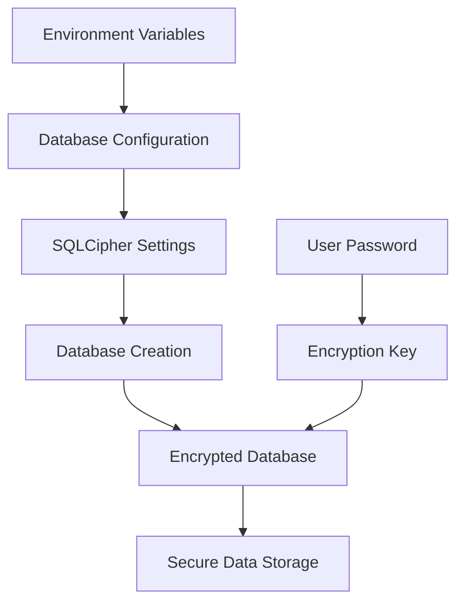
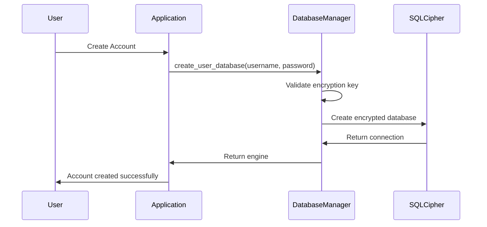
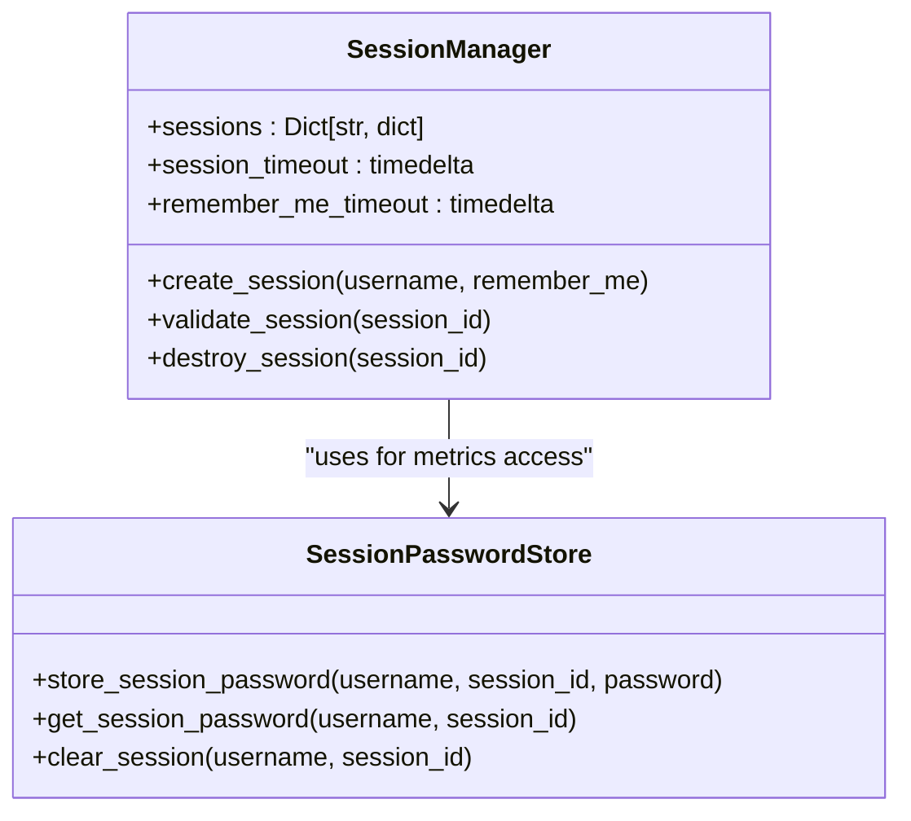
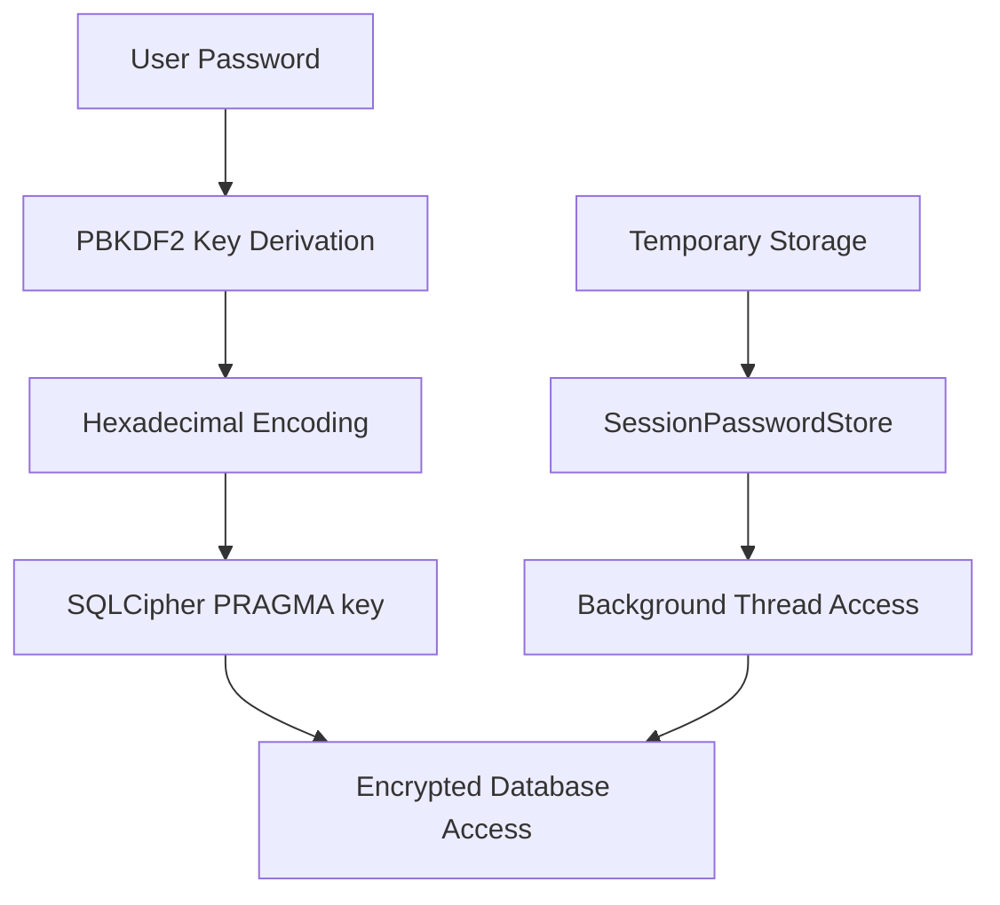
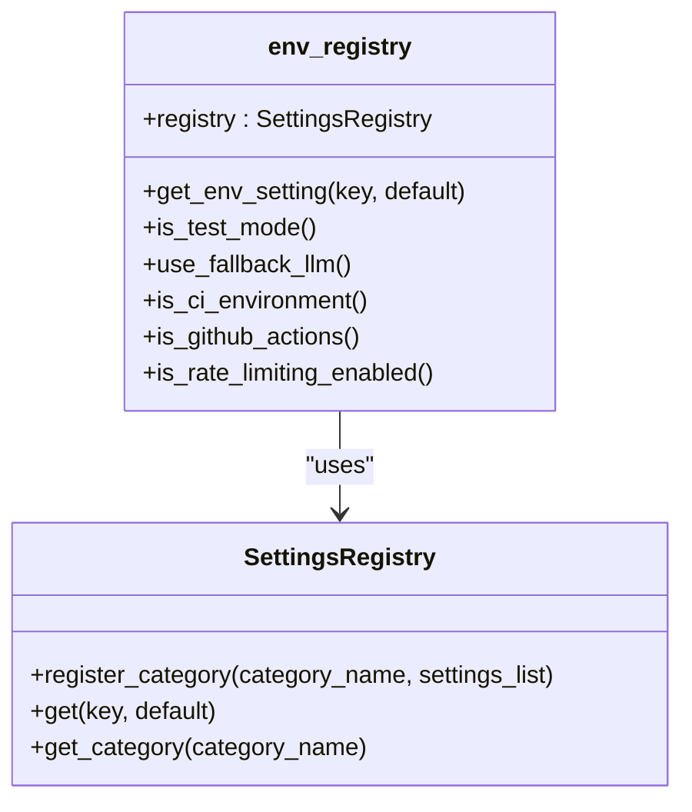
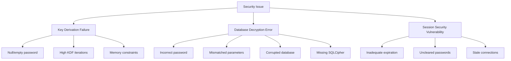
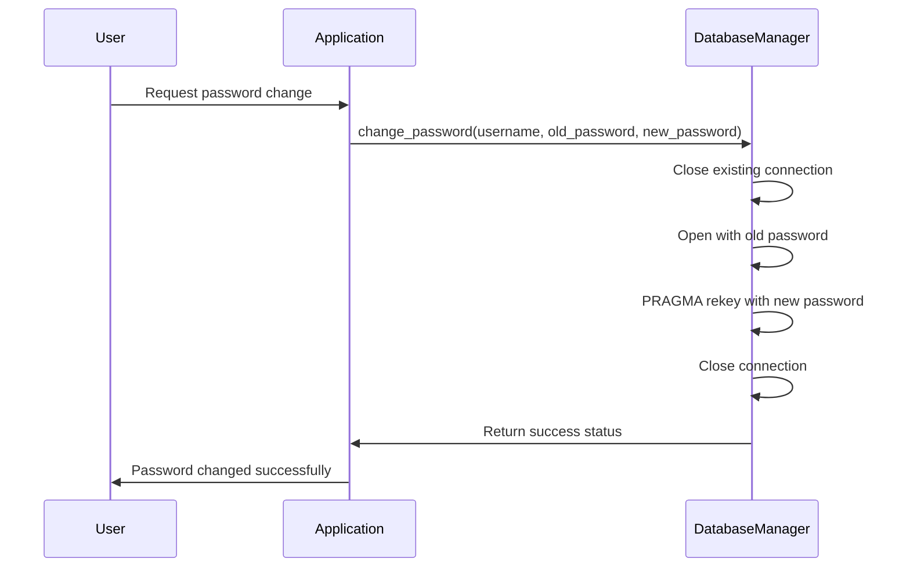

# Security Environment Variables

<cite>
**Referenced Files in This Document**   
- [env_registry.py](file://src/local_deep_research/settings/env_registry.py)
- [encrypted_db.py](file://src/local_deep_research/database/encrypted_db.py)
- [sqlcipher_utils.py](file://src/local_deep_research/database/sqlcipher_utils.py)
- [sqlcipher_compat.py](file://src/local_deep_research/database/sqlcipher_compat.py)
- [db_config.py](file://src/local_deep_research/settings/env_definitions/db_config.py)
- [security.py](file://src/local_deep_research/settings/env_definitions/security.py)
- [session_passwords.py](file://src/local_deep_research/database/session_passwords.py)
- [session_manager.py](file://src/local_deep_research/web/auth/session_manager.py)
- [settings_security.json](file://src/local_deep_research/defaults/settings_security.json)
</cite>

## Table of Contents
1. [Introduction](#introduction)
2. [Core Security Environment Variables](#core-security-environment-variables)
3. [SQLCipher Integration](#sqlcipher-integration)
4. [Zero-Knowledge Architecture](#zero-knowledge-architecture)
5. [Key Generation and Storage Practices](#key-generation-and-storage-practices)
6. [Environment Registry Validation](#environment-registry-validation)
7. [Common Security Issues](#common-security-issues)
8. [Key Rotation and Compliance](#key-rotation-and-compliance)
9. [Deployment Environment Considerations](#deployment-environment-considerations)

## Introduction
This document provides comprehensive guidance on security-related environment variables within the Local Deep Research system. The security model centers around SQLCipher-encrypted databases with a zero-knowledge architecture, where user passwords serve as encryption keys. This approach ensures that sensitive data, including API keys and research content, remains protected at rest. The system relies on environment variables to configure encryption parameters, validate security settings, and manage session security. Understanding these variables is critical for maintaining data confidentiality and system integrity across different deployment scenarios.

**Section sources**
- [env_registry.py](file://src/local_deep_research/settings/env_registry.py#L1-L112)
- [encrypted_db.py](file://src/local_deep_research/database/encrypted_db.py#L1-L621)

## Core Security Environment Variables
The system utilizes several critical environment variables to control security behavior and encryption parameters. These variables are registered through the env_registry system and validated during application startup.

### ENCRYPTION_KEY and SECURITY_LEVEL
The `ENCRYPTION_KEY` variable is not directly used in the current implementation, as user passwords serve as the encryption keys for SQLCipher databases. However, the system does utilize bootstrap-level encryption variables such as `LDR_BOOTSTRAP_ENCRYPTION_KEY` for initial setup processes. The `SECURITY_LEVEL` concept is implemented through various configuration parameters that control the strength of encryption and database security settings.

### Database Encryption Variables
The following environment variables control SQLCipher encryption parameters:

- **LDR_DB_KDF_ITERATIONS**: Number of key derivation function iterations (default: 256000). Higher values increase security but also increase database opening time.
- **LDR_DB_PAGE_SIZE**: Database page size in bytes (default: 16384). Affects performance and memory usage.
- **LDR_DB_HMAC_ALGORITHM**: HMAC algorithm for database integrity (default: HMAC_SHA512).
- **LDR_DB_KDF_ALGORITHM**: Key derivation function algorithm (default: PBKDF2_HMAC_SHA512).

These variables must be set before database creation, as they cannot be changed afterward without recreating the database.

### Session Security Variables
Session management and security are controlled by variables that affect authentication and session persistence:

- **LDR_DB_CACHE_SIZE_MB**: Cache size in megabytes (default: 64). Affects database performance.
- **LDR_DB_JOURNAL_MODE**: Journal mode (default: WAL). Controls how transactions are handled.
- **LDR_DB_SYNCHRONOUS**: Synchronous mode (default: NORMAL). Affects durability vs. performance trade-offs.

**Diagram sources**
- [sqlcipher_utils.py](file://src/local_deep_research/database/sqlcipher_utils.py#L118-L133)
- [db_config.py](file://src/local_deep_research/settings/env_definitions/db_config.py#L55-L71)

**Section sources**
- [db_config.py](file://src/local_deep_research/settings/env_definitions/db_config.py#L1-L73)
- [sqlcipher_utils.py](file://src/local_deep_research/database/sqlcipher_utils.py#L90-L133)

## SQLCipher Integration
The system integrates with SQLCipher to provide transparent database encryption, ensuring that all user data is protected at rest. This integration is critical for maintaining the zero-knowledge security model.

### Database Manager Implementation
The `DatabaseManager` class handles the creation and management of encrypted databases for each user. It checks for SQLCipher availability during initialization and falls back to unencrypted SQLite if SQLCipher is not available (when explicitly allowed by the `LDR_ALLOW_UNENCRYPTED` environment variable).

When creating a new user database, the system:
1. Validates the encryption key (user password)
2. Creates the database file with SQLCipher
3. Applies encryption-specific PRAGMA settings
4. Initializes the database schema

The connection process uses a custom connection creator function that sets the encryption key using hexadecimal encoding, preventing SQL injection issues with special characters in passwords.

### PRAGMA Configuration
SQLCipher settings are applied through PRAGMA statements that configure encryption parameters:

- `PRAGMA key`: Sets the encryption key using hexadecimal encoding
- `PRAGMA kdf_iter`: Configures the number of key derivation iterations
- `PRAGMA cipher_page_size`: Sets the database page size
- `PRAGMA cipher_hmac_algorithm`: Specifies the HMAC algorithm for integrity checking

Performance-related PRAGMAs are also applied, including cache size, journal mode, and synchronous settings, which can be configured through environment variables.

**Diagram sources**
- [encrypted_db.py](file://src/local_deep_research/database/encrypted_db.py#L179-L322)
- [sqlcipher_utils.py](file://src/local_deep_research/database/sqlcipher_utils.py#L136-L159)

**Section sources**
- [encrypted_db.py](file://src/local_deep_research/database/encrypted_db.py#L1-L621)
- [sqlcipher_utils.py](file://src/local_deep_research/database/sqlcipher_utils.py#L1-L267)

## Zero-Knowledge Architecture
The system implements a zero-knowledge architecture where the application server never has access to plaintext user data. This is achieved through client-side encryption using SQLCipher, with user passwords serving as encryption keys.

### Password as Encryption Key
In this architecture, the user's password is not stored or hashed on the server. Instead, it is used directly as the encryption key for the user's database. This means:

- The application cannot recover user data if the password is lost
- Passwords are not stored in any form on the server
- Database files are unreadable without the correct password
- Even administrators with server access cannot read user data

This approach eliminates the need for traditional password hashing and salting, as the password itself is the encryption key.

### Session Management
The session management system is designed to work with the zero-knowledge architecture. When a user logs in, their password is temporarily stored in memory to allow background threads to access the encrypted database for metrics and logging purposes.

The `SessionPasswordStore` class provides temporary in-memory storage of passwords for active sessions. This storage is:
- Kept only for the duration of the session
- Cleared on logout
- Used exclusively for metrics writing, not for user data access
- Stored in plain text in memory (as encryption would provide no additional security benefit)

**Diagram sources**
- [session_manager.py](file://src/local_deep_research/web/auth/session_manager.py#L15-L118)
- [session_passwords.py](file://src/local_deep_research/database/session_passwords.py#L23-L95)

**Section sources**
- [session_manager.py](file://src/local_deep_research/web/auth/session_manager.py#L1-L118)
- [session_passwords.py](file://src/local_deep_research/database/session_passwords.py#L1-L96)

## Key Generation and Storage Practices
Proper key generation and storage practices are essential for maintaining the security of the system. The implementation follows industry best practices for cryptographic key management.

### Key Derivation
The system uses PBKDF2 (Password-Based Key Derivation Function 2) with HMAC-SHA512 to derive encryption keys from user passwords. This process:

- Uses a high number of iterations (configurable via LDR_DB_KDF_ITERATIONS)
- Applies a placeholder salt (PBKDF2_PLACEHOLDER_SALT) for key stretching
- Generates a secure key that is then used by SQLCipher

The key derivation process is cached to avoid redundant computation when the same password is used multiple times during a session.

### Secure Storage
Encryption keys are never stored on disk. They are kept in memory only for the duration of database connections and are cleared when connections are closed. For background thread access to encrypted databases (for metrics writing), passwords are temporarily stored in the `SessionPasswordStore`, which:

- Keeps passwords in memory only
- Automatically expires entries after a configurable TTL
- Clears passwords on session logout
- Is used exclusively for non-sensitive operations like metrics logging

### Key Validation
The system includes robust validation of encryption keys:
- Checks for null or empty passwords
- Verifies that the key can successfully decrypt the database
- Validates database integrity using PRAGMA quick_check and PRAGMA cipher_integrity_check

**Diagram sources**
- [sqlcipher_utils.py](file://src/local_deep_research/database/sqlcipher_utils.py#L15-L43)
- [session_passwords.py](file://src/local_deep_research/database/session_passwords.py#L23-L95)

**Section sources**
- [sqlcipher_utils.py](file://src/local_deep_research/database/sqlcipher_utils.py#L1-L267)
- [session_passwords.py](file://src/local_deep_research/database/session_passwords.py#L1-L96)

## Environment Registry Validation
The env_registry system provides a centralized mechanism for managing and validating environment variables, ensuring that security-critical settings are properly configured.

### Registry Implementation
The global registry is created during application startup and registers all environment settings defined in the env_definitions subfolder. The registry provides:

- Centralized access to environment settings
- Default values for optional settings
- Type validation for setting values
- Convenience functions for common checks (e.g., is_test_mode)

The registry is implemented as a singleton, ensuring consistent access to environment settings throughout the application.

### Security Setting Validation
Security-related environment variables are validated through the registry system. For example, the `is_rate_limiting_enabled` function checks the `DISABLE_RATE_LIMITING` environment variable to determine whether rate limiting should be enabled.

The system also validates external environment variables like `CI` and `GITHUB_ACTIONS` to adjust behavior in different environments. These checks are performed dynamically at runtime rather than being cached, ensuring that environment changes are immediately reflected in application behavior.

### Configuration Management
The registry system separates environment-only settings from user-editable settings. Database encryption parameters are environment-only, as they cannot be changed after database creation. Other security settings, like rate limiting configurations, are defined in JSON files and can be modified through the user interface.

**Diagram sources**
- [env_registry.py](file://src/local_deep_research/settings/env_registry.py#L14-L26)
- [env_settings.py](file://src/local_deep_research/settings/env_settings.py)

**Section sources**
- [env_registry.py](file://src/local_deep_research/settings/env_registry.py#L1-L112)

## Common Security Issues
Several common security issues can arise when configuring and using the security environment variables. Understanding these issues is critical for maintaining system security.

### Key Derivation Failures
Key derivation failures typically occur when:
- The user password is null or empty
- The KDF iteration count is too high for the system's capabilities
- There are memory constraints during key derivation

The system validates encryption keys before use and provides clear error messages when invalid keys are detected. To prevent key derivation failures, ensure that passwords are properly validated before being passed to database functions.

### Database Decryption Errors
Database decryption errors can occur due to:
- Incorrect passwords
- Mismatched encryption parameters between database creation and access
- Corrupted database files
- Missing or improperly installed SQLCipher libraries

The system includes comprehensive error handling for decryption errors, including:
- Verification of database integrity using PRAGMA cipher_integrity_check
- Clear error messages that distinguish between authentication failures and database corruption
- Fallback mechanisms when SQLCipher is not available

### Session Security Vulnerabilities
Session security vulnerabilities can arise from:
- Inadequate session expiration policies
- Failure to clear session passwords on logout
- Stale sessions that maintain database connections

The system mitigates these risks through:
- Automatic cleanup of stale sessions
- Short session timeouts (2 hours by default)
- Extended timeouts only for "remember me" sessions (30 days)
- Forced re-authentication when database connections are lost

**Diagram sources**
- [encrypted_db.py](file://src/local_deep_research/database/encrypted_db.py#L56-L66)
- [session_manager.py](file://src/local_deep_research/web/auth/session_manager.py#L20-L23)
- [session_cleanup.py](file://src/local_deep_research/web/auth/session_cleanup.py#L12-L48)

**Section sources**
- [encrypted_db.py](file://src/local_deep_research/database/encrypted_db.py#L1-L621)
- [session_manager.py](file://src/local_deep_research/web/auth/session_manager.py#L1-L118)
- [session_cleanup.py](file://src/local_deep_research/web/auth/session_cleanup.py#L1-L48)

## Key Rotation and Compliance
Key rotation and compliance with security best practices are essential for maintaining long-term security.

### Key Rotation Process
The system supports password changes (which effectively rotate encryption keys) through the `change_password` method in the `DatabaseManager` class. This process:
1. Closes any existing database connections
2. Opens the database with the old password
3. Uses SQLCipher's PRAGMA rekey to change the encryption key
4. Closes the connection to ensure the new key is used

Key rotation should be performed regularly as part of security best practices, especially if there is any suspicion of password compromise.

### Compliance Considerations
To maintain compliance with security best practices:
- Use strong passwords with sufficient length and complexity
- Set appropriate KDF iteration counts to balance security and performance
- Regularly update and patch the SQLCipher library
- Monitor for and address any security vulnerabilities in dependencies
- Implement proper backup procedures that maintain encryption

The system's zero-knowledge architecture helps meet compliance requirements by ensuring that user data remains confidential even if the server is compromised.

**Diagram sources**
- [encrypted_db.py](file://src/local_deep_research/database/encrypted_db.py#L480-L518)

**Section sources**
- [encrypted_db.py](file://src/local_deep_research/database/encrypted_db.py#L480-L518)

## Deployment Environment Considerations
Security configuration must be adapted to different deployment environments to balance security and usability.

### Development and Testing
In development and testing environments:
- Consider using lower KDF iteration counts to improve performance
- Enable test mode through environment variables
- Use the `LDR_ALLOW_UNENCRYPTED` variable only when necessary for debugging
- Ensure that test data does not contain sensitive information

### Production
In production environments:
- Use high KDF iteration counts (e.g., 256000 or higher)
- Ensure SQLCipher is properly installed and configured
- Set appropriate rate limiting to prevent brute force attacks
- Use HTTPS to protect data in transit
- Implement proper backup procedures that maintain encryption

### Containerized Deployments
For containerized deployments (e.g., Docker, Unraid):
- Set environment variables through container configuration
- Ensure persistent storage for encrypted databases
- Use volume mounts to preserve data across container restarts
- Consider using secrets management for sensitive environment variables

The system's environment variable-based configuration makes it well-suited for containerized deployments, allowing security settings to be configured without modifying application code.

**Section sources**
- [env_registry.py](file://src/local_deep_research/settings/env_registry.py#L44-L72)
- [encrypted_db.py](file://src/local_deep_research/database/encrypted_db.py#L113-L140)
- [security.py](file://src/local_deep_research/settings/env_definitions/security.py#L17-L23)