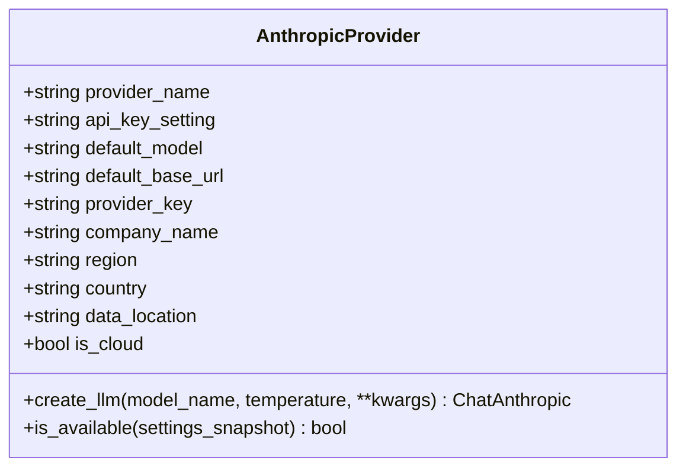
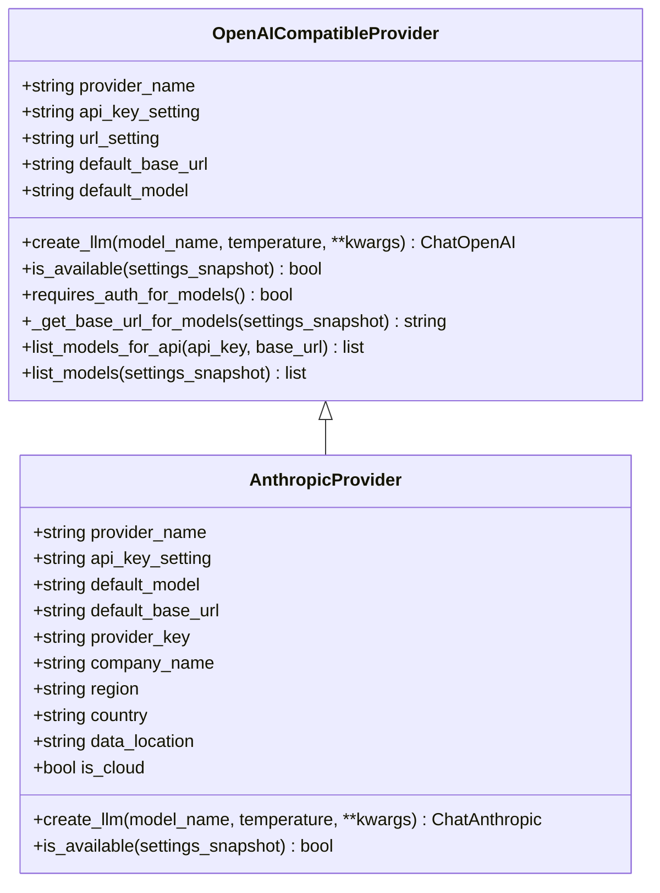
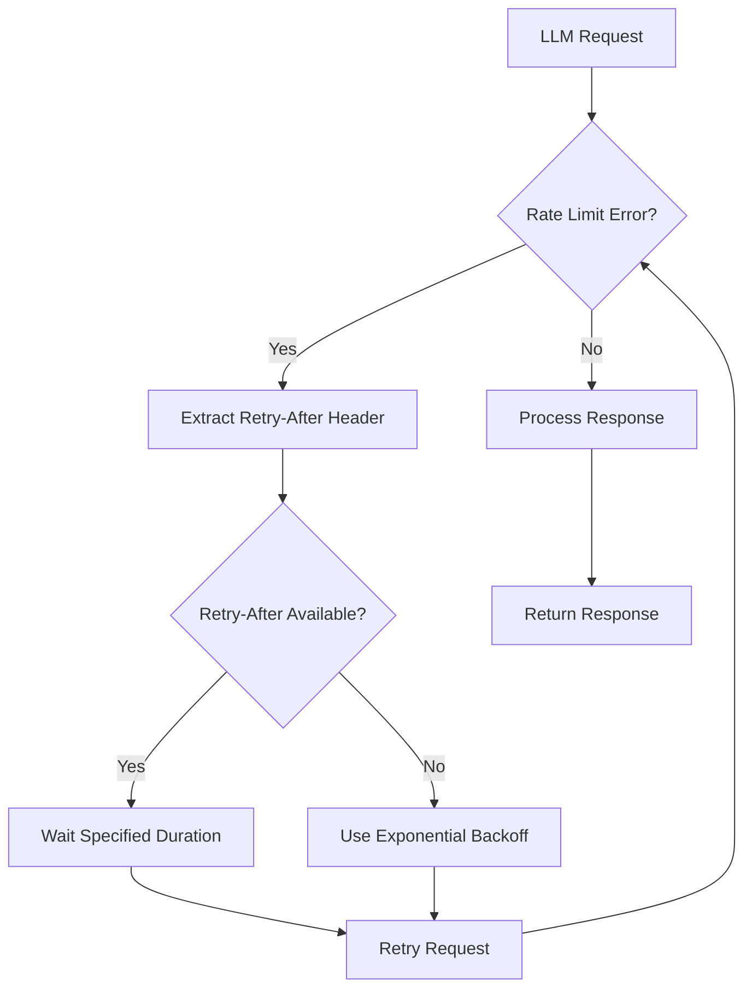

# Anthropic Configuration

<cite>
**Referenced Files in This Document**   
- [anthropic.py](file://src/local_deep_research/llm/providers/implementations/anthropic.py)
- [default_settings.json](file://src/local_deep_research/defaults/default_settings.json)
- [settings_routes.py](file://src/local_deep_research/web/routes/settings_routes.py)
- [openai_base.py](file://src/local_deep_research/llm/providers/openai_base.py)
- [thread_settings.py](file://src/local_deep_research/config/thread_settings.py)
</cite>

## Table of Contents
1. [Introduction](#introduction)
2. [Configuration Parameters](#configuration-parameters)
3. [Authentication Setup](#authentication-setup)
4. [Implementation Details](#implementation-details)
5. [Provider-Specific Features](#provider-specific-features)
6. [Advanced Configurations](#advanced-configurations)
7. [Security Considerations](#security-considerations)

## Introduction
This document provides comprehensive guidance for configuring Anthropic as a cloud LLM provider within the Local Deep Research system. It covers configuration parameters, authentication methods, implementation details, and security best practices for integrating Anthropic's Claude models into your workflow.

**Section sources**
- [anthropic.py](file://src/local_deep_research/llm/providers/implementations/anthropic.py#L1-L162)

## Configuration Parameters
The Anthropic provider requires specific configuration parameters to establish connectivity and define behavior. These parameters include API credentials, model identifiers, and endpoint settings.

### Required Configuration Parameters
The following parameters are essential for Anthropic provider configuration:

- **API Key Setting**: `llm.anthropic.api_key` - The API key for authenticating with Anthropic services
- **Base URL**: `https://api.anthropic.com/v1` - The default endpoint for Anthropic API requests
- **Default Model**: `claude-3-sonnet-20240229` - The default model used when no specific model is specified
- **Provider Name**: "Anthropic" - The display name for the provider
- **Provider Key**: "ANTHROPIC" - The internal identifier for the provider

### Available Model Identifiers
The system supports multiple Anthropic model variants, including:
- `claude-3-5-sonnet-latest` - Latest version of Claude 3.5 Sonnet
- `claude-3-opus-20240229` - Claude 3 Opus model
- `claude-3-sonnet-20240229` - Claude 3 Sonnet model
- `claude-2` - Previous generation Claude model

The system automatically discovers available models by querying the Anthropic API when the provider is configured.



**Diagram sources**
- [anthropic.py](file://src/local_deep_research/llm/providers/implementations/anthropic.py#L26-L126)

**Section sources**
- [anthropic.py](file://src/local_deep_research/llm/providers/implementations/anthropic.py#L32-L36)
- [default_settings.json](file://src/local_deep_research/defaults/default_settings.json#L411-L417)
- [settings_routes.py](file://src/local_deep_research/web/routes/settings_routes.py#L1312-L1335)

## Authentication Setup
Authentication for the Anthropic provider can be configured through environment variables or JSON configuration files, providing flexibility for different deployment scenarios.

### Environment Variable Configuration
The system supports two environment variable formats for Anthropic API key configuration:

- `ANTHROPIC_API_KEY` - Standard environment variable name
- `LDR_LLM_ANTHROPIC_API_KEY` - Project-specific environment variable name

To configure via environment variables, set the appropriate variable before starting the application:

```bash
export ANTHROPIC_API_KEY=your-api-key-here
export LDR_ANTHROPIC_API_KEY=your-api-key-here
```

For Windows systems:
```cmd
set ANTHROPIC_API_KEY=your-key-here
set LDR_ANTHROPIC_API_KEY=your-key-here
```

### JSON Configuration File Setup
The Anthropic API key can also be configured in JSON settings files. The key should be stored under the `llm.anthropic.api_key` setting in the configuration:

```json
{
    "llm.anthropic.api_key": "your-api-key-here"
}
```

The system checks for the API key in the following order:
1. Environment variables (`ANTHROPIC_API_KEY` or `LDR_LLM_ANTHROPIC_API_KEY`)
2. JSON configuration files
3. Web interface settings

If the API key is not found in any of these locations, the provider will be unavailable and an error will be raised.

**Section sources**
- [anthropic.py](file://src/local_deep_research/llm/providers/implementations/anthropic.py#L62-L74)
- [env_configuration.md](file://docs/env_configuration.md#L54-L78)
- [docker-compose.yml](file://docker-compose.yml#L82)

## Implementation Details
The Anthropic provider implementation extends the base provider class and incorporates several features for robust operation, including rate limiting and request timeout management.

### Provider Class Inheritance
The Anthropic provider extends the `OpenAICompatibleProvider` base class, inheriting common functionality while implementing Anthropic-specific features:



**Diagram sources**
- [anthropic.py](file://src/local_deep_research/llm/providers/implementations/anthropic.py#L26-L126)
- [openai_base.py](file://src/local_deep_research/llm/providers/openai_base.py#L25-L340)

### Rate Limiting Implementation
The system includes rate limiting detection for Anthropic API calls. When rate limit errors are detected, the system implements exponential backoff strategies to handle API limitations gracefully.

The rate limiting detection checks for specific error patterns in Anthropic responses:
- Error messages containing "rate_limit"
- HTTP 429 status codes
- Messages containing "too many"



**Diagram sources**
- [detection.py](file://src/local_deep_research/web_search_engines/rate_limiting/llm/detection.py#L57-L64)
- [wrapper.py](file://src/local_deep_research/web_search_engines/rate_limiting/llm/wrapper.py#L49-L81)

### Request Timeout Management
The system handles request timeouts through the underlying LangChain implementation. While specific timeout values are not explicitly configured in the Anthropic provider, the system inherits timeout handling from the base provider class.

The request timeout is managed through the `request_timeout` parameter, which can be configured in the settings. If not specified, the system uses default timeout values from the LangChain library.

**Section sources**
- [anthropic.py](file://src/local_deep_research/llm/providers/implementations/anthropic.py#L80-L104)
- [openai_base.py](file://src/local_deep_research/llm/providers/openai_base.py#L128-L138)

## Provider-Specific Features
The Anthropic provider implementation includes several features specific to the Anthropic service, enhancing reliability and usability.

### Maximum Retry Attempts
The system supports configurable maximum retry attempts for Anthropic API calls. This parameter can be set through the `llm.max_retries` setting in the configuration:

```python
try:
    max_retries = get_setting_from_snapshot(
        "llm.max_retries",
        default=None,
        settings_snapshot=settings_snapshot,
    )
    if max_retries is not None:
        anthropic_params["max_retries"] = max_retries
except NoSettingsContextError:
    pass  # Optional parameter
```

### Custom Headers
While the current implementation does not explicitly set custom headers for Anthropic requests, the system architecture allows for header customization through the underlying LangChain ChatAnthropic class. Custom headers can be added by extending the provider class or modifying the initialization parameters.

### Availability Checking
The provider includes a built-in availability check that verifies whether the Anthropic API key is properly configured:

```python
@classmethod
def is_available(cls, settings_snapshot=None):
    """Check if this provider is available.
    
    Args:
        settings_snapshot: Optional settings snapshot to use
        
    Returns:
        True if API key is configured, False otherwise
    """
    try:
        # Check if API key is configured
        api_key = get_setting_from_snapshot(
            cls.api_key_setting,
            default=None,
            settings_snapshot=settings_snapshot,
        )
        return bool(api_key)
    except Exception:
        return False
```

**Section sources**
- [anthropic.py](file://src/local_deep_research/llm/providers/implementations/anthropic.py#L106-L125)
- [openai_base.py](file://src/local_deep_research/llm/providers/openai_base.py#L117-L126)

## Advanced Configurations
The system supports advanced configuration options for the Anthropic provider, including proxy settings and custom base URLs.

### Proxy Settings
Proxy configuration can be achieved by setting a custom base URL that routes through the proxy server. This allows the system to operate in environments with restricted internet access.

### Custom Base URLs
While the default base URL is set to `https://api.anthropic.com/v1`, this can be overridden by modifying the provider implementation or through configuration settings. Custom base URLs are useful for:
- Testing with mock Anthropic services
- Routing through internal proxy servers
- Using alternative Anthropic endpoints

The base URL is defined as a class attribute in the AnthropicProvider class:

```python
default_base_url = "https://api.anthropic.com/v1"
```

**Section sources**
- [anthropic.py](file://src/local_deep_research/llm/providers/implementations/anthropic.py#L35)
- [openai_base.py](file://src/local_deep_research/llm/providers/openai_base.py#L36)

## Security Considerations
Proper security practices are essential when configuring and using Anthropic services, particularly regarding API key storage and transmission.

### API Key Storage
API keys should never be stored in plaintext in code repositories. The system provides multiple secure storage options:

1. **Environment Variables**: Store keys in environment variables that are not committed to version control
2. **Configuration Files**: Store keys in JSON configuration files with restricted file permissions
3. **Web Interface**: Enter keys through the web interface, where they are stored securely in the database

The system masks API keys in logs and user interfaces to prevent accidental exposure.

### API Key Transmission
All communication with the Anthropic API occurs over HTTPS, ensuring encrypted transmission of API keys and data. The system validates SSL certificates by default to prevent man-in-the-middle attacks.

### Security Best Practices
Follow these best practices for securing Anthropic API keys:

1. **Use Environment Variables**: Prefer environment variables over configuration files when possible
2. **Restrict File Permissions**: Ensure configuration files containing API keys have restrictive file permissions (e.g., 600)
3. **Rotate Keys Regularly**: Periodically rotate API keys to minimize the impact of potential leaks
4. **Use Short-Lived Keys**: When available, use short-lived or temporary credentials
5. **Monitor Usage**: Regularly monitor API usage patterns for suspicious activity

The system includes additional security features such as:
- Input validation to prevent injection attacks
- Rate limiting to prevent abuse
- Secure session management
- Encrypted database storage for sensitive information

**Section sources**
- [anthropic.py](file://src/local_deep_research/llm/providers/implementations/anthropic.py#L69-L74)
- [security_headers.py](file://src/local_deep_research/security/security_headers.py)
- [safe_requests.py](file://src/local_deep_research/security/safe_requests.py)